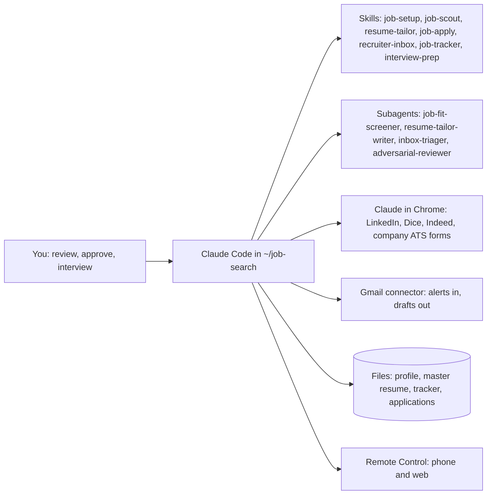

# 1. What you're building

You set up Claude Code as a job-search assistant: it finds fresh US AI roles, tailors your resume to each one, fills the application in your own logged-in browser, logs everything in a tracker, and drafts replies to recruiters — while you approve what gets sent.

It is built from a few plain files you can read and edit, not a black box:

| Part | What it does | Where it lives |
| --- | --- | --- |
| Claude Code | The agent: runs in your terminal, reads and writes files, calls tools | `claude` command |
| `CLAUDE.md` | Standing rules: honesty, freshness, daily caps, what it must never do | `~/job-search/CLAUDE.md` |
| Skills | Step-by-step playbooks: setup, scout, tailor, apply, inbox, tracker, interview prep. `/job-setup` and `/job-apply` run only when you type them; Claude never starts them on its own | `~/.claude/skills/<name>/SKILL.md` |
| Subagents | Helpers with their own context window: fit screening, resume tailoring, inbox triage, adversarial review | `~/.claude/agents/*.md` |
| Permission rules | What runs without asking, what asks first (`git push`), what is denied outright (sending, replying or forwarding Gmail; reading `~/.ssh` and `~/.aws`; `rm -rf`) | `~/job-search/.claude/settings.json` |
| Scripts | `tracker.py` (the pipeline CSV) and `tailor_resume.py` (resume surgery, PDF export, page and number checks), run with the workspace's own Python (`.venv/bin/python scripts/...`) | `~/job-search/scripts/`, `~/job-search/.venv/` |
| Claude in Chrome | Drives LinkedIn, Dice, Indeed and company application forms inside your own Chrome | Chrome extension + `claude --chrome` |
| Gmail connector | Reads job alerts and recruiter mail under two labels, prepares reply drafts | claude.ai connector, listed in `/mcp` |
| Truth file, answers bank, master resume, tracker | Your facts, your screening answers, your 2-page resume, one row per job | `~/job-search/profile/`, `~/job-search/tracker/` |

The agent runs in one of two modes, set by `limits.mode` in `profile.yaml`:

- **Review mode (default):** it fills every form and stops on the final review screen; you look, then click Submit yourself or reply "submit <id>".
- **Auto mode:** it submits on its own within the daily caps, except on Indeed, where it only ever prefills. Switch this on only after a week of clean reviews, and read *Guardrails* first — some sites forbid automated applying.

Background knowledge for the roles (the platform landscape, RAG, knowledge graphs, conversational AI, observability and the interview topics) is in Parts 2 to 4 of this book.

