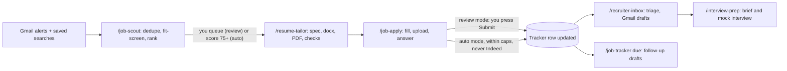

# 8. The daily loop

The loop is six commands and about thirty minutes a day. Every command is a skill in the kit; every command leaves files behind that you can open.

**Morning, ten minutes.** Start `claude` in `~/job-search` (Chrome open and logged in) and type `/job-scout`. The skill reads yesterday's alert mail from `Jobs/Alerts`, runs your saved searches on LinkedIn, Dice and Indeed through Chrome (titles from `profile.yaml`, remote, United States, posted in the last 48 hours), removes anything already in the tracker, and hands every new posting to the `job-fit-screener` subagent. The screener reads the job description and returns a score from 0 to 100 with reasons: must-have coverage against your skill-years table, work-authorization and employment-model fit, rate or salary if stated, remote or not, and any exclusion phrase ("US citizens only", "W2 only", "onsite"). The result is `scouting/<date>.json` and a table in the terminal: id, company, title, platform, posted, score, blockers. You say which ones to pursue ("queue 1, 3, 4 and 7") — in auto mode everything scoring 75 or more is queued automatically, up to the daily cap.

**Tailor, five minutes of your attention.** `/resume-tailor queued` builds one package per queued job in `applications/<date>/<company-role>/`: `jd.md` (the posting as captured), `fit.md` (must-haves mapped to your evidence), `resume.docx` and `resume.pdf` (headline, three bullets and keyword order changed, nothing else), `cover.txt` (150 words: fit, evidence, logistics) and `answers.md` (the screening answers it expects to need, taken from the bank, with any unanswerable question marked). The `resume-tailor-writer` subagent does the writing; the script `tailor_resume.py` does the document surgery and the two-page check. Open one package the first few days to see that it reads like you.

**Apply.** `/job-apply queued` walks each package through the platform playbook (next section). In review mode it fills everything, uploads the tailored PDF, answers the screening questions, unticks marketing consents, and stops on the final review screen with *"Ready: Acme — FDE. Press Submit in Chrome or say 'submit'."* You look for ten seconds and submit. In auto mode it submits and moves on, stopping only for a question outside the answers bank, a CAPTCHA, a login, or a consent checkbox it has no rule for. Either way the tracker row is updated immediately with status, date, the files used and the posting URL. Ten to fifteen well-matched applications a day beats fifty sprayed ones; the cap in `profile.yaml` enforces it.

**Inbox and tracker, five minutes.** `/recruiter-inbox` triages new mail under `Jobs/Recruiters` and leaves Gmail drafts for you to send. `/job-tracker` prints the pipeline (applied, replied, screen, interview, offer, rejected), what is due today, and a weekly funnel. Follow-ups are automatic in the sense that the tracker computes them (seven days after applying, three days after an interview) and the skill drafts the message; sending them is still your click.

**Weekly, twenty minutes.** `/job-tracker stats` shows reply rates by platform and by title, which tells you what to change in `profile.yaml` (titles, keywords, rate) and in the master resume. Before any call, `/interview-prep <id>` builds a one-page brief from `jd.md`, `fit.md`, the company's site and the Knowledge tab's question bank.

**The exact prompts, in case you prefer natural language to slash commands:**

| Goal | Type this |
| --- | --- |
| Scout | `/job-scout` or "Find FDE and AI Engineer roles posted in the last 48 hours, remote US, on LinkedIn, Dice, Indeed and my alert mail; score them and show the top 20." |
| Tailor one | `/resume-tailor dice-7741921` or "Tailor my resume for the Acme FDE posting I queued." |
| Apply with review | `/job-apply dice-7741921` or "Apply to dice-7741921 in review mode and stop before submitting." |
| Apply in bulk | "Apply to everything queued today, review mode, one at a time." |
| Inbox | `/recruiter-inbox` or "Read new recruiter mail and draft replies; do not send anything." |
| Follow-ups | `/job-tracker due` or "What follow-ups are due today? Draft them." |
| Pipeline | `/job-tracker` or "Show my pipeline and this week's reply rate by platform." |
| Interview | `/interview-prep acme-fde` |

IDs are the platform prefix plus the posting id (`li-4471502960`, `dice-7741921`, `indeed-a1b2c3`, `ats-acme-fde`); the same id names the application folder and the tracker row, so nothing gets lost between steps.

