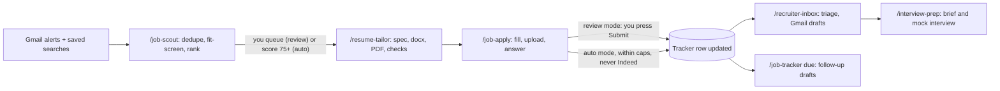

# 8. The daily loop

The loop is six commands and about thirty minutes a day. Every command is a skill in the kit; every command leaves files behind that you can open.

**Morning, ten minutes.** Start `claude --chrome` in `~/job-search` (or plain `claude` if you enabled Chrome by default; Chrome open and logged in) and type `/job-scout`. The skill reads the last day's alert mail from `Jobs/Alerts`, runs your searches on LinkedIn, Dice and Indeed through Chrome (titles from `profile.yaml`, remote, United States, posted within `max_posting_age_hours`, 48 by default), drops stale, excluded and below-floor postings, removes anything already in the tracker (`tracker.py dupe-check`; the same role posted by several agencies counts once), and hands every new posting to the `job-fit-screener` subagent. The screener reads the job description and returns a score from 0 to 100 with reasons: must-have coverage against your resume and skill-years table, work-authorization and employment-model fit, rate or salary if stated, remote or not, and any exclusion phrase ("US citizens only", "W2 only", "onsite"). Every posting gets a tracker row (`screened`, or `skipped` with the reason), and the result is `scouting/<date>.json` and a ranked table in the terminal: id, company, role, platform, employment, pay, age, score, blockers. In review mode you say which ones to pursue ("queue li-4012345678 and the top three") and they become `queued`; in auto mode everything scoring 75 or more with no blockers is queued, best first, up to the room left under the daily cap.

**Tailor, five minutes of your attention.** `/resume-tailor queued` builds one package for every row with status `queued`, in `applications/<date>/<id>/`: `jd.md` (the posting as captured), `fit.md` (must-haves mapped to your evidence, with gaps), `spec.json` (the replacement texts), the tailored resume as .docx and .pdf named `<Your Name> - Resume - <Company>` (headline, three profile bullets and skills-line order changed, nothing else), the cover letter as .docx, .pdf and .txt (150 words: fit, evidence, logistics) and `answers.md` (the screening answers it expects to need, taken from the bank, with any unanswerable question marked UNKNOWN). The `resume-tailor-writer` subagent does the writing; the script `tailor_resume.py` does the document surgery, the two-page check and the numbers guard; the row becomes `tailored`. Open one package the first few days to see that it reads like you.

**Apply.** `/job-apply queued` works through the apply queue — despite the word, that means every row with status `tailored`, best fit first; a row still `queued` needs `/resume-tailor` first. For each it runs a pre-flight (files exist, no blockers, no duplicate, room under the caps), then follows the platform playbook (chapter 9). In review mode it fills everything, uploads the tailored PDF, answers the screening questions, leaves marketing and "follow company" boxes unticked, stops on the final review screen, shows you what it entered and sets the row to `ready`. You look for ten seconds and either click Submit yourself or reply "submit <id>". In auto mode it submits and moves on, waiting a random 20–60 seconds between applications (`tracker.py pause`), and anything uncertain — a question outside the answers bank, a consent checkbox you have not approved — becomes `needs-check` instead; a CAPTCHA, a login or an account step always stops and hands over to you. Either way the tracker row is updated immediately with status, date and the files used. Ten to fifteen well-matched applications a day beats fifty sprayed ones; the caps in `profile.yaml` (15 a day in all, 25 on LinkedIn) enforce it.

**Inbox and tracker, five minutes.** `/recruiter-inbox` triages the last three days of mail under `Jobs/Recruiters` and leaves Gmail drafts for you to send. `/job-tracker` prints the pipeline by status (`ready`, `needs-check`, `interview` and `replied`, `queued` and `tailored`) with the next action for each, the follow-ups due today, and "submitted today" against the cap. Follow-ups are automatic in the sense that the tracker computes them — seven days after a row becomes `submitted` — and `/job-tracker due` drafts a message of at most 90 words (a Gmail draft for recruiter threads, otherwise a `follow-up.md` in the posting's folder); sending it is still your click, and once you have, the skill sets the next follow-up date seven days on.

**Weekly, twenty minutes.** `/job-tracker stats` shows applications per week and reply and interview rates by platform, title family and week (any response counts as a reply, and replies lag a week or two), which tells you what to change in `profile.yaml` (titles, keywords, rate) and in the master resume. Before any call, `/interview-prep <id>` builds a one-page brief (`prep.md`) from `jd.md`, `fit.md`, your master resume and the `stories` in `profile.yaml`, and offers a mock interview with critique; chapters 35–43 of this book go deeper.

**The exact prompts, in case you prefer natural language to slash commands:**

| Goal | Type this |
| --- | --- |
| Scout | `/job-scout` or "Find FDE and AI Engineer roles posted in the last 48 hours, remote US, on LinkedIn, Dice, Indeed and my alert mail; score them and show the top 20." |
| Tailor one | `/resume-tailor li-4012345678` or "Tailor my resume for the Acme FDE posting I queued." |
| Apply with review | `/job-apply li-4012345678` — the command only: `/job-apply` (like `/job-setup`) runs only when you type it, so a sentence such as "apply to that job" does not load its playbook |
| Apply in bulk | `/job-apply queued` (every `tailored` row; review mode stops at each final screen) |
| Inbox | `/recruiter-inbox` or "Read new recruiter mail and draft replies; do not send anything." |
| Follow-ups | `/job-tracker due` or "What follow-ups are due today? Draft them." |
| Pipeline | `/job-tracker` or "Show my pipeline and this week's reply rate by platform." |
| Interview | `/interview-prep ats-acme-forward-deployed-engineer` |

IDs are the platform prefix plus the platform's own id: `li-<LinkedIn job id>`, `dice-<Dice job id>` (a long UUID), `indeed-<jk>`, `ats-<company>-<role>` (for example `ats-acme-forward-deployed-engineer`) and `mail-<Gmail thread id>` for leads that arrive by email. The same id names the application folder (`applications/<date>/<id>/`) and the tracker row, so nothing gets lost between steps.

