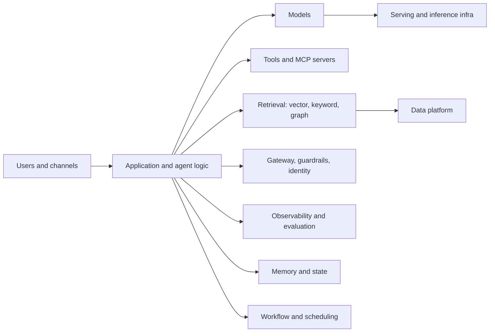

# 14. The AI engineering landscape: one map of everything

> **What you need to be able to say:** when an interviewer names any tool, you should be able to place it in a category, name its two closest alternatives, and say what trade-off it makes. This chapter is the map; the chapters after it go deep on each region. Dates matter in this field — this map was drawn in October 2026 and names will drift; the categories will not.

## 14.1 How to read the map

An LLM application in 2026 is a pipeline of eleven decisions. Each row below is one decision, with the main options. Products move between rows (every cloud sells most rows), but a product is *good* at one or two rows and merely *present* in the rest.

## 14.2 The map, row by row

### Row 1 — Models (chapters 16–17)

- **Frontier, closed-weight, via API:** Anthropic Claude (Fable/Mythos 5.1, Opus 5.5, Sonnet 5.5, Haiku 4.5), OpenAI GPT family (GPT-5.4/5.5/5.6 tiers as of 2026), Google Gemini (3.1 Pro, 3.x Flash and Flash-Lite tiers), xAI Grok. Best capability, no ops, pay per token; the vendor retires versions on roughly a 12-month cadence, so pin dated model IDs.
- **Open-weight:** Meta Llama 4, DeepSeek V4 (Pro and Flash), Qwen 3.8, Mistral Small 4/Medium, Z.ai GLM-5.x, Moonshot Kimi K2/K3, OpenAI gpt-oss, Google Gemma 4, Microsoft Phi. Run anywhere, fine-tune, data never leaves your VPC; you own capacity planning. Licences differ (Apache-2.0/MIT versus community or revenue-gated terms) — chapter 16.
- **Small/edge:** Gemma 4 E2B/E4B, Phi-4-mini, Qwen small variants, Llama 3.2 1B/3B — on-device and latency-critical classification, routing, extraction.
- **Specialists:** embedding models (chapter 18), rerankers (Cohere Rerank, Voyage rerank, BGE-reranker, ColBERT-style late interaction), speech (Whisper and successors, Deepgram, ElevenLabs, Amazon Nova Sonic, Gemini native audio), vision encoders (ViT, SigLIP, CLIP, SAM 2/3), image/video generation (Stable Diffusion/SDXL, FLUX, Imagen, Veo, Sora), world models (V-JEPA 2), time-series foundation models (Chronos, TimesFM, Moirai), code models.

### Row 2 — Serving and inference infrastructure

- **Managed APIs:** the model vendors directly; the clouds (Bedrock, Microsoft Foundry, Google's Gemini Enterprise Agent Platform — formerly Vertex AI); aggregators and routers (OpenRouter, Together, Fireworks, Groq, Cerebras, SambaNova, Baseten, Replicate) that serve open-weight models fast and cheap.
- **Self-hosted engines:** vLLM (the default; PagedAttention, continuous batching, prefix caching), SGLang (RadixAttention, structured generation), TensorRT-LLM (NVIDIA-optimized), Hugging Face TGI, llama.cpp/Ollama (CPU/consumer GPU, GGUF), MLX (Apple silicon), LMDeploy, Ray Serve/KServe for orchestration.
- **Quantization and formats:** FP8, INT8, INT4 (GPTQ, AWQ), GGUF, NF4 for QLoRA; speculative decoding; KV-cache offload. See chapter 16.
- **Hardware:** NVIDIA H100/H200/B200 and the GB200 NVL72 racks; AMD MI300X/MI355X; Google TPU v5p/v6e (Trillium)/v7 (Ironwood); AWS Trainium 2/3 and Inferentia; Apple silicon for local.

### Row 3 — Application and agent logic (chapters 20, 22)

- **Agent frameworks:** LangGraph (and LangChain 1.0), Claude Agent SDK, OpenAI Agents SDK, Google ADK, AWS Strands Agents, Microsoft Agent Framework (Semantic Kernel + AutoGen), CrewAI, PydanticAI, LlamaIndex (Workflows), Haystack, DSPy (programmatic prompt optimization), Mastra and Vercel AI SDK (TypeScript), smolagents (Hugging Face).
- **Managed agent runtimes:** Bedrock AgentCore (Runtime and, since July 2026, the no-code Harness), Google's Agent Runtime (formerly Agent Engine) on the Gemini Enterprise Agent Platform, Microsoft Foundry Agent Service (hosted agents), Claude Managed Agents (public beta April 2026), LangSmith Deployment (formerly LangGraph Platform), Modal/Temporal for durable execution. The 2026 pattern is the **managed harness**: you supply model, instructions, tools and skills; the vendor supplies the loop, sandbox, memory and traces.
- **Low-code / business-user builders:** Microsoft Copilot Studio, Google Gemini Enterprise (formerly Agentspace) and CX Agent Studio, Salesforce Agentforce, ServiceNow AI Agents, n8n, Zapier Agents, Make, Dify, Flowise, Langflow.
- **Coding agents (also products you compete with and borrow from):** Claude Code, OpenAI Codex, Cursor, GitHub Copilot agent, Devin, Gemini CLI, Aider, Cline, Windsurf.

### Row 4 — Tools, protocols, and integration

- **MCP (Model Context Protocol):** the standard for tools, resources and prompts; thousands of servers (GitHub, Slack, Postgres, Playwright, filesystem, cloud CLIs); remote servers over streamable HTTP with OAuth 2.1; gateways (AgentCore Gateway, Docker MCP Gateway, Kong/Apigee MCP plugins) and registries. Governed by the Agentic AI Foundation (Linux Foundation) since December 2025. Spec revisions matter: 2025-06-18 (structured tool output, elicitation, OAuth resource indicators), 2025-11-25 (experimental tasks, URL-mode elicitation, Client ID Metadata Documents) and 2026-07-28 (stateless transport without sessions or an `initialize` handshake, tasks as an extension, server-initiated requests replaced by the multi-round-trip pattern, and Sampling, Roots and Logging deprecated) — know which revision a client or gateway speaks.
- **A2A (Agent2Agent):** agent-to-agent discovery (agent cards at `/.well-known/agent-card.json`) and task exchange across vendors; v1.0 froze in March 2026 with JSON-RPC, gRPC and HTTP+JSON bindings and a nine-state task lifecycle, and the project joined the Agentic AI Foundation in August 2026. **AG-UI** (agent-to-front-end events) and the payment protocols (**AP2**, **x402**, OpenAI/Stripe's **ACP**, **MPP**) are the next tier; A2A and MCP remain the two to know cold.
- **Function/tool calling** natively in every model API; **structured outputs** (JSON schema enforcement) in Claude, OpenAI, Gemini, vLLM/SGLang.
- **Computer and browser use:** Claude computer use and browser tools, OpenAI Operator/Agent mode, Browserbase, Playwright/Puppeteer MCP servers, Claude in Chrome, AgentCore Browser.
- **Code execution sandboxes:** E2B, Modal, AgentCore Code Interpreter, Daytona, Vercel Sandbox, Firecracker microVMs.

### Row 5 — Retrieval (chapters 18, 24, 25)

- **Vector databases:** pgvector (Postgres; the pragmatic default), Pinecone (managed), Weaviate, Qdrant, Milvus/Zilliz, Chroma (dev), LanceDB (embedded, columnar), Vespa (search + vectors at scale), Elasticsearch/OpenSearch (hybrid), Redis, MongoDB Atlas Vector Search, Azure AI Search, Google's Agent Platform Vector Search, Databricks AI Search (formerly Vector Search), Turbopuffer.
- **Keyword/lexical:** BM25 in Elasticsearch/OpenSearch, Vespa, Postgres full-text, Typesense, Meilisearch; sparse neural (SPLADE).
- **Graph databases and knowledge graphs:** Neo4j (Cypher/GQL), Amazon Neptune (Gremlin, openCypher, SPARQL), TigerGraph, Memgraph, FalkorDB, Kùzu, ArangoDB; RDF triple stores (GraphDB, Stardog, Virtuoso, Blazegraph); GraphRAG frameworks (Microsoft GraphRAG, LightRAG, Neo4j GraphRAG, LlamaIndex PropertyGraphIndex).
- **Document parsing:** Docling, Unstructured, LlamaParse, Azure Document Intelligence, AWS Textract, Google Document AI, Marker, PyMuPDF; OCR with Tesseract or vision models.
- **Managed RAG:** Bedrock Knowledge Bases and AgentCore's Managed Knowledge Base (GA July 2026; six connectors, hybrid search, queried through the gateway), Azure AI Search + Foundry IQ, Google Agent Search (formerly Vertex AI Search) and RAG Engine, Databricks Agent Bricks Knowledge Assistant, OpenAI file search, Claude Files API.

### Row 6 — Data platform (chapter 21)

- **Lakehouse and warehouse:** Databricks (Delta Lake, Unity Catalog, Mosaic AI), Snowflake (Cortex AI, Snowpark), Google BigQuery (BigQuery ML, vector search), Microsoft Fabric (OneLake), AWS (Redshift, Glue, Athena, S3 Tables/Iceberg), open table formats (Delta, Iceberg, Hudi).
- **Pipelines and orchestration:** Airflow, Dagster, Prefect, dbt, Lakeflow, Azure Data Factory, Spark (batch), Flink and Kafka (streaming), Fivetran/Airbyte (ingestion).
- **Operational stores:** Postgres (and Lakebase, Neon, Supabase), MySQL, DynamoDB, Cosmos DB, Spanner, MongoDB, Redis; feature stores (Feast, Tecton, Databricks Feature Store).
- **Experiment tracking and model registry:** MLflow, Weights & Biases, Comet, experiment tracking in the Gemini Enterprise Agent Platform, SageMaker Experiments, Neptune.ai.

### Row 7 — Memory and state

- **Short-term:** conversation threads in the framework (LangGraph checkpointers, ADK sessions, Agent Service threads, AgentCore short-term memory).
- **Long-term:** AgentCore Memory strategies (semantic, summary, user-preference, episodic), Google's Agent Memory Bank, mem0, Zep/Graphiti (temporal knowledge graph memory), Letta (MemGPT), LangMem; or a plain Postgres table plus a vector index. Whatever the store, the design question is the **write policy**: what the agent may remember, with what provenance and expiry, and how a user deletes it.
- **Durable execution for long tasks:** Temporal, Inngest, Restate, Azure Durable Functions, Step Functions; LangGraph's persistence.

### Row 8 — Gateway, guardrails, identity and security (chapter 30)

- **LLM gateways:** LiteLLM, Portkey, Kong AI Gateway, Cloudflare AI Gateway, Databricks Unity Gateway (successor to the AI Gateway once branded Mosaic AI Gateway; GA 4 August 2026, also governs MCP servers and coding agents), Azure API Management AI gateway policies, AgentCore Gateway for tools, AWS Bedrock cross-region inference profiles; unify keys, rate limits, retries, fallbacks, caching, cost attribution and hard spend caps.
- **Guardrails:** Bedrock Guardrails, Azure AI Content Safety and Prompt Shields, Google Model Armor, NVIDIA NeMo Guardrails, Guardrails AI, Lakera Guard, Llama Guard / Llama Prompt Guard, Meta's Purple Llama tooling, OpenAI moderation.
- **Identity and authorization for agents:** OAuth 2.1 for MCP, on-behalf-of token exchange (AgentCore Identity, Entra agent ID, Google Agent Identity), SPIFFE/workload identity, fine-grained authorization engines (OpenFGA, Cedar via Amazon Verified Permissions, Oso, Permit.io), row-level security in the database, Unity Catalog permissions.
- **Secrets and data protection:** Vault, AWS Secrets Manager, Key Vault; PII detection (Presidio, Comprehend, DLP API); prompt-injection defenses; OWASP Top 10 for LLM Applications (2026 edition, posted August 2026) and Top 10 for Agentic Applications (December 2025); the MITRE ATLAS threat matrix.

### Row 9 — Observability and evaluation (chapters 29, 32)

- **Tracing/observability:** OpenTelemetry (GenAI semantic conventions), LangSmith, Langfuse (open source), Arize Phoenix and Arize AX, Braintrust, Weights & Biases Weave, Datadog LLM Observability, New Relic AI Monitoring, Honeycomb, Dash0, Helicone, Traceloop/OpenLLMetry, MLflow Tracing, AgentCore Observability, Google Agent Runtime tracing (Cloud Trace), Azure Monitor/Application Insights.
- **Evaluation:** Ragas, DeepEval, promptfoo, Inspect (UK AISI), OpenAI Evals, LangSmith evaluators, Braintrust, the Gen AI evaluation service on the Gemini Enterprise Agent Platform, Foundry evaluation SDK, AgentCore Evaluations, MLflow LLM evaluate, Databricks Agent Evaluation and Mosaic AI judges; benchmarks (MMLU-Pro, GPQA Diamond, HLE, SWE-bench Verified, Terminal-Bench, τ-bench, BrowseComp, ARC-AGI-2/3, LMArena).
- **Red teaming:** PyRIT (Microsoft), garak (NVIDIA), promptfoo red team, Giskard, DeepTeam.

### Row 10 — Workflow, scheduling and ops

- **CI/CD and infra:** GitHub Actions, GitLab CI, Argo CD, Terraform/OpenTofu, Pulumi, CDK, Helm, Kubernetes (EKS/AKS/GKE), serverless (Lambda, Cloud Run, Azure Functions, Fargate), Docker.
- **LLMOps specifics:** prompt registries (LangSmith Hub, Langfuse prompts, MLflow prompt registry, Braintrust), eval gates in CI (promptfoo/DeepEval in GitHub Actions), canary and A/B deployment of prompts and models, cost dashboards (chapter 31), feature flags (LaunchDarkly, Statsig) for model routing.

### Row 11 — Users and channels (chapter 28)

- **Chat and app UIs:** Streamlit, Gradio, Chainlit, Vercel AI SDK UI, assistant-ui, Open WebUI; Slack/Teams bots; embedded widgets.
- **Contact center and voice:** Google's Gemini Enterprise for Customer Experience (formerly Customer Engagement Suite: CX Agent Studio, legacy Dialogflow CX, Agent Assist), Amazon Connect + Lex + Nova Sonic, Microsoft Dynamics 365 Contact Center + Copilot Studio, Genesys, NICE, Twilio (Voice, ConversationRelay), LiveKit Agents, Pipecat, Vapi, Retell, Bland, ElevenLabs Conversational AI, Deepgram Voice Agent API, OpenAI Realtime API, Gemini Live API.
- **Enterprise assistants:** Microsoft 365 Copilot, Google Gemini for Workspace and Gemini Enterprise (formerly Agentspace), Amazon Quick (the successor AWS recommends now that Amazon Q Business is closed to new customers), Glean, Notion AI, Salesforce Agentforce, ServiceNow Now Assist, Claude Cowork.

## 14.3 The five questions that organize any tool conversation

1. **Where does it sit in the eleven rows?** A product that claims six rows is good at two.
2. **Managed or self-hosted, and who holds the data?** The compliance answer usually decides.
3. **What is the lock-in surface?** Model APIs are easy to swap; agent runtimes and memory stores are not; vector-DB migrations are a week of work; knowledge graphs are a quarter.
4. **What does it cost at 10× the pilot volume?** Per-token, per-query, per-session-hour and per-seat prices behave very differently at scale (chapter 31).
5. **How do you evaluate it?** If you cannot name the eval set that would tell you the tool is better, you are choosing by brand.

### Critic's additions: the lock-in surface, row by row

Question 3 deserves numbers, because "lock-in" is what the architect across the table is really asking about. The pattern: the closer a component sits to the model call, the cheaper it is to swap; the closer it sits to state, the more expensive.

| Row | What you would have to rewrite to leave | Typical effort | Mitigation |
|---|---|---|---|
| Models | prompts (every model has its own quirks), tool-schema details, eval re-run | days | provider abstraction, eval set, dated model IDs |
| Serving infra | deployment manifests, quantization choices | days–weeks | OpenAI-compatible endpoints (vLLM, SGLang, gateways) |
| Agent logic | the orchestration code if it uses vendor primitives (handoffs, sessions, hooks) | weeks | keep the loop thin; put logic in tools and prompts, not in framework hooks |
| Tools | nothing if they are MCP servers; everything if they are vendor "action groups" | hours–weeks | MCP first, vendor adapters second |
| Retrieval | re-embedding (cheap) and re-implementing filters, hybrid and ACL logic (not cheap) | 1–3 weeks | keep chunks and metadata in your own tables; the index is a derived artefact |
| Memory and state | migrating sessions, long-term memories and their schemas | weeks | own the schema; treat managed memory as a cache of your store |
| Gateway, guardrails, identity | policy definitions, token-exchange flows | weeks | Cedar/OpenFGA policies that are vendor-neutral; OAuth standards |
| Observability | nothing if you emit OpenTelemetry; dashboards and evaluators if you used proprietary SDKs | days–weeks | OTel GenAI conventions, exportable eval datasets |
| Data platform | the whole estate | quarters | pick once, deliberately |
| Users and channels | bot adapters, telephony contracts | weeks–months | channel abstraction layer |

## 14.4 What changed in the last two years (so you sound current)

- Agents moved from demos to infrastructure: every cloud shipped a managed runtime plus identity, gateway, memory and policy (AgentCore, Google's Agent Runtime, Foundry Agent Service), and frameworks converged on graphs of steps with explicit state (LangGraph, ADK, Agent Framework). In 2026 the clouds went one step further and shipped **managed harnesses** (AgentCore Harness, Foundry hosted agents, Claude Managed Agents): the agent loop itself became a rentable service, and the platforms renamed around it (Vertex AI became the Gemini Enterprise Agent Platform; Azure AI Foundry became Microsoft Foundry).
- **MCP became the universal tool interface** and A2A the agent-to-agent interface; "integration" now means writing or configuring MCP servers. Both protocols now live in the Agentic AI Foundation under the Linux Foundation, and MCP's 2026-07-28 revision made the protocol stateless — a sign that it is being engineered for gateways and scale rather than for demos.
- Reasoning models with adjustable "thinking" budgets became default for hard tasks; cost control shifted to routing between tiers (Haiku/Flash/mini for the easy 80%, Opus/Pro for the hard 20%).
- Open-weight models closed most of the gap for many workloads (DeepSeek V4, Qwen 3.8, GLM-5, Kimi K3, Llama 4, gpt-oss), so "self-host for privacy" became a serious option rather than a compromise.
- Context windows reached 1M tokens as standard on frontier tiers (Claude 4.6 and later bill the full 1M at standard rates; Gemini 3.1 Pro doubles its input price above 200k); retrieval did not die, it moved up-stack (context engineering: what to put in, in what order, with what cache).
- Evaluation and observability became hiring criteria: OpenTelemetry's GenAI conventions, LLM-as-a-judge pipelines, and eval gates in CI are now what "production-ready" means.
- Prompt caching, batch APIs and tiered pricing made token FinOps a real discipline — a 10× cost difference between a naive and a tuned implementation of the same feature is normal.
- Voice went native: speech-to-speech models (Nova Sonic, Gemini Live, OpenAI Realtime) replaced the ASR → LLM → TTS chain for latency-sensitive agents, while the chain remains for control and cost.

## 14.5 How to use this map for a job search

Match each **job description** to the rows it emphasizes (chapter 35 shows how), then make sure your resume's Core Expertise lines name the products in those rows that you have actually used (chapter 7 and chapter 55). For each row where the JD is specific and you are thin, build one weekend project (chapter 34) so that the next interview has a story.
