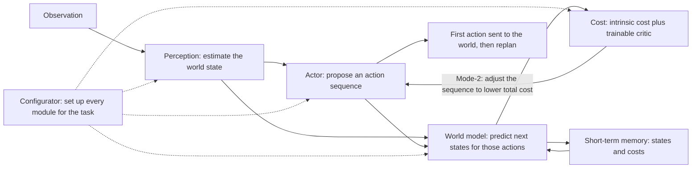
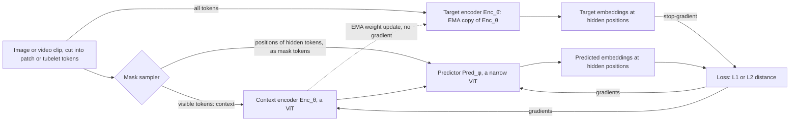
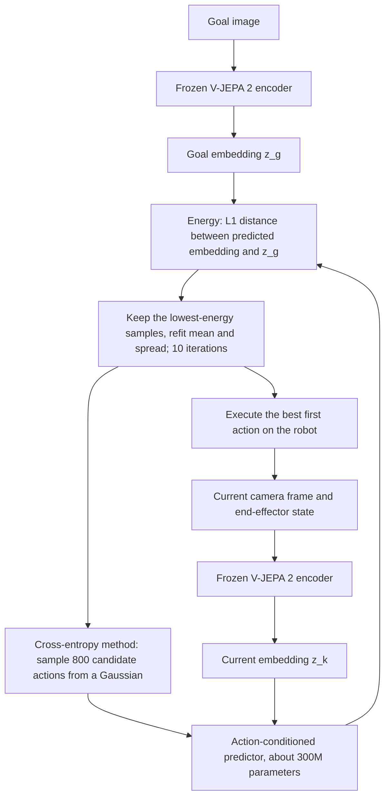
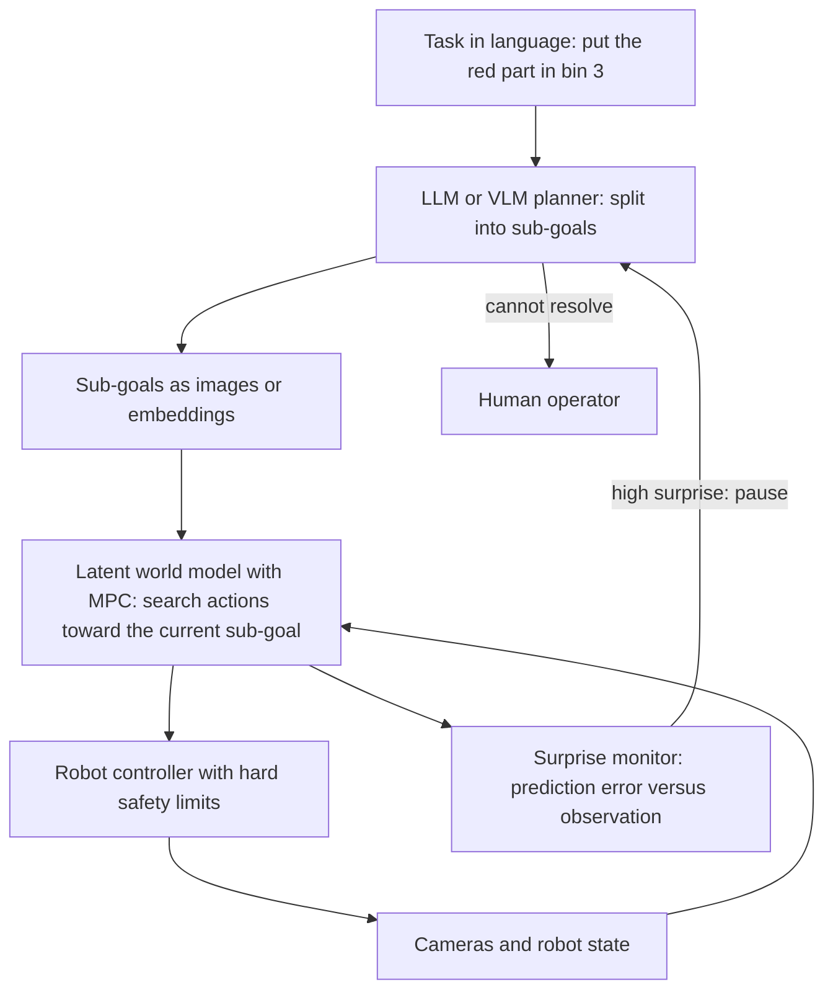

# 17b. JEPA, world models and joint-embedding architectures in depth

> **What you need to be able to say:** what a Joint-Embedding Predictive Architecture is — a context encoder, a target encoder and a predictor that maps the embedding of what is visible to the embedding of what is hidden — and why Yann LeCun argues for predicting in representation space; how a JEPA avoids collapse (negatives, an EMA target with stop-gradient, variance–covariance regularization, LeJEPA's SIGReg), in plain math; what I-JEPA, V-JEPA, V-JEPA 2 and 2-AC, V-JEPA 2.1, LLM-JEPA, VL-JEPA, LeJEPA and LeWorldModel did, with numbers and limits; how MAE, CLIP/SigLIP, DINOv3, VICReg and pixel-space world models (Dreamer, Genie, Cosmos, GAIA, Marble) differ; who builds on JEPA in 2026, including LeCun's AMI Labs; how to run V-JEPA 2 today and what it costs; where a world model plugs into an agent and why LLM agents still own software work; and when a VLM or DINOv3 is the better choice. Chapter 17.6 has the one-paragraph version. Dated October 2026.

## 17b.1 The idea

### 17b.1.1 LeCun's 2022 blueprint: six modules, two modes

In June 2022 Yann LeCun posted "A Path Towards Autonomous Machine Intelligence" on OpenReview: a position paper without experiments that asks how machines could learn as efficiently as animals, and reason and plan, and answers with six modules trained mostly by self-supervision. Anna Dawid and LeCun's 2023 lecture notes restate it with the math.

| Module | Role in the blueprint | Closest thing in 2026 systems |
|---|---|---|
| Configurator | sets up the other modules for the task at hand | the goal specification or prompt; no learned configurator exists at scale |
| Perception | estimates the current state of the world from sensors | a pretrained encoder such as V-JEPA 2 or DINOv3 |
| World model | predicts future states given imagined actions | the predictor in V-JEPA 2-AC, DINO-WM or LeWorldModel; Dreamer's recurrent state-space model |
| Cost | a hard-wired, untrainable *intrinsic cost* (the notes compare it to pain, pleasure and hunger) plus a trainable *critic* that predicts future intrinsic cost | the distance-to-goal energy in V-JEPA 2-AC; reward models and value functions elsewhere |
| Short-term memory | holds current and predicted states with their costs | the planner's rollout buffer |
| Actor | proposes action sequences and executes them | a sampling optimizer such as the cross-entropy method, or a policy network |

The architecture runs in two modes. In **Mode-1** the actor maps the perceived state straight to an action through a policy network: fast and reactive, the counterpart of Kahneman's System 1. In **Mode-2** the actor proposes a sequence of actions, the world model rolls the state forward, the cost scores each predicted state, and the actor adjusts the sequence to minimize total cost, executes the first action and replans: model-predictive control, the counterpart of System 2. The paper also proposes training the Mode-1 policy to imitate what Mode-2 planning found, so practiced skills become reflexes (unverified for this edition: the paper's text could not be retrieved); in agent vocabulary, distilling a planner into a policy.



Every JEPA paper since 2023 builds one box of this diagram: I-JEPA and V-JEPA build perception; V-JEPA 2-AC adds a world model and a Mode-2 planner with a hand-written cost; no JEPA system published by October 2026 learns the configurator, a critic or the hierarchy of 17b.1.7 at scale. JEPA is a research program with working parts, not an assembled alternative to LLMs.

### 17b.1.2 The energy-based view

An **energy-based model** (EBM) assigns a scalar energy F(x, y) to every pair of an input x and a candidate output y: low for compatible pairs, high for incompatible ones. Inference is minimization, ŷ = argmin_y F(x, y), not sampling from a normalized distribution. When x does not determine y (the next second of a video has many plausible continuations), a latent variable z carries the missing information and F(x, y) = min_z E(x, y, z). A probabilistic model is the special case in which the energy becomes a distribution through a Gibbs normalization, p(y | x) = exp(−β F(x, y)) / ∫ exp(−β F(x, y′)) dy′; LeCun's argument is that this integral is intractable when y is an image or a video, so a learning machine should not depend on it.

Training an EBM means shaping the energy surface: push energy down on observed pairs without letting it be low everywhere else. **Contrastive** methods push energy up on generated or sampled negatives. **Regularized** (architectural) methods limit the volume of space that can take low energy: PCA, k-means and sparse coding classically, VICReg and SIGReg (17b.1.5) today. The lecture notes argue that contrastive methods scale badly with the dimension of y, because the negatives needed to carve out the low-energy region grow quickly with dimension — a preference for regularized methods that explains most design choices in this chapter.

A JEPA is a latent-variable EBM whose energy is a prediction error in representation space:

```text
s_x = Enc_x(x)          s_y = Enc_y(y)
E(x, y, z) = D( Pred(s_x, z), s_y )          D = an L1, L2 or cosine distance
```

The lecture notes give the conditions for training it without collapse: maximize the information that s_x and s_y carry about their inputs; make s_y predictable from s_x; and minimize the information content of z, so the predictor cannot smuggle the answer through the latent. The first condition is what the anti-collapse terms of 17b.1.5 enforce; the second is the prediction loss; the third is why I-JEPA and V-JEPA tell the predictor only *where* the target is (positional mask tokens), and why V-JEPA 2-AC tells it only the action and the robot's state.

The energy-based idea also has a commercial outlier: Logical Intelligence announced Kona 1.0 in January 2026 as an energy-based reasoning model, demonstrated on Sudoku, with LeCun as founding chair of its technical research board. Treat its capability claims as vendor claims until a paper with baselines appears (chapter 62.1).

### 17b.1.3 Why predict in representation space instead of pixels or tokens

A masked region, or the next second of video, is only partly determined by its context. A model that must output pixels has two bad options. Trained with a squared error, it predicts the conditional mean, a blur, because the average of the plausible futures minimizes L2. Trained as a full generative model (diffusion, or autoregression over visual tokens), it represents the whole distribution and samples from it, which is expensive and spends capacity on detail nobody can predict: the texture of foliage, ripples on water, sensor noise. LeCun's version (his March 2024 conversation with Lex Fridman): we do not know how to represent distributions over high-dimensional continuous spaces well, so learn an abstract representation without the unpredictable detail, and predict there.

The encoder is trained together with the predictor, so it learns to keep what the context can predict (object identity, position, motion, contact) and to discard what it cannot. The danger follows directly: the cheapest representation to predict is a constant. Every JEPA negotiates between those two pressures, which is why collapse prevention is the engineering core of the field.

Three measurements make the argument concrete.

- **A controlled ablation (V-JEPA, 2024).** Same ViT-L/16, data and schedule; only the target changed. Predicting features instead of pixels raised frozen-backbone accuracy on Kinetics-400 from 68.6% to 73.7% and on ImageNet-1K from 73.3% to 74.8%, and left Something-Something v2 about equal (66.0% versus 66.2%).
- **Compute (I-JEPA, 2023).** A ViT-H/14 trained on ImageNet in under 72 hours on 16 A100 GPUs (under 1,200 GPU-hours) reached 79.3% linear-probe accuracy, which the paper reports as more than 10× more efficient than a ViT-H/14 trained with MAE (77.2% after 1,600 epochs).
- **Intuitive physics (Garrido et al., February 2025).** In violation-of-expectation tests, V-JEPA's surprise (its prediction error on future frames) separated impossible from possible videos 98% of the time on IntPhys pairs, 66% on GRASP and 62% on InfLevel-lab, while a pixel-space video model (VideoMAEv2) and multimodal LLMs (Qwen2-VL-7B, Gemini 1.5 Pro) were near chance. A 115-million-parameter model, and models trained on one week of unique video, were still above chance.

The counterweight belongs in the same answer. A pixel or token model produces something you can look at and check (a frame, a caption, a patch of code); a JEPA embedding needs a probe, a decoder or a planner before it does anything. And pixel-space world models improved sharply in 2025–2026 (17b.3.5).

### 17b.1.4 Three ways to learn without labels

The I-JEPA paper draws the field as three architectures. Contrastive versus non-contrastive is a second axis: it describes how a joint-embedding model avoids collapse, not what it predicts.

| Family | What the model predicts | Representative models | Collapse risk | Strengths | Weaknesses |
|---|---|---|---|---|---|
| Generative (reconstruction or next token) | pixels, visual tokens or text tokens of the missing part | MAE, BEiT, VideoMAE, GPT-style LLMs, video diffusion models | none, because the targets are fixed data | keeps fine detail; can generate; easy to inspect | spends capacity on unpredictable detail; MAE features need fine-tuning to shine |
| Joint-embedding (invariance) | that two views of the same thing (two augmentations, or an image and its caption) map to nearby embeddings | SimCLR, MoCo, CLIP, SigLIP, BYOL, DINO, Barlow Twins, VICReg | high: needs negatives or anti-collapse tricks | semantic, linearly separable features; zero-shot text matching for CLIP-style models | relies on hand-designed augmentations (images) or on paired data (CLIP) |
| Joint-embedding predictive (JEPA) | the embedding of a hidden part from the embedding of the visible part, conditioned on where it is or on an action | I-JEPA, V-JEPA, V-JEPA 2, data2vec as a close cousin | high: EMA plus stop-gradient, or a regularizer | no augmentations needed; learns predictable structure such as motion; the predictor can serve as a world model | embeddings are not directly inspectable; weaker on fine appearance than the best image encoders |

BYOL also has a predictor, which is why it is sometimes counted as a JEPA. The difference is the task: BYOL's predictor maps one augmented view to another (an invariance task), while a JEPA predictor maps a context to a different part of the same input, told where that part is or which action produced it.

### 17b.1.5 Collapse, and the ways to prevent it

**Complete collapse** means the encoder outputs the same vector for every input; the prediction loss is then exactly zero and the representation is useless. **Dimensional collapse** is the quieter version: the embeddings vary along only a few of their 1,024 dimensions, the loss looks healthy and most of the capacity is dead. Three signals catch both during training: the per-dimension standard deviation of embeddings across a batch drifting toward zero; the effective rank of the batch embedding matrix (the exponential of the entropy of its normalized singular values) falling; and a linear probe on a small labeled set that stalls while the training loss keeps improving.

| Mechanism | How it works | Where it is used | Costs and caveats |
|---|---|---|---|
| 1. Contrastive negatives | InfoNCE pulls a matched pair together and pushes the rest of the batch apart; SigLIP scores each pair with an independent sigmoid | SimCLR, MoCo, CLIP, SigLIP 2; VL-JEPA (bidirectional InfoNCE) | needs many negatives, so large batches; false negatives; LeCun's objection that negatives scale badly with dimension |
| 2. Asymmetry: EMA target with stop-gradient, plus a predictor | the target encoder's weights are an exponential moving average of the context encoder's; no gradient flows into the target; only the online side has a predictor | BYOL; DINO, DINOv2, DINOv3 (with centering); data2vec; I-JEPA, V-JEPA, V-JEPA 2 | works at scale, but the theory is partial; adds schedules (I-JEPA ramps the EMA momentum from 0.996 to 1.0); couples teacher and student, which complicates model selection |
| 3. Regularized batch statistics | VICReg keeps each dimension's standard deviation above a floor and pushes off-diagonal covariances to zero; Barlow Twins pushes the cross-correlation of two views toward the identity | VICReg, Barlow Twins; PLDM; the EB-JEPA examples | several weights to tune; the covariance term costs O(d²) per batch |
| 4. Match a target distribution (SIGReg) | test random one-dimensional projections of the embeddings against a standard normal with the Epps–Pulley statistic; by the Cramér–Wold theorem, if every projection is standard normal, the distribution is an isotropic Gaussian | LeJEPA (November 2025); LeWorldModel (March 2026) | one weight; linear in batch size and dimension; no EMA, stop-gradient or teacher; not yet proven at V-JEPA 2's scale |

Two further options appear in the literature. A **frozen teacher** removes the moving target: Apple's SALT (September 2025) trains a teacher with pixel reconstruction under V-JEPA's masking, freezes it, then trains a student to predict its latents, and reports students that outperform V-JEPA 2 encoders under frozen evaluation with a better accuracy-per-FLOP curve. And the **latent bottleneck** of 17b.1.2: limit what the conditioning variable can carry, so the predictor cannot copy the answer.

The four losses in plain math:

```text
Contrastive (InfoNCE), N matched pairs in a batch, temperature τ:
  L = −(1/N) Σ_i log [ exp(sim(z_i, z′_i)/τ) / Σ_j exp(sim(z_i, z′_j)/τ) ]

EMA target with stop-gradient (I-JEPA schedule):
  θ̄ ← m·θ̄ + (1 − m)·θ          m ramps linearly from 0.996 to 1.0 during training
  targets = sg( Enc_θ̄(y) )      sg = stop-gradient: no gradient reaches θ̄

VICReg, Z and Z′ are n × d batches of embeddings of two views:
  v(Z)     = (1/d) Σ_j max(0, γ − sqrt(Var(z_j) + ε))          γ = 1, ε = 0.0001
  c(Z)     = (1/d) Σ_{i≠j} C(Z)_ij²                              C(Z) = covariance matrix of Z
  s(Z, Z′) = (1/n) Σ_i ‖z_i − z′_i‖²
  L        = λ·s(Z, Z′) + μ·[v(Z) + v(Z′)] + ν·[c(Z) + c(Z′)]    defaults λ = μ = 25, ν = 1

SIGReg (LeJEPA), M random unit directions a_1 … a_M:
  SIGReg(Z) = (1/M) Σ_m EP( {a_mᵀ z_k}_k )
  EP(x)     = n ∫ |φ̂_x(t) − exp(−t²/2)|² w(t) dt                φ̂_x(t) = (1/n) Σ_k exp(i·t·x_k)
  L_LeJEPA  = (1 − λ)·L_pred + λ·SIGReg(Z)                       λ = 0.05, M = 1,024 by default
```

A SIGReg-style statistic is easy to compute, and computing it shows what it detects. The function below is a minimal NumPy illustration of the idea, not the reference implementation (that lives in the authors' `lejepa` package, which uses 1,024 slices and a 17-point quadrature by default and runs inside the autograd graph). It was run with NumPy 2.4:

```python
import numpy as np

def epps_pulley(x: np.ndarray, t_max: float = 3.0, num_points: int = 17) -> float:
    """n * integral of |phi_n(t) - exp(-t^2/2)|^2 * exp(-t^2/2) dt, for H0: x ~ N(0, 1).
    The integrand is even in t, so integrate over [0, t_max] and double it."""
    t = np.linspace(0.0, t_max, num_points)
    tx = np.outer(x, t)
    re = np.cos(tx).mean(axis=0) - np.exp(-t**2 / 2)    # real part of phi_n - phi_0
    im = np.sin(tx).mean(axis=0)                        # phi_0 is real
    return float(len(x) * 2.0 * np.trapezoid((re**2 + im**2) * np.exp(-t**2 / 2), t))

def sigreg_like(z: np.ndarray, num_slices: int = 1024, seed: int = 0) -> float:
    rng = np.random.default_rng(seed)
    a = rng.standard_normal((z.shape[1], num_slices))
    a /= np.linalg.norm(a, axis=0, keepdims=True)       # random unit directions
    proj = z @ a
    return float(np.mean([epps_pulley(proj[:, m]) for m in range(num_slices)]))

rng = np.random.default_rng(1)
n, d = 512, 64
cases = {
    "isotropic Gaussian": rng.standard_normal((n, d)),
    "complete collapse": np.tile(rng.standard_normal((1, d)), (n, 1)),
    "dimensional collapse (2 of 64 dims)": np.hstack(
        [rng.standard_normal((n, 2)) * np.sqrt(d / 2), np.zeros((n, d - 2))]),
    "anisotropic (variances 0.1 to 10)": rng.standard_normal((n, d)) * np.sqrt(np.logspace(-1, 1, d)),
}
for name, z in cases.items():
    print(f"{name:38s} {sigreg_like(z, num_slices=256):8.2f}")
```

It prints about 1.0 for the isotropic Gaussian, 543 for complete collapse, 50 for dimensional collapse and 41 for the anisotropic batch. Minimizing the statistic pushes against all three failure modes at once, which is the whole design. The VICReg variance term would catch the first two cases but says nothing about higher moments; a contrastive loss would need negatives to notice any of them.

### 17b.1.6 The training objective, step by step

The I-JEPA and V-JEPA recipe, for one image or clip:

```text
1. Tokenize.  An image becomes patches (I-JEPA: 14×14 or 16×16 pixels); a clip becomes
              tubelets of 2 frames × 16 × 16 pixels (V-JEPA, V-JEPA 2).
2. Mask.      Sample target positions T and context positions C (C excludes T).
3. Encode.    s_C = Enc_θ(x_C)            context encoder sees only the visible tokens
              s̄   = Enc_θ̄(x)              target encoder sees every token; keep s̄_T
4. Predict.   ŝ_T = Pred_φ(s_C, {m + p_i : i ∈ T})
              one mask token per target: a shared learned vector m plus position embedding p_i
5. Loss.      L(θ, φ) = (1/|T|) Σ_{i∈T} ‖ŝ_i − sg(s̄_i)‖        squared L2 in I-JEPA, L1 in V-JEPA
6. Update.    θ, φ ← optimizer step on L;   θ̄ ← m·θ̄ + (1 − m)·θ
```



Worked numbers make the shapes concrete. I-JEPA at 224 pixels with 14-pixel patches has 16 × 16 = 256 tokens; it samples four target blocks, each covering 15–20% of the image with aspect ratios between 0.75 and 1.5, and one context block covering 85–100%, minus any overlap with the targets; its predictor is a narrow ViT of width 384. V-JEPA at 256 pixels and 16 frames has 8 × 16 × 16 = 2,048 tokens; its masks combine eight short-range blocks (each about 15% of a frame) and two long-range blocks (about 70%), each extended through the whole clip so the model cannot copy a patch from a neighboring frame, for an average masking ratio of about 90%: roughly 200 visible tokens predict roughly 1,850 hidden ones. That is the difference from MAE: both hide most of the input, but MAE asks for pixels and a JEPA asks for the target encoder's view of them.

The action-conditioned version replaces "where is the target" with "what did the robot do":

```text
V-JEPA 2-AC, frozen encoder E, frame embeddings z_t = E(x_t), robot state s_t, action a_t:
  teacher forcing:  L_tf      = (1/T) Σ_{k=1..T} ‖ P_φ((a_t, s_t, z_t)_{t≤k}) − z_{k+1} ‖₁       T = 15
  rollout:          L_rollout = ‖ P_φ(a_{1:T}, s_1, z_1) − z_{T+1} ‖₁                            T = 2
planning with a goal image x_g, z_g = E(x_g):
  â_{1:T} = argmin over a_{1:T} of ‖ P_φ(a_{1:T}; s_k, z_k) − z_g ‖₁
```

The teacher-forcing term trains one-step prediction from true histories; the rollout term feeds the predictor its own outputs, which is what happens at planning time and where compounding error lives (the same issue LeCun raises against autoregressive LLMs, 17b.6.3).

### 17b.1.7 Hierarchical JEPA: the part nobody has built

The blueprint's hierarchical JEPA (H-JEPA) stacks JEPAs: a low level makes short-term, detailed predictions; a higher level makes longer-term predictions in more abstract representations; and planning runs top-down, with high-level steps becoming sub-goals for the level below. This is how the blueprint expects to plan over minutes or hours, which a single-level model cannot do because its errors compound and its search space explodes.

As of October 2026 no published JEPA system learns such a hierarchy at scale. V-JEPA 2-AC plans one step ahead and needs a person to supply sub-goal images for pick-and-place; Meta's June 2025 announcement listed hierarchical models as a next step; V-JEPA 2.1's deep self-supervision (17b.2.10) is a hierarchy of features, not of plans. When an interviewer asks what is missing from JEPA, this is the first answer.

## 17b.2 The JEPA family, model by model

### 17b.2.1 I-JEPA (January 2023, CVPR 2023)

Assran and colleagues at Meta FAIR built the first model released under the JEPA name, for images, with the recipe of 17b.1.6: one large context block, four target blocks, a narrow predictor, an EMA target encoder and no hand-designed augmentations. The masking design is the paper's main lesson: targets must be large enough to be semantic (15–20% of the image each), and the context large and spatially spread out. Measured with 1% of ImageNet labels, multi-block masking reached 54.2% against 15.5% (rasterized), 20.2% (one block) and 17.6% (random).

Results as reported. ImageNet-1K linear probe: 79.3% for ViT-H/14 after 300 epochs and 81.1% for ViT-H/16 at 448 pixels, against 77.2% for MAE ViT-H/14 after 1,600 epochs and 81.0% for iBOT ViT-L/16, which uses augmentations. On low-level tasks it sits between the camps: CLEVR object counting 86.7 (DINO 86.6, MAE 90.5) and CLEVR depth 72.4 (DINO 53.4, MAE 72.4). Semantic like a view-invariance method and spatial like a reconstruction method is the best one-line description of what predicting embeddings buys. Checkpoints (ViT-H on ImageNet-1K, ViT-H and ViT-g on ImageNet-22K) are in Hugging Face transformers as `IJepaModel` under CC BY-NC 4.0, so not for commercial use.

### 17b.2.2 MC-JEPA (July 2023) and Image World Models (March 2024)

**MC-JEPA** (Bardes, Ponce and LeCun) learns optical flow and content features in one shared encoder — the step that brought motion into a JEPA objective. **Image World Models** (Garrido, Assran, Ballas, Bardes, Najman and LeCun) train a JEPA predictor to predict, in latent space, the effect of global photometric transformations applied to an image, identify what makes such a predictor useful (conditioning on the transformation, enough difficulty, enough capacity), and show the recipe can yield invariant or equivariant representations. Conceptually it is the step from "predict a hidden patch" to "predict the effect of an intervention", which is what an action-conditioned world model does.

### 17b.2.3 V-JEPA (February 2024)

Bardes and colleagues trained a family of video encoders "solely" with feature prediction: no pretrained image encoder, no text, no negatives, no reconstruction. Data: VideoMix2M, about 2 million videos from public datasets. Models: ViT-L/16 and ViT-H/16, including ViT-H/16 at 384 pixels. Loss: L1, which the authors found more stable than L2. Masking: the 90% tube masking of 17b.1.6. Evaluation: frozen backbone with an attentive probe (a small cross-attention head over the patch tokens), which is how all V-JEPA results are reported. Headline numbers for ViT-H/16, frozen: 81.9% on Kinetics-400, 72.2% on Something-Something v2 and 77.9% on ImageNet-1K. The pixel-versus-feature ablation in 17b.1.3 comes from this paper. Code and weights are in `facebookresearch/jepa` under CC BY-NC 4.0.

### 17b.2.4 V-JEPA 2 (June 2025)

V-JEPA 2 (Assran, Bardes, Fan, Garrido and 25 co-authors including LeCun, Rabbat and Ballas; paper and Meta announcement on 11 June 2025) scales the recipe and adds two uses beyond representation learning: the video encoder of a multimodal LLM, and the backbone of an action-conditioned world model (17b.2.5).

**Data and models.** VideoMix22M: about 22 million samples and over a million hours of video from Something-Something v2, Kinetics, HowTo100M and a curated subset of YT-Temporal-1B, plus 1 million ImageNet images repeated as frames. Encoders: ViT-L/16 (300M parameters), ViT-H/16 (600M) and ViT-g/16 (about 1B; Meta's announcement says 1.2B), trained with the same EMA-and-L1 objective, mostly at 16 frames and 256 pixels with a short cool-down at 64 frames and 384 pixels. Scaling data (2M to 22M videos), model (300M to 1B parameters), training length and resolution together raised the average over six frozen-probe tasks by 4.0 points, from 84.2 to 88.2, with model size the largest single contributor.

**Understanding, against image encoders.** The paper compares frozen encoders under one attentive-probe protocol. Four of its columns tell the story:

| Encoder | Parameters | SSv2 (motion) | Diving-48 (motion) | Kinetics-400 | ImageNet-1K |
|---|---|---|---|---|---|
| DINOv2 | 1.1B | 50.7 | 82.5 | 83.6 | 86.1 |
| SigLIP 2 | 1.2B | 49.9 | 75.3 | 87.3 | 88.0 |
| Perception Encoder (PE-core G) | 1.9B | 55.4 | 76.9 | 88.5 | 87.6 |
| V-JEPA 2 ViT-g, 384 px | 1B | 77.3 | 90.2 | 87.3 | 85.1 |

V-JEPA 2 wins by 22–27 points on Something-Something v2, where the label depends on how things move ("pushing something from left to right"), and also leads on Diving-48. Encoders trained with text supervision win or tie on appearance-heavy tasks such as ImageNet and Kinetics-400, whose labels can often be read off a single frame; even DINOv2 beats V-JEPA 2 on ImageNet. That split decides most practical choices (17b.7.3).

**Anticipation and video QA.** On EPIC-KITCHENS-100 action anticipation (predict the verb, noun and action a second before they happen, from egocentric video), V-JEPA 2 reached 39.7 recall@5, a 44% relative gain over the previous best (PlausiVL, 27.6). Aligned with Llama 3.1 8B, it reported 84.0 on PerceptionTest and 76.9 on TempCompass, state of the art at the 8B scale when published.

**Physical reasoning benchmarks.** Meta released three with the model: IntPhys 2 (plausible versus implausible physics), Minimal Video Pairs (MVPBench, multiple-choice questions on minimally different video pairs, built to defeat shortcuts) and CausalVQA (cause and effect, counterfactuals, anticipation). Meta reports human accuracy of 85–95% across the three, with every model it tested, V-JEPA 2 included, well below; on IntPhys 2 most models were at chance. Chapter 62.2.11 records the same gap.

**Availability.** Code and weights are MIT-licensed (a few data-loading files are Apache 2.0); the encoders are in Hugging Face transformers since v4.53.0 (June 2025); 17b.5.1 lists the model IDs.

### 17b.2.5 V-JEPA 2-AC: an action-conditioned world model that plans

**What was trained.** The ViT-g encoder is frozen. A new predictor of about 300M parameters (24 layers, width 1,024) learns to predict the encoder's embedding of the next frame from the embeddings of past frames, the robot's end-effector state (7 numbers: position, orientation, gripper) and the action (7 numbers), with block-causal attention across frames. The data is under 62 hours of unlabeled clips from DROID, an open dataset of Franka-arm teleoperation: 4-second clips at 4 frames per second and 256 pixels, each frame a 16 × 16 grid of 1,408-dimensional embeddings. Losses: teacher forcing over 15 steps plus a two-step rollout loss, both L1 (17b.1.6). No reward, no task labels, no data from the test labs.

**How it plans.** Given the current frame and a goal image, it searches for the action whose predicted embedding lands closest to the goal's, executes it, observes and repeats:



The paper's settings: 800 samples, 10 iterations and a planning horizon of one step, with reach actions sampled inside an L1 ball of radius 0.075, which caps how far one step can move the arm, so reaching takes several replanning steps. Pick-and-place needs sub-goals: the planner gets two intermediate images plus the final goal and optimizes toward the first for 4 steps, the second for 10 and the final goal for the last 4. A person supplies those images; the model does not decompose the task.

**Results.** Zero-shot on Franka arms with Robotiq grippers in two labs not seen in training, 10 trials per task per lab with varied object positions and start poses, against Octo, a generalist robot policy fine-tuned on all of DROID with behavior cloning and goal-image relabeling. Averages over the two labs:

| Task | Octo | V-JEPA 2-AC |
|---|---|---|
| Reach | 100% | 100% |
| Grasp a cup / a box | 15% / 0% | 65% / 25% |
| Reach while holding a cup / a box | 15% / 70% | 75% / 75% |
| Pick-and-place a cup / a box | 15% / 10% | 80% / 65% |

Against a pixel-space world model, NVIDIA's Cosmos, used the same way in one lab: Cosmos needed about 4 minutes per action with 80 samples and 10 iterations and placed nothing (0% on both pick-and-place tasks), where V-JEPA 2-AC needed 16 seconds per action with 800 samples. Planning in a 16 × 16 grid of embeddings was about 15× faster per action than generating video, with 10× more samples.

**How to read these numbers.** Ten trials per cell is small: a 95% Wilson interval for 8 successes in 10 runs from about 49% to 94%, and for 16 in 20 (the cup pick-and-place average) from about 58% to 92%. The tasks are short, the objects a cup and a box, the goals images, and 16 seconds per action is slow for production work. The authors name the limits themselves: sensitivity to camera position (with the robot base out of view, the model cannot infer the action's coordinate frame), long-horizon planning, and image rather than language goals. The result is strong evidence that self-supervised video plus a few dozen hours of robot data yields a usable world model; it is not evidence that the approach is ready for a warehouse (17b.7.1).

### 17b.2.6 Other modalities

**A-JEPA** (November 2023) applies the recipe to audio spectrograms with curriculum time–frequency masking and reports state-of-the-art results on several audio classification tasks; **Point-JEPA** (April 2024) brings it to point clouds, ordering patch embeddings by proximity so contiguous blocks can be picked without a grid. The 2025–2026 listings show the recipe spreading to speech tokenizers, genomics, chart reading, LiDAR for driving and robot policy representations: "JEPA" now names a recipe (mask, encode, predict embeddings, prevent collapse) rather than one model. Read each abstract before relying on it.

### 17b.2.7 LLM-JEPA (September 2025)

Hai Huang, Yann LeCun and Randall Balestriero asked whether language models can borrow the embedding-space objective that worked in vision. Text has no obvious "other view" of itself; their answer is to use datasets that come with two views of the same content.

**Mechanism.** Each example has a *Text* view (a natural-language description) and a *Code* view (the regular expression, SQL query or program it describes), packed into one context window with an attention mask that stops them from seeing each other. The embedding of a view is the last-layer hidden state of its last token. The predictor is the LLM itself: append *k* special `[PRED]` tokens (*k* from 0 to 4) after the Text view and take the embedding at the last one. The loss keeps ordinary next-token cross-entropy and adds λ times the cosine distance between Pred(Enc(Text)) and Enc(Code). There is no separate anti-collapse term; the next-token loss plays that role, because hidden states that all looked alike could not predict different next tokens.

**Results.** Fine-tuning Llama-3.2-1B-Instruct raised NL-RX-SYNTH accuracy from 57.3% (± 5.3) to 70.4% (± 2.4), with gains also reported on GSM8K and Spider and across the Llama 3, Gemma 2, OpenELM and OLMo families; the authors report that LLM-JEPA resists overfitting where plain fine-tuning does not. In pretraining on NL-RX-SYNTH it reached 60.6% against 54.4% for next-token loss alone.

**Limits.** It needs paired views, which most text lacks; the authors call a text counterpart of data augmentation the key open problem. It costs two forward passes per step instead of one (the masking trick avoids a third), though inference is unchanged. Most results are fine-tuning on small models. Compared with chapter 22c: LLM-JEPA changes how the model is trained; it still reasons and answers in tokens, so it is not latent reasoning at inference time.

### 17b.2.8 VL-JEPA (December 2025)

VL-JEPA (Delong Chen, Mustafa Shukor and colleagues, with LeCun and Pascale Fung) is a vision-language model that predicts the *embedding* of the answer text instead of generating its tokens.

**Architecture.** X-encoder: a frozen V-JEPA 2 ViT-L (304M) at 256 pixels, 8–32 frames per input. Predictor: initialized from the last 8 transformer layers of Llama-3.2-1B, 490M trainable parameters, with causal masking disabled so vision embeddings and the query are processed jointly, pooled into one predicted embedding. Y-encoder: EmbeddingGemma-300M, trained with a 0.05 learning-rate multiplier, which embeds the target text. Y-decoder: a lightweight text decoder called only when a human needs words. Total: 1.6B parameters. Loss: bidirectional InfoNCE between predicted and target embeddings, so this JEPA prevents collapse contrastively.

**Training and results.** About 2 billion image–text samples, then video (3.3 billion samples seen), then supervised fine-tuning on VQA, captioning and classification data. Against a token-generating VLM with the same frozen encoder and data, VL-JEPA was stronger with half the trainable parameters (a 0.5B predictor against a 1B LLM). Across sixteen video datasets (eight classification, eight retrieval) it beat CLIP, SigLIP 2 and Perception Encoder, and on GQA, TallyQA, POPE and POPEv2 it matched InstructBLIP and Qwen-VL at 1.6B parameters. Because answers are embeddings, one model also does open-vocabulary classification and text-to-video retrieval without changes.

**Selective decoding.** For streaming video, VL-JEPA clusters the stream of predicted embeddings over time and decodes text only when the meaning shifts, which cut decoding operations by about 2.85× at similar quality — the design point that matters for an always-on camera assistant, where compute should be spent on change, not frames. The follow-up dataset **Action100M** (January 2026) segments 1.2 million instructional videos (about 14.6 years of footage) into roughly 100 million action segments, using V-JEPA 2 embeddings for segmentation and GPT-OSS-120B for annotations; VL-JEPA improved steadily with it.

### 17b.2.9 LeJEPA (November 2025)

Randall Balestriero and Yann LeCun set out to replace the heuristics of 17b.1.5 with theory. Two results carry the paper. First, the isotropic Gaussian is the embedding distribution that minimizes downstream prediction risk, for linear probes and for the nonlinear probes they analyze. Second, SIGReg enforces that distribution cheaply, with linear time and memory in batch size and dimension.

In its image recipe LeJEPA has no separate predictor network: each image yields 2 global views and several smaller local views (the multi-crop scheme DINO popularized), every view's embedding is pulled toward the mean embedding of the global views, and SIGReg acts on the embeddings. The objective is (1 − λ)·L_pred + λ·SIGReg with λ = 0.05 by default; the authors' pseudocode is about 50 lines. There is no EMA, no stop-gradient, no teacher and no hyperparameter schedule, and training was stable across more than 60 architectures (up to a 1.8B ViT-g) and more than 10 datasets.

Results as reported: 79% ImageNet-1K linear accuracy with ViT-H/14, matching rather than beating I-JEPA's 79.3% on the same backbone with a far simpler recipe. In-domain pretraining on small specialized datasets (Galaxy10, galaxy morphology images, is their example) beat transfer from DINOv2 and DINOv3, from 1-shot to full supervision. And the training loss correlates strongly with downstream linear-probe accuracy, so it can serve for model selection without supervised probing. A companion paper, **Gaussian Embeddings** (Balestriero, Ballas, Rabbat and LeCun, October 2025), shows that the anti-collapse term makes a JEPA an implicit density estimator and derives JEPA-SCORE, a closed-form density estimate useful for outlier detection (17b.7.2).

Why it matters for practitioners: if SIGReg holds up at video-foundation scale, JEPA training loses its most fragile parts (EMA schedules, teacher–student coupling) and gains a loss you can trust for model selection, which lowers the barrier for teams that want to pretrain on their own domain (industrial video, medical imaging, satellite imagery) instead of transferring from web-scale models.

### 17b.2.10 2026: V-JEPA 2.1, LeWorldModel, C-JEPA and the rest

**V-JEPA 2.1** (Mur-Labadia, Muckley, Bar, Assran, Sinha, Rabbat, LeCun, Ballas and Bardes; March 2026, revised June 2026) fixes V-JEPA 2's dense features. The diagnosis: with the loss only on masked tokens, the model has no incentive to encode local information in the visible tokens, which became global aggregators with noisy feature maps. The fixes: a dense predictive loss on visible tokens too, weighted by distance to the nearest mask; deep self-supervision at three intermediate encoder blocks as well as the output; separate image and video tokenizers; and more data (VisionMix-163M, which adds the curated LVD-142M image set). Models run from a distilled ViT-B (80M) to a ViT-G (2B). Reported gains over V-JEPA 2 on dense tasks: ADE20K segmentation 22.2 → 47.9 mIoU and NYUv2 depth RMSE 0.682 → 0.307, while global recognition held (77.7% on SSv2); frozen-backbone state of the art on Ego4D short-term object-interaction anticipation (7.71 mAP) and EPIC-KITCHENS-100 anticipation (40.8 recall@5); and real-robot grasping 20 points above V-JEPA 2-AC. One telling ablation: the dense loss alone dropped SSv2 from 72.8 to 62.5, and deep self-supervision recovered it to 72.1 — dense and global quality trade off tightly. Checkpoints are in the `facebookresearch/vjepa2` repository.

**LeWorldModel (LeWM)** (Maes, Le Lidec, Scieur, LeCun and Balestriero; March 2026) is a world model trained end to end from pixels with two terms, next-embedding prediction and SIGReg. It is small on purpose — about 15M parameters, trainable on one GPU in a few hours — and cuts the tunable loss weights from six to one compared with PLDM, an earlier end-to-end model with a VICReg-derived objective. Planning is up to 48× faster than world models built on foundation-model features such as DINO-WM (which plans over frozen DINOv2 patch features), largely because it uses about 200× fewer tokens. Results are mixed in an informative way: ahead on Push-T, slightly behind DINO-WM on OGBench-Cube, and behind on Two-Room, which the authors attribute to forcing a high-dimensional Gaussian onto an environment with very low intrinsic dimension. Its latent space also supports probing of physical quantities and surprise-based detection of implausible events.

**C-JEPA** (Nam, Le Lidec, Maes, LeCun and Balestriero; February 2026) masks *objects* instead of patches, so it must infer a masked object's state from the others, which forces it to model interactions. It reports about 20% better counterfactual question answering than the same architecture without object-level masking, and planning comparable to patch-based world models with about 1% of the latent input features.

**What drives success in JEPA world models** (Terver, Yang, Ponce, Bardes and LeCun; December 2025) is the study to read before building one. Across simulated navigation and manipulation and real DROID data: the best frozen encoder was an image encoder — DINOv2-S for navigation, DINOv3-L for manipulation — whose local features kept the spatial detail the tasks needed, ahead of V-JEPA encoders; predictors conditioned through AdaLN with RoPE worked best (6 layers for navigation, 12 for manipulation); multistep rollout training and proprioception helped; and the cross-entropy method beat gradient-based planners. The tuned model beat DINO-WM and V-JEPA 2-AC on its suites.

**Infrastructure.** Meta's **EB-JEPA** library (February 2026, Apache-2.0) packages single-GPU examples that each train in a few hours — image JEPA on CIFAR-10 (91% probe accuracy), video prediction on Moving MNIST, and an action-conditioned world model reaching 97% planning success on a Two Rooms task — with ablations of each anti-collapse component. **stable-worldmodel** (February 2026) is a platform for reproducible world-model evaluation.

**JEPA inside robot policies.** The 2026 wave puts JEPA objectives into vision-language-action models. VLA-JEPA (February 2026) pretrains on video with "leakage-free" state prediction (the target encoder sees future frames, the student only the current observation), then fine-tunes an action head, and reports gains in generalization and robustness on LIBERO, SimplerEnv and real robots; JEPA-VLA (February 2026) argues that predictive video embeddings such as V-JEPA 2's are what VLA policies need. Later 2026 titles — world-action models, end-to-end driving JEPAs, JEPAs for latent model-predictive control — continue the trend; read the abstracts before citing them.

### 17b.2.11 The family in one table

| Model | Date | Modality | Encoder and size | Pretraining data | Anti-collapse | Headline result (as reported) | Weights and license |
|---|---|---|---|---|---|---|---|
| I-JEPA | Jan 2023 | images | ViT-H/14, ViT-H/16, ViT-g/16 | ImageNet-1K or -22K | EMA and stop-gradient, L2 | 79.3% IN-1K linear (ViT-H/14), under 1,200 GPU-hours | HF `facebook/ijepa_*`; CC BY-NC 4.0 |
| V-JEPA | Feb 2024 | video | ViT-L/16, ViT-H/16 | VideoMix2M, 2M videos | EMA and stop-gradient, L1, ~90% tube masking | ViT-H/16 frozen: K400 81.9, SSv2 72.2, IN-1K 77.9 | GitHub `facebookresearch/jepa`; CC BY-NC 4.0 |
| V-JEPA 2 | Jun 2025 | video and images | ViT-L 300M, ViT-H 600M, ViT-g 1B | VideoMix22M, over 1M hours | EMA and stop-gradient, L1 | SSv2 77.3; EK-100 anticipation 39.7 R@5 | HF `facebook/vjepa2-*`; MIT |
| V-JEPA 2-AC | Jun 2025 | video and robot actions | frozen ViT-g plus a 300M predictor | under 62 hours of DROID | frozen encoder; L1 teacher forcing and rollout | pick-and-place 80% (cup), 65% (box); 10 trials per lab | GitHub checkpoint; MIT |
| LLM-JEPA | Sep 2025 | paired text and code | the LLM itself (1B to 8B tested) | fine-tuning sets | next-token loss kept alongside the cosine JEPA loss | Llama-3.2-1B NL-RX-SYNTH 57.3% → 70.4% | research code |
| LeJEPA | Nov 2025 | images, any domain | 60+ architectures, up to a 1.8B ViT-g | ImageNet-1K, domain datasets | SIGReg, no EMA or stop-gradient | 79% IN-1K linear (ViT-H/14); in-domain beats DINOv2/v3 transfer | research code |
| VL-JEPA | Dec 2025 | video and text | frozen V-JEPA 2 ViT-L plus 490M predictor plus 300M text encoder; 1.6B total | 3.3B samples in pretraining | bidirectional InfoNCE | beats CLIP, SigLIP 2, PE on 16 video datasets; 2.85× fewer decodes | not checked here |
| V-JEPA 2.1 | Mar 2026 | video and images | ViT-B 80M to ViT-G 2B | VisionMix-163M | EMA plus dense and deep losses | ADE20K 47.9 mIoU (V-JEPA 2: 22.2); EK-100 40.8 R@5 | GitHub checkpoints; repository mostly MIT |
| LeWorldModel | Mar 2026 | pixels and actions | ~15M (ViT-tiny plus predictor) | offline trajectories, control tasks | SIGReg | plans up to 48× faster than DINO-WM | research code |

## 17b.3 Similar and adjacent models, and where each sits relative to JEPA

### 17b.3.1 Generative masked modeling: MAE and BEiT

**MAE** (He, Chen, Xie, Li, Dollár and Girshick, November 2021) masks 75% of image patches, runs the encoder on the visible 25% only, and asks a lightweight decoder to reconstruct the missing pixels; the asymmetric design speeds training by 3× or more, and a plain ViT-Huge reached 87.8% on ImageNet-1K after fine-tuning. **BEiT** (June 2021) is the BERT version: a separately trained tokenizer turns the image into discrete visual tokens and the model predicts the tokens of masked patches. VideoMAE carries MAE to video.

Relative to JEPA: same masking idea, different target. MAE's target is fixed data, so it cannot collapse, but it must model detail it cannot predict, and its features are at their best after fine-tuning rather than frozen. BEiT sits halfway: its target is a learned representation, produced by a frozen, separately trained tokenizer — the same move Apple's SALT makes with a frozen teacher. **data2vec** (Baevski and colleagues at Meta, February 2022) is the closest pre-JEPA cousin: it predicts contextualized latent representations of the full input from a masked view, with an EMA teacher, using one method for speech, vision and text — architecturally a JEPA without the name.

### 17b.3.2 Contrastive learning: SimCLR, CLIP, SigLIP

**SimCLR** (Chen, Kornblith, Norouzi and Hinton, February 2020) treats two augmentations of the same image as a positive pair and every other image in the batch as a negative; it showed that the choice of augmentations defines what the model learns, and its linear probe matched a supervised ResNet-50 on ImageNet. **CLIP** (Radford and colleagues at OpenAI, February 2021) applies the contrastive loss across modalities, image against caption, on 400 million internet pairs, and matched a ResNet-50 on ImageNet zero-shot without its labeled training images. **SigLIP** (March 2023) replaces the batch-wide softmax with a pairwise sigmoid that needs no global normalization; **SigLIP 2** (February 2025) adds captioning-based pretraining, self-distillation, masked prediction and data curation, is multilingual, improves localization and dense features, and ships at 86M to 1B parameters.

Relative to JEPA: contrastive models learn that two views belong together; they do not predict anything conditioned on position or action, so they are not world models. They are the right tool whenever text must meet images (zero-shot labels, text-to-image search, the vision half of a VLM; chapters 18 and 19). Their weakness for physical tasks shows in V-JEPA 2's comparison: SigLIP 2 scored 49.9 on Something-Something v2 against V-JEPA 2's 77.3. VL-JEPA borrows their loss to stop its own collapse.

### 17b.3.3 Self-distillation: BYOL, DINO, DINOv2, DINOv3

**BYOL** (Grill and colleagues at DeepMind, June 2020) removed negatives: an online network, through a predictor, learns to predict a target network's representation of a different augmented view, and the target is an EMA of the online network. **DINO** (Caron and colleagues at Meta, April 2021) is self-distillation for ViTs: the student matches the teacher's output distribution over learned prototypes across different crops of an image, the teacher is an EMA with centering and sharpening to avoid collapse, and the attention maps segment objects without supervision. **DINOv2** (Oquab and colleagues, April 2023) scaled the recipe on a curated 142-million-image dataset (LVD-142M), trained a 1B-parameter ViT and distilled it into smaller models.

**DINOv3** (Siméoni and colleagues, announced 14 August 2025) is the usual 2026 starting point for frozen image features.

- **Scale and objective.** A 7B-parameter ViT trained on 1.7 billion curated images with a DINO image-level loss, an iBOT patch-level masked-latent loss and a KoLeo regularizer that spreads features within a batch. The iBOT term is masked prediction of patch embeddings with an EMA teacher — a JEPA-like term inside the DINO family, so modern DINO is a hybrid of invariance and masked latent prediction.
- **Gram anchoring.** Long training degrades dense features: patch outputs drift toward the global token and lose local consistency. DINOv3 penalizes the distance between the Gram matrix of normalized patch features (all pairwise dot products) and that of an earlier "Gram teacher" checkpoint, restoring patch-level consistency without constraining the features themselves.
- **Family and license.** Distilled ViT-S (21M) to ViT-H+ (840M) and ConvNeXt Tiny to Large (29M to 198M), satellite-imagery variants, and a text-aligned variant for zero-shot use; in Hugging Face transformers since v4.56.0; the DINOv3 License allows commercial use with restrictions, so read it before shipping.
- **Use.** Meta reports that it matches or exceeds SigLIP 2 and Perception Encoder on many classification benchmarks while improving dense prediction sharply; the World Resources Institute cut tree-canopy height error in Kenya from 4.1 m to 1.2 m with the satellite model.

Relative to JEPA: self-distillation shares the EMA-and-stop-gradient machinery; the difference is the task, invariance across augmentations versus prediction of hidden parts. For appearance, segmentation, depth and precise object localization in single images, DINOv3 is the stronger frozen encoder, and the JEPA world-model study of 17b.2.10 found DINO encoders better than V-JEPA encoders for planning in its navigation and manipulation tasks. For motion and anticipation, V-JEPA 2 is stronger.

### 17b.3.4 Redundancy reduction: Barlow Twins and VICReg

**Barlow Twins** (Zbontar, Jing, Misra, LeCun and Deny, ICML 2021) pushes the cross-correlation matrix between the embeddings of two distorted views toward the identity: diagonal terms toward 1 (invariance), off-diagonal terms toward 0 (no redundancy), with no large batches and no asymmetry. **VICReg** (Bardes, Ponce and LeCun, ICLR 2022) makes the anti-collapse explicit with the variance, invariance and covariance terms of 17b.1.5, and shows that adding the variance term to other methods stabilizes them. Relative to JEPA: these are the "regularized" branch of LeCun's energy-based program, and VICReg-style terms are the anti-collapse mechanism in several JEPA world models (PLDM; the EB-JEPA examples). SIGReg is their successor in spirit: VICReg constrains the first two moments of each dimension, SIGReg the whole distribution.

### 17b.3.5 World models for agents and robotics

A **world model** predicts how the state of an environment changes, usually conditioned on actions. Agents use it in four ways: to plan by searching over imagined futures (model-predictive control, as in V-JEPA 2-AC); to train a policy inside imagined experience (Dreamer); to generate synthetic data or test scenarios (Cosmos, GAIA); and to evaluate a policy in closed loop before it meets the real world (GAIA-4). World Labs' June 2026 essay adds a useful functional taxonomy: *renderers* produce pixels for people to look at (Genie 3); *simulators* produce geometrically and physically faithful state that people and programs can operate on (Marble); *planners* produce actions from observations and goals (vision-language-action models, world-action models). JEPA world models are planner components: they predict for decisions and never render.

| System | Who and when | Predicts in | Action input | Used for | Status, October 2026 |
|---|---|---|---|---|---|
| DreamerV3 | Hafner and colleagues; Nature April 2025 | latents of a recurrent state-space model, trained with reconstruction | yes | reinforcement learning in imagination; one configuration for 150+ tasks; Minecraft diamonds from scratch | open research code |
| Dreamer 4 | Hafner, Yan, Lillicrap; September 2025 | a scalable transformer world model | yes | Minecraft diamonds purely from offline data; real-time inference on one GPU | research |
| Genie 3 | Google DeepMind; August 2025 | frames in real time, 720p at 24 fps | yes, plus text "world events" | interactive worlds consistent for a few minutes | Project Genie, an experimental prototype in Google Labs |
| NVIDIA Cosmos | platform paper January 2025; Cosmos 3 in 2026 | video; Cosmos 3's generator also emits sound and actions | yes | synthetic data, policy backbones, simulation for robots and vehicles | open models; Cosmos 3 in 64B, 16B and 4B sizes |
| Wayve GAIA | GAIA-2 March 2025, GAIA-4 August 2026 | multi-camera video; GAIA-4 adds radar | ego-vehicle actions, with the driving policy in the loop | driving simulation and safety evaluation | Wayve research and internal simulation |
| World Labs Marble, Atlas | Fei-Fei Li's company; Marble November 2025, Atlas September 2026; \$1 billion raised in February 2026 | persistent 3D worlds (Gaussian splats and meshes) | navigation within generated worlds | content, simulation, robotics | definitive agreement to join AMD signed 28 September 2026, closing expected by end of 2026 |
| Oasis | Decart and Etched; October 2024 | frames from a diffusion transformer | keyboard | a real-time, Minecraft-like playable world | 500M open weights |
| Navigation World Models | Meta FAIR (Bar, Zhou, Tran, Darrell, LeCun); CVPR 2025 | frames, from a conditional diffusion transformer | navigation actions | plan routes by simulation, or rank trajectories proposed by another policy | research |
| DINO-WM | Zhou, Pan, LeCun, Pinto; November 2024 | frozen DINOv2 patch features | yes | zero-shot planning toward goal observations | research |
| PLDM | Sobal and colleagues with LeCun; February 2025 | latents learned end to end with VICReg-derived terms | yes | reward-free offline planning | research |
| V-JEPA 2-AC, LeWorldModel | 17b.2.5 and 17b.2.10 | JEPA embeddings | yes | model-predictive control | MIT weights (V-JEPA 2-AC); research code |

Four details worth carrying into an interview:

- **Dreamer's latents are trained with reconstruction**, so it is generative underneath; its actor and critic learn only from imagined trajectories. Dreamer 4's offline Minecraft result matters because it shows a world model learning mostly from unlabeled video plus a little action-labeled data — the same bet V-JEPA 2-AC makes.
- **Genie 3's stated limits** are useful: a limited action space, weak multi-agent interaction, imperfect geography, legible text mostly only when the prompt supplies it, and sessions of minutes rather than hours.
- **GAIA-4 shows where pixel-space simulation earns its cost:** the driving policy is in the loop, so the generated camera and radar feeds change with its decisions while other road users replay their logged behavior, and safety is checked for outcomes, closed-loop trajectories and components. Wayve's argument is that validation then scales with compute rather than road miles — and a latent model could not be audited this way, because people must inspect the scenes.
- **Navigation World Models** is a reminder that LeCun's own group uses pixel-space generation when the job is to rank trajectories proposed by another policy or to show predictions to people.

The language-side counterpart, LLMs used as world models of web pages and code, is in 17b.6.2.

### 17b.3.6 Video prediction versus latent prediction: the evidence

**For pixel-space prediction.** Genie 3 keeps generated worlds consistent for minutes. Google DeepMind's "Video models are zero-shot learners and reasoners" (September 2025) showed Veo 3 segmenting objects, detecting edges, editing images, recognizing affordances and solving simple mazes and symmetry puzzles without training for any of them, a sign that generative video models are drifting toward general vision models. OpenAI's February 2024 Sora report framed scaling video generation as a promising path toward general-purpose simulators of the physical world.

**Against it.** The same Sora report says the model "does not accurately model the physics of many basic interactions", glass shattering among them. Kang and colleagues (November 2024) trained video generators on a 2D physics simulator: in-distribution and combinatorial generalization worked, out-of-distribution generalization failed, and the models generalized by retrieving similar training cases, matching on color before size, velocity and shape — scaling alone, the authors conclude, is insufficient to uncover physical laws. In violation-of-expectation tests, pixel-space models and multimodal LLMs sit near chance while V-JEPA does not (17b.1.3). And in planning, Cosmos was 15× slower per action and less successful than V-JEPA 2-AC (17b.2.5).

**The engineering reading.** If a person must look at the prediction (a driving scenario for safety review, synthetic training images, a game), you need pixels, and you pay for them. If a machine consumes the prediction (a planner, an anomaly score, a retrieval index), latents are cheaper and, on current evidence, capture physical structure at least as well. Systems will often use both: a latent model for decisions and a pixel decoder or a VLM to explain them.

### 17b.3.7 The map in one table

**The comparison in four questions.** Ask of any self-supervised encoder: what is the target — pixels (MAE), a caption's embedding (CLIP), another view's embedding (SimCLR, DINO), or a hidden part's embedding (JEPA)? Where do its invariances come from — nowhere (MAE keeps everything, which is why its frozen features are weak and it wants fine-tuning), hand-designed augmentations (SimCLR, DINO: the features go blind to whatever you augmented away, such as color or crop position), captions (CLIP: blind to whatever captions never mention, such as fine motion or exact counts), or predictability (JEPA: blind to what the context cannot predict)? What prevents collapse — fixed targets, negatives, an EMA teacher or a regularizer? And what are the frozen features best at — dense appearance (DINOv3), text alignment (CLIP, SigLIP 2), motion and anticipation (V-JEPA 2)? Most "which encoder?" questions are settled by the second and fourth answers.

| Family | Predicts | Invariances come from | Collapse prevented by | Frozen features best at | Relation to JEPA |
|---|---|---|---|---|---|
| MAE, BEiT, VideoMAE | missing patches, in pixels or discrete visual tokens | nothing; fine-tuning supplies them | fixed targets | weak when frozen; strong after fine-tuning | same masking, input-space target |
| SimCLR, MoCo | the other augmented view's embedding | hand-designed augmentations | negatives | early semantic features | joint-embedding without prediction |
| CLIP, SigLIP 2, Perception Encoder | the matching caption's embedding | captions | negatives (softmax or sigmoid) | zero-shot labels, text search, VLM vision towers | VL-JEPA reuses the loss |
| BYOL, DINO, DINOv2, DINOv3 | the teacher's view of another crop; masked patch embeddings (iBOT term) | augmentations and crops | EMA, centering, KoLeo | frozen image features, dense tasks | shares the EMA machinery; partly JEPA-like |
| Barlow Twins, VICReg | the other view | augmentations | a statistics regularizer | simple, stable training | the anti-collapse terms of several JEPAs |
| data2vec | latents of the full input | masking | EMA | one method for three modalities | a JEPA in all but name |
| I-JEPA, V-JEPA, V-JEPA 2, V-JEPA 2.1 | hidden patches or tubelets, in embedding space | masking and predictability | EMA and stop-gradient | motion, anticipation, physics probes | the family itself |
| LeJEPA, LeWorldModel | other views; the next frame | views; predictability | SIGReg | simple training, label-free model selection | the 2025–2026 simplification |
| V-JEPA 2-AC, DINO-WM, PLDM | the next state given an action | inherited from the encoder | frozen encoder or regularizer | short-horizon planning | JEPA as world model |
| Dreamer | next latent and reward | reconstruction | reconstruction | reinforcement learning in imagination | latent world model, generative underneath |
| Genie, Oasis, Cosmos, GAIA, Marble | next frames or 3D scenes | none needed | fixed targets | simulation people can inspect | the generative alternative |
| VLAs (π0, Gemini Robotics, GR00T) | actions | supervised demonstrations | supervision | following instructions on robots | 2026 work adds JEPA pretraining to them |

## 17b.4 The people and companies, as of October 2026

### 17b.4.1 LeCun leaves Meta and founds AMI Labs

Yann LeCun joined Meta (then Facebook) in 2013 and became its chief AI scientist. His position has been consistent: LLMs alone will not reach human-level intelligence because they lack an understanding of the physical world, persistent memory, reasoning and planning, and the fix is JEPA-style world models, energy-based inference and model-predictive control. On 11 November 2025 the Financial Times reported that he planned to leave Meta to found a start-up; on 19 November he confirmed it, and he left in December.

The company is **Advanced Machine Intelligence (AMI Labs)**, registered in Paris on 15 December 2025 (first as PengyouCo, renamed in February 2026). On 10 March 2026 it announced a round of about \$1.03 billion at a valuation reported at \$3.5 billion; investors named in launch coverage include Cathay Innovation, Greycroft, Hiro Capital, HV Capital and Bezos Expeditions, with Nvidia, Samsung, Temasek and Toyota Ventures among others and individuals including Eric Schmidt, Mark Cuban and Xavier Niel. The CEO said the company had planned to raise €500 million and doubled it on investor demand. Headquarters are in Paris, with offices in New York, Montreal and Singapore.

The leadership at launch: LeCun as executive chair; Alexandre LeBrun as CEO and co-founder (previously CEO of Nabla, a French medical-AI start-up that became AMI's first partner); Laurent Solly as COO and co-founder; Saining Xie (a co-author of MAE) and Pascale Fung (a co-author of VL-JEPA) as co-founders leading science and research; and Michael Rabbat, a co-author of the V-JEPA papers, as VP of World Models. The stated focus is world models trained on video, 3D and spatial data, complementary to LLMs, for robotics, industry, entertainment and simulation; an April 2026 profile describes a modular architecture following the 2022 blueprint and reports LeCun expecting a research organization without a saleable product for perhaps five years.

What it means for an engineer: JEPA research has a well-funded independent home besides Meta FAIR, so expect papers and possibly open models, but no AMI product to build on yet; hiring is research-engineering heavy; and interviewers at robotics, video and world-model companies will expect you to know the thesis and its critics (17b.6.3).

### 17b.4.2 Meta FAIR after LeCun

FAIR kept shipping the JEPA line after the announcement: the JEPA world-model study (December 2025), the EB-JEPA library (February 2026) and V-JEPA 2.1 (March 2026), whose author list includes most of the V-JEPA 2 core team together with Rabbat and LeCun. VL-JEPA and Action100M came from a team that includes Pascale Fung, now an AMI co-founder. Whether Meta's main AI investment stays with this line the papers do not tell you; watch the repositories.

### 17b.4.3 Others who build on JEPA

| Who | What | Why it matters |
|---|---|---|
| Randall Balestriero's group at Brown University (`galilai-group` on GitHub), often with LeCun | LeJEPA, LLM-JEPA, LeWorldModel, C-JEPA, the stable-worldmodel and stable-pretraining libraries | the theory and simplification thread; small models you can train on one GPU |
| Apple machine-learning research | SALT, frozen-teacher video JEPA (September 2025) | evidence that the EMA teacher is optional and that compute is better spent on the student |
| Robotics and VLA groups in academia and industry | VLA-JEPA, JEPA-VLA and world-action models (2026) | JEPA objectives as pretraining for robot policies |
| Autonomous-driving researchers | AD-L-JEPA (LiDAR, January 2025) and end-to-end driving JEPAs (2026) | latent prediction for driving, the domain with the most video |
| Zhou, Pan, LeCun and Pinto | DINO-WM (November 2024) | the baseline every JEPA world-model paper compares against |

### 17b.4.4 The adjacent world-model players

Google DeepMind (Genie 3 as Project Genie, Veo, the Dreamer line, Gemini Robotics), NVIDIA (Cosmos 3), World Labs (Marble and Atlas, joining AMD), Wayve (GAIA-4 closed-loop driving simulation) and Decart (Oasis) build world models in pixel or 3D space. Physical Intelligence, NVIDIA's GR00T team and Google DeepMind's robotics group build vision-language-action policies (chapters 17.11 and 62.2.11). The useful question about any of them is which of the four uses in 17b.3.5 (plan, train in imagination, generate data, evaluate) their model serves, and whether a person or a machine consumes its predictions.

## 17b.5 Practical use today

### 17b.5.1 Getting the models

| What | Where | Identifiers | License | Library support |
|---|---|---|---|---|
| V-JEPA 2 encoders | Hugging Face; PyTorch Hub | `facebook/vjepa2-vitl-fpc64-256`, `facebook/vjepa2-vith-fpc64-256`, `facebook/vjepa2-vitg-fpc64-256`, `facebook/vjepa2-vitg-fpc64-384`; Hub names `vjepa2_vit_large`, `vjepa2_vit_huge`, `vjepa2_vit_giant`, `vjepa2_vit_giant_384` | MIT | transformers 4.53.0 or later: `VJEPA2Model`, `AutoVideoProcessor` |
| V-JEPA 2 video classifiers (encoder plus trained attentive probe) | Hugging Face | `facebook/vjepa2-vitl-fpc16-256-ssv2`, `facebook/vjepa2-vitg-fpc64-384-ssv2`, `facebook/vjepa2-vitl-fpc32-256-diving48`, `facebook/vjepa2-vitg-fpc32-384-diving48` | MIT | `VJEPA2ForVideoClassification` |
| V-JEPA 2-AC | PyTorch Hub; GitHub | Hub name `vjepa2_ac_vit_giant`; notebook `energy_landscape_example.ipynb` | MIT (repository) | the repository's code |
| V-JEPA 2.1 | PyTorch Hub; GitHub | `vjepa2_1_vit_base_384`, `vjepa2_1_vit_large_384`, `vjepa2_1_vit_giant_384`, `vjepa2_1_vit_gigantic_384` | the repository's license (mostly MIT) | the repository's code |
| I-JEPA | Hugging Face | `facebook/ijepa_vith14_1k`, `facebook/ijepa_vitg16_22k` | CC BY-NC 4.0: not for commercial use | transformers 4.47.0 or later: `IJepaModel` |
| V-JEPA (2024) | GitHub `facebookresearch/jepa` | ViT-L/16, ViT-H/16, ViT-H/16 at 384 pixels | CC BY-NC 4.0 | the repository's code |
| EB-JEPA examples | GitHub `facebookresearch/eb_jepa` | image, video and action-conditioned examples | Apache-2.0 | single-GPU scripts |
| DINOv3, for comparison | Hugging Face; GitHub | e.g. `facebook/dinov3-convnext-tiny-pretrain-lvd1689m` and the ViT family | DINOv3 License | transformers 4.56.0 or later |

In the V-JEPA 2 model names, "fpc" is the number of frames per clip used in pretraining or by the probe; the transformers documentation notes that it does not limit the frames at inference. Read the model card at download time and record the license in your model registry (chapter 46), because the older JEPA checkpoints are non-commercial.

### 17b.5.2 Extracting clip embeddings

The snippet below follows the model card and the transformers documentation for V-JEPA 2 (added in transformers 4.53.0, June 2025; the API shown is the same in the v5 documentation). It needs `torch`, `torchcodec` for decoding and `accelerate` for `device_map`. It was not executed for this chapter; the scoring code that follows was run with NumPy 2.4.

```python
import numpy as np
import torch
from torchcodec.decoders import VideoDecoder
from transformers import AutoModel, AutoVideoProcessor

repo = "facebook/vjepa2-vitl-fpc64-256"            # ViT-L, 300M parameters, 256 px
processor = AutoVideoProcessor.from_pretrained(repo)
model = AutoModel.from_pretrained(repo, device_map="auto", attn_implementation="sdpa")

def clip_embedding(path: str, num_frames: int = 16) -> np.ndarray:
    decoder = VideoDecoder(path)
    idx = np.linspace(0, len(decoder) - 1, num_frames).round().astype(int).tolist()
    frames = decoder.get_frames_at(indices=idx).data          # (T, C, H, W), uint8
    inputs = processor(frames, return_tensors="pt").to(model.device)
    with torch.no_grad():
        tokens = model.get_vision_features(**inputs)          # (1, 8*16*16 = 2048, 1024) for 16 frames
    return tokens.mean(dim=1).squeeze(0).float().cpu().numpy()  # mean-pooled clip vector
```

Choices that matter more than the code: sample frames so the clip spans the event (16 frames at 8 fps cover 2 seconds; at 2 fps, 8 seconds); keep patch tokens instead of the mean when you will train an attentive probe; and store the model name and version with every vector, because vectors from two models cannot be mixed (chapter 18.9).

A k-nearest-neighbor anomaly score over those embeddings, with the threshold set from an alert budget rather than a p-value (chapter 17.9), as plain NumPy:

```python
import numpy as np

def l2_normalize(x: np.ndarray) -> np.ndarray:
    x = x.astype(np.float32)
    return x / np.linalg.norm(x, axis=-1, keepdims=True)

def knn_scores(bank: np.ndarray, queries: np.ndarray, k: int = 5, chunk: int = 2048) -> np.ndarray:
    """Anomaly score = 1 - mean cosine similarity to the k nearest normal clips.
    Brute force in chunks; use an ANN index (chapter 18) for large banks."""
    b, q = l2_normalize(bank), l2_normalize(queries)
    out = np.empty(len(q), dtype=np.float32)
    for i in range(0, len(q), chunk):
        sims = q[i:i + chunk] @ b.T
        out[i:i + chunk] = 1.0 - np.partition(sims, -k, axis=1)[:, -k:].mean(axis=1)
    return out

def threshold_for_budget(normal_scores: np.ndarray, false_alerts_per_shift: float,
                         windows_per_shift: int) -> float:
    """Score threshold whose false-alert rate on held-out normal windows meets the budget."""
    rate = false_alerts_per_shift / windows_per_shift
    if len(normal_scores) * rate < 10:
        raise ValueError(f"need at least {int(np.ceil(10 / rate)):,} held-out normal windows "
                         f"to estimate a {rate:.1e} false-alert rate")
    return float(np.quantile(normal_scores, 1.0 - rate))
```

A synthetic check, run with NumPy 2.4: "normal" vectors were 50 random 1,024-dimensional scene types plus Gaussian noise (standard deviation 0.6), with a bank of 20,000 and 60,000 held-out normal windows; anomalies blended a normal vector with an unseen random pattern. A budget of 30 false alerts per shift for 10 cameras scoring one window every 2 seconds (144,000 windows per shift) gave a threshold that caught 60–90% of 70/30 blends, depending on the random seed, and all of the 50/50 blends; a budget of 3 raised the error "need at least 480,000 held-out normal windows to estimate a 2.1e-05 false-alert rate". Do not test such a detector on pure isotropic noise: in 1,024 dimensions every such point is nearly orthogonal to every other, so neighbor scores separate nothing. And the error is the real lesson of 17b.7.2: tight alert budgets need very large validation sets, or temporal smoothing that lowers the per-window rate you must estimate.

### 17b.5.3 Probes and fine-tuning

Climb a ladder and stop at the first rung that meets the target:

1. **Linear probe on mean-pooled embeddings.** Logistic regression on 1,024 numbers per clip; minutes on a CPU; the baseline every other result must beat.
2. **Attentive probe on patch tokens.** The papers' protocol: a few transformer blocks ending in cross-attention from a learnable query token, trained on the frozen encoder. In transformers, `VJEPA2ForVideoClassification` provides an attentive pooler with a linear head; freeze the backbone and train the pooler and head (the repository's `evals.main` entry point runs the papers' configs). For anticipation-style tasks with several outputs, use one query per output, as the EPIC-KITCHENS probe does.
3. **Fine-tuning.** Unfreeze the top blocks, or add low-rank adapters to attention, only when probes plateau and you have thousands of labeled clips; the published results are frozen-backbone, so you are on your own for regression testing (chapter 26).

Two pitfalls. Split by video, camera, site and day, never by clip: adjacent clips from one video are near-duplicates and inflate every metric. And watch storage: the patch tokens of one 16-frame ViT-L clip are 2,048 × 1,024 values, about 4 MB in bf16 (10,000 clips are about 40 GB), while a pooled vector is 2 KB; cache pooled vectors, and run the encoder on the fly for attentive probes or cache tokens on fast local disk.

### 17b.5.4 Using the predictor: surprise scores

The encoder is only half of a JEPA. The predictor can score how surprising a clip is: give it the early tubelets as context and the later ones as targets, and measure the distance between what it predicts and what the encoder sees — the violation-of-expectation method of Garrido and colleagues and the surprise test in LeWorldModel. In transformers, `VJEPA2Model.forward` accepts `context_mask` and `target_mask` (lists of position-index tensors) and returns the predictor's output in `predictor_output`; check the shapes in the documentation for your version. Average the L1 distance over target tokens, then calibrate per camera, because surprise also fires on benign novelty: lighting changes, a camera knocked a few degrees, a rearranged workstation. Surprise complements the neighbor score: the neighbor score asks "have I seen something like this?", surprise asks "did this unfold the way the past implied?"

### 17b.5.5 Planning with V-JEPA 2-AC

1. Load the action-conditioned model from PyTorch Hub (`torch.hub.load('facebookresearch/vjepa2', 'vjepa2_ac_vit_giant')`) and work through `energy_landscape_example.ipynb`, which computes the energy over a grid of actions for a recorded trajectory; a sharp minimum near the true action is the first sanity check.
2. Mount the camera so the robot base is visible, roughly as in DROID; the model infers the action's coordinate frame from the image, and the paper lists camera sensitivity first among its limitations.
3. Express the goal as an image (and sub-goal images for multi-stage tasks) and encode it.
4. Run the cross-entropy method: the paper used 800 samples, 10 iterations and a one-step horizon, sampling reach actions inside an L1 ball of radius 0.075; clip actions to the workspace and keep a hardware emergency stop.
5. Execute the best first action, observe, replan; for pick-and-place switch sub-goals on a fixed schedule (the paper used 4, 10 and 4 steps).
6. Measure success over at least 20 randomized trials per task and report the interval, not just the rate.
7. For a different robot or camera setup, post-train the predictor on your own teleoperation or play data, tens of hours as in the paper, with the repository's training entry point (`app.main` with a DROID config).

### 17b.5.6 Typical tasks

| Task | Recipe | Notes |
|---|---|---|
| Video classification where motion carries the label (gestures, assembly steps, sports technique) | frozen V-JEPA 2 with an attentive probe | V-JEPA 2's edge is motion: 77.3 on SSv2 against 50–55 for the image encoders it was compared with |
| Action anticipation in egocentric video | attentive probe with one query per output | 39.7 recall@5 on EPIC-KITCHENS-100 (V-JEPA 2), 40.8 (V-JEPA 2.1) |
| Video retrieval, deduplication, clustering | pooled embeddings in an ANN index (chapter 18) | no text queries; add a text-aligned model for those |
| Video anomaly detection | neighbor or density scores on embeddings, predictor surprise, or a supervised probe when incidents are labeled | calibrate per camera; set thresholds from alert budgets (17b.7.2) |
| Temporal segmentation | change points in the embedding stream | Action100M segments videos this way |
| Video encoder for a VLM | V-JEPA 2 plus a projector plus an LLM | 84.0 on PerceptionTest at 8B parameters in the paper |
| Dense video tasks: depth, segmentation, tracking | V-JEPA 2.1 dense features | V-JEPA 2's dense features were weak |
| Robot planning from image goals | V-JEPA 2-AC with the cross-entropy method | research grade: 16 seconds per action, short horizons |
| A small world model for a simulated or narrow task | LeWorldModel or the EB-JEPA examples | single GPU, hours |

### 17b.5.7 Compute: napkin math

Forward-pass cost for a ViT with N parameters, L layers, width d and T tokens is about 2·N·T for the matrix multiplications plus 4·L·d·T² for attention. Tokens per clip are (frames ÷ 2) × (pixels ÷ 16)². The table assumes 35% utilization of an NVIDIA L4 (121 TFLOPS dense bf16, 24 GB, 72 W) and 40% of an A100 (312 TFLOPS dense bf16); treat the times as orders of magnitude and measure on your hardware.

| Encoder and input | Tokens | Forward FLOPs | L4 time per clip | A100 time per clip |
|---|---|---|---|---|
| ViT-L, 16 frames, 256 px | 2,048 | about 1.6 TFLOP | about 40 ms | about 13 ms |
| ViT-L, 64 frames, 256 px | 8,192 | about 11 TFLOP | about 0.3 s | about 90 ms |
| ViT-g, 16 frames, 256 px | 2,048 | about 5 TFLOP | about 0.12 s | about 40 ms |
| ViT-g, 64 frames, 384 px | 18,432 | about 113 TFLOP | about 2.7 s | about 0.9 s |

The last row is why the 384-pixel, 64-frame checkpoint is for offline evaluation, not live multi-camera work: attention grows with the square of the token count and dominates. Weights are small (ViT-L about 0.6 GB and ViT-g about 2 GB in bf16), so inference fits on any 16–24 GB GPU; time, not memory, is the constraint.

Planning cost for V-JEPA 2-AC: 800 samples × 10 iterations is 8,000 predictor calls per action. A 300M-parameter predictor over roughly 260 tokens (one frame's 256 plus state and action) costs about 2 × 3×10⁸ × 260 ≈ 1.6×10¹¹ FLOPs per call and about 1.2×10¹⁵ per action, roughly 10 seconds on one A100 at 40% utilization — the same order as the 16 seconds the paper reports. Fewer samples or iterations, a smaller predictor, a cached context and more GPUs are the levers.

Pretraining your own domain JEPA is no longer a frontier-lab job. A LeJEPA-style ViT-B/14 (86M parameters) on 1 million domain images for 100 epochs, with 2 global views at 224 pixels and 8 local views at 98 pixels (about 900 tokens per image), costs about 6 × 86×10⁶ × 900 ≈ 4.7×10¹¹ FLOPs per image and 4.7×10¹⁹ in total: on the order of 100 A100-hours, half a day on 8 GPUs, ignoring data loading and assuming the recipe transfers to your domain, which LeJEPA's in-domain results suggest but do not guarantee.

### 17b.5.8 What does not work yet

- **Goals and horizons.** V-JEPA 2-AC takes goal images, plans one step at a time toward sub-goals people supply, and compounds errors over rollouts; text-conditioned JEPA (VL-JEPA, VLA-JEPA) is separate research.
- **Speed.** Sixteen seconds per action is research speed.
- **Embodiment and viewpoint.** Camera placement changes results; a new robot means new interaction data.
- **Appearance and text.** Image–text encoders beat V-JEPA 2 on appearance-heavy tasks, and V-JEPA 2 has no text space, so no zero-shot labels.
- **Dense features in V-JEPA 2.** Weak until V-JEPA 2.1, which ships through GitHub and PyTorch Hub rather than the Hugging Face collection.
- **Ecosystem.** JEPA models arrive as open checkpoints, not managed APIs: plan to host, monitor, version and update them yourself (chapter 46).

## 17b.6 JEPA versus LLMs for agents

### 17b.6.1 Where a world model plugs into an agent

An agent loop is perceive, decide, act, observe (chapter 22). A world model can sit at six points in it:

| Plug point | What the world model does | Evidence | Maturity, October 2026 |
|---|---|---|---|
| Perception | turns video into tokens or a vector for the agent's LLM or policy | V-JEPA 2 with Llama 3.1 8B: 84.0 on PerceptionTest; VL-JEPA | usable |
| Simulation tool | answers "what happens if I do this?" in embedding space, scored by a cost or critic | V-JEPA 2-AC's energy; DINO-WM | research |
| Inner-loop planner | model-predictive control over low-level actions toward sub-goals set by a higher-level planner | V-JEPA 2-AC with sub-goal images supplied by people | research |
| Verifier or ranker | scores actions or trajectories proposed by a faster policy | Navigation World Models ranking external trajectories; WebDreamer for web actions | research |
| Runtime monitor | flags high prediction error ("surprise") so the agent stops and asks | violation-of-expectation results; LeWorldModel's surprise tests | prototype |
| Training and test environment | generates worlds in which agents are trained or evaluated | Genie 2 with SIMA agents; Dreamer 4; GAIA-4; Cosmos | in use for driving and robotics data |

The arrangement most often proposed for physical tasks is hierarchical, with a language model above and a latent world model below — the closest thing to H-JEPA that can be assembled today:



The weak joint is the arrow from the planner to the sub-goals: V-JEPA 2-AC accepts images, not words, and the authors list language goals as a limitation. Producing a goal image or embedding from an instruction (with a VL-JEPA-style text-to-embedding predictor, or a generated image) is an open research step, not a library call.

### 17b.6.2 Why LLM agents still own software tasks

- **The environment is its own simulator.** A repository, a web page or an API can be executed, inspected and rolled back; a coding agent does not predict what a test will do, it runs the test. Verification is cheap and exact, which is what makes long software trajectories feasible (chapter 62.2.1 puts measured agent horizons on software tasks in hours).
- **The data and the actions are text.** Trillions of tokens of code and text, against scarce action-labeled video; tool calls, MCP requests and shell commands are structured text an LLM emits natively (chapters 20 and 20b).
- **When software agents need a world model, it lives in tokens.** WebDreamer (November 2024) has an LLM describe the likely outcome of each candidate web action and picks the best, improving over reactive agents on VisualWebArena and Mind2Web-live. Meta's Code World Model (CWM, September 2025) is a 32B open-weights LLM trained, before its reinforcement-learning stage, on observation–action trajectories from Python execution traces and agentic Docker environments; it reported 65.8% on SWE-bench Verified with test-time scaling. 2026 work such as DynaWeb (model-based RL for web agents) and Qwen-AgentWorld (language world models simulating seven agentic domains, trained on over 10 million interaction trajectories) pushes the same idea into agent training.

So "world model versus LLM" is a false choice for software: there, the LLM *is* the world model, and execution checks it. The open question is the physical world, where execution is slow, expensive and sometimes dangerous, and the state is pixels.

### 17b.6.3 The debate: LeCun's critique and the counter-arguments

**LeCun's case**, as he put it in the 2024 Lex Fridman conversation and elsewhere:

1. Autoregressive LLMs lack four things intelligent systems need: an understanding of the physical world, persistent memory, the ability to reason, and the ability to plan.
2. Data: a four-year-old has taken in on the order of 10¹⁵ bytes through vision in about 16,000 waking hours, against roughly 2×10¹³ bytes of text for a large LLM, so most of what we learn comes from observation, not language.
3. Error compounding: if each generated token independently has probability e of leaving the set of acceptable answers, an n-token answer is acceptable with probability (1 − e)ⁿ, which decays exponentially with length.
4. The prescription: abandon generative models in favor of joint-embedding ones, probabilistic models in favor of energy-based ones and contrastive methods in favor of regularized ones, and minimize reinforcement learning in favor of model-predictive control.

**The counter-arguments.**

1. **The (1 − e)ⁿ model assumes independent, unrecoverable errors.** Reasoning models backtrack and check their work, and agents get feedback from tools and tests after each step, so errors are corrected, not just accumulated — closed-loop correction is exactly what LeCun's own model-predictive control does. The empirical version is the constant-hazard model of agent horizons in chapter 62.2.1: reliability falls with length, but verification lowers the hazard.
2. **The failure may be in training, not in left-to-right generation.** Bachmann and Nagarajan (March 2024) show that teacher-forced training can fail to learn an accurate next-token predictor on planning-like tasks, and that predicting several tokens ahead fixes their example: an objective-design problem.
3. **LLMs plan internally, at least over short ranges.** Anthropic's circuit-tracing work (March 2025) found that "Claude will plan what it will say many words ahead", choosing a rhyme before writing the line that ends in it.
4. **Pixel-space generative models now show physical and visual competence**: Genie 3's minutes of consistency and Veo 3's zero-shot results (17b.3.6).
5. **Bytes are not information.** Visual input is massively redundant and text is compressed knowledge, so the 10¹⁵-versus-10¹³ comparison overstates the gap in learnable content.

**Evidence on LeCun's side.** Pixel-space video models and multimodal LLMs sit near chance on violation-of-expectation physics tests where V-JEPA does not (17b.1.3), and every model remains far below humans on IntPhys 2. Video generators trained on simulated physics generalize by matching similar training cases, not by learning laws (Kang and colleagues, 2024). Vafa and colleagues (June 2024) found the world models implicit in sequence models "far less coherent than they appear": models that pass standard diagnostics in games, logic puzzles and navigation fail on slightly modified tasks. OpenAI's own Sora report lists basic physical interactions it gets wrong. And in robot planning, a latent world model beat a pixel world model on both success and time per action (17b.2.5).

**An engineer's reading.** Pick the substrate the task lives in. Text and code: LLM agents, because the environment executes and verifies. Short-horizon physical control from video: latent world models and vision-language-action policies, with world models as planners, verifiers and monitors. Long-horizon physical tasks: nobody has a robust answer yet, and a candidate who says so, with the numbers above, sounds more credible than one who picks a side.

### 17b.6.4 What would change the picture

- A latent world-model agent with a *measured* horizon on a family of physical tasks, reported with the rigor METR applies to software agents.
- Language goals grounded in latent planning at scale, or a learned hierarchy of JEPAs that discovers its own sub-goals, so the hierarchy in 17b.6.1 works without people drawing sub-goals.
- Compute-matched comparisons of latent and pixel world models for planning across many tasks, not one lab and ten trials per cell (chapter 62.1).
- Evidence that JEPA-style objectives make LLM agents more reliable (LLM-JEPA's fine-tuning gains are a first data point, not an agent result).
- Vision-language-action policies with JEPA pretraining that transfer across robots better than those without.

## 17b.7 Worked scenarios

### 17b.7.1 (a) A warehouse pick-and-place cell with an action-conditioned world model

**The ask.** A fulfillment operator wants a robot arm at a goods-to-person station to move items from a tote to an order bin. Items change weekly, so per-item programming is out. They have one Franka-class arm, a fixed camera and a research budget, and they ask whether V-JEPA 2-AC can do it zero-shot.

**Goals.** V-JEPA 2-AC needs goal images, and for pick-and-place sub-goals too (gripper at the item, item lifted, item over the bin). The station can capture template images of those poses at setup, but the item in a template differs from the item on the day, while the paper's goals showed the actual objects. Expect that mismatch to cost success, and test it first.

**Cycle time.** The paper's schedule is 4 + 10 + 4 = 18 planning steps at 16 seconds each: about 4.8 minutes per pick, against a station that needs a pick every few seconds. Planning cost scales roughly with samples × iterations × predictor size (17b.5.7): going from 800 samples and 10 iterations to 100 and 3 cuts predictor calls 27×, and distilling the 300M predictor to about 50M cuts each call about 6× — together about 160×, roughly 0.1 second per step and 2 seconds per pick. Whether success survives those cuts is an experiment, not a calculation.

**Success.** The paper reports 80% (cup) and 65% (box) pick-and-place over 20 trials each; for 16 of 20 the 95% interval runs from about 58% to 92%. Even at 80%, one pick in five needs a person. Zero-shot is a starting point, not a deployment.

**What to build now.** Use the world model where its errors are cheap:

1. A fast policy (behavior cloning on station teleoperation, or a fine-tuned VLA) proposes short action chunks.
2. The world model scores each proposal by the energy toward the current sub-goal and rejects poor ones, a verifier role like Navigation World Models' ranking of external trajectories.
3. Surprise on the camera stream flags dropped items, double picks and collisions and hands control to an operator.
4. Offline, latent rollouts screen new policy versions before they touch hardware.

**Data and training.** Post-train the action-conditioned predictor on station data. Sixty hours of teleoperation or play at 4 frames per second is 864,000 frames, or 54,000 four-second clips. Encoding every frame once with the frozen ViT-g (about 256 tokens per frame) costs about 2 × 10⁹ × 256 ≈ 5×10¹¹ FLOPs per frame and 4×10¹⁷ in total, around an A100-hour, but storing the 256 × 1,408 bf16 features per frame takes about 620 GB. Training a 300M predictor for 50 epochs over clips of about 4,100 tokens costs about 6 × 3×10⁸ × 4,100 ≈ 7×10¹² FLOPs per clip pass and 2×10¹⁹ in total, roughly 45 A100-hours at 40% utilization. The expensive part is the 60 hours of operator time, not the GPUs.

**Evaluation and safety.** At least 20 randomized trials per item family; success with intervals; time per pick; a failure taxonomy (grasp slip, wrong bin, collision, timeout, human takeover); a robustness check that moves the camera 5 cm and 5 degrees. Workspace limits, action clipping (the paper's L1 ball is a model of this), speed limits and a certified safety controller with light curtains and an emergency stop, all independent of any neural network.

**Decision.** Pilot the world model as verifier and monitor with a conventional policy in control. Revisit "world model as controller" when planning takes well under a second per step and success holds above the station's target across your item mix.

### 17b.7.2 (b) Video anomaly detection on factory cameras with frozen JEPA features

**The ask.** Four assembly lines with 10 fixed cameras each (40 cameras, 1080p at 25 fps). The plant wants alerts for unusual events: jams, parts on the floor, a skipped assembly step, a person in a restricted zone, smoke. There are about 60 labeled incidents from the last year. Operators will tolerate a handful of false alerts per line per 8-hour shift.

**Design.**

1. **Windows.** 16 frames sampled at 8 fps, so 2-second windows, one every 2 seconds per camera: 20 windows per second plant-wide. Read the cameras' low-resolution substreams, since the model sees 256 pixels anyway.
2. **Encoder.** Frozen V-JEPA 2 ViT-L at 256 pixels; store the mean-pooled vector for every window and patch tokens only for flagged windows.
3. **Scores.** A k-nearest-neighbor score against a per-camera bank of normal windows collected over two to four weeks across shifts, lighting and product variants (17b.5.2); predictor surprise for the second second of each flagged window given the first (17b.5.4); and, once an incident type has 50–100 labeled examples, a supervised attentive probe for it.
4. **Temporal logic.** Alert when 2 of 3 consecutive windows exceed the threshold; suppress known benign events (scheduled forklift crossings, shift changes) per camera.
5. **Triage.** Send only the flagged clips, a handful per shift, to a VLM that describes the event and suggests a severity (chapter 19). Operator decisions become labels for the probes.

**Compute, latency and storage.** About 1.6 TFLOP per window × 20 windows per second = 32 TFLOP/s sustained; one L4 at 35% utilization delivers about 42, so it would run about 75% busy — use two L4s (about 144 W in total) for headroom, decoding and surprise scoring, or one with a 4-second stride. Encoding takes about 40 ms and a neighbor search over a 100,000-vector bank under a millisecond, so an alert comes 2–3 seconds after the window closes, 4–6 seconds with the 2-of-3 rule: fine for operator alerts and wrong for machine safety, which belongs to certified controllers and light curtains. Pooled vectors at 2 KB × 1.73 million windows a day are about 3.5 GB a day; per-camera banks of 100,000 vectors are about 200 MB each.

**Thresholds.** Each camera produces 14,400 windows per shift. A budget of 0.3 false alerts per camera per shift (3 per line) is a per-window rate of about 2.1×10⁻⁵, and estimating it needs about 480,000 confirmed-normal windows per camera, about 33 shifts or 11 days of footage. The 2-of-3 rule helps: if window exceedances were independent with rate p, the alert rate would be about 3p², so p could be about 2.6×10⁻³, estimable from a few thousand windows. Exceedances are correlated in time (a benign oddity spans several windows), so measure the rule's alert rate directly on held-out normal footage instead of trusting the independence math.

**Evaluation.** Recall at the alert budget on replayed incidents and staged events (block a conveyor, drop a part, walk into a restricted zone); time to detect; false alerts per line per shift during a two-week shadow run, broken down by camera; and drift monitoring, rebuilding a camera's bank after a lighting change or product changeover. The 60 historical incidents are for evaluation, not training.

**Why JEPA here, and the alternatives.** V-JEPA 2's advantage is motion, which matters for jams and skipped steps, and the predictor's surprise score has no equivalent in an image encoder. For purely visual anomalies (smoke, spills, a missing part on a still fixture), DINOv3 frame features with temporal pooling are cheaper and probably as good, and the two can run side by side. Sending everything to a VLM does not work economically: at roughly one million tokens per hour of video (chapter 19.2), 40 cameras are about a billion tokens a day, roughly \$720 a day at the Flash-tier figure quoted there, before any reasoning output, against two L4s.

### 17b.7.3 (c) When not to use JEPA

| Situation | Use instead | Why |
|---|---|---|
| Defect detection or segmentation on still images of parts | DINOv3 features with a linear or segmentation head, or a fine-tuned CNN or ViT (chapter 19.5) | appearance task; DINO's dense features are stronger, and V-JEPA 2's dense features were weak |
| Search images or video by text | SigLIP 2, Perception Encoder or a multimodal embedding API (chapter 18.8) | V-JEPA 2 has no text space |
| Explaining an event, reading gauges and labels, writing a report | a VLM (chapter 19) | a JEPA returns vectors, not language |
| Zero-shot labels for new categories | CLIP, SigLIP 2 or a VLM | no text alignment |
| An edge device with a few watts | DINOv3 ViT-S (21M) or ConvNeXt-Tiny (29M), or a small CNN | the smallest V-JEPA 2 encoder is 300M; V-JEPA 2.1's 80M ViT-B is distributed through the GitHub repository |
| Planning where precise object positions matter (navigation, pushing) | a world model over DINOv2 or DINOv3 features | the JEPA world-model study found DINO encoders better than V-JEPA encoders |
| A commercial product on I-JEPA or 2024 V-JEPA checkpoints | V-JEPA 2 (MIT) or DINOv3 (check its terms) | CC BY-NC 4.0 |
| Software, documents and data agents | LLM agents (chapters 20, 22 and 23) | the environment is text and executes |
| Motion-centric classification, anticipation, video anomaly scoring, short-horizon planning research | V-JEPA 2 or 2.1 | this is where JEPA wins |

A worked contrast: a weld-inspection team with 500 labeled still images asks for "a JEPA". The right answer is a frozen DINOv3 ViT-B with a linear head, trained in minutes and evaluated per defect class on a held-out batch of parts. If the same team later asks to detect a robot welder that *moves* wrongly, a motion question, V-JEPA 2 becomes the right encoder.

## 17b.8 Interview questions with model answers

1. **"What is JEPA, and why not just predict pixels?"** — "A context encoder embeds what is visible, a target encoder embeds what is hidden, and a predictor maps one to the other, told where the hidden part is or which action produced it; the loss is a distance in embedding space. Pixels are only partly predictable, so a pixel loss either blurs toward the mean or forces a generative model that spends capacity on detail nobody can predict. In V-JEPA's controlled ablation, feature targets beat pixel targets on Kinetics-400, 73.7% against 68.6%, and I-JEPA reached 79.3% ImageNet linear accuracy in under 1,200 GPU-hours. The price: you must prevent collapse, and you cannot look at an embedding."

2. **"How does a JEPA avoid collapse?"** — "A constant encoder makes the prediction loss zero, so something must keep the embeddings informative: contrastive negatives (CLIP, VL-JEPA); an EMA target encoder with stop-gradient (BYOL, DINO, I-JEPA, V-JEPA 2); VICReg's variance and covariance penalties; or LeJEPA's SIGReg, which tests random one-dimensional projections against a standard normal with one weight and no teacher. In training I watch per-dimension standard deviation, the effective rank of the embedding matrix and a small linear probe, because dimensional collapse hides behind a healthy loss."

3. **"Walk me through I-JEPA's masking, and why it matters."** — "Four target blocks of 15–20% of the image and one context block of 85–100% with the target regions removed; the predictor gets the context embeddings plus one mask token per target position. Large targets force semantic prediction: with 1% of ImageNet labels, multi-block masking reached 54.2% and random masking 17.6%. V-JEPA extends the blocks through the whole clip, hiding about 90% of tokens, so the model cannot copy a patch from the next frame."

4. **"How is V-JEPA 2 used for robot planning?"** — "The 1B-parameter encoder stays frozen. A 300M-parameter predictor learns, from under 62 hours of DROID robot video, to predict the next frame's embedding from past embeddings, the end-effector state and the action. To act, the cross-entropy method samples 800 actions for 10 iterations, scores each by the L1 distance between predicted and goal-image embeddings, executes the best first action and replans. Zero-shot in two new labs it reached 80% and 65% pick-and-place on a cup and a box, ten trials per lab, at 16 seconds per action, where Cosmos needed 4 minutes. The limits: camera placement, short horizons, image goals, sub-goals supplied by people."

5. **"JEPA versus CLIP versus DINO versus MAE: when do you use which?"** — "Ask where each one's invariances come from. MAE has none built in, so I use it when I will fine-tune and need pixel detail. CLIP or SigLIP 2 learn from captions, so they win when text must meet images: zero-shot labels, text search, a VLM's vision tower. DINOv3 learns from augmentations and crops and has the best frozen dense features: segmentation, depth, precise localization. V-JEPA 2 learns what is predictable over time, so it wins when motion carries the signal, for anticipation and surprise scores. The numbers: on Something-Something v2 V-JEPA 2 scores 77.3 against 49.9 to 55.4 for SigLIP 2, DINOv2 and Perception Encoder; on ImageNet it scores 85.1 against 86.1 to 88.0."

6. **"Explain the energy-based view in two minutes."** — "An energy function scores how compatible an input and an output are; inference minimizes energy instead of sampling from a normalized distribution, whose normalizing integral is intractable for images and video. When the input does not determine the output, a latent variable carries the rest and you minimize over it too. Training must lower energy on data without making it low everywhere, with negatives (contrastive) or by limiting the low-energy volume (regularized). A JEPA's energy is its prediction error in embedding space, and planning minimizes that energy over actions, which is what V-JEPA 2-AC does."

7. **"What did LeJEPA change?"** — "It argued that an isotropic Gaussian is the embedding distribution that minimizes downstream risk and enforced it with SIGReg: project embeddings on random directions and penalize each projection's Epps–Pulley statistic against a standard normal, linear in batch size and dimension. That removes EMA, stop-gradient, teachers and schedules, leaves one weight, and makes the training loss track probe accuracy, so you can select models without labels. It matched rather than beat I-JEPA on ImageNet, 79% with ViT-H/14, and is unproven at V-JEPA 2's video scale, but in-domain pretraining on small specialized datasets beat transfer from DINOv2 and DINOv3."

8. **"Could JEPA world models replace LLM agents?"** — "Not for software. A repository or an API executes and verifies itself, the data and the action space are text, and when software agents need a world model it lives in tokens: Meta's CWM, trained on execution traces, reported 65.8% on SWE-bench Verified with test-time scaling. For physical tasks, latent world models are the most promising planners and monitors I know, but they are short-horizon research. The likely architecture is an LLM or VLM setting sub-goals over a latent world model doing model-predictive control, and the open joint is turning words into goal embeddings."

9. **"Design video anomaly detection for 40 factory cameras."** — "Two-second windows of 16 frames into a frozen V-JEPA 2 ViT-L at 256 pixels: about 1.6 TFLOP per window, 32 TFLOP/s for 20 windows per second, so two L4s. Score with nearest neighbors against per-camera banks of normal windows plus predictor surprise, alert on two of three windows, and set thresholds from the operators' budget: 0.3 false alerts per camera per shift is a per-window rate of about 2×10⁻⁵, which takes about 480,000 confirmed-normal windows, roughly 11 days per camera, to estimate. Flagged clips go to a VLM for a description and to an operator for a decision; machine safety stays with certified hardware."

10. **"What is the difference between Genie 3 and V-JEPA 2-AC?"** — "Genie 3 is an interactive renderer: it generates 720p frames in real time for a person or an agent to experience, consistent for a few minutes. V-JEPA 2-AC predicts embeddings for a planner and never renders. Pixels when a person must inspect the prediction, as in driving simulation or synthetic data; latents when a machine consumes it, as in planning or anomaly scoring, far more cheaply."

11. **"Is JEPA coming to language?"** — "Partly. LLM-JEPA adds a cosine loss between the embedding of a description and that of the code it describes, using the LLM itself as predictor; it raised Llama-3.2-1B's NL-RX-SYNTH accuracy from about 57% to 70% in fine-tuning, at twice the training forward passes, and needs paired views most text lacks. VL-JEPA predicts answer embeddings instead of tokens, beat a token-generating baseline with half the trainable parameters, and cut decoding operations 2.85× on streaming video. Neither replaces next-token pretraining yet."

12. **"A vendor says their world model does zero-shot pick-and-place at 80%. What do you ask?"** — "How many trials: 8 of 10 has a 95% interval of about 49% to 94%. What counts as success, who supplied the goals and sub-goals, how long each action takes, how the camera was placed, which baseline was trained on the same data, whether the test environments were truly unseen, and what the failures looked like. Then I rerun it on our items and our cell — chapter 62.1's checklist applied to robotics."

13. **"Why does V-JEPA 2 beat DINOv2 on Something-Something v2 but lose on ImageNet?"** — "Something-Something labels depend on motion and temporal order, 'pushing something left' versus 'right', and V-JEPA 2 was trained to predict masked space-time tubes, so motion is what it learned. ImageNet is appearance, which image encoders trained on curated images capture better: DINOv2 86.1 and SigLIP 2 88.0 against V-JEPA 2's 85.1. On SSv2 the gap runs the other way by more than 25 points."

14. **"What is LeCun doing now, and does it matter for your work?"** — "He left Meta at the end of 2025 and is executive chair of AMI Labs, Advanced Machine Intelligence, in Paris; in March 2026 it announced about \$1.03 billion at a reported \$3.5 billion valuation, with Alexandre LeBrun as CEO. It is a world-model research company that does not expect a product for years. For my work today the usable outputs are still Meta's open V-JEPA 2 and 2.1 checkpoints and LeJEPA-style recipes; AMI matters as a research signal and an employer."

## 17b.9 Open problems and what to watch

**Open problems.**

- **Hierarchy, horizon and language goals.** No learned hierarchy of JEPAs; planning is one step at a time toward sub-goals people supply, and grounding an instruction into a goal embedding is unsolved. Long-horizon physical tasks are unsolved by every approach.
- **Planning speed and amortization.** Sixteen seconds per action; distilling the planner into a fast policy, the usual answer, has not been shown for V-JEPA 2-AC at scale.
- **Viewpoint and embodiment.** Camera placement changes results, and every new robot needs interaction data.
- **Collapse and quality at scale.** Whether SIGReg or frozen teachers replace EMA for video foundation models; how to get dense and global quality together without V-JEPA 2.1's deep supervision.
- **Physical reasoning.** Models remain far below humans on IntPhys 2, MVPBench and CausalVQA.
- **Scaling and evaluation.** No compute-matched comparison of JEPA and generative pretraining at frontier scale; robot results on ten trials per cell; stable-worldmodel and EB-JEPA are first steps toward reproducible comparisons.
- **Language models.** Views for text, JEPA objectives in pretraining, and whether they improve agent reliability.
- **Inspection and safety.** Decoders or probes that let a person check what a latent world model predicted before a robot acts on it.

**What to watch.** AMI Labs' first papers, code and any open models; the `facebookresearch/vjepa2` repository for the release after 2.1, and transformers support for V-JEPA 2.1 and the action-conditioned model; a video JEPA trained with SIGReg at V-JEPA 2 scale; new results on IntPhys 2, MVPBench and CausalVQA; JEPA-pretrained VLAs on LIBERO-Plus and real robots, especially across embodiments; pixel-space world models (Cosmos 3 adoption, Project Genie, World Labs under AMD, Wayve's closed-loop safety metrics from GAIA-4); and chapters 62.2.11 and 62.1 for the wider embodied-agent picture and for how to read each new claim.

**Interview line:** *"A JEPA predicts the embedding of what it cannot see from the embedding of what it can, so it learns predictable structure such as motion instead of pixels, with collapse held off by an EMA target, a variance–covariance penalty or LeJEPA's Gaussian regularizer. In production I use V-JEPA 2 as a frozen encoder for motion-heavy video and surprise-based anomaly scores, DINOv3 or SigLIP 2 for appearance and text, and a VLM to explain, and I treat action-conditioned planning as research: 65–80% pick-and-place on ten trials per lab, at 16 seconds per action."*

## Sources

**The blueprint and the energy-based view**
- [LeCun: A Path Towards Autonomous Machine Intelligence, version 0.9.2 (OpenReview, 27 June 2022)](https://openreview.net/forum?id=BZ5a1r-kVsf)
- [Dawid, LeCun: Introduction to Latent Variable Energy-Based Models: A Path Towards Autonomous Machine Intelligence (arXiv 2306.02572, June 2023)](https://arxiv.org/abs/2306.02572)
- [Lex Fridman Podcast #416 with Yann LeCun, transcript (8 March 2024)](https://lexfridman.com/yann-lecun-3-transcript/)
- [Business Wire: Logical Intelligence introduces Kona 1.0, adds Yann LeCun to leadership (20 January 2026)](https://www.businesswire.com/news/home/20260120751310/en/Logical-Intelligence-Introduces-First-Energy-Based-Reasoning-AI-Model-Signals-Early-Steps-Toward-AGI-Adds-Yann-LeCun-and-Patrick-Hillmann-to-Leadership)

**Image and video JEPAs**
- [Assran et al.: Self-Supervised Learning from Images with a Joint-Embedding Predictive Architecture, I-JEPA (arXiv 2301.08243, January 2023)](https://arxiv.org/abs/2301.08243) and [CVPR 2023 proceedings page](https://openaccess.thecvf.com/content/CVPR2023/html/Assran_Self-Supervised_Learning_From_Images_With_a_Joint-Embedding_Predictive_Architecture_CVPR_2023_paper.html)
- [facebookresearch/ijepa (GitHub; CC BY-NC 4.0)](https://github.com/facebookresearch/ijepa)
- [Bardes, Ponce, LeCun: MC-JEPA (arXiv 2307.12698, July 2023)](https://arxiv.org/abs/2307.12698)
- [Garrido, Assran, Ballas, Bardes, Najman, LeCun: Learning and Leveraging World Models in Visual Representation Learning (arXiv 2403.00504, March 2024)](https://arxiv.org/abs/2403.00504)
- [Bardes et al.: Revisiting Feature Prediction for Learning Visual Representations from Video, V-JEPA (arXiv 2404.08471, February 2024)](https://arxiv.org/abs/2404.08471)
- [facebookresearch/jepa (GitHub; V-JEPA code and checkpoints; CC BY-NC 4.0)](https://github.com/facebookresearch/jepa)
- [Garrido et al.: Intuitive physics understanding emerges from self-supervised pretraining on natural videos (arXiv 2502.11831, February 2025)](https://arxiv.org/abs/2502.11831)
- [Assran et al.: V-JEPA 2: Self-Supervised Video Models Enable Understanding, Prediction and Planning (arXiv 2506.09985, June 2025)](https://arxiv.org/abs/2506.09985) — full text: [HTML](https://arxiv.org/html/2506.09985)
- [Meta AI blog: V-JEPA 2 world model and physical-reasoning benchmarks (11 June 2025)](https://ai.meta.com/blog/v-jepa-2-world-model-benchmarks/)
- [facebookresearch/vjepa2 (GitHub; V-JEPA 2, V-JEPA 2-AC and V-JEPA 2.1 code and checkpoints; mostly MIT)](https://github.com/facebookresearch/vjepa2)
- [Bordes et al.: IntPhys 2 (arXiv 2506.09849, June 2025)](https://arxiv.org/abs/2506.09849)
- [Mur-Labadia et al.: V-JEPA 2.1: Unlocking Dense Features in Video Self-Supervised Learning (arXiv 2603.14482, March 2026, revised June 2026)](https://arxiv.org/abs/2603.14482)
- [Li et al. (Apple): Rethinking JEPA: Compute-Efficient Video SSL with Frozen Teachers, SALT (arXiv 2509.24317, September 2025)](https://arxiv.org/abs/2509.24317)

**Other modalities, language and theory**
- [Fei, Fan, Huang: A-JEPA: Joint-Embedding Predictive Architecture Can Listen (arXiv 2311.15830, November 2023)](https://arxiv.org/abs/2311.15830)
- [Saito, Kudeshia, Poovvancheri: Point-JEPA (arXiv 2404.16432, April 2024)](https://arxiv.org/abs/2404.16432)
- [Huang, LeCun, Balestriero: LLM-JEPA: Large Language Models Meet Joint Embedding Predictive Architectures (arXiv 2509.14252, September 2025, v2 October 2025)](https://arxiv.org/abs/2509.14252)
- [Chen et al.: VL-JEPA: Joint Embedding Predictive Architecture for Vision-language (arXiv 2512.10942, December 2025)](https://arxiv.org/abs/2512.10942)
- [Chen et al.: Action100M: A Large-scale Video Action Dataset (arXiv 2601.10592, January 2026)](https://arxiv.org/abs/2601.10592)
- [Balestriero, LeCun: LeJEPA: Provable and Scalable Self-Supervised Learning Without the Heuristics (arXiv 2511.08544, November 2025)](https://arxiv.org/abs/2511.08544) and [rbalestr-lab/lejepa (GitHub)](https://github.com/rbalestr-lab/lejepa)
- [Balestriero, Ballas, Rabbat, LeCun: Gaussian Embeddings: How JEPAs Secretly Learn Your Data Density (arXiv 2510.05949, October 2025)](https://arxiv.org/abs/2510.05949)
- [galilai-group, Randall Balestriero's lab at Brown University (GitHub)](https://github.com/galilai-group)
- [Hugging Face papers search results for "JEPA" (titles of 2025–2026 papers)](https://huggingface.co/api/papers/search?q=JEPA)

**JEPA world models and robot policies**
- [Maes, Le Lidec, Scieur, LeCun, Balestriero: LeWorldModel (arXiv 2603.19312, March 2026)](https://arxiv.org/abs/2603.19312)
- [Nam, Le Lidec, Maes, LeCun, Balestriero: Causal-JEPA (arXiv 2602.11389, February 2026)](https://arxiv.org/abs/2602.11389)
- [Terver, Yang, Ponce, Bardes, LeCun: What Drives Success in Physical Planning with Joint-Embedding Predictive World Models? (arXiv 2512.24497, December 2025)](https://arxiv.org/abs/2512.24497)
- [Terver et al.: A Lightweight Library for Energy-Based Joint-Embedding Predictive Architectures, EB-JEPA (arXiv 2602.03604, February 2026)](https://arxiv.org/abs/2602.03604) and [facebookresearch/eb_jepa (GitHub; Apache-2.0)](https://github.com/facebookresearch/eb_jepa)
- [Maes et al.: stable-worldmodel-v1: Reproducible World Modeling Research (arXiv 2602.08968, February 2026)](https://arxiv.org/abs/2602.08968)
- [Zhou, Pan, LeCun, Pinto: DINO-WM (arXiv 2411.04983, November 2024)](https://arxiv.org/abs/2411.04983)
- [Sobal et al.: Learning from Reward-Free Offline Data: A Case for Planning with Latent Dynamics Models, PLDM (arXiv 2502.14819, February 2025)](https://arxiv.org/abs/2502.14819)
- [Sun et al.: VLA-JEPA (arXiv 2602.10098, February 2026)](https://arxiv.org/abs/2602.10098)
- [Miao et al.: JEPA-VLA: Video Predictive Embedding is Needed for VLA Models (arXiv 2602.11832, February 2026)](https://arxiv.org/abs/2602.11832)

**Adjacent self-supervised and contrastive models**
- [He et al.: Masked Autoencoders Are Scalable Vision Learners, MAE (arXiv 2111.06377, November 2021)](https://arxiv.org/abs/2111.06377)
- [Bao, Dong, Piao, Wei: BEiT: BERT Pre-Training of Image Transformers (arXiv 2106.08254, June 2021)](https://arxiv.org/abs/2106.08254)
- [Baevski et al.: data2vec (arXiv 2202.03555, February 2022)](https://arxiv.org/abs/2202.03555)
- [Chen, Kornblith, Norouzi, Hinton: SimCLR (arXiv 2002.05709, February 2020)](https://arxiv.org/abs/2002.05709)
- [Radford et al.: Learning Transferable Visual Models From Natural Language Supervision, CLIP (arXiv 2103.00020, February 2021)](https://arxiv.org/abs/2103.00020)
- [Zhai, Mustafa, Kolesnikov, Beyer: Sigmoid Loss for Language Image Pre-Training, SigLIP (arXiv 2303.15343, March 2023)](https://arxiv.org/abs/2303.15343)
- [Tschannen et al.: SigLIP 2 (arXiv 2502.14786, February 2025)](https://arxiv.org/abs/2502.14786)
- [Grill et al.: Bootstrap Your Own Latent, BYOL (arXiv 2006.07733, June 2020)](https://arxiv.org/abs/2006.07733)
- [Caron et al.: Emerging Properties in Self-Supervised Vision Transformers, DINO (arXiv 2104.14294, April 2021)](https://arxiv.org/abs/2104.14294)
- [Oquab et al.: DINOv2 (arXiv 2304.07193, April 2023)](https://arxiv.org/abs/2304.07193)
- [Siméoni et al.: DINOv3 (arXiv 2508.10104, August 2025)](https://arxiv.org/abs/2508.10104), [Meta AI blog: DINOv3 (14 August 2025)](https://ai.meta.com/blog/dinov3-self-supervised-vision-model/), [facebookresearch/dinov3 (GitHub)](https://github.com/facebookresearch/dinov3) and [DINOv3 License](https://github.com/facebookresearch/dinov3/blob/main/LICENSE.md)
- [Zbontar, Jing, Misra, LeCun, Deny: Barlow Twins (arXiv 2103.03230, March 2021; ICML 2021)](https://arxiv.org/abs/2103.03230)
- [Bardes, Ponce, LeCun: VICReg (arXiv 2105.04906, May 2021; ICLR 2022)](https://arxiv.org/abs/2105.04906)

**World models for agents, robots and driving**
- [Hafner, Pasukonis, Ba, Lillicrap: Mastering diverse control tasks through world models, DreamerV3 (Nature 640, April 2025)](https://www.nature.com/articles/s41586-025-08744-2)
- [Hafner, Yan, Lillicrap: Training Agents Inside of Scalable World Models, Dreamer 4 (arXiv 2509.24527, September 2025)](https://arxiv.org/abs/2509.24527)
- [Google DeepMind: Genie 2, a large-scale foundation world model (4 December 2024)](https://deepmind.google/discover/blog/genie-2-a-large-scale-foundation-world-model/)
- [Google DeepMind: Genie 3, a new frontier for world models (5 August 2025)](https://deepmind.google/discover/blog/genie-3-a-new-frontier-for-world-models/) and [Genie model page (Project Genie)](https://deepmind.google/models/genie/)
- [NVIDIA: Cosmos World Foundation Model Platform for Physical AI (arXiv 2501.03575, January 2025)](https://arxiv.org/abs/2501.03575), [NVIDIA Cosmos product page](https://www.nvidia.com/en-us/ai/cosmos/) and [NVIDIA/Cosmos (GitHub, Cosmos 3)](https://github.com/NVIDIA/Cosmos)
- [Hu et al. (Wayve): GAIA-1 (arXiv 2309.17080, September 2023)](https://arxiv.org/abs/2309.17080), [Russell et al. (Wayve): GAIA-2 (arXiv 2503.20523, March 2025)](https://arxiv.org/abs/2503.20523) and [Wayve: GAIA-4 (3 August 2026)](https://wayve.ai/thinking/gaia-4/)
- [World Labs: Marble (12 November 2025)](https://www.worldlabs.ai/blog/marble-world-model), [new funding (18 February 2026)](https://www.worldlabs.ai/blog/funding-2026), [A Functional Taxonomy of World Models (3 June 2026)](https://www.worldlabs.ai/blog/taxonomy-of-world-models) and [World Labs is joining AMD (28 September 2026)](https://www.worldlabs.ai/blog/amd-announcement)
- [Decart and Etched: Oasis (31 October 2024)](https://oasis-model.github.io/)
- [Bar, Zhou, Tran, Darrell, LeCun: Navigation World Models (arXiv 2412.03572, December 2024; CVPR 2025)](https://arxiv.org/abs/2412.03572)
- [OpenAI: Video generation models as world simulators (15 February 2024)](https://openai.com/index/video-generation-models-as-world-simulators/)
- [Wiedemer et al. (Google DeepMind): Video models are zero-shot learners and reasoners (arXiv 2509.20328, September 2025)](https://arxiv.org/abs/2509.20328)
- [Kang et al.: How Far is Video Generation from World Model: A Physical Law Perspective (arXiv 2411.02385, November 2024)](https://arxiv.org/abs/2411.02385)

**LLMs, agents and the debate**
- [Bachmann, Nagarajan: The pitfalls of next-token prediction (arXiv 2403.06963, March 2024)](https://arxiv.org/abs/2403.06963)
- [Vafa, Chen, Rambachan, Kleinberg, Mullainathan: Evaluating the World Model Implicit in a Generative Model (arXiv 2406.03689, June 2024)](https://arxiv.org/abs/2406.03689)
- [Anthropic: Tracing the thoughts of a large language model (27 March 2025)](https://www.anthropic.com/research/tracing-thoughts-language-model)
- [Gu et al.: Is Your LLM Secretly a World Model of the Internet? Model-Based Planning for Web Agents, WebDreamer (arXiv 2411.06559, November 2024)](https://arxiv.org/abs/2411.06559)
- [Meta FAIR CodeGen team: CWM, an open-weights LLM for research on code generation with world models (24 September 2025)](https://ai.meta.com/research/publications/cwm/) and [facebookresearch/cwm (GitHub)](https://github.com/facebookresearch/cwm)
- [Ding et al.: DynaWeb: Model-Based Reinforcement Learning of Web Agents (arXiv 2601.22149, January 2026)](https://arxiv.org/abs/2601.22149)
- [Zuo et al.: Qwen-AgentWorld: Language World Models for General Agents (arXiv 2606.24597, June 2026)](https://arxiv.org/abs/2606.24597)

**People and companies**
- [Wikipedia: Yann LeCun (departure from Meta, citing the Financial Times)](https://en.wikipedia.org/wiki/Yann_LeCun) and [Financial Times: Meta chief AI scientist Yann LeCun plans to exit and launch own start-up (November 2025)](https://www.ft.com/content/e3c4c2f6-4ea7-4adf-b945-e58495f836c2)
- [Wikipedia: Advanced Machine Intelligence Labs](https://en.wikipedia.org/wiki/Advanced_Machine_Intelligence_Labs)
- [Societe.com: Advanced Machine Intelligence SAS, French company registry entry](https://www.societe.com/societe/advanced-machine-intelligence-994675254.html)
- [Maddyness: report on the launch and funding of AMI Labs, in French (10 March 2026)](https://www.maddyness.com/2026/03/10/yann-lecun-lance-ami-labs-et-leve-plus-d1-milliard-de-dollars/)
- [Joe Green, AI News: profile of AMI Labs and its research agenda (23 April 2026)](https://www.artificialintelligence-news.com/news/the-billion-dollar-startup-with-a-different-idea-for-ai-ami-labs-yann-lecun/)

**Tools, versions and hardware**
- [Hugging Face transformers documentation: V-JEPA 2](https://huggingface.co/docs/transformers/model_doc/vjepa2) and [I-JEPA](https://huggingface.co/docs/transformers/model_doc/ijepa)
- [transformers v4.53.0 release notes (V-JEPA 2, June 2025)](https://github.com/huggingface/transformers/releases/tag/v4.53.0), [v4.47.0 (I-JEPA, December 2024)](https://github.com/huggingface/transformers/releases/tag/v4.47.0) and [v4.56.0 (DINOv3, August 2025)](https://github.com/huggingface/transformers/releases/tag/v4.56.0)
- [Hugging Face: V-JEPA 2 collection](https://huggingface.co/collections/facebook/v-jepa-2-6841bad8413014e185b497a6), [facebook/vjepa2-vitl-fpc64-256 model card](https://huggingface.co/facebook/vjepa2-vitl-fpc64-256) and [facebook/ijepa_vith14_1k model card](https://huggingface.co/facebook/ijepa_vith14_1k)
- [transformers source: modeling_vjepa2.py](https://github.com/huggingface/transformers/blob/main/src/transformers/models/vjepa2/modeling_vjepa2.py) and [torchcodec source: VideoDecoder](https://github.com/pytorch/torchcodec/blob/main/src/torchcodec/decoders/_video_decoder.py)
- [NVIDIA L4 specifications](https://www.nvidia.com/en-us/data-center/l4/) and [NVIDIA A100 specifications](https://www.nvidia.com/en-us/data-center/a100/)
