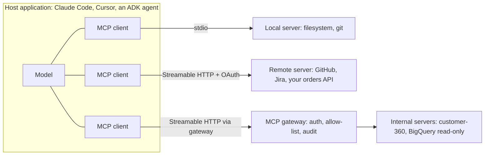

# 20b. MCP in depth: what it is, why teams add it, real server examples, building and securing servers

> **What you need to be able to say:** what the Model Context Protocol standardizes and what it does not; its architecture (host, client, server) and primitives (tools, resources, prompts, plus the client-side features); why organizations add MCP servers instead of writing function tools inline; a dozen concrete servers and why an agent needs each; how to build, deploy and secure one; what changed in the stateless 2026-07-28 revision; and how to keep hundreds of tools from eating the context window.

## 20b.1 What MCP is

MCP is an open protocol, introduced by Anthropic in November 2024 and contributed to the Linux Foundation's Agentic AI Foundation in December 2025 (alongside Block's goose and OpenAI's AGENTS.md), for connecting AI applications to the tools and data they need. It standardizes the interface, not the intelligence: a **host** (Claude Code, Claude Desktop, ChatGPT, Cursor, VS Code with Copilot, Gemini CLI, agents in Microsoft Foundry or on Bedrock AgentCore, an ADK or Strands agent you wrote) contains one **client** per connection — gateways such as AgentCore Gateway sit between clients and servers rather than acting as hosts (20b.6); each client talks to one **server**; servers expose capabilities over JSON-RPC 2.0, either as a local process over **stdio** or as a remote service over **Streamable HTTP**. The Linux Foundation counted more than 10,000 published MCP servers at the foundation's launch.



**Revisions you may hear about:** 2024-11-05 (first public version), 2025-03-26 (Streamable HTTP, the OAuth 2.1 authorization framework and tool annotations), 2025-06-18 (structured tool output, elicitation, resource links, servers classified as OAuth resource servers, JSON-RPC batching removed), 2025-11-25 (experimental tasks, URL-mode elicitation, client ID metadata documents) and **2026-07-28** (the stateless redesign, 20b.7). Know which revision your SDK and your hosts implement; mixed fleets are normal. The official Python SDK illustrates the transition: v2 (generally available August 2026) implements 2026-07-28 and still serves 2025-era clients from the same server instance, while v1.x receives security fixes only.

## 20b.2 The primitives

| Primitive | Who controls it | What it is | Example |
|---|---|---|---|
| **Tool** | the model decides when to call | a named action with a JSON Schema input (and optional output schema), returning content and/or `structuredContent`; annotations hint at behaviour (`readOnlyHint`, `destructiveHint`, `idempotentHint`, `openWorldHint`) | `create_issue(repo, title, body)`, `run_query(sql)` |
| **Resource** | the application decides what to attach | read-only context addressed by URI, with templates for parameterized URIs | `file:///repo/README.md`, `policy://refunds/2026`, `db://schema/orders` |
| **Prompt** | the user picks it | a reusable prompt template with arguments, often surfaced as a slash command | `/triage-ticket`, `/write-release-notes` |
| Deprecated features | — | **Sampling** (server asks the host's model for a completion) and **Roots** (host tells the server which directories it may use) are client features; **Logging** (server-to-client log messages) is a server utility; all three were deprecated in 2026-07-28 and stay functional for at least twelve months | direct calls to an LLM provider instead of Sampling; directories passed as tool parameters, resource URIs or server configuration instead of Roots; stderr (stdio) or OpenTelemetry instead of Logging |
| **Elicitation** | the server asks the user | structured questions mid-call (now via the multi-round-trip pattern, 20b.7) | "Which of these three accounts did you mean?" |
| **Extensions** | negotiated, always opt-in | optional, versioned additions outside the core, advertised in `server/discover` and in the client's per-request capabilities. Official ones in 2026: **Tasks** (long-running work with polling, moved out of the core), **MCP Apps** (`io.modelcontextprotocol/ui`: interactive UI such as forms and charts rendered inline in the conversation), **Skills over MCP** (discover and read Agent Skills through MCP resources), and authorization extensions (OAuth client credentials for machine-to-machine calls, Enterprise-Managed Authorization) | a 20-minute report job with polling; an order-tracking widget in the chat; a server that ships its own playbook as a skill |

## 20b.3 Why teams add MCP instead of inline function tools

1. **Write once, use everywhere.** Without a standard, every agent framework and host needs its own adapter for every system: N agents × M systems. With MCP, each system gets one server and each host one client: N + M. A "customer-360" server serves the support agent, the sales copilot, the analysts' Claude Desktop and the engineers' Claude Code.
2. **Ownership follows expertise.** The team that owns the orders database owns the orders server — its schema, permissions, rate limits and performance. Agent builders consume a stable contract instead of re-implementing access logic.
3. **Credentials stay out of the agent.** The server holds or obtains the credentials (ideally per user through OAuth); the model never sees a key.
4. **Governance in one place.** A gateway or registry can enforce which servers and tools each agent may use, log every call, rate-limit, and revoke — impossible when tools are scattered in application code.
5. **Portability.** The same server works with Claude, GPT, Gemini or an open model; switching hosts or models does not mean rewriting integrations.
6. **An ecosystem you can reuse.** Official servers exist for most developer and SaaS platforms; the marginal integration is often configuration, not code.
7. **Context hygiene.** Discovery (`tools/list`), deterministic ordering (better prompt-cache hit rates), cacheable listings and tool-search patterns let hosts load only what a task needs.

**When not to use MCP:** a single private helper used by one agent in one process (a plain function tool is simpler and faster); a latency-critical inner loop where a network hop matters; or when the target system already ships a first-class tool in your framework. MCP is an integration boundary; do not draw a boundary where there is no organizational seam.

## 20b.4 Server examples and why an agent needs each

| Server (official or widely used) | Exposes | Why agents use it | Main risk and the control |
|---|---|---|---|
| **GitHub** (official, local and remote) | issues, PRs, code search, Actions runs, reviews | coding agents, triage bots, release notes | write scope → fine-grained token or OAuth scopes, read-only mode, approvals for merges |
| **Filesystem** and **Git** (reference servers) | read/write within allowed paths; log, diff, commit | local agents and desktop assistants | path traversal and overwrites → allowed directories only, read-only by default |
| **Playwright MCP** (Microsoft), **Chrome DevTools MCP** (Google), Browserbase | page navigation, accessibility-tree snapshots, clicks, console and network inspection | web testing, browser tasks, debugging front ends | prompt injection from pages → isolated profile, allow-listed sites, no secrets in the session |
| **Databases**: Google's MCP Toolbox for Databases (BigQuery, AlloyDB, Spanner, Cloud SQL, Postgres and more), Snowflake, Databricks managed MCP (Unity Catalog functions, Genie, and AI Search indexes; AI Search was called Vector Search until June 2026), Postgres/SQLite servers | schema introspection, parameterized queries, curated "tools" defined as SQL | analytics agents, text-to-SQL, data assistants | exfiltration and runaway cost → read-only roles, row-level security with the user's identity, row/byte limits, timeouts, curated query tools instead of free SQL |
| **Atlassian (Jira, Confluence), Linear, Notion, Asana** | tickets, pages, projects | engineering and ops assistants, meeting-to-ticket flows | edits at scale → approval for writes, per-project scopes |
| **Slack, Microsoft 365 / Teams, Gmail, Google Drive** (official servers or claude.ai-style connectors) | messages, files, mail, calendar | knowledge retrieval and drafting | sending on someone's behalf → drafts only, human send; label- or channel-scoped access |
| **Sentry, Datadog, Grafana, PagerDuty** | errors, traces, metrics, incidents | SRE and on-call agents | noisy data and write actions → read-mostly, approvals for remediation |
| **Stripe, Shopify, PayPal** | payments, refunds, catalog, orders | commerce and support agents | money movement → test mode first, amount limits, approvals, idempotency keys |
| **Cloud platforms**: AWS MCP servers (AWS Labs: documentation, CDK, pricing, cost analysis and more), Azure MCP Server, Google Cloud servers, Cloudflare | infrastructure state, docs, costs | cloud ops copilots, FinOps agents | infrastructure changes → read-only by default, plan-and-approve for writes |
| **Neo4j (Cypher), Memgraph** | schema, read Cypher, sometimes write | GraphRAG and compliance agents (chapter 25) | expensive traversals → read-only, query timeouts, LIMIT enforcement |
| **Apify, Firecrawl** | actors/scrapers, page-to-markdown crawling | collection where browsers are too slow (chapter 54) | terms of service and personal data → allow-listed sources, legal review |
| **Context7 and documentation servers** | current library docs and examples | coding agents that would otherwise use stale APIs | lower risk, but the returned docs are third-party text that can carry injected instructions → treat as untrusted data, pin versions, no write tools in the same session |
| **Aggregators**: Zapier, Composio, Pipedream | thousands of SaaS actions behind one server | long-tail integrations | broad scopes → per-action allow-lists |
| **Your own** (orders, customer-360, policy search, pricing, feature flags) | your domain objects as scoped tools | the most valuable servers in any company | the controls in 20b.6, owned by the system's team |

**Critic's additions: vetting a third-party server before anyone installs it.** "Official" is a claim about the publisher, not about safety in your context; the same GitHub server is harmless with a read-only token scoped to one repository and dangerous with a broad personal token. In May 2025 Invariant Labs showed a malicious issue in a public repository steering an agent (Claude Desktop with the GitHub MCP server) into reading the user's private repositories and leaking their contents into a public pull request; the model behaved as instructed by the data, and the researchers noted that any agent using that server with a broad token was exposed. A review that takes an hour and prevents this:

| Check | What to look for | Control if it fails |
|---|---|---|
| Publisher and provenance | official registry entry, verified namespace, signed releases, a maintained repository | use a fork you build yourself, or do not install |
| Scopes the server needs | the narrowest token or OAuth scopes that still do the job; per-repository or per-project tokens | create a dedicated least-privilege credential; never reuse a personal admin token |
| Tool surface | number of tools, write tools, tools that reach the open web (`openWorldHint`), free-text query tools | disable unneeded tools at the host or gateway; split read and write servers |
| Descriptions | hidden instructions, unusually long text, instructions about other tools | pin the version, hash the descriptions, alert and re-approve on change (scanners such as mcp-scan automate this) |
| Data flow | which inputs come from untrusted parties (issues, emails, web pages) | one repository or mailbox per session, no outbound write tool in the same session, approval for writes |
| Runtime | local process with your user's permissions, or remote | containerize local servers; keep production credentials off the machine |

## 20b.5 Building a server

A minimal Python server with the official SDK. In v2 (generally available August 2026) the `FastMCP` class was renamed `MCPServer`, the old import paths were removed and Python field names became snake_case; the decorators kept their arguments. If a host still needs a 1.x server, pin `mcp>=1.28,<2` and write `from mcp.server.fastmcp import FastMCP` with `ToolAnnotations(readOnlyHint=True)`. APIs evolve with spec revisions; match your SDK version to the revision your hosts support:

```python
from mcp.server import MCPServer
from mcp.types import ToolAnnotations

mcp = MCPServer("orders")

@mcp.tool(annotations=ToolAnnotations(read_only_hint=True, open_world_hint=False))
def get_order(order_id: str) -> dict:
    """Look up one order by id (format ORD-123456). Returns status, items, ETA.
    Use when the user asks about a specific order. Read-only."""
    order = ORDERS_API.get(order_id)          # your backend, with the caller's identity
    if order is None:
        return {"status": "not_found", "hint": "ids look like ORD-123456"}
    return {"status": "found", "order": order}

@mcp.resource("policy://refunds")
def refund_policy() -> str:
    """Current refund policy text."""
    return POLICY_STORE.read("refunds")

@mcp.prompt()
def triage(ticket: str) -> str:
    return f"Classify this ticket into billing, technical or account and propose the next action:\n{ticket}"

if __name__ == "__main__":
    mcp.run("stdio")                                                 # local use
    # mcp.run(transport="streamable-http", host="0.0.0.0", port=8000)  # remote, behind TLS and OAuth
```

Try it before wiring it into any host: `uv run mcp dev orders_server.py` opens the server in the MCP Inspector, where you can list and call every tool by hand. In v2, synchronous tool functions run on worker threads rather than blocking the event loop, so a slow backend call no longer stalls every other request on the server.

Register it in a host: `claude mcp add orders -- python orders_server.py` (stdio) or `claude mcp add --transport http orders https://mcp.example.com/mcp` (remote, authenticate in `/mcp`); commit a project-scoped `.mcp.json` so the whole team gets the same servers. In ADK, Strands, LangChain (MCP adapters), the OpenAI Agents SDK or Microsoft Agent Framework, an MCP client toolset loads the same server.

**Tool design rules that matter more than the transport.** Few, well-scoped tools (prefer `get_order` and `refund_order` over `run_sql`); descriptions written for the model (when to use it, argument formats, an example); strict input schemas; an output schema and `structuredContent` so downstream code does not parse prose; results that distinguish *not found*, *forbidden* and *error* (chapter 39b.2); pagination and size caps; idempotency keys for writes; truthful annotations; deterministic `tools/list` order; semantic versioning of tool contracts; and tests that call every tool with recorded fixtures. Annotations are hints for the client's approval UI, not security: a client may ignore `read_only_hint`, so a read-only tool must also run with a read-only backend credential.

**Deploying remote servers.** Streamable HTTP behind TLS on Cloud Run, Lambda, Container Apps or Kubernetes; OAuth via your identity provider; OpenTelemetry traces with the trace context carried in `_meta` (2026-07-28 documents the `traceparent`, `tracestate` and `baggage` keys) so a span in the agent links to the span in the server; rate limits per client; health checks; and a registry entry with owner, version and scopes.

## 20b.6 Security: what is specific to MCP

- **Authorization for remote servers.** MCP servers are OAuth 2.1 resource servers: they publish protected-resource metadata, accept only tokens issued for them (audience-bound via resource indicators), and never pass a client's token through to upstream APIs (the "no token passthrough" rule prevents confused-deputy attacks — use the server's own credentials or a proper token exchange). Clients register via **Client ID Metadata Documents** (Dynamic Client Registration is deprecated as of 2026-07-28 and kept only for authorization servers that cannot read metadata documents), use PKCE, validate a returned `iss` parameter against the recorded issuer before redeeming the code (RFC 9207; authorization servers should send it), and key stored credentials by issuer, never reusing them with a different authorization server. For machine-to-machine calls and for companies that want the corporate identity provider to decide which servers an employee may connect to, use the official OAuth client-credentials and Enterprise-Managed Authorization extensions rather than long-lived API keys.
- **Tool poisoning and rug pulls.** A malicious or compromised server can hide instructions in tool descriptions or change them after you approved the server. Controls: install from trusted registries, pin versions, review descriptions, alert on description changes, and run untrusted servers sandboxed with no secrets.
- **Prompt injection through results.** Tool outputs (web pages, emails, tickets) are untrusted data. Avoid the "lethal trifecta" in one agent — access to private data, exposure to untrusted content, and an exfiltration channel — by removing at least one leg (no outbound tools, or no untrusted input, or no private data) or by requiring human approval for outbound actions.
- **Least privilege and identity.** Per-user OAuth so the server sees the end user's permissions; read-only defaults; separate servers for read and write paths; scopes per tool.
- **Local servers.** They run with your user's permissions: containerize them (Docker's MCP catalog and gateway do this), restrict filesystem roots via configuration, and never run unknown servers on a machine with production credentials.
- **Gateways and registries.** AgentCore Gateway, Docker MCP Gateway, Azure API Management, Apigee, Kong, Cloudflare and Databricks Unity Gateway offer MCP-aware gateways (auth, allow-lists, audit, quotas); the official MCP Registry, GitHub's MCP registry, Docker's catalog and private registries (AgentCore Registry, with a publish-review-approve workflow for agents, MCP servers, tools and skills) record what is approved. Since 2026-07-28 a gateway can route and authorize on the `Mcp-Method` and `Mcp-Name` headers without parsing the body, but it must reject requests whose headers disagree with the body (the specification defines a `HeaderMismatch` error) or an attacker can smuggle a forbidden tool call behind an allowed header.

**Critic's additions: the security review an interviewer expects for a new MCP server.** Walk it as a threat model, one line per risk. *Spoofed server or client:* OAuth with audience-bound tokens and issuer validation. *Confused deputy:* no token passthrough; the server calls upstream with its own credentials or an on-behalf-of exchange scoped to the user. *Over-broad tools:* one intent per tool, read and write split, curated queries instead of free SQL. *Injection through results:* label tool output as untrusted, strip or escape instructions where possible, and never pair untrusted input, private data and an outbound tool in one session without approval. *Poisoned or changed descriptions:* pinned versions, description hashes, re-approval on change. *Duplicate side effects:* idempotency keys on every write (more important after 2026-07-28, see 20b.7). *Denial of wallet:* per-client rate limits, result size caps, timeouts. *Audit:* every call logged with principal, tool, argument hash, result status and trace id. If you can name the control and the test for each line, the interviewer stops probing.

Chapter 49b.8.5 walks through how an MCP client obtains a token from the server's authorization server, with the OAuth 2.0 and PKCE mechanics in 49b.6 and 49b.7.

## 20b.7 The 2026-07-28 revision: stateless MCP

The latest revision removes protocol-level sessions so servers scale like ordinary stateless HTTP services:

- **No handshake, no sessions.** The `initialize`/`notifications/initialized` exchange, the `Mcp-Session-Id` header and `ping` are gone; each request carries `io.modelcontextprotocol/protocolVersion` and `io.modelcontextprotocol/clientCapabilities` (and should carry `clientInfo`) in `_meta`, and a version the server does not speak returns `UnsupportedProtocolVersionError`; servers must implement `server/discover` to advertise versions, capabilities and identity. List endpoints no longer vary per connection. Cross-call state, when needed, travels as explicit server-minted handles in tool arguments.
- **Multi round-trip requests (MRTR).** Instead of servers sending their own requests to the client (`sampling/createMessage`, `elicitation/create`, `roots/list`), a server returns an `InputRequiredResult` (`resultType: "input_required"`) whose `inputRequests` say what it needs; the client retries the original request with `inputResponses`, and a server that must correlate the rounds encodes its own identifier in `requestState`. Every result now carries `resultType` (`"complete"` or `"input_required"`); results from older servers without it count as complete. URL-mode elicitation lost its completion notification for the same reason: the client learns the outcome by retrying.
- **Subscriptions.** `subscriptions/listen` (one long-lived stream, opt-in per type: `toolsListChanged`, `promptsListChanged`, `resourcesListChanged`, `resourceSubscriptions`) replaces the GET stream and `resources/subscribe`; request-scoped progress and log messages still flow on the request's own response stream; SSE resumability (`Last-Event-ID`) was removed, so a broken stream means re-issuing the request with a new id. Log level is now set per request in `_meta` (`logging/setLevel` was removed).
- **Caching and headers.** List and read results carry `ttlMs` (a freshness hint) and `cacheScope` (`"public"` or `"private"`, which decides whether shared intermediaries may cache); servers should list tools in a deterministic order (helps client caches and LLM prompt-cache hit rates); POSTs carry standard `Mcp-Method`/`Mcp-Name` headers that gateways can route on, and tool parameters can be mapped to custom headers with `x-mcp-header`.
- **Schemas and errors.** Input and output schemas may use any JSON Schema 2020-12 keyword and `structuredContent` may be any JSON value; "resource not found" moved from error code -32002 to -32602 (invalid params), which breaks clients that matched on the old number.
- **Deprecations and moves.** Roots, Sampling and Logging deprecated (twelve-month minimum window under the new lifecycle policy, tracked in a deprecated-features registry); the old HTTP+SSE transport formally deprecated; Dynamic Client Registration deprecated in favour of Client ID Metadata Documents; long-running **tasks** moved to an official extension with polling (`tasks/get`, `tasks/update` for mid-flight input; `tasks/list` removed).
- **Why it matters.** Servers can run on serverless platforms and behind ordinary load balancers without sticky sessions; gateways become simpler; caching improves; fewer server-initiated flows means fewer security surprises. Expect SDKs, hosts and gateways to support several revisions at once during the transition.

**Critic's additions: what a stateless request looks like, and what breaks when you migrate.** A complete `tools/call` under 2026-07-28 carries everything the server needs, so any replica behind a load balancer can answer it:

```json
{"jsonrpc": "2.0", "id": 7, "method": "tools/call",
 "params": {"name": "get_order", "arguments": {"order_id": "ORD-123456"},
  "_meta": {"io.modelcontextprotocol/protocolVersion": "2026-07-28",
            "io.modelcontextprotocol/clientCapabilities": {"extensions": {}},
            "io.modelcontextprotocol/clientInfo": {"name": "support-agent", "version": "3.2.0"},
            "traceparent": "00-4bf92f3577b34da6a3ce929d0e0e4736-00f067aa0ba902b7-01"}}}
```

The failure modes interviewers probe:

| Change | What goes wrong if you ignore it | Fix |
|---|---|---|
| No stream resumability | a dropped connection during a write tool makes the client re-issue the call, and a non-idempotent tool refunds or emails twice | idempotency key on every write (from the arguments plus a client-supplied or server-minted operation id); store the result and return it on a repeat |
| State as handles | a guessable or long-lived handle becomes a bearer token for another user's cart or draft | random, principal-bound, expiring handles; validate the owner on every call |
| `cacheScope` | a tool list that depends on the caller's permissions, marked `"public"`, is served from a shared cache to another tenant and leaks tool names or hints | `"private"` for anything identity-dependent; short `ttlMs` where permissions change often |
| Header routing | a gateway authorizes on `Mcp-Name` while the body names another tool | reject on header and body mismatch at the gateway and at the server |
| Sampling deprecated | servers that borrowed the host's model now call a provider directly, which adds cost, credentials and a new data flow | budget and security review for the server's own model access |
| Mixed fleets | a 2025 client meets a 2026-only server (or the reverse) and fails at the first request | serve both from one instance during the transition, as the Python SDK v2 does, and test both in CI |

## 20b.8 Keeping many tools from eating the context

Each tool's name, description and schema costs tokens on every call, and model accuracy in choosing tools drops as the list grows. Patterns: give each agent or sub-agent only the servers its task needs; namespace tools (`orders.get`, `crm.find_account`); use **tool search** (the host loads definitions on demand when the model searches for a capability); use **code execution with MCP** — the agent writes a short program that calls tools and filters results in a sandbox, so large intermediate data never enters the context (Anthropic reported large token reductions with this pattern); cache tool listings; and measure tool-selection accuracy in evals as the catalog grows.

**Critic's additions: the numbers behind these patterns, and their costs.** Anthropic's published figures (November 2025) are the ones interviewers quote. Its tool search tool cut tool-definition tokens by about 85% and, on its MCP evaluations, raised tool-selection accuracy from 49% to 74% for Claude Opus 4 and from 79.5% to 88.1% for Opus 4.5; programmatic tool calling (the model writes code that calls tools) cut average usage from 43,588 to 27,297 tokens (37%); adding concrete input examples to tool definitions raised accuracy on complex parameters from 72% to 90%. The code-execution write-up shows one workflow dropping from 150,000 to 2,000 tokens (98.7%) by keeping intermediate results in the sandbox. The trade-offs: tool search adds a retrieval step that can miss a tool whose description does not match the user's words (write descriptions with the words users use and evaluate recall of the search itself); code execution needs a sandbox with resource limits, network policy and monitoring, which is operational work and a new attack surface; and a skill that loads instructions on demand (Skills over MCP) is often cheaper than ten narrowly described tools. Treat "number of tools in context" as a budget with an owner, like latency.

## 20b.9 MCP next to A2A, OpenAPI and function calling

Function calling is how a model emits a structured call; MCP is how hosts discover and invoke tools owned by someone else; OpenAPI describes HTTP APIs (many MCP servers wrap one, and some gateways generate MCP tools from an OpenAPI spec); A2A connects agents to other agents with task lifecycles. A typical enterprise uses all four: function tools for in-process helpers, MCP for shared systems, OpenAPI under the hood, A2A for cross-team or cross-vendor delegation. The full mapping is in chapter 28b.

## 20b.10 Scenarios

- **Customer-360 server.** A CRM team publishes `find_account`, `get_open_tickets`, `get_contracts` and `get_health_score` with per-user OAuth and row-level filtering; the support agent, the account-management copilot and engineers in Claude Code all reuse it; usage and latency per tool appear in one dashboard; a new field ships once, everywhere.
- **Governed analytics.** The data platform team exposes curated BigQuery tools through MCP Toolbox for Databases (parameterized SQL defined by the team, not free text) and a Databricks Genie space through managed MCP; analysts' agents get answers within their permissions; costs are capped per query.
- **The job-search kit in Part 1.** Gmail arrives as a claude.ai connector (a remote MCP server), the browser through the Claude in Chrome MCP server, collection (where allowed) through the Apify MCP server — three servers, zero custom integration code.
- **Compliance review.** A Neo4j server exposes read-only Cypher tools over the disclosure graph; all reviewer agents share it; the legal team owns the graph and its server.
- **Incident response.** Sentry, Grafana and PagerDuty servers give an SRE agent evidence; a separate write server (restart, scale, rollback) sits behind approvals and a policy engine.

**Interview line:** *"MCP turns integrations into owned, governed, reusable services: the system's team publishes scoped tools with per-user OAuth and strict schemas, a gateway enforces allow-lists and audit, and any host — Claude Code, an ADK agent, Copilot — can use them. Since the July 2026 revision it is stateless, so servers scale like normal HTTP services; the open problems are tool poisoning, injection through results and context cost, and I design for each explicitly."*
