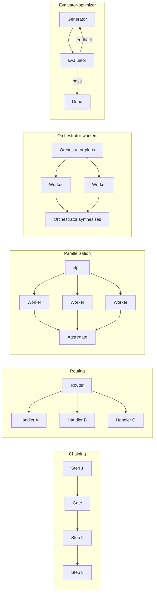

# 22. Agentic design patterns

> **What you need to be able to say:** the difference between a workflow and an agent; the six composable patterns (chaining, routing, parallelization, orchestrator–workers, evaluator–optimizer, autonomous loop); the supporting patterns (ReAct, plan-and-execute, reflection, memory, human-in-the-loop); the multi-agent topologies and when each is a mistake; what MCP and A2A standardize; what "latent reasoning" means; and the failure modes with their mitigations. Go deeper: Part 6 → *Agentic AI design patterns study guide*, *Multi-agent papers reading list*.

## 22.1 Workflows versus agents

A **workflow** is code that calls models in a predetermined order; the LLM fills in steps, the program decides the path. An **agent** is a system in which the model decides the path — which tool to call, whether to continue, when it is done — within limits you set. The practical rule from Anthropic's "Building effective agents" still holds: use the simplest thing that works; most "agents" in production are workflows with one or two agentic steps, and the fully autonomous loop is reserved for open-ended tasks (coding, research, operations) where the number of steps cannot be known in advance.

Reliability comes from four things regardless of pattern: good tools (clear names, descriptions, typed inputs, informative errors), tight context (only what this step needs), explicit stop conditions and budgets (max turns, max tokens, max dollars, wall-clock), and evaluation on real tasks.

The arithmetic that justifies "simplest thing that works" is compounding: if each step of an autonomous run succeeds independently with probability 0.95, a 20-step run succeeds 0.95²⁰ ≈ 36% of the time, and a 50-step run under 8%. Real agents beat that curve only because they *observe and correct* — a failed test, an empty query result or a 404 is feedback the next step can act on. So the design question for every step is not "how smart is the model" but "what verifiable signal does this step produce, and who checks it": steps with a checker (tests, schema validation, a query that must return rows) can be autonomous; steps without one should be fixed workflow, a human gate, or a second model's review.

## 22.2 The six composable patterns

1. **Prompt chaining.** Decompose a task into fixed steps with programmatic checks between them (extract → validate → transform → write). Use when the steps are known and quality improves by making each simpler. Example: generate marketing copy → check against the brand-voice rules → translate → check length.
2. **Routing.** Classify the input and send it to a specialized prompt, model or pipeline. Use when inputs fall into distinct categories that need different handling, and to send easy cases to cheap models. Example: support tickets → refund flow, technical flow, sales flow; or easy/hard → Haiku/Opus.
3. **Parallelization.** Run independent sub-tasks at once (sectioning) or run the same task several times and vote/merge (voting). Use for speed, for guardrails running alongside the main call, and for robustness on judgement calls. Example: review a contract for five risk categories in parallel; three independent judges vote on policy compliance.
4. **Orchestrator–workers.** A central model breaks a task into sub-tasks it could not predict in advance, dispatches workers (often with fresh, isolated context), and synthesizes. Use when the decomposition depends on the input. Example: "fix this bug" → orchestrator finds the files that matter and assigns a worker per file; deep-research agents spawn a searcher per sub-question.
5. **Evaluator–optimizer.** One model generates, another critiques against explicit criteria, and the loop repeats until the evaluator passes or a budget runs out. Use when clear evaluation criteria exist and iteration measurably helps (translation, code with tests, SQL that must execute). Example: generate SQL → run it → evaluator checks result shape and errors → regenerate.
6. **Autonomous agent loop.** Model + tools + environment feedback until a stop condition; checkpoints and human approvals at risky steps. Use for open-ended work with verifiable feedback (tests pass, page loads, ticket closed). Example: Claude Code, operations runbooks, browser agents.

### Critic's additions: what each pattern costs, and when it is a mistake

| Pattern | Model calls per request | Latency | It is a mistake when… |
|---|---|---|---|
| Chaining | n, sequential | sum of the steps | steps are not really separable, so each loses context the next needs; errors propagate without a gate |
| Routing | 1 small classifier + 1 handler | + 50–300 ms for the router | categories overlap or drift, and a misroute has no recovery path (always add an "unsure → general handler" route) |
| Parallelization (sectioning) | n, concurrent | the slowest branch | branches depend on each other's output, or the merge step is harder than the task |
| Parallelization (voting) | k × the base call | about one call | the voters share a model and prompt, so their errors are correlated and the vote adds cost, not accuracy |
| Orchestrator–workers | 1 plan + n workers + 1 synthesis (multi-agent research runs reach ~15× chat tokens) | plan + slowest worker + synthesis | the decomposition is actually predictable (use chaining or sectioning — cheaper and testable) |
| Evaluator–optimizer | 2 per iteration | iterations × 2 calls | there is no crisp criterion; gains flatten after 2–3 rounds, so cap the loop |
| Autonomous loop | unbounded until the budget | seconds to hours | the path is knowable — then it is an expensive, less testable workflow |

Rule of thumb for an interview whiteboard: estimate calls × tokens × price per pattern before drawing boxes, and pick the cheapest pattern whose failure mode you can detect.

## 22.3 Supporting patterns

- **ReAct** (reason + act): interleave a short reasoning step with a tool call and an observation; the basis of every tool loop. Modern models do this natively; the pattern lives on in how you log and inspect the trace.
- **Plan-and-execute**: produce a plan first (a list of steps or a DAG), then execute steps, replanning on failure. Better cost control and visibility than pure ReAct for long tasks; worse at reacting to surprises unless replanning is explicit.
- **Reflection / self-critique**: after producing an output, the model (or a second model) critiques it against a rubric and revises. Cheap wins for writing and code; diminishing returns beyond one or two rounds; always bound the loop.
- **Tool use done well**: tools should be the unit of safety and testability — idempotent where possible, with explicit side-effect flags, dry-run modes, input validation, pagination, and error messages written for the model ("No order with id X; ids look like ORD-123456"). Fewer, better tools beat many overlapping ones; a tool that returns 50 KB of JSON wastes context — return what the next step needs. Three 2025–26 mechanisms address large tool catalogs, and interviewers now expect you to know them: **tool search** (the model sees a search tool plus a few always-loaded tools and pulls other definitions on demand — Anthropic reported an 85% cut in tool-definition tokens and MCP-eval accuracy rising from 49% to 74% on Opus 4), **tool-use examples** inside the definition (72% → 90% on complex parameter handling in the same report), and **code as the action space** (the model writes a short program that calls tools in a sandbox and returns only the filtered result — "programmatic tool calling" cut tokens 37% on complex research tasks, and Anthropic's code-execution-with-MCP write-up showed a 150k → 2k-token reduction on a Drive-to-Salesforce workflow, at the price of running a sandbox). smolagents' CodeAct-style agents are the open-source version of the same idea.
- **Memory**: working memory (the context window — manage it with summaries and compaction), episodic memory (past runs, retrievable), semantic memory (facts about the user or domain, stored as structured records or a small knowledge graph), procedural memory (skills and instructions). Managed options: AgentCore Memory, Google's Agent Memory Bank, Foundry Agent Service memory, Databricks managed agent memory (beta 2026), mem0, Zep; the pragmatic one: a Postgres table plus a vector index with explicit write policies — the agent should not be allowed to remember everything. Memory is also an attack surface: an injected instruction that gets written to long-term memory replays in every future session ("memory poisoning"), so memory writes need the same provenance and review as any other untrusted input.
- **Context engineering**: the discipline of deciding what goes into the window each turn: system prompt, tool schemas (cached), retrieved evidence (ranked and trimmed), conversation summary, scratchpad; sub-agents with clean windows for sub-tasks; files as external memory; progressive disclosure of instructions (load the skill when needed). Most "the agent got dumber after 40 turns" problems are context problems.
- **Human-in-the-loop (HITL)**: approval gates before irreversible actions (payments, emails, deletes, deployments), review queues for low-confidence outputs, escalation paths, and the ability to pause a run for days (checkpointed state). Design the approval surface as a first-class UI, not a console prompt.
- **Guardrails** at three points: input (injection and policy classifiers), tool arguments (allow-lists, schemas, authorization), and output (grounding checks, PII, format). Chapter 30.

## 22.4 Multi-agent topologies

| Topology | Shape | Use when | Risk |
|---|---|---|---|
| Supervisor / sub-agents | one coordinator delegates to specialists and merges | heterogeneous skills, isolated context, parallelism | coordinator becomes the bottleneck and the context hog |
| Hierarchical | supervisors of supervisors | very large task trees | compounding error and cost |
| Handoff / swarm | peers transfer control to the agent best suited for the next step | conversational flows (sales → billing → tech) | loops; losing state across handoffs |
| Agents-as-tools | an agent is just a tool the caller invokes | encapsulation; reuse; A2A | hidden cost per call |
| Debate / voting | several agents argue or vote | judgement, safety-critical classification | expensive; correlated errors if same model |
| Blackboard / event-driven | agents react to shared state or events | long-running operations, asynchronous steps | hard to reason about ordering |

Two facts decide most designs: sub-agents are valuable mainly because they get a **fresh context window** and can run **in parallel**; and every extra agent adds a channel for error and cost. Start with one agent and good tools; split when context or latency forces it.

The best public numbers on both sides of that trade-off: Anthropic's research system (June 2025), with an Opus 4 lead and Sonnet 4 sub-agents, beat a single Opus 4 agent by 90.2% on its internal research eval — but agents used about 4× the tokens of a chat and the multi-agent system about 15×, and token usage alone explained 80% of the performance variance on BrowseComp. In other words, much of the multi-agent gain is "spend more tokens in parallel, in clean contexts". The same write-up warns that tasks where agents must share context or depend tightly on each other — most coding — are a poor fit, the argument Cognition made in "Don't build multi-agents" the same month. The failure taxonomy to cite is MAST (Cemri et al., NeurIPS 2025): 14 failure modes in three categories — specification and system-design issues, inter-agent misalignment, and task verification — from traces of seven multi-agent frameworks, with verification (nobody checks the final answer) among the most common.

**Protocols.** **MCP** standardizes how an agent discovers and calls tools, reads resources and uses prompt templates from servers (local via stdio, remote via streamable HTTP with OAuth 2.1; the 2026-07-28 revision made it stateless, chapter 20b); it is the integration layer. **A2A** standardizes how agents advertise capabilities (agent cards at `/.well-known/agent-card.json`), exchange tasks with lifecycle states (submitted, working, input-required, auth-required, completed, failed, canceled, rejected), stream updates or push them to webhooks, and authenticate across organizations; v1.0 shipped in March 2026 with JSON-RPC, gRPC and HTTP+JSON bindings; it is the collaboration layer. The rule for choosing: if the other side is a deterministic capability, expose it as an MCP tool; if it is an autonomous agent with its own long-running task state and its own policy, talk to it over A2A. Together they let a Strands agent on AWS call a Copilot Studio agent's A2A endpoint that itself uses MCP tools on Azure — and they are what interviewers mean by "interoperability".

## 22.5 Latent reasoning and thinking budgets

"Reasoning" models emit a chain of thought before the answer; you buy accuracy on hard problems with a token budget and latency. **Latent reasoning** (recurrent-depth transformers, looped layers, "thinking in continuous space") performs extra computation in hidden states without emitting tokens — not limited by vocabulary, at the cost of interpretability. It is not cheaper per step: a latent step costs about one forward pass, like one decoded token, and the saving comes from needing fewer steps and not writing messages out as text (22c.4.7). In workflow design the practical mapping is: give the planner and the evaluator a thinking budget; give the workers none; route by difficulty; cache the stable prefix; and never let a thinking-enabled model sit inside a tight loop without a cap. Two mechanics matter inside tool loops: **interleaved thinking** (the model reasons again after each tool result, not only before the first call — the default on the current Claude frontier models, which think adaptively) and **thinking-block preservation** (on the Claude API, thinking blocks from the last assistant turn must be passed back unmodified with the tool results, or the reasoning chain breaks; frameworks that "clean up" messages silently degrade agents this way). Thinking tokens are billed as output and count against the context window of the turn. Chapter 22c covers latent reasoning in agents in depth — how models reason and communicate in hidden space, the costs and risks, monitoring latent states, and what closed APIs and open weights allow today — and chapter 39 turns this into interview answers.

## 22.6 Failure modes and mitigations

| Failure | Looks like | Mitigation |
|---|---|---|
| Runaway loops | the agent retries the same tool 30 times | max turns/tool calls, loop detection, exponential backoff, budget per run |
| Context rot | quality collapses after many turns | summarization, compaction, sub-agents, file-backed memory, trimming tool outputs |
| Tool misuse | wrong tool, bad arguments, dangerous calls | typed schemas, validation, allow-lists, dry-run, approval gates, better descriptions |
| Hallucinated success | "Done!" with nothing done | verify with a tool (tests, query, screenshot); evaluator step; require evidence in output |
| Prompt injection via tool results | a web page or email tells the agent to exfiltrate data | treat tool output as data; injection classifiers; least-privilege tokens; no secrets in context; human approval for outbound actions |
| Cost blow-up | \$400 for one task | budgets, routing, caching, batch for offline parts, alerts on spend per run |
| Non-determinism in evals | flaky tests | fixed seeds where possible, judge rubrics, multiple samples, pass@k and pass^k reporting |
| Multi-agent chatter | agents thanking each other | explicit protocols, structured messages, turn limits, one owner per decision |
| Specification gaming | a coding agent makes tests pass by editing or deleting the tests, or hard-codes the expected output | protect test and config paths (read-only), diff review of test changes, hidden held-out tests, reviewer agent instructed to look for exactly this |
| Premature termination | stops after the first plausible answer; skips half the checklist | explicit completion criteria, a todo list the harness checks, verifier step before "done" |
| Goal drift | after a long run the agent optimizes a sub-goal (formatting) over the task | re-inject the goal and constraints after compaction; plan tool; periodic self-check against the original request |
| Tool hallucination | calls a tool or argument that does not exist, or invents an id | strict schemas, `tool_choice` constraints, validation errors returned to the model, ids only from prior tool output |
| Lost state on handoff or compaction | sub-agent or summary drops a constraint ("budget is \$500") | structured state object outside the transcript; constraints pinned in the system prompt; summaries tested for constraint retention |

## 22.7 Scenarios (use-case driven)

- **Marketing content review (resume use case).** Chaining + parallel evaluators + HITL: a draft passes through brand-voice, legal and regulatory reviewers running in parallel, each a specialized agent with its own retrieval (brand rules, disclosure requirements); conflicts between reviewers are detected and a planner proposes rewrites; a human approves. Metrics: review cycle time, escapes caught by humans later, cost per asset.
- **Inventory and pricing copilot (resume use case).** Routing + tools: a question router sends forecasting questions to a tool that calls the demand model, pricing questions to an elasticity model, "why" questions to RAG over reviews and sales data; an evaluator checks numbers against the warehouse before they are shown. The agent never computes a forecast itself.
- **Customer-support agent.** Supervisor with handoffs to billing, technical and retention agents; each has 3–5 tools; a shared memory of the customer record; approval gate before refunds over a threshold; a judge samples 5% of conversations daily.
- **Deep research.** Orchestrator–workers: plan sub-questions, spawn searchers with fresh context, verify claims with citations, synthesize; budgets per worker; the final report cites sources the evaluator checked.
- **Coding agent in CI.** Autonomous loop with verifiable feedback (tests, linters, type checks), isolated worktree per task, reviewer agent on the diff, human merges.

**Interview line:** *"Start with a workflow and add agency only where the path cannot be known in advance. Six patterns cover almost everything — chain, route, parallelize, orchestrate, evaluate-and-refine, loop — and the reliability comes from tool design, context control, budgets and evals, not from the number of agents."*
