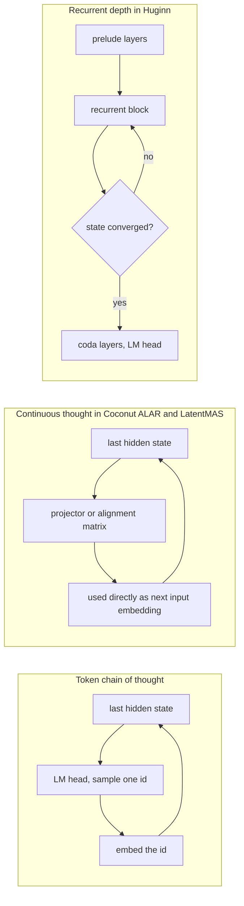
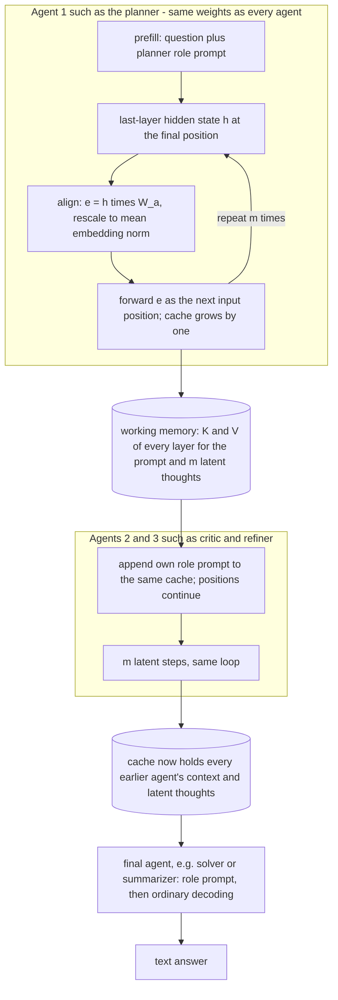
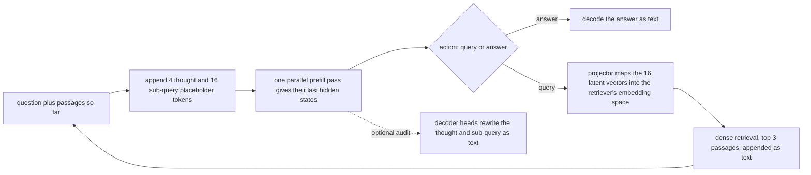
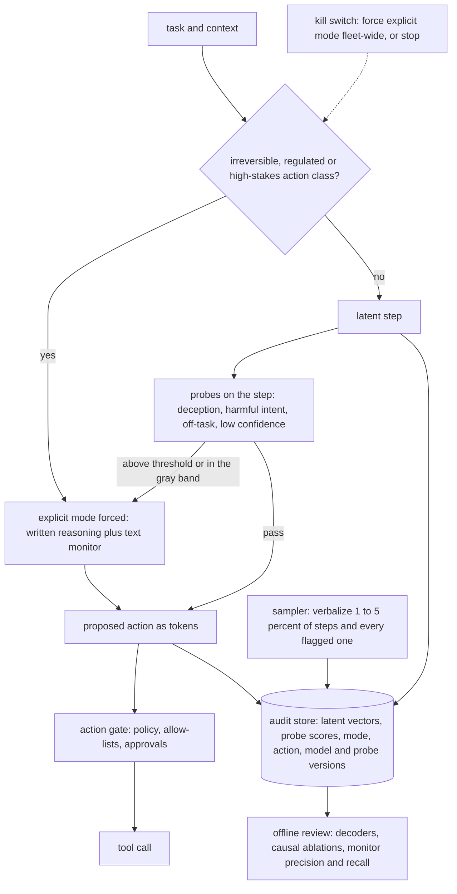
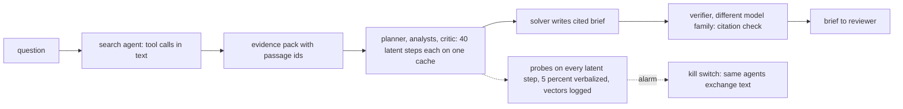

# 22c. Latent reasoning in agents: thinking and communicating in hidden space

> **What you need to be able to say:** how a visible chain of thought, the hidden thinking of production APIs and latent reasoning in hidden states differ, and which reading of "latent reasoning" (architectural or operational, chapter 39b) the interviewer means; the mechanisms — pause tokens, distilled chains, Coconut's continuous thoughts, recurrent depth, KV-cache and activation exchange; what ALAR, LatentMAS and LatentRAG measure, with the conditions behind "84.6% fewer tokens", "up to 7× faster" and "about 90% lower latency"; when efficiency, expressiveness and lossless exchange hold; what latent reasoning costs in monitorability, serving and security; how to monitor hidden states with probes and decoders; and what you can build with closed APIs versus open weights. Chapter 22.5 has the one-paragraph version and chapter 39b the interview drill. Dated October 2026.

## 22c.1 Three kinds of "thinking", and two readings of "latent reasoning"

Classify a reasoning method by what carries an intermediate step from one forward pass to the next.

**Token-level chain of thought.** The model writes its intermediate reasoning as ordinary tokens and conditions on them: the language-model head turns the last hidden state into a distribution over the vocabulary, one id is sampled, embedded and fed back. Anyone can read the chain, and every intermediate token costs a decoding step billed as output.

**Hidden or summarized thinking (production APIs).** The model still reasons in tokens, but the provider keeps them. On the Claude API each thinking block carries a `signature`, documented as an encrypted copy of the full reasoning; on Claude Opus 4.7 and later models (Opus 5.5, Sonnet 5.5 and Fable 5.1 among them) `display` defaults to `"omitted"`, so the thinking text comes back empty; no setting returns the raw chain; omitting cuts latency, not cost, because you pay for the full thinking tokens; and inside a tool-use turn the blocks must go back unmodified (an edited block is rejected with a 400 error). Gemini returns thought signatures, "encrypted representations of the model's internal reasoning", which stateless clients must resend exactly, and at most summaries of the thoughts. OpenAI's reasoning tokens are invisible but billed as output, summaries are opt-in, and stateless clients round-trip encrypted reasoning items. All three are reasoning *tokens* held in encrypted form: latent only to you.

**Latent reasoning.** Intermediate computation is carried by continuous vectors that are never mapped to a vocabulary id: a last-layer hidden state fed back as the next input embedding (Coconut, ALAR's latent block, LatentMAS's latent steps); a block of layers iterated a variable number of times (recurrent depth); placeholder positions whose hidden states are computed in one parallel pass (pause tokens, LatentRAG's latent tokens); or KV caches and activations handed from one model to another (Cache-to-Cache, LatentMAS's working memory).

| | Visible chain of thought | Hidden or summarized thinking (APIs) | Latent reasoning (hidden states) |
|---|---|---|---|
| What carries a step | a sampled token id, re-embedded | a sampled token id the provider keeps | a continuous vector: hidden state, recurrent state or KV entries |
| Cost per step | one decode step, billed as output | one decode step, billed as output | one forward pass per latent step (Coconut, ALAR, LatentMAS); one parallel pass for many placeholders (LatentRAG); extra layer iterations (recurrent depth) |
| Who can read it | you, your monitor, your auditor | the provider; you see a summary or nothing | nobody directly; decoders and probes give partial views |
| Budget knob | max tokens, thinking budget | effort or thinking level | latent steps, recurrences, mode choice per turn |
| Where it runs | any model | Claude, Gemini, OpenAI reasoning models | open-weight models you host and modify |
| Carries across models? | yes, it is text | only within limits: Claude thinking blocks are readable only by the producing model and certain others; OpenAI's encrypted reasoning carries only within one model family | only between identical weights, or through a trained adapter (22c.2.6) |

**Where the popular summary overstates.** The usual one-liner — latent agents reason and talk "in continuous hidden vector space" instead of in tokens — is right about intermediate steps and wrong about the rest. In all three systems this chapter dissects, tool calls, actions, retrieved documents and final answers are still tokens: ALAR emits its tool calls as text and writes an explicit chain of thought on turns its policy judges hard; LatentMAS's last agent decodes the answer in text; LatentRAG's retriever returns text passages and the model decodes the answer. The accurate version: latent where tokens are waste, tokens where the world or a human needs them.

**The two readings, as in chapter 39b.** *Architectural*: reasoning in continuous hidden state (22c.2 onward). *Operational*: the hidden thinking of today's API models in an agent loop. Both make reasoning budgetable but not auditable by you, so evidence must come from tool calls, citations and evaluator verdicts. They differ in who can monitor: the provider can still read hidden API thinking; nobody can read architectural latent reasoning without the instruments of 22c.8.

## 22c.2 Foundations: how a model can reason without tokens

### 22c.2.1 Why a chain of thought helps, and where the opening is

A transformer does a fixed amount of serial computation per position: Qwen3-8B runs 36 layers and stops. A chain of thought adds serial depth, because each new token is computed by a pass that attends to everything computed before it. It also adds a bottleneck: each step's result is squeezed into one token id — about 17 bits for Qwen3's 151,936-entry vocabulary — before the next step can use it, although the hidden state that produced it holds 2,560 to 5,120 numbers (Qwen3 4B to 14B). Every latent method removes that squeeze in one of three ways: feed the vector back instead of the id, iterate layers instead of emitting positions, or add positions whose computation is never sampled.



### 22c.2.2 Pause and filler tokens: compute without content

Goyal and colleagues (ICLR 2024) appended learnable `<pause>` tokens to the input and read the answer only after them. On 130M and 1B decoder models pretrained on C4, delays helped only when the model was both pretrained and fine-tuned with them; the 1B model then gained on eight of nine tasks, including 18% on SQuAD exact match, 8% on CommonSenseQA and 1% on GSM8K. Pfau, Merrill and Bowman (April 2024) showed that transformers can use meaningless filler tokens (dots) in place of a chain of thought to solve algorithmic tasks they cannot solve without them, but only with specific, dense supervision. Two lessons carry into everything below: part of what a chain of thought buys is compute rather than words; and a model can do computation its visible tokens do not show, which is the root of the monitoring problem in 22c.8.

### 22c.2.3 Implicit chains of thought: distilling reasoning into hidden states

- **Implicit CoT by distillation** (Deng and colleagues, November 2023): a teacher trained on explicit chains supervises a student whose reasoning runs across the layers of one position instead of across written tokens; it solved multi-digit multiplication and grade-school math problems previously unsolvable without explicit steps, at about the speed of answering directly.
- **Stepwise internalization, iCoT** (Deng, Choi and Shieber, May 2024): train with full chains, then remove intermediate steps gradually. GPT-2 Small reached up to 99% on 9×9 multiplication (standard training stalls at 4×4), and Mistral 7B passed 50% on GSM8K with no intermediate steps.
- **CODI** (Shen and colleagues, February 2025): one model plays teacher (explicit CoT) and student (continuous CoT) at once, aligning the hidden state of a designated token between the two; it matched explicit CoT on GSM8K at GPT-2 scale at a 3.1× compression rate, 28.2% above the previous best implicit method.
- **Variants worth recognizing by name:** SoftCoT (ACL 2025: a small assistant model writes "soft thought" vectors that a trained projection feeds to a frozen LLM); Compressed Chain of Thought (December 2024: a variable number of dense "contemplation tokens"); Token Assorted (February 2025: VQ-VAE codes replace the early part of a trace); KaVa (October 2025: a teacher's compressed KV cache supervises the latent student).

The common thread: every one of these needs explicit chains of thought as the teacher signal. ALAR and LatentRAG follow the same pattern with agent trajectories; LatentMAS is the outlier because it trains nothing.

### 22c.2.4 Continuous chain of thought: Coconut

Coconut (Hao and colleagues, Meta FAIR and UC San Diego, December 2024) switches into latent mode between `<bot>` and `<eot>` markers; inside, the last hidden state is fed back as the next input embedding, with no language-model head and no sampling. Training follows a curriculum adapted from stepwise internalization: at stage *k*, the first *k* language reasoning steps are replaced by *k*×*c* continuous thoughts (*c* = 2 for GSM8K), and the loss covers only the remaining language tokens, so the continuous thoughts get gradient only through what they help predict. On GPT-2, with tokens generated per question in parentheses:

| Method | GSM8K | ProsQA (graph planning) | What the row shows |
|---|---|---|---|
| No chain of thought | 16.5% (2.2) | 76.7% (8.2) | the floor |
| Explicit chain of thought | 42.9% (25.0) | 77.5% (49.4) | words help arithmetic, not graph search |
| iCoT: steps internalized, nothing emitted between question and answer | 30.0% (2.2) | 98.2% (8.2) | ProsQA is solved by computation inside the layers |
| Coconut: continuous thoughts | 34.1% (8.2) | 97.0% (14.2) | between iCoT and explicit CoT on arithmetic |

Read it carefully. On ProsQA Coconut beat the explicit chain by about 20 points with far fewer tokens: a continuous thought can hold several candidate next steps at once, so the model searches breadth-first instead of committing to one path, and Zhu and colleagues (NeurIPS 2025) proved the mechanism for directed graph reachability — a two-layer transformer with *D* continuous thoughts solves graphs of diameter *D*, where the best known constant-depth construction with discrete chains needs O(*n*²) steps for *n* vertices. But iCoT, which emits nothing between question and answer, did slightly better on ProsQA (98.2% against 97.0%), so what beat the explicit chain there was computation inside the network, not continuous thoughts as such. On GSM8K, Coconut stayed 8.8 points below explicit CoT, and its training needs language-CoT supervision and sequential forward passes that are hard to parallelize.

### 22c.2.5 Recurrent depth: Huginn

Geiping and colleagues (February 2025) trained a 3.5-billion-parameter model, released as Huginn-0125, in three parts: a prelude (2 layers) that embeds the input, a recurrent block (4 layers) iterated *r* times on a state initialized from noise with the input embedding re-injected at every iteration, and a coda (2 layers) that decodes. It saw about 800 billion tokens on the Frontier supercomputer, with the iteration count per step sampled from a log-normal Poisson distribution with mean 32 and backpropagation through only the last 8 iterations. At test time more iterations buy more compute — up to the equivalent of a 50-billion-parameter dense model — with no extra tokens and no special training data. Two serving properties matter: a per-token exit rule that stops iterating when successive predictions stop changing (a KL-divergence threshold), and KV-cache sharing across recurrences. The interpretability check came from outside: Lu and colleagues (COLM 2025 workshop) probed Huginn-3.5B on arithmetic with the logit lens and a "coda lens" and found limited evidence of an interpretable latent chain, results that depended on layer and decoding method, and only marginal gains from deeper recurrence. For an engineer, recurrent depth changes the budget knob from tokens to iterations (chapter 39b) — and no production API exposes it today.

### 22c.2.6 Latent communication between models

The second half of the topic is exchange between models. What is exchanged, and what it costs to make two models understand each other, decides whether a method leaves the lab.

| Method (venue) | What is exchanged | Trained component | Model requirement | Reported result |
|---|---|---|---|---|
| CIPHER (Pham and colleagues, ICLR 2024) | the probability-weighted average of token embeddings instead of one sampled token, in multi-agent debate | none | a shared embedding space | 0.5–5.0% over natural-language debate on five reasoning tasks |
| Activation communication (Ramesh and Li, ICML 2025) | model A's activation at a chosen layer, combined with or replacing model B's; then B continues | a linear map per model pair when hidden sizes differ | white-box access to both | up to 27.0% over natural-language communication at under a quarter of the compute |
| Cache-to-Cache, C2C (Fu and colleagues, ICLR 2026) | the sharer's KV cache, projected and fused into the receiver's through learned per-layer gates | a fuser per model pair, both LLMs frozen | crosses families (Qwen, Llama, Gemma) | 6.4–14.2% above the individual models, 3.1–5.4% above text communication, 2.5× lower latency |
| KVComm (Shi and colleagues, ICLR 2026) | KV pairs of a subset of layers, chosen by attention importance | none | one model, or fine-tunes of one base | near the upper bound of merging both inputs while sending as few as 30% of layers |
| Thought Communication (Zheng and colleagues, NeurIPS 2025) | shared and private latent "thoughts" recovered from all agents' hidden states, injected as prefixes | a sparsity-regularized autoencoder | white-box access to every agent | collaborative gains on synthetic and real benchmarks |
| LatentMAS (Zou and colleagues, ICML 2026 spotlight) | the full layer-wise KV cache, including latent thoughts | none | identical weights | 22c.4 |
| KVCOMM (Ye and colleagues, NeurIPS 2025), a systems method | reuse of KV for context shared across agents whose prefixes differ, corrected by anchor offsets | none | one model | over 70% reuse; time to first token from about 430 ms to 55 ms with five agents — the messages stay text |

Two patterns stand out. Exchange without training works only inside one model (or one base model); crossing families needs a trained adapter per pair, which C2C names as an open problem because training cost grows with the number of models. And C2C reports a "noisy sharer" failure: a much weaker sharer degrades a stronger receiver, the latent version of a bad sub-agent poisoning a supervisor.

### 22c.2.7 The surveys to cite

- **"A Survey on Latent Reasoning"** (Zhu and 30 co-authors, July 2025): activation-based recurrence, hidden-state propagation, compressing or internalizing explicit traces, and infinite-depth reasoning with masked diffusion models.
- **"Reasoning Beyond Language"** (Chen and colleagues, May 2025; EMNLP 2026 Findings): a taxonomy from token-wise to layer-wise strategies, with a maintained reading list.
- **"Beyond Tokens"** (Liu, June 2026): classifies eighteen latent-communication methods by what is transferred, which sender and receiver spaces are aligned, and how the received state is fused; names cross-architecture alignment, secure latent channels, compression, evaluation standards and hybrid text–latent protocols as open problems.

## 22c.3 ALAR: adaptive latent agentic reasoning

ALAR (Jung, Shi, Zhang, Zhang and Chen; UC Davis, University of Waterloo and Greenshoe; arXiv, June 2026; code in the `luka-group/adaptive-latent-agentic-reasoning` repository) is the first method in this chapter built for tool-using agents rather than for single answers.

### 22c.3.1 The problem

Agents built on reasoning models inherit the single-answer habit of writing a long chain of thought before every action, with nearly the same effort on every turn, and in a multi-turn trajectory those chains pile up in the context. Pruning methods shorten chains inside the explicit interface; ALAR changes the interface: think latently by default, and write a chain only on turns that need deliberation.

### 22c.3.2 How latent mode works

At each turn the policy first samples a mode. In explicit mode it writes an ordinary `<think>` chain. In latent mode it produces a fixed block of *K* = 4 continuous thoughts between latent tags: four ordinary vocabulary tokens serve as content-free placeholders, and at each one a projector — a two-layer MLP with GELU and a final LayerNorm, at the model's hidden width — maps the previous position's last hidden state to the next input embedding. The program fills in the closing tag, and the model emits its action (a search query, a function call or an answer). At inference the repository's vLLM plugin runs a small state machine per request: detect the opening tag, override the placeholder embeddings with projector outputs, force the closing tag. A latent turn costs four extra forward passes, about the price of four decoded tokens.

### 22c.3.3 How escalation is decided

There is no router, confidence threshold or difficulty classifier: the mode is a token the policy samples, and reinforcement learning shapes when it picks each. The decision is free at inference and only as good as the training distribution; on a turn type it never saw, the policy guesses, with no calibrated confidence attached. ThinkRouter (Xu and colleagues, February 2026) does the opposite at inference time, routing a step to discrete tokens when confidence is low; its motivating analysis found that trajectories ending in wrong answers contained *fewer* low-confidence steps than those ending in right ones. Latent reasoning can be confidently wrong, which matters for monitoring (22c.8).

### 22c.3.4 The training recipe

**Stage 1, Action-Anchored Self-Distillation (AASD).** The base model in explicit mode is the teacher. Its successful trajectories are kept — 86K for the 7B search model, 76K for the 3B, and 21K tool-use rollouts on the ToolMind `graph_syn` subset — and in the student's copy each chain-of-thought span becomes a latent block. The student learns to reproduce the mode token and the teacher's *next action*, not the chain's words: latent positions have no targets, the cross-entropy at the action back-propagates into the latent positions and the projector, and environment observations are masked. Anchoring on actions is the key design choice: actions are where the agent touches the world, and the latent block is free to compute whatever produces the right action instead of imitating the teacher's prose.

**Stage 2, mode warm-up and AR-GRPO.** A brief supervised warm-up on 20K instances assigns each turn to latent or explicit mode with equal probability. Then Adaptive Reasoning GRPO (chapter 26b explains GRPO) optimizes the mixture with a trajectory reward built from the latent fraction *f* (latent turns over all turns):

| Reward term | Definition | Purpose |
|---|---|---|
| Format reward | 1 + 0.3·*f* if the trajectory is correct; −0.3·*f* if it is wrong | latent use earns credit only when the task still succeeds, and costs when it accompanies failure |
| Diversity bonus | proportional to how far a trajectory's *f* is from its group's mean, decayed from 1 to 0 on a cosine schedule | explore different latent/explicit mixtures early, then stop |
| Length factor | 1 within a tolerance of 400 explicit tokens (search) or 1,600 (tool use), lower beyond | discourage overlong explicit turns |
| Invalid format | −1 | keep the protocol intact |

The settings: LoRA of rank 16 (alpha 32) on the attention projections, AdamW at 1e-4 for one epoch per supervised stage; for AR-GRPO, 200 updates at a learning rate of 1e-6 on batches of 12 prompts with 8 rollouts each, a KL penalty of 1e-3 to the reference policy, and search trajectories capped at six turns. The repository vendors a patched copy of the verl RL framework.

### 22c.3.5 Benchmarks and exact numbers

Search: Search-R1 checkpoints on Qwen2.5-3B and 7B with a Wikipedia corpus and an E5 retriever, on NQ, TriviaQA, HotpotQA, 2WikiMultiHopQA, MuSiQue and Bamboogle. Tool use: Qwen3-4B-Thinking-2507 on the four syntax-tree-scored categories of the Berkeley Function Calling Leaderboard (Simple, Multiple, Parallel and Parallel-Multiple), which are single-request function-calling tasks, not long multi-turn loops. "Tokens" count everything the model generates: reasoning, mode tags, tool calls and answers.

Tool use, averaged over the four BFCL categories:

| Method | Accuracy | Tokens generated | Tokens vs base |
|---|---|---|---|
| Qwen3-4B-Thinking (base) | 86.1% | 760 | — |
| ShorterBetter (text pruning) | 85.1% | 162 | −79% |
| ThinkPrune (text pruning) | 88.4% | 251 | −67% |
| O1-Pruner (text pruning) | 86.2% | 156 | −79% |
| ALAR stage 1 (always latent) | 88.8% | 87 | −89% |
| ALAR stage 2 (adaptive) | 89.2% | 117 | **−84.6%** |

Search, averaged over the six QA sets (exact match):

| Base model | Search-R1 | Most accurate text-pruning baseline | ALAR stage 1 (always latent) | ALAR stage 2 (adaptive) |
|---|---|---|---|---|
| Qwen2.5-7B | 42.7 EM, 236 tokens | ThinkPrune: 42.0, 220 | 40.5, 112 | 41.7, 133 (**−43.6%** tokens) |
| Qwen2.5-3B | 38.2, 154 | ThinkPrune: 37.8, 147 | 37.3, 94 | 38.4, 120 (−22%) |

**What the reader's summary gets right, and what it leaves out.** "Up to 84.6% less token generation in tool use" is accurate, and it is the best case: one 4B thinking model on single-request function calling, adaptive stage against the untuned base. Four conditions belong next to it.

1. **Most of the tool-use saving does not need latent reasoning.** The base model overthinks simple calls, and the three text-pruning baselines already cut 67–79% with accuracy within a point of the base or above it. ALAR's own contribution on BFCL is 3 points of accuracy over the base, 0.8 over the most accurate pruned baseline (ThinkPrune), and 25% fewer tokens than the shortest (117 against O1-Pruner's 156).
2. **Search is where latent turns earn their keep.** Text pruning shortened 7B search trajectories by only 7–10%; ALAR cut 43.6% for a 1.0-point drop in exact match.
3. **Escalation pays for itself.** Always-latent (stage 1) loses 2.2 points of exact match on the 7B search model; the adaptive policy recovers 1.2 of them for 21 more tokens per question.
4. **No wall-clock numbers.** The paper reports tokens and accuracy only; each latent turn adds four forward passes and the serving path runs through a plugin, so measure p50 and p95 on your stack before quoting a speedup.

**What the policy learned.** On the 7B search model latent turns made up 89% of turns on NQ and 91% on TriviaQA (single-hop) but 75% on 2WikiMultiHopQA and 59% on Bamboogle (multi-hop), and the first turn used the most explicit reasoning: the model learned to plan in words and execute in vectors. Varying *K* over {1, 2, 4, 8} showed that four latent thoughts capture most of the benefit.

**Limitations the authors state:** no math or coding domains; dependence on successful teacher trajectories, whose coverage and biases the policy inherits; a fixed block length and a binary mode choice; and less interpretable reasoning. **Limitations to add as an engineer:** the headline is single-request function calling and search trajectories are capped at six turns, so nothing here tests a 50-step agent; the models are 3B to 7B; the method needs open weights, LoRA and RL training, and a serving plugin; and a latent turn leaves no rationale in the log — only the mode, the action and four vectors (about 20 KiB per turn at a 2,560-wide hidden state in bf16), small enough to keep and probe (22c.8).

**The idea you can use without training it.** Decide per turn between cheap and expensive reasoning: plan explicitly, execute routine calls cheaply, escalate after errors. With closed APIs that is a per-turn effort setting (22c.9.1); design (a) in 22c.10 does the arithmetic.

## 22c.4 LatentMAS: multi-agent collaboration through a shared KV cache

LatentMAS (Zou and twelve co-authors, arXiv November 2025, revised through August 2026, ICML 2026 spotlight; Apache-2.0 code in `Gen-Verse/LatentMAS`) is the reference design for agents that talk in hidden space. Its abstract states three moves: each agent generates latent thoughts from last-layer hidden embeddings; a shared latent working memory transfers each agent's internal representations; and the whole system needs no training.

### 22c.4.1 The architecture



### 22c.4.2 Step 1: latent thoughts from last-layer hidden states

Every agent is the same backbone with its own role prompt; each experiment uses one model for all agents (Qwen3 4B, 8B or 14B, or Llama 3 3B or 8B). An agent prefills the question and its instruction; then, instead of sampling a token, it takes the last-layer hidden state at the final position, maps it into input-embedding space, and feeds it back as the next input, *m* times. The paper sweeps *m* ∈ {0, 10, 20, 40, 80}; accuracy peaks around 40–80 steps, then plateaus or declines. Each latent step is one forward pass at one position — a decoded token without the sampling — so 40 latent steps cost about as much as 40 decoded tokens, against the hundreds or thousands a text agent writes.

### 22c.4.3 Step 2: the input-output alignment

A last-layer hidden state lives where the language-model head reads, not in the distribution of input embeddings; fed raw into the first layer it produces out-of-distribution activations and drift. The fix is a *d*×*d* matrix `W_a ≈ pinv(W_out) · W_in`, where `W_in` is the input-embedding matrix and `W_out` the output head, both of shape (vocabulary, *d*): find the combination of output-embedding rows that best reconstructs *h*, then take the same combination of input-embedding rows. The ridge form `W_a = (W_outᵀ W_out + λI)⁻¹ W_outᵀ W_in` is computed once per model from frozen weights; the reference code uses λ = 1e-5 and rescales each aligned vector to the mean norm of the real input embeddings. Alignment raised accuracy 2.3–5.3% across three tasks. When a model ties its input and output embeddings, `W_a` is almost exactly the identity and alignment reduces to the norm rescale: Qwen3-4B ties them; Qwen3-8B and 14B do not. 22c.9.3 has tested code for both cases.

### 22c.4.4 Step 3: the KV cache as shared working memory

After agent 1's latent steps, its working memory is the key and value tensors of all *L* layers, covering the input context and the latent thoughts. That memory is prepended layer by layer to agent 2's cache before agent 2 thinks; agent 3 inherits agent 2's memory, which already contains agent 1's; the final agent decodes text with everything in view. In the public implementation this is one cache object continued from agent to agent: each role prompt is appended after the previous agent's latent positions, positions keep counting from the cache length, and the cache can be truncated between agents.

### 22c.4.5 The two multi-agent settings

- **Sequential:** planner → critic → refiner → solver. In the text baseline (TextMAS) each agent's written chain of thought is the next agent's input; in LatentMAS the cache is.
- **Hierarchical:** math, science and code "domain experts" reason about the question and a summarizer aggregates. In the public code the hierarchical mode changes the role prompts, not the topology: the experts run one after another on the shared cache, and later experts can attend to earlier experts' latent thoughts. Truly parallel experts would need separately computed caches merged afterward, which raises the position problem in 22c.9.3.

### 22c.4.6 Why it is training-free, and what it requires

Nothing is trained: the hidden states, the KV caches and `W_a` all come from the frozen model, the method's main practical advantage over ALAR, LatentRAG and C2C. The requirements are the price:

- **White-box access** to hidden states, input embeddings and the KV cache; no closed API exposes any of them (22c.7.4).
- **Identical weights for every agent.** The lossless argument (22c.4.8) depends on the receiver reading keys and values computed by the same model; the paper never mixes models in one run, and community extensions for heterogeneous agents listed in the README are outside its evaluation.
- **One tokenizer and chat template**, and **GPU memory for the accumulated cache** (22c.4.9).
- **A serving path.** The authors run latent steps in Hugging Face transformers and can hand final decoding to vLLM, but the README says vLLM does not officially support modifying the KV cache or prompting with latent embeddings, so they patched vLLM internals and warn of small numeric differences.

### 22c.4.7 What was measured, and what "up to 7× faster" means

Nine benchmarks — GSM8K, AIME 2024 and 2025, GPQA-Diamond, MedQA, ARC-Easy, ARC-Challenge, MBPP+ and HumanEval+ — on 8 A100-80GB GPUs. Averages from the paper: accuracy 14.6% (sequential) and 13.3% (hierarchical) above a single model, and 2.8% and 4.6% above TextMAS; 70.8% and 83.7% fewer output tokens than TextMAS; 4× and 4.3× faster end to end than TextMAS. Four Qwen3-8B cells from the paper's tables, with the comparison the headline leaves out in the last column:

| Setting, task (Qwen3-8B) | Single model: accuracy, time | TextMAS | LatentMAS | LatentMAS vs TextMAS | LatentMAS vs single model |
|---|---|---|---|---|---|
| Sequential, AIME 2024 | 50.0%, 421 s | 53.3%, 2,808 s | 56.7%, 688 s | +3.4 points, 4.1× faster | +6.7 points, 1.6× slower |
| Sequential, GPQA-Diamond | 39.9%, 813 s | 43.4%, 5,771 s | 45.5%, 854 s | +2.1, 6.8× faster | +5.6, about equal |
| Hierarchical, GPQA-Diamond | 39.9%, 813 s | 43.0%, 6,108 s | 46.9%, 798 s | +3.9, 7.7× faster | +7.0, about equal |
| Sequential, ARC-Easy | 95.6%, 404 s | 99.1%, 3,702 s | 98.8%, 1,759 s | −0.3, 2.1× faster | +3.2, 4.4× slower |

**"Up to 7× faster" is supported, with conditions the summary drops.** The abstract's headline is 4×–4.3× on average. The body reports 2.6×–7× against TextMAS baselines accelerated with vLLM, and individual table cells run from 1.8× (Llama 3 on HumanEval+, hierarchical) to 7.7×. Every one of those numbers compares LatentMAS with a *text multi-agent pipeline* that writes thousands of tokens. Against one model answering alone, LatentMAS ranges from slightly faster to about 4.4× slower across the paper's tables: one to two times the single model's time on AIME and GPQA, and the most on short commonsense questions, where the single model's answer is brief. The accurate one-liner for a customer: "on hard questions it brings a four-agent pipeline down to one to two times a single model's time, where agents exchanging text take five to nine times, and it keeps the multi-agent accuracy gain." Read the accuracy the same way: most of the gain over a single model comes from the multi-agent structure, which TextMAS already captures; latent exchange adds 2.8% and 4.6% on average and removes most of the tokens and time.

**Output tokens are the wrong unit for latent systems.** The token counts exclude latent steps and the prefill of every role prompt. On ARC-Easy, LatentMAS emitted fewer tokens than the single model (490 against 656) and still took 4.4 times as long. Count forward passes and measure wall-clock; never compare a latent system and a text system by tokens alone.

### 22c.4.8 The theory, and the assumptions behind it

- **Expressiveness (Theorem 3.1).** Under a linear representation hypothesis — every hidden state is a combination of *d* linearly independent semantic directions with coefficients in {−1, 0, +1} — expressing *m* latent thoughts losslessly in text takes at least on the order of *d*·*m* / log|*V*| tokens. The paper's efficiency figures of 235.7, 377.1 and 471.4 times for Qwen3-4B, 8B and 14B are *d* / log₃|*V*|: 2,560, 4,096 and 5,120 divided by log base 3 of 151,936 (about 10.86). It is an information-capacity bound under that assumption, not a measured efficiency: the measured token reductions of 70.8% and 83.7% are 3.4× and 6.1×, not 236–471×.
- **Lossless transfer (Theorem 3.3).** An agent that receives the preceding agents' working memory produces the same outputs as if it had received their outputs as input, because attention sees exactly the keys and values the same model would compute from those inputs. So it holds only between identical weights (a different model computes different keys and values, which is why C2C needs a trained fuser); "lossless" means nothing is lost in the hand-off compared with re-encoding the same sequence, not that the latent thoughts captured everything the sender "knew"; and truncating, quantizing or compressing the cache breaks it.
- **Complexity (Theorem 3.4).** Per agent, O((*d*²*m* + *d m*² + *d t m*)·*L*) for input length *t* and *L* layers, against a larger cost for a text pipeline of matching expressiveness under the same assumptions. Trust the measured wall-clock.

### 22c.4.9 What to check before you build on it

- **No tools in the loop.** The nine benchmarks are question answering and code generation without tool calls; the "agents" are role-prompted stages of one model. A tool call mid-pipeline must be emitted as text, which breaks the pure latent flow (design (b) in 22c.10 shows the hybrid).
- **Memory grows with every agent.** Qwen3-8B's cache costs 144 KiB per position in bf16 (36 layers × 8 KV heads × 128 dimensions × 2 for keys and values × 2 bytes); four agents with 1,500-token prompts and 40 latent steps over a 500-token question accumulate about 6,700 positions, roughly 0.9 GiB per task.
- **Inspection exists, if you switch it on.** The paper's *debug mode* has each agent also write a text response from the same context; the authors used it to trace wrong answers to intermediate agents. That is the periodic-verbalization control of 22c.8.6.
- **Apply the six checks of chapter 62.1.** Is a single model given the same forward passes, or a tuned self-consistency run, close? Only Qwen3 and Llama 3 were tested. AIME 2024 and 2025 have 30 problems each, so one problem is 3.3 points — the size of most of the AIME gains above.

## 22c.5 LatentRAG: latent reasoning and retrieval for agentic RAG

LatentRAG (Zheng and Worring, University of Amsterdam, arXiv May 2026) applies the same idea to the most latency-hungry agent loop in production: multi-hop retrieval (chapter 24b).

### 22c.5.1 The problem

Explicit agentic RAG methods such as Search-R1 and AutoRefine alternate between writing a thought, writing a sub-query, retrieving and reading, all token by token. On multi-hop question answering, Search-R1 takes 16–22× the inference time of naive single-step RAG, and generating thoughts and sub-queries accounts for about 90% of it.

### 22c.5.2 The method



- **Latent tokens in one pass.** Each step appends *m* = 4 thought placeholders and *n* = 16 sub-query placeholders; their last hidden states, computed in parallel during prefill, are the latent thought and the latent sub-query. Nothing is decoded token by token — the core of the speedup, and the difference from Coconut, ALAR and LatentMAS, whose latent steps are sequential.
- **Retrieval alignment.** A light projector (bidirectional self-attention plus a feed-forward layer) maps the 16 sub-query vectors into the dense retriever's space, trained so that the distribution over documents induced by the latent sub-query matches, in KL divergence, the one induced by the teacher's text sub-query through the frozen retriever (temperature 0.03, top 16 documents). Retrieval itself is ordinary nearest-neighbor search over the existing index.
- **Control.** An action token chooses between querying again and answering: at most four rounds, top three passages each, entering the context as text.
- **Transparency on demand.** Separate decoder heads, trained with cross-entropy, map the latent thought and sub-query back to text; they are optional at inference, so you pay for transparency only when you want it.
- **Training.** Supervised fine-tuning of Qwen2.5-7B Base (the base of the Search-R1 and AutoRefine checkpoints it is compared with) on the correct trajectories those two methods produce on the NQ and HotpotQA training sets, with every thought and sub-query replaced by placeholders; a joint loss on actions and answers, retrieval alignment and decoding; LoRA rank 16, five epochs at 1e-4. The default retriever is Qwen3-Embedding-0.6B; four others were also tested.

### 22c.5.3 The numbers

Averages over seven QA sets (NQ, TriviaQA, PopQA, HotpotQA, 2WikiMultiHopQA, MuSiQue, Bamboogle) with the Qwen3-Embedding-0.6B retriever, measured on one 94 GB H100:

| Method | Average exact match | Average latency |
|---|---|---|
| Naive single-step RAG | 25.67 | 359 ms |
| Search-R1 (explicit agentic RAG) | 42.47 | 5,372 ms |
| LatentRAG trained on Search-R1 trajectories | 43.46 | 593 ms (−89.0%) |
| AutoRefine (explicit agentic RAG) | 42.73 | 4,827 ms |
| LatentRAG trained on AutoRefine trajectories | 43.79 | 512 ms (−89.4%) |

Per dataset, the latency cut against Search-R1 ranges from 86% to 91%, and exact match moves from −1.9 points (TriviaQA) to +3.7 (HotpotQA). Ablating the alignment loss: KL 43.46, cosine 42.55, InfoNCE 41.86; dropping the decoding loss lowers the average to 40.61.

**Checking the summary's claim.** "Matches explicit RAG accuracy with roughly 90% lower latency" is confirmed against explicit *agentic* RAG — about one point of exact match better on average (2.3% relative) and 89–91% lower latency across retrievers. It is not a match for single-step RAG on speed: naive RAG is still 1.65× faster (359 ms against 593 ms) and 17.8 points less accurate. LatentRAG narrows the latency gap; it does not close it. The conditions: a 7B model, one H100, short-answer QA sets, training on NQ and HotpotQA only.

**Two findings worth repeating in a design review.** Supervising the latent tokens to stay decodable *raised* accuracy by almost three points: transparency and accuracy pulled in the same direction. And a logit-lens analysis finds latent tokens near semantically related vocabulary, encoding entity names as whole concepts rather than subword pieces.

**Limitations.** The authors note that the method is bounded by its teacher's trajectories (supervised fine-tuning cannot learn a better retrieval policy; they suggest RL) and that retriever alignment uses tens of thousands of pairs where retrievers are trained on hundreds of millions. As an engineer, add: retrieval logs lose the query string unless the decoder runs, so decode every sub-query on high-stakes requests and a sample of the rest; caches keyed on query text stop working (key on the vector with a similarity threshold, or on decoded text); and access control is unchanged — filters and document permissions still apply at the retriever (chapter 30).

## 22c.6 The three claimed benefits, and when each holds

| Claim | Mechanism | Holds when | Counter-argument and cost |
|---|---|---|---|
| **Efficiency**: no autoregressive decoding of intermediate steps | fewer sequential steps — 4 latent positions instead of hundreds of tokens per turn (ALAR), 40–80 latent steps instead of thousands of tokens per agent (LatentMAS), one parallel pass instead of a decoded query (LatentRAG) | decoding dominates latency; you host the model; agents share weights and hardware | Coconut, ALAR and LatentMAS still run latent steps one after another, autoregressive in hidden space, only shorter; text pruning captures most of the saving where a model merely overthinks (ALAR's BFCL baselines); a latent pipeline can be slower than one model (LatentMAS on ARC-Easy); the cache grows with every agent; engines need plugins or patches |
| **Expressiveness**: a vector carries more than a token | a state of 2,560–5,120 numbers against about 17 bits per token; a superposition of alternatives | search-like problems inside the training distribution (ProsQA, graph reachability) | capacity is not usable information: LatentMAS's 236–471× is a bound under a linear-representation assumption; Coconut trailed explicit chains on GSM8K, and iCoT matched Coconut on ProsQA with no latent steps; extra recurrence in Huginn bought marginal arithmetic gains; on logic tasks latent tokens were often unnecessary for the answer (22c.8.5); and the property that makes a vector expressive is the one that makes it unreadable |
| **Lossless exchange**: no errors from re-encoding thoughts as text | the receiver attends to the sender's keys and values instead of re-reading its prose | identical weights; a cache that is not truncated, quantized or compressed; consistent positions | different models need a trained adapter (C2C) and lose the equivalence; "lossless" is relative to re-encoding the same sequence, not to everything the sender computed; a KV message is about 36,000 times larger than the same message as text; and nothing in the exchange can be read by a reviewer |

**Napkin math: what a message weighs.** A 500-token text message is about 2 KB. The same 500 positions of Qwen3-8B's cache in bf16 are 500 × 144 KiB ≈ 70 MiB. Whether that matters depends on where the next agent runs:

| Where the next agent runs | Moving 70 MiB of cache | Re-reading the 500 tokens as text instead |
|---|---|---|
| Same GPU, one continued cache (LatentMAS) | nothing moves | — |
| Another GPU over NVLink | well under a millisecond | prefill ≈ 2 × 8.2 billion parameters × 500 tokens ≈ 8 TFLOPs, about 20 ms at an effective 400 TFLOP/s |
| Another node at 100 Gb/s | about 6 ms | about 20 ms |
| Another service at 10 Gb/s | about 60 ms, plus serialization | about 20 ms |

So the saving in LatentMAS is not in skipping the re-read. It is in never *writing* the message: a text agent that decodes a 1,500-token message at about 10 ms per step on a self-hosted 8B model spends 15 seconds, where 40 latent steps take about 0.4 seconds. Cache passing is a clear win when agents share a GPU, and a weak one when they are services on different machines.

## 22c.7 Costs and risks

### 22c.7.1 Monitorability and auditability

Reading the chain of thought is one of the cheapest oversight tools that exists (22c.8.1, chapter 62.2.9), and latent reasoning removes it by construction. Auditability goes with it: after an incident a text agent's log answers "why did it call the refund tool?"; a latent agent's log holds the call, the mode and a handful of vectors. Decide before the incident which decisions must stay explicit and what you will store for the rest (22c.8.6).

### 22c.7.2 Debugging

With text you can attribute a failure to a wrong plan, tool, argument or invented fact; with latent steps you see only actions. Four tools replace the missing transcript: **parallel verbalization** (LatentMAS's debug mode); **built-in decoders** (LatentRAG's heads); **counterfactual replay** (re-run the failing turn in explicit mode, as ALAR allows, and compare the action); and **causal ablation** (zero or swap a latent step and see whether the action changes) — the last because decodable patterns are not always causal (22c.8.5).

### 22c.7.3 Compliance and explainability

Regulation asks for logs and explanations, not chains of thought, but the chain of thought was the cheapest artifact for both. Under the EU AI Act, high-risk systems must allow automatic recording of events over their lifetime (Article 12), and a person affected by a decision based on a high-risk system listed in Annex III has a right to a clear and meaningful explanation of the system's role and of the decision's main elements (Article 86). In US credit, ECOA and Regulation B require specific reasons for adverse action, and the CFPB's Circular 2022-03 says complex algorithms are no exception. Latent reasoning moves the explanation to the evidence and the decision logic: keep regulated decisions in deterministic, explainable components the agent calls; force explicit mode on any step that decides an outcome for a person; log evidence, tool results and inputs as the record; and store latent vectors under the retention and access rules for personal data. Confirm the specifics with counsel; this is a design constraint, not legal advice.

### 22c.7.4 Open weights, same family — and what closed APIs offer today

Every architectural method in this chapter needs open weights you host. In the documentation read in October 2026, the Claude, Gemini and OpenAI APIs expose effort or thinking-level controls and encrypted reasoning artifacts (22c.1), but none exposes hidden states, input embeddings or KV caches for reading or exchange. The encrypted artifacts are token reasoning that the provider decrypts and re-reads server-side, and only compatible models can use them: each Claude model reads its own thinking blocks and those of a fixed set of other models, and the API silently drops blocks the current model cannot read; OpenAI states that persisted reasoning is reusable only within one model family. Provider prompt caching does reuse your prefix's keys and values, but on the provider's side — you cannot read, move or splice them. Latent exchange between agents therefore also needs identical weights, or one trained adapter per model pair (C2C).

### 22c.7.5 The serving stack

- **Embedding inputs.** vLLM accepts prompt embeddings when started with `--enable-prompt-embeds`, as tensors of shape (number of tokens, hidden size), base64-encoded in the OpenAI-compatible server; its documentation warns that a wrong shape can crash the engine and says to enable the flag only for trusted users. ALAR's plugin uses this path; LatentMAS patched vLLM internals to modify caches.
- **Prefix caching is keyed on tokens.** vLLM's automatic prefix caching identifies a block by hashing its parent block's hash, its token ids and extra keys such as LoRA ids, multimodal hashes and a per-request `cache_salt` (which isolates tenants); SGLang's RadixAttention also reuses KV across requests that share a token prefix. Positions created purely from embeddings have no token ids, so check how your engine treats them before assuming reuse. Where latent positions sit on placeholder tokens, as in ALAR, the key covers the placeholder ids but not the projector that filled them: reuse is correct only while the projector is fixed, so put the projector version into the cache salt, or flush the cache when you ship a new one.
- **Moving caches.** vLLM's experimental disaggregated prefilling moves a request's KV cache from a prefill instance to a decode instance through connectors such as LMCache, NIXL and Mooncake. The transport exists; handing one agent's cache to another agent's request is not a public API.
- **Memory.** Budget the accumulated cache per task times concurrency (design (b) in 22c.10). KV quantization and compression stretch memory, and they also break LatentMAS's equivalence argument.

### 22c.7.6 Security

- **Hidden-state and KV injection.** Whoever can write into an agent's cache or embedding stream steers its computation more directly than any prompt; vLLM's trusted-users-only warning on prompt embeddings is the first signal, and a system that accepts caches from another team's agent has the same exposure.
- **Latent links can be poisoned.** Huzaifa, Mavali and Eisenhofer (September 2026) studied the trainable links that map one agent's representations into another's input space. Even benign link training raised harmful compliance relative to text communication while the safety-aligned agents stayed unchanged; their reinforcement-learning attack on the links raised the mean harmful-compliance score from 27.9 to 76.9 while staying competitive on benign utility tasks; safety-oriented rewards repaired compromised links without touching the agents. The design rule: alignment is a property of the whole system, not of each agent.
- **Caches leak inputs.** Luo and colleagues (NDSS 2026) reconstructed sensitive user inputs from KV caches with inversion, collision and injection attacks, and proposed KV-Cloak, a reversible obfuscation with little accuracy or speed cost; Gu and colleagues (ICML 2025) used timing to detect cross-user prompt-cache sharing at seven API providers. A cache passed between agents or parked in a shared store is user data.
- **Controls.** Accept hidden states and caches only from inside your trust boundary; sign or hash cache hand-offs and verify them on receipt; per-tenant `cache_salt` and no cross-tenant latent channels; caches and logged vectors encrypted at rest with the retention of the inputs they encode; probes on received memory (22c.8); and the controls of chapters 30 and 62.2.8 — least privilege and Meta's Rule of Two — because a latent channel carries injected intent as well as a text channel does, and nobody can read it.

### 22c.7.7 Evaluation

Outcome evaluation becomes mandatory, and trajectory evaluation shrinks to the actions. Use compute-matched baselines: a single model given the same forward passes, a text pipeline with a tuned budget, and text pruning — ALAR's BFCL table shows how much a pruning baseline can explain. Report wall-clock on your serving stack (p50 and p95) and forward passes, not output tokens (22c.4.7), with variance: on 30-problem sets one question is 3.3 points. And add a metric latent systems make possible: Dilgren and Wiegreffe (April 2026) could find and verify a decoded reasoning trace for most correct predictions but few incorrect ones, so the share of latent steps whose decoded trace verifies is a candidate correctness signal.

### 22c.7.8 Error accumulation

A text chain gives the next agent something to criticize; a latent chain passes a mistake on silently. In LatentMAS a planner's bad latent plan becomes context for every later agent, and the critic has states, not sentences, to critique; C2C's noisy-sharer result is the measured form, and ThinkRouter's analysis adds that wrong latent trajectories show fewer low-confidence steps than right ones, so confidence alone will not flag them. The mitigations are structural: a verifier that checks the final answer against evidence in text; probes on every latent step; escalation to explicit mode at low confidence or high stakes; sampled verbalization; and a cap on chain length (chapter 22.1's compounding arithmetic applies to latent steps too).

## 22c.8 Monitoring latent states for safety and alignment

### 22c.8.1 Why latent reasoning threatens chain-of-thought monitorability

Korbak and 40 co-authors from Anthropic, OpenAI, Google DeepMind, the UK AI Security Institute, METR, Apollo Research, Redwood Research and others (July 2025) called chain-of-thought monitoring "a new and fragile opportunity for AI safety". It works for two reasons: *necessity* — on hard tasks a model must externalize its reasoning to succeed — and *propensity* — models tend to externalize even when they need not. They list four ways it can degrade: drift from legible reasoning as reinforcement learning scales, direct supervision of the chain, indirect optimization pressure on it, and novel architectures that reason in continuous latent space and limit visibility even without optimization pressure. They recommend that frontier developers weigh monitorability when choosing architectures, and document the decision in the system card when deploying a model without a monitorable chain of thought.

The window was never perfect: Anthropic found reasoning models mentioning a hint they had used only 25% of the time (Claude 3.7 Sonnet) and 39% (DeepSeek R1), chapter 62.2.9. It is still worth keeping, and all the evidence for it assumes the reasoning is text. Baker and colleagues (OpenAI, March 2025) showed that GPT-4o reading o3-mini's chain of thought caught reward hacking in coding environments far better than monitoring actions alone, and that too much optimization against a monitor in the training reward taught agents obfuscated reward hacking — hence their "monitorability tax": do not optimize the chain directly. Emmons and colleagues (Google DeepMind, July 2025) found that when the chain is necessary for the task, models struggle to evade monitors without substantial help. Guan and colleagues (OpenAI, December 2025) found chain-of-thought monitoring beat action-only monitoring and current-scale RL did not substantially degrade it. Latent reasoning removes the *necessity* lever: the hard part of the computation no longer has to pass through words, and Pfau's filler-token result (22c.2.2) shows at small scale that useful computation can sit in positions that read as nothing.

### 22c.8.2 Linear probes: how they are trained, and what they detect

A linear probe is a logistic regression (or a difference-of-means direction) on a model's activations. It is the natural monitor for latent agents because a latent step *is* an activation: scoring it costs one dot product of length *d* — 2,560 to 5,120 multiply-adds — per probe per step, nothing next to the forward pass that produced it.

**The recipe.**

1. **Choose where to read.** The residual stream at a middle layer is the usual default (Apollo Research: layer 22 of 80 in Llama-3.3-70B-Instruct).
2. **Build labeled activations:** contrast pairs (the same prompt with an honest versus a deceptive instruction), role-play or synthetic scenarios, or labeled production traffic.
3. **Fit** a logistic regression with L2 regularization (Apollo used λ = 10).
4. **Aggregate per response or per step.** A mean over tokens works for short texts and dilutes over long ones, which is why Google DeepMind's production probes take a maximum over positions (MultiMax) or over rolling-window means.
5. **Calibrate** the threshold on benign traffic at a fixed false-positive rate (Apollo: 1% on the model's answers to Alpaca prompts).
6. **Test out of distribution and against adaptive attacks** before trusting it.

**What probes have detected, with the caveats that came with each result.**

| Target | Setup | Result | Caveat |
|---|---|---|---|
| Strategic deception (Goldowsky-Dill and colleagues, Apollo Research, February 2025) | Llama-3.3-70B-Instruct, layer 22, trained on instructed pairs or role-play | AUROC 0.96–0.999; 95–99% of deceptive responses caught at 1% false positives | fires on honest answers in deception-themed scenarios and on honest confessions of past misdeeds; the authors judge it insufficient as a robust defense |
| Sleeper-agent defection (MacDiarmid and colleagues, Anthropic, April 2024) | backdoored "sleeper agent" models (Hubinger and colleagues, January 2024); a probe from one generic contrast pair ("Are you a helpful AI?" yes or no) | AUROC 99.3%, above 99% with other generic pairs | may be partly an artifact of how the backdoors were inserted; unknown for naturally arising deception |
| High-stakes interactions (McKenzie and colleagues, NeurIPS 2025) | trained on synthetic data, tested on real out-of-distribution data | comparable to medium-sized LLM monitors at about six orders of magnitude less compute | best as the cheap first stage of a hierarchy |
| Unsafe responses predicted from reasoning activations (Chan, Yong and Bach, July 2025) | probes on chain-of-thought activations | 13 F1 points above the best text-based monitors, before reasoning finishes | text monitors were misled by "performative" chains that contradict the answer |
| Cyber misuse in production (Kramár and colleagues, Google DeepMind, January 2026) | probes on Gemini inputs, long-context architectures, a probe-then-LLM cascade | the cascade beat Gemini Flash alone on test loss at about 1/50 of the cost, calling the LLM on under 10% of traffic; deployed in user-facing Gemini | does not significantly reduce adaptive attacks; long-context training costs over 10× more |
| Universal jailbreaks (Anthropic, next-generation Constitutional Classifiers, January 2026) | a linear probe screens all traffic and escalates to a probe-classifier ensemble | about 1% compute overhead (first generation: 23.7%); 0.05% refusals on harmless queries | runs inside the provider's own deployment |
| Multi-agent collusion (Rose and colleagues, April 2026) | NARCBench: four open-weight models, six probe architectures | 1.00 AUROC in distribution; 0.73–0.93 zero-shot on new scenarios | different collusion signatures need different probes |

Anthropic's work on re-using representations for classifiers (Cunningham and colleagues, 2025) adds the cost curve: an exponential-moving-average probe outperformed a dedicated classifier with 2% of the policy model's parameters, and two-stage designs with a cheap first stage cut system cost by more than 10×.

**Where to attach probes in a latent agent.** On every latent step's state (ALAR's four per turn, LatentMAS's *m* per agent), at a middle layer and the last; on the receiving agent's first positions after it has read another agent's memory; at the action boundary, before a tool call executes; and on the decoded answer with a text monitor.

**What probes cannot do.** They find what they were trained to find, break under distribution shift (long contexts were Gemini's lesson), and can be defeated: Bailey and colleagues (December 2024) reshaped activations so that probes, sparse autoencoders and latent out-of-distribution detectors lost their signal — recall often fell from 100% to 0% while a 90% jailbreak rate was kept — though obfuscation cost performance on complex tasks such as writing SQL. A probe trained on text-reasoning activations may not transfer to latent positions, whose inputs are fed-back hidden states; test it on latent steps first. And never train the agent against its probes: Baker's and Bailey's results together say the representation will move.

### 22c.8.3 Representation engineering

Zou and colleagues (October 2023) proposed reading and controlling population-level representations — directions for honesty, harmlessness or power-seeking found by contrasting stimuli. The same direction serves as a monitor (a "reading vector" whose projection you track) and as a control (add or subtract it to steer). For latent agents the reading side is a cheap complement to trained probes; the steering side is a last-resort lever and, for an attacker with cache or embedding access, an attack surface.

### 22c.8.4 Sparse autoencoders and feature-level monitoring

Sparse autoencoders (SAEs) decompose activations into many sparse, often interpretable features without labels. Anthropic's May 2024 map of Claude 3 Sonnet extracted millions, including features related to manipulation, sycophancy, power-seeking, secrecy, code backdoors and biological weapons; Google DeepMind's Gemma Scope (August 2024) released SAEs for every layer of Gemma 2 2B and 9B. Their strength is discovery: you need not know in advance what to look for. Their weakness as alarms is measured: Google DeepMind's team (March 2025) found dense linear probes detected harmful intent nearly perfectly, including out of distribution, while SAE-based probes did worse, and kept SAEs for exploratory debugging. The practical split: probes for alarms, SAEs for investigation (Part 6's mechanistic interpretability guide covers the methods).

### 22c.8.5 Decoding latent thoughts back into text

- **Logit lens** (nostalgebraist, August 2020): apply the final unembedding to an intermediate hidden state and read off token predictions; free, and brittle in early layers.
- **Tuned lens** (Belrose and colleagues, 2023): a trained affine map per layer; more reliable, and its trajectory of predictions across layers detected malicious inputs with high accuracy.
- **Patchscopes** (Ghandeharioun and colleagues, ICML 2024): patch a hidden state into an inspection prompt and let the model, or a more capable one, describe it in words.
- **LatentQA** (Pan, Chen and Steinhardt, ICLR 2026): a decoder model fine-tuned to answer open-ended questions about activations; it recovered hidden system prompts and could steer the target.
- **Built-in decoders**: LatentRAG's decoder heads, LatentMAS's debug mode, and ALAR's explicit mode as a counterfactual.

Three 2025–2026 studies set the limits on what decoding proves:

| Study | Models | Finding |
|---|---|---|
| Lu and colleagues (COLM 2025 workshop) | Huginn-3.5B, recurrent depth | limited evidence of an interpretable latent chain on arithmetic; lens results changed with the layer and the decoding method |
| Dilgren and Wiegreffe (April 2026) | Coconut and CODI on GPT-2 Small and Llama-3.2-1B | on logic tasks (ProntoQA, ProsQA) the models rarely needed their latent tokens at all; where they did, Coconut on GPT-2 Small encoded the gold reasoning trace in 54% of correct answers, 65% counting other valid traces and 93% counting question numbers as operands; verifiable traces existed for most correct predictions and few incorrect ones |
| Aswal and colleagues (June 2026) | Coconut and CODI against matched controls | breadth-first frontiers and decodable arithmetic also appeared in controls without the latent mechanism, and did not always change behavior when intervened on |

Aswal and colleagues' rule fits in five words: treat latent thoughts as "hidden computation, not hidden explanation". Decoders are for audit and debugging, backed by causal tests (ablate or swap the step and watch the action), not proof of what the model "thought".

### 22c.8.6 A practical design for a monitored latent agent



| Control | Mechanism | Starting setting | What it buys | Cost |
|---|---|---|---|---|
| Probes at every latent step | logistic probes on a middle and the last layer | threshold at 1% false positives on benign traffic; recalibrate after every model or fine-tune change | alarms for the behaviors you trained probes on | a dot product per probe per step |
| Escalation to explicit text | force explicit mode (ALAR: the think token; LatentMAS: the agent writes its message as text) | always for irreversible, regulated or person-affecting actions; on gray-band probe scores; when the action token's distribution is flat | everything a text monitor and a reviewer can see, where it matters | explicit tokens on a small share of steps |
| Logging hidden states | latent vectors, cache digests and probe scores stored with the action | ALAR: 4 vectors per turn (about 20 KiB at *d* = 2,560, bf16); LatentMAS: 40 × 4,096 × 2 bytes ≈ 320 KiB per agent | audit, and re-scoring old traffic with new probes | storage, encryption, retention as personal data |
| Periodic verbalization | debug-mode text from the same context | 1–5% of tasks, plus every flagged step | readable samples; drift between what the agent does and what it would say | one extra decode per sampled step |
| Kill switch | one flag that forces explicit mode everywhere, or halts the agent (chapter 53c) | owned by on-call; drilled monthly | a fallback for failures no probe covers | latency and cost while engaged |
| Monitor evaluation | seeded misbehavior run per release | precision and recall per probe | knowing the monitor still works | eval runs |

Four rules go with the table: never train the agent on probe scores; keep probes, logs and the agent in separate trust domains so the agent cannot reach its monitor (chapter 22b's measurement-tampering lesson); version each probe with the checkpoint it was trained on and retrain after any fine-tune; and use decoders with causal checks, never as evidence on their own.

### 22c.8.7 Open problems in monitoring

Probes for failure classes nobody labeled; probe transfer from text-reasoning activations to latent positions; robustness against adaptive obfuscation; monitoring the channel between latent agents for collusion; decoders whose output is causally faithful; a system-card format for models that reason latently; and the cost and privacy of logging hidden states at fleet scale, since stored activations can reveal the inputs that produced them.

## 22c.9 Engineering today: closed APIs versus open weights

### 22c.9.1 What you can do with closed APIs

Closed APIs give you the operational reading only, and that is enough for most of the benefit.

1. **Set effort per step by turn type.** Copy the shape of the policy ALAR learned — deliberate on the planning turn, stay cheap on routine calls — and add high effort on the turn after a tool error, where the agent must replan. Confirm with the per-node budget sweep of chapter 39b. The knobs, as documented in September–October 2026:
   - Claude: `output_config: {"effort": ...}` with `low`, `medium` or `high` on every supported model, plus `xhigh` and `max` on the newer ones; the default is `high`, except `medium` on Claude Opus 5.5. On Opus 5.5, Sonnet 5.5 and Fable 5.1 adaptive thinking is on without configuration, so effort is the knob; on Opus 4.6 to 4.8 and Sonnet 4.6 turn it on with `thinking: {"type": "adaptive"}`. At lower effort the model can skip thinking on simple steps, and effort shapes every token of the response, tool calls included.
   - OpenAI: `reasoning: {"effort": ...}`, from `none` and `minimal` up to `xhigh` and `max`; support and defaults vary by model.
   - Gemini: `thinking_level`. Check the per-model table: in the revision of 25 September 2026, Gemini 3.8 Flash accepts `low`, `medium` and `high` with `medium` as the default, while Gemini 3.5 Flash-Lite accepts `minimal` and defaults to it. Set the lowest level each worker's model accepts explicitly, because the default is a cost decision you did not make.
2. **Route between models at task boundaries, not inside a tool loop.** Reasoning state does not survive a change of model family (22c.7.4), so a mid-loop switch silently drops the model's line of reasoning.
3. **Pass compact structured state between agents instead of prose.** The text analog of a latent message is a small typed envelope — `status`, `result`, `evidence` ids, `error`, `open_questions`, `confidence` — that the receiver can parse, the evaluator can check and a monitor can read (chapter 39b). Replacing a 1,500-token prose hand-off with a 150-token envelope saves the sender 1,350 decoded tokens (about 13 seconds at 100 tokens per second) and the receiver the same reading.
4. **Cache stable prefixes** with the provider's prompt caching (chapter 31): the KV reuse you can buy.
5. **Keep encrypted reasoning state intact inside tool loops** — thought signatures, thinking blocks with their signatures, encrypted reasoning items (chapters 22.5 and 39b): the latent state you actually operate today.
6. **Monitor what you can see.** You cannot probe a closed model, so the monitor surface is reasoning summaries where offered (opt-in on OpenAI, `display: "summarized"` on Claude, thought summaries on Gemini), tool calls and outputs. Run an action monitor on a different model family, gate irreversible tools, and remember that a summary is the provider's rewrite, not a transcript.
7. **Record effort level, thinking tokens and mode as span attributes** (chapter 29), so the sweep measures what ran.

### 22c.9.2 What needs open weights

| Capability | What it needs |
|---|---|
| Linear probes on activations | hidden states at chosen layers: open weights, or the provider's own deployment |
| ALAR-style latent turns | LoRA and RL fine-tuning on your verified trajectories, a projector, a serving plugin |
| LatentRAG-style latent queries | fine-tuning, retriever alignment, decoder heads |
| LatentMAS-style working memory | hidden states, input embeddings and KV-cache access; identical weights for every agent |
| Latent exchange across model families | both models' caches and a trained adapter per pair (C2C) |
| Recurrent-depth reasoning | a model trained that way (Huginn-class) |

### 22c.9.3 Prototyping LatentMAS-style sharing with Hugging Face transformers

Read the reference implementation (`Gen-Verse/LatentMAS`, `--method latent_mas`) before writing your own; these are its steps, in the order you would build them.

1. **Load one model** for all agents, for example Qwen3-8B in bf16; agents differ only by role prompt.
2. **Build the alignment once** from `W_in = model.get_input_embeddings().weight` and `W_out = model.get_output_embeddings().weight`, both (vocabulary, *d*), with the code below, in float32.
3. **Check which hidden state you have:** the LM head applied to `outputs.hidden_states[-1]` at a position should reproduce `outputs.logits` there on your transformers version.
4. **Agent 1.** Chat template over the question plus the role prompt; forward with `use_cache=True`, `output_hidden_states=True` and a fresh `DynamicCache`; take `outputs.hidden_states[-1][:, -1, :]`.
5. **Latent loop** (*m* = 40 to start). Align and rescale the hidden state, cast it to the model's dtype, and run one position with `inputs_embeds` of shape (batch, 1, *d*) on the same cache with the attention mask extended by one. Each step adds one cache position.
6. **Agents 2 to *n*−1.** Run the role prompt with `input_ids` on the same cache — positions continue from the cache length — then the latent loop.
7. **Final agent.** Append its role prompt and decode with a short manual sampling loop: `generate()` normally expects input ids covering every cached position, and latent positions have none. The reference code has its own helper for this.
8. **Debug mode.** Before an agent's latent loop, copy the cache (`copy.deepcopy`, the pattern transformers documents for prompt-cache reuse), decode a short text response from the copy, and continue with the original.

The alignment matrix, as plain NumPy so you can test it without downloading a model (tested with NumPy 2.4; in production compute the same thing once on the GPU with `torch.linalg.solve`, as the reference code does):

```python
import numpy as np

def build_realign_matrix(w_in: np.ndarray, w_out: np.ndarray, lam: float = 1e-5) -> np.ndarray:
    """M = (W_out^T W_out + lam*I)^-1 W_out^T W_in, shape (d, d).

    w_in:  input-embedding matrix, shape (vocab, d)
    w_out: output-head (unembedding) matrix, shape (vocab, d)
    """
    d = w_out.shape[1]
    gram = w_out.T @ w_out + lam * np.eye(d, dtype=w_out.dtype)
    rhs = w_out.T @ w_in
    return np.linalg.solve(gram, rhs)

def realign(h: np.ndarray, m: np.ndarray, w_in: np.ndarray) -> np.ndarray:
    """Map last-layer hidden states h, shape (n, d), into input-embedding space,
    then rescale each row to the mean norm of the real input embeddings."""
    e = h @ m
    target = np.linalg.norm(w_in, axis=1).mean()
    return e * (target / np.linalg.norm(e, axis=-1, keepdims=True))

if __name__ == "__main__":
    rng = np.random.default_rng(0)
    vocab, d = 2000, 64
    w_out = rng.standard_normal((vocab, d)) / np.sqrt(d)

    # Case 1: input embeddings are a linear map A of the output embeddings -> M recovers A.
    a = rng.standard_normal((d, d)) / np.sqrt(d)
    w_in = w_out @ a
    m = build_realign_matrix(w_in, w_out)
    print("untied, max |M - A| =", float(np.abs(m - a).max()))

    # Case 2: tied embeddings (W_in == W_out) -> M is the identity up to lam.
    m_tied = build_realign_matrix(w_out, w_out)
    print("tied,   max |M - I| =", float(np.abs(m_tied - np.eye(d)).max()))

    # Rescaled latent inputs have the norm of an average real input embedding.
    h = rng.standard_normal((3, d))
    e = realign(h, m, w_in)
    print("row norms:", np.round(np.linalg.norm(e, axis=1), 6),
          "target:", round(float(np.linalg.norm(w_in, axis=1).mean()), 6))
    print("shapes:", m.shape, e.shape)
```

Both checks print errors around 1e-7: the matrix recovers the linear map between the two embedding spaces, and for tied embeddings it is the identity, so only the rescale does work. With a real model, convert the weights with `.detach().float().cpu().numpy()`. For Qwen3-8B each matrix is 151,936 × 4,096 floats, about 2.5 GB in float32, and the two products take about 10 trillion floating-point operations — trivial on a GPU, a minute or so on a CPU.

**Pitfalls, in the order they bite.**

- **Positions.** Keys are cached after rotary position encoding, so every cached key carries its absolute position. Continuing one cache keeps positions consistent; concatenating separately computed caches (parallel experts merged for a summarizer) produces overlapping positions that cannot be renumbered afterward. Run agents in sequence on one cache, recompute, or use an offset correction such as KVCOMM's anchors.
- **Mask and dtype.** The attention mask must equal the cache length plus the new positions at every step; solve for the matrix in float32 and cast each aligned vector to bf16 just before the forward pass.
- **Memory and batching.** 144 KiB per position for Qwen3-8B in bf16: budget positions × concurrency and release caches when a task ends; pad role prompts per agent so latent loops step in lockstep.
- **Templates and truncation.** One chat template for every agent, and latent positions in the same place in normal and debug runs. Trimming the cache between agents saves memory but changes what later agents see and voids the equivalence argument.
- **Reproducibility and trust.** The README warns that its patched vLLM path differs numerically from transformers, so pin the backend for evaluations; never load a cache or embedding from outside your trust boundary (22c.7.6).

### 22c.9.4 Prototyping in a serving engine

- **ALAR-style turns** run in vLLM through ALAR's plugin, or through vLLM's prompt-embeddings input plus your own per-request state machine. Treat `--enable-prompt-embeds` as a privileged capability: internal callers only.
- **LatentMAS-style sharing** runs today as the authors' hybrid — latent steps in transformers, final decoding optionally in a patched vLLM. Production needs two engine features that are not public vLLM APIs: appending embedding positions to a live request, and handing one request's cache to a follow-on request; the disaggregated-prefill connectors show the transport exists.
- **SGLang** reuses KV across requests that share a token prefix (RadixAttention); check its current documentation for embedding inputs and hidden-state outputs before planning on them.

## 22c.10 Three worked designs

### 22c.10.1 (a) A tool-heavy enterprise agent with ALAR-style adaptive reasoning

**Setup.** An IT and HR service-desk agent with 40 tools (directory, ticketing, device management, payroll lookups); 20,000 tasks a day; 8 tool turns per task on average; today a reasoning model thinks at the same medium effort on every turn.

**Napkin math, closed API.** The ALAR-style policy by rule: high effort on the planning turn and after errors, low effort on routine calls.

| | Today: one effort level everywhere | ALAR-style policy |
|---|---|---|
| Planning turn (1 per task) | 600 thinking tokens | 1,000 |
| Error-recovery turns (10% of turns, 0.8 per task) | 600 each | 1,000 each |
| Routine turns (6.2 per task) | 600 each | 50 each |
| Thinking tokens per task | 4,800 | 2,110 (−56%) |
| Thinking tokens per day | 96 million | 42 million |
| Cost at an illustrative \$10 per million output tokens | \$960 a day, about \$29k a month | \$422 a day, about \$13k a month |
| Thinking time per task at 100 tokens per second | 48 s | 21 s |

**The open-weight variant.** Fine-tune a 4B–8B open model with the ALAR recipe on your own verified trajectories (the paper used 21K for tool use), LoRA plus a 200-update RL run, served with the vLLM plugin. On BFCL that brought generated tokens to about 117 per call; expect multi-turn numbers to differ, because the benchmark is single-request.

**The decision order.** Per-turn effort with the closed API first; text pruning or distillation second, because ALAR's own baselines show that much of the saving needs no latent reasoning; latent fine-tuning third, only if you host models and p95 still misses the target.

**What to measure.** Task success and pass^k on 200 real tasks; success, thinking tokens and p50/p95 latency by turn type (plan, routine call, error recovery); how often high effort fires; cost per successful task. For the latent variant add the probe alarm rate, agreement between sampled verbalizations and actions, and accuracy on a replay set with latent turns forced explicit — the counterfactual that tells you what the latency saving costs in accuracy.

### 22c.10.2 (b) A multi-agent research pipeline on open weights, with latent communication and a monitoring layer

**Setup.** A due-diligence pipeline that answers a question about a company with a cited two-page brief; 2,000 tasks a day; Qwen3-14B on H100 80 GB GPUs.

**Design.** A hybrid, because LatentMAS has no tools: a search agent issues tool calls in text and assembles an evidence pack of about 6,000 tokens with passage ids; planner, financial analyst, legal analyst and critic — four role prompts on the same weights — each run 40 latent steps on one continued cache over the pack; the solver decodes the brief (about 1,500 tokens) with citations to passage ids; a verifier on a different model family checks every citation against its passage and rejects uncited claims. The monitoring layer: probes on every latent step; debug-mode verbalization on 5% of tasks and every flagged one; vectors, probe scores and cache digests logged; a kill switch that flips the same agents to text messages (TextMAS mode).



**Napkin math.**

- **Cache per task:** 6,000 evidence positions + 4 × (300 role-prompt + 40 latent) + 300 for the solver's prompt + 1,500 for the brief it writes ≈ 9,160 positions; at 160 KiB per position for Qwen3-14B in bf16 (40 layers × 8 KV heads × 128 dimensions × 2 × 2 bytes) that is about 1.4 GiB at its peak.
- **Concurrency per GPU:** weights take about 30 GB in bf16 (14.8 billion parameters); with about 45 GB left for caches after workspace, roughly 30 tasks fit at once.
- **Sequential steps per task,** the latency driver: four text agents writing about 1,500 tokens each, plus the brief, are 7,500 decode steps; the latent pipeline is 160 latent steps plus the brief, 1,660 — about 4.5× fewer, in line with the 4–4.3× LatentMAS reports against text pipelines; at 25 ms per step under load, about 190 s against 42 s per task, before prefill.
- **Monitoring overhead:** probes are a dot product per step; logging 160 vectors of 5,120 bf16 values is about 1.6 MB per task, 3.3 GB a day; verbalizing 5% of tasks adds about 1,200 decode steps (four short texts) to each of 100 tasks a day.

**What to measure.** Brief accuracy against analyst-written answers on 150 questions, with paired confidence intervals against a single Qwen3-14B given the same evidence and forward-pass budget and against the same agents exchanging text; citation precision; seconds and GPU-seconds per task; peak cache memory; probe precision and recall on a seeded suite (planted instructions in evidence passages, off-task drift, a deliberately wrong planner); agreement between debug verbalizations and the brief; and how long a kill-switch drill takes to restore text mode.

### 22c.10.3 (c) A latency-critical voice agent: drive-through ordering

**The constraint from chapter 41.** First response under one second at p95; the model's slot to first structured token is 250–400 ms; and chapter 39b runs the live turn at the lowest thinking level the model accepts (`low` on Gemini 3.8 Flash, which cannot turn thinking off; `minimal` on Gemini 3.5 Flash-Lite) because extended thinking does not fit.

**Where latent reasoning can trim, on a self-hosted open-weight model (about 8B, on a regional GPU).**

- **Complex modification turns** ("make the second burger a double with no onions and swap the kid's drink for milk"): about 200 tokens of explicit thinking at roughly 10 ms per token add two seconds, never acceptable; an ALAR-style block of four latent steps adds about 40 ms.
- **Per-store lookups** (promotions, allergen notes, availability) as LatentRAG-style latent queries: the query vector comes out of the same prefill instead of a decoded query of about 20 tokens (about 200 ms).
- **Napkin for one complex turn:** prefill on a cached menu prefix about 30 ms + latent block 40 ms + about 25 tokens of structured operations at 10 ms each = about 320 ms, inside the slot; with 200 tokens of explicit thinking, about 2.3 s.

**What does not change.** The catalog-constrained schema, the deterministic order state machine, quantity caps, read-back before confirmation and allergen questions routed to people (chapter 41) remain the safety net; latent reasoning only decides operations faster. With a closed API there is no latent option: keep thinking at the model's lowest level and move reasoning offline, as in the 39b table.

**Monitoring, voice-specific.** Log the four vectors with the transcript and the operations; probe for off-task and prank patterns; verbalize a sample offline for QA. In a voice lane "escalate to explicit" means "slow", so a gray-band probe score escalates to the crew tablet, not to more thinking.

**Is it worth it?** Only at fleet scale, with your own ML team owning a model fine-tuned on your order transcripts, its serving and its monitors. Measure p95 latency per stage by store and daypart; order accuracy on the complex-modification bucket for three arms (latent, no reasoning, offline explicit reasoning as the ceiling); crew handoff and false-confirmation rates; and probe alarms on prank recordings.

## 22c.11 Interview: "latent reasoning for specific agentic workflows"

This is the deep version of the 39b.3 question. The structure of the answer is the same: clarify the reading, state the stance, name placements with numbers, close with the monitoring layer.

### 22c.11.1 The framing answer (60–90 seconds)

"Which reading do you mean — latent-space architectures, or the hidden thinking of today's API models? They push the design the same way, so I'll cover both. Reasoning is a budget I place per node, measured by accuracy per dollar and p95, and whatever I can't read I compensate for with evidence: tool calls, citations, evaluator verdicts. With API models I set effort per turn — high on planning and after a tool error, low on routine calls — and keep the encrypted reasoning state intact through tool loops. With open weights I'd consider three placements. Inside a tool loop, ALAR-style latent turns: plan in words, execute routine calls latently; that cut function-calling tokens 84.6% on a 4B model, though text pruning got most of it, so I'd try pruning first. Between agents sharing one model on one GPU, LatentMAS-style KV-cache sharing: about four times faster than agents exchanging text at slightly better accuracy, but still one to two times a single model's time, so it pays only where multiple agents already pay. For multi-hop retrieval under a latency target, LatentRAG-style latent queries: about 89% lower latency than Search-R1 at the same accuracy. None ships without probes on every latent step, explicit mode for high-stakes actions, logged hidden states, sampled verbalization and a kill switch back to text."

### 22c.11.2 The follow-ups to expect (one or two)

- *"Would you put LatentMAS in production for a customer?"* — "Only when five things hold: we host open weights; every agent shares those weights and a GPU; tools sit at the pipeline's edges, in text; the cache budget fits our concurrency; and it beats both a single model with the same forward-pass budget and a tuned text pipeline on our eval set. Its 'up to 7×' is against text multi-agent pipelines; against one model it ranges from about equal to four times slower. Otherwise I'd pass typed text envelopes between agents: most of the token saving, all of the auditability."
- *"How do you monitor reasoning you can't read?"* — "Linear probes on every latent step: a dot product per step, and the best-studied tool we have. Apollo's deception probes caught 95–99% of deceptive responses at 1% false positives on a 70B model, and Google DeepMind runs a probe-then-LLM cascade in production Gemini at about a fiftieth of the LLM's cost. Around them: forced explicit mode for irreversible or regulated actions and gray-band scores, logged latent vectors, verbalization of 1–5% of steps, a seeded-misbehavior suite to measure the monitors, and a kill switch. Two rules: never train the agent against its probes, because activations can be reshaped to evade them; and treat decoded latent thoughts as computation, not explanation, unless a causal test backs them."

### 22c.11.3 Ten more questions with model answers

1. **"What is the difference between Gemini's hidden thinking and latent reasoning?"** — "Gemini still thinks in tokens: it bills them as output and returns encrypted thought signatures and at most summaries — hidden from me, readable by Google. Latent reasoning carries steps as continuous vectors, Coconut's fed-back hidden states or Huginn's recurrent depth, that nobody reads directly. The design consequence is the same — budget it, get evidence from tools — but a provider can monitor tokens, while nobody can monitor vectors without probes."
2. **"Coconut beat chain of thought on ProsQA. Is latent reasoning simply better?"** — "No. On ProsQA, a graph-search task, continuous thoughts reached 97% against 77.5% for an explicit chain, because one vector can hold several frontier nodes at once. But iCoT, with no intermediate positions at all, scored 98%, so the win is internal computation, not the latent channel; and on GSM8K Coconut trailed the explicit chain by about nine points. Latent steps help search-like problems inside the training distribution; words still help multi-step arithmetic."
3. **"Is KV-cache exchange lossless?"** — "In a narrow sense: the receiver sees exactly what the same model would compute from the sender's sequence. That needs identical weights and an untouched cache; truncation, quantization or a different model breaks it, and C2C needs a trained fuser to cross families. Nothing is lost in the hand-off; that does not mean the latent thoughts captured everything."
4. **"Can you do latent communication with closed APIs today?"** — "No. Claude, Gemini and OpenAI expose effort controls and encrypted reasoning, not hidden states, embeddings or caches, and the encrypted reasoning only round-trips to compatible models. With closed APIs I build the operational version: per-turn effort, compact typed state between agents, prefix caching."
5. **"How would you detect deception in an agent that reasons latently?"** — "A logistic probe at a middle layer, trained on contrast pairs and our own labeled cases, calibrated to 1% false positives on benign traffic, scoring every latent step and the action boundary; a cascade to an LLM or a human for the gray band; a seeded test suite. With the caveats: Apollo's probe also fired on honest answers in deception-themed scenarios, and the sleeper-agent probes may owe their accuracy to how the backdoors were inserted."
6. **"ALAR cut tool-use tokens 84.6%. What does that mean for our agent?"** — "It is the best case: a 4B thinking model on single-request function calling, against the untuned base. Text-pruning baselines cut 67–79% on the same benchmark, so most of that saving is removing overthinking. The latent part pays in multi-step search: 43.6% fewer tokens for a one-point drop in exact match. My order: per-turn effort, then pruning or distillation, then latent fine-tuning if we host models and still miss p95."
7. **"How do you evaluate a latent multi-agent system?"** — "Outcomes with paired confidence intervals against compute-matched baselines — a single model with the same forward passes and a tuned text pipeline; p50 and p95 wall-clock on our stack, not tokens, because LatentMAS emitted fewer tokens than a single model on ARC-Easy and still took four times as long; peak cache memory; monitor precision and recall on seeded misbehavior. And one metric latent systems make possible: the share of steps whose decoded trace verifies, which tracked correctness in 2026 work on Coconut and CODI."
8. **"What new attack surface does latent communication open?"** — "Injection: whoever writes into a cache or embedding stream steers computation directly, which is why vLLM says to enable prompt embeddings only for trusted users. Poisoning: trained links between agents reached a harmful-compliance score of 76.9, against 27.9 for benign links, under an RL attack in a September 2026 study. Leakage: KV caches can be inverted to recover user inputs. Controls: one trust boundary, signed hand-offs, tenant salts, encrypted logs, probes on received memory."
9. **"How do you explain a decision to a regulator if the reasoning was latent?"** — "I design so I never have to explain vectors. Decisions that affect a person run in explainable components the agent calls, those steps are forced explicit, and the record is the evidence, the tool results and the decision logic — what Article 86 of the EU AI Act asks for: the system's role and the main elements of the decision. Latent vectors are logged for our own audit under the inputs' retention rules."
10. **"Where would latent reasoning help a voice agent, and where not?"** — "On hard turns that cannot afford visible thinking: four latent steps cost about 40 ms on a self-hosted 8B model, against two seconds for 200 thinking tokens. It does not replace the catalog schema, the state machine or the crew handoff, and with a closed API it is unavailable — so the default stays the lowest thinking level on the live turn and reasoning offline."

## 22c.12 Open research problems, and what to watch next

- **Latent reasoning with tools over long horizons.** ALAR's results are on single-request function calling and search capped at six turns; LatentMAS has no tools. Whether latent turns hold up over 50-step tasks, where errors compound (chapter 22.1), is open.
- **Cross-family exchange without per-pair training.** C2C needs one trained fuser per pair and names the growing training cost as unsolved; Liu's 2026 framework lists cross-architecture alignment first among open problems.
- **Safety of latent channels.** Link poisoning, collusion through channels nobody can read, and alignment as a property of the system rather than of each agent.
- **Monitoring that keeps up.** Probes that transfer to latent positions and resist obfuscation; decoders validated by causal tests; the system-card disclosure Korbak and colleagues recommend. The signal to watch is whether a frontier lab ships a latent-reasoning model, and what its system card says about monitorability.
- **Serving, evaluation and allocation.** Engine APIs for appending embedding positions to live requests and handing caches between requests; chapter 62.1's six checks applied to every latent paper, with forward passes and wall-clock instead of tokens; and whether a learned per-turn mode (ALAR), confidence routing (ThinkRouter) or provider-side adaptive thinking generalizes to turn types never seen in training.
- **Where to look.** The LatentMAS and ALAR repositories; the reading lists kept with the 2025 surveys; workshops such as the ICLR 2026 Workshop on Latent and Implicit Thinking; vLLM and SGLang release notes for embedding inputs and KV transfer; chapters 62.2.4 and 62.2.9.

**Interview line:** *"Latent reasoning moves intermediate steps from tokens into hidden states — fewer sequential steps and a wider channel, but unreadable, and only on models you host. I use the operational version everywhere, per-turn effort and typed state between agents, and the architectural version only where the numbers hold, like same-model agents sharing a KV cache on one GPU — always with probes on every latent step, explicit mode for high-stakes actions, logged hidden states and a kill switch."*

## Sources

**The three systems in the reader's summary**
- [Jung, Shi, Zhang, Zhang, Chen: Adaptive Latent Agentic Reasoning (arXiv 2606.02871, June 2026)](https://arxiv.org/abs/2606.02871)
- [luka-group: adaptive-latent-agentic-reasoning, ALAR code and vLLM plugin (GitHub, 2026)](https://github.com/luka-group/adaptive-latent-agentic-reasoning)
- [Zou et al.: Latent Collaboration in Multi-Agent Systems, LatentMAS (arXiv 2511.20639, November 2025, v4 August 2026; ICML 2026 spotlight)](https://arxiv.org/abs/2511.20639) — full text: [HTML](https://arxiv.org/html/2511.20639)
- [Gen-Verse: LatentMAS code and README (GitHub, 2025–2026)](https://github.com/Gen-Verse/LatentMAS)
- [Zheng, Worring: LatentRAG, Latent Reasoning and Retrieval for Efficient Agentic RAG (arXiv 2605.06285, May 2026)](https://arxiv.org/abs/2605.06285)

**Foundations of latent reasoning**
- [Goyal et al.: Think before you speak, Training Language Models With Pause Tokens (arXiv 2310.02226, October 2023; ICLR 2024)](https://arxiv.org/abs/2310.02226)
- [Pfau, Merrill, Bowman: Let's Think Dot by Dot, Hidden Computation in Transformer Language Models (arXiv 2404.15758, April 2024)](https://arxiv.org/abs/2404.15758)
- [Deng et al.: Implicit Chain of Thought Reasoning via Knowledge Distillation (arXiv 2311.01460, November 2023)](https://arxiv.org/abs/2311.01460)
- [Deng, Choi, Shieber: From Explicit CoT to Implicit CoT, Learning to Internalize CoT Step by Step (arXiv 2405.14838, May 2024)](https://arxiv.org/abs/2405.14838)
- [Shen et al.: CODI, Compressing Chain-of-Thought into Continuous Space via Self-Distillation (arXiv 2502.21074, February 2025)](https://arxiv.org/abs/2502.21074)
- [Xu, Guo, Zeng, Miao: SoftCoT, Soft Chain-of-Thought for Efficient Reasoning with LLMs (arXiv 2502.12134, February 2025; ACL 2025)](https://arxiv.org/abs/2502.12134)
- [Cheng, Van Durme: Compressed Chain of Thought (arXiv 2412.13171, December 2024)](https://arxiv.org/abs/2412.13171)
- [Su et al.: Token Assorted, Mixing Latent and Text Tokens (arXiv 2502.03275, February 2025)](https://arxiv.org/abs/2502.03275)
- [Kuzina, Pioro, Whatmough, Ehteshami Bejnordi: KaVa, Latent Reasoning via Compressed KV-Cache Distillation (arXiv 2510.02312, October 2025)](https://arxiv.org/abs/2510.02312)
- [Hao et al.: Training Large Language Models to Reason in a Continuous Latent Space, Coconut (arXiv 2412.06769, December 2024)](https://arxiv.org/abs/2412.06769)
- [Zhu et al.: Reasoning by Superposition, A Theoretical Perspective on Chain of Continuous Thought (arXiv 2505.12514, May 2025; NeurIPS 2025)](https://arxiv.org/abs/2505.12514)
- [Geiping et al.: Scaling up Test-Time Compute with Latent Reasoning, A Recurrent Depth Approach (arXiv 2502.05171, February 2025)](https://arxiv.org/abs/2502.05171)
- [Lu et al.: Latent Chain-of-Thought? Decoding the Depth-Recurrent Transformer (arXiv 2507.02199, July 2025; COLM 2025 workshop)](https://arxiv.org/abs/2507.02199)
- [Xu et al.: ThinkRouter, Routing Thinking between Latent and Discrete Spaces (arXiv 2602.11683, February 2026)](https://arxiv.org/abs/2602.11683)
- [Zhu et al.: A Survey on Latent Reasoning (arXiv 2507.06203, July 2025)](https://arxiv.org/abs/2507.06203)
- [Chen et al.: Reasoning Beyond Language, A Comprehensive Survey on Latent Chain-of-Thought Reasoning (arXiv 2505.16782, May 2025; EMNLP 2026 Findings)](https://arxiv.org/abs/2505.16782)
- [Liu: Beyond Tokens, A Unified Framework for Latent Communication in LLM-based Multi-Agent Systems (arXiv 2606.05711, June 2026)](https://arxiv.org/abs/2606.05711)

**Latent communication between models**
- [Pham et al.: Let Models Speak Ciphers, Multiagent Debate through Embeddings (arXiv 2310.06272, October 2023; ICLR 2024)](https://arxiv.org/abs/2310.06272)
- [Ramesh, Li: Communicating Activations Between Language Model Agents (arXiv 2501.14082, January 2025; ICML 2025)](https://arxiv.org/abs/2501.14082)
- [Fu et al.: Cache-to-Cache, Direct Semantic Communication Between Large Language Models (arXiv 2510.03215, October 2025; ICLR 2026)](https://arxiv.org/abs/2510.03215)
- [Shi, Chiesa, Maguire, Kostic: KVComm, Enabling Efficient LLM Communication through Selective KV Sharing (arXiv 2510.03346, October 2025; ICLR 2026)](https://arxiv.org/abs/2510.03346)
- [Ye et al.: KVCOMM, Online Cross-context KV-cache Communication for Efficient LLM-based Multi-agent Systems (arXiv 2510.12872, October 2025; NeurIPS 2025)](https://arxiv.org/abs/2510.12872)
- [Zheng et al.: Thought Communication in Multiagent Collaboration (arXiv 2510.20733, October 2025; NeurIPS 2025)](https://arxiv.org/abs/2510.20733)

**Monitoring, probes and interpretability**
- [Korbak et al.: Chain of Thought Monitorability, A New and Fragile Opportunity for AI Safety (arXiv 2507.11473, July 2025)](https://arxiv.org/abs/2507.11473)
- [Chen et al.: Reasoning Models Don't Always Say What They Think (arXiv 2505.05410, May 2025)](https://arxiv.org/abs/2505.05410)
- [Baker et al.: Monitoring Reasoning Models for Misbehavior and the Risks of Promoting Obfuscation (arXiv 2503.11926, March 2025)](https://arxiv.org/abs/2503.11926)
- [Emmons et al.: When Chain of Thought is Necessary, Language Models Struggle to Evade Monitors (arXiv 2507.05246, July 2025)](https://arxiv.org/abs/2507.05246)
- [Guan et al.: Monitoring Monitorability (arXiv 2512.18311, December 2025)](https://arxiv.org/abs/2512.18311)
- [Goldowsky-Dill, Chughtai, Heimersheim, Hobbhahn: Detecting Strategic Deception Using Linear Probes (arXiv 2502.03407, February 2025)](https://arxiv.org/abs/2502.03407)
- [MacDiarmid et al.: Simple probes can catch sleeper agents (Anthropic, April 2024)](https://www.anthropic.com/research/probes-catch-sleeper-agents)
- [Hubinger et al.: Sleeper Agents, Training Deceptive LLMs that Persist Through Safety Training (arXiv 2401.05566, January 2024)](https://arxiv.org/abs/2401.05566)
- [McKenzie et al.: Detecting High-Stakes Interactions with Activation Probes (arXiv 2506.10805, June 2025; NeurIPS 2025)](https://arxiv.org/abs/2506.10805)
- [Chan, Yong, Bach: Can We Predict Alignment Before Models Finish Thinking? (arXiv 2507.12428, July 2025)](https://arxiv.org/abs/2507.12428)
- [Kramár et al.: Building Production-Ready Probes For Gemini (arXiv 2601.11516, January 2026)](https://arxiv.org/abs/2601.11516)
- [Anthropic: Next-generation Constitutional Classifiers (January 2026)](https://www.anthropic.com/research/next-generation-constitutional-classifiers)
- [Cunningham et al.: Cost-Effective Constitutional Classifiers via Representation Re-use (Anthropic Alignment Science Blog, 2025)](https://alignment.anthropic.com/2025/cheap-monitors/)
- [Rose et al.: Detecting Multi-Agent Collusion Through Multi-Agent Interpretability (arXiv 2604.01151, April 2026)](https://arxiv.org/abs/2604.01151)
- [Bailey et al.: Obfuscated Activations Bypass LLM Latent-Space Defenses (arXiv 2412.09565, December 2024)](https://arxiv.org/abs/2412.09565)
- [Zou et al.: Representation Engineering, A Top-Down Approach to AI Transparency (arXiv 2310.01405, October 2023)](https://arxiv.org/abs/2310.01405)
- [Anthropic: Mapping the mind of a large language model (May 2024)](https://www.anthropic.com/research/mapping-mind-language-model)
- [Lieberum et al.: Gemma Scope, Open Sparse Autoencoders Everywhere All At Once on Gemma 2 (arXiv 2408.05147, August 2024)](https://arxiv.org/abs/2408.05147)
- [Smith, Rajamanoharan, Conmy, McDougall, Kramár, Lieberum, Shah, Nanda: Negative results for sparse autoencoders on downstream tasks (Google DeepMind safety research, March 2025)](https://deepmindsafetyresearch.medium.com/negative-results-for-sparse-autoencoders-on-downstream-tasks-and-deprioritising-sae-research-6cadcfc125b9)
- [nostalgebraist: Interpreting GPT, the logit lens (LessWrong, August 2020)](https://www.lesswrong.com/posts/AcKRB8wDpdaN6v6ru/interpreting-gpt-the-logit-lens)
- [Belrose et al.: Eliciting Latent Predictions from Transformers with the Tuned Lens (arXiv 2303.08112, March 2023)](https://arxiv.org/abs/2303.08112)
- [Ghandeharioun et al.: Patchscopes (arXiv 2401.06102, January 2024; ICML 2024)](https://arxiv.org/abs/2401.06102)
- [Pan, Chen, Steinhardt: LatentQA, Teaching LLMs to Decode Activations Into Natural Language (arXiv 2412.08686, December 2024; ICLR 2026)](https://arxiv.org/abs/2412.08686)
- [Dilgren, Wiegreffe: Are Latent Reasoning Models Easily Interpretable? (arXiv 2604.04902, April 2026)](https://arxiv.org/abs/2604.04902)
- [Aswal, Palmeira Ferraz, Zhou, Peyrard: Observable Patterns Are Not Explanations, A Causal-Geometric Analysis of Latent Reasoning Models (arXiv 2606.12689, June 2026)](https://arxiv.org/abs/2606.12689)

**Security**
- [Huzaifa, Mavali, Eisenhofer: Safety of Latent Communication in Multi-Agent Systems (arXiv 2609.39788, September 2026)](https://arxiv.org/abs/2609.39788)
- [Luo et al.: Shadow in the Cache, Unveiling and Mitigating Privacy Risks of KV-cache in LLM Inference (arXiv 2508.09442, August 2025; NDSS 2026)](https://arxiv.org/abs/2508.09442)
- [Gu, Li, Kuditipudi, Liang, Hashimoto: Auditing Prompt Caching in Language Model APIs (arXiv 2502.07776, February 2025; ICML 2025)](https://arxiv.org/abs/2502.07776)

**APIs, serving engines and model configurations (read October 2026)**
- [Anthropic: Thinking, including signatures, display and model compatibility (Claude API documentation)](https://platform.claude.com/docs/en/build-with-claude/thinking)
- [Anthropic: Effort (Claude API documentation)](https://platform.claude.com/docs/en/build-with-claude/effort)
- [Google: Gemini API thinking guide, including thought signatures and per-model thinking levels (updated 25 September 2026)](https://ai.google.dev/gemini-api/docs/thinking)
- [OpenAI: Reasoning models guide, including reasoning effort and encrypted reasoning items](https://developers.openai.com/api/docs/guides/reasoning)
- [vLLM: Prompt embedding inputs](https://docs.vllm.ai/en/latest/features/prompt_embeds.html)
- [vLLM: Automatic prefix caching design](https://docs.vllm.ai/en/latest/design/prefix_caching.html)
- [vLLM: Disaggregated prefilling (experimental)](https://docs.vllm.ai/en/latest/features/disagg_prefill.html)
- [Zheng et al.: SGLang, Efficient Execution of Structured Language Model Programs (arXiv 2312.07104, December 2023)](https://arxiv.org/abs/2312.07104)
- [Hugging Face: Transformers cache explanation](https://huggingface.co/docs/transformers/main/en/cache_explanation) and [KV cache strategies, including prompt-cache reuse](https://huggingface.co/docs/transformers/main/en/kv_cache)
- [Qwen: Qwen3-4B configuration](https://huggingface.co/Qwen/Qwen3-4B/blob/main/config.json), [Qwen3-8B configuration](https://huggingface.co/Qwen/Qwen3-8B/blob/main/config.json), [Qwen3-14B configuration](https://huggingface.co/Qwen/Qwen3-14B/blob/main/config.json)

**Compliance**
- [EU AI Act, Article 12: Record-Keeping](https://artificialintelligenceact.eu/article/12/)
- [EU AI Act, Article 86: Right to Explanation of Individual Decision-Making](https://artificialintelligenceact.eu/article/86/)
- [CFPB: Circular 2022-03, Adverse action notification requirements in connection with credit decisions based on complex algorithms (May 2022)](https://www.consumerfinance.gov/compliance/circulars/circular-2022-03-adverse-action-notification-requirements-in-connection-with-credit-decisions-based-on-complex-algorithms/)
