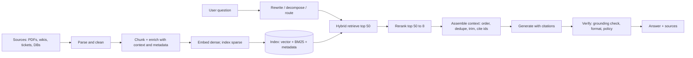

# 24. RAG: retrieval-augmented generation, from first principles to production

> **What you need to be able to say:** what RAG is and why it exists; the full pipeline (ingest, chunk, embed, index, retrieve, rerank, assemble, generate, verify); the advanced variants (query rewriting, hybrid, agentic RAG, GraphRAG, contextual retrieval, long-context versus RAG); how to evaluate it; and the failure modes you have actually fixed. Go deeper: Part 6 → *Modern RAG architectures* (53 KB), *RAG evaluation guide*, *Agentic RAG deep-dive questions*, *Agentic RAG system design walkthrough*.

## 24.1 What RAG is

Retrieval-augmented generation gives a model evidence at inference time instead of relying on what it memorized in training. The model's weights are *parametric memory* (fixed at training, fuzzy, undatable); documents, databases and APIs are *non-parametric memory* (updateable, inspectable, permissioned). RAG retrieves the relevant pieces and places them in the prompt, so the answer can be current, specific to your organization, and cited. It exists because fine-tuning does not reliably teach facts, context windows are finite and billed, and auditors want to see sources.

## 24.2 The pipeline

1. **Parse.** PDFs, Office files, HTML, emails, tickets, database rows. Keep structure (headings, tables, lists), extract metadata (title, author, date, product, tenant, ACLs), and store the page/section for citations. Tools: Docling, Unstructured, LlamaParse, Azure Document Intelligence, Textract, Document AI; multimodal LLMs for messy scans.
2. **Chunk and enrich.** Structure-aware chunks, starting at about 200–400 tokens with no overlap and adding overlap only if recall improves on your eval set (Chroma's 2024 chunking study and the rest of the evidence are in 24c.3); tables kept whole; each chunk gets breadcrumbs ("Policy > Claims > Timelines") and a one-sentence contextual summary generated from the parent document (contextual retrieval), plus metadata.
3. **Embed and index.** Dense vectors with one model (record its name), sparse BM25 or learned sparse, metadata in a filterable index. Chapter 18.
4. **Rewrite and route the query.** Spelling and jargon normalization, HyDE (embed a hypothetical answer), multi-query (several paraphrases), decomposition of multi-part questions, routing to the right collection (HR vs engineering), and the decision whether to retrieve at all.
5. **Retrieve hybrid.** BM25 + vectors, fused with reciprocal rank fusion, filtered by metadata and permissions, top 30–100.
6. **Rerank.** Cross-encoder reranker to the top 5–10; optionally diversity (MMR) and recency boosts.
7. **Assemble context.** Order by relevance but keep siblings together; dedupe; trim to budget; attach ids so the model can cite `[doc-12]`; put the question last; cache the static prefix.
8. **Generate.** A system prompt that demands grounded answers, abstention when evidence is missing, and inline citations; structured outputs when downstream code consumes the answer.
9. **Verify.** A grounding/faithfulness check (does every claim trace to a chunk), policy and PII filters, format validation; low-confidence answers go to a fallback (ask a clarifying question, escalate).

### A latency and cost budget for one RAG request

With the nine steps in place, the next question is what each one costs. Interviewers ask "how would you get this under 3 seconds and two cents?" — answer with a budget, step by step (typical hosted-API figures for a 2026 stack; measure your own):

| Step | p50 | p95 | Cost driver |
|---|---|---|---|
| Query rewrite / routing (small model, optional) | 200–400 ms | 800 ms | ~500 tokens on a cheap tier — skip it for short, unambiguous queries |
| Embed the query | 20–50 ms | 150 ms | negligible |
| Hybrid retrieve top 50 (BM25 + ANN, filtered) | 20–80 ms | 200 ms | index infrastructure, not tokens |
| Rerank 50 → 8 (hosted cross-encoder) | 100–200 ms | 400 ms | about \$0.002 per query |
| Generate (6–8k input tokens, 300–500 output, workhorse tier) | 1.0–2.0 s to full answer; 300–600 ms to first token | 3–4 s | ~\$0.015–0.02 on a \$2/\$10 model; less with a cached prefix |
| Grounding check (cheap model, claim-level) | 300–600 ms (can stream in parallel with the answer) | 1 s | ~\$0.002 |

Levers when the budget is blown: run rewrite and retrieval in parallel (retrieve on the raw query and on the rewrite, fuse), drop the rewrite for most traffic, shrink the reranker or cut candidates to 30, stream the answer while the grounding check runs and retract only on failure, cache answers for repeated questions, and route easy questions to a cheaper tier. Long context is the comparison point: the same question answered by stuffing a 1M-token corpus costs about \$2 per query uncached on a \$2/MTok model (\$0.20 with a warm cache) and takes tens of seconds of prefill — two orders of magnitude more than the RAG path.

## 24.3 Variants and when to use them

- **Agentic RAG.** The model decides whether, what and how many times to retrieve: decomposition, iterative retrieval, self-RAG (retrieve only when needed), corrective RAG (grade retrieved chunks, fall back to web or another index when they are poor), tool-based retrieval (SQL, APIs, graph queries) alongside documents. Use for complex or multi-hop questions; costs more latency and tokens.
- **GraphRAG.** Extract entities and relations into a graph (or use an existing knowledge graph), build community summaries, and answer "global" questions (themes across a corpus) by map-reduce over communities and "local" questions by traversing neighborhoods. Use when questions are about relationships and aggregates ("which suppliers are exposed to both regulations?"); costly to build — Microsoft's own LazyGraphRAG (November 2024) defers the LLM summarization to query time and reports indexing cost equal to vector RAG and 0.1% of full GraphRAG, with comparable quality on global questions; chapter 25.
- **Contextual retrieval.** Prepend chunk-specific context before embedding and indexing (both dense and BM25) — a cheap, large gain in retrieval recall on most corpora (Anthropic reported 49% fewer retrieval failures with contextual embeddings plus contextual BM25, 67% with reranking added; chapter 18).
- **Long-context instead of RAG.** When the corpus fits (a few hundred pages), a 1M-token model with caching can read it all; retrieval still wins on cost at scale, on citations, on freshness and on permissions (a stuffed context cannot be ACL-filtered per user without a separate cache per permission set). Hybrid: retrieve a generous set, then let the model read a lot. Effective context is shorter than advertised: needle-in-a-haystack tests are near-perfect, but multi-fact reasoning over long inputs (RULER-style and multi-hop long-context benchmarks) degrades well before the window is full, so test at your real context size.
- **Multimodal RAG.** Page images and charts indexed with multimodal embeddings; chapter 19.
- **Structured RAG / text-to-SQL.** For tables, retrieve the schema and examples, generate a query, execute, and answer from results; never embed whole tables.
- **Memory-augmented RAG.** Retrieve from past conversations and user facts in addition to documents.
- **Cache-augmented generation.** Precompute KV caches of the static corpus for very hot documents on self-hosted models. On hosted APIs the equivalent is a long cached prefix (prompt caching): a 200k-token reference manual read at 10% of the input price on every call, refreshed within the cache TTL.

## 24.4 Evaluation

Build two sets: a **retrieval set** (question → relevant chunk ids; recall@k, MRR, NDCG, context precision/recall) and an **end-to-end set** (question → reference answer; faithfulness, answer relevance, correctness, citation precision, abstention correctness). Use LLM judges with rubrics (Ragas, DeepEval, Databricks Agent Evaluation, the Gen AI evaluation service on Google's Gemini Enterprise Agent Platform (formerly Vertex AI), Bedrock Evaluations) calibrated against a human-labeled subset; track latency and cost per query alongside. Run the suite in CI on every change to chunking, models or prompts. Chapter 32. Chapter 24c catalogues the RAG techniques stage by stage and covers RAG evaluation in depth: retrieval metrics with formulas, RAGAS and the other frameworks, and a practical evaluation plan.

The habit that makes RAG debugging fast is **failure attribution**: for every wrong end-to-end answer, record whether the gold chunk was (a) not in the top 50 (recall failure — fix parsing, chunking, hybrid weights), (b) in the top 50 but cut by the reranker or the context budget (ranking failure — fix the reranker, k, or ordering), or (c) in the context but misused (generation failure — fix the prompt, the model tier or the grounding check). The proportions tell you where the next week of work goes; teams that skip this step tune prompts to fix recall problems.

## 24.5 Failure modes you should be able to narrate

| Symptom | Usual cause | Fix |
|---|---|---|
| Right document exists, never retrieved | chunking lost context; dense-only retrieval on jargon | contextual chunks, hybrid search, reranker |
| Retrieved but wrong answer | too much context, poorly ordered, no citations required | rerank to fewer chunks, structured prompt, ask for citations and abstention |
| Confident hallucination | no abstention path, no grounding check | "answer only from sources", verifier, fallback to human |
| Stale answers | no re-indexing on change | event-driven upserts, freshness metadata and boosts |
| Users see data they should not | retrieval ignores permissions | ACL filters at retrieval using the user's identity; test with negative cases |
| Slow (p95 > 4 s) | sequential steps, large k, big reranker | parallelize rewrite and retrieval, cap k, smaller reranker, cache embeddings and answers |
| Expensive | 20 chunks × 800 tokens per query on a frontier model | rerank to 5–8, trim chunks, route to a cheaper model, cache prefixes |
| Eval looks great, users unhappy | eval set not representative | mine real queries, include multi-hop and "no answer" cases |
| Answer mixes old and new policy | superseded versions of a document both indexed | version metadata, "current only" filter by default, supersession links, effective-date boosts |
| Top-k filled with near-duplicates | the same paragraph in 30 templated documents | dedupe at ingest (MinHash/embedding similarity), MMR diversity at retrieval, collapse by source |
| Numbers wrong in answers about tables | parser flattened the table; chunk split rows from headers | table-aware parsing, keep tables whole with headers repeated, or route table questions to SQL |
| Answer is in two chunks, model sees one | chunk boundary split the fact | overlap, parent-child retrieval, larger chunks for narrative documents |
| Model follows instructions found in a document | indirect prompt injection in the corpus | treat retrieved text as data, injection classifier at ingest and at query, no tools with side effects in the answer step (chapter 30) |

## 24.6 Scenarios

- **Regulatory disclosures for marketing content (resume use case).** Hybrid retrieval over disclosures and regulatory data with a knowledge graph of product → rule → required disclosure; parallel reviewer agents cite rule ids; a grounding check blocks any claim without a source; human approval before publication.
- **Ask-AI over Amazon reviews and sales data (resume use case).** Reviews chunked and embedded with product metadata; sales questions routed to SQL over the warehouse; the answer merges both with citations; the eval set is 150 merchant questions with analyst-written answers.
- **Enterprise policy assistant for 20,000 employees.** Permission-aware retrieval (ACLs from the document system), contextual chunks, hybrid + rerank, citations, abstention, weekly judge sampling, p95 under 3 s, cost per query under \$0.02.
- **Clinical guideline assistant.** Versioned sources, strict grounding, no answers outside retrieved text, clinician review for new question types, full audit trail.

**Interview line:** *"RAG is a retrieval problem first: structure-aware chunks with context, hybrid search, a reranker, permission filters, and a recall@k set to tune against. Then a prompt that cites and abstains, a grounding check, and an end-to-end judge suite in CI. Agentic and graph variants when questions are multi-hop or relational, long context when the corpus is small and hot."*
