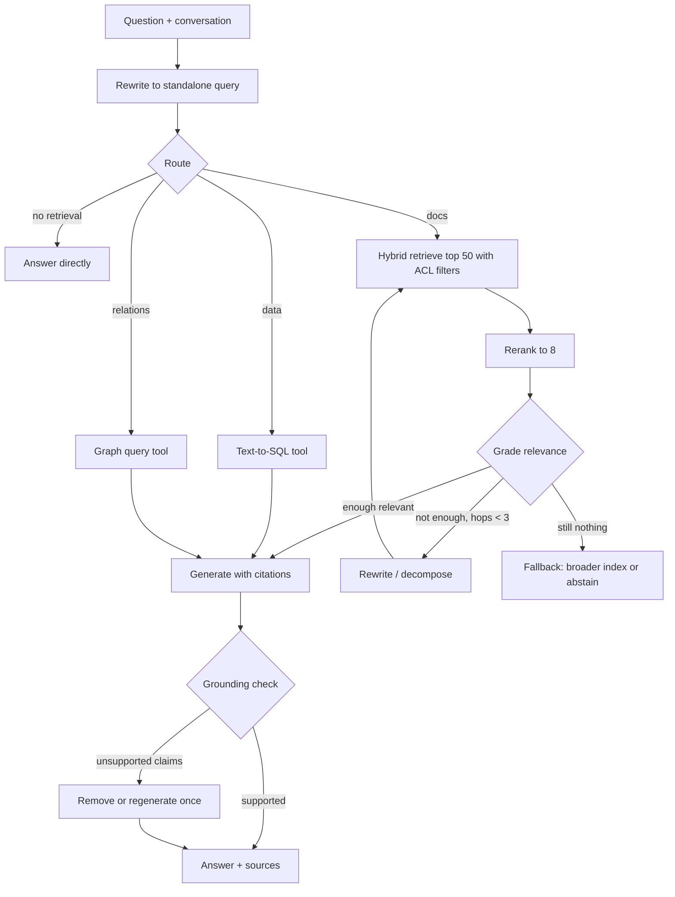

# 24b. Agentic RAG patterns and reranking solutions in depth

> **What you need to be able to say:** the spectrum from a fixed retrieve-then-generate pipeline to fully agentic retrieval; a dozen named agentic RAG patterns with their mechanism, when each pays off and what it costs; how to build one as a graph with grading and correction loops; the reranking families (cross-encoders, late interaction, LLM rerankers, learning-to-rank, diversity and business rules) and the commercial and open options; how to tune candidate depth and thresholds; and how to evaluate each step so you know which part to fix. Chapter 24 covers the RAG pipeline; chapter 18 covers embeddings and indexes; chapter 24c is the full RAG technique catalogue and covers RAG evaluation with RAGAS and friends.

## 24b.1 The spectrum

| Level | What decides the retrieval path | Typical latency | Typical extra cost vs naive | Use when |
|---|---|---|---|---|
| Naive RAG | fixed: embed query → top-k → generate | 1–2 s | baseline | prototypes, FAQ lookups |
| Advanced RAG | fixed pipeline with rewrite, hybrid search, rerank, filters | 1.5–3 s | +10–30% | most production assistants |
| Modular RAG | configurable modules chosen per collection or route | 1.5–3 s | +10–40% | many corpora with different needs |
| Agentic RAG | the model decides whether, where, how often and when to stop | 3–20 s | +2–10× tokens | multi-hop, ambiguous, cross-source or research questions |

The engineering question is never "agentic or not" but "which decisions are worth giving to the model". Each decision you delegate costs latency and tokens and adds a failure mode; each one you keep in code costs flexibility.

## 24b.2 Agentic RAG patterns

1. **Routing RAG.** A classifier (rules, a small model, or the LLM with a structured output) sends the question to the right index, tool or pipeline: HR policies vs engineering docs vs a SQL tool vs "no retrieval needed". *Pays off* with many heterogeneous sources. *Cost:* one cheap call. *Failure:* misroutes; mitigate with a fallback to a broad index when confidence is low and by measuring routing accuracy.
2. **Query rewriting and expansion.** Normalize jargon, expand acronyms, generate paraphrases (multi-query), or embed a hypothetical answer (HyDE). *Pays off* for short, vague or user-language queries. *Failure:* drift away from the user's intent; keep the original query in the candidate pool.
3. **Decomposition / query planning.** Split a compound question into sub-questions, retrieve for each (often in parallel), then synthesize. *Pays off* for "compare X and Y" or multi-part questions. *Cost:* N retrievals plus a synthesis call.
4. **Iterative (multi-hop) retrieval.** Retrieve, read, decide what is still missing, retrieve again (ReAct-style search loops; interleaving retrieval with reasoning steps as in IRCoT). *Pays off* when the second query depends on the first answer ("who leads the team that owns service X?"). *Failure:* loops; cap hops (2–4) and stop when new evidence stops adding facts.
5. **Self-RAG (retrieve on demand, reflect on evidence).** The model decides whether retrieval is needed and critiques retrieved passages and its own draft for support. *Pays off* on mixed traffic where many questions need no retrieval. *Failure:* over-confidence on "no retrieval needed"; audit with a sample.
6. **Corrective RAG (CRAG).** A lightweight retrieval evaluator (a fine-tuned T5-large in the original paper, a small LLM with structured output in most implementations) scores each retrieved document, and the scores trigger one of three actions for the query: *correct* (at least one document clearly relevant: refine it with a decompose-then-recompose pass that keeps only the relevant strips), *incorrect* (nothing relevant: discard and fall back to a rewritten search, another index or web search), or *ambiguous* (combine the refined documents with the fallback results). *Pays off* when the corpus is incomplete or noisy. *Cost:* grading calls (batch them; use a small model). *Failure:* thresholds tuned on one corpus misfire on another, so calibrate the two cut-offs on labeled pairs from your own data.
7. **Adaptive RAG.** Classify query complexity first: answer directly, single-step retrieval, or multi-step agentic retrieval. *Pays off* in mixed workloads; it is the routing of reasoning applied to retrieval (chapter 22).
8. **Retrieval as tools.** Expose `search_docs`, `query_sql`, `query_graph`, `get_record` and `web_search` as tools; the agent picks and combines them. *Pays off* when answers need both text and structured data. *Failure:* tool confusion; keep tool sets small and descriptions precise (chapter 20b).
9. **Agentic GraphRAG.** Vector search for text plus text-to-Cypher over a knowledge graph, chosen per sub-question; LazyGraphRAG-style deferral of summarization to query time cuts indexing cost (Microsoft reported indexing costs equal to vector RAG and about 0.1% of full GraphRAG; chapter 25).
10. **Deep-research RAG.** Orchestrator plans, parallel searchers with fresh context gather evidence, a verifier checks claims against sources, a writer composes with citations (chapter 23.3). *Pays off* for reports and analyses. *Cost:* the most expensive pattern; budget per run.
11. **Speculative RAG.** A small, distilled specialist drafter writes several candidate answers from different subsets of retrieved documents in parallel; a larger generalist verifier scores them in one pass and picks. The paper reported up to 12.97% higher accuracy and 50.83% lower latency on PubHealth. *Pays off* when latency matters and many documents are relevant. *Cost:* training or choosing the drafter, and a verifier that must see every draft.
12. **Verify-then-answer (post-hoc attribution).** After drafting, check each claim against the evidence and remove or flag unsupported claims; return citations per sentence. *Pays off* in regulated answers. *Cost:* one judging pass (chapter 32b).
13. **Retrieve wide, read deep.** Retrieve a generous set (30–100 chunks, or whole documents), rerank, and let a long-context model read more than classic top-5; combine with prompt caching for hot documents. *Pays off* when recall matters more than cost. *Failure:* accuracy falls as near-miss distractors fill the window, and relevant text in the middle of a long context is used less reliably than text at the edges; order chunks by relevance, group them by document, and measure answer quality as the context grows instead of assuming more is better.
14. **Memory-augmented and conversational RAG.** Rewrite follow-up questions into standalone queries using conversation state; retrieve from the user's past interactions and stored facts as well as documents.
15. **Multimodal agentic RAG.** The agent chooses between text chunks, page images (ColPali-style retrieval) and tables, and calls a vision-capable model only for pages that need it (chapter 19).

**Critic's additions: the failure modes that delegation introduces.** Every pattern above trades a fixed pipeline for decisions the model makes at run time, and each decision fails in its own way. Name these before the interviewer does:

| Failure | Mechanism | Control |
|---|---|---|
| Fallback leaks the question | CRAG-style web-search fallback sends the internal query (customer names, deal terms, incident details) to an external search engine | strip or block sensitive entities before any external call; allow web fallback only for collections marked public; log every outbound query |
| Fallback imports an attack | pages from the open web enter the context with instructions in them (indirect prompt injection) | treat web results as untrusted data, no write or send tools in the same run, cite and quote rather than follow |
| Permissions lost across hops | a rewritten or decomposed sub-query runs against an index without the user's ACL filter, or a graph traversal crosses into restricted nodes | apply the caller's identity filter in the retrieval service on every hop, never in the prompt; a negative test per hop type |
| Grader false negatives | a strict relevance grader rejects good chunks, triggering extra hops and abstentions | calibrate the grader on labeled pairs; alert on abstention rate and mean hops per question |
| Query drift | repeated rewrites wander from the user's intent and retrieve confidently wrong context | keep the original query in every candidate pool; cap rewrites; compare the final answer against the original question in the verifier |
| Latency and cost blow-ups | each hop adds a model call plus retrieval, so p95 grows with the hop cap, not the average | hop and token budgets in code, a per-request deadline, and a cheaper path (direct answer or abstain) when the budget is spent |
| Silent staleness | the agent prefers the most "relevant" chunk even when it comes from a superseded policy version | version and effective-date metadata as filters, newest-version boost, and citations that show the date |

## 24b.3 A reference graph

In LangGraph this is a `StateGraph` with nodes for rewrite, route, retrieve, rerank, grade, generate and verify, conditional edges on the grader and verifier outputs, a hop counter in state, and a checkpointer; in ADK it is a sequence of agents with a loop agent around retrieve-grade-rewrite; in Strands or the Claude Agent SDK the agent loop with retrieval tools and a verifier tool approximates it with less explicit control. Keep grading and routing on a small model with structured outputs; reserve the strong model for generation.

**Critic's additions: buying the graph instead of building it.** The clouds now sell the plan-retrieve-rerank-merge part of this graph as a managed service, and interviewers ask when you would use one. Azure AI Search's *agentic retrieval* (a knowledge base over one or more knowledge sources) has an LLM split a question into subqueries, runs them in parallel, applies the semantic ranker to each and returns merged grounding data with references and an activity log; the minimal-reasoning mode is generally available, LLM query planning and answer synthesis were still in preview in the 2026-08-01 API, and it is the retrieval layer behind Foundry IQ. Microsoft's own pricing example puts 2,000 agentic retrievals with three subqueries each at about \$4.32 in total, against a uniform per-query cost for classic search, so the cost is variable and token-based. AWS points former Kendra customers to the Bedrock Managed Knowledge Base, which adds an agentic retrieval API for multi-step questions; Google offers Agent Search (formerly Vertex AI Search) and the RAG Engine; Databricks AI Search (renamed from Vector Search in June 2026) adds reranking and full-text indexes. Use a managed service when time to a governed first version matters and its quality passes your eval set; build the graph yourself when you need custom routing, a domain-tuned reranker, per-hop permission logic the service cannot express, or traces of every intermediate decision. Either way, keep your own retrieval gold set: it is the only way to compare the two honestly.

## 24b.4 Reranking solutions

**Why rerank at all.** A bi-encoder compresses query and document independently into vectors, losing interactions between their words; a reranker reads them together and judges relevance far more precisely, but costs one model pass per candidate. So: retrieve broadly and cheaply, rerank a few dozen candidates precisely.

| Family | How it works | Examples (verify current versions) | Latency for ~50 candidates | When to use |
|---|---|---|---|---|
| Cross-encoder (pointwise) | transformer scores each (query, passage) pair | open weights: BGE-reranker-v2 (m3, gemma), mxbai-rerank-v2, Qwen3-Reranker (0.6B, 4B, 8B; instruction-aware), ms-marco MiniLM, Jina reranker v2; APIs: Cohere Rerank (v4.0 pro and fast; v3.5), Voyage rerank-3 and rerank-3-lite, Jina; cloud: the ranking API in Google's Agent Search (formerly the Vertex AI ranking API), Azure AI Search semantic ranker, Amazon Bedrock (Amazon Rerank 1.0, Cohere Rerank 3.5), Pinecone hosted rerankers, Databricks AI Search reranking | 30–200 ms on GPU or API | the default second stage |
| Late interaction | token-level vectors, MaxSim scoring; precompute document vectors | ColBERTv2/PLAID, Jina-ColBERT (v2), ColPali/ColQwen for page images | 10–50 ms after retrieval | high recall needs, documents as images, when GPU rerank budget is tight |
| LLM reranker | prompt an LLM to score (pointwise), compare pairs, or order a list (listwise, sliding windows) | frontier or small LLMs; open listwise rerankers (RankZephyr lineage; Jina reranker v3 and v3.5, 0.6B parameters with a 131K-token window, and the multimodal m0) | 0.5–3 s (purpose-built small listwise models are faster) | small candidate sets with subtle relevance, or as a teacher to train a cross-encoder |
| Learning-to-rank | gradient-boosted trees (LambdaMART) over features: BM25, vector score, reranker score, recency, authority, clicks | XGBoost/LightGBM rankers, Vespa/OpenSearch LTR | < 10 ms | search products with click data and many signals |
| Fusion and diversity | combine lists (RRF), reduce redundancy (MMR), enforce coverage | built into most engines | negligible | always before or after the reranker |
| Business rules | boosts and filters: recency, source authority, permissions, region, product | your code or engine expressions | negligible | every enterprise deployment |

**Tuning.** Candidate depth k (50–200 before reranking; recall@k of the first stage caps everything after it), final n (5–10 chunks into the prompt), score thresholds (drop candidates below a calibrated reranker score; abstain if none pass), passage length (rerankers truncate the query plus passage at a model-specific limit — 512 tokens for small classic cross-encoders, 1,024 for Google's ranking models, 4,096 for Cohere Rerank 3.5, 32,000 for Voyage rerank-3 — so rerank chunks, not whole documents, unless you chose a long-window model deliberately), multilingual coverage (use a multilingual reranker if queries and documents differ in language), and domain fine-tuning (train the cross-encoder on query–passage pairs from logs with hard negatives mined from your first-stage retriever; typical gains of several NDCG points in specialized domains). Cache reranker scores for repeated (query, chunk) pairs in FAQ-like traffic.

**Pitfalls.** Reranking candidates that should have been filtered (apply ACL and metadata filters *before* reranking); comparing raw reranker scores across queries without calibration; LLM rerankers with position bias (shuffle and aggregate); truncation hiding the relevant sentence at the end of a long chunk; reranking only the dense results when the BM25 results held the exact match (rerank the fused list).

**Choosing.** Start with a hosted cross-encoder from your cloud or a top open model on your GPU; measure NDCG@10 and recall@n on your gold set at your latency budget; add late interaction for page images or very large candidate sets; use an LLM reranker only where its gain survives the latency budget, or as a teacher to fine-tune a cheaper cross-encoder.

**Critic's additions: evidence, licences and the facts that decide between rerankers.** *How much does reranking buy?* The most quoted public measurement is Anthropic's contextual-retrieval study (2024): the top-20 retrieval failure rate fell from 5.7% to 3.7% with contextual embeddings, to 2.9% when contextual BM25 was added, and to 1.9% when a Cohere reranker narrowed the top 150 candidates to the final 20 — a 67% reduction in failures overall, with the reranking step alone removing about a third of the failures that hybrid retrieval had left (2.9% to 1.9%). Quote it as one benchmark on one corpus mix and measure your own. *What decides the choice beyond quality:*

| Fact | Why it matters | Examples (October 2026; verify before quoting) |
|---|---|---|
| Licence of open weights | self-hosting a non-commercial model in production needs a commercial licence | Qwen3-Reranker: Apache-2.0; Jina reranker v2, v3, v3.5, m0 and jina-colbert-v2: CC BY-NC 4.0, commercial use through Jina's owner Elastic |
| Context window | decides chunk size and whether long passages are silently truncated | 512 (Pinecone's own model), 1,024 (Google ranking models, BGE as hosted by Pinecone), 4,096 (Cohere Rerank 3.5), 32,000 (Voyage rerank-3), 131,000 (Jina v3 listwise) |
| Batch limits | caps candidate depth per call | Google's ranking API accepts up to 1,000 records per request; Pinecone's hosted models take 100 to 250 documents per request |
| Instructions | lets one model rank by a policy ("prefer the current policy version", "prefer primary sources") | Voyage rerank-2.5 and later, Qwen3-Reranker (its model card reports a 1–5% gain from task instructions) |
| Hosting and region | data residency and private networking | Bedrock offers Amazon Rerank 1.0 and Cohere Rerank 3.5 in a fixed list of regions (Amazon Rerank is not in us-east-1); Pinecone marked its hosted Cohere Rerank 3.5 deprecated as of 1 July 2026 and now offers Cohere Rerank 4 fast |
| Lifecycle | API rerankers are versioned and retired like LLMs | pin the model version, keep the gold set, and re-run it on every upgrade |

*Late interaction costs storage, not just compute.* One vector per token means a 300-token chunk at 128 dimensions in fp16 takes about 77 KB, against 4 KB for a single 1,024-dimension float32 vector — roughly twenty times more before compression; residual compression in ColBERTv2/PLAID brings it down to a small multiple. That is why late interaction is usually applied to a candidate set or to page images rather than to the whole corpus.

## 24b.5 Evaluating agentic RAG step by step

| Step | Metric | How |
|---|---|---|
| Rewrite | retrieval recall with vs without rewrite | A/B on the retrieval gold set |
| Route | routing accuracy, cost of misroutes | labeled questions per route |
| Retrieve | recall@k per hop | gold chunks per question (and per sub-question) |
| Rerank | NDCG@10, recall@n after rerank | same gold set |
| Grade | grader precision/recall against human relevance labels | 200 labeled (query, chunk) pairs |
| Loop | hops per question, share hitting the cap, marginal recall per hop | traces |
| Generate | faithfulness, correctness, citation precision, abstention correctness | judges calibrated on humans (chapter 32b) |
| End to end | task success, p50/p95 latency, cost per answer | eval runs and production traces |

Attribute every failure to the first step where the evidence disappeared: not retrieved (first stage), retrieved but ranked out (reranker), kept but ignored (generation), or used but misquoted (generation and verification). That attribution decides what to fix.

**Critic's additions: how big the gold set must be before a step "wins".** With 200 questions, a recall@10 of 0.80 has a 95% confidence interval of roughly ±5.5 points (standard error √(0.8 × 0.2 / 200) ≈ 0.028), so a new reranker that moves recall from 0.80 to 0.83 on one unpaired run has not shown anything. Compare variants *paired* on the same questions (count the questions each variant gets right that the other misses and test with McNemar's test or a paired bootstrap), report the interval next to every number, and slice by query type, because agentic steps often help multi-hop questions while slightly hurting simple lookups — an average can hide both. For stochastic steps (LLM rewrite, grading, listwise reranking) run each configuration at least three times. Put the latency and cost of each step in the same table, because a two-point recall gain that adds 800 ms at p95 is a product decision, not an engineering win.

## 24b.6 Scenarios

- **Engineering knowledge assistant.** Routing between runbooks, design docs and the incident database; iterative retrieval for "why did X fail last time and who fixed it"; reranking with a fine-tuned cross-encoder on internal jargon; verify-then-answer for operational commands.
- **Insurance claims Q&A.** Corrective RAG over policy wordings with a fallback to the underwriting guidelines index; reranking with recency and policy-version rules; abstention when the policy version is unknown.
- **Analyst copilot over filings.** Decomposition into per-company sub-questions, parallel retrieval, SQL tool for financial figures, synthesis with citations; LLM listwise reranking on small candidate sets where nuance matters.
- **Marketing compliance.** Agentic GraphRAG: graph tool for required disclosures, vector search for precedent wording, verifier blocking any claim without a citation.

**Interview line:** *"I treat agentic RAG as a set of delegated decisions — route, rewrite, decompose, loop, grade, verify — and I delegate only the ones whose gain on my eval set beats their latency and cost. The workhorse is still hybrid retrieval over well-chunked, filtered data with a cross-encoder reranker; agents add the loops for multi-hop and cross-source questions, and I evaluate every step so a failure lands on the stage that caused it."*
