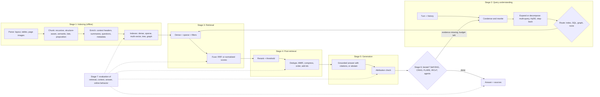

# 24c. The RAG technique catalogue and RAG evaluation (RAGAS and friends)

> **What you need to be able to say:** where every popular RAG technique sits in the pipeline (indexing, query understanding, retrieval, post-retrieval, generation, iteration, evaluation) and what it costs in tokens, latency and index size; how the chunking variants (recursive, structure-aware, semantic, late, proposition, contextual) differ in mechanism and evidence; how rewriting, multi-query, RAG-Fusion, HyDE, step-back and decomposition change the query and when each pays; the RRF formula and when tuned score fusion beats it; compression, ordering, citation and abstention techniques; the adaptive family from Self-RAG to RL-trained search agents; the classic retrieval metrics with their formulas; exactly how each RAGAS metric is computed, which model calls it makes and where it misleads; how TruLens, DeepEval, ARES, RAGChecker and the platform evaluators differ; and an evaluation plan that ties golden sets, calibrated judges, CI gates and online signals together. Chapter 24 is the pipeline, 24b the agentic patterns and rerankers, 18 the embeddings and indexes, 25 the graphs, 32 and 32b the judges. Go deeper: Part 6 → *Modern RAG architectures* and *RAG evaluation guide*.

## 24c.1 The map: seven stages and where each technique sits

Every RAG technique changes one of seven things: what is stored, what is asked, what is found, what is kept, what is said, whether to go round again, and how you know it worked. Name the stage first and most design arguments settle themselves, because each stage has its own diagnostic metric.



| Stage | Techniques in this chapter | What goes wrong at this stage | Diagnostic metric |
|---|---|---|---|
| 1. Indexing | chunking variants; contextual retrieval and chunk headers; enrichment and doc2query; multi-representation, parent–child, sentence-window and auto-merging; RAPTOR; metadata; page images; tables (24c.3) | evidence split across chunks, stripped of its subject, flattened (tables), or never indexed | recall@k with the retriever held fixed; RAGAS context recall |
| 2. Query understanding | rewriting, multi-query, RAG-Fusion, HyDE, step-back, decomposition, routing, self-query, text-to-SQL, condensation (24c.4) | vocabulary mismatch, missing conversation context, compound questions, wrong source | recall@k per query slice; routing accuracy |
| 3. Retrieval | dense, BM25, SPLADE, hybrid fusion (RRF vs normalized scores), late interaction, MMR, filters (24c.5) | identifiers missed, near-duplicates, filters that return nothing | recall@50; filter-violation rate |
| 4. Post-retrieval | reranking and thresholds, compression, deduplication, ordering, citation formatting (24c.6) | the gold chunk ranked out, distractors kept, context too long | nDCG@10; recall at the context cut; context precision; tokens per answer |
| 5. Generation | grounded answers with citations, attribution checking, abstention, map-reduce and refine synthesis (24c.7) | evidence ignored, invented claims, no "I don't know" | faithfulness; citation precision and recall; abstention correctness |
| 6. Iteration | Self-RAG, CRAG, Adaptive-RAG, FLARE, IRCoT, Speculative RAG, Search-R1-style agents, deep-research loops (24c.8) | wrong hop budget, query drift, loops | hops per question; marginal recall per hop; cost per answer |
| Variants | GraphRAG, LightRAG, HippoRAG 2, KAG (24c.9); long context, cache-augmented generation, fine-tuning (24c.10) | the wrong architecture for the question shape | global-question judge scores; cost per query |
| 7. Evaluation | retrieval metrics (24c.11), RAGAS (24c.12), other frameworks and benchmarks (24c.13), the plan (24c.14) | measuring the wrong thing; uncalibrated judges; sets too small to see a change | judge–human agreement; confidence-interval width |

## 24c.2 How to read the catalogue

Each entry answers the same seven questions: **what it is**, **how it works**, **when it helps**, **cost** (tokens, latency, index size), **failure modes**, the **source** (paper or primary documentation), and a one-line **implementation hint**. Where chapter 18, 24, 24b or 25 already explains a technique, the entry gives a two-line summary with the cross-reference and then only what those chapters lack. Cost and latency figures are typical 2026 hosted-API orders of magnitude unless a source is named; measure your own. Library names point at where a technique is implemented; in LangChain 1.x the legacy retrievers (multi-query, parent-document, self-query, multi-vector) moved to the `langchain-classic` package, so check import paths before copying older tutorials.

## 24c.3 Indexing techniques

Indexing decides what can ever be found. The retriever can only return what a chunk *says on its own*, so every indexing technique makes each stored unit more self-contained, more findable, or both. The effect is large and cheap to reproduce: in Chroma's chunking study (Smith and Troynikov, July 2024; text-embedding-3-large, five chunks retrieved), a recursive splitter at 200 tokens without overlap reached 88.1% recall at 7.0% token precision, the same splitter at 400 tokens 89.5% at 3.6%, the default embedding-threshold semantic chunker 83.6% at 1.5%, and an LLM-driven chunker the best recall (91.9%); the OpenAI Assistants default (800 tokens, 400 overlap) tied for the worst precision. Chunking moves retrieval by several points before any model choice does.

### 24c.3.1 Fixed-size chunking

**What it is.** Cut the text every N tokens (or characters), optionally repeating the last M tokens at the start of the next chunk.

**How it works.** Tokenize with the embedding model's tokenizer, slide a window of N tokens with stride N − M, and store each chunk's character offsets for citations.

**When it helps.** Text with no usable structure (ASR transcripts, OCR dumps, chat logs), quick baselines, hard token budgets. **Cost.** The cheapest option; overlap inflates the index by N/(N − M), so 20% overlap means 1.25× the vectors.

**Failure modes.** Splits sentences, list items, table rows and code; separates headings from their text; overlap creates near-duplicate hits that crowd the top-k. **Source.** The baseline in every chunking study.

**Implementation hint.** Count tokens, not characters: LangChain's base `TextSplitter` defaults to 4,000 *characters* with 200 of overlap, so set sizes explicitly or use a token-counting constructor.

### 24c.3.2 Recursive chunking

**What it is.** Split on the coarsest separator that produces pieces under the size limit, and recurse to finer separators only where a piece is still too long.

**How it works.** Split on the first of an ordered separator list (LangChain's `RecursiveCharacterTextSplitter` defaults to blank line, newline, space, then characters), re-split oversized pieces with the next separator, and merge small neighbors back up to the limit. `from_language` gives separator sets for code.

**When it helps.** The default for prose with paragraphs but no reliable headings; consistently strong at 200–400 tokens in Chroma's study. **Cost.** Negligible.

**Failure modes.** It sees whitespace, not meaning: headings separate from their sections, tables split by row, and a paragraph holding two topics stays in one chunk. **Source.** LangChain text splitters; Chroma (2024).

**Implementation hint.** `RecursiveCharacterTextSplitter.from_tiktoken_encoder(chunk_size=400, chunk_overlap=0)` as the first baseline; add overlap only if recall@k rises on your gold set, because overlap also lowers precision.

### 24c.3.3 Structure-aware chunking (Markdown, HTML, PDF layout)

**What it is.** Chunk along the document's own structure (sections, headings, list items, tables, pages) as recovered by a parser.

**How it works.** (1) Parse into a structured representation: Markdown and HTML expose heading levels; PDFs need a layout model for reading order, headings, tables and figures (Docling, Unstructured, LlamaParse, Azure Document Intelligence, Textract, Document AI). (2) Split at section boundaries, recursively split oversized sections and merge tiny siblings. (3) Attach the heading path ("Policy > Claims > Timelines") as metadata and usually as a text prefix. (4) Keep page numbers and bounding boxes for citations.

**When it helps.** Manuals, policies, contracts, API docs, wikis: anything written with headings. It is one of the changes that most often fixes "the answer is in the document but never retrieved". **Cost.** Parsing dominates: a fraction of a second to several seconds per page on CPU for layout models, tokens per page for vision-model parsing.

**Failure modes.** Wrong reading order on scanned or multi-column PDFs; misjudged heading levels; running headers and footers in every chunk; tables split across pages. **Source.** Docling (IBM, MIT; hierarchical and hybrid chunkers over `DoclingDocument`); LangChain `MarkdownHeaderTextSplitter` and `HTMLHeaderTextSplitter`.

**Implementation hint.** Parse once into a versioned intermediate (a `DoclingDocument` or Markdown with heading levels and page anchors); chunking then becomes a cheap, repeatable function you can re-run in every experiment without re-parsing.

### 24c.3.4 Semantic chunking

**What it is.** Place chunk boundaries where the meaning of consecutive sentences shifts, measured with embeddings.

**How it works.** In the widely copied version (Greg Kamradt's tutorial, LangChain's `SemanticChunker`): split into sentences, embed each sentence with one neighbor on each side, compute the cosine distance between consecutive windows, and cut where it exceeds a threshold, by default the document's 95th percentile (alternatives: three standard deviations, 1.5 interquartile ranges, a gradient rule).

**When it helps.** Long unstructured prose with topic shifts and no headings: transcripts, interviews, essays. **Cost.** Every window is embedded before the final chunks (about three times the corpus in tokens), still small next to LLM enrichment; nothing at query time.

**Failure modes.** Chunk sizes vary wildly; a percentile threshold cuts every document even when it has one topic; and the evidence is mixed: Qu, Tu and Bao (2024) found the gains over fixed-size chunking too inconsistent to justify the compute, and Chroma found the default chunker below average while a size-capped clustering variant had the best precision.

**Source.** LangChain `SemanticChunker` (langchain-experimental); Qu et al., *Is Semantic Chunking Worth the Computational Cost?* (arXiv 2410.13070, 2024).

**Implementation hint.** If you adopt it, enforce minimum and maximum chunk sizes and keep it only if it beats a 200–400-token recursive baseline on your recall set.

### 24c.3.5 Late chunking

**What it is.** Embed the whole document (or a long window) once with a long-context embedding model, then pool the token embeddings inside each chunk's span, so every chunk vector carries document context (Günther et al., Jina AI, 2024).

**How it works.** Compute chunk boundaries as usual, run the whole document through the encoder once, and mean-pool the output token embeddings within each chunk's span instead of encoding chunks in isolation; documents longer than the window are processed in overlapping macro-windows.

**When it helps.** Chunks full of pronouns and implicit references. In the paper's Berlin illustration, a sentence referring to the city only as "its" moved from 0.708 to 0.825 cosine similarity with "Berlin". The authors' repository (jina-embeddings-v2-small-en, 256-token chunks) reports nDCG@10 on NFCorpus rising from 23.5 with naive chunking to 30.0 (whole documents: 30.4) and no change on Quora, whose texts are short: the gain grows with document length.

**Cost.** No LLM calls and about the same embedding tokens, but slower encoding over long windows; it needs a long-context, mean-pooling embedder that exposes token embeddings.

**Failure modes.** It improves only dense vectors (BM25 still sees the bare chunk); it fails with models that pool a single classification token; context beyond the window is lost. A 2025 comparison (Merola and Singh, ECIR workshop) found contextual retrieval better on relevance and completeness, late chunking cheaper and faster.

**Source.** Günther et al., *Late Chunking* (arXiv 2409.04701, 2024); jina-ai/late-chunking on GitHub.

**Implementation hint.** Use the same model and pooling at query time, and A/B it against contextual retrieval (24c.3.7) on your long-document slice; the two can be combined.

### 24c.3.6 Proposition-based chunking (Dense X Retrieval)

**What it is.** Index atomic, self-contained factual statements ("propositions") instead of passages.

**How it works.** A model rewrites each passage into propositions with references resolved ("He was born in 1879" becomes "Albert Einstein was born in 1879"; the paper's propositionizer is Flan-T5-Large fine-tuned on 42,857 GPT-4-generated pairs), each proposition is embedded, and retrieved propositions go to the generator directly or map back to their passages.

**When it helps.** Fact lookup over encyclopedic text, general-purpose retrievers used out of domain, tight token budgets. On five open-domain QA datasets it raised Recall@20 by 10.1 points on average for unsupervised dense retrievers but only 2.7 for supervised ones. **Cost.** A generation pass over the whole corpus with output at least as long as the input, and many more index units: Wikipedia went from 41.4 million passages to 256.9 million propositions.

**Failure modes.** Destroys discourse (procedures, arguments, conditions spanning sentences); the rewriter can drop qualifiers such as "unless" or "only for enterprise plans"; numbers and tables fare poorly.

**Source.** Chen et al., *Dense X Retrieval: What Retrieval Granularity Should We Use?* (EMNLP 2024).

**Implementation hint.** Use propositions as an extra retrieval representation that points to the parent passage (24c.3.9), so the generator still reads the original text with its qualifiers.

### 24c.3.7 Contextual retrieval and contextual chunk headers

*Covered in 18.6 and 24.3:* an LLM writes a short, chunk-specific context from the whole document and prepends it to the chunk before both embedding and BM25 indexing; Anthropic's study (September 2024) cut top-20 retrieval failures from 5.7% to 3.7% with contextual embeddings, 2.9% with contextual BM25 added, and 1.9% with reranking.

**What those chapters lack.**

- *Mechanism.* For each chunk, the prompt holds the full document (cached) plus the chunk and asks for 50–100 tokens situating the chunk; "context + chunk" goes into both the dense and the sparse index. In the study Claude 3 Haiku wrote the contexts, the failure metric was 1 − recall@20 across codebases, fiction and papers, and the best embedders were Gemini and Voyage.
- *Cost arithmetic.* With caching each document is paid in full once and read from cache per chunk: Anthropic quoted \$1.02 per million document tokens at 2024 prices, so a 48-million-token corpus costs about \$50. Without caching, a 6,000-token document with 15 chunks is paid 15 times.
- *Contextual chunk headers* are the cheaper, deterministic cousin: prepend the title, a one-line document summary and the heading path to every chunk, one LLM call per document instead of per chunk (popularized by dsRAG, whose reported gains are vendor numbers).
- *When not to bother.* Below roughly 200,000 tokens, Anthropic's advice is to put the whole knowledge base in a cached prompt (24c.10.1).

**Failure modes.** The context writer can misattribute (the wrong product in a multi-product document); contexts must be regenerated when documents change; long generic contexts repeat the same words in every chunk of a document and blur BM25 distinctions, so keep them short and specific.

**Implementation hint.** Store the generated context in its own field: index context plus chunk, but show only the original chunk text in citations.

### 24c.3.8 Document enrichment: summaries, hypothetical questions, doc2query

**What it is.** Generate extra text per chunk or document that matches how users ask (summaries, keywords, titles and the questions a chunk answers) and index it.

**How it works.** For each chunk, a model writes k questions it answers (LlamaIndex's `QuestionsAnsweredExtractor` defaults to five) or a summary; append them to the chunk text, which also helps BM25 (doc2query), or embed them as separate vectors pointing to the chunk (24c.3.9). The user's question then matches a generated question rather than the declarative chunk.

**When it helps.** FAQ-like traffic, short queries against long technical chunks, vocabulary mismatch between users and authors. Doc2query (Nogueira et al., 2019) approached neural re-rankers on MS MARCO at BM25 speed; Doc2Query-- (Gospodinov et al., ECIR 2023) filtered hallucinated expansions with a relevance model, improving effectiveness by up to 16% with a 33% smaller index. **Cost.** One generation per chunk at index time and k extra vectors per chunk; nothing at query time.

**Failure modes.** Generated questions reflect what the model finds salient, not what users ask; hallucinated expansions create false matches; enrichment goes stale when the chunk changes.

**Source.** Nogueira et al., *Document Expansion by Query Prediction* (arXiv 1904.08375); Gospodinov et al., *Doc2Query--* (ECIR 2023).

**Implementation hint.** Seed the question generator with real queries from your logs as examples, and drop generated questions whose answer is not in the chunk with a cheap entailment check.

### 24c.3.9 Multi-representation indexing

**What it is.** Decouple what you search from what you return: index several representations of one unit (summary, generated questions, propositions, table description, image caption, the raw text) that all point to one stored original.

**How it works.** A document store holds originals by id; the vector store holds representations with a `doc_id`; retrieval searches representations, deduplicates by `doc_id` and returns originals. LangChain's `MultiVectorRetriever` implements it, and LangChain's October 2023 post applied it to tables and images: index summaries, hand the model raw tables and images.

**When it helps.** Tables, figures, code and long sections whose raw text embeds poorly; mixing granularities (propositions for matching, sections for reading). **Cost.** Index-time generation and more vectors per unit; one key-value lookup per query.

**Failure modes.** A summary that omits the queried detail (a table description that never names the column the user asks about); deduplication that collapses distinct hits from one long document; representations that go stale when the original changes.

**Source.** LangChain, *Multi-Vector Retriever for RAG on tables, text, and images* (October 2023).

**Implementation hint.** Always include the original text as one of the representations, so exact-term queries still match.

### 24c.3.10 Parent–child and small-to-big retrieval

*Covered in 18.6 and 24.5:* search small chunks for precision, return their larger parent for context.

**What those chapters lack.** The mechanics: split into parents (sections or 1,000–2,000 tokens) and children (100–300 tokens); embed only children, with a `parent_id`; map the top children to unique parents ranked by their best (or summed) child score, and send the parents. LangChain's `ParentDocumentRetriever` takes a child splitter, an optional parent splitter (whole documents otherwise) and a document store. The cost is in the prompt: eight 1,500-token parents are 12,000 input tokens against 2,400 for eight 300-token children. The failure mode is one strong child dragging a long parent full of distractors into the context.

**Implementation hint.** Cap parent size and parent count, deduplicate by `parent_id` before reranking, and rerank what the generator will actually read.

### 24c.3.11 Sentence-window and auto-merging retrieval

**What it is.** Two LlamaIndex patterns that retrieve at fine granularity and expand afterwards.

**How it works.** *Sentence window:* index single sentences, store neighbors in metadata, and replace each retrieved sentence with its window (LlamaIndex's `SentenceWindowNodeParser` defaults to three sentences each side, swapped in by `MetadataReplacementPostProcessor`). *Auto-merging:* build a chunk hierarchy (`HierarchicalNodeParser` defaults to 2,048-, 512- and 128-token levels), index the leaves, and replace retrieved leaves with their parent when at least half its children were retrieved (`simple_ratio_thresh` 0.5).

**When it helps.** Precise matching with local context; answers spanning adjacent leaves get the whole section while isolated hits stay small. **Cost.** Many more index entries and larger contexts after expansion.

**Failure modes.** Sentence splitters break on abbreviations, code and tables; windows cross section boundaries; the merge threshold needs tuning per corpus.

**Source.** LlamaIndex `SentenceWindowNodeParser`, `HierarchicalNodeParser` and `AutoMergingRetriever` source code.

**Implementation hint.** Rerank after the window replacement or merge, so the reranker scores the text the generator will see.

### 24c.3.12 RAPTOR

**What it is.** Recursive Abstractive Processing for Tree-Organized Retrieval: a tree of summaries over chunks so retrieval can return details and high-level abstractions together (Sarthi et al., ICLR 2024).

**How it works.** Embed roughly 100-token leaf chunks; reduce dimensions with UMAP and soft-cluster with Gaussian mixtures (a chunk can join several clusters); summarize each cluster with an LLM (gpt-3.5-turbo in the paper; summaries averaged 28% of their children's length); embed the summaries and repeat until no further clustering is possible. Retrieve top-down or across all levels at once ("collapsed tree", better in the paper, with a 2,000-token budget).

**When it helps.** Long documents and questions needing synthesis across sections ("what is the author's main argument?"). With GPT-4 as the reader, RAPTOR improved the best reported QuALITY accuracy by 20 points absolute.

**Cost.** Summarization of every cluster at every level: at 0.28 per level, summary output is about 0.39× the corpus (0.28 + 0.28² + …) and the model reads about 1.4× it; query cost is ordinary vector search.

**Failure modes.** Summaries lose specifics or invent links; updates shift clusters, so incremental insertion is awkward and rebuilds are common; little gain for lookups.

**Source.** Sarthi et al., *RAPTOR* (arXiv 2401.18059; code under MIT license).

**Implementation hint.** Put summaries and leaves in one index with a `level` field, so you can measure which levels answer which question types.

### 24c.3.13 Metadata extraction for filtering

**What it is.** Extract structured attributes at ingest (product, version, region, effective date, document type, language, tenant, permission groups) into filterable fields.

**How it works.** Take what source systems already know (CMS fields, file paths, ACLs), apply rules for regular patterns (versions, dates), and use an LLM with a schema for the rest, recording confidence; index the fields and filter at query time from the user context (tenant, permissions), from the query (self-query, 24c.4.8) or as soft boosts (recency).

**When it helps.** Multi-version and multi-tenant corpora; questions scoped by product, region or date; permission trimming (chapter 30). **Cost.** Usually one extraction call per document; filtered ANN search can slow at high selectivity (18.4).

**Failure modes.** A filter is a hard constraint, so a missing or wrong field silently excludes the right document; selective filters on post-filtered indexes return nothing (18.4).

**Source.** LlamaIndex metadata extractors (`TitleExtractor`, `KeywordExtractor`, `QuestionsAnsweredExtractor`, `SummaryExtractor`, `PydanticProgramExtractor`).

**Implementation hint.** Measure extraction precision and recall per field on a labeled sample, and store "unknown" as an explicit value that filters include by default.

### 24c.3.14 Multimodal page-image indexing (ColPali, ColQwen)

*Covered in 18.8, 19 and 24b:* embed each page image with a vision-language model into many vectors and score with late interaction, skipping OCR and layout parsing.

**What those chapters lack.** *Mechanism:* render each page as an image; the model (PaliGemma in ColPali, Qwen2-VL-2B in ColQwen2) emits one 128-dimensional vector per image patch, about 1,030 per page for ColPali, while ColQwen2 uses dynamic resolution capped at 768 patches; the query is encoded into token vectors; the page score is the sum, over query tokens, of each token's best match among the page's patches (MaxSim); the top pages go to a vision-capable generator. *Evidence:* on the ViDoRe benchmark ColPali averaged 81.3 nDCG@5 against 67.0 for the best text pipeline tested (layout parsing with captioning plus BGE-M3), and indexed about 0.5 seconds per page against much longer parse-and-caption pipelines (Faysse et al., ICLR 2025). *Storage arithmetic:* 1,030 × 128 dimensions × 2 bytes ≈ 264 KB per page in 16-bit floats, about 264 GB per million pages before compression or token pooling. *Failure modes:* citations are page-level, not sentence-level; text-dense pages gain little over good extraction; the generator must read images, which costs more tokens per page than text.

**Implementation hint.** `colpali-engine` provides `ColQwen2`, `ColQwen2Processor` and `score_multi_vector`; route slides, charts and scans to the page-image index and text-heavy pages to the text index.

### 24c.3.15 Table handling

**What it is.** Keeping tables answerable: preserve their structure, make them findable, and send arithmetic to an engine.

**How it works.** Detect tables with a layout model (TableFormer in Docling, cloud document-AI services); serialize to Markdown or HTML, repeating the header row in every piece if a table must be split; index a description (title, columns, units, period, row entities) pointing to the full table (24c.3.9); pass small tables whole and load large ones into SQL for aggregate questions (24c.4.9). For very large tables, TableRAG (Chen et al., NeurIPS 2024) retrieves only the relevant columns and cells.

**When it helps.** Financial statements, price lists, specification sheets, rate and limit tables. **Cost.** Parsing, one description call per table, and SQL infrastructure if you route.

**Failure modes.** Merged cells, tables spanning pages, footnotes that define units, headers lost in chunking, and arithmetic done by the generator instead of code.

**Source.** Docling; TableRAG (arXiv 2410.04739); chapter 24.5 failure table.

**Implementation hint.** Add a numeric exact-match slice for table questions to the golden set; it exposes header loss on the first run.

## 24c.4 Query-side techniques

Query transformations attack three problems: the asymmetry between short questions and long declarative documents, missing context in conversations, and compound questions that no single retrieval can cover. All of them put at least one model call on the critical path, so the rule from 24b applies: keep the original query in the candidate pool, and adopt a transform only where a slice of the gold set improves.

### 24c.4.1 Query rewriting

**What it is.** Turn the user's text into a better search query: fix spelling, expand acronyms, map user words to document vocabulary, drop chit-chat, and keep the constraints (dates, product, version).

**How it works.** A small model receives the query plus a domain glossary and returns one rewritten query as structured output; retrieve with both rewrite and original and fuse the lists (24c.4.3). Rewrite-Retrieve-Read (Ma et al., EMNLP 2023) trains the rewriter with reinforcement learning on a frozen reader's feedback.

**When it helps.** Typos, jargon and acronym mismatch, questions in a different register from the documents. **Cost.** One cheap call, 200–400 ms at p50 (24.2), hidden by retrieving on the raw query in parallel.

**Failure modes.** Intent drift: the rewrite drops a negation, a date or a product name, or narrows a deliberately broad question.

**Source.** Ma et al., *Query Rewriting for Retrieval-Augmented Large Language Models* (EMNLP 2023).

**Implementation hint.** Log every rewrite next to its original, and compare recall@k with and without rewriting per slice before turning it on for all traffic.

### 24c.4.2 Multi-query

**What it is.** Generate several paraphrases of the question, retrieve for each, and merge the results.

**How it works.** One call returns N variants (LangChain's `MultiQueryRetriever` asks for three, with `include_original` false by default); retrieve top-k for each in parallel; merge (LangChain takes the unique union, RAG-Fusion uses RRF); rerank the pool.

**When it helps.** Ambiguous or underspecified questions; corpora where one fact is phrased many ways. **Cost.** One generation plus N parallel retrievals; the reranker sees up to N times as many candidates, so deduplicate first.

**Failure modes.** Paraphrases too similar to add recall, or so different that they drift; a plain union has no meaningful order; more candidates bring more near-miss distractors if nothing reranks them.

**Source.** LangChain `MultiQueryRetriever` (now in langchain-classic).

**Implementation hint.** Set `include_original=True`, fuse with RRF instead of a union, and rerank after fusion.

### 24c.4.3 RAG-Fusion and reciprocal rank fusion

**What it is.** Multi-query retrieval whose per-query rankings are fused with reciprocal rank fusion before generation (Rackauckas, 2024, evaluated on Infineon's product-information chatbot). RRF itself (Cormack, Clarke and Büttcher, SIGIR 2009) is the standard way to fuse any rankings, including the BM25 and dense lists of hybrid search.

**The formula.**

```text
RRF(d) = Σ over rankings r in R of   1 / (k + rank_r(d))
weighted RRF: Σ over r of  w_r / (k + rank_r(d))

rank starts at 1; a document missing from a ranking contributes 0 for that ranking
k = 60 in the original paper (fixed after a pilot and not changed afterwards)
```

**Worked example.** BM25 returns D3, D1, D7, D2; dense returns D1, D5, D3, D9. With k = 60: D1 = 1/62 + 1/61 = 0.03252; D3 = 1/61 + 1/63 = 0.03227; D5 = 1/62 = 0.01613; D7 = 1/63 = 0.01587; D2 and D9 = 1/64 = 0.01563 each. Fused order: D1, D3, D5, D7, then D2 and D9. Consensus wins: D1 and D3 each top one list, and D1 leads after fusion because its weaker rank (second in BM25) beats D3's weaker rank (third in dense).

**What k does.** k sets how sharply top ranks dominate: with k = 60 a first place is worth only 1.15 times a tenth place (1/61 against 1/70); with k = 2 it is worth 4 times (1/3 against 1/12). Defaults differ: Elasticsearch's `rank_constant` defaults to 60, Azure AI Search uses a fixed 60, and Qdrant defaults to 2 (configurable since 1.16, weighted since 1.17). Check yours before comparing results across stacks.

**When it helps.** Fusing lists whose scores are not comparable (BM25 against cosine), multi-query pools, any ensemble without labels to tune weights. **Cost.** Microseconds; RAG-Fusion's cost is the multi-query cost.

**Failure modes.** RRF discards score margins (a BM25 hit far ahead counts the same as a narrow lead); in the RAG-Fusion study, answers strayed off topic when generated queries were loosely related to the original.

**Source.** Cormack et al., *Reciprocal Rank Fusion outperforms Condorcet and individual Rank Learning Methods* (SIGIR 2009); Rackauckas, *RAG-Fusion* (arXiv 2402.03367, 2024).

**Implementation hint.** Give the original query's list a higher weight (weighted RRF), and tune k and the weights on labeled queries when you have them (24c.5.3).

### 24c.4.4 HyDE (Hypothetical Document Embeddings)

**What it is.** Embed an LLM-written hypothetical answer instead of the question (Gao, Ma, Lin and Callan, ACL 2023).

**How it works.** An instruction-tuned model writes a passage that answers the question (possibly wrongly); the paper averages the embeddings of several sampled passages, optionally with the query's own, and searches with that vector. The encoder's dense bottleneck keeps the answer's shape and topical vocabulary while invented specifics count for less.

**When it helps.** Zero-shot settings without relevance labels, and the asymmetry between short questions and long passages. With the unsupervised Contriever, HyDE raised nDCG@10 on TREC DL19 from 44.5 to 61.3, close to fine-tuned retrievers at about 62 (DL20: 42.1 to 57.9). **Cost.** One generation per query (roughly 0.5–1.5 s on a small model) on the critical path unless run in parallel with plain retrieval.

**Failure modes.** When the model does not know your domain (internal product names, private procedures), the hypothetical passage is generic or describes the wrong version; embedders that take a query instruction shrink the gap HyDE closes.

**Source.** Gao et al., *Precise Zero-Shot Dense Retrieval without Relevance Labels* (ACL 2023). A sibling, query2doc (Wang, Yang and Wei, EMNLP 2023), appends a generated pseudo-document to the query instead of replacing it, which also helps BM25 (3% to 15% better on MS MARCO and TREC DL without fine-tuning).

**Implementation hint.** Retrieve with the raw query and the HyDE vector in parallel, fuse with RRF, and keep HyDE only for the slices where recall improves.

### 24c.4.5 Step-back prompting

**What it is.** Ask a more abstract question first, retrieve for both the original and the abstract question, and answer with both contexts (Zheng et al., Google DeepMind, ICLR 2024).

**How it works.** A model rewrites an over-specific question ("which discount applied to the Pro plan in Germany between March and June 2023?") into a step-back question ("how has Pro plan pricing in Germany changed over time?"); retrieve for both and put both context sets, labeled, in the prompt.

**When it helps.** Questions whose constraints (dates, conditions) are answered by passages stating a general rule or a full history. With PaLM-2L on TimeQA, accuracy was 41.5% without retrieval, 57.4% with plain retrieval and 68.7% with step-back plus retrieval. **Cost.** One extra generation and retrieval, parallel to the original.

**Failure modes.** An abstraction that is too broad pulls in noise; for simple lookups it adds latency and nothing else.

**Source.** Zheng et al., *Take a Step Back* (arXiv 2310.06117).

**Implementation hint.** Label the two context blocks ("specific" and "background") so the generator does not treat background as the answer.

### 24c.4.6 Query decomposition and least-to-most

**What it is.** Split a compound or multi-hop question into sub-questions, retrieve and answer each, then combine. Least-to-most prompting (Zhou et al., ICLR 2023) orders the sub-problems so that later ones use the answers to earlier ones.

**How it works.** A model emits a plan of sub-questions with dependencies; independent ones are retrieved in parallel, dependent ones in sequence with earlier answers substituted in; a final call synthesizes, citing evidence per sub-answer.

**When it helps.** "Compare X and Y", "for each of the three plans", and bridge questions ("who manages the team that owns service X?"). Least-to-most showed the mechanism on compositional reasoning (99% or better on every SCAN split with 14 exemplars, against 16% for chain-of-thought); the retrieval evidence is IRCoT's (24c.8). **Cost.** N retrievals and up to N small generations plus synthesis; latency grows with the depth of the dependency chain.

**Failure modes.** Over-decomposing simple questions; a wrong early answer that poisons later hops; permission filters not reapplied to each sub-query (24b.2).

**Source.** Zhou et al., *Least-to-Most Prompting Enables Complex Reasoning in Large Language Models* (arXiv 2205.10625).

**Implementation hint.** Gate decomposition with a cheap complexity classifier (the Adaptive-RAG idea, 24c.8) so that only compound questions pay for it.

### 24c.4.7 Query routing

*Covered in 24b.2 (routing RAG):* send each question to the right index, tool or pipeline, or to no retrieval at all.

**What 24b lacks.** The implementation ladder, cheapest first: keyword rules; nearest-neighbor matching of the query embedding against labeled example queries per route (milliseconds); a small fine-tuned classifier; and an LLM choosing among route descriptions with structured output (LlamaIndex's `RouterQueryEngine` with LLM or Pydantic selectors, 200–400 ms). Misroutes are silent recall failures, so measure routing accuracy and the cost of each confusion on 100–200 labeled queries, and when confidence is low fall back to a broad index or query two routes and fuse.

**Implementation hint.** Write route descriptions the way you write tool descriptions (chapter 20b): what the source contains, what it does not, and two example questions.

### 24c.4.8 Self-query (model-built metadata filters)

**What it is.** A model turns a natural-language question into a semantic query plus a structured filter: "laptops under \$1,000 released after 2024" becomes the query "laptop" with price < 1000 and year > 2024.

**How it works.** Describe the contents and each metadata field (name, type, allowed values); a query-constructor call returns a search string, a filter and an optional limit; a translator converts the filter into the store's syntax (LangChain's `SelfQueryRetriever` ships many).

**When it helps.** Catalogs and corpora with rich metadata; questions scoped by time, version, region or type. **Cost.** One model call; filtered search can slow at high selectivity (18.4).

**Failure modes.** Invented field values ("region = Europe" when the field holds "EU"); over-filtering to zero results; filter logic injected through the question. Security filters must never come from the model.

**Source.** LangChain `SelfQueryRetriever` (langchain-classic).

**Implementation hint.** Validate generated filters against enumerations of allowed values, relax them step by step when the result set is empty, and add tenant and permission filters in code after the model's filter.

### 24c.4.9 Text-to-SQL routing for structured data

*Covered in 21, 25.4 and 33:* route quantitative questions to SQL over a semantic layer instead of retrieving text, and validate queries before executing them.

**What those chapters lack.** The RAG framing: the router decides between "read documents" and "compute over rows"; the SQL path retrieves the relevant tables, columns and verified example queries (retrieval over the schema), generates the query, validates it (parse, schema check, read-only role, LIMIT, timeout), executes it and answers from the rows, showing the query itself as the citation. Benchmarks keep expectations realistic: on BIRD (NeurIPS 2023; 12,751 question–SQL pairs over 95 databases totaling 33.4 GB), ChatGPT reached 40.08% execution accuracy against 92.96% for humans when the benchmark was published, and enterprise-scale benchmarks remain hard (21).

**Implementation hint.** Score generated SQL by comparing its execution results with the gold query's results on a fixed snapshot, never by string match.

### 24c.4.10 Conversational query condensation

**What it is.** Rewrite a follow-up ("and for the EU?") into a standalone question using the conversation so far.

**How it works.** A model turns the history and the latest message into a standalone question (LlamaIndex's `CondenseQuestionChatEngine`; LangChain's history-aware retriever), which drives retrieval; generation sees the history and the retrieved context.

**When it helps.** Any multi-turn assistant; without it, follow-ups retrieve on fragments. **Cost.** One cheap call per follow-up turn.

**Failure modes.** Stale constraints from earlier turns carried into a new topic; missed topic switches; pronouns resolved to the wrong entity.

**Source.** LlamaIndex chat engine source; 24b.2 pattern 14.

**Implementation hint.** Detect follow-ups (pronouns, ellipsis, very short turns) and condense only those, and keep a multi-turn slice in the golden set.

### 24c.4.11 Choosing among query transforms

| Transform | Extra model calls | Extra retrievals | Best for | Main risk |
|---|---|---|---|---|
| Rewrite | 1 | 0–1 | typos, jargon, register mismatch | intent drift |
| Multi-query | 1 | N | ambiguous phrasing | distractors, cost |
| RAG-Fusion | 1 | N, fused with RRF | as multi-query, with consensus ranking | drift, off-topic answers |
| HyDE | 1 (writes a passage) | 0–1 | question–passage asymmetry, zero-shot | domain-ignorant hypotheticals |
| Step-back | 1 | 1 | over-specific questions | broad, noisy context |
| Decomposition | 1 plan + up to N answers | N | compound and multi-hop | over-decomposition, error chains |
| Routing | 0–1 | 0 | many heterogeneous sources | silent misroutes |
| Self-query | 1 | 0 | metadata-scoped questions | invented filter values |
| Condensation | 1 per follow-up | 0 | multi-turn chat | stale constraints |

## 24c.5 Retrieval techniques

### 24c.5.1 Dense retrieval

*Covered in 18.1–18.4.* Two additions. First, separate embedding errors from index errors: on a sample of queries, compare approximate search with exact (flat) search; if exact search finds the gold chunk and HNSW does not, raise `efSearch` instead of changing the model. Second, many current embedders expect different instructions or prefixes for queries and for documents, and encoding queries with the document prefix is a quiet recall loss.

### 24c.5.2 Sparse retrieval: BM25 and SPLADE

*BM25's knobs are covered in 18.3.* The formula, for reference:

```text
BM25(q, d) = Σ over terms t in q of   IDF(t) · tf(t,d) · (k1 + 1) / ( tf(t,d) + k1 · (1 − b + b · |d| / avgdl) )
IDF(t)     = ln( 1 + (N − n_t + 0.5) / (n_t + 0.5) )        (Lucene's variant)

tf = term frequency in d; |d| = document length; avgdl = average document length;
N = number of documents; n_t = documents containing t; k1 ≈ 1.2–2.0; b ≈ 0.75
```

**SPLADE** (Formal, Piwowarski and Clinchant, SIGIR 2021) is learned sparse retrieval: a BERT masked-language-model head weights every vocabulary term for the query and the document, with log saturation (log(1 + ReLU(w))) and a FLOPS regularizer that keeps vectors sparse; it adds related terms absent from the text (expansion) and serves from an ordinary inverted index. SPLADE v2 reported more than 9% nDCG@10 gains on TREC DL 2019. *Cost:* a GPU encoder at indexing (and for queries, unless query-light) and a larger index than BM25. *Failure modes:* identifiers split into word pieces lose exactness, so keep BM25 for part numbers and error codes.

### 24c.5.3 Hybrid retrieval: score normalization against RRF

*Covered in 18.3:* run BM25 and dense retrieval, fuse, rerank; hybrid typically adds 5–15 points of recall@10 on enterprise corpora.

**What 18.3 lacks: the two fusion families and how to choose.**

- *Rank fusion (RRF, 24c.4.3)* uses ranks only, needs no calibration and no labels, and rewards documents both retrievers like. It throws away score margins.
- *Score fusion (convex combination)* computes s = α · norm(s_dense) + (1 − α) · norm(s_sparse). Normalization options: min–max per query (Weaviate's `relativeScoreFusion`, its default since v1.24), z-scores, or distribution-based scaling (Qdrant's DBSF maps the mean ± 3 standard deviations to the ends of the range). Bruch, Gai and Ingber (ACM TOIS, 2023) found that a tuned convex combination outperformed RRF in and out of domain, needed only a small labeled set to tune α, and that RRF was more sensitive to its parameters than commonly assumed.

**Worked example.** BM25 scores: D3 18.2, D1 12.5, D7 9.1, D2 4.0. Cosine scores: D1 0.83, D5 0.81, D3 0.78, D9 0.62. Min–max normalized, BM25 gives D3 1.00, D1 0.60, D7 0.36, D2 0.00, and dense gives D1 1.00, D5 0.90, D3 0.76, D9 0.00. With α = 0.5: D3 0.88, D1 0.80, D5 0.45, D7 0.18. With α = 0.7: D1 0.88, D3 0.83, D5 0.63. The weight decides the winner; BM25's large margin for D3 survives score fusion but not RRF (which ranked D1 first); and a document missing from one list scores zero there, which biases fusion toward documents both retrievers found.

**Choosing.** Without labels, use RRF with k = 60. With a hundred or more labeled queries, tune α (or weighted RRF) on half, test on the other half, and keep the simpler method unless the gain survives a paired test (24b.5). Re-tune after changing the embedding model, because cosine score distributions shift.

### 24c.5.4 Late interaction (ColBERT, PLAID)

*Covered in 18.3 and 24b.4:* one vector per token and MaxSim scoring, more accurate than single vectors at much larger storage.

**What those chapters lack.** The score is s(q, d) = Σ over query tokens i of max over document tokens j of (q_i · d_j). ColBERT (SIGIR 2020) reported about two orders of magnitude lower latency than BERT cross-encoder re-ranking, because document vectors are precomputed; ColBERTv2 cut storage 6–10× with residual compression; PLAID prunes candidates with centroids, up to 7× faster on GPU and 45× on CPU than vanilla ColBERTv2. Use late interaction as a second stage over candidates, or as a first stage behind PLAID-style pruning.

### 24c.5.5 Maximal marginal relevance (MMR)

**What it is.** Greedy re-selection that trades relevance against redundancy (Carbonell and Goldstein, SIGIR 1998).

**How it works.**

```text
MMR = argmax over d in R \ S of [ λ · sim(d, q) − (1 − λ) · max over s in S of sim(d, s) ]

R = candidates, S = already selected; λ = 1 is pure relevance, λ = 0 is pure diversity
```

Fetch a larger candidate set, select the most relevant item, then repeatedly add the candidate with the best MMR score; LangChain's `max_marginal_relevance_search` defaults to fetching 20, returning 4, λ = 0.5.

**When it helps.** Templated corpora where one paragraph appears in many documents; broad questions needing several aspects. **Cost.** Milliseconds over cached embeddings.

**Failure modes.** Drops the second relevant chunk because it resembles the first (two consecutive steps of one procedure); λ = 0.5 is aggressive for question answering.

**Source.** Carbonell and Goldstein, *The Use of MMR, Diversity-Based Reranking for Reordering Documents and Producing Summaries* (SIGIR 1998).

**Implementation hint.** Start around λ = 0.7–0.9 after reranking, or replace MMR with explicit deduplication and a per-document cap, and measure recall at the context cut either way.

### 24c.5.6 Filtering

*Covered in 18.4 and 30:* pre-filtering, post-filtering and filtered HNSW; permission filters applied in the retrieval service, never in the prompt; test the most selective filter. One addition for evaluation: put permission-negative questions (the gold document exists, but the test user must not see it) in the golden set, and make "zero leaked chunks" a hard CI gate (24c.14.5).

## 24c.6 Post-retrieval techniques

### 24c.6.1 Reranking and thresholds

*Covered in 24b.4:* cross-encoders, late interaction, LLM rerankers, learning-to-rank, candidate depth and thresholds. Two additions. First, a calibrated reranker score is the cheapest abstention signal you have: if the best candidate scores below a threshold τ chosen on labeled data, ask a clarifying question or abstain instead of answering from weak evidence (24c.7.3). Second, rerank after window expansion or parent mapping, so the reranker scores the text the generator will read.

### 24c.6.2 Context compression: LLMLingua, LongLLMLingua, LLMLingua-2, RECOMP

**What it is.** Remove tokens or sentences from the retrieved context before generation, to cut cost and noise.

**How it works.**

- *LLMLingua* (Jiang et al., EMNLP 2023) drops tokens a small language model finds predictable, with a budget controller across instruction, examples and question; up to 20× compression with little loss.
- *LongLLMLingua* (ACL 2024) makes compression question-aware and coarse-to-fine (rank documents, then compress tokens), reorders documents against position effects and varies the ratio per document. With GPT-3.5-Turbo on NaturalQuestions it improved performance by up to 21.4% with about 4× fewer tokens, and cut cost 94% on LooGLE.
- *LLMLingua-2* (Findings of ACL 2024) treats compression as keep-or-drop token classification with an XLM-RoBERTa-large encoder trained on data distilled from GPT-4: task-agnostic, 3–6× faster than earlier methods, 2–5× compression.
- *RECOMP* (Xu, Shi and Choi, 2023) trains extractive and abstractive compressors for the end task, may return nothing when the documents do not help, and compressed context to as little as 6% of the tokens with minimal loss.

**When it helps.** High-volume pipelines that send long contexts to an expensive model, and "retrieve wide, read deep" designs (24b.2, pattern 13).

**Cost.** An encoder compressor adds milliseconds to a few hundred; a causal one more. The saving is generator input tokens, so once a reranker has cut the context to 5–8 chunks the payoff is small.

**Failure modes.** Dropped negations, units, identifiers and numbers; broken citation offsets; compressed text that judges and auditors find hard to read.

**Source.** The four papers above (arXiv 2310.05736, 2310.06839, 2403.12968, 2310.04408).

**Implementation hint.** Compress only below the top two or three chunks, keep a map from compressed spans to source offsets, and compare faithfulness and citation precision before and after.

### 24c.6.3 Filtering and deduplication

Drop candidates below a calibrated reranker threshold; remove near-duplicates (MinHash or SimHash at ingest, cosine similarity above roughly 0.95 at query time); cap the number of chunks per document; merge adjacent chunks from one document into a single passage, which saves repeated headers and reads more coherently; and use a relevance grader as a filter where the corpus is noisy (CRAG-style, 24b.2). Measure the effect with context precision and the number of unique sources in the top k.

### 24c.6.4 Ordering for "lost in the middle"

Liu et al. (TACL 2024) found a U-shaped curve: models used relevant information best when it sat at the beginning or end of a long input and worst in the middle, even for long-context models. Mitigations, cheapest first: send fewer chunks (rerank to 5–8); put the strongest evidence first; group chunks by document and keep document order inside each group; place long documents above the instructions and question, which Anthropic's long-context guidance says can improve response quality by up to 30% on complex multi-document inputs; or reorder so the best chunks sit at both ends (LangChain's `LongContextReorder` does this; LongLLMLingua reorders as part of compression). Models differ in how strongly they show the effect, so measure it on yours: fix a question set and its distractors, move the gold chunk through positions 1 to n, and plot accuracy against position.

### 24c.6.5 Citation-ready formatting

Give every chunk a short, stable id (`[S3]`) and a header with title, section, date and source location; wrap documents in consistent delimiters (Anthropic's documentation shows `<document>` tags with `<source>` and `<document_content>` inside); place the documents before the instructions and question; tell the model to cite ids after each claim and, on long tasks, to quote the supporting text first; and keep a server-side map from ids to URLs and offsets so the interface can link exactly. Never let the model write URLs: it cites ids, and code resolves them.

## 24c.7 Generation techniques

### 24c.7.1 Grounded generation with citations

**What it is.** An answer in which every claim carries a pointer to its supporting source.

**How it works.** *Prompted citations:* instruct the model to cite chunk ids after each sentence, parse them, check each id exists, render links; model-agnostic and cheap, but models sometimes cite the wrong chunk. *API-native citations:* Anthropic's Citations feature returns text interleaved with citation objects holding the exact cited text and its location (character ranges, PDF pages or custom-content block indices); the cited text is not billed as output; citations must be enabled on all documents in a request or none, and cannot be combined with structured outputs. A third route, fine-tuning a model to quote its evidence, is RAFT (24c.10.3).

**When it helps.** Every user-facing answer, above all audits and regulated domains. **Cost.** A few output tokens per sentence for prompted citations; none for API-quoted text.

**Failure modes.** Citations that look right but do not support the sentence (check them, next entry); one citation stretched over a paragraph of claims.

**Source.** Anthropic Citations documentation; Gao et al., *Enabling Large Language Models to Generate Text with Citations* (ALCE, EMNLP 2023).

**Implementation hint.** To keep your own chunk ids with API citations, pass each chunk as a custom-content block so the returned block index maps back to your id.

### 24c.7.2 Attribution checking

**What it is.** A post-hoc check that each sentence is supported by the sources it cites.

**How it works.** Split the answer into sentences or claims; check each for entailment by the concatenation of its cited chunks (citation recall) and whether each citation is needed (citation precision: ALCE counts a citation as irrelevant when it does not support the statement alone and the others suffice without it). ALCE used TRUE, a T5-11B NLI model, and found even the best models lacked complete citation support about half the time on ELI5. Checkers range from an LLM judge with claim decomposition (32b.2) to small fact-checkers: MiniCheck (EMNLP 2024) matched GPT-4 on LLM-AggreFact with a 770M model at about 400× lower cost, and RAGAS can use Vectara's HHEM-2.1-Open.

**Cost.** Tens of milliseconds per claim for a small checker; 300–600 ms per answer for an LLM judge (24.2), which can run while the answer streams.

**Failure modes.** Sentence-level entailment misses claims that synthesize several chunks; paraphrased numbers and units confuse checkers; support is not truth (a stale chunk supports a wrong claim).

**Source.** ALCE (arXiv 2305.14627); MiniCheck (arXiv 2404.10774).

**Implementation hint.** On failure, remove or flag the unsupported sentence or regenerate once (the 24b.3 graph), and track the failure rate as a production metric.

### 24c.7.3 Abstention ("I don't know")

**What it is.** Declining, or asking a clarifying question, when the evidence does not support an answer.

**How it works.** Combine four signals: a prompt that permits abstention and asks what is missing; a retrieval gate when the best reranker score is below a calibrated threshold τ; a relevance grader that marks the retrieval "incorrect" (CRAG, 24b.2); and a post-hoc check that abstains when too many claims are unsupported.

**Evidence.** The RGB benchmark (Chen et al., AAAI 2024) found that models struggle with negative rejection, that is, declining when the retrieved documents lack the answer. Joren and colleagues (Google, 2025) made this measurable with an LLM autorater that labels whether the retrieved context is *sufficient* to answer: large models (Gemini 1.5 Pro, GPT-4o, Claude 3.5) often answered wrongly instead of abstaining when the context was insufficient, and feeding the sufficiency signal into selective generation raised the share of correct answers among those given by 2–10%. Splitting the golden set by context sufficiency separates retrieval failures from failures to abstain. The CRAG benchmark scores answers +1 perfect, +0.5 acceptable, 0 missing ("I don't know") and −1 incorrect, which makes the trade-off explicit: a system with 70% correct and 30% wrong answers scores 0.40, while one with 65% correct, 25% abstentions and 10% wrong answers scores 0.55.

**Cost.** Near zero for the gate and the prompt; a grader adds one small call.

**Failure modes.** Over-abstention on answerable questions (users rephrase, then leave); a threshold tuned on one corpus misfiring on another.

**Source.** Chen et al., *Benchmarking Large Language Models in Retrieval-Augmented Generation* (AAAI 2024); Yang et al., *CRAG – Comprehensive RAG Benchmark* (NeurIPS 2024).

**Implementation hint.** Put 5–10% unanswerable and false-premise questions in the golden set, report abstention precision, abstention recall and over-abstention together, and choose τ by the relative cost of a wrong answer and a missing one.

### 24c.7.4 Synthesis across many chunks: stuff, map-reduce, refine

**What it is.** Strategies for answers that need more evidence than one prompt should hold.

**How it works.**

- *Stuff:* everything in one prompt; the default after reranking.
- *Map-reduce:* answer or extract per chunk or group in parallel, then combine, hierarchically when there are many partial answers; GraphRAG's global search is map-reduce over community summaries (25.4).
- *Refine:* draft from the first chunk and update it chunk by chunk (LlamaIndex's `compact` mode packs chunks first); sequential, slow and order-sensitive.
- *Tree summarize* builds summaries bottom-up; *accumulate* answers per chunk and concatenates, for "what does each source say" questions.

**When it helps.** "Summarize all incidents involving X" over a hundred documents; reports; per-source comparisons. **Cost.** Map-reduce costs n parallel calls plus one; refine n sequential calls.

**Failure modes.** Map steps lose relations between chunks; reduce steps drop minority findings; refine overwrites earlier correct content.

**Source.** LlamaIndex response synthesizer modes (source code); GraphRAG (25.4).

**Implementation hint.** Make the map step extract structured records (claim, value, chunk id) and do the reduce in code where possible (deduplicate, count, sort), with the model writing only the final prose.

## 24c.8 Iterative and adaptive RAG

*Covered in 24b.2 and 24b.3:* routing, iterative multi-hop retrieval, Self-RAG, CRAG, Adaptive RAG, Speculative RAG and deep research as agent patterns built from grading and correction loops. This section adds what 24b leaves out: the mechanism of each original method, what it requires (training, token probabilities), and the reported numbers.

| Method | Who decides to retrieve | Mechanism | Requires | Reported result | Source |
|---|---|---|---|---|---|
| Self-RAG | the generator, through reflection tokens | emits a retrieve token when it needs evidence, then tokens judging each passage's relevance (IsRel), its own segment's support (IsSup) and usefulness (IsUse); decoding uses a retrieval threshold and critique-weighted segment beam search | a 7B or 13B generator trained on a corpus labeled offline by a critic trained on GPT-4 judgments | beat ChatGPT and retrieval-augmented Llama 2 chat on open-domain QA, reasoning, fact verification and long-form generation | Asai et al., ICLR 2024 |
| CRAG | a lightweight retrieval evaluator | scores the retrieved documents; thresholds trigger "correct" (refine), "incorrect" (rewrite, search the web) or "ambiguous" (both) | a fine-tuned evaluator (T5-large in the paper; a small LLM grader in most implementations) | improved RAG baselines on PopQA, Biography, PubHealth and ARC-Challenge | Yan et al., 2024 |
| Adaptive-RAG | a query-complexity classifier | routes each question to no retrieval, single-step retrieval or multi-step retrieval | a T5-large classifier whose labels come automatically from which strategy answered correctly, plus dataset bias | a better accuracy–efficiency balance than fixed strategies on open-domain QA | Jeong et al., NAACL 2024 |
| FLARE | token confidence during generation | drafts the next sentence; if any token's probability is below θ, retrieves with it (uncertain tokens masked or turned into questions) and regenerates | access to token probabilities | superior or competitive results on 2WikiMultihopQA, StrategyQA, ASQA and WikiAsp | Jiang et al., EMNLP 2023 |
| IRCoT | each reasoning step | every chain-of-thought sentence becomes the next retrieval query; retrieved paragraphs accumulate until the answer | prompting only | with GPT-3, retrieval up to 21 points and QA up to 15 points better on HotpotQA, 2WikiMultihopQA, MuSiQue and IIRC, with fewer factual errors in the reasoning | Trivedi et al., ACL 2023 |
| Speculative RAG | a drafter–verifier split | a small specialist writes several drafts in parallel, each from a different subset of the retrieved documents; a large generalist verifies them in one pass | a distilled drafter | up to 12.97% higher accuracy and 50.83% lower latency on PubHealth | Wang et al., ICLR 2025 |
| Search-R1 and RL search agents | a policy trained with reinforcement learning | interleaves search calls and results inside its reasoning; outcome reward only; retrieved tokens masked from the loss | RL training (PPO or GRPO) on QA data and a search environment | 41% (Qwen2.5-7B) and 20% (Qwen2.5-3B) better than RAG baselines across seven QA datasets | Jin et al., 2025 |
| Deep-research loops | an orchestrator agent | plan, run parallel sub-agents with fresh contexts, check citations, write | strong models and hard budgets | Anthropic's multi-agent research system beat a single Claude Opus 4 agent by 90.2% on an internal evaluation, using about 15× the tokens of a chat | 23.3, 24b.2 |

Related RL work: R1-Searcher (March 2025) uses two-stage outcome-based RL to teach when and how to search; DeepResearcher (April 2025) trains on the real web, up to 28.9 points over prompt-engineered agents; and the Search-R1 authors' follow-up (May 2025) found format rewards helped, intermediate retrieval rewards added little, and the search engine used in training shaped the agent's robustness.

**How to use this family on the job.** Implement the ideas as control flow with small graders, hop budgets and deadlines (24b.3) rather than adopting the research models wholesale: FLARE needs token log-probabilities, which many hosted models do not expose; Self-RAG needs its own trained model; RL search agents need a training loop and an environment that matches production search. Evaluate with hops per question, marginal recall per hop and cost per answer (24b.5).

## 24c.9 Graph and memory variants

*Covered in 25.4 and 25.5:* GraphRAG's entity graph, communities and global and local search; LazyGraphRAG; text-to-Cypher; when a graph beats a vector store. The comparison below adds the newer designs interviewers name next to GraphRAG.

| Method | What it indexes | How it answers | Best for | Cost and caveats | Source |
|---|---|---|---|---|---|
| GraphRAG | LLM-extracted entities and relations, Leiden communities, hierarchical community summaries | global: map-reduce over community summaries; local: an entity's neighborhood plus linked text; DRIFT mixes the two | "what are the main themes" questions over corpora of around a million tokens | the highest indexing cost; summaries regenerate when the graph changes; LazyGraphRAG defers summarization to query time (25.4) | Edge et al., 2024 |
| LightRAG | entities and relations with key–value profiles, plus vectors | dual-level keywords: specific entities (local) and broad themes (global); query modes naive, local, global, hybrid and mix (the default) | GraphRAG-style answers with incremental updates | lighter than full GraphRAG; quality bounded by extraction | Guo et al., EMNLP 2025 |
| HippoRAG | a schemaless graph from LLM open information extraction, with synonymy edges from embeddings | entities in the query seed Personalized PageRank over the graph; passages are scored by the resulting node probabilities | multi-hop questions answered in a single retrieval step | up to 20% better than prior methods on multi-hop QA; comparable to IRCoT at 10–30× lower cost and 6–13× faster | Gutiérrez et al., NeurIPS 2024 |
| HippoRAG 2 | adds passage nodes, query-to-triple matching and LLM filtering of recalled triples | Personalized PageRank over the richer graph | long-term memory that must not lose plain fact recall | 7% better than a state-of-the-art embedding model on associative memory tasks while keeping factual recall | Gutiérrez et al., ICML 2025 |
| KAG | an LLM-friendly knowledge representation with mutual indexing between graph and source chunks | logical-form-guided hybrid reasoning: the question is planned into retrieval, graph and computation steps | professional domains with rules, numbers and logic | heavy to build; relative F1 improvements of 19.6% on 2WikiMultihopQA and 33.5% on HotpotQA over RAG baselines; deployed for e-government and e-health Q&A at Ant Group | Liang et al., 2024 |

The rule from 25.5 still decides: a graph earns its build cost when relationships, set logic and auditable paths are the question; for lookups it costs weeks and buys nothing.

## 24c.10 Alternatives and neighbors

### 24c.10.1 Long context only

When the corpus fits, skip retrieval: Anthropic puts the line at roughly 200,000 tokens, below which the whole knowledge base goes into a cached prompt. The best controlled comparison is Li et al. (EMNLP 2024, industry track): with enough resources long-context models beat RAG on average, but RAG cost far less, and 63% of queries got identical predictions. Their Self-Route gives the model the retrieved chunks first and sends only the questions it declines to the full context: with Gemini-1.5-Pro, 82% were settled at the retrieval step, and cost fell 65% (39% for GPT-4o) at comparable quality. Chapter 24.2 has the per-query cost arithmetic and 24.3 the permission and effective-context caveats.

### 24c.10.2 Cache-augmented generation (CAG)

Chan et al. (*Don't Do RAG*, WWW 2025 short paper) preload every document into the context, precompute the model's key–value cache once, answer queries without retrieval, and reset between queries by truncating the tokens appended after the cached prefix; they evaluated on SQuAD and HotpotQA. Gains: no retrieval latency, no retrieval errors, a simpler system. Limits: the knowledge base must fit the window; you need self-hosted access to the cache (on hosted APIs the equivalent is prompt caching, 24.3); permissions require a separate cache per permission set; every query still attends over the whole context; and quality is capped by the model's long-context reasoning, which degrades before the window is full (24.3).

### 24c.10.3 RAG and fine-tuning

*Covered in 26 and 27:* retrieve for knowledge, fine-tune for behavior, format and style. Two results to cite. Ovadia et al. (2023) found that RAG consistently outperformed unsupervised fine-tuning for injecting both previously seen and new knowledge, and that models struggled to learn new facts by fine-tuning unless shown many paraphrases of each fact. RAFT (Zhang et al., 2024) fine-tunes a model *for* RAG: each training question comes with documents; for a fraction P of questions the golden document is present among distractors (one golden and four distractors in their standard setup), for the rest only distractors; and the target answer is chain-of-thought with verbatim quotes from the golden document marked by begin and end tags. It improved domain RAG on PubMed, HotpotQA and Gorilla. The combination to describe in an interview: retrieval supplies the facts; fine-tuning teaches the reading skill (ignore distractors, quote evidence, abstain), the format and the tone.

### 24c.10.4 When RAG is the wrong answer

Chapter 27 has the decision procedure. The short list: a small, stable corpus (long context with caching); aggregates or exact numbers over structured data (SQL over a semantic layer, 21 and 33); relationships and set logic (a graph, 25); behavior, format or tone (prompting, then fine-tuning, 26); live state such as order status or balances (call the system's API as a tool; an index is stale by design); and no agreed definition of a correct answer (build the golden set first; a RAG system you cannot measure is a demo).

## 24c.11 Retrieval metrics: formulas, a worked example and relevance labels

Retrieval metrics need no LLM and no judge, so they are the cheapest, most stable numbers in the whole evaluation. Notation: for a query q the system returns a ranked list d_1, d_2, …; Rel(q) is the set of relevant items (binary labels), g(d) a graded label (0 not relevant up to 3 fully answers), and rel_i = 1 when d_i is relevant.

```text
Precision@k = |top-k ∩ Rel| / k
Recall@k    = |top-k ∩ Rel| / |Rel|
Hit rate@k  = 1 if |top-k ∩ Rel| ≥ 1, else 0          (averaged over queries; also called success@k)
MRR         = mean over queries of 1 / (rank of the first relevant item)     (0 if none within the cutoff)
AP          = (1 / |Rel|) · Σ over i of Precision@i · rel_i
MAP         = mean of AP over queries
DCG@k       = Σ over i = 1..k of gain(g(d_i)) / log2(i + 1)      gain = g (linear) or 2^g − 1 (exponential)
nDCG@k      = DCG@k / IDCG@k                                        IDCG = DCG of the ideal ordering
```

**Worked example.** A query has three relevant chunks, graded A = 3, C = 2 and B = 1. The system returns A, X, B, Y, Z.

- Precision@5 = 2/5 = 0.40; Recall@5 = 2/3 = 0.67; hit rate@5 = 1; reciprocal rank = 1/1 = 1.0.
- AP = (1/3) · (P@1 + P@3) = (1/3) · (1 + 2/3) = 0.556. Dividing by the relevant items *retrieved* (2) instead of all relevant items (3) gives 0.833. That second normalization is the one RAGAS and DeepEval use for context precision, which is why those scores can look high while relevant chunks are missing entirely; always pair them with a recall metric.
- nDCG@5 with binary labels and linear gain: DCG = 1/log2(2) + 1/log2(4) = 1.5; IDCG = 1 + 1/log2(3) + 1/log2(4) = 2.131; nDCG = 0.704. With the graded labels and exponential gain: DCG = 7 + 1/2 = 7.5; IDCG = 7 + 3/log2(3) + 1/2 = 9.393; nDCG = 0.798.

Libraries differ on the gain (LlamaIndex's retrieval evaluator defaults to linear gain), on whether AP divides by all relevant items or only by those retrieved, and on MRR cutoffs, so state the variant next to every number. The functions are short enough to own; this plain-Python version reproduces the numbers above (Python 3.8+, no dependencies):

```python
import math

def recall_at_k(ranked, relevant, k):
    return len(set(ranked[:k]) & set(relevant)) / len(relevant)

def precision_at_k(ranked, relevant, k):
    return len(set(ranked[:k]) & set(relevant)) / k

def reciprocal_rank(ranked, relevant):
    for i, doc in enumerate(ranked, start=1):
        if doc in relevant:
            return 1.0 / i
    return 0.0

def average_precision(ranked, relevant):
    hits, total = 0, 0.0
    for i, doc in enumerate(ranked, start=1):
        if doc in relevant:
            hits += 1
            total += hits / i
    return total / len(relevant)

def ndcg_at_k(ranked, grades, k):
    """grades: dict of doc id -> graded relevance (exponential gain)."""
    dcg = sum((2 ** grades.get(d, 0) - 1) / math.log2(i + 1)
              for i, d in enumerate(ranked[:k], start=1))
    ideal = sorted(grades.values(), reverse=True)[:k]
    idcg = sum((2 ** g - 1) / math.log2(i + 1) for i, g in enumerate(ideal, start=1))
    return dcg / idcg if idcg else 0.0

def rrf(rankings, k=60):
    scores = {}
    for ranking in rankings:
        for rank, doc in enumerate(ranking, start=1):
            scores[doc] = scores.get(doc, 0.0) + 1.0 / (k + rank)
    return sorted(scores, key=scores.get, reverse=True)

ranked, grades = ["A", "X", "B", "Y", "Z"], {"A": 3, "B": 1, "C": 2}
relevant = list(grades)
print(recall_at_k(ranked, relevant, 5), precision_at_k(ranked, relevant, 5),
      reciprocal_rank(ranked, relevant), average_precision(ranked, relevant),
      ndcg_at_k(ranked, grades, 5))     # 0.667 0.4 1.0 0.556 0.798 (rounded)
print(rrf([["D3", "D1", "D7", "D2"], ["D1", "D5", "D3", "D9"]]))   # D1, D3, D5, D7, D2, D9
```

For production evaluation with significance tests, libraries such as ranx (metrics, fusion methods and paired tests over `Qrels` and `Run` objects) or pytrec_eval save you from reimplementing edge cases.

**Which metric answers which question.**

| Question | Metric | Typical cutoff |
|---|---|---|
| Does the first stage find the evidence at all? | recall@k or hit rate@k | the reranker's input depth (50–100) |
| Does the evidence reach the prompt? | recall at the context cut | the number of chunks sent (5–10) |
| Is the order good? | nDCG@10 with graded labels; MRR when one chunk answers | 10 |
| How much noise does the generator read? | precision@k, context precision | the number of chunks sent |

**Building relevance labels.**

1. *Collect queries* from logs (stratified by intent and frequency, tail included), SMEs, support tickets and reviewed synthetic generation (24c.12.3).
2. *Pool candidates* from several retrievers (BM25, dense, hybrid, the production system) to depth 20–50 and label the union, as TREC does, so labels are not biased toward the system you have.
3. *Use graded labels*, for example UMBRELA's 0 irrelevant, 1 related, 2 highly relevant, 3 perfectly relevant, with a definition and an example per grade.
4. *Label spans, not chunk ids*: document id plus character offsets, mapped to chunks by overlap at evaluation time. Chunk-id labels break the moment you change chunking, the first thing you will change (Chroma's study evaluates at token level for the same reason).
5. *Double-label a subset* and measure agreement (32b.1).
6. *Scale with calibrated LLM labels.* Thomas et al. (Microsoft Bing, 2023) found carefully prompted LLM relevance labels as accurate as human labelers and better than third-party crowd workers; UMBRELA (Upadhyay et al., 2024), an open GPT-4o reproduction adopted for the TREC 2024 RAG track, ranked TREC Deep Learning 2019–2023 submissions by nDCG@10 almost exactly as human labels did (Kendall's τ 0.87–0.94). Calibrate on your own human subset first (32b).

## 24c.12 RAGAS in depth

### 24c.12.1 What it is and the current version

RAGAS began as a paper by Es, James, Espinosa-Anke and Schockaert (arXiv, September 2023; EACL 2024 system demonstrations) that proposed reference-free RAG metrics for faithfulness, answer relevance and context relevance. On their WikiEval set (50 question–context–answer triples built from Wikipedia pages about events after 2022) the metrics agreed with human annotators at 0.95 for faithfulness, 0.78 for answer relevance and 0.70 for context relevance, well above asking GPT for a score directly. Today it is an Apache-2.0 Python library (explodinggradients/ragas) with LLM-judged and classic metrics, synthetic test generation and an experiments API.

**Version.** The latest release on PyPI in October 2026 is 0.4.3 (13 January 2026). The 0.4 line (0.4.0, 3 December 2025) changed the API, so tutorials written for 0.1–0.3 no longer match:

- Metrics live in `ragas.metrics.collections` and take keyword arguments: `await metric.ascore(user_input=..., response=..., retrieved_contexts=...)`, or `.score(...)` synchronously, returning a `MetricResult` with `.value` and an optional `.reason`.
- `llm_factory(model, client=...)` wraps a native client (OpenAI, Anthropic, Google, LiteLLM and others) in an Instructor-based model for structured outputs, and handles provider constraints such as the fixed temperature of GPT-5 and o-series models.
- Embeddings come from native provider classes, for example `OpenAIEmbeddings(client=..., model=...)` in `ragas.embeddings`; the LangChain and LlamaIndex wrappers, and `embedding_factory` called without a client, are deprecated.
- `evaluate()` is deprecated in favor of an `@experiment()` decorator run over a `Dataset`, with results saved as timestamped CSV files; `AspectCritic` and `SimpleCriteria` gave way to a `@discrete_metric` decorator, `AnswerSimilarity` to `SemanticSimilarity`.
- The old `ragas.metrics` classes scored with `single_turn_ascore(SingleTurnSample)` still run, but the metric pages say the legacy API will be removed in 1.0.

### 24c.12.2 The metrics and how each is computed

| Metric | Inputs | Needs a reference? | Model calls per sample (n chunks) | Embeddings | Better |
|---|---|---|---|---|---|
| Faithfulness | user_input, response, retrieved_contexts | no | 2 | no | higher |
| Answer (response) relevancy | user_input, response | no | 3 at default strictness | yes | higher |
| Context precision | user_input, reference, retrieved_contexts | yes (`ContextUtilization` uses the response instead) | n | no | higher |
| Context recall | user_input, retrieved_contexts, reference | yes | 1 | no | higher |
| Context entities recall | reference, retrieved_contexts | yes | 2 | no | higher |
| Noise sensitivity | user_input, reference, response, retrieved_contexts | yes | 2n + 3 | no | lower |
| Factual correctness | response, reference | yes | 2 (precision mode) to 4 (F1) | no | higher |
| NVIDIA metrics: answer accuracy, context relevance, response groundedness | as their names suggest | answer accuracy only | 2 each | no | higher |
| Tool call accuracy, tool call F1 | conversation, reference_tool_calls | yes | 0 | no | higher |
| Agent goal accuracy (with or without reference) | conversation, optional reference outcome | optional | LLM-judged | no | higher |

The call counts come from the 0.4 metric source code and drive the cost of every run (24c.12.5).

**Faithfulness.** (1) One call decomposes the response into atomic statements (the question is included for context). (2) One natural-language-inference call judges all statements against the joined retrieved contexts, each verdict 1 if the statement can be inferred from the context and 0 otherwise. (3) Score = supported statements / total statements. An answer with no extractable statements returns NaN, not zero. A variant (`FaithfulnesswithHHEM`) replaces the verdict call with Vectara's HHEM-2.1-Open classifier. *Example:* "The Pro plan costs \$40 per seat per month, includes SSO, and has a 30-day free trial", against a context that states the price and SSO but a 14-day trial: three statements, two supported, faithfulness 0.67. *What it measures:* grounding in what was retrieved. *What it does not:* correctness (an answer faithful to a stale chunk scores 1.0), completeness, or whether the claims matter.

**Answer relevancy** (`AnswerRelevancy` in the collections API, `ResponseRelevancy` in the legacy one). (1) The judge writes a question that the response would answer, `strictness` times (default 3, one call each), and flags noncommittal responses. (2) The user input and the generated questions are embedded. (3) Score = mean cosine similarity between each generated question and the user input, or 0 if every generation flags the response as noncommittal ("I don't know"). Incomplete answers and answers padded with unrelated material score lower. Cosine ranges differ between embedding models, so compare scores only under one embedding model.

**Context precision.** (1) For each retrieved chunk in rank order, one call asks whether the chunk was useful for arriving at the reference answer (v_k ∈ {0, 1}). (2) Score = Σ_k (Precision@k · v_k) / (number of useful chunks in the top K). It is average precision normalized by the useful chunks retrieved (24c.11): it rewards putting useful chunks first and ignores useful chunks that were never retrieved. *Example:* verdicts 1, 0, 1, 0, 0 give (1/1 + 2/3) / 2 = 0.83. `ContextUtilization` runs the same procedure against the response when no reference exists. The ID-based variant (`IDBasedContextPrecision`) needs no model calls but is plain precision, the share of retrieved ids that are in the reference set, with no rank weighting, so the two are not interchangeable.

**Context recall.** One call splits the reference answer into statements and classifies each as attributable to the retrieved contexts or not; score = attributable / total (NaN if nothing is extracted). *Example:* the reference "The Pro plan costs \$40 per seat per month and includes SSO and audit logs" has three statements; contexts that cover the price and SSO but not audit logs score 0.67. It answers "did retrieval bring back everything the reference needed?" ID-based and string-similarity variants compare retrieved contexts with reference contexts directly.

**Context entities recall.** Two calls extract entities from the reference and from the joined contexts; score = |entities in both| / |entities in the reference|. Useful where answers hinge on names, dates, places and product codes.

**Noise sensitivity.** Reference and response are decomposed into statements (2 calls); for each retrieved chunk the judge checks which reference and which response statements it supports (2n calls); and response statements are checked against the reference (1 call). A chunk is *relevant* if it supports a reference statement; a response statement is *incorrect* if the reference does not support it. In relevant mode (the default) the score is the share of response statements that are incorrect *and* supported by a relevant chunk, so the model was misled by noise inside useful chunks; in irrelevant mode, incorrect and supported only by irrelevant chunks, so it was misled by distractors. Lower is better.

**Factual correctness.** Response claims are checked against the reference (precision); in recall or F1 mode reference claims are also checked against the response. Precision = TP/(TP + FP) and recall = TP/(TP + FN), where TP are response claims the reference supports, FP unsupported response claims and FN reference claims missing from the response; the default is F1. `atomicity` and `coverage` ("low" by default) control how finely and completely texts are decomposed. The documentation scores "The Eiffel Tower is located in Paris." against a reference that adds its height at 0.67: precision 1.0, recall 0.5.

**NVIDIA metrics.** Three cheaper judges: answer accuracy has two independent prompts rate the response against the reference on a 0/2/4 scale, normalized and averaged; context relevance and response groundedness do the same on 0/1/2 scales. Fewer tokens than faithfulness or context precision, but no claim-level explanation.

**Agent and tool metrics.** Tool call accuracy (no model call) compares the agent's calls with `reference_tool_calls`, in order by default (`strict_order=True`): argument accuracy times a sequence-alignment indicator. Tool call F1 ignores order (precision = matched / (matched + extra), recall = matched / (matched + missing)). Agent goal accuracy has a judge compare the end state with a reference outcome, or infer goal and outcome from the conversation when there is none; topic adherence checks the agent stays within reference topics. Chapter 32.5 covers agent evaluation in general.

### 24c.12.3 Synthetic test sets built from a knowledge graph

1. *Build the graph.* Documents become nodes. If at least a quarter of the documents exceed 500 tokens, the default transforms extract headlines and split at them, write summaries, extract themes and named entities, embed the summaries, and link nodes by summary-embedding similarity (threshold 0.7) and by entity and theme overlap; for 101–500-token documents they skip the headline split and link at 0.5; corpora of 100-token documents or shorter are refused.
2. *Create scenarios.* Synthesizers combine a node or a cluster of linked nodes with a persona, a query length and a style: single-hop specific (one node, concrete facts), multi-hop specific (linked nodes, concrete facts) and multi-hop abstract (linked nodes, themes and comparisons).
3. *Generate samples*: a question, reference contexts and a reference answer each.
4. *Mind the distribution.* The current source weights equally whichever synthesizers find suitable clusters in your graph, while older documentation describes 50/25/25; set it explicitly so runs are comparable.

The entry point is `TestsetGenerator(llm=..., embedding_model=...)` with `generate_with_langchain_docs(docs, testset_size=N)` or its LlamaIndex equivalent. Treat the output as a draft: review every item, expect questions phrased like their source chunk (which inflates retrieval metrics), and balance the set with real queries (24c.14.1).

### 24c.12.4 Known weaknesses

1. **Judge dependence.** Every LLM-judged metric inherits its judge's errors. In telecom question answering, Roychowdhury et al. (ICML 2024 workshop) found RAGAS values depended on the judge and the embeddings, were hard to trace, and did not cleanly separate correct from incorrect retrieval in the specialized domain.
2. **Version drift.** Prompts and implementations change between releases (0.4 rewrote the metrics), so pin the library and the judge model and re-baseline on every change.
3. **Decomposition sensitivity.** Faithfulness and factual correctness divide by the number of extracted claims: answers padded with trivially supported claims score higher, and granularity varies with the judge.
4. **Recall-blind context precision** (24c.11) and **embedding-dependent answer relevancy**: never report the first without context recall, or compare the second across embedding models.
5. **Reference quality.** A reference that includes facts absent from the corpus depresses context recall for the wrong reason.
6. **NaN results** when the judge returns nothing usable: track the NaN rate, never average NaNs away or count them as zero.
7. **Self-preference** when judge and generator share a family (32b.3), **cost that scales with chunks** (n calls for context precision, 2n + 3 for noise sensitivity), and **synthetic-set bias** (24c.12.3).

Competing frameworks publish comparisons, each run by its own authors: in RAGChecker's meta-evaluation (280 human-annotated pairwise comparisons) the best RAGAS metric correlated with overall human preference at a Pearson of 0.48, against 0.62 for RAGChecker's overall metric and a human ceiling of about 0.70; in the ARES paper, ARES's fine-tuned judges ranked RAG systems with a Kendall's τ higher than RAGAS by 0.065 for context relevance and 0.132 for answer relevance on average. Read these as "calibrate whatever you choose", not as a leaderboard. The mitigations are those of 32b: calibrate each gating metric on 100–200 human-labeled items, report the judge model and library version with every number, repeat borderline items, and prefer ID-based retrieval metrics wherever you have labels.

### 24c.12.5 What a run costs

An illustrative run with eight chunks per question: the four core metrics make 2 + 3 + 8 + 1 = 14 judge calls per question, about 16,000 input and 2,000 output tokens. For 400 questions that is roughly 6.5 million input and 0.8 million output tokens: about \$1.50 on a small judge priced at \$0.15/\$0.60 per million tokens, and about \$21 on a \$2/\$10 workhorse judge. Batch APIs halve that (32b.4); adding noise sensitivity (19 calls per question at eight chunks) roughly doubles it.

### 24c.12.6 Minimal example (ragas 0.4.3)

Written against the documented 0.4 collections API (class names, `ascore` keyword arguments and the embeddings class as in the 0.4.3 docs and migration guide); it scores one row with the four core metrics. In a real run, produce `response` and `retrieved_contexts` from your pipeline for every golden-set question and keep the judge model fixed.

```python
# pip install "ragas==0.4.3" openai      (Python 3.9+; set OPENAI_API_KEY)
import asyncio

from openai import AsyncOpenAI
from ragas.embeddings import OpenAIEmbeddings
from ragas.llms import llm_factory
from ragas.metrics.collections import (
    AnswerRelevancy,
    ContextPrecision,
    ContextRecall,
    Faithfulness,
)

client = AsyncOpenAI()
llm = llm_factory("gpt-4o-mini", client=client)          # the judge you calibrated
embeddings = OpenAIEmbeddings(client=client, model="text-embedding-3-small")

faithfulness = Faithfulness(llm=llm)
relevancy = AnswerRelevancy(llm=llm, embeddings=embeddings)
precision = ContextPrecision(llm=llm)
recall = ContextRecall(llm=llm)

row = {
    "user_input": "How long do customers have to return a laptop?",
    "response": "Laptops can be returned within 30 days of delivery.",
    "retrieved_contexts": [
        "Laptops and tablets can be returned within 30 days of delivery.",
        "Gift cards cannot be refunded.",
    ],
    "reference": "Customers can return a laptop within 30 days of delivery.",
}

async def score(row):
    results = await asyncio.gather(
        faithfulness.ascore(user_input=row["user_input"], response=row["response"],
                            retrieved_contexts=row["retrieved_contexts"]),
        relevancy.ascore(user_input=row["user_input"], response=row["response"]),
        precision.ascore(user_input=row["user_input"], reference=row["reference"],
                         retrieved_contexts=row["retrieved_contexts"]),
        recall.ascore(user_input=row["user_input"], retrieved_contexts=row["retrieved_contexts"],
                      reference=row["reference"]),
    )
    names = ["faithfulness", "answer_relevancy", "context_precision", "context_recall"]
    return {name: result.value for name, result in zip(names, results)}

print(asyncio.run(score(row)))
```

Three habits around it: strip inline citation markers such as `[S3]` from responses before scoring (or keep them everywhere), log the library version, judge model and metric names with every result, and treat NaN as a failed evaluation to inspect.

## 24c.13 Other frameworks and benchmarks

### 24c.13.1 Frameworks compared

| Framework | What it measures for RAG | How | Distinctive | Choose it when |
|---|---|---|---|---|
| RAGAS (0.4.3) | faithfulness, answer relevancy, context precision, recall and entities recall, noise sensitivity, factual correctness, tool and agent metrics | LLM-judge prompts with claim decomposition; embeddings for relevancy; knowledge-graph test generation | the metric names most teams and interviewers use | you want standard RAG metric names and test generation in Python |
| TruLens (Snowflake; 2.x in 2026) | the RAG triad: context relevance (query against each chunk), groundedness (response against context, claim by claim), answer relevance (response against query) | feedback functions with chain-of-thought reasons, run on OpenTelemetry-based traces | tracing and evaluation in one; compare app versions side by side | you instrument the app and compare versions |
| DeepEval (Confident AI; 4.x) | answer relevancy, faithfulness, contextual precision, recall and relevancy, plus G-Eval, DAG and agent metrics | LLM judge; pytest-style `assert_test` and `deepeval test run`; default pass threshold 0.5 | unit-test ergonomics for CI | you gate merges in a Python test suite |
| ARES (Stanford, NAACL 2024) | context relevance, answer faithfulness, answer relevance | fine-tuned DeBERTa-v3-large judges trained on synthetic positives and negatives, then prediction-powered inference with about 150 or more human labels | confidence intervals on system rankings; cheap judges once trained | you rank RAG configurations and can label 150–300 items |
| RAGChecker (Amazon, NeurIPS 2024 Datasets and Benchmarks) | overall claim-level precision, recall and F1; retriever claim recall and context precision; generator context utilization, noise sensitivity, hallucination, self-knowledge, faithfulness | claim extraction and entailment checking against the ground-truth answer and each chunk | names the module that failed | deep diagnosis on a labeled set |
| Arize Phoenix evals (3.x) | faithfulness, correctness, completeness, retrieval relevance, tool invocation | classification evaluators that return a label and an explanation, run over traced spans | open source and OpenTelemetry-native | you already trace with OpenTelemetry or OpenInference |
| LangSmith (with openevals) | correctness against a reference; relevance, groundedness and retrieval relevance without one | evaluator functions over inputs, outputs and references; `client.evaluate(target, data, evaluators)`; online evaluators on traces | tight LangChain and LangGraph integration | your stack is LangChain or LangGraph |
| Langfuse (open source, MIT outside its enterprise folders) | any LLM-as-a-judge template, code evaluators, human annotation | evaluators on production observations and dataset experiments, with sampling | self-hostable tracing plus evaluation | you need self-hosting or data residency |
| promptfoo | context-faithfulness, context-recall, context-relevance, answer-relevance, factuality, llm-rubric, g-eval | YAML test cases with assertions; context as a variable or extracted with `contextTransform` | CLI- and CI-first, plus red teaming | config-driven regression tests across prompts and models |
| Inspect (UK AI Security Institute and Meridian Labs) | whatever you write as a scorer (`model_graded_qa`, `model_graded_fact`, `match`, `includes`) | datasets, solvers, scorers and tasks; sandboxed agent evaluations; a log viewer | rigorous, reproducible harness | agentic or research-grade evaluations |

**Same name, different number.** Metric names collide across frameworks; the formulas do not. RAGAS faithfulness counts a claim as faithful only if it can be inferred from the context; DeepEval's `FaithfulnessMetric` counts every claim that is not contradicted, so claims the context neither supports nor contradicts ("idk" verdicts) pass unless you set `penalize_ambiguous_claims=True`; promptfoo's context-faithfulness is the share of supported claims. RAGAS answer relevancy is the cosine similarity of reverse-generated questions, DeepEval's the share of response statements relevant to the input. Context precision is the same rank-aware formula in RAGAS's LLM version and DeepEval, but RAGChecker's (and RAGAS's ID-based variant) is plain precision over chunks, with no rank weighting. A 0.95 in one framework and a 0.80 in another can describe the same answers, so never compare scores across frameworks, and calibrate each against human labels.

### 24c.13.2 Benchmarks

Public benchmarks compare components and expose blind spots; they never replace your golden set.

| Benchmark | Tests | Size | Headline finding | Use it to |
|---|---|---|---|---|
| BEIR (NeurIPS 2021 Datasets and Benchmarks) | zero-shot retrieval | 18 datasets | BM25 is a robust baseline; rerankers and late interaction were best zero-shot but costly; dense and sparse models were efficient but often behind | choose retrievers; report nDCG@10 |
| MTEB (EACL 2023), MMTEB (2025), RTEB | embedding models across task types, retrieval among them | MTEB: 8 task types, 58 datasets, 112 languages; MMTEB: over 500 tasks in more than 250 languages | no single embedding method dominates every task | shortlist embedders (18.7) |
| BRIGHT (ICLR 2025) | reasoning-intensive retrieval | 1,384 real queries across 12 datasets (StackExchange domains, coding, math) | a leading embedder that scored 59.0 nDCG@10 on standard retrieval benchmarks scored 18.3 on BRIGHT; adding LLM reasoning about the query improved retrieval by up to 12.2 points | test retrievers on questions that need reasoning to match evidence |
| CRAG (Meta, NeurIPS 2024 Datasets and Benchmarks) | end-to-end RAG over web pages and mock knowledge-graph APIs | 4,409 question–answer pairs, 5 domains, 8 question types (from simple to false-premise) | LLMs alone reached at most 34% accuracy, plain RAG about 44%, and industry RAG systems answered 63% without hallucination; scoring +1, +0.5, 0, −1 | adopt abstention-aware scoring; test fast-changing facts |
| MultiHop-RAG (COLM 2024) | multi-hop queries over news | 2,556 queries with evidence spread across 2–4 documents | existing RAG methods performed unsatisfactorily at retrieving and answering multi-hop queries | test multi-hop retrieval |
| FRAMES (Google, NAACL 2025) | factuality, retrieval and reasoning together | 824 questions, each needing 2–15 Wikipedia articles | Gemini-1.5-Pro scored 0.408 without retrieval, 0.66 with a multi-step retrieval pipeline and 0.729 with all gold articles supplied | test multi-step retrieval pipelines end to end |
| TREC 2024 RAG track | report-style answers with citations | 21 topics in the initial nugget evaluation, 45 runs | fully automatic nugget evaluation (AutoNuggetizer) correlated strongly with a mostly manual one at the run level | adopt nugget-based end-to-end evaluation |

## 24c.14 A practical evaluation plan

Chapter 32 builds eval sets and judges in general, 32b calibrates them, and 24b.5 scores agentic steps. This is the RAG-specific version: what goes into the golden set, which metric gates which change, and what runs in production.

### 24c.14.1 Golden set construction

- **Size.** Start with 150–300 questions. At a pass rate near 0.8 the 95% interval is about ±6.4 points with 150 items (1.96 · √(0.8 · 0.2 / 150)) and ±4.5 with 300; grow to 400–1,000 when choosing between close variants, and compare variants paired on the same questions (24b.5, 32.6). Questions written from the same document are correlated, so cluster the standard errors by document (32b.7) or the intervals come out too narrow.
- **Sources** (an illustrative mix): production logs, 40–60%, stratified by intent and frequency with the tail and failed sessions included; SME-written hard questions, 10–20%; escalations and tickets, about 10%; reviewed synthetic multi-hop and comparison questions, 10–20%; adversarial items, about 5% (planted instructions, false premises, out-of-scope requests).
- **Slices.** Tag every item: single-hop lookup, identifier or exact term, numeric or table, multi-turn follow-up, multi-hop or comparison, global or summary, unanswerable or false premise (5–10%), permission-negative, language, recently changed source. Give each decision-relevant slice 30–50 items; a slice of 30 at a pass rate of 0.7 has an interval of about ±16 points, enough for direction, not for a verdict.
- **Item schema.** Id; question (with the conversation for multi-turn items); a reference answer as short atomic claims; gold evidence as document id plus character offsets, with grades; slice tags; the expected behavior (answer, abstain, clarify, or refuse for lack of permission); the test user's permission context; the corpus snapshot id; author and date.
- **Versioning and growth.** The corpus snapshot matters as much as the questions: hash the gold spans and re-check every reference whose source text changed. Add every reported or flagged production failure, retire duplicates, and keep a frozen regression core for trend lines.

### 24c.14.2 Component and end-to-end metrics

| Layer | Metrics | Labels needed | Runs on | Gate |
|---|---|---|---|---|
| Parsing | heading and table extraction accuracy on a 30-page sample; share of pages with extractable text | a small manual check | parser changes | manual review |
| First-stage retrieval | recall@50 and hit rate@50 per slice | gold spans | every indexing or retrieval change | yes |
| Ranking | nDCG@10, recall at the context cut, MRR | graded gold spans | every change | yes |
| Context | RAGAS context precision and recall, noise sensitivity | reference answers | nightly | trend only |
| Generation | faithfulness, factual correctness, answer relevancy, citation precision and recall | references and a calibrated judge | prompt and model changes (a subset per pull request) | yes, for faithfulness and correctness |
| Behavior | abstention precision and recall, over-abstention, permission leaks | expected-behavior flags | every change | yes; zero leaks is a hard gate |
| Operations | p50 and p95 latency, cost and tokens per answer, NaN and error rates | none | every run | budget gate |

Headline an end-to-end correctness number (factual correctness F1 or a calibrated judge's pass rate against references) and use the component metrics to explain it. Never headline faithfulness alone: it rewards answers that faithfully repeat the wrong chunk. For long, report-style answers, nugget evaluation (the TREC 2024 RAG track) scores the share of reference facts, each marked vital or okay, that the answer supports, which tolerates many valid phrasings better than one reference answer.

### 24c.14.3 Evaluating retrieval without labels

1. **LLM relevance labels on pooled results** (24c.11), calibrated on 100–200 human labels.
2. **Synthetic known-item queries**: a question generated from a chunk, with that chunk as the gold; paraphrase and drop questions that copy the chunk's wording, or metrics inflate. It under-represents multi-chunk answers.
3. **Reference-free metrics**: RAGAS `ContextUtilization`, NVIDIA context relevance, TruLens context relevance, Phoenix retrieval relevance.
4. **Downstream utility labels.** eRAG (Salemi and Zamani, 2024) gives each retrieved document to the generator alone and uses the scored output as that document's label; it predicted end-to-end performance better than baselines (Kendall's τ gains of 0.168 to 0.494) with up to 50× less GPU memory.
5. **Online implicit signals**: reformulations within a session, citation clicks, thumbs-down, escalations.

Label-free methods find failures; reviewed failures become the labeled set.

### 24c.14.4 Calibrating the judges

As in 32.4 and 32b: two people label 100–200 items for every gating judge metric; measure κ and the judge's recall on the failure class; correct the pass rate for the judge's error or use prediction-powered inference (32b.7; ARES is built on it); pin judge and library versions and re-calibrate when either changes; keep an adversarial set of padded wrong answers, fabricated citations and instructions planted in retrieved text.

### 24c.14.5 CI gates

- **Changes to parsing, chunking, embeddings, retrieval or reranking** run the retrieval metrics on the whole golden set: no model calls, minutes of compute.
- **Changes to prompts, the generator or context assembly** run the judge metrics on a fixed stratified subset (about 150 items), with judgments cached by input, output, judge and metric version; the full set runs nightly.
- **Gate rules** (an example policy). Hard: zero permission-negative leaks; abstention recall on unanswerable items within 5 points of baseline; NaN rate under 2%. Statistical: block when correctness drops with a paired McNemar p < 0.05, or any slice of 50 or more items drops more than 5 points. Budget: p95 latency and cost per answer within 10% of baseline unless someone approves the trade.
- **Stability.** Repeat judge calls near a threshold and take the majority, report intervals, and do not gate on a high-variance metric such as answer relevancy alone. Tooling is in 32.6.

### 24c.14.6 Online metrics

- **Answer feedback**: thumbs with reason codes, copy and edit of answers, follow-up rate.
- **Citation click-through**, read with what follows: opening a source and leaving suggests verification; opening it and rephrasing suggests doubt.
- **Abstention rate and rephrase-after-abstention rate**; the second signals over-abstention, and abstentions on topics the corpus covers are retrieval failures.
- **Escalation and re-contact within seven days**; a deflection counts only if the user does not come back.
- **Retrieval health**: queries whose best reranker score falls below τ, empty filtered results, index staleness.
- **Sampled judging**: 1–5% of traffic through reference-free metrics daily (32.6); correctness needs references, so route a sample to periodic human review.
- **Operations**: p50 and p95 latency per stage, cost per resolved question, tokens per answer (31).

### 24c.14.7 Cost and latency budgets for evaluation

Retrieval metrics are free. A core RAGAS run over 400 questions costs about \$1.50 on a small judge or \$21 on a workhorse judge (24c.12.5), three times that with triple judging. Sampling 2% of 50,000 daily queries with faithfulness and answer relevancy is 5,000 judge calls a day, a few dollars on a small judge. The expensive resource is human time: references and gold spans for 300 questions take subject-matter experts days. Keep judges off the request path; the only inline check is the attribution check, streamed in parallel with the answer (24.2).

## 24c.15 Worked example: improving a weak RAG system step by step

All numbers in this section are **illustrative**, chosen to be internally consistent and to show the typical order and size of effects; they are not results from a published study. The system is a support assistant for a B2B software product: 8,000 documents (product docs, release notes, knowledge-base articles, plan and limit tables), about 48 million tokens. The golden set has 400 questions: 230 single-hop lookups, 60 identifier queries (error codes, API names, SKUs), 50 multi-turn follow-ups, 40 multi-hop or comparison questions and 20 unanswerable ones. Recall@50 is measured on the first stage before reranking; "recall at context" is measured on the chunks actually sent (5 at baseline, then 8); most questions have one gold span, so recall is close to hit rate. "Correct" is a judge pass rate against reference answers, with the judge calibrated at κ = 0.81 against two human raters. The generator costs \$2 per million input and \$10 per million output tokens, with about 400 output tokens per answer.

| Step | Change | Recall@50 | Recall at context | nDCG@10 | Faithfulness | Correct | Correct abstentions (of 20) | p95 latency | Cost per answer |
|---|---|---|---|---|---|---|---|---|---|
| 0 | Baseline: fixed 1,000-token chunks, dense only, top 5 | 0.78 | 0.58 | 0.49 | 0.83 | 0.52 | 7 | 2.4 s | \$0.0146 |
| 1 | Structure-aware 400-token chunks with breadcrumbs, tables whole, top 8 | 0.84 | 0.66 | 0.55 | 0.86 | 0.58 | 8 | 2.2 s | \$0.0113 |
| 2 | + BM25, fused with RRF (k = 60) | 0.91 | 0.71 | 0.60 | 0.86 | 0.62 | 8 | 2.25 s | \$0.0113 |
| 3 | + cross-encoder rerank 50 → 8, with a calibrated abstention threshold | 0.91 | 0.82 | 0.73 | 0.89 | 0.70 | 13 | 2.55 s | \$0.0133 |
| 4 | + contextual retrieval (contexts in dense and BM25 indexes, and in the prompt) | 0.95 | 0.87 | 0.78 | 0.90 | 0.74 | 13 | 2.6 s | \$0.0145 |
| 5 | + condensation of follow-ups and multi-query for short queries, fused with RRF | 0.97 | 0.90 | 0.80 | 0.90 | 0.78 | 14 | 2.8 s | \$0.0147 |

**Baseline and failure attribution.** 192 of 400 answers are wrong. By the first stage where the evidence disappeared (24.4): 88 never reached the top 50 (recall failures), 80 were in the top 50 but not among the five chunks sent (ranking and budget failures), and 24 had the gold chunk in the prompt but still came out wrong (generation failures), assuming the model's own knowledge rescued none. With 88% of failures upstream of the generator, prompt work would be wasted, so the first four steps are all retrieval.

**Step 1: chunking.** Structure-aware 400-token chunks with heading breadcrumbs and whole tables raised recall@50 by six points, most on the table slice, because limits and prices were no longer split from their headers. Cost per answer *fell* 23%: eight chunks of about 420 tokens plus the prompt (3,660 input tokens) replace five chunks of 1,000 (5,300), \$0.0073 instead of \$0.0106 of input. Re-embedding about 56 million tokens at \$0.02 per million cost about \$1.

**Step 2: hybrid retrieval with RRF.** The identifier slice's recall@50 jumped from 0.55 to 0.93, because dense vectors blur error codes and SKUs while BM25 matches them exactly; other slices moved by one or two points. Latency rose by about 50 ms; cost per answer did not change. A convex combination with α tuned on half the set gained one more point on the other half, within noise, so RRF stayed for simplicity (24c.5.3).

**Step 3: reranking.** The largest single gain at the context cut: nDCG@10 from 0.60 to 0.73 and recall at context from 0.71 to 0.82, as the reranker pulled gold chunks from ranks 9–50 into the top eight. The calibrated threshold τ also enabled abstention: correct abstentions rose from 8 to 13 of 20 while over-abstention on answerable questions rose from 1% to 2.5%, a trade the product owner accepted explicitly. Cost: about \$0.002 and 300 ms at p95.

**Step 4: contextual retrieval.** Generating contexts for 48 million document tokens cost about \$50 once (Anthropic's 2024 figure with prompt caching); re-embedding added about \$1. Recall@50 rose four points, mostly on knowledge-base articles that refer to their subject only in the title. Passing the contexts to the generator as well adds about 600 input tokens per answer (\$0.0012). The paired comparison on the 400 questions: 21 questions flipped from wrong to right and 5 from right to wrong; McNemar's test with continuity correction gives (|21 − 5| − 1)² / (21 + 5) = 8.65, p ≈ 0.003, so the 4-point gain is real even though it sits inside the ±4.4-point interval of either run alone (24b.5).

**Step 5: query transforms.** Condensing follow-ups lifted the multi-turn slice's recall@50 from 0.80 to 0.94, and correctness on that slice rose more than recall, because the generator now answered a standalone question; multi-query (three paraphrases plus the original, fused with RRF) added three points on queries of five words or fewer. Rewriting runs only on the 35% of traffic that is a follow-up or a short query, in parallel with raw-query retrieval, so average cost rose by \$0.0002 and p95 by 0.2 s (3.2 s on the rewritten slice).

**Where it ended.** Correctness rose from 0.52 to 0.78 at essentially the same cost per answer (\$0.0146 to \$0.0147), because the smaller chunks paid for the reranker and the contexts, while p95 latency rose from 2.4 to 2.8 s. Faithfulness rose from 0.83 to 0.90 without a single prompt change: with the right evidence in the prompt, the model had less reason to fill gaps from memory. Re-running the attribution on the 88 remaining failures: 12 are recall failures, 28 ranking failures and 48 generation failures. The bottleneck has moved, and the next sprint belongs to the generator (prompt, model tier, the attribution check of 24c.7.2) and to the multi-hop slice, still the weakest at 0.45, which points to decomposition or iterative retrieval (24c.4.6, 24c.8).

## 24c.16 Decision table: symptom, cause, technique, metric

Barnett et al. (CAIN 2024) cataloged seven failure points from three case studies: missing content, missed top-ranked documents, evidence not in the context, evidence not extracted, wrong format, incorrect specificity and incomplete answers. Each maps to a stage of 24c.1; the table turns common symptoms into a first technique and the metric that shows whether it worked.

| Symptom | Likely cause | Technique to try | Metric to watch |
|---|---|---|---|
| Error codes, SKUs and API names are never found | dense embeddings blur rare tokens | hybrid BM25 or SPLADE with RRF; an analyzer that keeps identifiers whole (24c.5.2–24c.5.3) | recall@50 on the identifier slice |
| The right chunk is retrieved but the model says the information is not there | the chunk lacks its subject ("it increased 12%") | contextual retrieval or chunk headers; late chunking (24c.3.5, 24c.3.7) | recall@k; context recall |
| Procedures and lists come back half complete | chunk boundaries split the steps | structure-aware chunking; parent–child; sentence window or auto-merging (24c.3.3, 24c.3.10, 24c.3.11) | context recall; factual correctness recall |
| The gold chunk is in the top 50 but not in the prompt | ranking failure or too small a context cut | cross-encoder reranker; tune candidate depth and cut (24b.4) | nDCG@10; recall at the context cut |
| The top results are near-duplicates | templated or copied content | deduplicate at ingest; MMR or a per-document cap (24c.5.5, 24c.6.3) | unique sources in the top k; context precision |
| Short or vague questions fail | vocabulary mismatch | rewriting, multi-query or HyDE, fused with the raw query (24c.4) | recall@50 on the short-query slice; latency |
| Follow-up questions fail | missing conversation context | conversational condensation (24c.4.10) | recall on the multi-turn slice |
| Compound questions are half answered | one retrieval cannot cover every part | decomposition with per-part retrieval (24c.4.6) | factual correctness recall; per-part recall |
| Multi-hop (bridge) questions fail | the second query depends on the first answer | IRCoT-style iterative retrieval or an agentic loop; HippoRAG or a graph (24c.8, 24c.9) | multi-hop slice accuracy; hops per question |
| "What are the main themes" answers are thin | global sensemaking over many documents | RAPTOR; GraphRAG; clustering with map-reduce (24c.3.12, 24c.9, 25.5) | judge-scored comprehensiveness; coverage |
| Numbers from tables are wrong | flattened tables; headers lost; arithmetic in the model | table-aware parsing; table descriptions with whole tables; text-to-SQL (24c.3.15, 24c.4.9) | exact match on the numeric slice |
| Charts and scanned pages are unanswerable | text extraction lost the visual content | ColPali or ColQwen page retrieval with a vision-capable generator (24c.3.14) | recall@k on the visual slice; storage per page |
| Answers mix product versions, regions or tenants | missing or ignored metadata | metadata extraction, self-query, permission and version filters (24c.3.13, 24c.4.8) | filter-violation rate (target 0); context precision |
| Faithfulness is high but answers are wrong | answers faithful to stale or wrong context | freshness and version metadata; better retrieval; check the references | factual correctness; context recall; noise sensitivity |
| Faithfulness is low although context recall is high | the generator improvises or ignores evidence | grounded prompt with citations; fewer, reranked chunks; attribution check; stronger model (24c.7) | faithfulness; citation precision |
| Confident answers to unanswerable questions | no abstention path | reranker-score threshold, permission to abstain, a CRAG-style grader (24c.7.3) | abstention precision and recall; CRAG-style score |
| Accuracy drops as more chunks are added | lost in the middle; distractors | rerank to fewer chunks; put the best evidence first; reorder (24c.6.4) | correctness against context size and gold position |
| Too slow or too expensive | too many chunks; sequential rewriting; long prompts | rerank to 5–8; compress lower-ranked chunks; rewrite conditionally; cache (24c.6.2, 24.2) | p95 latency; cost per answer against correctness |
| Offline scores are good, users are unhappy | an unrepresentative (often synthetic) golden set | mine logs, stratify, add failures (24c.14.1) | escalation rate; rephrase rate; thumbs-down |
| Scores jumped after a library or judge upgrade | metric or judge drift | pin versions; re-baseline; re-calibrate on human labels (24c.12.4) | judge–human agreement (κ) |

## 24c.17 Interview questions with model answers

**1. Explain RAGAS faithfulness. What does 0.9 mean, and what can it not tell you?**

"A judge breaks the answer into atomic statements, then checks all of them against the retrieved contexts in one inference call; the score is supported statements over total, and an answer with no statements returns NaN. So 0.9 means one claim in ten could not be inferred from what we retrieved. It says nothing about correctness: an answer that faithfully repeats a stale policy scores 1.0. Padding with trivially supported claims raises it, and it inherits the judge's errors. I pair it with factual correctness and context recall, calibrate the judge on 100–200 human labels, and never compare it with DeepEval's faithfulness, which by default passes claims the context neither supports nor contradicts."

**2. Context precision against context recall in RAGAS: what does each need and diagnose?**

"Context precision needs the question, a reference and the ranked contexts; the judge marks each chunk useful or not for reaching the reference, one call per chunk, and the score is average precision normalized by the useful chunks retrieved, so it rewards putting useful chunks first. Context recall splits the reference into statements and checks each is attributable to the contexts. High recall with low precision means the evidence arrives buried in noise: rerank, cut k. Low recall means it never arrives: chunking, hybrid search, query transforms. Because precision divides by the useful chunks retrieved, it can be 1.0 while most relevant chunks are missing, so I never report it alone."

**3. HyDE or multi-query: when does each win?**

"HyDE embeds a hypothetical answer instead of the question, attacking the mismatch between a short question and a long declarative passage; it is strongest zero-shot, taking Contriever from 44.5 to 61.3 nDCG@10 on TREC DL19, and fails when the model does not know the domain, because the invented answer points at the wrong product. Multi-query retrieves for several paraphrases, attacking ambiguous phrasing at the cost of N retrievals and more distractors. Either way I run it in parallel with the raw query, fuse with RRF, rerank, and keep it only on slices where recall@50 improves."

**4. How do you evaluate retrieval without labels?**

"Pool the top 20–50 from several retrievers and have an LLM grade relevance 0–3, UMBRELA-style, which on TREC Deep Learning ranked systems almost exactly as human labels did; I still calibrate on 100–200 of my own labels. Known-item questions generated from chunks, paraphrased so they do not copy the chunk. Reference-free scores such as context utilization. Each document's downstream utility, as eRAG measures it. Reformulations and escalations online. Then the failures these surface become a real labeled set."

**5. When is RAG the wrong answer?**

"A small, stable corpus under roughly 200,000 tokens: long context with caching, or Self-Route-style mixing. An aggregate or exact number over tables: SQL over a semantic layer. Relationships or set logic: a graph. Behavior, tone or format: prompting, then fine-tuning, because RAG does not teach style and fine-tuning does not reliably teach facts. Live state: call the API. And when nobody can define a correct answer, nothing should be built yet."

**6. Write the RRF formula. Why k = 60, and when would you use score fusion instead?**

"RRF(d) is the sum over rankings of 1 / (k + rank). k damps the top positions: at 60 a first place is worth only 1.15 times a tenth, so documents both retrievers like rise; Cormack and colleagues fixed 60 after a pilot. Engines differ, Elasticsearch and Azure at 60 and Qdrant at 2, so I check. RRF needs no labels or score calibration, which makes it my default. With a hundred or more labeled queries I would try a tuned convex combination of normalized scores, which keeps the margins RRF discards and beat RRF in Bruch and colleagues' study, and adopt it only if the gain survives a paired test."

**7. Late chunking or contextual retrieval?**

"Both fix chunks that lost their subject. Contextual retrieval has an LLM write 50–100 tokens of document context per chunk and indexes context plus chunk in both the dense and the BM25 index; with caching it cost about a dollar per million document tokens in Anthropic's study, which cut top-20 retrieval failures 35% with contextual embeddings and 49% with contextual BM25 added. Late chunking pools token embeddings per chunk from one pass of a long-context embedder: no LLM calls, but it helps only the dense side and loses context beyond the window. I would start with deterministic chunk headers, then measure both on the long-document slice."

**8. Faithfulness is 0.95, but users say the answers are wrong. What is happening?**

"The answers are faithful to the wrong context: two versions of a policy indexed, a missing product or region filter, or a near-miss chunk faithfully summarized. I would look at context recall, factual correctness and noise sensitivity, slice by product and date, check that the references match what users expect, and check the judge's leniency on a human-labeled sample. The fix is usually retrieval and metadata (version filters, freshness boosts, recall), not the prompt."

**9. You have one week to build a golden set for a new RAG system. What do you do?**

"Day one, pull a month of logs, cluster by intent and sample 300 questions stratified by intent and frequency, tail included. Days two and three, subject-matter experts write short, claim-style references and mark gold evidence as document id plus offsets, never chunk ids, because chunking will change. Day three, add unanswerable, false-premise and permission-negative items and reviewed synthetic multi-hop questions. Day four, pool the top 30 from BM25, dense and hybrid retrieval and grade relevance 0–3, double-labeling 50 items. Day five, version it with the corpus snapshot, compute baselines with confidence intervals, and wire the retrieval metrics into CI."

**10. How do you choose a chunk size?**

"Structure first: split at headings and keep tables whole, then size within sections. Chroma's study is a good prior: a recursive splitter at 200–400 tokens without overlap was consistently strong, and the old 800-token, 400-overlap default tied for the worst precision. Then the constraints: the reranker's input limit (512 tokens for small cross-encoders), the generator budget and the document type. I test three sizes on recall@50 and recall at the context cut, and when I need both precision and context I match on small chunks and expand to parents."

**11. Self-RAG, CRAG and Adaptive-RAG: what is the difference?**

"Where the decision lives. Self-RAG trains the generator to emit reflection tokens (retrieve or not, is this passage relevant, is my segment supported, how useful is the answer) and decodes with a critique-weighted beam search, so it needs its own trained model. CRAG keeps the generator and adds a lightweight evaluator that grades the retrieved documents and triggers refinement, a web-search fallback, or both. Adaptive-RAG classifies the question's complexity up front and chooses no retrieval, one step or many. In production I implement the CRAG and Adaptive-RAG ideas as control flow with small graders and hop budgets, judged by marginal recall per hop and cost per answer."

**12. Explain nDCG@10. When do you report it instead of recall@k?**

"DCG sums each result's gain discounted by log2 of its position plus one; nDCG divides by the DCG of the ideal ordering, so 1.0 is a perfect order. It uses graded relevance and punishes good documents at low ranks. Recall@k ignores order within the cutoff, so it suits the first stage, where the question is whether the evidence is among the reranker's 50 candidates. After reranking, order and the cut decide what the model reads, so I report nDCG@10 and recall at the context cut, plus MRR when one chunk answers, and I state the gain and normalization, because libraries differ."

**13. How do you evaluate citations?**

"Mechanically first: every cited id exists, and with API-native citations the quoted text matches the source. Then as ALCE does: citation recall asks whether each sentence is entailed by its citations together, citation precision whether each citation is needed. An NLI model or a small checker such as MiniCheck does this cheaply; an LLM judge with claim decomposition handles synthesis better but must be calibrated. Online, a citation click followed by a rephrased question is a doubt signal."

**14. What does noise sensitivity measure, and what do you do when it is high?**

"The share of the answer's claims that the reference does not support but some retrieved chunk does: the model was misled by what we gave it. In relevant mode the misleading chunk also held useful evidence; in irrelevant mode it was a pure distractor. High irrelevant-mode scores call for precision: reranker thresholds, fewer chunks, filters. High relevant-mode scores mean useful chunks carry misleading neighbors, such as an old and a new rate in one chunk: finer chunking, version metadata, a prompt that prefers the latest effective date. At 2n + 3 judge calls per question it runs nightly, not per pull request."

**15. How do you build RAG evaluation gates in CI that do not flake?**

"Split by cost and determinism. Retrieval metrics on the full set for every indexing or retrieval change: no judge, no noise. Judge metrics on a fixed stratified subset for prompt and model changes, cached by input, output, judge version and metric version, with judge and library pinned. Gate on paired tests per slice (McNemar on the flipped items), not raw deltas, and repeat borderline items. Hard gates for permission leaks and for abstention on unanswerable questions, budget gates for p95 and cost, and NaN treated as a failure to investigate."

**16. When would you use RAPTOR or GraphRAG instead of plain chunk retrieval?**

"When the question needs synthesis rather than lookup. RAPTOR builds a tree of cluster summaries over long documents and retrieves across levels; it added 20 points on QuALITY with GPT-4 as the reader. GraphRAG builds an entity graph with community summaries and answers 'what are the main themes' by map-reduce. Both pay for LLM summarization over the corpus and are awkward to update, so they buy nothing for lookups, and for global questions clustering plus map-reduce is the cheap baseline they have to beat."

**Interview line:** *"I treat RAG as measurable stages (structure-aware, contextualized chunks; hybrid retrieval fused with RRF; a reranker with a calibrated abstention threshold; query transforms only where a slice needs them; cited answers) and I add a technique only when failure attribution shows that its stage is losing the evidence. I measure retrieval with recall@50 and nDCG@10 on span-level gold labels and answers with RAGAS-style faithfulness and factual correctness from a judge calibrated against human labels, compared paired on the same questions, with cost and p95 latency in the same table."*

## Sources

**Chunking, indexing and enrichment**

- [Smith, Troynikov: Evaluating Chunking Strategies for Retrieval (Chroma Research, July 2024)](https://www.trychroma.com/research/evaluating-chunking)
- [LangChain text splitters: `TextSplitter` and `RecursiveCharacterTextSplitter` source (GitHub)](https://github.com/langchain-ai/langchain/blob/master/libs/text-splitters/langchain_text_splitters/character.py)
- [LangChain experimental: `SemanticChunker` source (GitHub)](https://github.com/langchain-ai/langchain-experimental/blob/main/libs/experimental/langchain_experimental/text_splitter.py)
- [Kamradt: 5 Levels of Text Splitting, tutorial notebook (GitHub)](https://github.com/FullStackRetrieval-com/RetrievalTutorials/blob/main/tutorials/LevelsOfTextSplitting/5_Levels_Of_Text_Splitting.ipynb)
- [Qu, Tu, Bao: Is Semantic Chunking Worth the Computational Cost? (arXiv 2410.13070, October 2024)](https://arxiv.org/abs/2410.13070)
- [Docling: document parsing and chunking (GitHub, MIT license)](https://github.com/docling-project/docling)
- [Günther, Mohr, Williams, Wang, Xiao: Late Chunking, Contextual Chunk Embeddings Using Long-Context Embedding Models (arXiv 2409.04701, September 2024, revised July 2025)](https://arxiv.org/abs/2409.04701)
- [Jina AI: late-chunking repository with BEIR results (GitHub)](https://github.com/jina-ai/late-chunking)
- [Merola, Singh: Reconstructing Context, Evaluating Advanced Chunking Strategies for RAG (arXiv 2504.19754, April 2025; ECIR 2025 workshop)](https://arxiv.org/abs/2504.19754)
- [Chen et al.: Dense X Retrieval, What Retrieval Granularity Should We Use? (EMNLP 2024)](https://aclanthology.org/2024.emnlp-main.845/) — preprint: [arXiv 2312.06648](https://arxiv.org/abs/2312.06648)
- [Anthropic: Introducing Contextual Retrieval (19 September 2024)](https://www.anthropic.com/news/contextual-retrieval)
- [D-Star AI: dsRAG, semantic sectioning, contextual chunk headers and relevant segment extraction (GitHub)](https://github.com/D-Star-AI/dsRAG)
- [Nogueira, Yang, Lin, Cho: Document Expansion by Query Prediction (arXiv 1904.08375, April 2019)](https://arxiv.org/abs/1904.08375)
- [Gospodinov, MacAvaney, Macdonald: Doc2Query--, When Less is More (ECIR 2023; arXiv 2301.03266)](https://arxiv.org/abs/2301.03266)
- [LangChain: Multi-Vector Retriever for RAG on tables, text, and images (20 October 2023)](https://www.langchain.com/blog/semi-structured-multi-modal-rag)
- [LangChain: v1 migration guide, legacy retrievers moved to langchain-classic](https://docs.langchain.com/oss/python/migrate/langchain-v1)
- [LangChain classic: `ParentDocumentRetriever` source (GitHub)](https://github.com/langchain-ai/langchain/blob/master/libs/langchain/langchain_classic/retrievers/parent_document_retriever.py)
- [LlamaIndex: `SentenceWindowNodeParser` source (GitHub)](https://github.com/run-llama/llama_index/blob/main/llama-index-core/llama_index/core/node_parser/text/sentence_window.py)
- [LlamaIndex: `AutoMergingRetriever` source (GitHub)](https://github.com/run-llama/llama_index/blob/main/llama-index-core/llama_index/core/retrievers/auto_merging_retriever.py)
- [LlamaIndex: `HierarchicalNodeParser` source (GitHub)](https://github.com/run-llama/llama_index/blob/main/llama-index-core/llama_index/core/node_parser/relational/hierarchical.py)
- [LlamaIndex: metadata extractors source (GitHub)](https://github.com/run-llama/llama_index/blob/main/llama-index-core/llama_index/core/extractors/metadata_extractors.py)
- [Sarthi, Abdullah, Tuli, Khanna, Goldie, Manning: RAPTOR, Recursive Abstractive Processing for Tree-Organized Retrieval (ICLR 2024; arXiv 2401.18059)](https://arxiv.org/abs/2401.18059) — code: [parthsarthi03/raptor](https://github.com/parthsarthi03/raptor)
- [Faysse et al.: ColPali, Efficient Document Retrieval with Vision Language Models (ICLR 2025; arXiv 2407.01449)](https://arxiv.org/abs/2407.01449)
- [vidore/colqwen2-v1.0 model card (Hugging Face)](https://huggingface.co/vidore/colqwen2-v1.0)
- [Chen et al.: TableRAG, Million-Token Table Understanding with Language Models (NeurIPS 2024; arXiv 2410.04739)](https://arxiv.org/abs/2410.04739)

**Query understanding**

- [Ma, Gong, He, Zhao, Duan: Query Rewriting for Retrieval-Augmented Large Language Models (EMNLP 2023; arXiv 2305.14283)](https://arxiv.org/abs/2305.14283)
- [LangChain classic: `MultiQueryRetriever` source (GitHub)](https://github.com/langchain-ai/langchain/blob/master/libs/langchain/langchain_classic/retrievers/multi_query.py)
- [Cormack, Clarke, Büttcher: Reciprocal Rank Fusion outperforms Condorcet and individual Rank Learning Methods (SIGIR 2009)](https://cormack.uwaterloo.ca/cormacksigir09-rrf.pdf)
- [Rackauckas: RAG-Fusion, a New Take on Retrieval-Augmented Generation (arXiv 2402.03367, January 2024; IJNLC 13(1))](https://arxiv.org/abs/2402.03367)
- [Gao, Ma, Lin, Callan: Precise Zero-Shot Dense Retrieval without Relevance Labels (HyDE, ACL 2023)](https://aclanthology.org/2023.acl-long.99/) — preprint: [arXiv 2212.10496](https://arxiv.org/abs/2212.10496)
- [Wang, Yang, Wei: Query2doc, Query Expansion with Large Language Models (EMNLP 2023; arXiv 2303.07678)](https://arxiv.org/abs/2303.07678)
- [Zheng et al.: Take a Step Back, Evoking Reasoning via Abstraction in Large Language Models (ICLR 2024; arXiv 2310.06117)](https://arxiv.org/abs/2310.06117)
- [Zhou et al.: Least-to-Most Prompting Enables Complex Reasoning in Large Language Models (ICLR 2023; arXiv 2205.10625)](https://arxiv.org/abs/2205.10625)
- [LlamaIndex: Routers module guide](https://developers.llamaindex.ai/python/framework/module_guides/querying/router/)
- [LangChain classic: `SelfQueryRetriever` source (GitHub)](https://github.com/langchain-ai/langchain/blob/master/libs/langchain/langchain_classic/retrievers/self_query/base.py)
- [LlamaIndex: `CondenseQuestionChatEngine` source (GitHub)](https://github.com/run-llama/llama_index/blob/main/llama-index-core/llama_index/core/chat_engine/condense_question.py)
- [Li et al.: BIRD, Can LLM Already Serve as A Database Interface? (NeurIPS 2023; arXiv 2305.03111)](https://arxiv.org/abs/2305.03111)

**Retrieval and fusion**

- [Formal, Piwowarski, Clinchant: SPLADE, Sparse Lexical and Expansion Model for First Stage Ranking (SIGIR 2021; arXiv 2107.05720)](https://arxiv.org/abs/2107.05720)
- [Formal, Lassance, Piwowarski, Clinchant: SPLADE v2 (arXiv 2109.10086, September 2021)](https://arxiv.org/abs/2109.10086)
- [Bruch, Gai, Ingber: An Analysis of Fusion Functions for Hybrid Retrieval (ACM TOIS, 2023; arXiv 2210.11934)](https://arxiv.org/abs/2210.11934)
- [Elastic: Reciprocal rank fusion reference](https://www.elastic.co/guide/en/elasticsearch/reference/current/rrf.html)
- [Microsoft: Relevance scoring in hybrid search using RRF (Azure AI Search)](https://learn.microsoft.com/en-us/azure/search/hybrid-search-ranking)
- [Qdrant: Hybrid and multi-stage queries (RRF, weighted RRF, DBSF)](https://qdrant.tech/documentation/concepts/hybrid-queries/)
- [Weaviate: Hybrid search (fusion methods)](https://docs.weaviate.io/weaviate/search/hybrid)
- [Khattab, Zaharia: ColBERT (SIGIR 2020; arXiv 2004.12832)](https://arxiv.org/abs/2004.12832)
- [Santhanam, Khattab, Saad-Falcon, Potts, Zaharia: ColBERTv2 (NAACL 2022; arXiv 2112.01488)](https://arxiv.org/abs/2112.01488)
- [Santhanam, Khattab, Potts, Zaharia: PLAID, An Efficient Engine for Late Interaction Retrieval (arXiv 2205.09707, May 2022)](https://arxiv.org/abs/2205.09707)
- [Carbonell, Goldstein: The Use of MMR, Diversity-Based Reranking for Reordering Documents and Producing Summaries (SIGIR 1998)](https://www.cs.cmu.edu/~jgc/publication/The_Use_MMR_Diversity_Based_LTMIR_1998.pdf)
- [LangChain core: vector store `max_marginal_relevance_search` source (GitHub)](https://github.com/langchain-ai/langchain/blob/master/libs/core/langchain_core/vectorstores/base.py)

**Post-retrieval and generation**

- [Jiang, Wu, Lin, Yang, Qiu: LLMLingua (EMNLP 2023; arXiv 2310.05736)](https://arxiv.org/abs/2310.05736)
- [Jiang et al.: LongLLMLingua (ACL 2024; arXiv 2310.06839)](https://arxiv.org/abs/2310.06839)
- [Pan et al.: LLMLingua-2 (Findings of ACL 2024; arXiv 2403.12968)](https://arxiv.org/abs/2403.12968)
- [Xu, Shi, Choi: RECOMP, Improving Retrieval-Augmented LMs with Compression and Selective Augmentation (arXiv 2310.04408, October 2023)](https://arxiv.org/abs/2310.04408)
- [Liu et al.: Lost in the Middle, How Language Models Use Long Contexts (TACL 12, 2024)](https://aclanthology.org/2024.tacl-1.9/)
- [LangChain community: `LongContextReorder` source (GitHub)](https://github.com/langchain-ai/langchain-community/blob/main/libs/community/langchain_community/document_transformers/long_context_reorder.py)
- [Anthropic: Long context prompting tips (Claude documentation)](https://platform.claude.com/docs/en/build-with-claude/prompt-engineering/long-context-tips)
- [Anthropic: Citations (Claude documentation)](https://platform.claude.com/docs/en/build-with-claude/citations)
- [Gao, Yen, Yu, Chen: Enabling Large Language Models to Generate Text with Citations (ALCE, EMNLP 2023; arXiv 2305.14627)](https://arxiv.org/abs/2305.14627)
- [Tang, Laban, Durrett: MiniCheck, Efficient Fact-Checking of LLMs on Grounding Documents (EMNLP 2024; arXiv 2404.10774)](https://arxiv.org/abs/2404.10774)
- [Chen, Lin, Han, Sun: Benchmarking Large Language Models in Retrieval-Augmented Generation (RGB, AAAI 2024; arXiv 2309.01431)](https://arxiv.org/abs/2309.01431)
- [Joren, Zhang, Ferng, Juan, Taly, Rashtchian: Sufficient Context, A New Lens on Retrieval Augmented Generation Systems (arXiv 2411.06037, November 2024, revised April 2025)](https://arxiv.org/abs/2411.06037)
- [LlamaIndex: response synthesizer modes source (GitHub)](https://github.com/run-llama/llama_index/blob/main/llama-index-core/llama_index/core/response_synthesizers/type.py)

**Iterative, adaptive and agentic retrieval**

- [Asai, Wu, Wang, Sil, Hajishirzi: Self-RAG (ICLR 2024; arXiv 2310.11511)](https://arxiv.org/abs/2310.11511) — code: [AkariAsai/self-rag](https://github.com/AkariAsai/self-rag)
- [Yan, Gu, Zhu, Ling: Corrective Retrieval Augmented Generation (arXiv 2401.15884, January 2024)](https://arxiv.org/abs/2401.15884)
- [Jeong, Baek, Cho, Hwang, Park: Adaptive-RAG (NAACL 2024; arXiv 2403.14403)](https://arxiv.org/abs/2403.14403)
- [Jiang et al.: Active Retrieval Augmented Generation, FLARE (EMNLP 2023; arXiv 2305.06983)](https://arxiv.org/abs/2305.06983)
- [Trivedi, Balasubramanian, Khot, Sabharwal: Interleaving Retrieval with Chain-of-Thought Reasoning, IRCoT (ACL 2023; arXiv 2212.10509)](https://arxiv.org/abs/2212.10509)
- [Wang et al.: Speculative RAG (ICLR 2025; arXiv 2407.08223)](https://arxiv.org/abs/2407.08223)
- [Jin et al.: Search-R1, Training LLMs to Reason and Leverage Search Engines with Reinforcement Learning (arXiv 2503.09516, March 2025)](https://arxiv.org/abs/2503.09516) — code: [PeterGriffinJin/Search-R1](https://github.com/PeterGriffinJin/Search-R1)
- [Jin, Yoon, Kargupta, Arik, Han: An Empirical Study on Reinforcement Learning for Reasoning-Search Interleaved LLM Agents (arXiv 2505.15117, May 2025)](https://arxiv.org/abs/2505.15117)
- [Song et al.: R1-Searcher (arXiv 2503.05592, March 2025)](https://arxiv.org/abs/2503.05592)
- [Zheng et al.: DeepResearcher (arXiv 2504.03160, April 2025)](https://arxiv.org/abs/2504.03160)
- [Anthropic: How we built our multi-agent research system (13 June 2025)](https://www.anthropic.com/engineering/multi-agent-research-system)

**Graph and memory variants**

- [Edge et al.: From Local to Global, A Graph RAG Approach to Query-Focused Summarization (arXiv 2404.16130, April 2024)](https://arxiv.org/abs/2404.16130)
- [Guo, Xia, Yu, Ao, Huang: LightRAG (arXiv 2410.05779; EMNLP 2025)](https://arxiv.org/abs/2410.05779) — code: [HKUDS/LightRAG](https://github.com/HKUDS/LightRAG)
- [Gutiérrez, Shu, Gu, Yasunaga, Su: HippoRAG (NeurIPS 2024; arXiv 2405.14831)](https://arxiv.org/abs/2405.14831)
- [Gutiérrez, Shu, Qi, Zhou, Su: From RAG to Memory, Non-Parametric Continual Learning for LLMs (HippoRAG 2, ICML 2025; arXiv 2502.14802)](https://arxiv.org/abs/2502.14802)
- [Liang et al.: KAG, Boosting LLMs in Professional Domains via Knowledge Augmented Generation (arXiv 2409.13731, September 2024)](https://arxiv.org/abs/2409.13731)

**Alternatives and neighbors**

- [Li, Li, Zhang, Mei, Bendersky: Retrieval Augmented Generation or Long-Context LLMs? (EMNLP 2024 industry track; arXiv 2407.16833)](https://arxiv.org/abs/2407.16833)
- [Chan, Chen, Cheng, Huang: Don't Do RAG, When Cache-Augmented Generation is All You Need for Knowledge Tasks (WWW 2025; arXiv 2412.15605)](https://arxiv.org/abs/2412.15605)
- [Ovadia, Brief, Mishaeli, Elisha: Fine-Tuning or Retrieval? Comparing Knowledge Injection in LLMs (arXiv 2312.05934, December 2023)](https://arxiv.org/abs/2312.05934)
- [Zhang et al.: RAFT, Adapting Language Model to Domain Specific RAG (arXiv 2403.10131, March 2024)](https://arxiv.org/abs/2403.10131)

**Retrieval evaluation and relevance labels**

- [Manning, Raghavan, Schütze: Evaluation of ranked retrieval results, Introduction to Information Retrieval (Cambridge University Press, 2008)](https://nlp.stanford.edu/IR-book/html/htmledition/evaluation-of-ranked-retrieval-results-1.html)
- [Järvelin, Kekäläinen: Cumulated gain-based evaluation of IR techniques (ACM TOIS 20(4), 2002)](https://dl.acm.org/doi/10.1145/582415.582418)
- [LlamaIndex: retrieval evaluation metrics source (GitHub)](https://github.com/run-llama/llama_index/blob/main/llama-index-core/llama_index/core/evaluation/retrieval/metrics.py)
- [ranx: ranking evaluation and fusion library (GitHub)](https://github.com/AmenRa/ranx)
- [Thomas, Spielman, Craswell, Mitra: Large language models can accurately predict searcher preferences (arXiv 2309.10621, September 2023)](https://arxiv.org/abs/2309.10621)
- [Upadhyay, Pradeep, Thakur, Craswell, Lin: UMBRELA (arXiv 2406.06519, June 2024)](https://arxiv.org/abs/2406.06519)
- [Salemi, Zamani: Evaluating Retrieval Quality in Retrieval-Augmented Generation (eRAG, arXiv 2404.13781, April 2024)](https://arxiv.org/abs/2404.13781)
- [Pradeep et al.: Initial Nugget Evaluation Results for the TREC 2024 RAG Track with the AutoNuggetizer Framework (arXiv 2411.09607, November 2024)](https://arxiv.org/abs/2411.09607)
- [Barnett et al.: Seven Failure Points When Engineering a Retrieval Augmented Generation System (CAIN 2024; arXiv 2401.05856)](https://arxiv.org/abs/2401.05856)

**RAGAS**

- [Es, James, Espinosa-Anke, Schockaert: RAGAs, Automated Evaluation of Retrieval Augmented Generation (EACL 2024 system demonstrations)](https://aclanthology.org/2024.eacl-demo.16/) — preprint: [arXiv 2309.15217](https://arxiv.org/abs/2309.15217)
- [explodinggradients/ragas (GitHub, Apache-2.0)](https://github.com/explodinggradients/ragas) and [release history on PyPI (0.4.3, 13 January 2026)](https://pypi.org/project/ragas/#history)
- [Ragas documentation: list of available metrics](https://docs.ragas.io/en/stable/concepts/metrics/available_metrics/)
- [Ragas: Faithfulness](https://docs.ragas.io/en/stable/concepts/metrics/available_metrics/faithfulness/), [Answer relevancy](https://docs.ragas.io/en/stable/concepts/metrics/available_metrics/answer_relevance/), [Context precision](https://docs.ragas.io/en/stable/concepts/metrics/available_metrics/context_precision/), [Context recall](https://docs.ragas.io/en/stable/concepts/metrics/available_metrics/context_recall/), [Context entities recall](https://docs.ragas.io/en/stable/concepts/metrics/available_metrics/context_entities_recall/), [Noise sensitivity](https://docs.ragas.io/en/stable/concepts/metrics/available_metrics/noise_sensitivity/), [Factual correctness](https://docs.ragas.io/en/stable/concepts/metrics/available_metrics/factual_correctness/), [Agent and tool metrics](https://docs.ragas.io/en/stable/concepts/metrics/available_metrics/agents/), [NVIDIA metrics](https://docs.ragas.io/en/stable/concepts/metrics/available_metrics/nvidia_metrics/)
- [Ragas: migrating from v0.3 to v0.4](https://docs.ragas.io/en/stable/howtos/migrations/migrate_from_v03_to_v04/) and [experimentation (`@experiment`)](https://docs.ragas.io/en/stable/concepts/experimentation/)
- [Ragas: testset generation for RAG](https://docs.ragas.io/en/stable/getstarted/rag_testset_generation/) and [concepts](https://docs.ragas.io/en/stable/concepts/test_data_generation/rag/)
- [Ragas source: metric implementations in `ragas.metrics.collections` (GitHub)](https://github.com/explodinggradients/ragas/tree/main/src/ragas/metrics/collections)
- [Ragas source: default knowledge-graph transforms (GitHub)](https://github.com/explodinggradients/ragas/blob/main/src/ragas/testset/transforms/default.py) and [default query distribution (GitHub)](https://github.com/explodinggradients/ragas/blob/main/src/ragas/testset/synthesizers/__init__.py)
- [Roychowdhury et al.: Evaluation of RAG Metrics for Question Answering in the Telecom Domain (ICML 2024 workshop; arXiv 2407.12873)](https://arxiv.org/abs/2407.12873)

**Other frameworks**

- [Saad-Falcon, Khattab, Potts, Zaharia: ARES (NAACL 2024; arXiv 2311.09476)](https://arxiv.org/abs/2311.09476) — code: [stanford-futuredata/ARES](https://github.com/stanford-futuredata/ARES)
- [Ru et al.: RAGChecker, A Fine-grained Framework for Diagnosing Retrieval-Augmented Generation (NeurIPS 2024 Datasets and Benchmarks; arXiv 2408.08067)](https://arxiv.org/abs/2408.08067) — code: [amazon-science/RAGChecker](https://github.com/amazon-science/RAGChecker)
- [TruLens: the RAG triad](https://www.trulens.org/getting_started/core_concepts/rag_triad/) and [trulens on PyPI (2.14.0, September 2026)](https://pypi.org/project/trulens/)
- [DeepEval: metrics introduction](https://deepeval.com/docs/metrics-introduction), [faithfulness](https://deepeval.com/docs/metrics-faithfulness), [answer relevancy](https://deepeval.com/docs/metrics-answer-relevancy), [contextual precision](https://deepeval.com/docs/metrics-contextual-precision), [contextual recall](https://deepeval.com/docs/metrics-contextual-recall), [contextual relevancy](https://deepeval.com/docs/metrics-contextual-relevancy); [faithfulness source (GitHub)](https://github.com/confident-ai/deepeval/blob/main/deepeval/metrics/faithfulness/faithfulness.py); [deepeval on PyPI (4.2.8, October 2026)](https://pypi.org/project/deepeval/)
- [Arize Phoenix evals on PyPI (3.9.0, September 2026)](https://pypi.org/project/arize-phoenix-evals/) and [retrieval relevance evaluator](https://arize.com/docs/phoenix/evaluation/running-pre-tested-evals/retrieval-rag-relevance)
- [LangSmith: evaluate a RAG application (tutorial)](https://docs.langchain.com/langsmith/evaluate-rag-tutorial) and [openevals (GitHub)](https://github.com/langchain-ai/openevals)
- [Langfuse: LLM-as-a-judge evaluators](https://langfuse.com/docs/evaluation/evaluation-methods/llm-as-a-judge) and [langfuse (GitHub)](https://github.com/langfuse/langfuse)
- [promptfoo: model-graded metrics](https://www.promptfoo.dev/docs/configuration/expected-outputs/model-graded/) and [context-faithfulness](https://www.promptfoo.dev/docs/configuration/expected-outputs/model-graded/context-faithfulness/)
- [Inspect, UK AI Security Institute](https://inspect.aisi.org.uk/)

**Benchmarks**

- [Thakur et al.: BEIR (NeurIPS 2021 Datasets and Benchmarks; arXiv 2104.08663)](https://arxiv.org/abs/2104.08663)
- [Muennighoff, Tazi, Magne, Reimers: MTEB, Massive Text Embedding Benchmark (EACL 2023)](https://aclanthology.org/2023.eacl-main.148/)
- [Enevoldsen et al.: MMTEB, Massive Multilingual Text Embedding Benchmark (arXiv 2502.13595, February 2025)](https://arxiv.org/abs/2502.13595)
- [Su et al.: BRIGHT, A Realistic and Challenging Benchmark for Reasoning-Intensive Retrieval (ICLR 2025; arXiv 2407.12883)](https://arxiv.org/abs/2407.12883) — code: [xlang-ai/BRIGHT](https://github.com/xlang-ai/BRIGHT)
- [Yang et al.: CRAG, Comprehensive RAG Benchmark (NeurIPS 2024 Datasets and Benchmarks; arXiv 2406.04744)](https://arxiv.org/abs/2406.04744)
- [Tang, Yang: MultiHop-RAG (COLM 2024; arXiv 2401.15391)](https://arxiv.org/abs/2401.15391) — data: [yixuantt/MultiHop-RAG](https://github.com/yixuantt/MultiHop-RAG)
- [Krishna et al.: Fact, Fetch, and Reason, A Unified Evaluation of Retrieval-Augmented Generation (FRAMES, NAACL 2025; arXiv 2409.12941)](https://arxiv.org/abs/2409.12941) — data: [google/frames-benchmark](https://huggingface.co/datasets/google/frames-benchmark)
