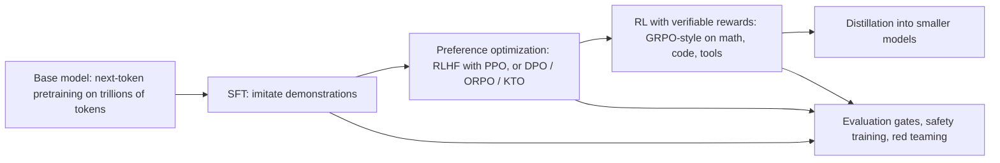

# 26b. Post-training in depth: SFT, RLHF, DPO/GRPO, distillation and judges — with concrete setups

> **What you need to be able to say:** how a base model becomes an assistant; what each post-training stage changes; how to set up supervised fine-tuning and preference learning on your own data with real code and data formats; where LLM judges fit in training (RLAIF) and not only in evaluation; what distillation is and which current models are distilled; and the use cases where each method is the right answer. Chapter 26 is the decision guide; this chapter is the how.

## 26b.1 The post-training pipeline



- **Pretraining** gives knowledge and language; the base model completes text and does not follow instructions.
- **Supervised fine-tuning (SFT)** on (prompt, ideal response) pairs — human-written or model-generated and filtered — teaches format, instruction following, tool-call syntax and style.
- **Preference optimization** aligns to what people prefer among candidate outputs: helpfulness, harmlessness, tone, brevity, honesty; RLHF trains a reward model on comparisons and optimizes the policy with PPO; **DPO** and relatives skip the reward model and optimize the policy directly on preference pairs.
- **RL with verifiable rewards (RLVR)** — GRPO and successors — samples many answers per prompt, scores them with automatic checkers (unit tests, math answers, tool-use success, format validators), and reinforces the better ones; this is how reasoning models learned to think longer and more usefully.
- **Distillation** compresses a strong teacher into a small student for cost and latency.
- **Safety and evaluation** run throughout: refusal behaviour, red-team suites, capability regressions.

## 26b.2 Supervised fine-tuning: a concrete setup

**Data format (chat JSONL):**

```json
{"messages": [
  {"role": "system", "content": "You are a claims-intake assistant. Answer in the JSON schema provided."},
  {"role": "user", "content": "Claim text: ... Schema: {...}"},
  {"role": "assistant", "content": "{\"claim_type\": \"auto\", \"incident_date\": \"2026-03-02\", ...}"}
]}
```

Include tool calls when tuning for tools (`{"role":"assistant","tool_calls":[...]}` and `{"role":"tool", ...}` turns). 500–5,000 high-quality examples for format/style; mask the loss on prompt tokens; hold out 10% plus a later-dated test set.

**Training with TRL + PEFT (LoRA on an open model):**

```python
from datasets import load_dataset
from peft import LoraConfig
from trl import SFTTrainer, SFTConfig

ds = load_dataset("json", data_files={"train": "sft_train.jsonl", "eval": "sft_eval.jsonl"})
peft_cfg = LoraConfig(r=16, lora_alpha=32, lora_dropout=0.05, target_modules="all-linear", task_type="CAUSAL_LM")
cfg = SFTConfig(output_dir="out/sft", num_train_epochs=2, per_device_train_batch_size=4,
                gradient_accumulation_steps=4, learning_rate=1.5e-4, lr_scheduler_type="cosine",
                warmup_ratio=0.03, bf16=True, max_length=4096, logging_steps=20, eval_strategy="steps",
                eval_steps=200, save_steps=200, assistant_only_loss=True, report_to="mlflow")
trainer = SFTTrainer(model="Qwen/Qwen3-8B", train_dataset=ds["train"], eval_dataset=ds["eval"],
                     peft_config=peft_cfg, args=cfg)
trainer.train(); trainer.save_model("out/sft/adapter")
```

Managed equivalents: OpenAI fine-tuning (JSONL upload; closed to new organizations since 7 May 2026, and no new jobs for anyone from 6 January 2027), supervised tuning for Gemini on the Gemini Enterprise Agent Platform (formerly Vertex AI), Bedrock custom models, Microsoft Foundry (formerly Azure AI Foundry) fine-tuning, Databricks Mosaic AI fine-tuning — same data shape, no GPUs to manage. Serve the adapter with vLLM (`--enable-lora`) or merge it.

**Use cases.** Fixed-schema extraction at volume; house-style drafting; tool-call syntax for a custom agent protocol; domain vocabulary (after continued pretraining); a chatbot's persona and refusal style.

## 26b.3 Preference learning: RLHF and DPO, concretely

**What a preference dataset looks like:**

```json
{"prompt": "Summarize the clinical note for the referring physician.",
 "chosen":   "Assessment: ... Plan: ... (concise, structured, no omissions)",
 "rejected": "The patient came in and we did a lot of things ... (rambling, missing plan)"}
```

Sources: human raters comparing two model outputs (the classic RLHF signal), editors' corrections (original = rejected, edited = chosen), user feedback (thumbs, regenerate), and LLM judges comparing outputs against a rubric (**RLAIF** — AI feedback; calibrate the judge first as in chapter 32). 2,000–20,000 pairs are typical for behavioural alignment of an already-SFT'd model.

**DPO with TRL:**

```python
from trl import DPOTrainer, DPOConfig
cfg = DPOConfig(output_dir="out/dpo", beta=0.1, learning_rate=5e-6, num_train_epochs=1,
                per_device_train_batch_size=2, gradient_accumulation_steps=8, bf16=True,
                max_length=4096, loss_type="sigmoid", report_to="mlflow")
trainer = DPOTrainer(model="out/sft/merged", ref_model=None,  # ref = frozen copy of the SFT model
                     train_dataset=load_dataset("json", data_files="prefs.jsonl")["train"],
                     peft_config=peft_cfg, args=cfg)
trainer.train()
```

`beta` controls how far the policy may move from the reference (0.05–0.5); too high → the model drifts and loses abilities, too low → no change. Variants: **ORPO** (combines SFT and preference in one stage without a reference model), **KTO** (works with single-example good/bad labels instead of pairs), **SimPO** (reference-free, length-normalized), **IPO**. All train on the same pair format.

**Classic RLHF with a reward model + PPO** (what the labs do; heavier): train a reward model on comparisons (`RewardTrainer`), then optimize the policy with PPO (`PPOTrainer`) using the reward minus a KL penalty to the reference; needs careful hyperparameters, four model copies in memory (the policy being trained, a frozen reference for the KL term, the reward model, and a value/critic model that estimates expected reward per token), and reward-hacking vigilance (the policy finds what the reward model over-rewards: length, sycophancy, keywords). Online methods (online DPO, GRPO) sample from the current policy and score with a judge or verifier, which avoids distribution mismatch of static pairs.

**GRPO / RLVR with verifiable rewards (reasoning and tools):**

```python
from trl import GRPOTrainer, GRPOConfig
def reward_tests(completions, **kw):          # 1.0 if generated code passes hidden tests
    return [run_tests(c) for c in completions]
def reward_format(completions, **kw):         # small bonus for valid JSON / required sections
    return [0.2 if is_valid(c) else 0.0 for c in completions]
cfg = GRPOConfig(output_dir="out/grpo", num_generations=8, max_completion_length=2048,
                 learning_rate=1e-6, beta=0.04, bf16=True, report_to="mlflow")
trainer = GRPOTrainer(model="out/sft/merged", reward_funcs=[reward_tests, reward_format],
                      train_dataset=prompts_ds, args=cfg)
trainer.train()
```

Sample k answers per prompt, score them, and push the policy toward above-average answers within the group; no reward model needed when a checker exists. Verifiers: unit tests, exact-match math, SQL execution against expected results, tool-call success in a sandbox, schema validators, and calibrated judges for soft criteria.

### Critic's additions: GRPO mechanics and how it fails

- **The advantage is group-relative.** For one prompt, sample G completions (8–16 is typical), score them r₁…r_G, and give each the advantage Âᵢ = (rᵢ − mean(r)) / std(r); every token of completion i is pushed up or down by Âᵢ through a PPO-style clipped ratio, optionally with a KL penalty (β) to the reference. Replacing PPO's learned critic with the group mean is what removes the fourth model and most of the memory.
- **No variance, no learning.** If all G samples fail (or all pass), every advantage is zero and the prompt contributes nothing. Prompts must sit at the edge of the model's ability: filter the dataset to prompts with a pass rate strictly between 0 and 1 under the starting policy, and refresh that filter as the model improves (curriculum). This is the single most common reason a first GRPO run "does nothing".
- **Known biases and fixes.** Normalizing by sequence length rewards long wrong answers and penalizes long right ones less than it should; dividing by the group's standard deviation over-weights near-unanimous groups. "Dr. GRPO" removes both normalizations; DAPO (2025) adds asymmetric clipping ("clip-higher") to stop entropy collapse, dynamic sampling to drop zero-variance groups, token-level loss, and overlong-response shaping. Recent TRL versions default the KL coefficient to zero for the same reasons — set β deliberately rather than inheriting it.
- **Reward hacking is the normal case, not the exception.** Code rewarded by tests learns to special-case the test inputs; math rewarded on the final number learns to guess formats; a judge-scored task learns the judge's taste. Hold out tests the policy never sees, cap response length, log and read samples every few hundred steps, and keep a human-reviewed evaluation set separate from the reward.
- **Cost shape.** Generation dominates: G samples × prompts × steps of long reasoning completions. A small run (a 7–8B model, a few thousand prompts, G = 8) is hours on a single 8-GPU node with vLLM-backed generation; anything frontier-sized is a lab-scale budget, which is why managed RFT (chapter 26) exists.

**Use cases for preference learning / RLHF.**
- A support assistant that is accurate but curt → DPO on (curt, warm-and-accurate) pairs from editor rewrites.
- A clinical-summary model that omits plans → KTO on good/bad labels from clinician review.
- A code assistant for an internal framework → GRPO with the repository's test suite as the reward.
- A text-to-SQL model → GRPO with execution accuracy as the reward and a format bonus.
- An agent that over-calls tools → online DPO with a judge rewarding minimal correct trajectories.
- Safety and refusal style in a regulated domain → DPO on policy-reviewed pairs, then a red-team regression suite.
- Reducing sycophancy and verbosity → pairs where the chosen answer is shorter and disagrees when the user is wrong.

**What to measure.** Win rate against the SFT model on held-out prompts (judge or humans), task metrics, length statistics (preference methods love length — watch it), capability regressions on an unrelated suite, safety suites, and KL/`beta` sanity.

## 26b.4 Distillation: what it is and who uses it

**Definition.** Knowledge distillation trains a small *student* to reproduce a large *teacher*: on the teacher's outputs (sequence-level or "hard" distillation — the common case for LLMs), on its token probabilities (logit/"soft" distillation, when you have the teacher's weights), or on its reasoning traces (distilling chains of thought). Related compression: pruning (removing weights/heads/layers) followed by distillation to recover accuracy, and quantization (chapter 16).

**Who uses it (publicly described, as of 2026).** Google's reports describe Gemini 1.5 Flash as "online distilled" from 1.5 Pro and the Gemini 2.5 Flash and smaller 2.5 models as distilled, while the Gemini 3 Flash model card says only that it is based on Gemini 3 Pro, without describing the method (26c.5); Google also offers a **Gemini Distillation Service** in early access (allowlisted; teacher `gemini-3.1-pro` → student `gemini-2.5-flash`; JSONL prompts in Cloud Storage, up to 50,000 examples and 8,000 input tokens each, text only, with the teacher's responses *and its raw thoughts* used in training — verify status and limits before planning on it). DeepSeek released **R1-Distill** models (Qwen- and Llama-based students from 1.5B to 70B, fine-tuned on about 800,000 samples generated by R1 — plain SFT on the teacher's reasoning traces, no RL on the students). Alibaba's **Qwen3** small models are trained with "strong-to-weak" distillation from the flagship. Meta's **Llama 3.2 1B/3B** were produced by pruning Llama 3.1 8B and distilling with logits from the 8B and 70B models as targets. Google's **Gemma 2 and Gemma 3** technical reports describe knowledge distillation from larger teachers. Microsoft's **Phi** models are trained heavily on synthetic data generated by frontier models (teacher-generated curricula). NVIDIA's **Minitron** work established prune-and-distill recipes. OpenAI offered **model distillation** in its platform (store teacher outputs from production, fine-tune a smaller model on them), but that path is closing: its fine-tuning has been closed to new organizations since 7 May 2026 and accepts no new jobs from 6 January 2027, and the Evals platform from the same bundle becomes read-only on 31 October 2026 and shuts down on 30 November 2026. Anthropic does not publish training details for the Haiku tier; assume the industry pattern. Many frontier-lab small tiers are, in effect, distilled flagships — which is why the "cheap tier is roughly last year's frontier" rule holds.

**A concrete distillation recipe for your own task.**
1. Collect 5,000–50,000 representative prompts from production (de-identified).
2. Generate teacher outputs with the frontier model, with reasoning if the task benefits; sample several candidates per prompt (n = 2–4), filter with a judge or validator, and keep the best of n — diversity plus filtering beats a single greedy answer. Note that you cannot rely on `temperature=0` everywhere: on Claude 4.7 and later models, setting `temperature`, `top_p` or `top_k` to a non-default value returns a 400 error (and the Python SDK v1.0 removed them), so consistency comes from the prompt, structured outputs and the filter, not from sampling knobs.
3. SFT the student (LoRA or full) on (prompt, teacher output); optionally add preference pairs from (best, worst) teacher samples.
4. Evaluate against teacher labels and your held-out human set; check regressions and safety.
5. Serve the student on vLLM or a managed endpoint; keep the teacher as a spot-check on 1–2% of traffic; re-distill monthly.

Economics: a 3–8B student at ~\$0.10–0.30 per MTok (self-hosted or hosted) replacing a frontier model at \$4–10 per MTok on a narrow task is a 20–50× saving; the lab in chapter 34 (#8) does this in a weekend.

**Licensing note.** Closed API providers' terms restrict using outputs to train competing models, and the carve-outs are narrow. Only OpenAI's business terms explicitly allow training on outputs for your own use, and only for internal, non-distributed classifiers and embedding models (besides fine-tuning through OpenAI's own services); Anthropic's Commercial Terms and Google's Gemini API terms prohibit using the services to train competing models with no explicit carve-out, so whether an internal task model "competes" is a question for counsel. Prefer the providers' managed distillation services or open-weight teachers whose licenses allow it, and see 26c.7.1.

Chapter 26c covers distillation in depth: the math behind soft targets and on-policy distillation, the techniques one by one, the managed services and providers' terms as of October 2026, and recipes with code.

## 26b.5 LLM judges inside training (RLAIF) and self-improvement loops

A calibrated judge (chapter 32) can replace or augment human raters: generate k candidates, judge them pairwise or against a rubric, and feed the preferences to DPO/online DPO or use the scores as GRPO rewards. Guard against judge gaming (the policy learns the judge's biases — length, keywords): mix verifiable rewards, rotate judge prompts/models, keep a human-labeled holdout as the arbiter, and monitor length. Constitutional-style methods critique and revise outputs against written principles before preference training. This is also the engine of **self-improving agents** (chapter 22b): the same judge-and-refine loop applied to prompts, tools and memory instead of weights.

## 26b.6 Choosing among them (summary)

| You want | Method | Data | Risk |
|---|---|---|---|
| Format, style, tool syntax | SFT (LoRA) | 500–5k demos | overfitting to narrow data |
| Preferences on tone/safety/brevity | DPO/ORPO/KTO | 2k–20k pairs or labels | drift; length bias |
| Reasoning/tool accuracy with a checker | GRPO/RLVR | prompts + verifier | reward hacking; compute |
| Human-preference alignment at lab scale | RLHF (RM + PPO) | 10k–100k+ comparisons | instability; cost |
| Cheap model for a narrow task | distillation | prompts + teacher outputs | license; drift from teacher |
| Retrieval quality | contrastive fine-tune of embeddings/rerankers | query–doc pairs | forgetting general retrieval |

**Interview line:** *"SFT teaches the shape of the answer, preference optimization teaches which answer people want, RL with verifiable rewards teaches the model to be right where we can check it, and distillation makes it cheap. I can set each up with TRL in an afternoon; the real work is the data and the eval gate."*
