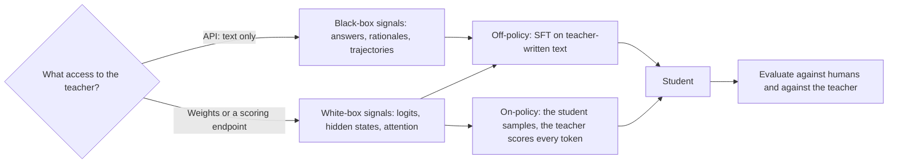
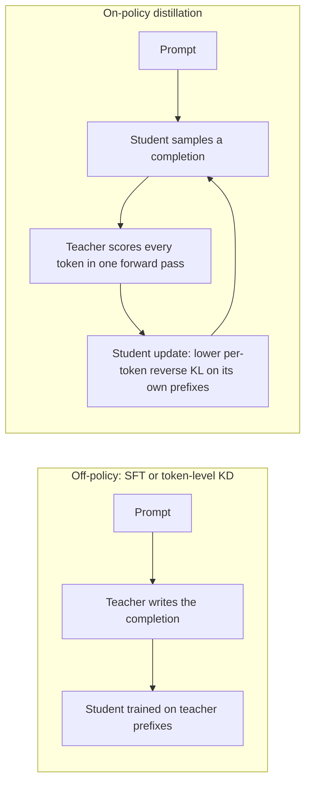

# 26c. Distillation techniques in depth: from soft targets to on-policy distillation

> **What you need to be able to say:** what a student learns from soft targets that labels cannot teach, and why the soft loss is multiplied by T²; how forward KL, reverse KL and the generalized Jensen–Shannon divergence differ (mode covering versus mode seeking) and which fits a classifier, a chat model or a reasoning model; why "fine-tune on the teacher's outputs" is sequence-level distillation, why it suffers from exposure bias, and how on-policy distillation fixes that for one teacher forward pass per student sample; the taxonomy; thirteen techniques with their mechanism, cost and failure modes; which named models are documented as distilled, from which teacher and how; the managed services in October 2026, including OpenAI's fine-tuning wind-down and Azure's retirement of stored completions; what provider terms and open-weight licenses say about training on outputs, and the 2026 "distillation attack" disclosures; how to evaluate a student against the teacher and against humans; and how to run it with vLLM and TRL 1.14.1, with the cost arithmetic. Chapter 26 decides whether to fine-tune at all; 26b gives the basic recipe and SFT code; this chapter is the deep version. Dated October 2026.

## 26c.1 What distillation is, and the three facts that organize this chapter

Knowledge distillation trains a *student* model to reproduce the behavior of a *teacher* model. The training signal can be the teacher's sampled outputs, its full probability distribution over each next token, its hidden states, its written rationales or its whole agent trajectories; and the sequences the student trains on can be written by the teacher (off-policy) or by the student itself and graded token by token by the teacher (on-policy). Three facts organize everything below.

1. **The richer the signal, the more access it needs.** Text needs only an API. Log-probabilities on text the *student* wrote need the teacher's weights or a host that scores arbitrary sequences. Hidden states need the weights and compatible shapes. Most decisions in a distillation project follow from which of these you have.
2. **Who writes the training sequences matters as much as the loss.** A student trained only on the teacher's text never practices recovering from its own mistakes; on long outputs that gap compounds (26c.2.4).
3. **The best teacher is not always the strongest model.** A student learns most from a teacher whose distribution it can represent; several 2025–2026 reports found a smaller or differently trained teacher produced the better student (26c.8.2).



## 26c.2 Foundations and math

### 26c.2.1 Soft targets and temperature (Hinton, Vinyals and Dean, 2015)

Write the teacher's logits as t₁…t_K and the student's as s₁…s_K over K classes (for a language model, K is the vocabulary and the "class" is the next token). A temperature T softens both distributions:

```
p_i(T) = exp(t_i / T) / Σ_j exp(t_j / T)        teacher, softened
q_i(T) = exp(s_i / T) / Σ_j exp(s_j / T)        student, softened

L = α · T² · KL( p(T) ‖ q(T) )  +  (1 − α) · CE( y, q(1) )
```

The first term matches the teacher's softened distribution; the second is ordinary cross-entropy on the hard label y at T = 1. Because KL(p‖q) equals the cross-entropy CE(p, q) minus the teacher's entropy, which does not depend on the student, both give the same gradient. That gradient is

```
∂ CE(p(T), q(T)) / ∂ s_i  =  (1/T) · ( q_i(T) − p_i(T) )
```

and when T is large compared with the logits and both sets of logits have zero mean, it is approximately (s_i − t_i) / (K·T²): distillation at high temperature becomes plain logit matching. The gradient magnitude falls roughly as 1/T², so the paper multiplies the soft term by T² to keep its weight relative to the hard term stable when you change the temperature; it also found the best results came from a considerably lower weight on the hard-label term.

**Worked example.** A support-ticket teacher outputs logits (billing 6.0, refund 3.5, account 1.0, shipping −1.0) for a ticket labeled "billing".

| Temperature | billing | refund | account | shipping |
|---|---|---|---|---|
| T = 1 | 0.918 | 0.075 | 0.006 | 0.0008 |
| T = 2 | 0.715 | 0.205 | 0.059 | 0.022 |
| T = 4 | 0.501 | 0.268 | 0.144 | 0.087 |

The hard label says only "billing". At T = 1 the teacher adds "a little like refund". At T = 4 it exposes the whole similarity structure: refund is far closer than account, which is closer than shipping. A student that sees thousands of such vectors learns which classes are confusable without discovering it from examples. For a student with logits (4.0, 3.0, 0.5, −0.5), the summed absolute gradient of the soft term is 0.42 at T = 1, 0.052 at T = 4 and 0.0125 at T = 8; multiplied by T² it stays between 0.4 and 0.85, which is the point of the factor.

The information in the ratios among small probabilities is commonly called *dark knowledge* (the phrase is not in the 2015 paper). The paper's evidence: on MNIST a large net made 67 test errors, a small net trained on labels 146, and the same small net with soft targets at T = 20 made 74. In speech recognition, one model distilled from a ten-model ensemble kept most of its gain (frame accuracy 60.8% against 61.1% for the ensemble and 58.9% for the baseline). Soft targets also regularize: on 3% of the speech data, frame accuracy was 57.0% with soft targets and 44.5% with hard ones.

For language models the "softness" usually comes for free, because next-token distributions are already broad wherever several continuations are plausible; the LLM recipes in 26c.5 describe matching the teacher's next-token probabilities directly and do not report tuning a distillation temperature. Temperature matters most for classifiers whose teachers are nearly one-hot.

### 26c.2.2 Forward KL, reverse KL and the generalized Jensen–Shannon divergence

Let p be the teacher's distribution and q_θ the student's, for a given prefix.

- **Forward KL**, KL(p‖q_θ) = E_{x∼p}[log p(x) − log q_θ(x)], is an expectation under the *teacher*. It explodes wherever the teacher has mass and the student has none, so the student must cover every teacher mode: *mode covering* (or mean seeking). Cross-entropy on soft targets and SFT on teacher samples both minimize it.
- **Reverse KL**, KL(q_θ‖p) = E_{x∼q_θ}[log q_θ(x) − log p(x)], is an expectation under the *student's own samples*. It punishes the student for putting mass where the teacher puts little and tolerates ignoring some teacher modes: *mode seeking*. Because it is an expectation over student samples, it is naturally on-policy.
- **Generalized JSD** (used by GKD), with m = β·p + (1 − β)·q_θ:

```
JSD(β)(p ‖ q_θ) = β · KL(p ‖ m) + (1 − β) · KL(q_θ ‖ m)
```

The GKD paper notes that its gradients behave like forward KL as β approaches 0 and like reverse KL as β approaches 1 (up to scale); TRL's trainers treat β = 0 as forward KL and β = 1 as reverse KL. Because it compares each distribution with a mixture, it stays bounded when the student assigns almost no probability to a teacher token.

**A toy that shows the difference.** At one position the teacher's distribution over four tokens is (0.45, 0.45, 0.05, 0.05): two good continuations and two bad ones. Student A spreads its mass evenly (0.25 each); student B commits to one good continuation (0.85, 0.05, 0.05, 0.05).

| Divergence | Student A (spread) | Student B (committed) | Preferred |
|---|---|---|---|
| Forward KL(p‖q) | 0.368 | 0.703 | A, which samples a bad token half the time |
| Reverse KL(q‖p) | 0.511 | 0.431 | B, which rarely says the second good continuation |
| JSD(β = 0.1) | 0.034 | 0.056 | A (forward-like) |
| JSD(β = 0.9) | 0.043 | 0.040 | B (reverse-like) |

**Why this matters for generative models.** A classifier is read through its argmax, and its probability on wrong classes is useful calibration information, so forward KL is natural. A generator *samples* from q_θ, and every unit of mass it puts where the teacher would not go becomes a visible, compounding error; a small student that cannot represent all the teacher's modes is better off committing to the ones it can. MiniLLM (Gu and colleagues, ICLR 2024) made this argument for reverse KL: forward KL makes the student overestimate the teacher's low-probability regions. The GKD experiments (Agarwal and colleagues, ICLR 2024) found the choice task-dependent: mode-seeking divergences helped summarization, especially at high sampling temperatures; forward KL did well on GSM8K arithmetic; generalized JSD variants did best on translation. Defaults that follow: forward KL for classifiers and pretraining-scale logit distillation (Minitron and Ministral 3, 26c.4.8); reverse KL for post-training a chat or reasoning model on its own samples (Thinking Machines, MiniLLM, and TRL's `DistillationTrainer`, default β = 1.0, although its asynchronous sibling defaults to 0.0, so check); a short β sweep when unsure.

### 26c.2.3 Token-level versus sequence-level distillation (Kim and Rush, 2016)

**Token-level (word-level) distillation** applies the soft-target loss at every position of a training sequence: L_tok = −Σ_t Σ_v p(v | x, y_<t) · log q_θ(v | x, y_<t), where the prefix y_<t comes from the dataset. It needs the teacher's distribution at each position.

**Sequence-level distillation** matches the teacher's distribution over *whole sequences*. That distribution is intractable, so Kim and Rush approximated it by its mode, the teacher's beam-search output ŷ, and trained the student by ordinary negative log-likelihood on ŷ: L_seq ≈ −log q_θ(ŷ | x). This is exactly what "fine-tune a small model on the large model's answers" means, and the only form available when the teacher is an API. In neural machine translation (EMNLP 2016) the best student ran 10× faster than its teacher with little loss, beat a non-distilled baseline by 4.2 BLEU with greedy decoding (1.7 with beam search), and with pruning had 13× fewer parameters for a 0.4 BLEU drop. The intuition carries to LLMs: the teacher's mode is a cleaner target than noisy human references, so a small student wastes less capacity on variation it cannot use.

The common modern hybrid is token-level distillation on teacher-written text: the teacher generates, and the logit distribution at each generated position is stored with the text (26c.4.1, 26c.9.4).

### 26c.2.4 Exposure bias, and why on-policy distillation fixes it

Token- and sequence-level distillation share one weakness: the student is trained on prefixes it did not write. At inference it conditions on its own tokens, including its own mistakes, which it has never seen during training. Ranzato and colleagues (ICLR 2016) described the resulting brittleness for sequence models: errors accumulate along the generated sequence. Imitation-learning theory gives it a shape. Ross, Gordon and Bagnell (AISTATS 2011) showed that a policy trained on the expert's states, erring with probability ε there, can make up to T²ε mistakes over a T-step task, because each mistake leads to states the expert never visited; training on the learner's *own* state distribution (their DAgger algorithm) restores a bound linear in T. A 4,000-token reasoning trace and a 30-step agent episode are long horizons.

On-policy distillation is DAgger for language models: the student samples a completion, the teacher computes its log-probability for every token of that completion in one forward pass (prefill only, no generation), and the student is updated to reduce the per-token divergence on its own prefixes. Two estimators are in use:

- **Full-distribution** (GKD style): at every position, compute the divergence over the whole vocabulary between the student's and the teacher's next-token distributions.
- **Sampled** (the Thinking Machines style): treat r_t = log p(y_t | ·) − log q_θ(y_t | ·), the negative of a one-sample reverse-KL estimate, as a per-token reward with discount factor zero, and take a policy-gradient step. This is reinforcement learning with a dense reward that the teacher supplies for every token.



| Method | Who writes the sequences | Signal density | Needs |
|---|---|---|---|
| SFT on teacher text (sequence-level KD) | teacher (off-policy) | dense, but on the wrong states | teacher outputs only |
| Reinforcement learning (GRPO, chapter 26b) | student (on-policy) | sparse: one reward per episode | a verifier or reward model |
| On-policy distillation | student (on-policy) | dense: one teacher signal per token | teacher log-probs on student text |

**The 2025 evidence.**

- *Thinking Machines Lab* ("On-Policy Distillation", Kevin Lu and colleagues, 27 October 2025, run on their Tinker training API). Qwen3-8B-Base after SFT on 400,000 OpenThoughts-3 prompts scored 60% on AIME'24; on-policy distillation from Qwen3-32B reached 70% in about 150 steps, which the post estimated at 9–30× less compute than extending SFT toward 2 million prompts. In a LoRA comparison against RL (rank 128, with an RL-trained checkpoint of the same base as teacher), distillation reached the teacher's level in about 7–10× fewer gradient steps, a cumulative compute reduction of roughly 50–100× once shorter training contexts and smaller batches are counted. The argument: RL teaches O(1) bits per episode, distillation O(N) bits, one per token. In one experiment, 20 steps of 256 rollouts on a *single* prompt distilled the teacher's AIME'24 performance, because the target is the teacher's distribution, not one answer to memorize.
- *Distillation as continual learning* (same post). Mid-training Qwen3-8B on internal documents (mixed 70/30 with chat data) lifted an internal-knowledge eval from 18% to 36% but cut IF-eval from 85% to 79%; on-policy distillation from the *original* Qwen3-8B restored IF-eval to 83% and lifted internal QA to 41%.
- *Qwen3 technical report* (May 2025), Qwen3-8B from an off-policy-distilled checkpoint (AIME'24 55.0): RL reached 67.6 for 17,920 GPU-hours, on-policy distillation 74.4 for 1,800. Pass@64 stayed at 90.0 after RL but rose to 93.3 after distillation: the teacher's logits widened what the student could find, not only how reliably it found it.

**What it costs and requires.** Student generation dominates wall-clock time, as in RL; the teacher's work is a prefill-only forward pass per sample. The teacher must expose log-probabilities on *student-written* text: a teacher whose weights you run, or an open-weight server that returns prompt log-probabilities (vLLM's `prompt_logprobs`, which TRL's asynchronous trainer uses so the teacher can sit on separate hardware, 26c.9.3). Closed APIs return log-probabilities, where they return them at all, only for tokens the model itself generated. Teacher and student must share a tokenizer unless you use a cross-tokenizer loss (Universal Logit Distillation, Boizard and colleagues, 2024, and TRL's experimental GOLD trainer built on it). And every recipe here starts on-policy distillation from a student that already writes sensible text, usually after an SFT phase: the teacher's signal on gibberish is wasted.

## 26c.3 A taxonomy

Every distillation method is a point on eight axes (Gou and colleagues survey the classic field, Xu and colleagues the LLM case). Naming the axes is the fastest way to answer "what kind of distillation is that?" in an interview, and to see what a design needs before anyone builds it.

| Axis | Options | What it needs | Documented example |
|---|---|---|---|
| Teacher access | **White-box**: logits, hidden states, attention maps. **Black-box**: text, rationales, trajectories | weights or a scoring endpoint, versus an API | white: Llama 3.2 1B/3B (logits of Llama 3.1 8B and 70B), Gemma 3 (sampled teacher logits); black: Stanford Alpaca (text-davinci-003 outputs), Phi-4-reasoning (o3-mini demonstrations) |
| Who writes the sequences | **Off-policy**: teacher or corpus text. **On-policy**: the student samples, the teacher scores. **Mixed**: a fraction λ on-policy (GKD) | on-policy needs teacher log-probs on student text | off: DeepSeek-R1-Distill (about 800k R1 samples); on: the second phase of Qwen3's strong-to-weak distillation |
| When the teacher learns | **Offline**: a frozen teacher. **Online** (co-distillation): teacher and student, or peers, train together | access to the teacher's training run | Gemini 1.5 Flash, distilled online from 1.5 Pro; Llama 4 Maverick, codistilled from Behemoth; Anil and colleagues (2018) |
| What knowledge | **Response-based**: outputs or logits. **Feature-based**: intermediate representations. **Relation-based**: relations among examples or internal states | features and relations need weights and a layer mapping | response: most LLM recipes; feature: FitNets, TinyBERT; relation: Relational KD (distances and angles among examples), MiniLM's value relations |
| How many teachers | **Single** or **multi-teacher**: ensembles or domain specialists | a way to combine or route teachers | Hinton's ensemble distilled into one net; Margin-MSE's ensemble of BERT cross-encoders; MiMo-V2-Flash's domain teachers; Nemotron-Cascade 2's best checkpoint per domain |
| Self-distillation | teacher and student share an architecture, or are one model in another mode or checkpoint | the model itself | Born-Again Networks (an identical student beats its teacher); context distillation; Thinking Machines' earlier-checkpoint teacher |
| Progressive | a chain of stages or intermediate teachers | several training stages | teacher assistants (Mirzadeh and colleagues); Ministral 3's 24B → 14B → 8B → 3B cascade; progressive distillation of diffusion samplers (Salimans and Ho) |
| Data-free | the teacher or its generations supply the inputs | the teacher only | LLM-QAT distills a quantized model on the full-precision model's own generations |

The defaults that follow: white-box whenever you can host the teacher; off-policy to bootstrap, on-policy once the student writes sensible text; offline unless you train the family yourself; response-based for LLMs, feature- or relation-based for encoders.

## 26c.4 Techniques in depth

| # | Technique | Signal | Teacher access | Relative cost | Typical use |
|---|---|---|---|---|---|
| 1 | Logit distillation | next-token distributions | white-box | teacher forward on every token, plus storage | pretraining-scale compression inside a model family |
| 2 | Feature distillation | hidden states, attention | white-box, compatible shapes | teacher forward with activations | encoders, same-family compression |
| 3 | Sequence-level KD | teacher text | black-box | teacher tokens | API teacher, narrow tasks, bootstrap |
| 4 | On-policy and generalized KD | teacher log-probs on student text | white-box | student generation + teacher prefill | post-training small chat and reasoning models |
| 5 | Reasoning distillation | rationales, long chains of thought | black- or white-box | long teacher outputs | math, code, verifiable domains |
| 6 | Synthetic-data distillation | teacher-written curricula | black-box | many teacher tokens | building general or domain capability |
| 7 | Self and context distillation | the model's own prompted behavior | the model | modest | baking prompts into weights, undoing forgetting |
| 8 | Pruning plus distillation | logits of the unpruned parent | white-box | tens to hundreds of billions of tokens | making a family of sizes from one model |
| 9 | Draft-model distillation | target's distribution | white-box | small | speculative decoding |
| 10 | Quantization-aware distillation | full-precision model's distribution | the model | short QAT runs | int4, fp8 and 2-bit deployments |
| 11 | Embedding and reranker distillation | teacher scores and margins | black- or white-box | teacher scores per pair | retrieval latency and domain adaptation |
| 12 | Judge and reward-model distillation | teacher verdicts and rationales | black-box | teacher judgments | cheap evaluators and graders |
| 13 | Agent and tool-use distillation | trajectories, per-step scores | black- or white-box | episodes in a sandbox | small agents for high-volume flows |

### 26c.4.1 Logit distillation, and how to store teacher logits

**Mechanism.** Run the teacher over the training text and minimize forward KL between its next-token distribution and the student's at every position (or cross-entropy against the teacher's distribution, which has the same gradient). It needs a shared vocabulary.

**The storage problem.** A full distribution is one number per vocabulary entry: Qwen3's embedding table has 151,936 rows, so one position in BF16 is about 300 KB, and 10 billion training tokens would be about 3 petabytes. Four ways around it:

| Option | What is kept | Storage for 10B tokens | Documented use |
|---|---|---|---|
| Online teacher | nothing; the teacher runs next to the student | none, but teacher compute every epoch | Llama 4 Maverick, codistilled from Behemoth, amortizing the teacher's forward passes over most of the student's training data |
| Top-k | k token ids and log-probs per position | k = 20 at 6 bytes per entry: about 1.2 TB; k = 256: about 15 TB | common in open tooling; biased (below) |
| Sampled | k tokens drawn from the teacher's distribution | similar to top-k | Gemma 3 samples 256 logits per token by teacher probability and renormalizes; Gemini 2.5 uses a k-sparse approximation, noting it multiplies storage and throughput by k |
| Importance-sampled | a few sampled tokens with unbiased weights | about 12 unique tokens per position | Sparse Logit Sampling (Anshumann and colleagues, 2025): unbiased in expectation, under 10% overhead over plain cross-entropy training, 300M to 3B students |

The bias in naive top-k is simple to see. If the top 20 tokens hold 92% of the teacher's mass and you renormalize, every kept probability is inflated by 1/0.92 ≈ 1.09, the student is told the other 8% has probability zero, and the student's own logits outside those 20 tokens receive no gradient at all, so nothing stops it from putting mass there. Anshumann and colleagues found this biased estimate hurt both performance and calibration. A cheap fix: keep the leftover mass as one extra "tail" outcome instead of renormalizing it away. The KL over those k + 1 outcomes is a coarsening of the full KL, so it never exceeds the full KL and equals it when k is the whole vocabulary; it does not inflate the head, and it charges the student for its total mass outside the teacher's top k (26c.9.4 has the code; TRL's asynchronous trainer does the same with `add_tail_bucket`).

Mass coverage is not decision coverage. In a multi-teacher agent study (Shen and colleagues, 2026), the answer teacher's top 32 tokens held 99.99% of its mass yet contained the tool-call entry token at only 0.4% of positions, so the student lost the signal that said "do not call a tool here" (26c.4.13). Whatever k you choose, always store the logits of the few tokens that switch behavior: the tool-call opener, end of turn, the first token of a refusal.

**When to use.** You own or can host the teacher, it shares the student's tokenizer, and you train on large volumes: pretraining a small model, compressing a family, or SFT at scale. **Cost.** A teacher forward pass costs about 2 × N_teacher FLOPs per token (prefill only); for a 70B teacher that is 140 GFLOPs per token, about 1.4 × 10²¹ FLOPs for 10B tokens, or roughly 1,000 H100-hours at 40% utilization of the dense BF16 peak (about 990 TFLOPS; NVIDIA's 1,979 figure assumes sparsity). Storage and data-loading throughput are the other bill.

**Pitfalls.** Mismatched tokenizers or chat templates (the ids must mean the same token; use ULD or GOLD across families); an off-by-one between the position that predicts token t and token t itself; logits computed under a different context length or truncation than the student sees; temperature or sampling filters baked into stored log-probs (vLLM returns raw log-probabilities by default, before temperature and top-k/top-p, which is what you want); the top-k inflation above; the student's full-vocabulary softmax in float32 (4 sequences × 4,096 tokens × 151,936 entries × 4 bytes ≈ 10 GB), which is why trainers chunk the loss over the sequence.

### 26c.4.2 Feature and hidden-state distillation

**Mechanism.** Match intermediate representations, not only outputs: hidden states (through a learned projection when the widths differ), attention distributions, embedding outputs.

- **FitNets** (Romero and colleagues, 2014) introduced "hints" from intermediate teacher layers to train thinner, deeper students.
- **DistilBERT** (Sanh and colleagues, 2019) initialized the student from every other BERT layer and pretrained it with masked-language modeling, soft targets and a cosine loss on hidden states: 40% smaller, 60% faster, 97% of BERT's language-understanding performance.
- **TinyBERT** (Jiao and colleagues, 2019) matched embeddings, hidden states, attention matrices and predictions through a layer mapping, first on a corpus and then per task with data augmentation; the 4-layer model kept more than 96.8% of BERT-base's GLUE performance at 7.5× smaller and 9.4× faster.
- **MiniLM** (Wang and colleagues, 2020) matched only the last layer's self-attention distributions and value relations, which frees the student's width and depth from the teacher's; with a teacher assistant it kept more than 99% of the teacher's accuracy on SQuAD 2.0 and several GLUE tasks at half the parameters and computation.

**When to use.** Encoders and classifiers; same-family teacher and student; when the student should inherit internal structure, for example to be fine-tuned later on many tasks. **Cost.** A teacher forward pass that keeps activations, and the design of the layer mapping.

**Pitfalls.** A projection layer can absorb the loss without the student learning anything useful; matching many layers over-constrains a much smaller student; nothing transfers across mismatched shapes. For decoder LLMs, logit-only losses are usually enough: the Minitron practice paper used forward KL on logits alone.

### 26c.4.3 Sequence-level distillation: supervised fine-tuning on teacher outputs

**Mechanism.** The teacher writes answers to your prompts; you filter them; you fine-tune the student on (prompt, answer) pairs: Kim and Rush's sequence-level distillation with a black-box teacher, and the recipe of 26b.4. Stanford's Alpaca (March 2023) is the historical template: 52,000 demonstrations from text-davinci-003 for under \$500, a LLaMA 7B fine-tune for under \$100, and a research-only release because OpenAI's terms prohibited competing models. R1-Distill is the large-scale version (26c.4.5).

**What improves it.** Several samples per prompt (OpenThoughts found it an effective way to grow a data source at least 16×); a verifier or calibrated-judge filter, tested rather than assumed, since none of OpenThoughts' answer filters gave significant gains on its reasoning data; deduplication; and the teacher's reasoning only if the student will reason at inference.

**When to use.** The teacher is an API, the task is narrow, or as the first phase before on-policy distillation. **Cost.** Teacher tokens, usually the dominant line (26c.9.5), then ordinary SFT.

**Pitfalls.** Exposure bias on long outputs (26c.2.4). Style without substance: Gudibande and colleagues (2023) found models fine-tuned on ChatGPT outputs fooled crowd raters with its style while closing little of the factuality gap outside the imitation data. Teacher errors become confident student errors; length and verbosity biases transfer; and the provider terms apply (26c.7).

### 26c.4.4 On-policy and generalized knowledge distillation

**Mechanism.** The student generates; the teacher scores every token; the loss is a divergence on the student's own prefixes (26c.2.4). The main variants:

- **GKD** (Agarwal and colleagues, ICLR 2024): mixes on-policy batches (fraction λ) with fixed-dataset batches, uses the generalized JSD with parameter β, and does *not* backpropagate through the student's sampling, which keeps training stable. With T5 students and a supervised T5-XL (about 3B) teacher, on-policy and mixed variants consistently beat fixed-dataset variants; the gain over the starting student was on average 2.1× (summarization), 1.7× (translation) and 1.9× (arithmetic) the gain from baseline distillation methods. It also combines with RL fine-tuning (RLAIF).
- **MiniLLM** (Gu and colleagues, ICLR 2024): reverse KL optimized with policy gradients, stabilized by single-step decomposition (separating the current token's contribution to cut variance), teacher-mixed sampling (to stop the student from exploiting the teacher with degenerate text) and length normalization; 120M to 13B students; lower exposure bias, better calibration and better long-text generation than baselines.
- **Thinking Machines' on-policy distillation** (October 2025): the sampled per-token reverse-KL reward with discount zero, results in 26c.2.4.
- **Qwen3 strong-to-weak distillation** (May 2025): off-policy distillation on teacher outputs in thinking and non-thinking modes, then on-policy distillation aligning the student's logits with the teacher's (Qwen3-32B or Qwen3-235B-A22B) on the student's own responses, at a tenth of the GPU-hours of the four-stage pipeline used for the flagships.
- **Gemma 2 post-training** ran distillation "from the teacher on the student's distribution", which is on-policy distillation under another name.
- **Multi-teacher on-policy distillation**: Xiaomi's MiMo-V2-Flash (January 2026) distills several domain-specialized teachers, trained with large-scale RL, into one student through dense token-level rewards (MOPD); NVIDIA's Nemotron-Cascade 2 (March 2026) distills from the strongest intermediate checkpoint for each domain during its cascaded RL.

**When to use.** Post-training a small chat, reasoning or agent model whose teacher you can run; long outputs; after an SFT warm start.

**Cost.** Student sampling (like RL), a teacher prefill per sample, and the update. In the published comparisons it reached a given quality far more cheaply than RL (Qwen3: 1,800 versus 17,920 GPU-hours for the 8B comparison), and it costs more per example than SFT.

**Pitfalls.** It needs a teacher you can score with (weights, or a server returning prompt log-probabilities) and a shared tokenizer, or a cross-tokenizer loss. Reverse KL is mode seeking, so watch diversity (pass@k, entropy, distinct n-grams). The teacher's targets are least reliable on prefixes it would never have written, which matters in multi-turn agent rollouts (the *prefix trap*, 26c.4.13). Memory: teacher, student and a generation engine on the same node. Sampling settings: the student must sample the way it will at inference, or the training distribution is not its own.

### 26c.4.5 Chain-of-thought and reasoning distillation

**Mechanism.** Train the student on the teacher's reasoning, not only its answers, so it learns to produce intermediate steps itself.

- **Distilling Step-by-Step** (Hsieh and colleagues, Findings of ACL 2023): train the student to predict labels and rationales as separate tasks; a 770M T5 beat few-shot 540B PaLM using 80% of a benchmark's training data.
- **DeepSeek-R1-Distill** (January 2025): Qwen2.5 and Llama students from 1.5B to 70B fine-tuned on about 800,000 R1-curated samples (600,000 reasoning, 200,000 non-reasoning), SFT only. The 32B student scored 72.6% on AIME 2024 against 47.0% for the same base after over 10,000 steps of large-scale RL: distilling a stronger model beat small-model RL, although moving the frontier itself still needs stronger bases and larger-scale RL.
- **s1** (Muennighoff and colleagues, January 2025): 1,000 questions chosen from 59,029 for quality, difficulty and diversity, with Gemini Flash Thinking traces; Qwen2.5-32B-Instruct trained in 26 minutes on 16 H100s and, with "budget forcing" at inference, beat o1-preview on competition math by up to 27%.
- **LIMO** (Ye and colleagues, February 2025): 817 curated samples with solutions from R1-family models, filtered for correctness and quality; Qwen2.5-32B-Instruct reached 63.3% on AIME24 and 95.6% on MATH500.
- **OpenThoughts** (Guha and colleagues, June 2025): over 1,000 controlled experiments on the data pipeline, scaled to 1.2 million examples; OpenThinker3-7B scored 53% on AIME 2025, 51% on LiveCodeBench and 54% on GPQA Diamond, 15.3 to 20.5 points above R1-Distill-Qwen-7B. QwQ-32B was the better teacher although DeepSeek-R1 scores higher on benchmarks.
- **Phi-4-reasoning** (April 2025): a 14B model trained by SFT on "teachable" prompts with o3-mini demonstrations, plus an RL variant.

**When to use.** Domains with checkable answers (math, code, SQL, structured extraction), where the student may reason at inference. **Cost.** Long teacher outputs and longer student outputs at inference: you buy accuracy with latency.

**Pitfalls.** Small students struggle with long chains: Li and colleagues (2025) found models of 3B or fewer learn better from shorter chains or smaller teachers, and proposed Mix Distillation (mixing long and short chains, or large- and small-teacher traces). The tiny-data results (s1, LIMO) used strong 32B bases; do not expect 1,000 examples to teach an 8B model the same. Teacher traces can contain benchmark solutions. Closed reasoning models return summarized or encrypted thinking (22c.1), so black-box reasoning distillation mostly yields answers, and coaxing out the raw chain is exactly what providers now detect (26c.7.3).

### 26c.4.6 Synthetic-data distillation

**Mechanism.** The teacher writes a curriculum rather than answers to your prompts: instructions, explanations, textbook-style passages, exercises, rewrites of web text. The student is trained, sometimes from scratch, on the result.

- **Orca** (Mukherjee and colleagues, June 2023): a 13B model trained on GPT-4 explanation traces with ChatGPT as an intermediate teacher; it beat Vicuna-13B by more than 100% on Big-Bench Hard and 42% on AGIEval.
- **phi-1** (Gunasekar and colleagues, June 2023): 1.3B parameters, 6B tokens of filtered "textbook quality" web data plus 1B synthetic tokens from GPT-3.5; 50.6% pass@1 on HumanEval.
- **Phi-4** (Abdin and colleagues, December 2024): 14B; about 400B unweighted tokens across 50 kinds of synthetic datasets, 40% of the pretraining mix. The report says earlier Phi models largely distilled GPT-4, while Phi-4 surpasses its teacher on STEM question answering.

**When to use.** You need capability beyond what your logs cover, or a model trained largely on data you control. **Pitfalls.** Low diversity (vary seeds, personas, topics and formats deliberately); benchmark contamination; the teacher's biases and errors at scale; provider terms on outputs (Alpaca's research-only release is the reminder).

### 26c.4.7 Self-distillation and context distillation

**Self-distillation.** The student has the teacher's architecture, or is the teacher in another mode. Born-Again Networks (Furlanello and colleagues, ICML 2018) showed identically parameterized students can significantly outperform their teachers, so distillation is also a regularizer, not only a compressor. Thinking Machines' earlier-checkpoint teacher (26c.2.4) is self-distillation used to undo forgetting.

**Context distillation.** Train the model *without* a prompt to behave as it does *with* it. Askell and colleagues (Anthropic, December 2021) minimized KL(p₀(X | C) ‖ p_θ(X)), where p₀ is the original model, C a fixed context and X drawn from a large corpus; on many but not all evaluations it matched prompting and freed the context window, although raters still preferred the prompted model about 53% of the time. Snell, Klein and Zhong (2022) internalized instructions, scratchpads and examples (internalized examples beat plain gradient descent on them by 9% on SPIDER text-to-SQL); Prompt Baking (Bhargava and colleagues, 2024) does the same with a stoppable schedule, and baked instructions resisted *prompt forgetting* over long sequences.

**When to use.** A long, stable system prompt (policies, persona, a dozen examples) on a self-hosted model, where it costs prefill and KV-cache memory on every call, or a behavior that fades over long conversations. On closed APIs prompt caching already makes a stable prefix cheap (16.2). **Pitfalls.** The rules stop being readable: a policy change means a training run, and an auditor cannot read the prompt in the weights. Version the prompt and the adapter together and re-run the prompted-versus-distilled evaluation on every change.

### 26c.4.8 Pruning plus distillation

**Mechanism.** Remove structure from a trained model (layers for depth pruning; attention heads, MLP neurons and embedding channels for width pruning), ranked by an importance estimate, then recover the lost quality by distilling from the unpruned parent. It is far cheaper than training each size from scratch.

- **Minitron** (Muralidharan and colleagues, NVIDIA, July 2024) derived 8B and 4B models from Nemotron-4 15B with up to 40× fewer training tokens per model than training from scratch, a 1.8× compute saving for the 15B/8B/4B family, and up to 16% better MMLU than same-size models trained from scratch.
- **The Minitron practice paper** (Sreenivas and colleagues, August 2024) compressed Llama 3.1 8B to 4B (94B distillation tokens) and Mistral NeMo 12B to 8B (380B tokens). Without the original data, they first fine-tuned the teacher lightly on the distillation set (*teacher correction*), used forward KL on logits only, and found width pruning beat depth pruning at equal size (41.2% against 16.8% on GSM8K for the 4B).
- **Llama 3.2 1B and 3B** (Meta, September 2024): structured pruning from Llama 3.1 8B, then logits from Llama 3.1 8B and 70B as token-level targets in pretraining.
- **Ministral 3** (Mistral AI, January 2026): *Cascade Distillation*, iterative pruning and continued training with distillation from Mistral Small 3.1 (24B) down to 14B, 8B and 3B. Pure forward-KL distillation beat every tuned mix with the next-token loss; Small 3.1 was a better pretraining teacher than the much stronger Medium 3; a post-trained teacher beat a base one even in pretraining, and a preference-tuned teacher beat an SFT-only one.
- **Nemotron Nano 2** (NVIDIA, August 2025): a 12B hybrid Mamba-Transformer trained on 20T tokens, compressed to 9B with the Minitron strategy so that 128k-token inference fits one A10G (22 GiB), with reasoning accuracy on par with Qwen3-8B at up to 6× the throughput.
- **Without pruning**: Apple's 2025 on-device model (about 3B) trained densely for about 14T tokens, was sparse-upcycled into a 64-expert teacher with 1T tokens, and was then retrained for its last 10% of tokens (about 1.4T) with a distillation loss from that teacher, which Apple says cut the teacher's training cost by 90% and removed the need for structural pruning.

**When to use.** You own a strong model and want a family of smaller ones. It needs tens to hundreds of billions of tokens, so it is a model-builder technique; application teams meet it as the reason a vendor's 3B model is good. **Pitfalls.** The importance estimate and pruning axis decide the outcome; long context needs its own recovery stage (Ministral 3 ran short- and long-context stages per size); a teacher that has drifted from the distillation data needs correction first.

### 26c.4.9 Distillation for speculative decoding

**Mechanism.** In speculative decoding (16.5) a small draft model proposes γ tokens and the target verifies them in one pass. Leviathan and colleagues (ICML 2023) showed a drafted token is accepted with probability Σ_x min(p(x), q(x)) = 1 − TV(p, q), where p is the target's distribution, q the draft's and TV the total variation distance. With acceptance rate α, the expected tokens per target pass are (1 − α^(γ+1)) / (1 − α). So the draft should match the *target's* distribution, not ground-truth text: that is distillation.

**Worked example.** With γ = 4, α = 0.80 gives (1 − 0.8⁵)/0.2 = 3.36 tokens per target pass; distilling the draft to α = 0.90 gives 4.10, 22% more tokens per expensive pass before the draft's own cost.

- **DistillSpec** (Zhou and colleagues, October 2023) distilled the draft on its *own* generations with a divergence chosen for the decoding strategy: 10–45% faster than standard speculative decoding.
- **Medusa** (Cai and colleagues, January 2024) adds decoding heads to the target itself: over 2.2× speedup with a frozen backbone, 2.3–3.6× with joint fine-tuning, and a self-distillation recipe when no training data exists.
- **EAGLE** (Li and colleagues, January 2024) drafts at the feature level (the second-to-top layer): 2.7–3.5× lower latency on LLaMA2-Chat 70B with the output distribution preserved. **EAGLE-3** (March 2025) predicts tokens from fused multi-layer features trained with a "training-time test": up to 6.5× speedup, and 1.38× throughput at batch size 64 in SGLang.
- **Gemma 4** (July 2026 report) ships a small multi-token-prediction drafter head trained with the models.

**When to use.** You serve an open model yourself and latency matters. **Cost.** Small: hours of training on the target's generations. **Pitfalls.** A draft trained on generic chat accepts poorly on your JSON, SQL or code, so measure acceptance length per traffic slice; gains shrink at large batch sizes, where the target is compute-bound; a fine-tuned or re-quantized target needs a re-distilled draft; the draft must share the target's tokenizer.

### 26c.4.10 Quantization-aware distillation

**Mechanism.** Train the quantized model (weights, and sometimes activations and KV cache, through fake quantization) to match the full-precision model's output distribution. The teacher is usually the same model in BF16, so it is self-distillation and needs no labels.

- **LLM-QAT** (Liu and colleagues, May 2023): data-free distillation on the pretrained model's own generations, quantizing weights, activations and KV cache of LLaMA 7B–30B to 4 bits, well ahead of training-free methods at low bit widths.
- **BitDistiller** (Du and colleagues, February 2024): self-distillation with a confidence-aware KL loss for 3- and 2-bit models.
- **Gemma 3** (March 2025): typically 5,000 steps of quantization-aware training against the non-quantized checkpoint's probabilities, for per-channel int4, per-block int4 and switched fp8 versions.

**Why distill rather than retrain on data.** The goal, "behave like the BF16 model", is stated directly by the teacher's distribution, needs no labels, and keeps the model's uncertainty. **Pitfalls.** Evaluate in the serving configuration (26.4); quality drops unevenly, so report per slice; quantize the KV cache as a separate, measured step.

### 26c.4.11 Embedding and reranker distillation

**Mechanism.** A slow, accurate scorer (a cross-encoder or an LLM) labels query–document pairs or orders candidate lists; a fast model (a bi-encoder, a small cross-encoder or a static embedding table) learns to reproduce the scores or the ordering.

- **Cross-encoder to bi-encoder.** Augmented SBERT (Thakur and colleagues, 2020) labels sampled sentence pairs with a cross-encoder as extra bi-encoder training data: up to 6 points in-domain and 37 in domain adaptation. **Margin-MSE** (Hofstätter and colleagues, 2020) matches the teacher's *margin* s(q, d⁺) − s(q, d⁻) rather than raw scores, because architectures score on different scales.
- **LLM to small reranker.** RankGPT (Sun and colleagues, EMNLP 2023) distilled ChatGPT's permutation rankings into a 440M model that beat a 3B supervised reranker on BEIR; this is the mechanism behind 24b's advice to use an LLM reranker as a teacher.
- **Static embeddings.** Model2Vec (Minish Lab, MIT) passes a vocabulary through a sentence transformer, reduces dimensions with PCA and applies Zipf weighting, producing a lookup-table model in about 30 seconds on a CPU without a dataset; the project claims up to 50× smaller and 500× faster models for a small quality drop.

**When to use.** Retrieval latency or cost (chapter 18), domain adaptation without human labels, on-device search. **Pitfalls.** Teacher scores are not comparable across queries, so train on margins or a per-query softmax; mine hard negatives from *your* first-stage retriever; unlabeled positives among the "negatives" teach the student to bury relevant documents; measure with the step metrics of 24b.5.

### 26c.4.12 Judge and reward-model distillation

**Mechanism.** A strong judge (chapter 32b) labels many items with verdicts, scores or rationales; a small model learns to reproduce them.

- **Prometheus** (Kim and colleagues, ICLR 2024): 100,000 GPT-4 feedback examples over 1,000 rubrics; the 13B evaluator reached a Pearson correlation with human evaluators of 0.897, against 0.882 for GPT-4 and 0.392 for ChatGPT.
- **JudgeLM** (Zhu and colleagues, ICLR 2025): 7B–33B judges fine-tuned on GPT-4 judgments with swap augmentation and reference support or drop against position, knowledge and format biases; over 90% agreement with the teacher, and the 7B judged 5,000 samples in 3 minutes on 8 A100s.
- **A classifier instead of a generator.** For a binary criterion, an encoder classifier distilled from the judge's verdicts gives a calibrated probability you can threshold and cascade on (32b.4) at a fraction of the cost; a small generative judge earns its cost when reviewers need the rationale.
- **Reward models** trained on AI-judge preferences are the RLAIF case of 26b.5.

**Pitfalls.** The student inherits the teacher's biases (32b.6) and adds its own; agreement with the teacher is not agreement with humans, so the gate is κ against the human gold set; a new generator shifts the input distribution under the judge; the adversarial calibration set of 32b.6 must pass before the small judge ships.

### 26c.4.13 Distilling agents and tool use

**Mechanism.** Train the student on whole trajectories (reasoning, tool calls with arguments, tool results, final answers), off-policy from logged teacher episodes or on-policy in a sandbox. TRL's `DistillationTrainer` takes `tools=[...]` (typed Python functions) for the on-policy case and masks tool-result tokens out of the loss.

- **FireAct** (Chen and colleagues, October 2023): fine-tuning Llama2-7B on 500 GPT-4 agent trajectories raised its HotpotQA performance by 77%; mixing tasks and prompting methods helped.
- **Agent Distillation** (Kang and colleagues, NeurIPS 2025): distills full reason-act behavior with retrieval and code tools, using a "first-thought prefix" to improve teacher trajectories and self-consistent action generation at inference; across eight factual and math tasks, 0.5B–3B students matched the next-larger tier trained by chain-of-thought distillation.
- **Multi-turn on-policy distillation has a "prefix trap"** (Liao and colleagues, July 2026): the more the history reflects the student's behavior, the more relevant the signal and the less reliable the teacher's targets on it. Their prefix-replay method (ReOPD) reuses stored teacher trajectories as prefixes and lets the student act only at sampled steps; it was at least 4× faster per training step, needed no environment calls during student training, and matched or beat standard on-policy distillation on math and search tasks, gaining most where the teacher–student gap was large.
- **Multi-teacher drift** (Shen and colleagues, 2026): with one teacher for tool calls and another for direct answers, a GKD student drifted toward calling tools when it should have answered, which aggregate losses did not reveal. The first version of the paper damped extreme per-token divergences (over-calling 13.7% → 9.0% on APIGen-MT at matched decision accuracy); the revised version traces the drift to top-32 truncation of the answer teacher's distribution, which dropped the tool-entry token (26c.4.1). Restoring that one coordinate cut over-calling from 14.2% to 3.7%, at a cost of 12.4 points of tool-call recall.

**When to use.** A high-volume agent flow on a frontier model with stable, logged trajectories (62.2.10 recommends distilling the highest-volume nodes; 62.3 lists a trace-to-small-model pipeline as an innovation challenge). **Pitfalls.** Logged tool results carry personal data and secrets; schemas drift between logging and training; students invent tool results unless the loss is masked on tool outputs and the format forces a real call; and the metrics that matter are pass^k, tool-call precision and recall, and over- and under-calling rates, not token-level loss.

## 26c.5 Which current models use distillation: what is documented

This table lists only what a technical report, model card or official post states; "not described" means the sources read for this chapter do not say, not that distillation was not used. It extends the short list in 26b.4.

| Model (date) | Teacher | Method | Source |
|---|---|---|---|
| Gemini 1.0 Nano-1 (1.8B) and Nano-2 (3.25B), December 2023 | larger Gemini models | distilled, then quantized to 4 bits for devices | Gemini 1.0 report |
| Gemini 1.5 Flash, 2024 | Gemini 1.5 Pro | "online distilled" from the much larger Pro model | Gemini 1.5 report |
| Gemini 2.5 Flash and the smaller 2.5 models, 2025 | not named | distillation, with the teacher's next-token distribution approximated by a k-sparse distribution to cut storage | Gemini 2.5 report |
| Gemini 3 Flash, December 2025 | not stated | the model card says it is based on Gemini 3 Pro and does not describe the method | Gemini 3 Flash model card |
| Gemma 2 2B and 9B, 2024 | a larger model, not named | distillation instead of next-token prediction during pretraining, on more than 50× the compute-optimal number of tokens (2T and 8T); the 27B was trained from scratch; in the ablation a 2B student distilled from a 7B on 500B tokens averaged 67.7 against 60.3 from scratch; distillation on the student's distribution in post-training | Gemma 2 report |
| Gemma 3 1B, 4B, 12B and 27B, March 2025 | not named; a large instruction-tuned teacher in post-training | pretraining distillation with 256 sampled teacher logits per token; post-training distillation plus RL (improved BOND, WARM and WARP); QAT against the non-quantized checkpoint | Gemma 3 report |
| Gemma 4, 2026 | not stated | the July 2026 report never uses the word; it says pre-training follows Gemma 3's (which distilled), and describes QAT and a multi-token-prediction drafter; the model card is silent | Gemma 4 report and model card |
| Llama 3.2 1B and 3B, September 2024 | Llama 3.1 8B and 70B | structured pruning from the 8B, then their logits as token-level targets in pretraining | Meta blog |
| Llama 4 Maverick, April 2025 | Llama 4 Behemoth (288B active parameters, nearly 2T total, 16 experts) | codistillation during pretraining with a loss that weights soft and hard targets dynamically over training | Meta blog |
| Qwen3 0.6B, 1.7B, 4B, 8B, 14B and 30B-A3B, May 2025 | Qwen3-32B or Qwen3-235B-A22B | strong-to-weak distillation: off-policy on teacher outputs in thinking and non-thinking modes, then on-policy logit distillation | Qwen3 report |
| DeepSeek-R1-Distill 1.5B, 7B, 8B, 14B, 32B, 70B, January 2025 | DeepSeek-R1 | SFT on about 800,000 curated samples; no RL | R1 paper and model cards |
| DeepSeek-V3, December 2024 | an R1-series model | reasoning capability distilled during post-training, balancing accuracy against length | DeepSeek-V3 report |
| Phi-4 (14B), December 2024 | OpenAI models (the report says earlier Phi models largely distilled GPT-4, and names GPT-4o among the models generating post-training data) | about 400B tokens of synthetic data, 40% of the pretraining mix | Phi-4 report |
| Phi-4-reasoning (14B), April 2025 | o3-mini | SFT on reasoning demonstrations; RL for the "plus" variant | Phi-4-reasoning report |
| Minitron 8B and 4B, 2024 | Nemotron-4 15B | pruning plus distillation | Minitron paper |
| Llama-3.1-Minitron 4B and Mistral-NeMo-Minitron 8B, 2024 | Llama 3.1 8B and Mistral NeMo 12B, each lightly fine-tuned first | pruning plus logit-only forward KL (94B and 380B tokens) | Minitron practice paper |
| Llama-Nemotron Super (49B) and Ultra (253B), 2025 | the parents Llama 3.3-70B-Instruct (Super) and Llama 3.1-405B-Instruct (Ultra); DeepSeek-R1, Qwen and Llama models for SFT data | architecture search with block-wise local distillation, then knowledge distillation (40B and 65B tokens), SFT on teacher-generated reasoning and non-reasoning data, and RL for Ultra | Llama-Nemotron paper |
| Nemotron Nano 2 9B, August 2025 | NVIDIA's own 12B base model, trained on 20T tokens | Minitron pruning plus distillation | Nemotron Nano 2 paper |
| Nemotron-Cascade 2 (30B, 3B active), March 2026 | the strongest intermediate checkpoint for each domain | multi-domain on-policy distillation inside cascaded RL | Nemotron-Cascade 2 paper |
| Ministral 3 3B, 8B and 14B, January 2026 | Mistral Small 3.1 in pretraining; Mistral Medium 3 in SFT; Magistral Small 1.2 for the 3B reasoning model | Cascade Distillation; logit distillation in SFT; for the 3B reasoning model, logit distillation replaced vanilla SFT, which had produced a brittle, verbose model with repetition and endless generations | Ministral 3 paper |
| Apple on-device model (about 3B), 2025 | a mixture-of-experts teacher upcycled from the on-device model | distillation loss on the last 10% of pretraining tokens (about 1.4T) | Apple 2025 report |
| MiMo-V2-Flash (309B, 15B active), January 2026 | domain-specialized teachers trained with RL | multi-teacher on-policy distillation (MOPD) | MiMo-V2-Flash report |
| Kimi k1.5, January 2025 | its own long-chain-of-thought model | "long2short" transfer (model merging, shortest rejection sampling, DPO, RL); the paper does not call it distillation | Kimi k1.5 report |
| Claude Haiku tier, GPT-5.x mini and nano, Gemini Flash-Lite 3.x | not disclosed | not disclosed | — |

**Three patterns in the table.** Labs distill their own flagships, usually with logits inside one family that shares a tokenizer; black-box distillation across companies shows up mostly in research and open releases. Small-model post-training increasingly adds an on-policy distillation phase after SFT (Gemma 2 in 2024; Qwen3, MiMo-V2-Flash and Nemotron-Cascade 2 since). And the teacher is chosen, not assumed (Ministral 3, Gemma 3; 26c.8.2). The commercial consequence is the rule of 16.1: a provider's cheap tier is roughly its previous frontier, compressed.

## 26c.6 Managed distillation services (October 2026)

| Service | What it automates | Teachers → students | Status and caveats |
|---|---|---|---|
| **Amazon Bedrock Model Distillation** | one job that generates teacher responses from your prompts (or reuses prompts or prompt–response pairs from invocation logs), applies proprietary data synthesis and fine-tunes the student | Nova Premier → Nova Pro, Lite or Micro; Nova Pro → Lite or Micro (US East, N. Virginia); Llama 3.1 405B → Llama 3.1 8B or 70B, 3.2 1B, 3.3 70B; Llama 3.1 70B or 3.3 70B → Llama 3.1 8B, 3.2 1B or 3B (US West, Oregon) | synthesis grows the set to at most 15,000 pairs, billed at the teacher's on-demand rates; distillation is not currently available for Anthropic models, with no confirmed timeline for its return |
| **OpenAI** | the October 2024 "Model Distillation in the API" bundle: Stored Completions to capture a large model's input–output pairs, Evals to measure, fine-tuning to train the smaller model | at launch GPT-4o or o1-preview → GPT-4o mini; the current guide captures `gpt-4.1` responses (the Responses API stores them for 30 days by default) to fine-tune `gpt-4.1-mini` | winding down: since 7 May 2026 no fine-tuning for organizations that never ran it; since 2 July 2026 only for those with inference on a fine-tuned model in the past 60 days; from 6 January 2027 no new jobs for anyone, while existing fine-tuned models serve until their base models are deprecated. Evals become read-only on 31 October 2026 and shut down on 30 November 2026 |
| **Google: Gemini Distillation Service** on the Gemini Enterprise Agent Platform (formerly Vertex AI) | trains a Gemini student on a Gemini teacher's responses *and raw thoughts* from your JSONL prompts | `gemini-3.1-pro` → `gemini-2.5-flash` | early access granted for an initial 30 days, REST API only; at least 1,000 examples recommended, at most 50,000, file up to 1 GB, 8,000 input tokens per example (the job fails if more than 10% exceed it), teacher output up to 24,000 tokens; text only, no multimodal inputs or function calls. The platform also lists "supervised and distillation fine-tuning" for open models |
| **Microsoft Foundry** | in the Foundry (classic) portal, a **Distill** button turns filtered stored completions (`store=True` with metadata) into a JSONL dataset, then runs ordinary fine-tuning | any Azure OpenAI model as teacher; fine-tunable students such as `gpt-4.1-mini` and `gpt-4.1-nano`, and some open models | stored completions retire on 15 October 2026; Microsoft points to the Responses API and Agent Traces (traces converted to datasets) instead; existing stored completions cannot be exported, although fine-tuning jobs already built from them keep working; at least 10 completions, hundreds to thousands recommended |
| **Open-model training APIs** (for example Thinking Machines' Tinker) | you write the loop (SFT, RL or on-policy distillation) and the service runs it on open weights | your choice of open teacher and student | the on-policy distillation results in 26c.2.4 were run on Tinker |

**What the managed services do not do for you.** Pick prompts that represent your traffic, build the human-labeled evaluation set, check the teacher's terms (26c.7), measure the student against humans, and re-distill when the teacher or the traffic changes. Three practical consequences of the October 2026 status: OpenAI's managed path closes to new jobs on 6 January 2027, Azure's capture step moves from stored completions to traces, and Bedrock cannot currently distill Claude at all. A pipeline that owns its own capture (logged prompts and responses in your lakehouse, with consent and retention rules) survives these product changes; one built on a vendor's capture feature does not.

## 26c.7 Legal, policy and security

This section reports what the documents say as of October 2026. It is not legal advice; the engineering job is to know which clause applies, record it, and get a sign-off before the first teacher token is generated.

### 26c.7.1 What the closed providers' terms say about training on outputs

| Document | What it says | What it means for distillation |
|---|---|---|
| OpenAI Services Agreement (business customers, effective 1 January 2026), §3.3 | no using Output to develop AI models that compete with OpenAI, except under a *Permitted Exception*: (a) models "primarily intended to categorize, classify, or organize data", such as embeddings or classifiers, not distributed or made commercially available; (b) fine-tuning or customizing models through OpenAI's own services. Reverse engineering includes model extraction or stealing attacks | an internal classifier or embedding model trained on API outputs is explicitly allowed; a distributed or general-purpose model is not |
| OpenAI Terms of Use (individuals, effective 1 January 2026) | lists using Output to develop models that compete with OpenAI among prohibited uses | no carve-out |
| Anthropic Commercial Terms (effective 17 June 2025), §D.4 | no accessing the Services to build a competing product, including training competing AI models, unless Anthropic expressly approves; no reverse engineering or duplicating the Services | no explicit carve-out; whether an internal task model "competes" is a question for counsel |
| Gemini API Additional Terms (last modified 28 April 2026) | no using the Services to develop models that compete with them, and no reverse engineering, extracting or replicating any component, including underlying data or models | same reading as Anthropic's |

The managed services in 26c.6 are the provider-sanctioned routes (Bedrock, the Gemini Distillation Service, Foundry, OpenAI's own fine-tuning while it lasts): the student stays inside the provider's platform, which is how the terms reconcile distillation with their bans on competing models. Note what OpenAI's wind-down does to its exception (b): it covers fine-tuning *through OpenAI's services*, which accept no new jobs from 6 January 2027, so after that only exception (a), an undistributed classifier or embedding model, remains for new work.

### 26c.7.2 Open-weight teachers: licenses on outputs and derivatives

- **Llama 3 Community License** (18 April 2024), §1.b.v: no using the Llama Materials or any output or results of them to improve any other large language model, except Llama 3 itself or its derivative works.
- **Llama 3.1** (23 July 2024) and **Llama 4** (5 April 2025) **Community Licenses**, §1.b.i: a distributed model trained or improved with Llama Materials *or their outputs* must have Llama at the start of its name and display "Built with Llama"; licensees above 700 million monthly active users need a separate license.
- **Gemma Terms of Use** (last modified 1 April 2026; Gemma 1 to 3n and variants such as ShieldGemma and EmbeddingGemma): *Model Derivatives* include models made by transferring patterns of Gemma's weights or Output, explicitly including distillation and training on synthetic outputs, and a distributor must pass on the Prohibited Use Policy as an enforceable provision. Outputs themselves are not Model Derivatives. **Gemma 4** is Apache-2.0.
- **DeepSeek-R1**: MIT, and the model cards allow commercial use and derivative works, including distillation; the R1-Distill models also inherit their bases' licenses (Apache-2.0 for Qwen, the Llama licenses for Llama).
- **Qwen3 and gpt-oss**: Apache-2.0 (16.3).

**The consequence for a student you ship.** Distilled from a Llama 3.1-or-later teacher and distributed: its name starts with the word Llama. Distilled from Gemma 3: it carries Gemma's use restrictions downstream. Distilled from DeepSeek-R1, Qwen3 or gpt-oss: you keep the license notices. An internal model that is never distributed avoids most naming and pass-through duties, but check what each license counts as *made available*.

### 26c.7.3 The 2025–2026 disputes: who said what

| Date | Who | What they said |
|---|---|---|
| 16 April 2025 | U.S. House Select Committee on the CCP, report *DeepSeek Unmasked* | among four key findings, that it was "highly likely that DeepSeek used unlawful model distillation techniques" drawing on leading U.S. models |
| 17 September 2025 | DeepSeek, via the peer-reviewed R1 paper in *Nature* (reported by *Nature*'s news team) | that R1's success did not hinge on training on rivals' outputs |
| 12 February 2026 | Google Threat Intelligence Group, *AI Threat Tracker* | frequent model-extraction (distillation) attacks from private-sector entities and researchers worldwide, none observed from state-backed APT groups; one campaign of more than 100,000 prompts tried to make Gemini reveal its full reasoning, apparently to replicate it in non-English languages, and was caught in real time |
| 23 February 2026 | Anthropic, *Detecting and preventing distillation attacks* | that DeepSeek, Moonshot AI and MiniMax generated over 16 million exchanges with Claude through about 24,000 fraudulent accounts (over 150,000, 3.4 million and 13 million respectively), reached through commercial proxy services running networks of accounts it calls *hydra clusters*; the campaigns targeted reasoning, agentic reasoning and tool use, coding, computer-use agents and computer vision, and in DeepSeek's case included rubric-grading prompts that used Claude as a reward model for reinforcement learning; detection relied on classifiers and behavioral fingerprinting; Anthropic also stated that models built this way are unlikely to keep their safeguards |

These are the claims of the parties who made them; this chapter does not cover the named labs' responses beyond DeepSeek's 2025 statement. Three points are worth carrying into an interview. The same Anthropic post calls distillation "a widely used and legitimate training method" that labs apply to their own models, so the dispute is about access and terms, not the technique. Both disclosures describe the target as reasoning traces and agentic behavior, which is why providers hide or summarize reasoning (22c.1). And extraction is not only of answers: using a frontier model as a grader for someone else's RL is the judge distillation of 26c.4.12 without permission.

### 26c.7.4 Defenses, and what they cost legitimate users

| Defense | Mechanism | Evidence | Cost to legitimate users |
|---|---|---|---|
| Identity and rate controls | verification for risky account types; per-account and per-cluster limits; anomaly detection on narrow-capability volume, repetitive templates and shared infrastructure | Anthropic's signals; Google's real-time detection | friction for startups and researchers; false positives |
| Hiding or summarizing reasoning | return a summary or encrypted thinking instead of the raw chain | OpenAI withheld o1's raw chains of thought in September 2024, citing user experience, competitive advantage and monitoring; Claude and Gemini return summarized or encrypted thinking (22c.1) | harder debugging and auditing; you pay for tokens you cannot read |
| Output watermarking | bias sampling with a keyed signal detectable later | SynthID-Text (Dathathri and colleagues, *Nature*, October 2024): negligible change in user feedback across nearly 20 million Gemini responses; detection does not need the LLM | none visible; it proves provenance rather than preventing copying |
| Detecting training on watermarked text | "radioactivity": a model fine-tuned on watermarked text carries a detectable residue | Sander and colleagues (NeurIPS 2024): detectable (p < 10⁻⁵) with as little as 5% of the training text watermarked | none |
| Antidistillation sampling | perturb the next-token distribution so traces are less useful as training data while staying useful as answers | Savani and colleagues (April 2025) | a utility trade-off the provider must tune |
| Degrading the student | serve responses to suspected extraction traffic that train poor students | Google describes proactive real-time defenses that can degrade student performance | risk of degrading a misclassified legitimate user |

### 26c.7.5 What to do on the job

1. **Keep a teacher register**: model and version, date, the license or terms version, the clause relied on (for example OpenAI's Permitted Exception for an internal classifier), and who signed off.
2. **Record provenance for every dataset row**: teacher, prompt source, the consent basis for using production logs, retention.
3. **Scrub personal data and secrets** before prompts reach a teacher and before trajectories reach a training set; agent tool results are the usual leak.
4. **Propagate license duties**: naming (Llama), use restrictions (Gemma), notices (Apache-2.0, MIT).
5. **Re-run safety evaluation** before release (26c.8.4), and name the teacher and data in the model card.
6. **If you sell model access**, put rate limits and per-cluster anomaly detection in front of it, hide reasoning by default, consider watermarking, and write the output terms you want enforced.

## 26c.8 Evaluating a distilled model

### 26c.8.1 Two gaps, not one

Measure the **student–teacher gap** (fidelity: how often the student agrees with the teacher) and the **student–human gap** (accuracy: how often it is right according to human labels), on the same human-labeled set. They diverge in both directions. Stanton and colleagues (NeurIPS 2021) found students often fail to match their teachers' predictive distributions even when they have the capacity, mainly because of optimization difficulty, and that closer fidelity does not always mean better generalization. And a student that agrees with the teacher 95% of the time has also learned the teacher's mistakes.

**A worked readout.** On 1,000 human-labeled tickets: prompted 8B baseline macro-F1 0.71, teacher 0.90, student 0.87. The *recovery ratio* is (0.87 − 0.71) / (0.90 − 0.71) = 84% of the teacher's advantage. Student–teacher agreement is 93% overall, but the teacher is wrong on 100 of the 1,000 tickets, and on those the student repeats the teacher's answer 70 times: it inherited most of the teacher's errors, so the next improvement comes from fixing teacher labels (a better prompt, a second teacher, human review of disagreements), not from training the student longer.

### 26c.8.2 The capacity gap: when a smaller teacher works better

| Evidence | Finding |
|---|---|
| Mirzadeh and colleagues (2019) | student performance degrades when the student–teacher gap is large; an intermediate "teacher assistant" bridges it |
| Busbridge and colleagues, *Distillation Scaling Laws* (ICML 2025) | a scaling law predicts student performance from compute and its teacher–student split; the capacity gap is a gap in *learning capacity*, of which size is one case; distillation beats ordinary training when a teacher already exists or several students share it, up to a compute level that grows with student size, but not for one student whose teacher must also be trained |
| Zhang and colleagues, law of capacity gap (ACL 2025) | the optimal teacher size scales linearly with the student size across model and data scales |
| Gemma 3 report | smaller teachers were better for short training horizons, larger ones for long horizons |
| Ministral 3 | Mistral Small 3.1 was a better pretraining teacher than the much stronger Mistral Medium 3 |
| OpenThoughts | QwQ-32B was a better reasoning teacher than DeepSeek-R1, which scores higher on the benchmarks |
| Li and colleagues (2025) | students of 3B parameters or fewer learned better from shorter chains or from smaller teachers |

**What to do.** Run a teacher bake-off first: two or three candidate teachers, the same prompts and the same student recipe at reduced scale, scored on your evaluation set. It costs a few percent of the budget and replaces the assumption that the strongest model teaches best.

### 26c.8.3 Calibration

For classifiers and judges, report reliability curves per slice and fit temperature scaling on a calibration split before choosing thresholds (32b.1). What is specific to distillation: soft targets transfer the teacher's uncertainty and hard labels do not; renormalized top-k targets push the student toward overconfidence (26c.4.1); and a student trained on one-hot labels from a closed API knows nothing of the teacher's uncertainty unless you build soft labels yourself, for example from vote shares across samples (26c.10, scenario a). For generators, check that abstentions and hedges survive: a student that imitated a confident style without the knowledge behind it (Gudibande and colleagues) is miscalibrated in the most damaging way.

### 26c.8.4 Robustness and safety regressions

- **Style without substance.** Imitation models looked close to ChatGPT to crowd raters but closed little of the factuality gap outside the imitation data (Gudibande and colleagues, 2023). Evaluate facts and task success, not fluency.
- **Fine-tuning erodes safety.** Qi and colleagues (2023) jailbroke GPT-3.5 Turbo with 10 adversarial fine-tuning examples for under \$0.20, and benign fine-tuning data also degraded alignment. A distilled student is a fine-tuned model: re-run refusal, jailbreak and prompt-injection suites.
- **Safeguards do not transfer by default.** Anthropic argues illicitly distilled models are unlikely to keep their teachers' safeguards; the same holds for legitimate students whose data omitted refusals, so include refusal and policy examples deliberately.
- **Memorization.** Teacher outputs on production prompts can contain personal data, and students reproduce training strings; test with canaries.

### 26c.8.5 Target task versus general benchmarks

For a task model, the target-task evaluation on later-dated traffic is the ship gate; a general benchmark suite is a regression alarm, not a goal. For a general model, the opposite applies, with two cautions: teacher outputs can contain benchmark solutions (check contamination before quoting a benchmark), and a gain can come from learning a benchmark's answer format rather than the skill, so read samples before believing a jump.

### 26c.8.6 The evaluation set you need, before and after

| Set | Size | Built from | Used for |
|---|---|---|---|
| Human gold set | 500–2,000 items, two raters on a subset | production sample from *after* the training window | the ship gate: student, teacher and prompted baseline, all scored against humans |
| Slice sets | 100 or more per slice | stratified from the gold set | per-language, per-product, per-difficulty regressions |
| Teacher-agreement set | 5,000–20,000 | teacher labels on fresh traffic | fidelity, drift monitoring, cheap checks between releases |
| Adversarial and safety set | 200–1,000 | jailbreaks, injections, policy edge cases | refusals, injection resistance, judge robustness (32b.6) |
| Regression and calibration | public benchmarks; 500 held-out gold items | public; the gold set | forgetting alarm; reliability curves and thresholds |
| Online | shadow traffic, then an A/B test | production | the business metric, p95 latency, cost, escalations |

Build the gold set *before* generating teacher data, so the teacher prompt is not tuned on it; compare variants paired on the same items (McNemar's test or a paired bootstrap) and report intervals (32b.1, 32b.7 and 24b.5 give the sample-size arithmetic).

## 26c.9 Practical recipes

The code below targets **TRL 1.14.1** (released 29 September 2026; Python 3.10+), **vLLM's offline `LLM` API** as documented on its main branch in October 2026, and **PyTorch 2.x**. These APIs move fast: TRL has moved `GKDTrainer` into `trl.experimental` and added a stable `DistillationTrainer`, so check the installed version before copying.

### 26c.9.1 Generate teacher data with a serving engine

With an open teacher, vLLM generates several samples per prompt and can return the teacher's top log-probabilities for every generated token in the same pass, which gives you sequence-level data and token-level targets at once.

```python
# Teacher data with vLLM's offline API: LLM.chat takes a batch of conversations,
# SamplingParams(n=...) returns several samples, logprobs=k returns top-k per token.
import json
from vllm import LLM, SamplingParams

teacher = LLM(model="Qwen/Qwen3-32B", tensor_parallel_size=2)   # max_logprobs defaults to 20
params = SamplingParams(n=4, temperature=0.7, top_p=0.95, max_tokens=2048,
                        logprobs=20, seed=7)

rows = [json.loads(line) for line in open("prompts.jsonl")]      # {"id": ..., "messages": [...]}
outputs = teacher.chat([r["messages"] for r in rows], params,
                       chat_template_kwargs={"enable_thinking": False})

with open("teacher_samples.jsonl", "w") as f:
    for row, out in zip(rows, outputs):
        for c in out.outputs:                        # n samples for this prompt
            if c.finish_reason != "stop":            # drop truncated generations
                continue
            topk = [[[tok, lp.logprob] for tok, lp in pos.items()] for pos in c.logprobs]
            f.write(json.dumps({
                "id": row["id"],
                "prompt": row["messages"],
                "completion": [{"role": "assistant", "content": c.text}],
                "token_ids": list(c.token_ids),
                "topk": topk,
            }) + "\n")
```

Four details matter. vLLM returns *raw* log-probabilities by default (`--logprobs-mode raw_logprobs`), before temperature and top-p, so the stored targets describe the teacher's own distribution although you sampled at 0.7. A position can hold k + 1 entries, because the sampled token is added when it falls outside the top k; pad to a fixed width with a validity mask (26c.9.4). JSON suits a pilot only: at scale, write int32 ids and float16 log-probs to Parquet or NumPy shards. And `enable_thinking` is a Qwen3 template switch; other teachers have their own. With a closed teacher the same loop runs through the provider's batch API and stores text only.

### 26c.9.2 Supervised fine-tuning on teacher outputs (sequence-level distillation)

Chapter 26b.2 has the full SFT setup. For distillation, use TRL's conversational prompt–completion format, for which `SFTTrainer` computes the loss on the completion only by default (`completion_only_loss` resolves to true for prompt–completion data):

```python
# TRL v1.14.1: SFT on filtered teacher outputs.
# Rows: {"prompt": [{"role": "user", "content": ...}],
#        "completion": [{"role": "assistant", "content": <teacher answer>}]}
from datasets import load_dataset
from peft import LoraConfig
from trl import SFTConfig, SFTTrainer

ds = load_dataset("json", data_files={"train": "distill_train.jsonl", "eval": "distill_eval.jsonl"})
cfg = SFTConfig(output_dir="out/seqkd", num_train_epochs=2, learning_rate=1e-4,
                per_device_train_batch_size=4, gradient_accumulation_steps=8,
                max_length=4096, bf16=True, eval_strategy="steps", eval_steps=200,
                logging_steps=20, report_to="none")
trainer = SFTTrainer(model="Qwen/Qwen3-8B", args=cfg,
                     train_dataset=ds["train"], eval_dataset=ds["eval"],
                     peft_config=LoraConfig(r=32, lora_alpha=64, target_modules="all-linear",
                                            task_type="CAUSAL_LM"))
trainer.train()
```

Render one example through the student's chat template and read it before the run: thinking tags, system prompts and tool-call formats differ between families, and a mismatch teaches a format the student will never see at inference.

### 26c.9.3 On-policy distillation with TRL

TRL 1.14.1 offers five trainers for this:

| Trainer | Import | What it does | Key arguments (defaults) |
|---|---|---|---|
| `DistillationTrainer` (stable) | `from trl import DistillationConfig, DistillationTrainer` | strictly on-policy: the student generates for prompt-only data and the loss is a chunked generalized JSD over the full vocabulary on completion tokens; student generation can run in vLLM (colocated or as a server); the teacher runs locally and must share the student's vocabulary; `tools=[...]` for agent distillation | `beta` (1.0, reverse KL), `temperature` (1.0), `max_completion_length` (512), `learning_rate` (1e-6), `use_vllm` (False), `vllm_mode` ("colocate") |
| `AsyncDistillationTrainer` (experimental) | `from trl.experimental.async_distillation import AsyncDistillationConfig, AsyncDistillationTrainer` | generation and training run concurrently; the teacher is never loaded locally but scored through a vLLM server's `prompt_logprobs`, so it can be far larger than would fit beside the student; top-k teacher log-probs plus the realized token plus a tail bucket | `teacher_server_urls`, `teacher_top_k` (8), `add_tail_bucket` (True), `beta` (0.0, forward KL), `max_completion_length` (2048), `max_staleness` (4) |
| `GKDTrainer` (experimental) | `from trl.experimental.gkd import GKDConfig, GKDTrainer` | GKD: a fraction `lmbda` of batches on-policy, the rest on the dataset's completions; `seq_kd=True` adds teacher-generated sequences | `lmbda` (0.5), `beta` (0.5), `temperature` (0.9), `max_new_tokens` (128), `seq_kd` (False) |
| `GOLDTrainer` (experimental) | `from trl.experimental.gold import GOLDConfig, GOLDTrainer` | GKD extended to teachers with a *different tokenizer*, by aligning text spans and using the ULD loss | `use_uld_loss` (False, so set it), `teacher_tokenizer_name_or_path`, `lmbda` and `beta` (0.5) |
| `MiniLLMTrainer` (experimental) | `from trl.experimental.minillm import MiniLLMConfig, MiniLLMTrainer` | MiniLLM's reverse-KL policy gradient, built on `GRPOTrainer`; its documentation describes it as a generalization of the Thinking Machines recipe | `rkl_advantage` (True), `single_step_decomposition` (True), `gamma` (0.0) |

```python
# TRL v1.14.1: on-policy distillation of an SFT-warmed Qwen3-8B student from Qwen3-32B
# (same tokenizer family). Prompt-only data: {"prompt": [{"role": "user", "content": "..."}]}
from datasets import load_dataset
from peft import LoraConfig
from trl import DistillationConfig, DistillationTrainer

prompts = load_dataset("json", data_files="opd_prompts.jsonl", split="train")
cfg = DistillationConfig(
    output_dir="out/opd",
    beta=1.0,                    # 1.0 = reverse KL (mode seeking); 0.0 = forward KL
    temperature=1.0,             # sample the way the student will sample in production
    max_completion_length=1024,
    learning_rate=1e-5,          # the 1e-6 default assumes full fine-tuning; LoRA wants ~10x (chapter 26)
    per_device_train_batch_size=8,
    gradient_accumulation_steps=4,
    num_train_epochs=1,
    use_vllm=True, vllm_mode="colocate",
    bf16=True,
)
trainer = DistillationTrainer(
    model="out/seqkd/merged",                  # warm start: the SFT student from 26c.9.2, merged
    teacher_model="Qwen/Qwen3-32B",
    args=cfg,
    train_dataset=prompts,
    peft_config=LoraConfig(r=64, lora_alpha=128, target_modules="all-linear", task_type="CAUSAL_LM"),
)
trainer.train()
```

A Qwen3-32B teacher is about 64 GB of BF16 weights before activations; with an 8B student, its optimizer state and a colocated generation engine, plan on a multi-GPU node with sharded training (FSDP or DeepSpeed ZeRO-3). If the teacher will not fit beside the student, use the asynchronous trainer and serve the teacher with vLLM on its own hardware (its documentation asks for `--logprobs-mode processed_logprobs` and `--max-logprobs -1`). The trainer rejects PEFT adapters on `lm_head`, because the loss reads the output projection directly; `"all-linear"` in PEFT already leaves the output layer out. Log sampled completions every few hundred steps and watch the average divergence, response length, and pass@k on a held-out set: a falling divergence with falling pass@k means the student is collapsing onto a narrow mode.

The experimental `GKDTrainer` takes a `messages` dataset (prompts with reference completions) and mixes on- and off-policy batches:

```python
from trl.experimental.gkd import GKDConfig, GKDTrainer

cfg = GKDConfig(output_dir="out/gkd", lmbda=0.5, beta=0.5, temperature=0.9,
                max_new_tokens=512, seq_kd=False)   # raise max_new_tokens from the default 128
trainer = GKDTrainer(model=student, teacher_model=teacher, args=cfg,
                     processing_class=tokenizer, train_dataset=messages_ds)
trainer.train()
```

### 26c.9.4 Logit distillation from stored top-k logits

For off-policy token-level distillation on the samples from 26c.9.1. The loss keeps the teacher's leftover mass as a tail outcome (26c.4.1), so it does not inflate the top-k probabilities, and it handles padded slots explicitly. Checked numerically: with k equal to the vocabulary it equals the full KL, and for smaller k it never exceeds it.

```python
# PyTorch 2.x. Forward KL from a stored top-k teacher distribution plus a "tail" bucket.
import torch
import torch.nn.functional as F

def topk_kd_loss(student_logits, topk_ids, topk_logprobs, topk_valid, mask):
    """
    student_logits: [B, L, V]  student logits at the positions that predict each completion token
    topk_ids:       [B, L, K]  teacher token ids, padded with any valid id (int64)
    topk_logprobs:  [B, L, K]  teacher log-probs over the full vocabulary (temperature 1);
                               pad with a finite value such as -1e4, never -inf
    topk_valid:     [B, L, K]  True for real entries, False for padding
    mask:           [B, L]     1.0 for completion tokens that count, 0.0 for padding
    """
    s_logp = F.log_softmax(student_logits.float(), dim=-1)
    s_k = s_logp.gather(-1, topk_ids)                                   # student log-probs, same ids
    t_k = topk_logprobs.float()
    zero = torch.zeros_like(t_k)
    p_k = torch.where(topk_valid, t_k.exp(), zero)                      # teacher probs, 0 on padding
    head = torch.where(topk_valid, p_k * (t_k - s_k), zero).sum(-1)     # KL over the kept tokens
    p_tail = (1.0 - p_k.sum(-1)).clamp(min=0.0)                         # teacher mass outside top-k
    # Fill with a finite value: an all-padding row filled with -inf gives logsumexp a NaN
    # gradient, and 0 * NaN is still NaN, so one padded position would poison the step.
    s_in = torch.logsumexp(s_k.masked_fill(~topk_valid, -1e4), dim=-1)
    log_q_tail = torch.log1p(-s_in.exp().clamp(max=1.0 - 1e-6))         # student mass outside top-k
    kl = head + torch.xlogy(p_tail, p_tail) - p_tail * log_q_tail
    return (kl * mask).sum() / mask.sum().clamp(min=1.0)
```

**Alignment.** For prompt (P tokens) plus completion (L tokens), the logits at index P + j − 1 predict completion token j (counting from 0), so slice `logits[:, P-1 : P-1+L]` for one unpadded example and use per-example offsets in a batch; the stored ids must index the *student's* vocabulary, which holds only when the tokenizer is shared. **Memory.** The float32 log-softmax over the vocabulary dominates (about 10 GB for 4 × 4,096 positions at Qwen3's size), so compute the loss in chunks of a few hundred positions. **Hard labels.** Many recipes add (1 − α) × cross-entropy on the sampled tokens; Minitron and Ministral 3 found pure distillation sufficient or better, so start at α = 1.

### 26c.9.5 Cost napkin math

```
teacher API cost   = prompts × samples × (input_tokens × p_in + output_tokens × p_out)   [× 0.5 on batch APIs]
teacher scoring    ≈ 2 × N_teacher × tokens                     FLOPs (prefill only; on-policy or stored logits)
student training   ≈ 6 × N_student × tokens_processed × epochs  FLOPs (an upper bound for LoRA)
GPU-hours          = FLOPs ÷ (peak FLOP/s × utilization) ÷ 3,600       (H100: ~990 TFLOPS dense BF16)
monthly saving     = requests × (frontier cost − student cost per request) − fixed endpoint cost
```

**Worked example** (prices from 16.2; H100 at \$2–3 per hour; 35% utilization, about 346 TFLOPS effective):

| Item | Arithmetic | Result |
|---|---|---|
| Teacher data on a workhorse model, batch | 50,000 prompts × 4 samples = 200,000 calls; 200M input tokens × \$1/M + 160M output tokens × \$5/M | about \$1,000 (about \$2,000 on an Opus-class teacher at \$2/\$10 batch) |
| SFT of an 8B student | 200,000 × 1,800 tokens × 2 epochs = 720M tokens; 6 × 8×10⁹ × 7.2×10⁸ ≈ 3.5×10¹⁹ FLOPs | about 28 GPU-hours, roughly \$55–85 |
| On-policy phase | 200 steps × 256 rollouts × 1,000 generated tokens = 51M tokens: student generation at about 2,500 tokens/s on one GPU ≈ 5.7 GPU-hours; teacher (32B) scoring 102M tokens ≈ 6.6×10¹⁸ FLOPs ≈ 5.3 GPU-hours; student update ≈ 4.9×10¹⁸ FLOPs ≈ 3.9 GPU-hours | about 15 GPU-hours, about 30 with synchronization overhead: under \$100 |
| Frontier path at 1M requests a day | 1,000 input × \$2/M + 300 output × \$10/M = \$0.005 per request | about \$150,000 a month |
| Student path | 300M output tokens a day ≈ 3,500 tokens/s on average, about 10,000 at a 3× peak: four H100s at \$2–3/hour, plus a 2% teacher spot-check (about \$3,000) | about \$9,000–12,000 a month |

The one-off distillation cost (a few thousand dollars of tokens and GPUs) is small next to the engineering time, the evaluation set and quarterly re-distillation. The break-even is set by the smallest student deployment you would actually run, not by the four-GPU sizing above: two GPUs for redundancy cost about \$2,900–4,300 a month, which the frontier bill matches at roughly 20,000–30,000 requests a day, before counting engineer-weeks and upkeep. At 10,000 requests a day the frontier bill is about \$1,500 a month, less than the GPUs, and the right answer is the frontier model or its cheap tier (26.4, 26.6).

## 26c.10 Worked scenarios

The numbers below are napkin estimates from the prices in 16.2 and the hardware figures in this chapter, labeled where they are assumptions; replace them with your own measurements.

### Scenario (a): a frontier classifier distilled into a small encoder for 5 million posts a day

Chapter 27, scenario 5, decided to distill: 5 million posts a day at about 300 tokens is 1.5 billion input tokens, about \$11,000 a month even on a \$0.25-per-million cheap tier.

1. **Gold set first.** 2,000 posts from the week *after* the labeling window, labeled by two people and adjudicated; their agreement (say κ = 0.82) is the ceiling.
2. **Teacher bake-off.** One cached taxonomy prompt (30 definitions with two examples each, about 1,500 tokens) on two candidate teachers over 500 gold posts. If the workhorse scores macro-F1 0.86 and the frontier model 0.87 at twice the price, the workhorse is the teacher.
3. **Label pool.** 60,000 posts: 40,000 random and 20,000 oversampled from rare categories and from regions where a nearest-neighbor classifier on embeddings is unsure. Three labels per post from three prompt variants (sampling knobs are not available on every model, 26b.4) become *soft labels* as vote shares; posts with three different answers go to human review. On a batch API at \$1/\$5 per million: 180,000 calls × about 1,800 input and 40 output tokens ≈ \$360.
4. **Terms.** An internal, undistributed classifier falls under OpenAI's *Permitted Exception*; with Anthropic or Google as teacher, get counsel's reading of "competing"; an Apache-2.0 open teacher avoids the question.
5. **Student.** ModernBERT-base (149M parameters, Apache-2.0, 8,192-token context; check its language coverage) with a 30-way head, trained with soft-label cross-entropy (forward KL to the vote shares) for three epochs: 60,000 × 300 × 3 ≈ 54M tokens, about 5 × 10¹⁶ FLOPs, minutes on one GPU. Fit temperature scaling on 500 held-out gold posts.
6. **Serving.** About 2 × 149M × 300 ≈ 9 × 10¹⁰ FLOPs per post. An NVIDIA L4 (121 TFLOPS dense BF16, 24 GB, 72 W) at an assumed 30% utilization does about 400 posts a second against an average load of 58, so one card covers a 3× peak and two give redundancy, inside chapter 27's \$1,500–3,000 a month.
7. **Gates and monitoring.** On the human gold set: macro-F1 within 2 points of the teacher, no category's recall below 0.70, expected calibration error under 0.03 after scaling. Monthly, the teacher labels 1,000 fresh posts (about \$2); alert when student–teacher agreement drops 3 points or the share of low-confidence predictions rises, the usual sign of a topic the taxonomy lacks.

### Scenario (b): a support agent distilled into an 8B model with on-policy distillation

**Starting point.** A tool-using support agent (order lookup, policy search, refunds with approval, address change, escalation) on a workhorse model handles 3 million conversations a month at about 5 turns each. Per turn: 2,000 cached tokens of system prompt and tool schemas (\$0.20 per million), 2,500 uncached tokens of history and tool results (\$2), 250 output tokens (\$10): about \$0.008, so \$0.04 per conversation and \$120,000 a month, with p95 of 4–6 seconds per turn. The goal is cost and latency on the routine 60%.

**Why two teachers.** On-policy distillation needs log-probabilities on the student's own text (26c.2.4), which the frontier API does not provide. So the frontier agent supplies *off-policy* trajectories, and an open-weight teacher sharing the student's tokenizer supplies *on-policy* scores: Qwen3-235B-A22B (Apache-2.0) teaching Qwen3-8B. Adapt the open teacher first with LoRA on 20,000 successful frontier trajectories (the "teacher correction" of 26c.4.8) and check it comes within 2–3 points of the frontier agent. Using the open teacher alone, prompted with the production system prompt, is simpler and avoids the terms question of 26c.7.1.

**Phase 1, SFT.** From 50,000 logged conversations, scrub personal data and secrets, keep about 20,000 with good outcomes (resolved, no policy violation, positive survey or judge pass), and fine-tune on assistant turns and tool-call arguments only, with the loss masked on tool results and user turns.

**Phase 2, on-policy.** A sandbox with tools backed by recorded responses and a database snapshot, a user simulator (a frontier model prompted with personas and goals mined from real conversations), and episodes capped at 12 turns; the student acts, the teacher scores every student token, reverse KL (β = 1). Replaying recorded prefixes and letting the student act at sampled steps cuts environment cost (26c.4.13). Budget for 300 steps × 128 episodes: about 230,000 simulator calls (about \$1,150 at \$0.005); the teacher's 470 GB of BF16 weights on its own 8-GPU node, scored over HTTP by the asynchronous trainer (26c.9.3), about \$400–600 a day; tens of GPU-hours for the student. A few thousand dollars in all, far less than one month of the bill.

**Gates.** 600 held-out scenarios from a later month with outcome checkers (database state, refunds within limits, the right escalations): pass^4 task success no more than 3 points below the production agent; zero violations on a 200-scenario policy suite; tool-call precision and recall, and over- and under-calling rates against the teacher (26c.4.13); escalation precision and recall; p95 under 1.5 seconds per turn; human review of 200 transcripts.

**Rollout.** Two weeks in shadow mode, then route routine intents to the student, falling back to the frontier model on low router confidence or any tool error, with the teacher spot-checking 2% of conversations. Serving the routed 60% takes four to eight H100s (\$6,000–17,500 a month) against about \$72,000 of frontier spend on that traffic.

### Scenario (c): a frontier LLM judge distilled into a small judge

**Starting point.** The faithfulness judge from 32b.9 (claim checklist, cross-family frontier model, κ = 0.81 against two raters who agree at 0.86) judges 300,000 answers a day: about 2,500 input and 300 output tokens, \$0.004 per item on a batch API, about \$36,000 a month.

**Distillation.** The teacher labels 60,000 production items three times each (about \$720 on batch) for soft labels; 1,500 items get two human labels as the gold set. Two student designs, decided by a bake-off:

| Student | Output | Strength | Weakness |
|---|---|---|---|
| ModernBERT-large classifier (395M parameters, 8,192-token context) | calibrated P(unfaithful) | cheapest; a probability to threshold and cascade on | no rationale; longer inputs must be split by claim |
| Qwen3-4B generative judge trained on the teacher's claim lists and verdicts (rationale plus label, as in Distilling Step-by-Step) | claims, evidence and verdict | reviewers can read why | about ten times the classifier's serving cost |

**Cascade.** The student decides when its calibrated probability is below 0.1 or above 0.9 and escalates the rest (32b.4). If it keeps 80% of items, judging costs about \$7,200 of frontier calls plus \$1,000–2,000 of GPU a month instead of \$36,000.

**Gates.** κ of the *cascade* against humans of at least 0.79, recall on unfaithful answers within 2 points of the teacher's, the adversarial set of 32b.6 passed, the reliability curve within 0.05 of the diagonal, and coverage reported next to agreement. Recalibrate whenever the generator changes, because the judge's inputs move with it.

### Scenario (d): distilling a cross-encoder reranker

**Starting point.** Qwen3-Reranker-8B (Apache-2.0, 24b.4) reranks 50 hybrid candidates of about 400 tokens: 20,000 tokens and about 3.2 × 10¹⁴ FLOPs per query, roughly 0.9 seconds of H100 time at 35% utilization; too slow and too expensive at 50 queries a second.

**Student.** A 6-layer MiniLM cross-encoder starting from `cross-encoder/ms-marco-MiniLM-L6-v2` (22.7M parameters; its model card reports about 1,800 documents a second on a V100): about 9 × 10¹¹ FLOPs per query, some 350× fewer.

**Data and loss.** 40,000 logged queries × 50 candidates = 2 million teacher-scored pairs: 800M tokens, about 1.3 × 10¹⁹ FLOPs, roughly 10 H100-hours. Train with a per-query listwise KL between the softmaxes of teacher and student scores (temperature chosen on a dev split), with Margin-MSE on sampled pairs as the ablation. Listwise targets also blunt the false-negative problem: an unlabeled relevant document keeps the high score the teacher gave it.

**Gates.** On the 300-query human gold set (24b.5): NDCG@10 and recall@8 after reranking, paired against the teacher and the untuned student; p95 latency at 50 candidates on production hardware; slices for exact-identifier lookups versus natural-language questions. Accept the student if it keeps at least 80% of the teacher's NDCG@10 gain over first-stage retrieval within 50 ms at p95; if it falls short, try a larger student (a ModernBERT-base cross-encoder) before giving up, since the gap may be capacity rather than data.

### Scenario (e): reasoning distillation for text-to-SQL

**Starting point.** Text-to-SQL over the warehouse's semantic layer (27, scenario 3); data may not leave the VPC. A frontier model with thinking reaches 86% execution accuracy on 400 gold questions at a p95 of 12 seconds; the target is a self-hosted 8B model at 82% or better under 3 seconds.

**Teacher.** An open reasoning model inside the VPC whose license allows distillation: a DeepSeek-R1-series model (MIT, distillation explicitly allowed) or Qwen3-235B-A22B in thinking mode (Apache-2.0, sharing the Qwen3-8B student's tokenizer, which enables an on-policy phase). Choose by bake-off on 100 gold questions.

**Data.** 3,000 logged questions plus 9,000 synthetic ones the teacher writes from the semantic layer's metrics and dimensions (deduplicated); 8 traces each, 96,000 traces. Keep traces whose SQL executes and returns the reference result (for synthetic questions, the majority result, spot-checked by an analyst); about 40,000 survive. Execution makes filtering cheap, but ablate it, since OpenThoughts found answer filtering did not help on its math data. Generation is about 307M teacher output tokens; at an assumed 5,000 tokens a second per 8-GPU node, about 17 node-hours (time 1,000 questions first).

**Training.** SFT on the 40,000 traces (about 3,500 tokens each, 3 epochs, 420M tokens, about 2 × 10¹⁹ FLOPs, roughly 16 H100-hours), then on-policy distillation on 5,000 questions, compared at equal GPU-hours with GRPO on an execution-match reward (26b.3); the Qwen3 comparison in 26c.2.4 says to try distillation first when a same-family teacher exists. If latency forces a 4B or smaller student, mix in shorter traces (Li and colleagues) and cap thinking with budget forcing (s1).

**What you measure.** Execution accuracy pass@1 and pass@4 on questions dated after the training data; thinking tokens and p95 latency; a slice touching tables added after training (schema drift); abstention on unanswerable questions; a contamination check for gold questions and close paraphrases in the training set; and an analyst's classification of 50 failures (join path, metric definition, filter) to decide whether the next round needs data, a better teacher prompt or a semantic-layer fix.

## 26c.11 Interview questions with model answers

1. **"Why is the soft-target loss multiplied by T²?"** — "The gradient of the softened cross-entropy with respect to a student logit is (1/T)(q − p), about (s − t)/(K·T²) at high temperature, so it shrinks as 1/T². Without the factor, raising the temperature would quietly down-weight the soft term against the hard-label term, and I would be tuning two things at once; with it, temperature changes the shape of the targets, not their weight. In the 2015 paper a small MNIST net went from 146 errors on labels to 74 with soft targets."

2. **"Forward or reverse KL for distilling a chat model?"** — "Forward KL is an expectation under the teacher and forces the student to cover every mode; reverse KL is an expectation under the student's own samples and lets it commit to the modes it can represent. A small generator that covers everything puts mass on tokens the teacher considers bad, then samples them. So for post-training on the student's own outputs I use reverse KL, as Thinking Machines, MiniLLM and TRL's synchronous trainer do; for a classifier or pretraining-scale logit distillation, forward KL, as Minitron and Ministral 3 did. GKD showed the choice is task-dependent, so I sweep β if the first choice disappoints."

3. **"What is exposure bias, and what does on-policy distillation cost to fix it?"** — "The student trains on prefixes it did not write, then runs on its own; imitation-learning theory says mistakes can then grow with the square of the horizon instead of linearly. On-policy distillation lets the student sample and has the teacher score every token, so it learns on the states it visits. In the Qwen3 report it beat RL on the 8B model, 74.4 against 67.6 on AIME'24, with 1,800 GPU-hours instead of 17,920. The price: a teacher I can run or serve with prompt log-probabilities, a shared tokenizer or a cross-tokenizer loss, one teacher prefill per sample, and RL-style sampling time."

4. **"We only have API access to the teacher. What can we do?"** — "Sequence-level distillation, which is what fine-tuning on API outputs is: several samples per prompt and a filter; rationale distillation where the API returns reasoning, though most return summaries; soft labels from vote shares across prompt variants; judge and trajectory distillation. Not logit or on-policy distillation, which need the teacher's probabilities on student-written text; for that phase I add an open-weight teacher with the student's tokenizer, adapted on the API teacher's outputs. And I read the terms first: OpenAI's business terms allow internal, undistributed classifiers and embeddings, and its own fine-tuning service, which takes no new jobs after 6 January 2027; Anthropic's and Google's prohibit training competing models, so counsel decides."

5. **"How would you store teacher logits for a 10-billion-token run?"** — "Not in full: one BF16 distribution over a 152k vocabulary is about 300 KB per token, 3 PB in total. Top-20 at 6 bytes an entry is about 1.2 TB, top-256 about 15 TB. Renormalized top-k inflates the kept probabilities and gives the student's other logits no gradient, which hurt quality and calibration in the sparse-logit-sampling study, so I keep the leftover mass as a tail outcome or sample tokens from the teacher, as Gemma 3 does with 256 per token and importance sampling does with about 12. I also force-store the tokens that switch behavior, such as the tool-call opener, because a top-32 that holds 99.99% of the mass can still miss them. If the teacher can run beside the student, online distillation avoids storage altogether."

6. **"When does a bigger teacher give a worse student?"** — "When the gap in learning capacity is too large; the distillation scaling-law work frames it that way rather than as size alone. Ministral 3 distilled better from Mistral Small 3.1 than from the much stronger Medium 3; Gemma 3 found smaller teachers better for short training runs; OpenThoughts found QwQ-32B a better reasoning teacher than DeepSeek-R1; students of 3B or less learned better from shorter chains. So I run a small teacher bake-off before the main run."

7. **"For a small reasoning model, distillation or RL?"** — "Distillation first. DeepSeek's 32B student distilled from R1 scored 72.6% on AIME 2024 against 47.0% for the same base after more than 10,000 RL steps, and Qwen3's on-policy distillation beat RL at a tenth of the GPU-hours while also raising pass@64, which RL left flat. RL with a verifier earns its place afterwards, where the student must go beyond the teacher."

8. **"The student agrees with the teacher 95% of the time. Is it good?"** — "Not yet. Agreement measures fidelity; I need accuracy against humans on a later-dated gold set for the student, the teacher and the prompted baseline. Then I look at the items the teacher gets wrong: if the student copies most of those errors, the next gain comes from better teacher labels. I also check calibration, a safety suite, because fine-tuning can erode alignment, and facts rather than fluency, because imitation models copy style without substance."

9. **"Can we legally distill from GPT, Claude, Gemini, Llama, Gemma or DeepSeek?"** — "It depends on the use and the document. OpenAI's business terms prohibit competing models but carve out internal, undistributed classifiers and embeddings, plus fine-tuning on its own platform while that lasts. Anthropic's and Google's terms prohibit training competing models, so internal use needs counsel's reading. Llama 3.1 and 4 allow training on outputs, but a distributed model's name must start with Llama; Gemma 3's terms make a distilled model a derivative that carries Gemma's use restrictions, while Gemma 4 is Apache-2.0; DeepSeek-R1 is MIT and explicitly allows distillation. I keep a teacher register with the clause relied on."

10. **"How would you make our speculative decoding faster?"** — "A drafted token is accepted with probability one minus the total variation distance between draft and target, so the draft should imitate the target, not the data. With four drafted tokens, raising acceptance from 0.8 to 0.9 lifts expected tokens per target pass from 3.36 to 4.10. I would distill the draft or EAGLE-style heads on the target's own outputs on our traffic, measure acceptance length per slice, and re-distill whenever the target is fine-tuned or re-quantized."

11. **"Explain Minitron in two minutes."** — "Estimate the importance of layers, heads, MLP neurons and embedding channels in a trained model, prune to the target size, then recover quality by distilling from the unpruned parent with forward KL on logits only; without the original data, first fine-tune the teacher lightly on the distillation set. NVIDIA got 8B and 4B models from a 15B with up to 40× fewer tokens than training from scratch, and Mistral NeMo 12B to 8B on 380B tokens; width pruning beat depth pruning. Llama 3.2 1B and 3B and Ministral 3's cascade use the same idea."

12. **"If you ran a model API, how would you defend against distillation?"** — "Identity checks on risky account types; per-account and per-cluster anomaly detection on the signals Anthropic described (volume concentrated on narrow capabilities, repetitive templates, shared infrastructure), including grading prompts, since one campaign used Claude as a reward model; summarized or encrypted reasoning by default; watermarking, so training on our outputs is detectable later (radioactivity showed with only 5% watermarked text); and enforceable terms. Each costs legitimate users something, so I would tier them by account risk."

13. **"What is context distillation, and when would you use it?"** — "Fine-tuning a model without the prompt to match its own behavior with the prompt, by minimizing the KL between the two. Askell and colleagues found it about as good as prompting on many evaluations while freeing the context window. I would use it for a long, stable system prompt on a self-hosted model, where it costs prefill and KV-cache memory on every call. On a closed API, prompt caching already makes the prefix cheap, and distillation would make the rules unreadable to auditors."

14. **"How do you distill an agent?"** — "Log trajectories with tool schemas and results, scrub personal data, keep successful episodes and train on assistant turns and tool arguments with tool outputs masked. Then, with a white-box teacher, run on-policy distillation in a sandbox with a user simulator; replaying recorded prefixes cuts environment cost. I measure pass^k, tool-call precision and recall and over-calling, because a two-teacher student has been shown to drift toward calling tools, traced to top-k truncation dropping the tool-entry token from the answer teacher's targets."

## 26c.12 Open problems

- **Across tokenizers and architectures.** ULD and GOLD align text spans across vocabularies, but logit distillation still works best inside one family; distilling mixture-of-experts teachers into dense or hybrid state-space students is mostly done by labs that own both.
- **Teachers that hide their signal.** Closed frontier models expose neither logits nor raw reasoning, and their terms restrict competing use; whether judge-scored RL can stand in for on-policy distillation from a black-box teacher, and at what cost, is open.
- **Choosing the teacher.** Capacity-gap laws exist for pretraining-style distillation; for post-training and reasoning traces, results like QwQ-32B outteaching DeepSeek-R1 are observed but not predicted.
- **Long-horizon agents.** Environments and user simulators are expensive, the teacher is unreliable on student-made histories, and multi-teacher students drift in tool calling; the 2026 survey of on-policy distillation lists agent-level distillation, scaling laws, uncertainty-aware feedback and the overlap with RL as open directions.
- **Safety, honesty and fidelity.** Students do not inherit refusals or calibrated uncertainty by default, there is no standard test of whether a student kept its teacher's safeguards, and agreement with the teacher overstates quality on the teacher's errors.
- **Distillation as continual learning.** An earlier checkpoint as teacher recovered lost behavior in the Thinking Machines experiment; making that routine in model updates is open (62.2.2).
- **Detection and attribution.** Radioactivity, behavioral fingerprinting and antidistillation sampling each trade utility or coverage for evidence, and what counts as a *competing model* has not been tested broadly in public.
- **Which logits to keep, and how much reasoning.** How few tokens per position are enough, and how to catch the rare ones that decide behavior, is still being measured; distilling long chains into short ones or into latent computation (22c.2.3) promises latency at the cost of reasoning nobody can read.

**Interview line:** *"Distillation is a choice of signal and of who writes the text: supervised fine-tuning on teacher outputs when the teacher is an API, logit distillation when I own it, and on-policy distillation with reverse KL once the student writes sensible text. I pick the teacher by bake-off, check the license before the first token, and judge the student against humans, not just against the teacher."*

## Sources

**Foundations and surveys**
- [Hinton, Vinyals, Dean: Distilling the Knowledge in a Neural Network (arXiv 1503.02531, March 2015)](https://arxiv.org/abs/1503.02531)
- [Kim, Rush: Sequence-Level Knowledge Distillation (arXiv 1606.07947, June 2016; EMNLP 2016)](https://arxiv.org/abs/1606.07947)
- [Ranzato, Chopra, Auli, Zaremba: Sequence Level Training with Recurrent Neural Networks (arXiv 1511.06732, November 2015; ICLR 2016)](https://arxiv.org/abs/1511.06732)
- [Ross, Gordon, Bagnell: A Reduction of Imitation Learning and Structured Prediction to No-Regret Online Learning (arXiv 1011.0686; AISTATS 2011)](https://arxiv.org/abs/1011.0686)
- [Agarwal, Vieillard, Zhou, Stanczyk, Ramos, Geist, Bachem: On-Policy Distillation of Language Models, Learning from Self-Generated Mistakes (GKD) (arXiv 2306.13649, June 2023; ICLR 2024)](https://arxiv.org/abs/2306.13649)
- [Gu, Dong, Wei, Huang: MiniLLM, On-Policy Distillation of Large Language Models (arXiv 2306.08543, June 2023; ICLR 2024)](https://arxiv.org/abs/2306.08543)
- [Kevin Lu and Thinking Machines Lab: On-Policy Distillation (27 October 2025)](https://thinkingmachines.ai/blog/on-policy-distillation/)
- [Song, Zheng: A Survey of On-Policy Distillation for Large Language Models (arXiv 2604.00626, April 2026)](https://arxiv.org/abs/2604.00626)
- [Gou, Yu, Maybank, Tao: Knowledge Distillation, A Survey (arXiv 2006.05525, June 2020)](https://arxiv.org/abs/2006.05525)
- [Xu et al.: A Survey on Knowledge Distillation of Large Language Models (arXiv 2402.13116, February 2024)](https://arxiv.org/abs/2402.13116)
- [Leviathan, Kalman, Matias: Fast Inference from Transformers via Speculative Decoding (arXiv 2211.17192; ICML 2023)](https://arxiv.org/abs/2211.17192)

**Taxonomy references**
- [Romero et al.: FitNets, Hints for Thin Deep Nets (arXiv 1412.6550, December 2014)](https://arxiv.org/abs/1412.6550)
- [Park, Kim, Lu, Cho: Relational Knowledge Distillation (arXiv 1904.05068, April 2019)](https://arxiv.org/abs/1904.05068)
- [Furlanello, Lipton, Tschannen, Itti, Anandkumar: Born Again Neural Networks (arXiv 1805.04770; ICML 2018)](https://arxiv.org/abs/1805.04770)
- [Anil, Pereyra, Passos, Ormandi, Dahl, Hinton: Large scale distributed neural network training through online distillation (arXiv 1804.03235, April 2018)](https://arxiv.org/abs/1804.03235)
- [Mirzadeh, Farajtabar, Li, Levine, Matsukawa, Ghasemzadeh: Improved Knowledge Distillation via Teacher Assistant (arXiv 1902.03393, February 2019)](https://arxiv.org/abs/1902.03393)
- [Salimans, Ho: Progressive Distillation for Fast Sampling of Diffusion Models (arXiv 2202.00512; ICLR 2022)](https://arxiv.org/abs/2202.00512)

**Techniques**
- [Sanh, Debut, Chaumond, Wolf: DistilBERT, a distilled version of BERT (arXiv 1910.01108, October 2019)](https://arxiv.org/abs/1910.01108)
- [Jiao et al.: TinyBERT, Distilling BERT for Natural Language Understanding (arXiv 1909.10351, September 2019)](https://arxiv.org/abs/1909.10351)
- [Wang, Wei, Dong, Bao, Yang, Zhou: MiniLM, Deep Self-Attention Distillation for Task-Agnostic Compression of Pre-Trained Transformers (arXiv 2002.10957, February 2020)](https://arxiv.org/abs/2002.10957)
- [Anshumann et al.: Sparse Logit Sampling, Accelerating Knowledge Distillation in LLMs (arXiv 2503.16870, March 2025)](https://arxiv.org/abs/2503.16870)
- [Boizard, El Haddad, Hudelot, Colombo: Towards Cross-Tokenizer Distillation, the Universal Logit Distillation Loss for LLMs (arXiv 2402.12030, February 2024)](https://arxiv.org/abs/2402.12030)
- [Hsieh et al.: Distilling Step-by-Step! (arXiv 2305.02301, May 2023; Findings of ACL 2023)](https://arxiv.org/abs/2305.02301)
- [Muennighoff et al.: s1, Simple test-time scaling (arXiv 2501.19393, January 2025)](https://arxiv.org/abs/2501.19393)
- [Ye, Huang, Xiao, Chern, Xia, Liu: LIMO, Less is More for Reasoning (arXiv 2502.03387, February 2025)](https://arxiv.org/abs/2502.03387)
- [Guha et al.: OpenThoughts, Data Recipes for Reasoning Models (arXiv 2506.04178, June 2025)](https://arxiv.org/abs/2506.04178)
- [Li et al.: Small Models Struggle to Learn from Strong Reasoners (arXiv 2502.12143, February 2025)](https://arxiv.org/abs/2502.12143)
- [Stanford CRFM: Alpaca (13 March 2023)](https://crfm.stanford.edu/2023/03/13/alpaca.html)
- [Mukherjee et al.: Orca, Progressive Learning from Complex Explanation Traces of GPT-4 (arXiv 2306.02707, June 2023)](https://arxiv.org/abs/2306.02707)
- [Gunasekar et al.: Textbooks Are All You Need (arXiv 2306.11644, June 2023)](https://arxiv.org/abs/2306.11644)
- [Askell et al.: A General Language Assistant as a Laboratory for Alignment (arXiv 2112.00861, December 2021)](https://arxiv.org/abs/2112.00861)
- [Snell, Klein, Zhong: Learning by Distilling Context (arXiv 2209.15189, September 2022)](https://arxiv.org/abs/2209.15189)
- [Bhargava, Witkowski, Detkov, Thomson: Prompt Baking (arXiv 2409.13697, September 2024)](https://arxiv.org/abs/2409.13697)
- [Muralidharan et al.: Compact Language Models via Pruning and Knowledge Distillation (arXiv 2407.14679, July 2024)](https://arxiv.org/abs/2407.14679)
- [Sreenivas et al.: LLM Pruning and Distillation in Practice, The Minitron Approach (arXiv 2408.11796, August 2024)](https://arxiv.org/abs/2408.11796)
- [Zhou et al.: DistillSpec, Improving Speculative Decoding via Knowledge Distillation (arXiv 2310.08461, October 2023)](https://arxiv.org/abs/2310.08461)
- [Cai et al.: Medusa, Simple LLM Inference Acceleration Framework with Multiple Decoding Heads (arXiv 2401.10774, January 2024)](https://arxiv.org/abs/2401.10774)
- [Li, Wei, Zhang, Zhang: EAGLE, Speculative Sampling Requires Rethinking Feature Uncertainty (arXiv 2401.15077, January 2024)](https://arxiv.org/abs/2401.15077)
- [Li, Wei, Zhang, Zhang: EAGLE-3, Scaling up Inference Acceleration of Large Language Models via Training-Time Test (arXiv 2503.01840, March 2025)](https://arxiv.org/abs/2503.01840)
- [Liu et al.: LLM-QAT, Data-Free Quantization Aware Training for Large Language Models (arXiv 2305.17888, May 2023)](https://arxiv.org/abs/2305.17888)
- [Du et al.: BitDistiller, Unleashing the Potential of Sub-4-Bit LLMs via Self-Distillation (arXiv 2402.10631, February 2024)](https://arxiv.org/abs/2402.10631)
- [Thakur, Reimers, Daxenberger, Gurevych: Augmented SBERT (arXiv 2010.08240, October 2020)](https://arxiv.org/abs/2010.08240)
- [Hofstätter, Althammer, Schröder, Sertkan, Hanbury: Improving Efficient Neural Ranking Models with Cross-Architecture Knowledge Distillation (Margin-MSE) (arXiv 2010.02666, October 2020)](https://arxiv.org/abs/2010.02666)
- [Sun et al.: Is ChatGPT Good at Search? Investigating Large Language Models as Re-Ranking Agents (arXiv 2304.09542; EMNLP 2023)](https://arxiv.org/abs/2304.09542)
- [Minish Lab: Model2Vec (GitHub, read October 2026)](https://github.com/MinishLab/model2vec)
- [Kim et al.: Prometheus, Inducing Fine-grained Evaluation Capability in Language Models (arXiv 2310.08491; ICLR 2024)](https://arxiv.org/abs/2310.08491)
- [Zhu, Wang, Wang: JudgeLM, Fine-tuned Large Language Models are Scalable Judges (arXiv 2310.17631; ICLR 2025)](https://arxiv.org/abs/2310.17631)
- [Chen et al.: FireAct, Toward Language Agent Fine-tuning (arXiv 2310.05915, October 2023)](https://arxiv.org/abs/2310.05915)
- [Kang, Jeong, Lee, Cho, Hwang: Distilling LLM Agent into Small Models with Retrieval and Code Tools (arXiv 2505.17612, May 2025; NeurIPS 2025)](https://arxiv.org/abs/2505.17612)
- [Liao, Dong, Monz, Xu, Dong, Wei: Multi-Turn On-Policy Distillation with Prefix Replay (arXiv 2607.04763, July 2026)](https://arxiv.org/abs/2607.04763)
- [Shen, Chen, Mao: When Top-K Misses the Decision, Tool-Call Drift in Multi-Teacher On-Policy Distillation (arXiv 2607.07050; v1, July 2026, titled "Behavior Leverage Imbalance in Multi-Teacher On-Policy Distillation"; revised August 2026)](https://arxiv.org/abs/2607.07050)

**Model reports and model cards**
- [Gemini Team, Google: Gemini, A Family of Highly Capable Multimodal Models (arXiv 2312.11805, December 2023)](https://arxiv.org/abs/2312.11805)
- [Gemini Team, Google: Gemini 1.5 technical report (arXiv 2403.05530, 2024)](https://arxiv.org/abs/2403.05530)
- [Gemini Team, Google: Gemini 2.5 technical report (arXiv 2507.06261, July 2025)](https://arxiv.org/abs/2507.06261)
- [Google DeepMind: Gemini 3 Flash model card (December 2025)](https://storage.googleapis.com/deepmind-media/Model-Cards/Gemini-3-Flash-Model-Card.pdf)
- [Gemma Team, Google DeepMind: Gemma 2 technical report (arXiv 2408.00118, 2024)](https://arxiv.org/abs/2408.00118)
- [Gemma Team, Google DeepMind: Gemma 3 Technical Report (arXiv 2503.19786, March 2025)](https://arxiv.org/abs/2503.19786)
- [Gemma Team, Google DeepMind: Gemma 4 Technical Report (arXiv 2607.02770, July 2026)](https://arxiv.org/abs/2607.02770)
- [Google: Gemma 4 model card (last updated 30 July 2026)](https://ai.google.dev/gemma/docs/core/model_card_4)
- [Meta: Llama 3.2 announcement post, including how the 1B and 3B models were pruned and distilled (25 September 2024)](https://ai.meta.com/blog/llama-3-2-connect-2024-vision-edge-mobile-devices/)
- [Meta: Llama 4 announcement post, including codistillation from Behemoth (5 April 2025)](https://ai.meta.com/blog/llama-4-multimodal-intelligence/)
- [Qwen Team: Qwen3 Technical Report (arXiv 2505.09388, May 2025)](https://arxiv.org/abs/2505.09388)
- [DeepSeek-AI: DeepSeek-R1, Incentivizing Reasoning Capability in LLMs via Reinforcement Learning (arXiv 2501.12948, January 2025; Nature 645, 2025)](https://arxiv.org/abs/2501.12948)
- [DeepSeek-AI: DeepSeek-R1-Distill-Qwen-32B model card (Hugging Face)](https://huggingface.co/deepseek-ai/DeepSeek-R1-Distill-Qwen-32B)
- [DeepSeek-AI: DeepSeek-V3 Technical Report (arXiv 2412.19437, December 2024)](https://arxiv.org/abs/2412.19437)
- [Abdin et al.: Phi-4 Technical Report (arXiv 2412.08905, December 2024)](https://arxiv.org/abs/2412.08905)
- [Abdin et al.: Phi-4-reasoning Technical Report (arXiv 2504.21318, April 2025)](https://arxiv.org/abs/2504.21318)
- [NVIDIA: Nemotron Nano 2, An Accurate and Efficient Hybrid Mamba-Transformer Reasoning Model (arXiv 2508.14444, August 2025)](https://arxiv.org/abs/2508.14444)
- [NVIDIA: Llama-Nemotron, Efficient Reasoning Models (arXiv 2505.00949, May 2025)](https://arxiv.org/abs/2505.00949)
- [Yang et al., NVIDIA: Nemotron-Cascade 2, Post-Training LLMs with Cascade RL and Multi-Domain On-Policy Distillation (arXiv 2603.19220, March 2026)](https://arxiv.org/abs/2603.19220)
- [Mistral AI: Ministral 3 (arXiv 2601.08584, January 2026)](https://arxiv.org/abs/2601.08584)
- [Apple: Apple Intelligence Foundation Language Models Tech Report 2025 (arXiv 2507.13575, July 2025)](https://arxiv.org/abs/2507.13575)
- [Xiaomi LLM-Core Team: MiMo-V2-Flash Technical Report (arXiv 2601.02780, January 2026)](https://arxiv.org/abs/2601.02780)
- [Kimi Team: Kimi k1.5, Scaling Reinforcement Learning with LLMs (arXiv 2501.12599, January 2025)](https://arxiv.org/abs/2501.12599)
- [Busbridge, Shidani, Weers, Ramapuram, Littwin, Webb: Distillation Scaling Laws (arXiv 2502.08606, February 2025; ICML 2025)](https://arxiv.org/abs/2502.08606)
- [Zhang, Li, Song, Ye, Gao, Hu: Towards the Law of Capacity Gap in Distilling Language Models (arXiv 2311.07052, November 2023; ACL 2025)](https://arxiv.org/abs/2311.07052)

**Evaluation and safety**
- [Stanton, Izmailov, Kirichenko, Alemi, Wilson: Does Knowledge Distillation Really Work? (arXiv 2106.05945; NeurIPS 2021)](https://arxiv.org/abs/2106.05945)
- [Gudibande et al.: The False Promise of Imitating Proprietary LLMs (arXiv 2305.15717, May 2023)](https://arxiv.org/abs/2305.15717)
- [Qi et al.: Fine-tuning Aligned Language Models Compromises Safety, Even When Users Do Not Intend To! (arXiv 2310.03693, October 2023)](https://arxiv.org/abs/2310.03693)

**Managed services (read October 2026)**
- [AWS: Model distillation in Amazon Bedrock (user guide)](https://docs.aws.amazon.com/bedrock/latest/userguide/model-distillation.html)
- [AWS: Prerequisites for model distillation, supported teacher and student models (user guide)](https://docs.aws.amazon.com/bedrock/latest/userguide/prequisites-model-distillation.html)
- [OpenAI: Model Distillation in the API (1 October 2024)](https://openai.com/index/api-model-distillation/)
- [OpenAI: Supervised fine-tuning guide, including "Distilling from a larger model"](https://developers.openai.com/api/docs/guides/supervised-fine-tuning)
- [OpenAI: Deprecations, including the self-serve fine-tuning update (7 May 2026) and the Evals platform (3 June 2026)](https://developers.openai.com/api/docs/deprecations)
- [Google Cloud: Gemini Distillation Service (Gemini Enterprise Agent Platform documentation)](https://docs.cloud.google.com/gemini-enterprise-agent-platform/models/tuning/distillation)
- [Google Cloud: Tuning overview (Gemini Enterprise Agent Platform documentation)](https://docs.cloud.google.com/gemini-enterprise-agent-platform/models/tuning)
- [Microsoft: Stored completions and distillation, Foundry classic (updated 7 July 2026)](https://learn.microsoft.com/en-us/azure/ai-foundry/openai/how-to/stored-completions)
- [Microsoft: Migrate from stored completions to Responses API and Agent Traces (updated 7 July 2026)](https://learn.microsoft.com/en-us/azure/foundry-classic/openai/how-to/stored-completions-retirement)
- [Microsoft: Fine-tuning in Foundry (updated September 2026)](https://learn.microsoft.com/en-us/azure/ai-foundry/openai/how-to/fine-tuning)

**Terms, licenses, disputes and defenses**
- [OpenAI: Services Agreement (effective 1 January 2026)](https://openai.com/policies/services-agreement/)
- [OpenAI: Terms of Use (effective 1 January 2026)](https://openai.com/policies/terms-of-use/)
- [Anthropic: Commercial Terms of Service (effective 17 June 2025)](https://www.anthropic.com/legal/commercial-terms)
- [Google: Gemini API Additional Terms of Service (last modified 28 April 2026)](https://ai.google.dev/gemini-api/terms)
- [Meta: Llama 3 Community License Agreement (18 April 2024)](https://github.com/meta-llama/llama3/blob/main/LICENSE)
- [Meta: Llama 3.1 Community License Agreement (23 July 2024)](https://github.com/meta-llama/llama-models/blob/main/models/llama3_1/LICENSE)
- [Meta: Llama 4 Community License Agreement (5 April 2025)](https://github.com/meta-llama/llama-models/blob/main/models/llama4/LICENSE)
- [Google: Gemma Terms of Use (last modified 1 April 2026)](https://ai.google.dev/gemma/terms)
- [U.S. House Select Committee on the CCP: DeepSeek Unmasked (16 April 2025)](https://chinaselectcommittee.house.gov/media/reports/deepseek-unmasked-exposing-ccps-latest-tool-spying-stealing-and-subverting-us-export)
- [Elizabeth Gibney, Nature: Secrets of DeepSeek AI model revealed in landmark paper (17 September 2025)](https://www.nature.com/articles/d41586-025-03015-6)
- [Google Threat Intelligence Group: GTIG AI Threat Tracker, Distillation, Experimentation, and (Continued) Integration of AI for Adversarial Use (12 February 2026)](https://cloud.google.com/blog/topics/threat-intelligence/distillation-experimentation-integration-ai-adversarial-use)
- [Anthropic: Detecting and preventing distillation attacks (23 February 2026)](https://www.anthropic.com/news/detecting-and-preventing-distillation-attacks)
- [OpenAI: Learning to Reason with LLMs (12 September 2024)](https://openai.com/index/learning-to-reason-with-llms/)
- [Dathathri et al.: Scalable watermarking for identifying large language model outputs (Nature 634, 23 October 2024)](https://www.nature.com/articles/s41586-024-08025-4)
- [Sander, Fernandez, Durmus, Douze, Furon: Watermarking Makes Language Models Radioactive (arXiv 2402.14904; NeurIPS 2024)](https://arxiv.org/abs/2402.14904)
- [Savani et al.: Antidistillation Sampling (arXiv 2504.13146, April 2025)](https://arxiv.org/abs/2504.13146)

**Libraries, models and hardware used in the recipes (read October 2026)**
- [Hugging Face TRL: release history on PyPI (1.14.1, 29 September 2026)](https://pypi.org/project/trl/#history)
- [Hugging Face TRL v1.14.1: Distillation Trainer](https://huggingface.co/docs/trl/v1.14.1/en/distillation_trainer)
- [Hugging Face TRL v1.14.1: Async Distillation Trainer (experimental)](https://huggingface.co/docs/trl/v1.14.1/en/async_distillation_trainer)
- [Hugging Face TRL v1.14.1: GKD Trainer (experimental)](https://huggingface.co/docs/trl/v1.14.1/en/gkd_trainer)
- [Hugging Face TRL v1.14.1: GOLD Trainer (experimental)](https://huggingface.co/docs/trl/v1.14.1/en/gold_trainer)
- [Hugging Face TRL v1.14.1: MiniLLM Trainer (experimental)](https://huggingface.co/docs/trl/v1.14.1/en/minillm_trainer)
- [Hugging Face TRL v1.14.1: SFT Trainer](https://huggingface.co/docs/trl/v1.14.1/en/sft_trainer)
- [vLLM: Engine arguments, including max-logprobs and logprobs-mode](https://docs.vllm.ai/en/latest/configuration/engine_args.html)
- [vLLM: SamplingParams source](https://github.com/vllm-project/vllm/blob/main/vllm/sampling_params.py)
- [vLLM: LLM entrypoint source, including LLM.chat](https://github.com/vllm-project/vllm/blob/main/vllm/entrypoints/llm.py)
- [vLLM: logprobs data structures source](https://github.com/vllm-project/vllm/blob/main/vllm/logprobs.py)
- [Warner et al.: ModernBERT, Smarter, Better, Faster, Longer (arXiv 2412.13663, December 2024)](https://arxiv.org/abs/2412.13663)
- [Answer.AI: ModernBERT-base model card (Hugging Face)](https://huggingface.co/answerdotai/ModernBERT-base)
- [cross-encoder/ms-marco-MiniLM-L6-v2 model card (Hugging Face)](https://huggingface.co/cross-encoder/ms-marco-MiniLM-L6-v2)
- [NVIDIA: L4 Tensor Core GPU specifications](https://www.nvidia.com/en-us/data-center/l4/)
- [NVIDIA: H100 Tensor Core GPU specifications](https://www.nvidia.com/en-us/data-center/h100/)
