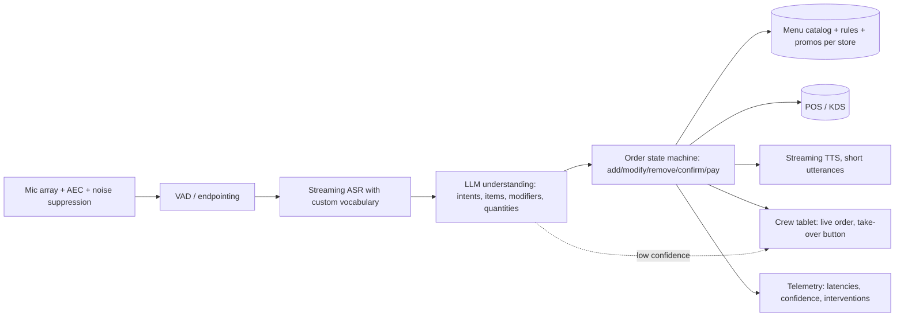

# 41. Conversational AI in depth: Dialogflow CX, and designing a drive-through voice agent

> **The idea:** conversational-AI interviews test two things — whether you can build a bot that is *reliable* (deterministic where it must be) and whether you understand *voice* (latency, noise, turn-taking). Dialogflow CX (built in the Conversational Agents console; since January 2026 part of Gemini Enterprise for Customer Experience, formerly the Customer Engagement Suite, where Customer Experience Agent Studio is its ADK-based evolution and Dialogflow CX is documented as the legacy conversational-agents product) is the reference design surface for the first; a drive-through agent is the canonical case study for the second.

## 41.1 Dialogflow CX: the mental model

Dialogflow CX models a conversation as a **state machine**. The building blocks:

- **Agent** — the top-level bot, with languages, default settings, versions and environments.
- **Flows** — sub-state-machines for topics (Ordering, Payment, Account). Each flow has a Start page.
- **Pages** — states. A page has *entry fulfillment* (what the bot says on arrival), *parameters* to collect (slot filling with required parameters and reprompts), *routes* (transitions), and *event handlers* (no-input, no-match, custom events).
- **Intents** — what the user means, trained from phrases; scoped by which pages/flows reference them (so "yes" means different things on different pages). **Entities** — typed values inside utterances (system entities like dates and numbers; custom entities such as menu items with synonyms; regex and composite entities; session entities injected at runtime for per-store menus).
- **Routes** — transitions triggered by an *intent*, a *condition* on session parameters (`$session.params.total > 50`), or both; a route can have fulfillment (text, rich responses, webhook call) and a target page or flow. **Route groups** reuse routes across pages.
- **Webhooks** — fulfillment calls to your backend (for example a FastAPI service) with the session, intent, parameters and page; the backend returns messages and can set parameters or redirect the conversation — this is where business logic, lookups and transactions live.
- **Session parameters** — the conversation's memory; collected parameters are filled by NLU and validated by the page's rules.
- **Generative features** — *generators* (LLM prompts inside fulfillment for summarization or rephrasing), *data stores* (RAG over websites, documents and FAQs with grounding and citations), *playbooks* (goal-driven LLM agents with instructions, examples and tools that can be invoked from flows and can hand back), and generative fallback for no-match cases.
- **Testing and operations** — test cases with golden transcripts, versions and environments (draft/staging/prod), CI through the API, conversation history and analytics (intent coverage, fallback rate, flow drop-off), *Agent Assist* and *Customer Experience Insights* (formerly Conversational Insights) for human agents, and built-in telephony (CES telephony, in the old naming) or partners with Google STT/TTS, DTMF, barge-in and SIP integrations.

**Why the state machine matters.** Transactions (identity checks, orders, payments) need guaranteed paths, auditable prompts and testable transitions; an LLM alone cannot promise them. Dialogflow CX gives you both: flows for the rails, playbooks and data stores for the open parts.

**Design tips interviewers appreciate.** Keep flows small and reusable; use route groups for global intents (cancel, agent, repeat); validate parameters in webhooks, not only with entity types; design no-match/no-input escalation ladders (rephrase → offer options → human); inject session entities for dynamic catalogs; version and test every change; log webhook latency (it is in the user's turn budget); define a handoff payload (summary + parameters) for human agents.

**The chat-layer example from the reference resume.** A conversational layer for a creative platform: flows and pages for navigation, project actions and account tasks; intents and entities for commands; webhook fulfillment to the FastAPI backend that triggered the agentic workflows and returned results into the conversation; generative fallback for open requests. The lesson: deterministic UX for things users expect to be exact, LLM for the rest, one backend behind both.

### Critic's additions: a CX design page by page, the five numbers to quote, and five follow-ups

"Explain how you would build X in Dialogflow CX" is answered page by page, not with the building-block list. For a voice ordering agent:

| Element | Design | Why |
|---|---|---|
| Flow `Order`, page `Greeting` | entry fulfillment with a short greeting and the store's daypart from a session parameter set by the channel | no model call on the first turn; the store id comes from the device, never from speech |
| Page `TakeOrder` | invokes a playbook (or, in CX Agent Studio, an LLM agent) whose only tool emits structured order operations against the store's catalog; a session entity per store and daypart holds the item ids and synonyms | open language in, structured operations out |
| Webhook `apply_operations` (tag on the fulfillment) | validates each operation against the catalog and caps, updates the order in session parameters, returns the read-back text | business rules in code, inside the 5-second default timeout |
| Page `Confirm` | explicit yes/no with `confirm.yes` and `confirm.no` scoped to this page only; no-match ladder of rephrase, options, crew | money is committed only here |
| Route group `Global` on the flow | `agent` (crew handoff), `cancel`, `repeat`, `start over` | global intents without scope collisions |
| Event handlers | `sys.no-match-1` and `-2` rephrase, `-3` hands off; `sys.no-input-1` prompts; `webhook.error` and `webhook.error.timeout` say "one moment" and hand off on a repeat | never silence, never a loop |
| Handoff | a custom payload to the crew tablet with the partial order, the last utterance and the reason code | the crew does not restart the order |

**Five numbers to quote (current published limits; the full list is in 39c.1).** Webhook timeout 5 seconds by default and 30 at most, with one retry on transient failure; sessions expire 30 minutes after the last request; 20 parameters per page; audio input up to 120 seconds per request; and the runtime quota of 600 audio requests per minute per project — which a 500-store drive-through at lunch exceeds (500 lanes with a request every few seconds is several thousand a minute), so quota increases are a launch task, not a surprise.

**Five follow-ups.**
- *"Why a playbook only on `TakeOrder`?"* — It is the only page where the language is open; everywhere else the expected answers are a small closed set, where intents are cheaper, faster and testable with golden transcripts.
- *"How do you keep the session entity in sync with the menu?"* — The POS or menu service publishes changes; a job regenerates the per-store, per-daypart entity and the catalog the webhook validates against from the same source, with a version number in a session parameter so a mid-order daypart change is detectable.
- *"How do you test it?"* — Golden test cases per page through the API in CI (including "yes" on pages where it must not transition), simulated voice runs from recorded audio for the playbook, and a nightly regression on the audio corpus.
- *"What would change in CX Agent Studio?"* — The `TakeOrder` playbook becomes an LLM agent with the same tool, `Confirm` and payment stay a flow-based agent, the webhook's cheap checks can move to a `before_tool_callback`, and the voice path gains bidirectional streaming and asynchronous tool calls.
- *"Where do you log, and what do you redact?"* — Conversation history and webhook logs to BigQuery with the session id; no payment or personal data is collected, so redaction is limited to free text that might contain a name; retention is set by policy, and signage tells customers the lane is AI-assisted.

## 41.2 Amazon Lex and Connect in the same frame

Lex V2 mirrors the vocabulary (intents, slots, slot types, fulfillment via Lambda, dialog code hooks, conversation logs) with generative additions (assisted NLU, QnAIntent over Bedrock Knowledge Bases, descriptive bot builder); Amazon Connect supplies telephony, routing, chat, the agent workspace, Contact Lens analytics, Amazon Q in Connect, and now Nova Sonic speech-to-speech for natural voice self-service. Microsoft's Copilot Studio uses *topics* (deterministic) plus generative orchestration, with voice through Dynamics 365 Contact Center. Rasa's CALM uses *flows* with an LLM mapping utterances to flow steps. The pattern is the same everywhere: rails plus generation.

### Critic's additions: the same layers across the three clouds, with 2026 names

| Layer | Google Cloud | AWS | Microsoft |
|---|---|---|---|
| Deterministic rails | Dialogflow CX flows and pages; flow-based agents inside CX Agent Studio | Lex V2 intents, slots and dialog code hooks; Amazon Connect contact flows | Copilot Studio topics |
| Generative agent | CX Agent Studio LLM agents (ADK-based); Dialogflow CX playbooks; ADK agents on Agent Runtime | Lex generative features; agents on Bedrock and AgentCore; Amazon Q in Connect | Copilot Studio generative orchestration; Foundry Agent Service in Microsoft Foundry (formerly Azure AI Foundry) |
| Speech-to-speech | Gemini Live API | Nova Sonic | Voice Live, connected to Foundry agents |
| Contact center | Google Cloud CCaaS and partners (Twilio, AudioCodes, Five9 and others) | Amazon Connect | Dynamics 365 Contact Center |
| Assist and analytics for human agents | Agent Assist, Customer Experience Insights (formerly Conversational Insights) | Contact Lens, Amazon Q in Connect | Copilot and analytics in Dynamics 365 Contact Center |
| Umbrella name in 2026 | Gemini Enterprise for Customer Experience | Amazon Connect | Dynamics 365 Contact Center |

Say the mapping once if the interviewer comes from another cloud; then answer in Google's terms.

## 41.3 Voice fundamentals

- **Latency budget.** Humans tolerate ~800 ms of silence before a reply feels slow. The chain is: endpointing (detecting the user finished, 200–400 ms) → ASR final transcript → LLM first token → TTS first audio. Streaming at every stage and speculative processing (start the LLM on partial transcripts) are mandatory; speech-to-speech models collapse the chain to one step with first audio in a few hundred milliseconds.
- **Barge-in and turn-taking.** Users interrupt; the system must stop speaking, keep context, and resume correctly. Voice activity detection, echo cancellation and interruption handling are table stakes (LiveKit, Pipecat, Twilio ConversationRelay, the Gemini Live / OpenAI Realtime APIs handle these).
- **Noise and accents.** Directional microphones, noise suppression, domain-adapted ASR (custom vocabulary, boosted phrases), and confirmation strategies for low-confidence recognitions.
- **Grounding and constraints.** Voice bots must never free-form prices or availability; they call tools and read results; menus and catalogs are entities.
- **Persona and brevity.** Short utterances, explicit confirmations for money, consistent voice; TTS style controls.
- **Observability.** Per-turn latencies for each stage, ASR confidence, interruption counts, fallback and escalation rates, recordings for QA, judge sampling on transcripts.

### Critic's additions: the settings and numbers behind each fundamental (Google Cloud, checked October 2026)

**Gemini Live API (speech-to-speech).** Input audio is 16-bit PCM at 16 kHz and output audio is 24 kHz. Voice activity detection is configured under `automatic_activity_detection` with `start_of_speech_sensitivity`, `end_of_speech_sensitivity`, `prefix_padding_ms` and `silence_duration_ms` (Google suggests 500–800 ms for silence as the balance between latency and cutting people off). When the user barges in, the server marks the generation `interrupted`, and only what was already sent to the client stays in the session history — so the order state must be updated from confirmed operations, not from what the model intended to say. Turn on `input_audio_transcription` and `output_audio_transcription` so every turn has text to log, judge and screen (Model Armor does not screen audio). Audio-only sessions are limited to 15 minutes without context-window compression, a connection lives about 10 minutes (the server sends `GoAway` with the time left), and session-resumption handles stay valid for two hours; `contextWindowCompression` with a sliding window and a trigger token count keeps long sessions bounded. Audio is about 32 tokens per second, and the accumulated session context is billed again on every turn, so cost grows with the number of turns.

**Chirp 3 (cascaded recognition).** Model id `chirp_3`; `StreamingRecognize` for live audio; up to 1,000 phrases for speech adaptation (menu items, brand names); a built-in denoiser that, per the documentation, cannot remove background human voices; automatic language detection; speaker diarization only in non-streaming recognition; word-level confidence values that the documentation says are not true confidence scores; general availability in the `us` and `eu` multi-regions. Price: $0.016 per minute for the first 500,000 minutes a month, falling to $0.004 above two million.

**Text-to-speech.** Chirp 3 HD voices at $30 per million characters (the first million free each month); Gemini TTS models priced per text and audio token for expressive, steerable speech; pre-synthesize the twenty most common phrases ("Anything else?", "Please pull forward") as cached audio so they cost nothing and start instantly.

**Latency budget from the end of the customer's speech (cascaded).**

| Stage | Budget | Lever |
|---|---|---|
| End-of-speech detection | 300–500 ms | shorter silence threshold on yes/no and quantity prompts, longer on open questions |
| Final transcript | 100–200 ms | streaming recognition; start understanding on stable partials |
| Model to first structured token | 250–400 ms | Flash tier, `minimal` thinking, cached menu prefix, a small response schema |
| State machine and price lookup | 20–50 ms | prices cached at the store edge from the POS |
| First audio | 150–250 ms, or 0 for pre-synthesized phrases | streaming synthesis |
| Total | about 0.8–1.4 s before mitigations | the requirement (first response under one second at p95) is met only with speculative understanding on stable partials and pre-synthesized phrases; measure per store and daypart |

## 41.4 Case study: a drive-through voice ordering agent

**Context (2026).** Large chains have piloted and scaled voice ordering with mixed results: McDonald's ended a multi-year IBM pilot in 2024; Wendy's keeps refining FreshAI with Google; Taco Bell/Yum has run the system at hundreds of locations and processed millions of orders while reassessing after viral failures (the "18,000 waters" prank); vendors such as SoundHound, Presto and Hi Auto serve other chains. The failure modes are known: noise (engines, wind), accents and dialects, complex customizations, pranks, compounding errors instead of recovery, and upsell that annoys. Any design must answer those.

**Requirements.** 95%+ order accuracy; first response under 1 s; handle interruptions; menu with 200 items and modifiers that change by store and daypart; promotions; handoff to crew when confidence is low or the customer asks; POS integration; works in rain and with trucks idling.

**Architecture.**



- **Audio front end:** directional mics, acoustic echo cancellation (the speaker is next to the mic), noise suppression tuned for engine and wind; VAD with endpointing tuned short.
- **ASR:** streaming, with boosted vocabulary for menu items and brand names; alternatives (n-best) passed to understanding; confidence per segment.
- **Understanding:** an LLM (small, fast, possibly fine-tuned) maps transcripts to structured order operations constrained by the catalog — item ids, sizes, modifiers, quantities, with entity resolution ("number two meal", "the spicy one"); ambiguity returns a clarification request, never a guess. A speech-to-speech model can replace ASR+LLM+TTS for naturalness, but the order operations must still be structured and validated.
- **Order state machine:** deterministic; validates against the catalog and rules (sizes available, max quantities — the prank guard), applies promotions, tracks totals, handles corrections ("no, make that two") by referring to the last operation, and requires an explicit confirmation before sending to the POS.
- **TTS:** streaming, short confirmations ("Two spicy chicken sandwiches, one large fries. Anything else?"), consistent voice, no long upsell monologues; upsell only once, from a rules-based list.
- **Crew in the loop:** a tablet shows the live order; crew can take over any time; the agent hands off on low confidence, three failed clarifications, non-order speech, or when the customer asks; the handoff carries the partial order.
- **POS/KDS integration:** idempotent order creation, price from POS, timeouts with graceful fallback to crew.
- **Guardrails:** quantity caps, allergen questions routed to humans, no free-form pricing, profanity handling, no personal-data collection.
- **Evaluation:** a corpus of real and simulated audio (accents, noise levels, interruptions, pranks) with gold orders; metrics: order accuracy (exact match of the structured order), completion without crew, latency per stage, interruption recovery, false-confirmation rate; shadow mode at new stores before go-live; A/B by store.
- **Operations:** per-store menu/promotion sync, daypart changes, monitoring dashboards, recording retention policy, model updates with regression runs on the audio corpus, a kill switch to crew-only.

**Numbers to carry.** Latency budget: VAD 300 ms + ASR final 200 ms + LLM first token 250 ms + TTS first audio 150 ms ≈ 900 ms, which is why streaming and speculative understanding on partial transcripts matter; per-order cost of a few cents in model calls versus labor minutes saved; accuracy measured on structured orders, not transcripts.

**What to say about the failures in the news.** Compounding errors come from state machines that do not model corrections; prank orders come from missing quantity caps and sanity rules; noise failures come from the audio front end, not the model; and "mixed results" usually means the crew-handoff and the measurement were designed last. Design them first.

### Critic's additions: the operation schema, the state-machine rules, cost per order on current list prices, the evaluation corpus, privacy, and six follow-ups

**The 2026 product context in one line.** Google Cloud put an enhanced Food Ordering agent into Gemini Enterprise for Customer Experience in January 2026, citing its drive-thru work with fast-food chains; a custom build is justified only where that agent does not fit the chain's menu, POS or measurement (39c.2 has the decision table).

**The contract between the model and the state machine.** The model never holds the order; it emits operations against catalog ids, constrained by a response schema whose item and modifier enums are generated per store and daypart:

```json
{
  "addressed_to_order_point": true,
  "operations": [
    {"op": "add", "item_id": "SPICY_CHICKEN_SANDWICH", "size": null, "quantity": 2,
     "modifiers": ["NO_PICKLES"]},
    {"op": "add", "item_id": "FRIES", "size": "LARGE", "quantity": 1, "modifiers": []},
    {"op": "set_quantity", "target": "last", "quantity": 2}
  ],
  "clarification": null
}
```

The operation set is closed (`add`, `modify`, `remove`, `set_quantity`, `confirm`, `cancel_order`, `handoff`); `target` resolves references ("make that two", "the first one") to a line id; anything the model cannot map becomes a `clarification` with one question, never a guess. There is no price field: prices and totals come from the POS.

**State-machine rules worth stating with numbers.** A per-item quantity cap (for example 10) and an order cap (for example 30 items or a currency ceiling), above which the order goes to the crew; a modifier must be valid for its item; promotions are applied by the POS, not the model; at most one clarification per item and two per order before handoff; read-back of the full order before `confirm`; a `confirm` only on an explicit yes on the confirmation step; idempotent submission to the POS with an order key.

**Cost per order on current list prices (napkin math; check the pricing pages).** Assumptions: about 90 seconds of lane audio, 8 model turns, an 8,000-token menu-and-instructions prefix, 1,000 other input tokens and 150 output tokens per turn, about 500 characters of agent speech.

| Path | Arithmetic | Per order |
|---|---|---|
| Cascaded: Chirp 3 + Gemini 3.8 Flash + Chirp 3 HD | recognition 1.5 min × $0.016 = $0.024; model 8 × (8,000 × $0.075 + 1,000 × $0.75 + 150 × $3.75) per million ≈ $0.015; speech 500 × $30 per million = $0.015 | ≈ $0.054 at list; ≈ $0.04 once recognition volume reaches the lower tiers (a fleet at 150,000 orders a day streams millions of minutes a month) |
| Speech-to-speech, menu in the session prompt | 8 turns × 8,000 text tokens × $0.75 ≈ $0.048; accumulated audio context ≈ 8 × 1,200 tokens × $3.00 ≈ $0.029; agent audio out ≈ 1,100 tokens × $12.00 ≈ $0.013 (all per million) | ≈ $0.09 |
| Speech-to-speech, menu behind a catalog tool | text context ≈ 8 × 2,700 tokens × $0.75 per million ≈ $0.016, audio as above | ≈ $0.06 |

Three things to say about the table: the model is a few cents per order either way, so accuracy and crew interventions decide the business case, not tokens; the Live path is cheaper when the menu lives behind a tool, because the session context is re-billed on every turn; and the Flash introductory price ends on 31 December 2026, which roughly doubles the model line from January 2027.

**The evaluation corpus.** At least 2,000 recorded orders with gold structured orders, stratified by noise (idle engine, rain, wind, music), accent groups, order complexity (one item; three to five; six or more with modifiers), interruptions and corrections, plus about 10% adversarial cases (pranks, off-topic speech, profanity, a passenger talking). 1,825 orders measure 95% accuracy within ±1 point; a cell of 230 orders (one accent at one noise level) only within about ±3 points, so report cells with their intervals and gate on the worst cell, not only the mean. Re-run the whole corpus on every model, prompt, menu-schema or audio-front-end change.

**Privacy and legal.** Do not identify speakers or keep voiceprints: biometric privacy laws such as Illinois's BIPA have produced lawsuits over drive-through voice AI. Post signage that ordering is AI-assisted, keep recordings only for a defined QA window, restrict access to them, and collect no payment or personal data in the voice channel.

**Six follow-ups.**
- *"Why not let the model keep the order in its context?"* — Context is not state: corrections, caps, prices and promotions need deterministic validation, and an order you can replay operation by operation is an order you can test and audit.
- *"'Make it a large' after three items — which one?"* — The most recent sizeable item unless the last utterance mentioned two, in which case one clarifying question; the resolution is logged as an operation with its `target`.
- *"Latency doubles at the lunch peak."* — Regional endpoints near the stores, Provisioned Throughput sized to the lunch peak in tokens per second with Priority spill-over for the order path, pre-synthesized phrases, `minimal` thinking, and p95 tracked per store and daypart so the peak is visible, not averaged away.
- *"Wind noise defeats the recognizer."* — Fix it upstream: windscreens and microphone placement, echo cancellation and noise suppression at the edge, speech adaptation for menu terms; after two empty or garbled recognitions, hand off.
- *"How do you stop the agent from quoting a wrong price?"* — It cannot: the schema has no price field, the total is read from the POS, and the speech for totals is templated.
- *"What do you hand the crew when you hand off?"* — The partial order on the tablet, the last utterance, and the reason code (low confidence, cap exceeded, allergen question, customer asked), so the crew continues rather than restarts.

## 41.5 Other voice-agent cases to be ready for

Appointment scheduling for clinics (identity verification, calendar tools, HIPAA), outbound collections or renewals (compliance scripts, consent, recording laws), IT helpdesk password resets (identity, MFA, handoff), and in-car assistants (offline fallback, safety). Same skeleton: rails for the exact parts, generation for understanding, tools for facts, humans one turn away.

### Critic's additions: the one constraint per case that an interviewer expects you to name

| Case | The constraint that shapes the design | What it forces |
|---|---|---|
| Clinic scheduling | health data under HIPAA in the US: a business associate agreement with the cloud provider, minimum necessary data | identity verification in a deterministic flow (date of birth plus a second factor), no clinical advice, transcripts treated as protected health information with retention and access controls |
| Outbound collections or renewals | the FCC's February 2024 ruling that AI-generated voices are "artificial" under the TCPA (prior express consent required for such calls), and for debt collection Regulation F's call-frequency presumption (more than seven attempts in seven days) and calling-hour limits | consent records checked by a tool before dialing, call-frequency counters outside the model, mandatory disclosures as fixed audio, no generated deviations from the approved script |
| Password resets | voice is not an authentication factor; voice cloning makes it weaker every year | the agent verifies through an existing MFA channel (push or one-time code), never resets on knowledge questions alone, and rate-limits attempts per account |
| In-car assistants | intermittent connectivity and driver distraction rules | an on-device fallback for core commands, short prompts, no visual dependence, and deferral of complex tasks until parked |

The interview line: "Before the architecture, I name the rule that would shut this down — consent, identity, health data or safety — and design that path first."
