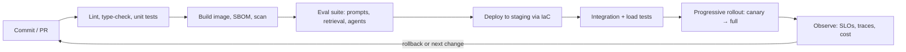

# 45. DevOps and platform engineering for AI teams

> **What you need to be able to say:** what DevOps means as practice (not a team name); the pipeline from commit to production; infrastructure as code; containers and Kubernetes; GitOps; environments and release strategies; the SRE vocabulary; and how all of it changes for LLM systems and GPUs. Go deeper: Part 6 → *Kubernetes complete guide*, *CI/CD pipelines complete guide*, *AWS cloud-native development guide*.

## 45.1 DevOps in one paragraph

DevOps is the practice of making the path from a code change to a running, observed system fast, safe and repeatable: version everything (code, infrastructure, configuration, prompts, models), automate build/test/deploy, run the same artifact through identical environments, observe production, and feed what you learn back into the next change. The DORA metrics measure it: deployment frequency, lead time for changes, change failure rate, time to restore. A **platform team** turns these practices into a product for other engineers — templates, pipelines, clusters, gateways — so that an AI engineer can ship an agent service without becoming a Kubernetes expert.

**Critic's additions: the numbers behind the vocabulary.** Interviewers expect you to know what "good" looks like. DORA's elite benchmarks have been stable for years: deploy on demand (several times a day), lead time for changes under a day, change failure rate around 5% (the 2024 report's elite band; "under 15%" in older reports), and recovery from a failed deployment in under an hour; the 2024 report added *rework rate* (share of deployments that are unplanned fixes) as a fifth signal. The 2025 DORA report found that roughly 90% of technology professionals now use AI in their work and that AI adoption is finally associated with higher throughput, but delivery *instability* keeps rising with it — which is the empirical argument for the eval gates and progressive rollouts in this chapter rather than "ship faster because the agent wrote it". Platform engineering is also the norm, not the exception: about 90% of organizations in the same report run an internal platform and three quarters have a dedicated platform team, so "we have a paved road" is table stakes and the interview question is how good it is (adoption rate, time-to-first-deploy for a new service, number of exceptions).

## 45.2 From commit to production

- **Source control and branching:** trunk-based development with short-lived branches; PR reviews; conventional commits; protected main; secrets never committed (pre-commit hooks, gitleaks).
- **CI:** GitHub Actions / GitLab CI / Azure Pipelines / CodeBuild / Cloud Build; jobs for lint (ruff), types (mypy/pyright), tests (pytest), security scans (Trivy, Snyk, Bandit), container build with cache, SBOM generation (Syft), image signing (cosign/Sigstore) with admission policies (Kyverno/Gatekeeper) that refuse unsigned images, and provenance attestations (SLSA levels); **eval gates** for LLM apps (promptfoo/DeepEval/Inspect/LangSmith) run on every change to prompts, tools, retrieval or models and block regressions.
- **Artifacts:** immutable images in a registry (ECR/ACR/Artifact Registry/GHCR), referenced by digest rather than mutable tag; model and prompt versions in registries (MLflow, Unity Catalog, Langfuse/LangSmith prompt registries).
- **CD:** push-based (pipeline applies IaC and deploys) or **GitOps** pull-based (Argo CD/Flux reconcile the cluster to a git repo); environment promotion by changing a manifest, never by hand.
- **Environments:** dev → staging → prod with separate accounts/projects, keys, data (synthetic or masked in non-prod), and model quotas; ephemeral preview environments per PR for UI changes.
- **Release strategies:** rolling, blue/green (two full stacks, switch), canary (small slice with metric gates), feature flags (LaunchDarkly/Statsig/Unleash) for model and prompt routing, dark launches/shadow mode for new models.

**Critic's additions: how a canary gate actually works.** "Canary with metric gates" is only an answer if you can describe the mechanism. With Argo Rollouts or Flagger the rollout object declares steps (for example 5% for 10 minutes, then 25%, 50%, 100%) and an *analysis template* that queries Prometheus or the tracing backend at each step; if any metric breaches its threshold the rollout is aborted and traffic returns to the stable version automatically. Typical gates for an LLM service: 5xx rate below 1%, p95 latency within budget, cost per request below 1.2 times the stable version, and a quality gate from judge-sampled traces (for example faithfulness at or above 0.95 on at least 200 sampled responses, because a smaller sample cannot distinguish 0.95 from 0.90). Two LLM-specific details: conversational agents need **session affinity** (route by session id so a conversation does not alternate between prompt versions mid-dialogue), and most prompt or routing changes need no new image, so they ride a feature flag with the same gates rather than a container rollout. Rollback of a prompt is a flag flip or a git revert; rollback of a model version is a gateway config change; keep the previous version warm for 24–48 hours in both cases. The eval gate in CI is cheap compared with the alternative: 200 cases times three runs at roughly a cent or two each is a few dollars and five to ten minutes with a concurrency of twenty, and prompt caching makes the shared system prompt nearly free across cases.

## 45.3 Infrastructure as code

Terraform/OpenTofu (multi-cloud, state in a locked remote backend, modules, workspaces), Pulumi (code-first), AWS CDK and CloudFormation, Azure Bicep, Google Infrastructure Manager (Terraform-based; Google Cloud Deployment Manager reached end of support on 1 April 2026 and shuts down on 30 June 2027, so it should not appear in a 2026 design); Helm charts and Kustomize for Kubernetes manifests; Ansible for configuration where VMs persist. Rules: everything reproducible from the repo; plan/apply in CI with review; policy as code (OPA/Sentinel/Checkov) for guardrails (no public buckets, required tags, approved regions); tagging for cost allocation (chapter 47); `terraform destroy` as a tested path for labs. Mechanisms interviewers probe: remote state with locking (S3 plus DynamoDB or S3 native locking, Azure Blob lease, GCS) and one state file per environment and component so a bad apply has a small blast radius; `plan` output posted on the PR and an `apply` that runs only from the main branch via OIDC-federated CI credentials; drift detection on a schedule (a plan that is not empty is an alert); module versioning with semantic tags; secrets never in state where avoidable (use data sources and secret managers, and treat state as sensitive because it often contains them anyway). Trade-off: Terraform/OpenTofu for breadth and a shared language across clouds, CDK/Pulumi when the team wants loops, types and tests in a real language, cloud-native (CloudFormation/Bicep) when the organization standardizes on one cloud and wants first-day support for new services.

## 45.4 Containers and Kubernetes

A container packages code and dependencies into an image run by a runtime; Kubernetes schedules containers across nodes with declarative desired state. Vocabulary: Pod, Deployment (stateless replicas), StatefulSet, Job/CronJob, Service (stable endpoint), Gateway API for HTTP routing (the successor to Ingress; the community Ingress NGINX controller was retired in March 2026 with no further releases or security fixes, so new clusters use Gateway API implementations or a vendor-maintained controller), ConfigMap and Secret, Namespace, RBAC, resource requests/limits, liveness/readiness probes, HorizontalPodAutoscaler (and KEDA for event-driven scaling), node pools (CPU, GPU, spot), PersistentVolumes, NetworkPolicies, service mesh (Istio/Linkerd) for mTLS and traffic control. Managed flavors: EKS (with Auto Mode for managed nodes and autoscaling), AKS (with AKS Automatic, generally available since 2025), GKE (Autopilot). Serverless alternatives when you do not need a cluster: Cloud Run (with GPUs since 2025), Azure Container Apps (including serverless GPUs), ECS on Fargate, Lambda/Functions; AWS App Runner stopped accepting new customers in April 2026, so do not propose it for new work.

**GPU and AI specifics:** NVIDIA device plugin and GPU node pools, with Dynamic Resource Allocation (generally available in Kubernetes 1.34, August 2025) replacing the device-plugin model for requesting GPUs and partitions; GPU sharing (MIG, time-slicing), the NVIDIA GPU operator, KServe/Ray Serve/vLLM deployments for model serving, autoscaling on queue depth or tokens per second, priority classes so training jobs do not starve serving, and cost controls (scale to zero, spot for training).

**Critic's additions: GPU numbers and mechanisms interviewers probe.**
- **Why GPU autoscaling is slow.** A GPU node takes 5–10 minutes to provision, a serving image is often 10–20 GB, and a 70B-parameter model in bf16 is about 140 GB of weights that must be pulled and loaded before the first token. The answers are pre-pulled images (a DaemonSet or image streaming), weights on a local NVMe cache or a pre-warmed volume snapshot rather than object storage at startup, a minimum warm replica count during business hours, and scaling on a leading indicator (queue depth, `num_requests_waiting` in vLLM) rather than on GPU utilization, which lags.
- **MIG versus time-slicing.** MIG partitions an A100/H100 into up to seven isolated instances with their own memory — right for many small models with predictable latency; time-slicing shares one GPU without memory isolation — right for bursty dev workloads, wrong for latency SLOs because one tenant can evict another's cache.
- **Utilization.** Unbatched single-request serving leaves most of a GPU idle; continuous batching (vLLM, SGLang, TensorRT-LLM) is what makes a serving GPU busy. Report utilization as tokens per second per GPU against the engine's benchmark, not as the DCGM utilization percentage, which reads high even when the GPU is doing little useful work.
- **Spot for training.** Spot and preemptible GPUs are 60–90% cheaper but can be reclaimed with about two minutes' notice (AWS) and are frequently unavailable for the largest instances; checkpoint every N steps to object storage, make the job resumable, and keep a fallback on-demand pool. Never serve latency-sensitive traffic from spot alone.
- **Priority and quotas.** PriorityClasses let serving preempt training; ResourceQuotas per namespace cap GPU counts per team; a scale-to-zero schedule for non-prod GPU pools at night and weekends routinely saves 60–70% of their cost (chapter 47).

## 45.5 Networking, identity and secrets (the parts that break AI integrations)

VPCs/VNets, subnets, security groups/NSGs, private endpoints for model APIs (Bedrock, Microsoft Foundry, and the Gemini Enterprise Agent Platform, formerly Vertex AI), NAT and egress control (allow-listed domains for agents), load balancers, DNS, TLS termination; IAM roles for workloads (IRSA or EKS Pod Identity on EKS, Workload Identity on GKE, workload identity with managed identities on AKS); secrets managers with rotation and a Kubernetes bridge (External Secrets Operator or the cloud CSI secrets driver, never secrets committed to the GitOps repo unless encrypted with SOPS or Sealed Secrets); OIDC between CI and cloud (no long-lived keys in GitHub). Most "the agent cannot reach X" tickets are network policy or identity, not code.

**Critic's additions: the three tickets you will debug in your first month.** (1) *"The agent times out calling the model."* The pod has no route to the private endpoint: check the VPC endpoint or Private Link exists in that subnet, the security group allows 443 from the node range, DNS resolves to the private address (split-horizon DNS is the usual miss), and the egress proxy allow-list includes the model host. (2) *"403 from the tool API."* Identity, not network: the workload identity has the role but the role lacks the model-level or resource-level permission, or the token audience is wrong; reproduce with the same identity from a debug pod before touching code. (3) *"Works in staging, fails in prod."* Different account, different quota: model quotas (tokens per minute) and private endpoints are per account and region; the fix is a quota request filed early and a checklist that lists quotas as infrastructure. A NAT gateway also quietly bills per gigabyte processed, so heavy model traffic through NAT instead of a private endpoint shows up as a cost anomaly before it shows up as an incident.

## 45.6 SRE vocabulary

**SLI** (a measured indicator: p95 latency, success rate, faithfulness score), **SLO** (the target: 99.5% of requests under 3 s), **error budget** (allowed failure; spend it on releases, freeze when exhausted), **incident management** (severity levels, roles, comms, status page), **post-mortems** (blameless, action items with owners), **runbooks**, **toil** (manual repetitive work to automate), **capacity planning** (tokens per minute, GPU hours, QPS), **chaos and game days**. For AI systems add quality SLOs (judge-sampled), provider dependency SLOs (fallback models), and cost SLOs.

**Critic's additions: the arithmetic and the AI-specific SLIs.** Know the error-budget numbers cold: 99.9% availability allows about 43 minutes of downtime per 30-day month, 99.5% about 3.6 hours, 99% about 7.2 hours; a dependency that is itself 99.9% caps what you can promise unless you have a fallback, which is why the provider SLO and the fallback model belong in the same sentence. Burn-rate alerts replace threshold alerts on raw error rate: the Google SRE workbook's multi-window scheme pages at a burn rate of 14.4 over the last hour or 6 over six hours (2% and 5% of the monthly budget gone) and opens a ticket at 3 over a day or 1 over three days. For an LLM service define SLIs you can actually measure every minute: success rate (non-5xx and non-timeout), time to first token and total p95, guardrail-block rate, fallback rate (share of requests served by the secondary model — rising fallback rate is the earliest sign of a provider incident), tokens per request (a jump means a prompt or context regression), and a sampled quality SLI (judge score on 1–5% of traffic, reported hourly). "Quality" cannot be a per-minute page but it can be a daily SLO with a weekly review.

## 45.7 Change management for prompts, models and indexes

Treat prompts, tool definitions, model versions, retrieval configs and indexes as deployable artifacts: versioned, reviewed, evaluated in CI, rolled out progressively, observable, and reversible. A prompt change is a deploy. A model version bump is a deploy with an eval report attached. An index rebuild is a migration with a shadow period.

**Critic's additions: where to run it — Kubernetes, serverless containers, or a managed agent runtime.** Use the four-column habit from chapter 51.

| Option | What it optimizes | What it costs | When it wins |
|---|---|---|---|
| Kubernetes (EKS/AKS/GKE) with your own serving and agent services | control, GPU scheduling, multi-tenancy, portability | a platform team, upgrades every few months, cluster baseline cost even when idle, YAML surface area | many services, self-hosted models, strict network policies, an existing platform team |
| Serverless containers (Cloud Run, Container Apps, ECS on Fargate) | low ops, scale to zero, per-request billing | cold starts (seconds; worse with large images), limits on long-running connections and GPUs (improving), less control over networking | spiky traffic, few services, no self-hosted models, small teams |
| Managed agent runtime (Bedrock AgentCore, Foundry Agent Service, Google's Agent Runtime — formerly Agent Engine — LangSmith Deployment) | sessions, memory, identity, tool gateway and tracing out of the box | vendor coupling, per-session pricing, less control of the loop, slower to adopt new framework features | an enterprise that wants governance quickly, FDE deployments inside a customer's cloud, teams without platform capacity |
| Functions (Lambda, Azure Functions, Cloud Run functions) | event glue, cheapest at low volume | 15-minute (Lambda) execution limits, cold starts, awkward for streaming | webhooks, schedulers, light tool endpoints |

A common 2026 shape is a managed runtime or serverless containers for the agent loop, Kubernetes only where GPUs or a self-hosted model require it, and functions for glue — and the honest answer to "why Kubernetes?" is "because we already run it well", not "because agents need it".

## 45.8 Example use cases

- **Agent service template.** A platform team ships a cookiecutter: FastAPI service, OTel tracing with GenAI conventions, a LiteLLM gateway client with fallbacks, Helm chart with HPA, GitHub Actions with lint/tests/evals/build/deploy, Argo CD application, dashboards and alerts. Time from `git init` to a traced, evaluated agent in staging: under an hour.
- **Blue/green model migration.** Moving a support agent from one model version to another: shadow traffic for a week, judge comparison, canary 5% with CSAT and cost gates, full rollout, previous version kept warm for 48 h.
- **GPU serving on Kubernetes.** vLLM on a GPU node pool with KEDA scaling on queue length, MIG partitions for small models, priority classes, and a nightly scale-to-zero schedule for non-prod.
- **Secure Bedrock access.** VPC endpoints, IAM roles per service with model-level permissions, CloudTrail audit, egress allow-list — the FDE's first week at a bank.
- **Eval gate in CI.** Every PR touching `prompts/` or `tools/` runs 200 eval cases with judges; a regression beyond 2 points blocks merge; the report is posted on the PR.
- **Incident: provider outage.** Alert on 5xx rate from the model API; automatic fallback to the secondary provider via the gateway; status page updated; post-mortem adds a synthetic probe.

**Critic's additions: more use cases.**
- **Preview environment per PR for an agent.** Each PR gets a namespace with the service, a replay gateway that serves recorded model responses for the eval set (deterministic, free) and a small live budget (for example $2) for manual testing; torn down on merge. Reviewers click a link instead of pulling the branch.
- **Multi-tenant cluster with per-team budgets.** Namespaces per team with ResourceQuotas (CPU, memory, GPU count), NetworkPolicies that default-deny egress, and a gateway virtual key per team with a monthly token budget; the FinOps dashboard reads the same labels.
- **Secrets rotation incident.** A provider API key leaked into a build log; the platform rotates it in the secrets manager, External Secrets propagates it in under a minute, the gateway reloads without restart, and the post-mortem adds a log-masking rule and a gitleaks pre-commit hook — the whole response is under an hour because keys were never baked into images.
- **Gateway API migration.** After the Ingress NGINX retirement the platform team moves forty services from Ingress objects to HTTPRoutes behind a maintained gateway implementation, one namespace at a time, with a canary header route to validate before switching DNS.
- **OIDC trust for CI.** GitHub Actions assumes a cloud role via OIDC with a trust policy limited to one repository and the `main` branch; no long-lived credentials exist in CI, and a token stolen from a PR build cannot deploy to production.
- **GPU pool left running.** A lab's GPU node pool costs $3,000 over a weekend; the fix is a scheduled scale-to-zero, a budget alert on the lab account, and a policy-as-code rule that GPU pools in non-prod must carry an expiry tag.

**Interview line:** *"I treat prompts, models and indexes like code: versioned, tested with evals in CI, deployed progressively with gates, observed, and reversible — on a paved road the platform team owns so product teams ship agents without owning clusters."*
