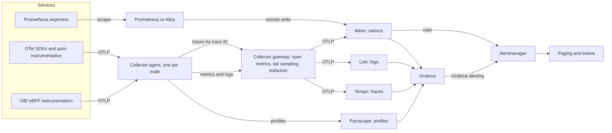

# 45b. The open-source observability stack in depth: OpenTelemetry, Prometheus at scale, PromQL, Grafana, Loki, Tempo and Mimir

> **What you need to be able to say:** the stability status of each OpenTelemetry signal (including profiles), the difference between the API and the SDK, auto, manual and eBPF instrumentation, where context propagation breaks, how each backend maps resource attributes, OTLP settings that matter for Prometheus, and how the Collector is built and deployed (agent and gateway tiers, the load-balancing exporter for tail sampling, one writer per metric series, the Operator); how Prometheus stores and scrapes data, relabels, records, alerts and routes, controls cardinality, ingests native histograms and ships data through remote write to long-term storage; PromQL well enough to write correct queries for RED, USE, SLO burn, saturation, top talkers and cardinality hunting without averaging percentiles or summing before rating; the time-series basics behind them; and what Grafana 13, Loki 3.7, Tempo 3, Mimir 3, Pyroscope and Alloy each do and how they changed in 2025–2026. The chapter ends with two worked investigations and a hands-on lab. Chapter 29b holds the definitions, the OTLP data model and the semantic conventions; chapter 45a the role, SLOs and SLAs; chapter 45c the AI side; chapter 29 telemetry for LLM systems; chapter 33.8 a short PromQL and LogQL primer.

## 45b.1 The map, and what is current in October 2026



| Component | Current release line (October 2026) | What changed recently |
|---|---|---|
| OpenTelemetry specification and OTLP | specification 1.61.0, OTLP 1.11.0, semantic conventions 1.44.0 | Declarative configuration stable (March 2026); profiles in public alpha (March 2026); Kubernetes conventions stable (June 2026) |
| OpenTelemetry Collector | core v1.68.0 / v0.162.0 and contrib v0.162.0 (28–29 September 2026); the configurations below were checked against v0.161.0 | Components renamed to snake_case with deprecated aliases; `k8s_attributes` stable at v1.0.0 (contrib v0.161.0); a queue-based batch processor, `queue_batch`, at development stability since v0.158.0 |
| OpenTelemetry Python | SDK 1.45.0, instrumentation 0.66b0 (25 September 2026) | Requires Python 3.10 or later |
| Prometheus | 3.14.0 (17 August 2026); 3.13 is the long-term-support line (July 2026) | Native histograms stable since 3.8; OTLP receiver; UTF-8 names; duration expressions on by default in 3.14 |
| Grafana | 13.x (13.0 announced 21 April 2026) | Git Sync generally available; dynamic dashboards and the new dashboard schema on by default; Grafana Assistant reachable from OSS and Enterprise through a Grafana Cloud connection |
| Grafana Mimir | 3.2.1 (10 September 2026); 3.0 on 31 October 2025 | Kafka-based ingest storage is the preferred architecture; the Mimir Query Engine is the default |
| Grafana Loki | 3.7 (3.7.0 on 26 March 2026; patch releases through August 2026) | Promtail end of life on 2 March 2026 and removed in 3.7.3; Helm chart handed to a community repository |
| Grafana Tempo | 3.1 (29 September 2026); 3.0 on 28 May 2026 | 3.0 replaced ingesters and the compactor with a Kafka-based write path, live-stores and block-builders, and made TraceQL metrics generally available; 3.1 made vParquet5 the default block format and added arithmetic and sampling-aware extrapolation to TraceQL metrics |
| Grafana Pyroscope | 2.3 | OTLP profiles ingestion; span profiles |
| Grafana Alloy | 1.20 (25 September 2026) | An OpenTelemetry Collector distribution with Prometheus pipelines; an experimental engine that runs upstream Collector YAML |
| OpenTelemetry eBPF Instrumentation (OBI) | v0.13 (4 September 2026; still v0, in development) | Donated by Grafana Labs from Beyla in 2025; first alpha release 3 November 2025 |

Check versions before you quote them; every row above moved at least once in the last twelve months.

## 45b.2 OpenTelemetry

### Signals and their stability

| Signal | Specification status | SDK status (examples) | Notes |
|---|---|---|---|
| Traces | API, SDK and protocol stable | Stable in Java, Go, Python, JavaScript, .NET, C++, PHP, Ruby, Swift, Erlang; beta in Rust; development in Kotlin | The most mature signal |
| Metrics | API and protocol stable; SDK listed as "mixed" | Stable in Java, Go, Python, JavaScript, .NET, C++, PHP; beta in Rust; development in Ruby, Swift, Erlang, Kotlin | Views, exemplars and cardinality limits are SDK features |
| Logs | Bridge API, SDK and protocol stable | Stable in Java, .NET, C++, PHP; release candidate in Go; beta in Rust; development in Python, JavaScript, Ruby, Swift, Erlang, Kotlin | Logs are mostly bridged from existing logging libraries, not written through a new API |
| Baggage | Stable | Stable where implemented | Propagated context, not telemetry |
| Profiles | Public alpha since 26 March 2026; the OTLP profiles messages are still in a development package (`v1development`) | Development in Java | The project says not to use it for critical production workloads yet; the Collector has a pprof receiver, Kubernetes metadata and OTTL support for profiles, and the eBPF profiler runs as a Collector receiver |
| Events | Not a separate signal: a log record that carries an event name (29b.3.4) | Varies | Used by the GenAI conventions for content (chapter 29) |

**Declarative configuration** became stable on 5 March 2026: an SDK can be configured from one YAML file named in `OTEL_CONFIG_FILE` instead of dozens of environment variables. C++, Go, Java, JavaScript and PHP implement it; .NET and Python were in progress at the time of writing, and the project now asks new features to be "declarative configuration first".

### API versus SDK

The **API** is the set of interfaces that libraries call to create spans, record measurements and read context. Without an SDK installed, every API call is a no-op, so a library can depend on the API safely. The **SDK** is what an application installs: tracer, meter and logger providers, span processors, samplers, metric readers, views, exporters and the resource. Rule of thumb: libraries depend on the API only; applications configure the SDK once at startup.

### Auto, manual and eBPF instrumentation

| Approach | How it works | Strengths | Limits |
|---|---|---|---|
| Auto (zero-code) | Language agents patch frameworks and clients at load time: the Java agent, Python's `opentelemetry-instrument`, Node's auto-instrumentation register hook, .NET automatic instrumentation | HTTP, gRPC, database and messaging spans and metrics in minutes; consistent conventions | No business context; version-sensitive patching; startup cost; misses custom protocols |
| Manual | Code calls the API: business spans, attributes such as order value or tenant tier, custom metrics | Captures what matters to the business and to SLOs | Engineering effort; inconsistent naming unless reviewed |
| eBPF (OBI) | A separate process attaches eBPF probes to executables and the kernel network stack and emits spans and RED metrics for HTTP, HTTP/2, gRPC, SQL, Redis, MongoDB, Kafka, MQTT, GraphQL and Elasticsearch/OpenSearch traffic | No code change, no restart, any language | No in-process business context; Linux only; still a v0 project with breaking changes between minor releases |

Production services usually combine the first two, and eBPF covers what you cannot change (third-party binaries, legacy services).

A manual metrics setup in Python that also controls cardinality with a View (OpenTelemetry Python SDK 1.45):

```python
# telemetry.py: configure the metrics SDK once at startup (opentelemetry-sdk 1.45, Python 3.10+).
from opentelemetry import metrics
from opentelemetry.exporter.otlp.proto.http.metric_exporter import OTLPMetricExporter
from opentelemetry.sdk.metrics import MeterProvider
from opentelemetry.sdk.metrics.export import PeriodicExportingMetricReader
from opentelemetry.sdk.metrics.view import View
from opentelemetry.sdk.resources import Resource

resource = Resource.create({"service.name": "checkout", "service.namespace": "shop"})
reader = PeriodicExportingMetricReader(OTLPMetricExporter())  # endpoint from OTEL_EXPORTER_OTLP_ENDPOINT
views = [
    # Keep only bounded attributes on the latency histogram; anything else a library adds is dropped.
    View(
        instrument_name="http.server.request.duration",
        attribute_keys={"http.request.method", "http.route", "http.response.status_code"},
    ),
]
metrics.set_meter_provider(MeterProvider(resource=resource, metric_readers=[reader], views=views))
```

The SDK's default cardinality limit (2,000 attribute sets per metric, then one overflow series; 29b.3.3) is a backstop that not every language implements yet; the View allow-list is the control you rely on.

### Context propagation

The header formats (`traceparent`, `tracestate`, `baggage`) and their flags are defined in 29b.2. Operationally: the SDK default propagators are `tracecontext,baggage`, and B3 is needed only for legacy Zipkin peers. Baggage reaches every downstream service, third parties included, so it never carries secrets or personal data, and it appears on spans only if a baggage span processor copies it there.

Propagation breaks in predictable places: message queues (inject the context into message headers on produce, extract on consume, and use span links when one consumer span processes a batch from many producers), thread pools and async callbacks that lose the current context, proxies and API gateways that strip unknown headers, serverless triggers, scheduled jobs, and calls to tools and model APIs (chapter 29 covers MCP's `_meta` field). The symptom is always the same: traces that end at a boundary and new root spans that start on the other side. Track the share of broken traces as a platform metric (chapter 45a).

### Resource attributes and semantic conventions

Which resource attributes to set, and how stable each is, is in 29b.3.6. In short: set `service.name`, `service.namespace`, `service.version`, `service.instance.id` and `deployment.environment.name` in the SDK (`OTEL_SERVICE_NAME`, `OTEL_RESOURCE_ATTRIBUTES`), and let the Collector's `k8s_attributes` and `resource_detection` processors add infrastructure attributes. What matters here is how each backend maps them:

- **Prometheus and Mimir (OTLP ingestion):** `job` becomes `service.namespace/service.name`, `instance` becomes `service.instance.id`, and every other resource attribute goes only to a separate `target_info` series, so it neither filters nor distinguishes series. Promote the few you filter on (`promote_resource_attributes` in Prometheus; `-distributor.otel-promote-resource-attributes` in Mimir, experimental) or join `target_info` in PromQL (45b.4). Prometheus as the OTLP backend also needs `--web.enable-otlp-receiver` and an out-of-order window (`out_of_order_time_window` under `storage.tsdb`; the Prometheus guide suggests 30 minutes), because batched and retried pushes arrive late.
- **Loki (OTLP ingestion):** a fixed list of resource attributes becomes index labels by default (`service.name`, `service.namespace`, `service.instance.id`, `deployment.environment.name`, `cloud.region`, `cloud.availability_zone`, `container.name`, `k8s.cluster.name`, `k8s.namespace.name`, `k8s.pod.name` and the Kubernetes workload names); everything else, including all log-record attributes, becomes structured metadata. Dots become underscores in label names (`service_name`).
- **Tempo:** resource attributes stay queryable as `resource.*` in TraceQL.

**Semantic conventions** (29b.3.7) change under you: HTTP has been stable since v1.23.0 (2023), Kubernetes since v1.42.0 (June 2026), and GenAI is still in development (chapter 29). Pin the convention version each instrumentation emits and translate at the Collector when versions differ (45a.2 covers migrations).

### OTLP

Ports, paths, encodings and retry rules are in 29b.2 and 29b.3. One trap at first setup: the specification's default protocol for SDK exporters is `http/protobuf` on port 4318, but some SDKs and agents still default to gRPC on 4317 (the Operator's Node.js agent, for example), and a protocol or port mismatch fails quietly. Two metric settings matter when the backend is Prometheus-compatible:

- **Temporality.** `OTEL_EXPORTER_OTLP_METRICS_TEMPORALITY_PREFERENCE` defaults to `cumulative`, which Prometheus expects; `delta` and `lowmemory` exist for backends that prefer deltas. Prometheus ingests deltas only behind feature flags (`otlp-deltatocumulative` or `otlp-native-delta-ingestion`); otherwise convert them in the Collector with the `deltatocumulative` processor.
- **Histogram aggregation.** `OTEL_EXPORTER_OTLP_METRICS_DEFAULT_HISTOGRAM_AGGREGATION` defaults to `explicit_bucket_histogram`; `base2_exponential_bucket_histogram` produces exponential histograms that Prometheus stores as native histograms.

### The Collector

The Collector is a pipeline process. **Receivers** take data in (OTLP, Prometheus scraping, host metrics, log files, Kafka); **processors** transform it in order; **exporters** send it out; **connectors** are an exporter of one pipeline and a receiver of another (span metrics from traces, routing by tenant); **extensions** add capabilities outside pipelines (health checks, `pprof`, persistent storage for queues, authentication). A pipeline is a list of receivers, an ordered list of processors and a list of exporters per signal; one receiver can feed several pipelines, and each gets its own copy of the data.

**Distributions.** Core (minimal), contrib (everything), k8s, otlp and ebpf-profiler builds are published by the project; production teams increasingly build their own with the OpenTelemetry Collector Builder (`ocb`) to include only the components they run, which shrinks the attack surface. Grafana Alloy is Grafana Labs' distribution (45b.10).

**The 2026 renames.** During 2026 the Collector renamed many component types to snake_case and kept the old names as deprecated aliases that log a warning: the OTLP HTTP exporter `otlphttp` became `otlp_http` and the OTLP gRPC exporter `otlp` became `otlp_grpc` in v0.144.0, and contrib followed with `k8s_attributes`, `span_metrics`, `load_balancing`, `resource_detection` and `prometheus_remote_write`, among others. Not every component was renamed (the `otlp` receiver and the `deltatocumulative` processor keep their names), and a few renames kept no alias (`dynamic_sampling` became `adaptive_tail_sampling` in v0.160.0 and the old name stopped working). A component's `metadata.yaml` shows its `type` and any `deprecated_type`. Much vendor documentation still shows the old names. The configurations below use the new names and were checked against contrib v0.161.0; on a release from before 2026, use the old names.

| Component | What it does | What to get right |
|---|---|---|
| `memory_limiter` processor | Refuses data when memory crosses a soft limit (hard limit minus spike allowance) and forces garbage collection at the hard limit | Put it first in every pipeline; check every second; set limits below the container limit; refused data becomes retries upstream |
| `batch` processor | Groups data before export (defaults: 8,192 items or 200 ms) | Place it after sampling and filtering. Its intended replacement, `queue_batch` (added in v0.158.0 as `queuebatch`, renamed in v0.162.0), is at development stability and in none of the published distributions yet; exporters can also batch inside their `sending_queue`, so expect this advice to change |
| `k8s_attributes` processor | Adds pod, namespace, workload and node metadata | Needs RBAC to read pods, namespaces and nodes; filter to the local node in an agent; v1.0.0 (September 2026) changed attributes to match the stable Kubernetes conventions |
| `transform` processor | Rewrites data with OTTL statements (`set`, `delete_key`, `replace_pattern`, `keep_keys`, `truncate_all`, `limit`) | Contexts are inferred from paths (`resource.`, `span.`, `log.`); use `error_mode: ignore` so one bad record does not drop a batch |
| `filter` processor | Drops spans, data points or log records matching OTTL conditions | Drop noise (debug logs, health checks) as early as possible |
| `tail_sampling` processor | Buffers whole traces and decides after `decision_wait` (default 30 s, `num_traces` 50,000) using policies: `status_code`, `latency`, `string_attribute`, `numeric_attribute`, `boolean_attribute`, `trace_state`, `probabilistic`, `rate_limiting`, `bytes_limiting`, `span_count`, `ottl_condition`, `and`, `not`, `composite`, `drop` | Every span of a trace must reach the same instance; a `drop` decision wins over any sample decision; the decision cache, which makes late spans follow the earlier decision, is off until you give it a size |
| `span_metrics` connector | Request counts and duration histograms per service, span name, kind and status code (attributes `span.name`, `span.kind`, `status.code`), plus dimensions you choose | Compute it before sampling; set `aggregation_cardinality_limit` (the default, 0, means no limit); set the unit explicitly, because the default is moving from milliseconds to seconds (feature gate `connector.spanmetrics.useSecondAsDefaultMetricsUnit`); by default it labels every series with the Collector's own `collector.instance.id`, so that replicas computing the same series do not collide (below) |
| `load_balancing` exporter | Routes by `traceID`, `service`, `resource`, `metric`, `streamID` or `attributes` to a set of backends found by static, DNS, Kubernetes or AWS Cloud Map resolvers | Uses consistent hashing; when backends change, roughly R/N of routes move, so some traces split during scaling |
| `otlp_grpc` and `otlp_http` exporters | Send OTLP to backends or another Collector | Retries are on by default (5 s initial, 30 s maximum, 300 s total); the sending queue drops data when full unless `block_on_overflow` is set; `storage` makes it persistent |
| `prometheus_remote_write` exporter | Sends metrics with Prometheus remote write | Remote write 2.0 support is still in development behind a feature gate; use 1.0 or OTLP |

**Internal telemetry.** The Collector exposes its own metrics in Prometheus format on port 8888, bound to `127.0.0.1` by default; bind it to `0.0.0.0` to scrape it from outside the pod. Watch `otelcol_receiver_refused_*` (clients are being told to back off), `otelcol_exporter_send_failed_*` and `otelcol_exporter_enqueue_failed_*` (data is being lost), `otelcol_exporter_queue_size` against `otelcol_exporter_queue_capacity` (a slow backend), and processor incoming versus outgoing item counts (what filtering and sampling removed). Depending on version and scrape path, counters may carry a `_total` suffix, which the queries in 45b.4 allow for.

### Deployment patterns

- **Agent** (a DaemonSet, or a sidecar where you cannot run DaemonSets): one Collector per node. Applications send to the node-local agent (`OTEL_EXPORTER_OTLP_ENDPOINT=http://$(HOST_IP):4318`, with `HOST_IP` from the downward API, or a Service with `internalTrafficPolicy: Local`). The agent offloads applications quickly, adds Kubernetes metadata, and reads node logs and host metrics.
- **Gateway** (a Deployment or StatefulSet behind a Service): central processing such as tail sampling, redaction, span metrics, routing to tenants and backends, and egress with credentials held in one place.
- **Two tiers for tail sampling.** Tail sampling needs every span of a trace on one gateway replica, but spans of one trace come from many nodes. So agents export traces through the `load_balancing` exporter with `routing_key: traceID` and a Kubernetes resolver that tracks the gateway's endpoints; metrics and logs can go to any replica. Keep the gateway replica count stable (a StatefulSet or an autoscaler with long stabilization windows), because each scaling event reroutes a share of in-flight traces and splits them.

**Sizing tail sampling.** Traces held ≈ new traces per second × `decision_wait`. A gateway tier receiving 20,000 new traces per second across four replicas holds 5,000 × 30 = 150,000 traces per replica; at 20 spans per trace and roughly 1 KB per span in memory that is about 3 GB per replica, so set `num_traces` to 200,000, give each pod about 6 GB, and set `memory_limiter` to 75% of that. Measure your own span sizes; content-heavy spans (chapter 29) can be ten times larger.

**One writer per series.** Every metric series must have exactly one writer (29b.3.3), and metrics generated inside the Collector break that rule easily. A gateway routed by trace ID sees a slice of every service's spans, so every replica computes the same span-metric series. The span metrics connector keeps them apart with its per-replica `collector.instance.id` label, which multiplies those series by the replica count, churns them whenever a replica restarts with a new ID, and obliges every query to aggregate the label away after `rate`. Two layouts avoid that: compute span metrics in the node agents, where every span of a pod passes through one Collector, or in a separate tier fed by a `load_balancing` exporter with `routing_key: service`. Connectors that mark replicas only with a resource attribute, as `signal_to_metrics` does, collide outright in Prometheus and Mimir, which keep only `job` and `instance` from the resource, unless you promote that attribute to a label (29b.5.4).

### The OpenTelemetry Operator

The Operator manages Collectors and auto-instrumentation on Kubernetes through custom resources. `OpenTelemetryCollector` (API version `v1beta1`) runs a Collector as a Deployment, DaemonSet, StatefulSet or injected sidecar; its **Target Allocator** spreads Prometheus scrape targets (including `ServiceMonitor` and `PodMonitor` objects) across a StatefulSet of Collectors. `Instrumentation` (still `v1alpha1`) describes how to inject language agents, and a pod opts in with an annotation such as `instrumentation.opentelemetry.io/inject-java: "true"` (also `inject-python`, `inject-nodejs`, `inject-dotnet`, `inject-go`).

```yaml
# Operator auto-instrumentation for one namespace. The Java, Python, .NET and Go agents injected by
# the Operator export OTLP over HTTP (port 4318) by default; the Node.js agent uses gRPC (port 4317).
# otel-agent is a Service with internalTrafficPolicy: Local, so each pod reaches the agent on its own
# node (the agent's k8s_attributes cache only knows pods on that node).
apiVersion: opentelemetry.io/v1alpha1
kind: Instrumentation
metadata:
  name: default
  namespace: shop
spec:
  exporter:
    endpoint: http://otel-agent.observability.svc.cluster.local:4318
  propagators: [tracecontext, baggage]
  sampler:
    type: parentbased_traceidratio
    argument: "1"   # keep everything here; the gateway's tail sampling decides what is stored
  nodejs:
    env:
      - name: OTEL_EXPORTER_OTLP_ENDPOINT
        value: http://otel-agent.observability.svc.cluster.local:4317
```

### eBPF zero-code instrumentation: OBI

Grafana Labs donated its Beyla eBPF auto-instrumentation to OpenTelemetry in 2025, where it became **OpenTelemetry eBPF Instrumentation (OBI)**, maintained by contributors from several companies. The first alpha release came on 3 November 2025; at v0.13 (September 2026) the project still describes itself as in development, with breaking changes possible between minor releases. OBI instruments at the protocol level from outside the process, so it needs no code change, restart or new dependency. Beyla continues as Grafana's supported distribution: it imports OBI's code, accepts both `BEYLA_*` and OBI's `OTEL_EBPF_*` environment variables, and adds Grafana-specific features. Use eBPF for coverage of what you cannot instrument, and SDKs for business context and for anything an SLO depends on.

### A realistic Collector pipeline

Two files for OpenTelemetry Collector Contrib v0.161.0: an agent DaemonSet and a gateway. Endpoints use common in-cluster service names and default ports (Mimir 8080, Loki 3100, Tempo OTLP 4317); replace them with yours and add TLS or a service mesh before production. Check each file in CI with `otelcol-contrib validate --config=<file>`, which catches unknown component names and broken pipeline references before a rollout does.

```yaml
# otelcol-agent.yaml: agent tier (DaemonSet), OpenTelemetry Collector Contrib v0.161.0.
extensions:
  health_check:
    endpoint: 0.0.0.0:13133

receivers:
  otlp:
    protocols:
      grpc:
        endpoint: 0.0.0.0:4317
      http:
        endpoint: 0.0.0.0:4318

processors:
  memory_limiter:                 # first in every pipeline
    check_interval: 1s
    limit_percentage: 80
    spike_limit_percentage: 20
  k8s_attributes:
    auth_type: serviceAccount
    filter:
      node_from_env_var: KUBE_NODE_NAME   # set from spec.nodeName with the downward API
    extract:
      metadata:
        - k8s.namespace.name
        - k8s.pod.name
        - k8s.pod.uid
        - k8s.deployment.name
        - k8s.node.name
    pod_association:
      - sources:
          - from: resource_attribute
            name: k8s.pod.ip
      - sources:
          - from: connection
  batch: {}

exporters:
  load_balancing:                 # every span of a trace goes to the same gateway replica
    routing_key: traceID
    protocol:
      otlp:
        tls:
          insecure: true
    resolver:
      k8s:
        service: otel-gateway.observability
        ports: [4317]
  otlp_grpc/gateway:              # metrics and logs can go to any replica
    endpoint: otel-gateway.observability.svc.cluster.local:4317
    tls:
      insecure: true

service:
  extensions: [health_check]
  pipelines:
    traces:
      receivers: [otlp]
      processors: [memory_limiter, k8s_attributes, batch]
      exporters: [load_balancing]
    metrics:
      receivers: [otlp]
      processors: [memory_limiter, k8s_attributes, batch]
      exporters: [otlp_grpc/gateway]
    logs:
      receivers: [otlp]
      processors: [memory_limiter, k8s_attributes, batch]
      exporters: [otlp_grpc/gateway]
```

```yaml
# otelcol-gateway.yaml: gateway tier, OpenTelemetry Collector Contrib v0.161.0.
# Traces arrive grouped by trace ID, so tail sampling sees whole traces. The same OTLP receiver
# feeds two trace pipelines: one turns 100% of spans into RED metrics, the other samples for storage.
extensions:
  health_check:
    endpoint: 0.0.0.0:13133
  file_storage/queue:
    directory: /var/lib/otelcol/queue      # a persistent volume, so queued data survives restarts

receivers:
  otlp:
    protocols:
      grpc:
        endpoint: 0.0.0.0:4317

processors:
  memory_limiter:
    check_interval: 1s
    limit_percentage: 75
    spike_limit_percentage: 15

  transform/normalize:                     # OTTL; contexts are inferred from the paths
    error_mode: ignore
    trace_statements:
      - set(resource.attributes["deployment.environment.name"], resource.attributes["deployment.environment"]) where resource.attributes["deployment.environment.name"] == nil and resource.attributes["deployment.environment"] != nil
      - delete_key(resource.attributes, "deployment.environment")
      - delete_key(span.attributes, "http.request.header.authorization")
      - replace_pattern(span.attributes["url.full"], "token=[^&]+", "token=REDACTED")
    metric_statements:
      - set(resource.attributes["deployment.environment.name"], resource.attributes["deployment.environment"]) where resource.attributes["deployment.environment.name"] == nil and resource.attributes["deployment.environment"] != nil
      - delete_key(resource.attributes, "deployment.environment")
    log_statements:
      - set(resource.attributes["deployment.environment.name"], resource.attributes["deployment.environment"]) where resource.attributes["deployment.environment.name"] == nil and resource.attributes["deployment.environment"] != nil
      - delete_key(resource.attributes, "deployment.environment")
      - replace_pattern(log.body, "(?i)password=\\S+", "password=REDACTED")

  filter/drop-debug-logs:
    error_mode: ignore
    logs:
      log_record:
        - severity_number < SEVERITY_NUMBER_INFO and severity_number != SEVERITY_NUMBER_UNSPECIFIED

  tail_sampling:
    decision_wait: 30s                     # longer than your slowest normal trace
    num_traces: 200000                     # traces held per replica (see the sizing above)
    expected_new_traces_per_sec: 5000
    decision_cache:
      sampled_cache_size: 500000           # late spans follow the decision already made
      non_sampled_cache_size: 500000
    policies:
      - name: drop-probes                  # a drop decision wins over every other policy
        type: drop
        drop:
          drop_sub_policy:
            - name: probe-paths
              type: string_attribute
              string_attribute:
                key: url.path
                values: ["/healthz", "/readyz", "/metrics"]
      - name: errors
        type: status_code
        status_code:
          status_codes: [ERROR]
      - name: slow
        type: latency
        latency:
          threshold_ms: 1000
      - name: enterprise-tenants
        type: string_attribute
        string_attribute:
          key: app.tenant.tier
          values: ["enterprise"]
      - name: baseline
        type: probabilistic
        probabilistic:
          sampling_percentage: 5

  batch:
    send_batch_size: 8192
    timeout: 200ms

connectors:
  span_metrics:                            # RED metrics from every span, computed before sampling
    namespace: traces.span.metrics
    histogram:
      unit: s
      explicit:
        buckets: [5ms, 10ms, 25ms, 50ms, 100ms, 250ms, 500ms, 1s, 2.5s, 5s, 10s]
    dimensions:
      - name: http.request.method
      - name: http.response.status_code
    exemplars:
      enabled: true
    aggregation_cardinality_limit: 5000    # overflow instead of a series explosion
    metrics_flush_interval: 15s

exporters:
  otlp_grpc/tempo:
    endpoint: tempo-distributor.observability.svc.cluster.local:4317
    tls:
      insecure: true
    sending_queue:
      enabled: true
      storage: file_storage/queue
  otlp_http/mimir:
    endpoint: http://mimir-distributor.observability.svc.cluster.local:8080/otlp
    headers:
      X-Scope-OrgID: platform              # Mimir tenant
    sending_queue:
      enabled: true
      storage: file_storage/queue
  otlp_http/loki:
    endpoint: http://loki-distributor.observability.svc.cluster.local:3100/otlp
    headers:
      X-Scope-OrgID: platform              # Loki tenant
    sending_queue:
      enabled: true
      storage: file_storage/queue

service:
  extensions: [health_check, file_storage/queue]
  telemetry:
    metrics:
      readers:
        - pull:
            exporter:
              prometheus:
                host: 0.0.0.0              # default is 127.0.0.1; open it so Prometheus can scrape
                port: 8888
  pipelines:
    traces/metrics:
      receivers: [otlp]
      processors: [memory_limiter, transform/normalize]
      exporters: [span_metrics]
    traces/sampled:
      receivers: [otlp]
      processors: [memory_limiter, transform/normalize, tail_sampling, batch]
      exporters: [otlp_grpc/tempo]
    metrics:
      receivers: [otlp, span_metrics]
      processors: [memory_limiter, transform/normalize, batch]
      exporters: [otlp_http/mimir]
    logs:
      receivers: [otlp]
      processors: [memory_limiter, filter/drop-debug-logs, transform/normalize, batch]
      exporters: [otlp_http/loki]
```

Why it is shaped this way: the memory limiter protects each process before anything else runs; normalization happens before sampling so policies see clean attributes; span metrics see every span, so request rates and error ratios are unbiased even though only a fraction of traces is stored; the filter keeps log records without a severity instead of dropping them; persistent queues ride out a backend restart without losing data; and the Collector's own metrics are exposed for meta-monitoring. In Prometheus the span metrics arrive as `traces_span_metrics_calls_total` and `traces_span_metrics_duration_seconds_*`, labeled `service_name`, `span_name`, `span_kind`, `status_code`, the configured dimensions and `collector_instance_id`. This gateway has several replicas, so rate first and then drop the replica label: `sum without (collector_instance_id) (rate(traces_span_metrics_calls_total[5m]))`.

## 45b.3 Prometheus at scale

### The data model

A **time series** is identified by a metric name and a set of label pairs; each **sample** is a millisecond timestamp with either a float value or a native histogram. The metric types: a **counter** only goes up and resets to zero when the process restarts; a **gauge** goes up and down; a **classic histogram** is a set of cumulative counters, one per bucket (`_bucket` with an `le` label), plus `_sum` and `_count`; a **native histogram** stores all buckets in one series with exponential bucket boundaries; a **summary** computes quantiles in the client, which cannot be aggregated across instances, so prefer histograms for anything you will aggregate. Names follow `snake_case` with a unit suffix and `_total` for counters. Since Prometheus 3, metric and label names may contain any UTF-8 character; such names are written in quotes inside the braces, as in `{"my.metric.name", "service.name"="checkout"}`.

### Storage internals and capacity

Incoming samples go into the **head block** in memory, protected by a **write-ahead log** kept in 128 MB segments (at least three segments, and enough to cover about two hours on busy servers). Every two hours the head is cut into a persistent **block** (chunks, an inverted index of label postings, metadata and tombstones for deletions), and background **compaction** merges blocks up to 10% of the retention period or 31 days. Retention defaults to 15 days; recent 3.x releases moved it into the configuration file (`storage.tsdb.retention.time` and `.size`) and deprecated the command-line flags. Samples compress to 1–2 bytes each on average, so disk ≈ retention seconds × samples per second × bytes per sample: one million active series scraped every 15 seconds is about 66,700 samples per second, or roughly 130 GB for 15 days at 1.5 bytes per sample.

Memory is dominated by active series in the head, their label strings and index, so it scales with cardinality and churn rather than with sample rate. Measure it on your server (`process_resident_memory_bytes / prometheus_tsdb_head_series`) and plan from your own number. One server handles a few million active series with enough memory; beyond that you shard scraping and centralize storage (below).

### The pull model, service discovery and relabeling

Prometheus discovers targets (Kubernetes, Consul, cloud APIs, files, HTTP endpoints), scrapes each target's metrics endpoint every scrape interval, and adds synthetic series per target: `up`, `scrape_duration_seconds`, `scrape_samples_scraped`, `scrape_samples_post_metric_relabeling` and `scrape_series_added`. Pull gives you target health for free (`up == 0`) and central control of load. Push has its place: the Pushgateway for batch jobs that end before a scrape (never for long-running services), OTLP push into the OTLP receiver, and the remote-write receiver. **Agent mode** (`--agent`) runs only discovery, scraping and remote write, with a WAL and no local querying or alerting: the shape to use when a central store does the rest.

**Relabeling** runs at three points. `relabel_configs` rewrite target labels before the scrape, using discovery metadata (`__meta_*`) and special labels (`__address__`, `__metrics_path__`, `__scheme__`, `__param_<name>`); labels that still start with `__` are dropped afterwards, which makes `__tmp_` a safe scratch prefix. `metric_relabel_configs` run on every scraped sample before ingestion (powerful and CPU-hungry). `write_relabel_configs` filter what goes to remote write. The actions are `replace` (the default), `keep`, `drop`, `keepequal`, `dropequal`, `hashmod`, `labelmap`, `labeldrop`, `labelkeep`, `lowercase` and `uppercase`; the defaults are separator `;`, regex `(.*)` and replacement `$1`.

```yaml
# prometheus.yml excerpt (Prometheus 3.14)
global:
  scrape_interval: 15s
  evaluation_interval: 15s
  external_labels:
    cluster: prod-eu-1
    __replica__: prom-a                    # the HA twin says prom-b; Mimir deduplicates on these labels

scrape_configs:
  - job_name: kubernetes-pods
    scrape_native_histograms: true         # ingest native histograms when a target exposes them
    always_scrape_classic_histograms: true # keep classic buckets as well while dashboards migrate
    sample_limit: 50000                    # the whole scrape fails above this: a cardinality fuse
    label_limit: 40
    label_value_length_limit: 512
    kubernetes_sd_configs:
      - role: pod
    relabel_configs:
      # Scrape only pods that opt in.
      - source_labels: [__meta_kubernetes_pod_annotation_prometheus_io_scrape]
        regex: "true"
        action: keep
      # Honor a custom metrics path.
      - source_labels: [__meta_kubernetes_pod_annotation_prometheus_io_path]
        regex: (.+)
        target_label: __metrics_path__
      # Scrape the annotated port instead of every declared container port.
      - source_labels: [__address__, __meta_kubernetes_pod_annotation_prometheus_io_port]
        regex: ([^:]+)(?::\d+)?;(\d+)
        replacement: $1:$2
        target_label: __address__
      # Copy a few bounded labels. Mapping every pod label (labelmap) imports hashes and versions that churn.
      - source_labels: [__meta_kubernetes_namespace]
        target_label: namespace
      - source_labels: [__meta_kubernetes_pod_name]
        target_label: pod
      - source_labels: [__meta_kubernetes_pod_label_app_kubernetes_io_name]
        target_label: app
    metric_relabel_configs:
      # Drop a histogram family nobody queries (example name).
      - source_labels: [__name__]
        regex: legacy_request_latency_seconds_bucket
        action: drop
      # Remove an unbounded label. Safe only if no two series differ by this label alone;
      # otherwise the collapsed series collide and samples are rejected as duplicates.
      - regex: session_id
        action: labeldrop
```

Sharding scrapes across several Prometheus servers uses `hashmod` on the target address, with each server keeping one shard:

```yaml
    relabel_configs:
      - source_labels: [__address__]
        modulus: 4
        target_label: __tmp_shard
        action: hashmod
      - source_labels: [__tmp_shard]
        regex: "2"                         # this server is shard 2 of 4
        action: keep
```

The OpenTelemetry Operator's Target Allocator and Alloy's clustering do the same job automatically for Collectors.

### Recording rules

Recording rules precompute expensive expressions and store the result as a new series. Name them `level:metric:operations`: the aggregation level and labels, the metric name (dropping `_total` after `rate`), and the operations, newest first, such as `job:http_requests:rate5m` or `instance_path:request_failures_per_requests:ratio_rate5m`. Aggregate ratios by summing numerator and denominator separately and dividing; never average a ratio or an average. Record what dashboards and alerts use repeatedly, at the level they use it; recording unaggregated, high-cardinality data doubles the problem. Rules in a group run in order at the group's interval, so a rule can use the output of an earlier rule in the same group; watch `prometheus_rule_evaluation_failures_total` and `prometheus_rule_group_last_duration_seconds` against the interval. Chapter 45a has a complete SLO rule set.

### Alerting rules and Alertmanager

An alerting rule has `alert`, `expr`, an optional `for` (how long the condition must hold before the alert fires; until then it is pending), an optional `keep_firing_for` (keeps it firing after the condition clears, to stop flapping), `labels` and `annotations`, with templating through `$labels`, `$value` and `$externalLabels`. Firing and pending alerts are also stored as `ALERTS` series, which makes alert history queryable. Every setup needs a **watchdog**:

```yaml
- alert: Watchdog
  expr: vector(1)
  labels:
    severity: heartbeat
  annotations:
    summary: "Always firing. An external dead man's switch pages if these notifications stop."
```

**Alertmanager** receives alerts, deduplicates them, groups them, silences and inhibits them, and routes notifications. The routing tree starts at a root route; each child route has matchers, a receiver and its own timing; `continue: true` lets an alert match more than one sibling. Timing defaults are `group_wait` 30 s (wait to collect a group's first alerts), `group_interval` 5 minutes (wait before notifying about new alerts in an existing group) and `repeat_interval` 4 hours (resend an unchanged firing group); `group_by: ['...']` disables grouping. **Inhibition** mutes target alerts while a source alert fires with equal values for the listed labels; **silences** mute by matchers for a period (`amtool silence add alertname=DiskFull cluster=prod-eu-1 --duration=2h --comment="disk swap"`); **time intervals** limit when a route is active or muted. Run Alertmanager as a cluster of replicas and point every Prometheus or ruler at all of them rather than at a load balancer; the replicas deduplicate notifications among themselves.

```yaml
# alertmanager.yml excerpt
route:
  receiver: default-ticket
  group_by: [alertname, cluster, service]
  group_wait: 30s
  group_interval: 5m
  repeat_interval: 4h
  routes:
    - matchers: [severity="heartbeat"]
      receiver: deadmans-switch
      group_wait: 0s
      group_interval: 1m
      repeat_interval: 1m
    - matchers: [severity="page"]
      receiver: oncall-pager
      group_wait: 10s
      repeat_interval: 1h
    - matchers: [severity="ticket"]
      receiver: ticket-queue
      active_time_intervals: [business-hours]

inhibit_rules:
  # While a cluster is unreachable, its other alerts are noise.
  - source_matchers: [alertname="ClusterUnreachable"]
    target_matchers: [severity=~"page|ticket"]
    equal: [cluster]
  # While a service's SLO page fires, hold back its tickets.
  - source_matchers: [severity="page"]
    target_matchers: [severity="ticket"]
    equal: [service]

receivers:
  - name: default-ticket
    webhook_configs:
      - url: http://alert-bridge.observability.svc:8080/ticket
  - name: ticket-queue
    webhook_configs:
      - url: http://alert-bridge.observability.svc:8080/ticket
  - name: oncall-pager
    pagerduty_configs:
      - routing_key: <events-api-v2-integration-key>   # load it from your secret store
  - name: deadmans-switch
    webhook_configs:
      - url: https://heartbeat.example.com/ping/prod-eu-1

time_intervals:
  - name: business-hours
    time_intervals:
      - weekdays: ['monday:friday']
        times:
          - start_time: '09:00'
            end_time: '17:00'
        location: 'America/New_York'
```

### Cardinality management

Cardinality comes from labels with unbounded values, from histograms multiplied by labels, and from churn (45a.2). Find offenders in this order: the TSDB status page (Status, then TSDB Status) or `/api/v1/status/tsdb?limit=20`, which lists series counts by metric name, label-value counts by label name, memory by label name and series counts by label pair; then per-target scrape metadata (`scrape_series_added`, `scrape_samples_post_metric_relabeling`); then targeted PromQL (45b.4). Offline, `promtool tsdb analyze` on a data directory reports the same rankings plus the label pairs with the most churn. Contain them with limits at every layer: per scrape (`sample_limit`, `label_limit`, `label_name_length_limit`, `label_value_length_limit`, `target_limit`), per tenant in Mimir (series per tenant and per metric), in the SDK (Views with attribute allow-lists) and in the Collector (`transform` to delete attributes). Prevent them with a cardinality budget per team, a CI lint that rejects metric attributes such as `user_id`, `request_id`, `email` or raw `url`, and a dashboard of series by team and metric. `labeldrop` is a sharp tool: if two series differ only by the dropped label, they collapse into one series with two writers, and Prometheus rejects the duplicate samples.

### Native histograms

Native histograms have been stable since Prometheus 3.8.0. Scraping them still needs `scrape_native_histograms: true` per scrape configuration (from 3.9 the old feature flag does nothing), sending them over remote write needs `send_native_histograms: true`, and both are planned to default to true in Prometheus 4. A native histogram is one series per label set instead of one per bucket, with exponential buckets whose resolution is set by a schema from -4 to 8 (higher means finer), capped by `native_histogram_bucket_limit` and `native_histogram_min_bucket_factor`; histograms with compatible schemas merge exactly across instances. Queries change: there is no `_bucket` suffix and no `le` label, and functions such as `histogram_quantile`, `histogram_fraction`, `histogram_count`, `histogram_sum`, `histogram_avg` and `histogram_stddev` take the histogram directly. Two migration aids: `always_scrape_classic_histograms` ingests both forms while dashboards move, and `convert_classic_histograms_to_nhcb` turns classic histograms into native histograms with custom buckets (schema -53), which keep the original boundaries but only merge with histograms that share them. OpenTelemetry exponential histograms arrive as native histograms through the OTLP receiver.

### Remote write

Remote write tails the WAL, batches samples into shards per destination, and retries on server errors and throttling with back-off. Because it reads from the WAL, a destination that is down longer than the WAL retains (about two hours) loses data, so alert on lag well before that. The metrics to watch: `prometheus_remote_storage_samples_failed_total` and `..._samples_retried_total`, `prometheus_remote_storage_shards` against `..._shards_desired` (the queue wants more parallelism than it is allowed), and the gap between `prometheus_remote_storage_highest_timestamp_in_seconds` and `prometheus_remote_storage_queue_highest_sent_timestamp_seconds` (seconds behind). Tune `queue_config` (capacity, shards, samples per send, batch deadline) against those metrics, and use `write_relabel_configs` to send only what the central store needs.

**Remote write 2.0** adds string interning (a symbols table), native histograms, exemplars, metadata, created timestamps and response headers that report how much was written. The specification page still marks it experimental, in release-candidate revisions. Prometheus can send it experimentally (`protobuf_message: io.prometheus.write.v2.Request`; metadata also needs the `metadata-wal-records` feature flag), and the Collector's remote-write exporter supports it only partially behind a feature gate, so in 2026 most pipelines still use 1.0 or OTLP.

### HA pairs and deduplication

Run two identical Prometheus replicas that scrape the same targets and differ only in a replica external label. **Mimir** deduplicates at ingestion: the distributor's HA tracker elects one replica per `cluster` label value, accepts samples only from the elected one, answers the other with HTTP 202 and a "replicas did not match" message, and fails over when it has seen nothing from the leader for 30 seconds (the default); it is enabled per tenant (`accept_ha_samples`), and the `cluster` and `__replica__` label names are configurable. **Thanos** deduplicates at query time (the querier's replica-label setting) and can merge replica blocks during compaction (`--deduplication.replica-label`). Both replicas send alerts to every Alertmanager, and Alertmanager deduplicates the notifications.

### Federation versus long-term storage

Federation (`/federate` with `match[]` selectors) lets a global Prometheus pull selected series, ideally aggregated recording-rule output, from many local servers. It works for a few hundred aggregated series per cluster and fails for raw data at scale (large scrapes, timeouts, a single global server). For global views and long retention, use a long-term store:

| | Mimir | Thanos | Cortex | VictoriaMetrics |
|---|---|---|---|---|
| License | AGPL-3.0 | Apache-2.0 | Apache-2.0 (CNCF) | Apache-2.0 (open-source edition) |
| Write path | Remote write or OTLP to distributors; in 3.x preferably through Kafka partitions to ingesters | Sidecars upload Prometheus blocks to object storage, or the Receive component accepts remote write | Remote write to distributors and ingesters | Remote write to `vminsert`, stored by `vmstorage` (cluster) or a single binary |
| Storage | Blocks in object storage | Blocks in object storage | Blocks in object storage | Its own format on local or network disks |
| Downsampling | No (query splitting, sharding and caching instead) | Yes: 5-minute after 40 hours, 1-hour after 10 days | No | Check the edition you run |
| Multi-tenancy | Yes, with per-tenant limits and shuffle sharding | Partial (tenants in Receive) | Yes | Yes in the cluster version |
| Query language | PromQL, executed by the streaming Mimir Query Engine | PromQL across stores, with deduplication | PromQL | MetricsQL, a PromQL-compatible dialect with extensions and some differences |
| Operational shape | Many components; Kafka in the ingest-storage architecture | Sidecars, store gateways, compactor, querier | Similar to Mimir, which forked from Cortex in 2022 | Few components; known for resource efficiency |
| Choose it when | You run a large multi-tenant platform in the Grafana ecosystem | You already run many Prometheus servers and want a global view and cheap retention | You already run Cortex | You want few moving parts at high ingest rates |

### What changed in Prometheus 3

Prometheus 3.0 (November 2024) brought a new UI, UTF-8 metric and label names, an OTLP receiver (`--web.enable-otlp-receiver`, serving `/api/v1/otlp/v1/metrics`), experimental remote write 2.0 and native histograms, and several breaking changes: range selectors and lookback windows became left-open (a sample exactly at the left edge is excluded); `.` in regular expressions now matches newlines; scraped `le` and `quantile` label values are normalized to floats (`le="1.0"`), although the OTLP receiver writes boundaries as given (`le="1"`); `holt_winters` was renamed `double_exponential_smoothing` and moved behind the experimental-functions flag; scrapes fail on a missing or unknown content type unless `fallback_scrape_protocol` is set; remote write no longer uses HTTP/2 by default; Alertmanager's v1 API is no longer supported; agent mode became a flag; and several feature flags became default behavior (the `@` modifier, negative offsets, automatic `GOMEMLIMIT` and `GOMAXPROCS`). The 3.x line since then: native histograms stable in 3.8 and their feature flag a no-op from 3.9; experimental functions that return a range query's start, end, range and step in 3.12; an experimental search API for metric and label names in 3.13 (the long-term-support line, July 2026); duration expressions such as `[5m * 2]` on by default and `first_over_time` stable in 3.14; and retention moved from flags to the configuration file. Experimental work to know by name: start (created) timestamps, `__type__` and `__unit__` labels, delayed `__name__` removal, `anchored` and `smoothed` range-selector modifiers, and `fill()` modifiers for binary operators.

## 45b.4 PromQL in depth

### Instant vectors, range vectors and selectors

An **instant vector** holds one sample per series at the evaluation time: the most recent sample within the lookback window (5 minutes by default). A **range vector** holds every sample per series in the window `(t − range, t]`; the left edge is excluded since Prometheus 3. **Scalars** and strings complete the types. An instant query evaluates once; a range query (what graphs use) evaluates the same expression at every step from start to end.

Matchers are `=`, `!=`, `=~` and `!~`; regular expressions are RE2 and fully anchored (`env=~"prod"` matches only the exact value prod, as if the pattern were wrapped in start and end anchors). A selector needs a metric name or at least one matcher that cannot match the empty string, and `{__name__=~"http_.*"}` selects by name pattern.

### rate, irate, increase and counter resets

`rate(x[5m])` is the per-second average increase over the window, corrected for counter resets (any decrease is treated as a restart from zero) and extrapolated to the window's edges. `increase(x[1h])` is `rate` multiplied by the window in seconds, which is why it returns non-integers. `irate` uses only the last two samples: useful on fast-moving graphs, wrong for alerts and recording rules because it is noisy and ignores everything else in the window. Make the window at least four scrape intervals long (Grafana's `$__rate_interval` is the larger of `$__interval` plus the scrape interval and four scrape intervals).

**Rate first, then aggregate.** `sum(rate(x[5m]))` is correct. `rate(sum(x)[5m:])` is wrong: when one pod restarts, its counter drops to zero, the *sum* drops, `rate` reads that drop as a reset of the whole sum and counts the full remaining total as new increase, and the graph shows a spike that never happened.

### Aggregation

`sum`, `avg`, `min`, `max`, `count`, `group`, `stddev`, `stdvar`, `topk`, `bottomk`, `quantile` (across series, not over time) and `count_values`. `by (labels)` keeps only the listed labels; `without (labels)` drops the listed ones and keeps the rest, which is the safer choice in shared rules because labels such as `cluster` survive.

### Histograms, and why you never average percentiles

For classic histograms, sum the per-bucket rates and keep `le`: `histogram_quantile(0.99, sum by (le, http_route) (rate(x_bucket[5m])))`. For native histograms there is no `le`: `histogram_quantile(0.99, sum by (http_route) (rate(x[5m])))`. Classic estimates interpolate linearly inside a bucket, so the error is bounded by the bucket's width, and a quantile that lands in the `+Inf` bucket returns the upper bound of the highest finite bucket; choose buckets around your SLO thresholds. Never average percentiles: if one pod serves 99% of traffic with a p99 of 100 ms and another serves 1% with a p99 of 2 s, their average p99 is 1.05 s, which is the 99th percentile of no population. The fleet p99 depends on how many requests each pod served and must be computed from merged buckets.

### offset, @ and subqueries

`offset 1w` shifts a selector back in time (negative offsets shift forward). `@ 1767225600`, `@ start()` and `@ end()` pin a selector to an absolute time or to the ends of a range query, which makes a set of top-k series stable across a graph. A **subquery** evaluates an instant expression over a range at a resolution, `max_over_time(sum(rate(x[5m]))[1d:5m])`; its cost is the number of steps (here 288 evaluations), and without an explicit resolution it uses the global evaluation interval.

### absent, predict_linear and deriv

`absent(x)` returns 1 when no series matches, and `absent_over_time(x[10m])` when none had samples in the window; both copy labels from equality matchers only. `predict_linear(gauge[6h], 4 * 3600)` fits a linear regression and predicts four hours ahead; `deriv(gauge[1h])` gives the per-second slope. Both are for gauges; for counters use `rate`.

### Vector matching

Binary operators match series with identical label sets (ignoring the metric name). `on (labels)` matches on the listed labels only; `ignoring (labels)` matches on everything else. When one side has several series per match, add `group_left` (many on the left) or `group_right` (many on the right), optionally copying labels from the "one" side: `x * on (job, instance) group_left (k8s_cluster_name) target_info`. Set operators `and`, `or` and `unless` filter by label sets. Comparisons filter by default (`x > 0.01` returns the matching series with their values); `x > bool 0.01` returns 0 or 1 for every series instead. `label_replace` and `label_join` create labels with regular expressions, and the experimental `info()` function joins resource attributes from `target_info` without writing the match by hand.

### Common mistakes

1. `rate` on a gauge, or `deriv` on a counter.
2. Summing counters before `rate`.
3. A rate window shorter than four scrape intervals, which produces gaps and empty results.
4. Averaging percentiles, or dropping `le` from `sum by` before `histogram_quantile`.
5. Hard-coding an integer `le` value: Prometheus 3 stores scraped boundaries as `le="1.0"`, but OTLP-ingested ones as `le="1"`; list the label's values before you write the selector.
6. Forgetting that comparisons filter, then wondering why a ratio panel has holes.
7. Binary operations whose label sets do not match, which return nothing and raise no error.
8. `sum(up)` instead of `count by (job) (up == 0)` to find down targets.
9. `irate` in alerts.
10. Dividing by a zero rate and getting `NaN` or `+Inf`; filter the denominator (`> 0`) or clamp it.
11. Assuming a missing series means zero; absent data needs `absent_over_time` or an `or` fallback.
12. `topk` in range queries, whose membership changes at every step.
13. Expensive regular expressions on high-cardinality labels in dashboards that many people open.

### Performance

Scope every selector (at least `job` or `namespace`); avoid `{__name__=~".+"}` outside a deliberate audit; record anything a busy dashboard or an alert evaluates repeatedly; keep the step at or above the scrape interval; keep subquery resolutions coarse; and know your limits: Prometheus refuses queries that would load more than 50 million samples (`--query.max-samples`) and stops them after two minutes (`--query.timeout`), while Mimir adds per-tenant limits, splits queries by time and shards them by series. Query statistics (`stats=all`, per-step with the `promql-per-step-stats` flag) show where samples are loaded.

### Worked queries for real tasks

The examples assume OpenTelemetry HTTP metrics in Prometheus (`http_server_request_duration_seconds_*` with `http_route`, `http_request_method` and `http_response_status_code` labels) for a service whose `job` is `checkout`, plus node exporter, cAdvisor and kube-state-metrics for infrastructure. All are valid on Prometheus 3.14.

**RED: rate, errors, duration**

```promql
# 1. Requests per second by route
sum by (http_route) (rate(http_server_request_duration_seconds_count{job="checkout"}[5m]))

# 2. Share of requests failing with 5xx
sum(rate(http_server_request_duration_seconds_count{job="checkout", http_response_status_code=~"5.."}[5m]))
/
sum(rate(http_server_request_duration_seconds_count{job="checkout"}[5m]))

# 3. The same per route (the division matches on http_route)
sum by (http_route) (rate(http_server_request_duration_seconds_count{job="checkout", http_response_status_code=~"5.."}[5m]))
/
sum by (http_route) (rate(http_server_request_duration_seconds_count{job="checkout"}[5m]))

# 4. p99 latency by route, classic histogram (keep le)
histogram_quantile(0.99, sum by (le, http_route) (rate(http_server_request_duration_seconds_bucket{job="checkout"}[5m])))

# 5. p99 latency by route, native histogram (no _bucket, no le)
histogram_quantile(0.99, sum by (http_route) (rate(http_server_request_duration_seconds{job="checkout"}[5m])))

# 6. Mean latency
sum(rate(http_server_request_duration_seconds_sum{job="checkout"}[5m]))
/
sum(rate(http_server_request_duration_seconds_count{job="checkout"}[5m]))

# 7. Share of requests completing within 250 ms, classic histogram (0.25 is an advised bucket boundary)
sum(rate(http_server_request_duration_seconds_bucket{job="checkout", le="0.25"}[5m]))
/
sum(rate(http_server_request_duration_seconds_count{job="checkout"}[5m]))

# 8. The same with a native histogram
histogram_fraction(0, 0.25, sum(rate(http_server_request_duration_seconds{job="checkout"}[5m])))

# 9. Failing outbound calls per dependency and error type (OpenTelemetry HTTP client metrics;
#    error_type is set for error status codes and for failures such as timeouts)
sum by (server_address, error_type) (rate(http_client_request_duration_seconds_count{job="checkout", error_type!=""}[5m]))
```

**USE and saturation**

```promql
# 10. CPU utilization per node
1 - avg by (instance) (rate(node_cpu_seconds_total{mode="idle"}[5m]))

# 11. Load per CPU core (saturation above about 1)
node_load1 / on (instance) count by (instance) (node_cpu_seconds_total{mode="idle"})

# 12. Memory utilization per node
1 - node_memory_MemAvailable_bytes / node_memory_MemTotal_bytes

# 13. Share of CPU periods throttled per pod
sum by (namespace, pod) (rate(container_cpu_cfs_throttled_periods_total{container!=""}[5m]))
/
sum by (namespace, pod) (rate(container_cpu_cfs_periods_total{container!=""}[5m]))

# 14. Containers above 90% of their memory limit
max by (namespace, pod, container) (container_memory_working_set_bytes{container!=""})
/ on (namespace, pod, container)
max by (namespace, pod, container) (kube_pod_container_resource_limits{resource="memory"})
> 0.9

# 15. Filesystems that will be full within four hours at the current trend
predict_linear(node_filesystem_avail_bytes{fstype!~"tmpfs|overlay"}[6h], 4 * 3600) < 0

# 16. Processes close to their file-descriptor limit
process_open_fds / process_max_fds > 0.8

# 17. Consumer groups whose lag has been growing for 15 minutes (kafka_exporter)
deriv((sum by (consumergroup) (kafka_consumergroup_lag))[15m:1m]) > 0
```

**SLOs, error budgets and Apdex** (the recording rules, the 30-day SLI and the budget remaining are in 45a.3)

```promql
# 18. Current burn rate over one hour for a 99.9% SLO
job:slo_errors_per_request:ratio_rate1h{job="checkout"} / 0.001

# 19. Apdex with T = 0.25 s (satisfied up to T, tolerating up to 4T = 1 s), native histogram:
#     (F(T) + F(4T)) / 2. Fast errors count as satisfied; a strict Apdex counts them as frustrated.
#     With a classic histogram, average the _bucket rates at T and 4T and divide by the _count rate.
(
  histogram_fraction(0, 0.25, sum(rate(http_server_request_duration_seconds{job="checkout"}[5m])))
  + histogram_fraction(0, 1, sum(rate(http_server_request_duration_seconds{job="checkout"}[5m])))
) / 2

# 20. Fast-burn condition written inline, for a Grafana-managed alert without recording rules
(
  sum(rate(http_server_request_duration_seconds_count{job="checkout", http_response_status_code=~"5..|429"}[1h]))
  / sum(rate(http_server_request_duration_seconds_count{job="checkout"}[1h]))
  > 14.4 * 0.001
)
and
(
  sum(rate(http_server_request_duration_seconds_count{job="checkout", http_response_status_code=~"5..|429"}[5m]))
  / sum(rate(http_server_request_duration_seconds_count{job="checkout"}[5m]))
  > 14.4 * 0.001
)
```

**Top talkers**

```promql
# 21. The five routes with the most 5xx responses in the last hour
topk(5, sum by (http_route) (increase(http_server_request_duration_seconds_count{job="checkout", http_response_status_code=~"5.."}[1h])))

# 22. The ten namespaces using the most CPU
topk(10, sum by (namespace) (rate(container_cpu_usage_seconds_total{container!=""}[5m])))

# 23. The ten Loki tenants ingesting the most bytes (from Loki's own metrics)
topk(10, sum by (tenant) (rate(loki_distributor_bytes_received_total[5m])))

# 24. A stable top five across a whole graph: choose the routes at the end of the range, plot them throughout
sum by (http_route) (rate(http_server_request_duration_seconds_count{job="checkout"}[5m]))
and on (http_route)
topk(5, sum by (http_route) (rate(http_server_request_duration_seconds_count{job="checkout"}[5m] @ end())))
```

**Cardinality hunting**

```promql
# 25. Series per metric name (expensive: run it rarely, or use /api/v1/status/tsdb instead)
topk(10, count by (__name__) ({__name__=~".+"}))

# 26. Samples ingested per job after relabeling
sort_desc(sum by (job) (scrape_samples_post_metric_relabeling))

# 27. Jobs creating the most new series in the last hour (churn)
topk(10, sum by (job) (sum_over_time(scrape_series_added[1h])))

# 28. Distinct values of one label in one metric
count(count by (http_route) (http_server_request_duration_seconds_count{job="checkout"}))

# 29. Active series and the rate at which new ones appear
prometheus_tsdb_head_series
rate(prometheus_tsdb_head_series_created_total[5m])

# 30. Resident memory per active series on this Prometheus
process_resident_memory_bytes{job="prometheus"} / prometheus_tsdb_head_series{job="prometheus"}
```

**Pipeline health**

```promql
# 31. Seconds remote write is behind, per destination
max_over_time(prometheus_remote_storage_highest_timestamp_in_seconds[5m])
- ignoring (remote_name, url) group_right
max_over_time(prometheus_remote_storage_queue_highest_sent_timestamp_seconds[5m])

# 32. Collector receivers refusing spans (the suffix depends on version and scrape path)
sum by (receiver) (rate({__name__=~"otelcol_receiver_refused_spans(_total)?"}[5m])) > 0

# 33. Down targets per job
count by (job) (up == 0)

# 34. Failing notification integrations in Alertmanager
sum by (integration) (rate(alertmanager_notifications_failed_total[5m])) > 0
```

**Time comparisons, trends and joins**

```promql
# 35. Traffic now relative to the same time last week
sum(rate(http_server_request_duration_seconds_count{job="checkout"}[5m]))
/
sum(rate(http_server_request_duration_seconds_count{job="checkout"}[5m] offset 1w))

# 36. Peak 5-minute request rate over the last day
max_over_time(sum(rate(http_server_request_duration_seconds_count{job="checkout"}[5m]))[1d:5m])

# 37. Memory growing by more than 100 MiB per hour (a leak candidate)
deriv(process_resident_memory_bytes{job="checkout"}[1h]) * 3600 > 100 * 1024 * 1024

# 38. Request metrics missing for ten minutes (fires only when every series is gone)
absent_over_time(http_server_request_duration_seconds_count{job="checkout"}[10m])

# 38b. Per instance: instances that reported an hour ago and have been silent for ten minutes
group by (instance) (http_server_request_duration_seconds_count{job="checkout"} offset 1h)
unless
group by (instance) (last_over_time(http_server_request_duration_seconds_count{job="checkout"}[10m]))

# 39. Request rate by Kubernetes cluster, joining the resource attribute from target_info
sum by (k8s_cluster_name) (
  rate(http_server_request_duration_seconds_count{job="checkout"}[5m])
  * on (job, instance) group_left (k8s_cluster_name)
  target_info
)

# 40. Derive a host label from instance ("10.0.3.7:9100" becomes "10.0.3.7") to join with host-level data
label_replace(up{job="node"}, "host", "$1", "instance", "([^:]+):.*")
```

## 45b.5 Time-series fundamentals

**Scrape interval and resolution.** A gauge cannot show events shorter than its sampling interval; a counter preserves the total, but a rate over a window smooths a spike across the window. Pick 15–30 seconds for services and 60 seconds for slow-moving infrastructure, keep it consistent per job, and remember that OTLP push has its own export interval (`OTEL_METRIC_EXPORT_INTERVAL`, 60 seconds by default), which sets the minimum sensible rate window for pushed metrics.

**Staleness.** An instant query returns the latest sample within the lookback window (5 minutes). When a target disappears or a series vanishes from a scrape, Prometheus writes a staleness marker and the series stops immediately. Pushed OTLP data gets no markers, so a series from a dead process lingers for up to five minutes, and alerts must be written with that in mind.

**Step alignment and aliasing.** A range query evaluates at start + k × step. Grafana aligns the start to the step so refreshes do not jump. If the step is longer than the rate window, samples between steps are never looked at; `$__rate_interval` exists to prevent that.

**Downsampling and retention.** Thanos downsamples (45a.2); Mimir does not. Recording rules are manual downsampling: keep raw series for 15–30 days and the aggregated `job:...:rate5m` series for 13 months.

**Seasonality.** Traffic has daily and weekly cycles, month-end and holiday effects, and step changes after deploys and launches. Compare with the same time last week (`offset 1w`), not with the last hour.

**Smoothing** with `avg_over_time` over a subquery, or the experimental `double_exponential_smoothing`, reduces noise and delays detection by roughly the smoothing window; choose consciously.

**Anomaly detection approaches.**

| Approach | How | Good for | Pitfalls |
|---|---|---|---|
| Static thresholds | `x > c` | Hard limits (disk full, certificate expiry, queue age) | Wrong for anything seasonal; tuned once and never again |
| Seasonal baselines in PromQL | Compare with the same time in past weeks, or z-scores over a window | Traffic drops, unusual error mixes, explaining an incident | Holidays and launches; one bad week poisons the baseline |
| Forecasting and outlier detection | Grafana Cloud's forecasting trains on 90 days by default and detects daily and weekly seasonality; its outlier detection compares members of a group (DBSCAN or median absolute deviation, at least three series) | Capacity planning; one pod behaving unlike its peers | Training cost per series; drift after deploys; explanations |
| Foundation models for time series | Zero-shot forecasts from pretrained models (chapter 45c) | Many series without per-series training | Rare events, step changes, cost at scale; evaluate on your own data |

Two warnings apply to all of them. The multiple-comparisons problem: 10,000 series checked every minute with a 1% false-positive rate produce about 100 false alarms per evaluation. And an anomaly is not user impact: page on SLO burn, and use anomalies to explain an incident and to open tickets.

```promql
# z-score of the request rate against the last day (subqueries at 5-minute resolution)
(
  sum(rate(http_server_request_duration_seconds_count{job="checkout"}[5m]))
  - avg_over_time(sum(rate(http_server_request_duration_seconds_count{job="checkout"}[5m]))[1d:5m])
)
/ stddev_over_time(sum(rate(http_server_request_duration_seconds_count{job="checkout"}[5m]))[1d:5m])

# Traffic relative to the mean of the same time in the last three weeks
sum(rate(http_server_request_duration_seconds_count{job="checkout"}[5m]))
/
(
  (
    sum(rate(http_server_request_duration_seconds_count{job="checkout"}[5m] offset 1w))
    + sum(rate(http_server_request_duration_seconds_count{job="checkout"}[5m] offset 2w))
    + sum(rate(http_server_request_duration_seconds_count{job="checkout"}[5m] offset 3w))
  ) / 3
)
```

## 45b.6 Grafana

### Data sources and correlations

Grafana queries each backend through a data source and links them so an investigation can move from a metric to a trace to logs to a profile without retyping anything: exemplars on Prometheus or Mimir panels link to Tempo traces; Tempo links spans to Loki logs, to metrics and to Pyroscope profiles; Loki turns trace IDs in log lines or structured metadata into links back to Tempo. A provisioning file sets this up as code. The `jsonData` fields below match Grafana 13; if a link does not appear, check the field names against the data-source provisioning documentation for your version.

```yaml
# provisioning/datasources/lgtm.yaml (Grafana 13)
apiVersion: 1
datasources:
  - name: Mimir
    uid: mimir
    type: prometheus
    access: proxy
    url: http://mimir-query-frontend.observability.svc:8080/prometheus
    jsonData:
      prometheusType: Mimir
      timeInterval: 15s                 # the scrape interval, used by $__rate_interval
      httpHeaderName1: X-Scope-OrgID
      exemplarTraceIdDestinations:
        - name: trace_id
          datasourceUid: tempo
    secureJsonData:
      httpHeaderValue1: platform
  - name: Loki
    uid: loki
    type: loki
    access: proxy
    url: http://loki-query-frontend.observability.svc:3100
    jsonData:
      httpHeaderName1: X-Scope-OrgID
      derivedFields:
        - name: TraceID
          matcherType: label            # trace_id arrives as structured metadata from OTLP
          matcherRegex: trace_id
          datasourceUid: tempo
          url: "$${__value.raw}"        # $$ escapes environment-variable expansion in provisioning
    secureJsonData:
      httpHeaderValue1: platform
  - name: Tempo
    uid: tempo
    type: tempo
    access: proxy
    url: http://tempo-query-frontend.observability.svc:3200
    jsonData:
      httpHeaderName1: X-Scope-OrgID
      tracesToLogsV2:
        datasourceUid: loki
        spanStartTimeShift: -5m
        spanEndTimeShift: 5m
        filterByTraceID: true
        tags:
          - key: service.name
            value: service_name
      tracesToProfiles:
        datasourceUid: pyroscope
        profileTypeId: process_cpu:cpu:nanoseconds:cpu:nanoseconds
      serviceMap:
        datasourceUid: mimir
      nodeGraph:
        enabled: true
    secureJsonData:
      httpHeaderValue1: platform
  - name: Pyroscope
    uid: pyroscope
    type: grafana-pyroscope-datasource
    access: proxy
    url: http://pyroscope.observability.svc:4040
```

### Dashboards as code

| Option | What it is | Use it when |
|---|---|---|
| File provisioning | Grafana loads dashboard JSON from a directory listed in a provider file | Small installations; dashboards baked into images or config maps |
| Terraform provider, Grafana Operator, Crossplane | Dashboards, folders, data sources and alerting as infrastructure resources | Grafana is managed with the rest of the infrastructure |
| Foundation SDK | Typed builder libraries for Go, TypeScript, Python, Java and PHP that generate dashboard JSON | Many similar dashboards; reviewable code instead of hand-edited JSON |
| Git Sync | Two-way synchronization between Grafana and a repository on GitHub, GitLab, Bitbucket or any git host, with branches and pull requests from the Grafana UI; generally available in all editions since Grafana 13 | Teams that want to edit in the UI and still review changes in git |
| `gcx` CLI | Grafana's command-line tool for the new resource APIs across OSS, Enterprise and Cloud, designed to work with AI agents; it replaces the deprecated `grafanactl` | CI pipelines that push, pull and validate resources |

Grafana 12 introduced versioned resource APIs that these tools build on. In Grafana 13, dynamic dashboards and the new dashboard schema (v2) are on by default, and existing dashboards migrate automatically when they load, so treat dashboard JSON exported from older versions as a format that will be converted. A provider file for plain file provisioning:

```yaml
# provisioning/dashboards/platform.yaml
apiVersion: 1
providers:
  - name: platform-dashboards
    type: file
    allowUiUpdates: false               # changes go through git
    updateIntervalSeconds: 60
    options:
      path: /var/lib/grafana/dashboards
      foldersFromFilesStructure: true   # subdirectories become folders
```

Dashboard habits that scale: an owner tag on every dashboard; panels backed by recording rules; `$__rate_interval` in every `rate`; units and SLO thresholds on every latency and error panel; links from service dashboards to their SLO, runbook and Drilldown views; and deletion of dashboards nobody has opened in 90 days.

### Alerting, Explore and Drilldown

Grafana's unified alerting evaluates **Grafana-managed rules** (any data source, with expressions that combine queries, and Grafana-managed recording rules) and shows **data-source-managed rules** that run in the Mimir or Loki ruler in Prometheus rule format. Notifications go through contact points and a tree of notification policies that works like Alertmanager routes, with silences, mute timings and alert state history. A sensible split: SLO and infrastructure rules as code in the Mimir ruler (they keep evaluating when Grafana is down), and Grafana-managed rules for conditions that combine several data sources.

**Explore** is the ad hoc query interface for every data source. The **Drilldown** apps (Metrics, Logs, Traces and Profiles Drilldown) let people browse telemetry without writing queries, which matters for teams that do not know PromQL or LogQL yet. **Correlations** define links between data sources centrally so a field in one result opens a query in another.

**Grafana 13** (announced 21 April 2026) made Git Sync and dynamic dashboards generally available, added Grafana Advisor health checks for data sources, plugins and SSO, a self-service way to restore deleted dashboards, a revamped gauge panel and suggested dashboards; previews included a redesigned query editor that shows queries, expressions, transformations and alert conditions as one pipeline, section-level variables and saved queries with variables. It also ended support for the image renderer plugin for screenshots and scheduled reports, and removed the legacy `grafana-cli` and `grafana-server` commands in favor of `grafana cli` and `grafana server`. Two upgrade notes: APIs that address data sources by numeric ID are now disabled by default (use UIDs), and the 13.0 release notes warn that a migration bug in 13.0.0 can lose or revert dashboards and folders on instances upgraded from 12.x with Git Sync enabled, so read the known issues before upgrading such an instance. Grafana Assistant, the AI agent in Grafana Cloud, became usable from OSS and Enterprise installations through a Grafana Cloud connection (in public preview in 13.0); chapter 45c covers it.

## 45b.7 Loki

### Architecture

Distributors validate incoming logs, apply rate limits and hash each **stream** (a unique set of index labels) to ingesters, which build compressed chunks per stream in memory behind a WAL and flush them to object storage, with a TSDB-format index. Query frontends split and cache queries; queriers read from ingesters and storage; the compactor compacts the index and applies retention and deletion requests; the ruler evaluates LogQL alerting and recording rules. Optional components: the **pattern ingester**, which extracts log patterns for Logs Drilldown, and the **bloom** components (planner, builder and gateway).

### Label design versus structured metadata

Index labels decide how logs are split into streams, and every stream has its own chunks, so labels must be bounded. Grafana's guidance is to keep a tenant under about 100,000 active streams and under a million streams in 24 hours, to keep dynamic labels to tens of values, and never to use a label with unbounded values (request IDs, user IDs, trace IDs). Use static labels for where logs come from (cluster, namespace, service, environment); filter on content with line filters (`|= "level=error"` is often as fast as a `level` label); and put high-cardinality fields in **structured metadata**, which is stored with each line but not indexed. Structured metadata needs the TSDB index with schema v13 or later, is enabled by `allow_structured_metadata`, is limited by default to 64 KB and 128 entries per line, and is queried with a label filter after the stream selector, with no parser. OTLP ingestion applies this split automatically (45b.2).

### LogQL

Each query below is complete on its own.

1. Line filters: lines mentioning a timeout, excluding health checks:
   ```logql
   {service_name="checkout", deployment_environment_name="production"} |= "timeout" != "healthz"
   ```
2. Parse JSON, filter on a field, then reformat the line:
   ```logql
   {service_name="checkout"} | json | status >= 500 | line_format "{{.method}} {{.path}} {{.status}}"
   ```
3. Parse logfmt and compare a duration field:
   ```logql
   {service_name="checkout"} | logfmt | level="error" | duration > 2s
   ```
4. Parse an access-log line with the pattern parser:
   ```logql
   {service_name="ingress-nginx"} | pattern `<ip> - - [<_>] "<method> <uri> <_>" <status> <size> <_>` | status >= 500
   ```
5. Filter on structured metadata, with no parser:
   ```logql
   {service_name="checkout"} | trace_id="4bf92f3577b34da6a3ce929d0e0e4736"
   ```
6. Error lines per second by service:
   ```logql
   sum by (service_name) (rate({deployment_environment_name="production"} |= "level=error" [5m]))
   ```
7. p99 of a duration field extracted from logs, by route:
   ```logql
   quantile_over_time(0.99, {service_name="checkout"} | logfmt | unwrap duration_seconds(duration) | __error__="" [5m]) by (route)
   ```
8. The ten services writing the most bytes in the last hour:
   ```logql
   topk(10, sum by (service_name) (bytes_over_time({deployment_environment_name="production"}[1h])))
   ```
9. Error lines in the last ten minutes relative to the same window yesterday:
   ```logql
   sum(count_over_time({service_name="checkout"} |= "error" [10m])) / sum(count_over_time({service_name="checkout"} |= "error" [10m] offset 1d))
   ```
10. No logs at all from a service for 15 minutes:
    ```logql
    absent_over_time({service_name="checkout"}[15m])
    ```

Log queries return lines; metric queries wrap a log query in a range function (`rate`, `count_over_time`, `bytes_over_time`, `absent_over_time`) or `unwrap` a numeric field (`sum_over_time`, `avg_over_time`, `max_over_time`, `quantile_over_time`, `rate_counter` and others, with `duration_seconds()` and `bytes()` conversions). Put the cheapest filters first: stream selector, then line filters, then parsers, then label filters. `| __error__=""` drops lines a parser or conversion could not handle.

### Blooms, patterns and limits

Query acceleration with **bloom filters** is still experimental in Loki 3.7 (a public preview for selected large customers in Grafana Cloud), aimed at tenants ingesting more than 75 TB a month, unsupported in single-binary deployments, and useful for "needle in a haystack" queries on structured metadata, such as finding one trace ID across a cluster. **Patterns** are mined from the last three hours of logs by the pattern ingester; Logs Drilldown shows them with dynamic parts replaced by `<_>` and lets you include or exclude them, which is the fastest way to see what changed in a noisy service. **Limits** protect the cluster per tenant and per stream (ingestion rate and burst, stream counts, line size, label counts and lengths, query series and length); rejected data shows up in `loki_discarded_samples_total` by reason, which belongs on the platform dashboard. Promtail reached end of life on 2 March 2026 and was removed in Loki 3.7.3; use Alloy or the OpenTelemetry Collector to ship logs.

## 45b.8 Tempo

### Architecture in Tempo 3

Tempo 3.0 (28 May 2026) replaced ingesters and the compactor. In microservices mode, distributors accept OTLP, Jaeger and Zipkin, shard traces by trace ID and write to Kafka; Kafka acknowledges the write. **Live-stores** hold recent traces in memory and a local WAL so they are queryable within seconds; **block-builders** consume Kafka and write Apache Parquet blocks to object storage; a **backend scheduler and workers** handle compaction, retention and block-list maintenance; the **metrics-generator** derives metrics; query frontends shard queries to queriers that read live-stores and object storage. Because Kafka provides durability, Tempo runs at a replication factor of 1 instead of 3. Monolithic mode skips Kafka and pushes in-process. **Tempo 3.1** (29 September 2026) writes new blocks as vParquet5, which doubles the dedicated string columns to 20 per scope (vParquet4 blocks stay readable without migration); it refuses to start if configured to write vParquet3, rewrote the Redis cache client (Redis Cluster by default, Sentinel removed, keys renamed), and can redact the traces a TraceQL query selects instead of a list of trace IDs. Upgrading from 2.x means removing ingester and compactor configuration (`tempo-cli migrate config` automates much of it) and their alerts and dashboards.

### TraceQL

Each query below is complete on its own; paste one at a time.

1. Error spans in one service:
   ```traceql
   { resource.service.name = "checkout" && span:status = error }
   ```
2. Slow server spans in one service:
   ```traceql
   { resource.service.name = "checkout" && span:kind = server && span:duration > 1s }
   ```
3. Traces with more than three spans that returned 5xx:
   ```traceql
   { span.http.response.status_code >= 500 } | count() > 3
   ```
4. Checkout traces in which a payments span somewhere below checkout failed (`>>` means descendant):
   ```traceql
   { resource.service.name = "checkout" } >> { resource.service.name = "payments" && span:status = error }
   ```
5. Direct client calls from the frontend (`>` means child) that took longer than 500 ms:
   ```traceql
   { resource.service.name = "frontend" } > { span:kind = client && span:duration > 500ms }
   ```
6. Traces whose average client-span duration in the payments service exceeds 200 ms:
   ```traceql
   { resource.service.name = "payments" && span:kind = client } | avg(span:duration) > 200ms
   ```
7. Long traces rooted at the frontend:
   ```traceql
   { trace:rootService = "frontend" && trace:duration > 5s }
   ```
8. Errors in one namespace, returning extra columns:
   ```traceql
   { resource.k8s.namespace.name = "shop" && span:status = error } | select(span.http.route, resource.k8s.pod.name)
   ```
9. Traces in which one service has more than ten error spans:
   ```traceql
   { span:status = error } | by(resource.service.name) | count() > 10
   ```
10. Checkout traces that never reach the fraud service (negated structural operators are experimental):
    ```traceql
    { resource.service.name = "checkout" } !>> { resource.service.name = "fraud-check" }
    ```

Scopes matter: `span.` for span attributes, `resource.` for resource attributes, `event.`, `link.` and `instrumentation.` for the rest, and `span:`, `trace:`, `event:`, `link:` and `instrumentation:` for intrinsic fields such as `span:duration`, `span:status`, `span:kind` and `trace:rootService`. Unscoped `.attr` searches both span and resource attributes and is slower. Regular expressions (`=~`) are fully anchored.

### TraceQL metrics

TraceQL metrics, generally available since Tempo 3.0, compute time series from spans at query time: `rate`, `count_over_time`, `sum_over_time`, `avg_over_time`, `min_over_time`, `max_over_time`, `quantile_over_time`, `histogram_over_time` and `compare`, plus `topk` and `bottomk`. Tempo 3.0 also added comparison operators on results; alerting on TraceQL metrics is still experimental. Tempo 3.1 added arithmetic between results and an experimental hint for sampled data: `{ resource.service.name = "checkout" } | rate() with(extrapolate=true)` weights each span by the inverse of the sampling probability recorded in its `tracestate`, so rates, counts and sums describe all traffic rather than what was stored (29b.5.5); `min_over_time` and `max_over_time` are deliberately unaffected.

- Error rate by route:
  ```traceql
  { resource.service.name = "checkout" && span:status = error } | rate() by (span.http.route)
  ```
- p99 duration of server spans by route:
  ```traceql
  { resource.service.name = "checkout" && span:kind = server } | quantile_over_time(span:duration, .99) by (span.http.route)
  ```
- Which attribute values distinguish error spans from the rest:
  ```traceql
  { resource.service.name = "checkout" } | compare({ span:status = error })
  ```
- Only services handling more than ten spans per second:
  ```traceql
  { } | rate() by (resource.service.name) > 10
  ```

### The metrics-generator and the built-in MCP server

The metrics-generator writes metrics to a Prometheus-compatible backend. Its **service graph** processor pairs client and server spans into edges and produces `traces_service_graph_request_total`, `traces_service_graph_request_failed_total`, `traces_service_graph_request_server_seconds` and `traces_service_graph_request_client_seconds` with `client`, `server` and `connection_type` labels, plus `traces_service_graph_unpaired_spans_total` and `traces_service_graph_dropped_spans_total` for diagnosis. Its **span-metrics** processor produces `traces_spanmetrics_calls_total`, the `traces_spanmetrics_latency` histogram and `traces_spanmetrics_size_total`, labeled by `service`, `span_name`, `span_kind` and `status_code`, with exemplars attached automatically. Use either these or the Collector's span-metrics connector, not both.

Tempo also ships a **built-in MCP server**, enabled with `query_frontend.mcp_server.enabled: true` (or `--query-frontend.mcp-server.enabled=true`) and served at `/api/mcp`, with tools for TraceQL search, instant and range TraceQL metrics, fetching and diffing traces, attribute names and values, and documentation. Its documentation warns that trace data may then reach an LLM provider, so treat it as a data-governance decision (chapter 45c).

## 45b.9 Mimir

### Architecture and ingest storage

Mimir is one binary whose `-target` flag selects a component: distributors, ingesters, queriers, query frontends, query schedulers, store gateways, compactors, and optionally rulers, Alertmanagers and an overrides exporter. Monolithic mode runs everything in one process for small installations; microservices mode is for production. Since **Mimir 3.0** (31 October 2025) the preferred architecture is **ingest storage**: distributors shard each write across Kafka partitions; each ingester consumes exactly one partition (taken from the number at the end of its hostname, such as `ingester-zone-a-13`); Kafka's durability replaces ingester-to-ingester replication, and the compactor merges blocks from several ingesters and removes duplicate samples; multiple ingester zones keep the read path available. Reads are eventually consistent by default; a client that needs its own writes can send `X-Read-Consistency: strong`, and the query frontend makes ingesters catch up to the latest Kafka offsets first. Mimir uses a limited part of the Kafka protocol, so Kafka-compatible systems work (3.2 added an experimental WarpStream-aware producer). The classic architecture, with stateful ingesters and local WALs, remains supported.

Mimir 3.0 also made the **Mimir Query Engine** the default (Grafana Labs reports up to 92% lower peak memory than the Prometheus engine; `-querier.query-engine=prometheus` reverts), removed the read-write deployment mode and Redis caching, made the query-scheduler mandatory, and defaulted the HA tracker's store to memberlist.

### Shuffle sharding, tenant limits and the read path

**Shuffle sharding** gives each tenant a random subset of partitions, ingesters, store gateways, rulers and compactors, so one tenant's bad day touches few others. Mimir's documentation works the numbers: with 50 Kafka partitions and 4 per tenant there are about 230,000 possible shards, and two randomly chosen tenants share no partition 71% of the time, one partition 26% of the time and two partitions 2.7% of the time. The settings include `-ingest-storage.ingestion-partition-tenant-shard-size` for ingest storage, `ingestion_tenant_shard_size` for classic ingesters, `max_queriers_per_tenant`, `store_gateway_tenant_shard_size`, `ruler_tenant_shard_size` and `compactor_tenant_shard_size`.

**Tenant limits** live in a runtime configuration file that Mimir reloads without a restart:

```yaml
# runtime.yaml: per-tenant overrides (Mimir 3.x)
overrides:
  team-checkout:
    ingestion_rate: 200000                  # samples per second
    ingestion_burst_size: 2000000
    max_global_series_per_user: 3000000
    max_global_series_per_metric: 300000    # a fuse against one exploding metric
    max_fetched_series_per_query: 100000
    out_of_order_time_window: 10m           # accept late OTLP pushes and replays
    compactor_blocks_retention_period: 395d # about 13 months
```

On the **read path**, the query frontend splits long queries by time, shards them by series across queriers, caches results and queues work in the query-scheduler for fair sharing between tenants; store gateways serve blocks from object storage and queriers read recent data from ingesters. Rejected writes appear in `cortex_discarded_samples_total` by reason (Mimir keeps the `cortex_` metric prefix), which is the first panel to look at in a cardinality incident. `mimirtool` handles rule files (lint, sync to the ruler) and usage analysis (which metrics dashboards and rules use).

## 45b.10 Pyroscope and Alloy

**Pyroscope** (2.3) stores continuous profiles: CPU, memory allocation, locks and more, down to the line of code. Profiles arrive from language SDKs (Go, Java, .NET, Python, Ruby, Rust, Node.js), from Alloy (eBPF profiling and pull collection) or as OTLP profiles. **Span profiles** link a trace span to the profile samples taken while it ran (Go, Java, Ruby, .NET and Python), which is how you answer "why was this particular request slow?" at the level of a function. OpenTelemetry's profiles signal entered public alpha in March 2026, so the OTLP path is promising and not yet the default.

**Grafana Alloy** (1.20) is an OpenTelemetry Collector distribution with built-in Prometheus pipelines, configured in the Alloy syntax as components wired to each other; it adds clustering to spread scrape targets, Grafana Cloud fleet management, and an experimental **OpenTelemetry Engine** that runs standard Collector YAML (`alloy otel --config=<file>`) with upstream behavior. It replaced **Grafana Agent**, which reached end of life on 1 November 2025, and Promtail, which followed on 2 March 2026; `alloy convert` translates Prometheus, Promtail, static-mode Agent and Collector configurations.

```alloy
// config.alloy: scrape annotated pods and remote-write to Mimir (Alloy 1.20)
discovery.kubernetes "pods" {
  role = "pod"
}

discovery.relabel "annotated" {
  targets = discovery.kubernetes.pods.targets

  rule {
    source_labels = ["__meta_kubernetes_pod_annotation_prometheus_io_scrape"]
    regex         = "true"
    action        = "keep"
  }
}

prometheus.scrape "pods" {
  targets         = discovery.relabel.annotated.output
  scrape_interval = "15s"
  forward_to      = [prometheus.remote_write.mimir.receiver]
}

prometheus.remote_write "mimir" {
  endpoint {
    url     = "http://mimir-distributor.observability.svc.cluster.local:8080/api/v1/push"
    headers = {
      "X-Scope-OrgID" = "platform",
    }
  }
}
```

## 45b.11 Two end-to-end investigations

### (a) A latency SLO burn: from a metric alert to a trace, logs and a profile

**Context.** Checkout has a latency SLO of 99% of requests within 250 ms over 30 days (budget 1%, so the fast-burn page fires when both the 1-hour and 5-minute slow-request shares exceed 14.4%). Exemplars, trace-to-logs and trace-to-profile links are configured as in 45b.6.

1. **10:51 UTC, the page.** `CheckoutLatencyBudgetFastBurn` fires: 5-minute slow share 46%, 1-hour slow share 15%. The arithmetic says it started about 20 minutes ago (a 45% slow share needs 0.144 / 0.45 × 60 ≈ 19 minutes to push the hourly average past 14.4%), so the first question is "what changed around 10:31?"
2. **Scope with metrics.** The slow share by route shows one route degraded while the others are normal:
   ```promql
   1 - (
     sum by (http_route) (rate(http_server_request_duration_seconds_bucket{job="checkout", le="0.25"}[5m]))
     / sum by (http_route) (rate(http_server_request_duration_seconds_count{job="checkout"}[5m]))
   )
   ```
   `POST /api/checkout/confirm` is at 92% slow; it carries half of checkout's traffic, which explains the 46%. Request rate is flat (query 1 in 45b.4), so this is not load. The deploy annotations on the dashboard show `payments-api` 2.14.0 rolled out at 10:31.
3. **Metric to trace through an exemplar.** The latency heatmap for the route shows exemplar points; one at 2.4 s opens its trace in Tempo. The trace: the checkout server span takes 2.41 s; its child call to `payments-api` takes 2.30 s; inside it, 41 sequential database client spans of about 45 ms each. That is an N+1 query pattern.
4. **One trace or all of them?** TraceQL metrics compare versions:
   ```traceql
   { resource.service.name = "payments-api" && span:kind = client } | rate() by (resource.service.version)
   ```
   Client spans per second from 2.14.0 are about forty times those from 2.13.2 at the same request rate, so the pattern is systematic.
5. **Trace to logs.** The trace-to-logs link opens the payments-api lines for that trace ID: connection-pool warnings ("pool wait 1.2s, active 50 of 50"). The pool is saturated because each request now holds a connection forty times longer. Across the service:
   ```logql
   sum by (service_version) (count_over_time({service_name="payments-api"} |= "pool wait" [5m]))
   ```
   Only 2.14.0 logs pool waits (`service_version` is structured metadata, which LogQL metric queries can group by).
6. **Trace to profile.** The span's profile link and a Pyroscope diff of payments-api CPU (10:00–10:30 against 10:35–11:00) show a new hot path in the ORM's lazy loading of payment-method details: the code-level cause of the N+1 pattern.
7. **Mitigate, then verify.** Roll payments-api back to 2.13.2 at 11:06; by 11:10 the 5-minute slow share is below 1% and the alert clears within the short window. Budget spent: roughly 45% slow for 35 minutes against a budget of 1% of 43,200 minutes, about 0.45 × 35 / 432 ≈ 3.6% of the 30-day budget.
8. **Follow-ups**, each with an owner: a client-side latency SLI for the payments dependency; a trace-based test in CI that fails when one charge makes more than five database calls; a pool-saturation metric and alert; a canary step with a latency gate for payments-api (chapter 45); deploy annotations for every service.

The interview point: each step used the cheapest signal that could answer the next question (metrics to scope, traces to localize, logs for the narrative, profiles for the line of code), and the links between them were configured before the incident.

### (b) A cardinality explosion that takes down ingestion

**Context.** Mimir with one tenant, `platform`, shared by several teams: a tenant limit of 3 million active series, no per-metric limit, about 2.1 million series in use. Services push OTLP through the Collector gateway.

1. **14:05.** `search-api` ships a middleware change that adds `app.customer_id` to the attributes of its `http.server.request.duration` histogram. Every request from a new customer creates a new label set, times 17 series for each classic histogram.
2. **14:15.** The tenant reaches 3 million series. Mimir's distributors now reject *any* new series in the tenant, not only search-api's: `cortex_discarded_samples_total` rises with a per-user series-limit reason. At 14:20 another team rolls out a service; its new pods create new series, which are rejected, so its dashboards go blank and the absence alerts on its SLI inputs fire.
3. **14:16.** Ingesters in one zone, holding 40% more series than an hour ago, hit their memory limit and are OOM-killed. With ingest storage they replay from Kafka when they restart, so accepted data is not lost, but queries for recent data are degraded during the replay.

**Detection signals**, in the order an on-call engineer should look:

```promql
# What is being rejected, for which tenant, and why
sum by (user, reason) (rate(cortex_discarded_samples_total[5m])) > 0

# Which tenant's active series jumped, compared with an hour ago
sum by (user) (cortex_ingester_active_series)
/ sum by (user) (cortex_ingester_active_series offset 1h)
```

Then find the metric and label: Mimir's cardinality API (or the TSDB status page on a Prometheus server) lists series by metric name and values per label, which points at `http_server_request_duration_seconds_bucket` from `search-api` and a label with 180,000 values.

**Mitigation, in order of speed and safety.**

1. **Stop the inflow.** Roll back search-api, or turn off the middleware's flag. If that takes too long, drop the metric from that service at the gateway; it costs search-api's latency SLI for a while, but it is collision-free:
   ```yaml
   # Gateway processor (Collector Contrib v0.161.0); add it to the metrics pipeline after memory_limiter.
   filter/drop-search-latency:
     error_mode: ignore
     metrics:
       metric:
         - name == "http.server.request.duration" and resource.attributes["service.name"] == "search-api"
   ```
   Do not delete only the attribute in the Collector: data points that differed only by customer would then share one label set, and the backend would receive several conflicting values for the same series and timestamp. Removing a label correctly requires aggregation, which the SDK does (a View with an attribute allow-list) and an attribute-deleting processor does not.
2. **Recover.** The rejected teams recover as soon as the tenant is below its limit. Memory falls only when the inactive series leave the ingesters' heads at the next head compaction (up to about two hours), so scale ingesters temporarily rather than restarting them all at once.
3. **Prevent.** Add a per-metric fuse (`max_global_series_per_metric`) so one metric fails alone before the tenant does; split noisy teams into their own tenants; ship a shared instrumentation library with Views that allow-list attributes on standard metrics; add a CI lint that rejects metric attributes named like identifiers; alert on the ratio above when it exceeds 1.5; and run the scenario as a game day.

The postmortem's key sentence: the limit worked as designed and protected the cluster, but it was too coarse, so one team's mistake became every team's outage.

## 45b.12 Hands-on lab: run the stack, instrument a service, write SLO rules, build an SLO dashboard

**What you need:** Docker, Python 3.10 or later, about 4 GB of free memory, and `curl`. Everything runs on a laptop.

**1. Run the stack.** The `grafana/otel-lgtm` image bundles an OpenTelemetry Collector, Prometheus, Loki, Tempo, Pyroscope and Grafana for development and testing (not production). Pin a release tag from the repository's releases page instead of `latest` when you want repeatable results; mount a volume on `/data` to keep data between runs.

```bash
docker run --name lgtm --rm -ti \
  -p 3000:3000 -p 4317:4317 -p 4318:4318 \
  -p 9090:9090 -p 3100:3100 -p 3200:3200 -p 4040:4040 \
  grafana/otel-lgtm:latest
```

Grafana is at `http://localhost:3000` (user `admin`, password `admin`), the OTLP endpoints at 4317 (gRPC) and 4318 (HTTP), Prometheus at 9090.

**2. Instrument a small service.** Save this as `app.py`:

```python
# app.py: lab service (Python 3.10+, FastAPI, OpenTelemetry Python 1.45 / instrumentation 0.66b0).
import asyncio
import logging
import random

from fastapi import FastAPI, HTTPException
from opentelemetry import metrics, trace

app = FastAPI()
tracer = trace.get_tracer("lab.checkout")
meter = metrics.get_meter("lab.checkout")
orders = meter.create_counter("lab.orders", description="Orders processed, by outcome")
log = logging.getLogger("lab.checkout")
log.setLevel(logging.INFO)

CHAOS = {"failure": 0.0005, "slow": 0.005}  # share of requests that fail, and that are slow


@app.get("/checkout/{item_id}")
async def checkout(item_id: int):
    with tracer.start_as_current_span("price_lookup") as span:
        span.set_attribute("lab.item_bucket", item_id % 10)  # bounded: ten values
        await asyncio.sleep(random.uniform(0.005, 0.030))
        if random.random() < CHAOS["slow"]:
            await asyncio.sleep(random.uniform(0.3, 1.2))
    if random.random() < CHAOS["failure"]:
        orders.add(1, {"lab.outcome": "failed"})
        log.error("payment upstream unavailable for item %s", item_id)
        raise HTTPException(status_code=503, detail="payment upstream unavailable")
    orders.add(1, {"lab.outcome": "ok"})
    log.info("order placed for item %s", item_id)
    return {"item": item_id, "status": "ok"}


@app.post("/admin/chaos")
async def set_chaos(failure: float = 0.0005, slow: float = 0.005):
    CHAOS.update(failure=failure, slow=slow)
    return CHAOS


@app.get("/healthz")
async def healthz():
    return {"ok": True}
```

Install and run it with zero-code instrumentation (do not use `--reload` or multiple workers, which break auto-instrumentation):

```bash
python3 -m venv .venv && . .venv/bin/activate
pip install fastapi uvicorn opentelemetry-distro opentelemetry-exporter-otlp
opentelemetry-bootstrap -a install          # installs instrumentations for the packages it finds

export OTEL_SERVICE_NAME=lab-checkout
export OTEL_EXPORTER_OTLP_ENDPOINT=http://localhost:4318
export OTEL_EXPORTER_OTLP_PROTOCOL=http/protobuf
export OTEL_METRIC_EXPORT_INTERVAL=10000    # export metrics every 10 s
export OTEL_LOGS_EXPORTER=otlp
export OTEL_PYTHON_LOGGING_AUTO_INSTRUMENTATION_ENABLED=true
export OTEL_SEMCONV_STABILITY_OPT_IN=http   # emit http.server.request.duration in seconds
opentelemetry-instrument uvicorn app:app --host 0.0.0.0 --port 8000
```

In a second terminal, generate traffic:

```bash
while true; do curl -s -o /dev/null "http://localhost:8000/checkout/$((RANDOM % 100))"; sleep 0.05; done
```

If Prometheus shows `http_server_duration_milliseconds_*` instead of `http_server_request_duration_seconds_*`, the semantic-convention opt-in did not take effect; check the environment of the process. Python's logs SDK is still marked as development, so expect occasional changes in how log attributes appear.

**3. Exercises.** Each has an expected outcome; if yours differs, find out why before moving on.

1. **Find the service.** In Explore with the Prometheus data source, run `count by (__name__) ({job="lab-checkout"})`. *Expected,* among others: `http_server_request_duration_seconds_bucket`, `_count` and `_sum`, `http_server_active_requests`, `lab_orders_total` and `target_info`. In Tempo, search for service `lab-checkout`: traces whose root span is `GET /checkout/{item_id}` with a `price_lookup` child.
2. **RED in PromQL.** Run queries 1, 2 and 4 from 45b.4 with `job="lab-checkout"`. *Expected:* roughly 10–15 requests per second from the single-threaded loop, an error ratio near zero (one or two failures per five minutes at this rate), and a p99 just under 50 ms (the true value is nearer 30 ms; `histogram_quantile` interpolates linearly across the 25–50 ms bucket). Then `curl -X POST "http://localhost:8000/admin/chaos?failure=0.0005&slow=0.05"`. *Expected:* within a few minutes the reported p99 rises to about 1.2–1.3 s while the median barely moves, because 5% of requests are now slow. The true p99 is about 1.05 s; the gap is interpolation inside the wide 1–2.5 s bucket, which is why bucket boundaries belong near the latencies you alert on. Reset with `slow=0.005`.
3. **Logs and the trace link.** In Explore with Loki, run `{service_name="lab-checkout"} |= "payment upstream"` after setting `failure=0.05`, then `sum(count_over_time({service_name="lab-checkout"} |= "payment upstream" [5m]))`. *Expected:* error lines carrying `trace_id` structured metadata; the link opens the failing trace, whose server span has an error status.
4. **TraceQL.** Run `{ resource.service.name = "lab-checkout" && span:duration > 250ms }` with `slow=0.05`. *Expected:* traces in which `price_lookup` accounts for almost all of the time. Then run `{ resource.service.name = "lab-checkout" && span:kind = server } | quantile_over_time(span:duration, .99) by (span.http.route)` as a TraceQL metrics query and compare it with the PromQL p99.
5. **Make a cardinality mistake on purpose.** Change both `orders.add` calls to include `"lab.item_id": item_id`, restart the service, and compare `count({__name__="lab_orders_total", job="lab-checkout"})` before and after. *Expected:* about 2 series before and 100–200 after (one per item and outcome). Imagine the same change with customer IDs on a latency histogram (45b.11 (b)), then revert it.
6. **Write SLO rules and test them without a running Prometheus.** Save the two files below and run `promtool` from the Prometheus image. *Expected:* `SUCCESS`. Then change `14.4` to `1.44` in the alert and run it again. *Expected:* the 125-minute case fails. At 1.44 the 1-hour ratio (about 0.4%) already exceeds the threshold five minutes into the errors, so the page fires on a burst that has spent almost none of the budget; catching that kind of regression is what rule tests are for.
7. **A burn-rate alert in Grafana.** Create a Grafana-managed alert rule with query 20 from 45b.4 (using `job="lab-checkout"`), evaluated every minute, with the condition "is above 0" and the no-data state set to Normal (the expression returns nothing when healthy). Set `failure=0.05`. *Expected:* the 5-minute condition is true within two minutes; the 1-hour condition passes 1.44% after about 0.0144 / 0.05 × 60 ≈ 17 minutes if the service has an hour of clean history, sooner if it has less. Reset `failure` and the alert resolves within about five minutes, because the short window clears first.
8. **An SLO dashboard.** Build a dashboard with: request rate; error ratio with a threshold line at 0.1%; burn rate over 1 hour and 6 hours, `(sum(rate(http_server_request_duration_seconds_count{job="lab-checkout", http_response_status_code=~"5..|429"}[1h])) or vector(0)) / sum(rate(http_server_request_duration_seconds_count{job="lab-checkout"}[1h])) / 0.001` and the same with `[6h]`; availability over the dashboard's time range using `increase(...[$__range])`; budget remaining over the range, `1 - (sum(increase(http_server_request_duration_seconds_count{job="lab-checkout", http_response_status_code=~"5..|429"}[$__range])) or vector(0)) / sum(increase(http_server_request_duration_seconds_count{job="lab-checkout"}[$__range])) / 0.001`; and the p99 and share of requests under 250 ms. *Expected:* during exercise 7 the 1-hour burn-rate panel climbs past 14.4 and budget remaining falls; the 6-hour panel moves more slowly.
9. **Silent failure.** Stop the service and query `http_server_request_duration_seconds_count{job="lab-checkout"}` as an instant query every minute. *Expected:* the last values are still returned for about five minutes (pushed OTLP data gets no staleness markers), then nothing. Create an alert on `absent_over_time(http_server_request_duration_seconds_count{job="lab-checkout"}[5m])`. *Expected:* it fires about five minutes after the service stops.
10. **Find the biggest metrics.** Open Prometheus at `http://localhost:9090`, then Status and TSDB Status, or request `http://localhost:9090/api/v1/status/tsdb?limit=5`. *Expected:* the HTTP duration bucket series near the top (one series per bucket per label set), and in exercise 5's state, `lab_orders_total` climbing the list.

The rule file and its unit test for exercise 6:

```yaml
# slo-rules.yaml: 99.9% availability SLO for lab-checkout, fast-burn page only (Prometheus 3.14)
groups:
  - name: lab-checkout-slo
    interval: 1m
    rules:
      - record: job:slo_errors_per_request:ratio_rate5m
        expr: |
          (
            sum by (job) (rate(http_server_request_duration_seconds_count{job="lab-checkout", http_response_status_code=~"5..|429"}[5m]))
              or 0 * sum by (job) (rate(http_server_request_duration_seconds_count{job="lab-checkout"}[5m]))
          )
          / sum by (job) (rate(http_server_request_duration_seconds_count{job="lab-checkout"}[5m]))
      - record: job:slo_errors_per_request:ratio_rate30m
        expr: |
          (
            sum by (job) (rate(http_server_request_duration_seconds_count{job="lab-checkout", http_response_status_code=~"5..|429"}[30m]))
              or 0 * sum by (job) (rate(http_server_request_duration_seconds_count{job="lab-checkout"}[30m]))
          )
          / sum by (job) (rate(http_server_request_duration_seconds_count{job="lab-checkout"}[30m]))
      - record: job:slo_errors_per_request:ratio_rate1h
        expr: |
          (
            sum by (job) (rate(http_server_request_duration_seconds_count{job="lab-checkout", http_response_status_code=~"5..|429"}[1h]))
              or 0 * sum by (job) (rate(http_server_request_duration_seconds_count{job="lab-checkout"}[1h]))
          )
          / sum by (job) (rate(http_server_request_duration_seconds_count{job="lab-checkout"}[1h]))
      - record: job:slo_errors_per_request:ratio_rate6h
        expr: |
          (
            sum by (job) (rate(http_server_request_duration_seconds_count{job="lab-checkout", http_response_status_code=~"5..|429"}[6h]))
              or 0 * sum by (job) (rate(http_server_request_duration_seconds_count{job="lab-checkout"}[6h]))
          )
          / sum by (job) (rate(http_server_request_duration_seconds_count{job="lab-checkout"}[6h]))
      - alert: LabCheckoutErrorBudgetFastBurn
        expr: |
          (
              job:slo_errors_per_request:ratio_rate1h{job="lab-checkout"} > (14.4 * 0.001)
            and
              job:slo_errors_per_request:ratio_rate5m{job="lab-checkout"} > (14.4 * 0.001)
          )
          or
          (
              job:slo_errors_per_request:ratio_rate6h{job="lab-checkout"} > (6 * 0.001)
            and
              job:slo_errors_per_request:ratio_rate30m{job="lab-checkout"} > (6 * 0.001)
          )
        labels:
          severity: page
          slo: lab-checkout-availability
        annotations:
          summary: lab-checkout is spending its error budget at 6x the sustainable rate or faster
```

```yaml
# slo-tests.yaml: run with
#   docker run --rm -v "$PWD:/work" -w /work --entrypoint promtool prom/prometheus:v3.14.0 test rules slo-tests.yaml
rule_files:
  - slo-rules.yaml
evaluation_interval: 1m
tests:
  - interval: 1m
    input_series:
      # 600 successful requests per minute (10 per second) for three hours.
      - series: 'http_server_request_duration_seconds_count{job="lab-checkout", http_response_status_code="200"}'
        values: '0+600x180'
      # No errors for two hours, then 30 errors per minute (about 4.8% of requests).
      - series: 'http_server_request_duration_seconds_count{job="lab-checkout", http_response_status_code="503"}'
        values: '0x120 30+30x60'
    alert_rule_test:
      # Five minutes into the errors: the short window is above 1.44%, but the hour is not (about 0.4%).
      - eval_time: 125m
        alertname: LabCheckoutErrorBudgetFastBurn
        exp_alerts: []
      # Twenty-five minutes in: the 1-hour ratio is about 2.0%, so the page fires.
      - eval_time: 145m
        alertname: LabCheckoutErrorBudgetFastBurn
        exp_alerts:
          - exp_labels:
              job: lab-checkout
              severity: page
              slo: lab-checkout-availability
            exp_annotations:
              summary: lab-checkout is spending its error budget at 6x the sustainable rate or faster
```

Stretch goals: generate the same rules from a Sloth specification and compare them; rebuild the dashboard with the Foundation SDK and keep it in git; set `OTEL_EXPORTER_OTLP_METRICS_DEFAULT_HISTOGRAM_AGGREGATION=base2_exponential_bucket_histogram` and query the latency as a native histogram (queries 5 and 8).

**Interview line:** *"I instrument with OpenTelemetry, run Collectors as node agents plus a gateway that tail-samples whole traces, derive RED metrics from every span before sampling with exactly one writer per series, and store metrics, logs and traces in Mimir, Loki and Tempo, linked in Grafana by exemplars and trace IDs. In PromQL I rate before I sum, keep `le` until `histogram_quantile`, never average percentiles, and treat cardinality as a budget enforced by limits at every layer."*

## Sources

- [OpenTelemetry: Status](https://opentelemetry.io/status/) and [Specification status summary](https://opentelemetry.io/docs/specs/status/) (language and signal maturity; accessed October 2026)
- [OpenTelemetry blog: Profiles enters public alpha](https://opentelemetry.io/blog/2026/profiles-alpha/) (26 March 2026)
- [OpenTelemetry blog: Declarative configuration is stable](https://opentelemetry.io/blog/2026/stable-declarative-config/) (5 March 2026)
- [OpenTelemetry blog: Kubernetes attributes processor reaches v1.0.0](https://opentelemetry.io/blog/2026/k8s-attributes-processor-v1/) (16 September 2026)
- [OpenTelemetry blog: first OBI release](https://opentelemetry.io/blog/2025/obi-announcing-first-release/) (3 November 2025) and [OBI repository](https://github.com/open-telemetry/opentelemetry-ebpf-instrumentation)
- [Grafana Beyla documentation: OBI and Beyla](https://grafana.com/docs/beyla/latest/obi/) (accessed October 2026)
- [OTLP protocol repository: maturity table](https://github.com/open-telemetry/opentelemetry-proto) and [OTLP exporter configuration](https://opentelemetry.io/docs/specs/otel/protocol/exporter/) (accessed October 2026)
- [OpenTelemetry metrics SDK specification](https://opentelemetry.io/docs/specs/otel/metrics/sdk/) and [OTLP metrics exporter settings](https://opentelemetry.io/docs/specs/otel/metrics/sdk_exporters/otlp/) (accessed October 2026)
- [W3C Trace Context](https://www.w3.org/TR/trace-context/)
- [OpenTelemetry Collector releases](https://github.com/open-telemetry/opentelemetry-collector/releases) and [changelog](https://github.com/open-telemetry/opentelemetry-collector/blob/main/CHANGELOG.md) (v0.144.0 renames, v0.158.0 queue-based batch processor, v0.162.0 `queue_batch` rename on 28 September 2026), [contrib releases](https://github.com/open-telemetry/opentelemetry-collector-contrib/releases) (v0.160.0 `adaptive_tail_sampling` rename, v0.161.0, v0.162.0 on 29 September 2026), [Collector distributions](https://github.com/open-telemetry/opentelemetry-collector-releases), and component `metadata.yaml` files for `type` and `deprecated_type` (for example [span metrics](https://github.com/open-telemetry/opentelemetry-collector-contrib/blob/main/connector/spanmetricsconnector/metadata.yaml) and [delta to cumulative](https://github.com/open-telemetry/opentelemetry-collector-contrib/blob/main/processor/deltatocumulativeprocessor/metadata.yaml))
- Collector component READMEs (accessed October 2026): [memory limiter](https://github.com/open-telemetry/opentelemetry-collector/blob/main/processor/memorylimiterprocessor/README.md), [batch](https://github.com/open-telemetry/opentelemetry-collector/blob/main/processor/batchprocessor/README.md), [exporter helper](https://github.com/open-telemetry/opentelemetry-collector/blob/main/exporter/exporterhelper/README.md), [OTLP HTTP exporter](https://github.com/open-telemetry/opentelemetry-collector/blob/main/exporter/otlphttpexporter/README.md), [tail sampling](https://github.com/open-telemetry/opentelemetry-collector-contrib/blob/main/processor/tailsamplingprocessor/README.md), [load-balancing exporter](https://github.com/open-telemetry/opentelemetry-collector-contrib/blob/main/exporter/loadbalancingexporter/README.md), [span metrics connector](https://github.com/open-telemetry/opentelemetry-collector-contrib/blob/main/connector/spanmetricsconnector/README.md), [transform processor](https://github.com/open-telemetry/opentelemetry-collector-contrib/blob/main/processor/transformprocessor/README.md), [Kubernetes attributes processor](https://github.com/open-telemetry/opentelemetry-collector-contrib/blob/main/processor/k8sattributesprocessor/README.md), [Prometheus remote write exporter](https://github.com/open-telemetry/opentelemetry-collector-contrib/blob/main/exporter/prometheusremotewriteexporter/README.md)
- [OpenTelemetry Collector internal telemetry](https://opentelemetry.io/docs/collector/internal-telemetry/) (accessed October 2026)
- [OpenTelemetry Operator: auto-instrumentation](https://opentelemetry.io/docs/platforms/kubernetes/operator/automatic/) (accessed October 2026)
- [OpenTelemetry Python zero-code instrumentation](https://opentelemetry.io/docs/zero-code/python/) and [opentelemetry-sdk on PyPI](https://pypi.org/project/opentelemetry-sdk/) (1.45.0, 25 September 2026)
- [Prometheus releases](https://github.com/prometheus/prometheus/releases) (3.13 LTS, 3.14.0 on 17 August 2026)
- Prometheus documentation (accessed October 2026): [migration to 3.0](https://prometheus.io/docs/prometheus/latest/migration/), [feature flags](https://prometheus.io/docs/prometheus/latest/feature_flags/), [configuration](https://prometheus.io/docs/prometheus/latest/configuration/configuration/), [storage](https://prometheus.io/docs/prometheus/latest/storage/), [querying basics](https://prometheus.io/docs/prometheus/latest/querying/basics/), [functions](https://prometheus.io/docs/prometheus/latest/querying/functions/), [HTTP API](https://prometheus.io/docs/prometheus/latest/querying/api/), [command-line flags](https://prometheus.io/docs/prometheus/latest/command-line/prometheus/), [alerting rules](https://prometheus.io/docs/prometheus/latest/configuration/alerting_rules/), [recording rule naming](https://prometheus.io/docs/practices/rules/), [OpenTelemetry guide](https://prometheus.io/docs/guides/opentelemetry/)
- [Prometheus native histograms specification](https://prometheus.io/docs/specs/native_histograms/) and [Remote-Write 2.0 specification](https://prometheus.io/docs/specs/prw/remote_write_spec_2_0/) (accessed October 2026)
- Prometheus OTLP translator, [helper.go](https://github.com/prometheus/prometheus/blob/main/storage/remote/otlptranslator/prometheusremotewrite/helper.go) (`le` and `quantile` values formatted with `strconv.FormatFloat`, so OTLP boundaries are not normalized; accessed October 2026)
- [Signal to metrics connector README](https://github.com/open-telemetry/opentelemetry-collector-contrib/blob/main/connector/signaltometricsconnector/README.md) (single-writer resource attribute) and [span metrics connector source](https://github.com/open-telemetry/opentelemetry-collector-contrib/blob/main/connector/spanmetricsconnector/connector.go) (`collector.instance.id` on data points; accessed October 2026)
- [Alertmanager configuration](https://prometheus.io/docs/alerting/latest/configuration/) (accessed October 2026)
- [Thanos compactor](https://thanos.io/tip/components/compact.md/) and [VictoriaMetrics single-node documentation](https://docs.victoriametrics.com/victoriametrics/single-server-victoriametrics/) (accessed October 2026)
- [Grafana 13 release announcement](https://grafana.com/blog/2026/04/21/grafana-13-release-all-the-latest-features/) (21 April 2026) and [What's new in Grafana 13.0](https://grafana.com/docs/grafana/latest/whatsnew/whats-new-in-v13-0/)
- [Grafana observability as code](https://grafana.com/docs/grafana/latest/as-code/observability-as-code/), [Foundation SDK](https://grafana.com/docs/grafana/latest/as-code/observability-as-code/foundation-sdk/), [Grafana CLI (gcx)](https://grafana.com/docs/grafana/latest/as-code/observability-as-code/grafana-cli/) and [Prometheus template variables](https://grafana.com/docs/grafana/latest/datasources/prometheus/template-variables/) (accessed October 2026)
- Grafana Loki documentation (accessed October 2026): [3.7 release notes](https://grafana.com/docs/loki/latest/release-notes/v3-7/), [label best practices](https://grafana.com/docs/loki/latest/get-started/labels/bp-labels/), [structured metadata](https://grafana.com/docs/loki/latest/get-started/labels/structured-metadata/), [OTLP ingestion](https://grafana.com/docs/loki/latest/send-data/otel/), [metric queries](https://grafana.com/docs/loki/latest/query/metric_queries/), [bloom filters](https://grafana.com/docs/loki/latest/operations/bloom-filters/), [HTTP API](https://grafana.com/docs/loki/latest/reference/loki-http-api/), [Promtail end of life](https://grafana.com/docs/loki/latest/send-data/promtail/), [Logs Drilldown patterns](https://grafana.com/docs/grafana/latest/explore/simplified-exploration/logs/patterns/)
- Grafana Tempo documentation (accessed October 2026): [architecture](https://grafana.com/docs/tempo/latest/introduction/architecture/), [3.0 release notes](https://grafana.com/docs/tempo/latest/release-notes/v3-0/), [3.1 release notes](https://grafana.com/docs/tempo/latest/release-notes/v3-1/), [releases](https://github.com/grafana/tempo/releases) (3.0.0 on 28 May 2026, 3.1.0 on 29 September 2026), [TraceQL metrics functions and `with(extrapolate=true)`](https://grafana.com/docs/tempo/latest/metrics-from-traces/metrics-queries/functions/), [TraceQL syntax](https://grafana.com/docs/tempo/latest/traceql/construct-traceql-queries/), [TraceQL metrics](https://grafana.com/docs/tempo/latest/metrics-from-traces/metrics-queries/), [service graphs](https://grafana.com/docs/tempo/latest/metrics-from-traces/service_graphs/), [span metrics](https://grafana.com/docs/tempo/latest/metrics-from-traces/span-metrics/span-metrics-metrics-generator/), [MCP server](https://grafana.com/docs/tempo/latest/api_docs/mcp-server/)
- Grafana Mimir documentation (accessed October 2026): [architecture](https://grafana.com/docs/mimir/latest/get-started/about-grafana-mimir-architecture/), [ingest storage](https://grafana.com/docs/mimir/latest/get-started/about-grafana-mimir-architecture/about-ingest-storage-architecture/), [3.0 release notes](https://grafana.com/docs/mimir/latest/release-notes/v3.0/), [shuffle sharding](https://grafana.com/docs/mimir/latest/configure/configure-shuffle-sharding/), [HA deduplication](https://grafana.com/docs/mimir/latest/configure/configure-high-availability-deduplication/), [OpenTelemetry Collector setup](https://grafana.com/docs/mimir/latest/configure/configure-otel-collector/), [releases](https://github.com/grafana/mimir/releases)
- [Grafana Pyroscope documentation](https://grafana.com/docs/pyroscope/latest/), [Grafana Alloy introduction](https://grafana.com/docs/alloy/latest/introduction/), [Alloy releases](https://github.com/grafana/alloy/releases) (1.20.0 on 25 September 2026), [OBI releases](https://github.com/open-telemetry/opentelemetry-ebpf-instrumentation/releases) (v0.13.0 on 4 September 2026), [Alloy OpenTelemetry Engine](https://grafana.com/docs/alloy/latest/set-up/otel_engine/) and [Grafana Agent end of life](https://grafana.com/docs/agent/latest/) (accessed October 2026)
- [grafana/docker-otel-lgtm](https://github.com/grafana/docker-otel-lgtm) (ports, credentials, intended use; accessed October 2026)
- [Grafana Cloud forecasting](https://grafana.com/docs/grafana-cloud/machine-learning/dynamic-alerting/forecasting/) and [outlier detection](https://grafana.com/docs/grafana-cloud/machine-learning/dynamic-alerting/outlier-detection/) (accessed October 2026)
- [OpenTelemetry semantic conventions: HTTP metrics](https://opentelemetry.io/docs/specs/semconv/http/http-metrics/) (accessed October 2026)
