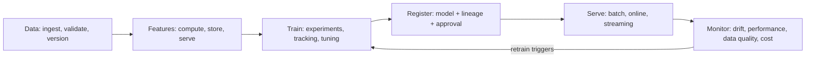

# 46. MLOps and LLMOps: the lifecycle machinery

> **What you need to be able to say:** the ML lifecycle and the tools at each stage; what changes for LLM applications (prompts, evals, gateways, traces, indexes); the maturity levels; and concrete pipelines you have run or could run. Go deeper: Part 6 → *Modern LLM engineering guide*, *CI/CD pipelines complete guide*.

## 46.1 The classic ML lifecycle



- **Data**: validated and versioned (Great Expectations/Soda/Lakeflow expectations; Delta/Iceberg time travel; DVC/LakeFS for files); schemas and contracts with producers.
- **Features**: a feature store (Databricks Feature Store, the Feature Store in Google's Gemini Enterprise Agent Platform — formerly Vertex AI Feature Store, renamed with the platform in April 2026 — SageMaker Feature Store, Feast, Tecton) for point-in-time correct training sets and low-latency online lookups; shared feature code eliminates training–serving skew.
- **Training**: pipelines (Kubeflow, Agent Platform Pipelines (formerly Vertex AI Pipelines), SageMaker Pipelines, Databricks Jobs, Airflow/Dagster), experiment tracking (MLflow, W&B, Comet), hyperparameter tuning (Optuna, Ray Tune, cloud tuners), distributed training (PyTorch DDP/FSDP, Ray, DeepSpeed), reproducibility (seeds, pinned environments, data snapshots).
- **Registry**: versioned models with lineage (data, code, params, metrics), stages or aliases (champion/challenger), approvals, signatures; MLflow Model Registry in Unity Catalog, the Agent Platform's Model Registry (formerly Vertex AI Model Registry), SageMaker Model Registry, Azure ML registries.
- **Serving**: batch scoring (Spark/SQL jobs), online endpoints (SageMaker, Gemini Enterprise Agent Platform, Azure ML, Databricks Model Serving, KServe, Seldon, BentoML, Triton, TorchServe), streaming inference (Flink/Kafka), edge (ONNX, TensorRT, Core ML); canary/shadow deployments; autoscaling.
- **Monitoring**: data drift (PSI, KL, KS tests), prediction drift, performance decay when labels arrive, data quality, latency and errors, bias and fairness metrics, cost; tools: Evidently, Arize, WhyLabs, Fiddler, the cloud model monitors (model monitoring in the Gemini Enterprise Agent Platform, formerly Vertex AI Model Monitoring; Azure ML model monitoring), Lakehouse Monitoring. Note for AWS designs: SageMaker Model Monitor, Clarify, Ground Truth, Debugger and A2I entered maintenance mode in July 2026 (no new customers), so a new AWS build monitors with Lakehouse Monitoring, Evidently/Arize or a custom job over inference logs rather than Model Monitor.
- **Governance**: model cards, documentation, approval workflows, audit, reproducibility for regulators (EU AI Act obligations phasing in from 2025, model risk management in finance such as SR 11-7 in the US).

**Critic's additions: numbers and mechanisms behind the lifecycle.**
- **Drift thresholds.** The usual PSI rule of thumb: below 0.1 no action, 0.1–0.25 investigate, above 0.25 significant shift. Report drift per feature *and* its importance; a drifting feature the model barely uses is noise. For prediction drift compare the score distribution against the training-time distribution weekly and against the last 7 days daily.
- **Label delay.** Most business labels arrive late (chargebacks in 60–90 days, churn in a quarter). Monitor proxies in the meantime (prediction distribution, feature drift, downstream business counters such as acceptance rate) and backfill the true metric when labels land; a dashboard that only shows AUC "as of 90 days ago" is not monitoring.
- **Retraining triggers.** Three kinds, in order of maturity: schedule (weekly), drift-triggered (PSI above threshold on key features), and performance-triggered (metric below floor when labels arrive). Every trigger still runs the validation gate; a trigger without a gate is how a bad week of data becomes the production model.
- **Training–serving skew.** Compute the same feature from the online store logs and from the training pipeline for the same entity and timestamp, daily, and alert on disagreement; this one check catches most "offline AUC 0.91, online CTR flat" stories.
- **When you do not need a feature store.** Batch-only scoring with features computed by the same SQL job as training does not need one; a feature store earns its cost when the same feature is served online and offline, when point-in-time correctness is hard (many event sources), or when several teams reuse features. Say which case applies before proposing Feast or Tecton.
- **Reproducibility checklist.** Code commit, container image digest, data snapshot id (Delta/Iceberg version or DVC hash), parameters, seed, and the metrics — all stored on the registry entry; a registry entry without the data snapshot id is not reproducible.
- **Batch versus online serving.** Batch scoring to a table is right when decisions can be hours old (recommendations refreshed nightly, risk scores for a daily review); an online endpoint is right when the input exists only at request time; many "real-time" requirements are satisfied by batch plus a cache, at a tenth of the cost.

## 46.2 What LLMOps adds

| Concern | Classic MLOps | LLMOps addition |
|---|---|---|
| The "model" | your trained weights | a vendor model behind an API + your prompts, tools and retrieval config; or an open model you serve |
| Versioning | model versions | prompt versions, tool schemas, retrieval configs, index versions, guardrail policies, model IDs — all together as a release |
| Evaluation | accuracy on held-out labels | eval sets with references/rubrics, LLM judges, agent trajectories, safety suites; run in CI (chapter 32) |
| Serving | your endpoint | an LLM gateway (routing, fallbacks, caching, rate limits, cost attribution) in front of multiple providers; vLLM/SGLang for open models |
| Monitoring | drift on features | token/cost metrics, latency and TTFT, guardrail hits, judge-sampled quality, prompt-injection attempts, provider health |
| Data | training sets | corpora and indexes with refresh pipelines and ACL sync; prompt/response logs as the new training data (with consent and redaction) |
| Experimentation | A/B on models | A/B on prompts and models via feature flags; shadow mode for new models; offline replay of logged traffic |
| Feedback loop | labels → retrain | user feedback, edits and judge scores → eval set → prompt/tool/retrieval changes → (sometimes) fine-tuning |

Prompt management tools: Langfuse, LangSmith Hub, Braintrust, MLflow Prompt Registry (part of the GenAI features MLflow 3 added in 2025, alongside tracing and evaluation), PromptLayer, Agenta; evaluation and tracing tools in chapters 29 and 32; gateways in chapter 31.

**Critic's additions: the release bundle, and the statistics of an eval gate.** "Version everything together" is abstract until you show the artifact. A release of an LLM feature is one manifest, stored in git and referenced from every trace:

```yaml
release: policy-assistant-2026.10.02-r3
model: {provider: anthropic, id: <pinned model id>, snapshot: <dated version>, temperature: 0, max_tokens: 1200}
fallback_model: {provider: bedrock, id: <pinned model id>}
prompts: {system: prompts/system.md@a41c9e, answer: prompts/answer.md@7b02d1}
tools: {schemas_hash: 9f3e..., policy: tools/policy.yaml@c2d4}
retrieval: {index: policies-v14, embed_model: text-embedding-x@2025-06, top_k: 20, rerank: {model: ..., top_n: 6}, filters: [tenant, acl]}
guardrails: {policy: guardrails/v7, pii_redaction: on}
evals: {suite: evals/policy-assistant@e81a, report: runs/2026-10-02T09-14Z, gate: passed}
```

Rolling back is deploying the previous manifest; debugging a bad answer starts from the release id on its trace. The eval gate itself needs statistical hygiene: with 200 cases, the standard error of a pass rate near 80% is about 2.8 points, so a "2-point regression" on a single run is noise. Run the suite paired (same cases, old and new), use at least three runs for stochastic steps, and block when the lower bound of the 95% interval on the paired difference is below the tolerance — or when any case in the "must never fail" slice (permission leaks, forbidden tool calls) fails even once. Cost is not the obstacle: 200 cases × 3 runs with judge calls is a few dollars per PR, and prompt caching makes repeated system prompts nearly free.

## 46.3 Maturity levels (useful in interviews)

- **Level 0 — notebooks and heroics:** manual training, manual deploys, no monitoring. 
- **Level 1 — pipelines:** automated training and batch scoring, tracked experiments, a registry, basic monitoring.
- **Level 2 — CI/CD for ML:** tested pipelines, automated validation gates, canary deploys, retraining triggers, drift alerts.
- **Level 3 — platform:** self-service templates, feature store, central registry and gateway, evals in CI for LLM apps, cost and quality dashboards, governance built in.

Say which level the team is at and what moves it one level up — a concrete, bounded plan impresses more than a vision. Example: "You are at level 1 for the ranking model (tracked experiments, a registry, manual promotion) and level 0 for the LLM features (prompts edited in the console). In one quarter I would put prompts in git with a 150-case eval in CI, pin model versions behind the gateway, add a validation gate and canary to the ranking retrain, and a weekly review of low-score traces — that is level 2 for both, and the cost is one engineer-quarter plus a few dollars per PR."

## 46.4 Example pipelines

**A. Ranking model retraining (classic).** Nightly: feature pipeline (Spark) → training job (PyTorch) with validation on the last day's data → metric gates (AUC, calibration, no feature-drift alarms) → registry promotion to "challenger" → shadow scoring vs champion → automated canary to 5% with CTR/revenue gates → promotion or rollback; all tracked in MLflow; alerts on pipeline failure and on metric regression.

**B. Forecasting at a utility (classic).** Weekly retraining of NeuralProphet models per plant on Databricks Jobs; expectations on input data (missing sensors, outliers); backtests by horizon logged to MLflow; model promoted only if WAPE improves; batch forecasts written to Delta tables consumed by the optimization service; dashboards on forecast error and data freshness; 25% cost reduction came from serverless scheduling and incremental data.

**C. RAG assistant release (LLMOps).** PR changes a prompt and the reranker's top-k → CI runs retrieval evals (recall@10) and answer evals (faithfulness, correctness, abstention) with judges → report on the PR → merge → GitOps deploy to staging → shadow traffic replay → canary 10% with judge sampling and cost gate → full rollout; index refresh runs separately on document changes with ACL sync; a prompt rollback is a git revert.

**D. Agent with tools (LLMOps).** Tool schemas and policies versioned with the service; eval tasks with mocked tools and simulated users; trajectory metrics (tool-selection accuracy, steps, cost) gated in CI; traces with GenAI conventions in production; weekly review of low-score runs feeds new eval cases; model version pinned behind the gateway with a fallback.

**E. Fine-tuned classifier (hybrid).** Frontier model labels a sample → human review → LoRA training pipeline on a GPU job → eval against frontier labels and a general-ability regression suite → registry → vLLM endpoint → drift monitor on label distribution; monthly refresh.

**Critic's additions: more pipelines.**

**F. Embedding model migration (blue/green index).** The embedding model is deprecated or a better one wins on the gold set. Re-embed all 40M chunks into a new index version (about 16B tokens; at $0.02–0.13 per million tokens that is $320–2,100 — cheap — but at a rate limit of one million tokens per minute it is eleven days single-stream, so the job is parallelized across keys or run through a batch endpoint), serve both indexes in shadow with the retrieval evals comparing recall@10 per collection, canary 10% of traffic, cut over, keep the old index for a week, delete. The release manifest's `retrieval.index` and `embed_model` change together; mixing embeddings from two models in one index is the classic silent failure.

**G. Batch LLM enrichment over 10M rows.** Nightly classification of support tickets: rows diffed against the last run (only new or changed rows are sent), batched through the provider's batch endpoint at half price with a 24-hour window, idempotent writes keyed by row hash and prompt version, a hard cost cap per run (stop and alert at $500), a 1% sample scored by a judge and a 0.1% sample reviewed by humans weekly; reprocessing after a prompt change is a replay of the same rows, so the cost of a prompt change is known before it is approved.

**H. Human feedback loop.** Thumbs-down and user edits land in a triage queue; a weekly 30-minute review labels each as retrieval miss, reasoning error, policy gap, or UI confusion; each category has an owner; every confirmed failure becomes an eval case before the fix is merged, so the suite grows with production and the fix is proven against the exact failure. The metric reviewed monthly is the share of new failures that were already covered by an existing case (it should rise).

**I. Guardrail policy release.** A new injection-detection policy ships like a model: evaluated on a labeled set of 2,000 benign and 500 malicious inputs for false-positive and false-negative rates (a 2% false-positive rate on a support agent means 2% of customers are refused — that is a product decision, not a security one), canaried with the policy in log-only mode first, then enforcing, with the block rate on the dashboard next to the fallback rate.

## 46.5 Anti-patterns

Deploying from a notebook; untracked prompt edits in production; evals that live on someone's laptop; no rollback for a model version; monitoring latency but not quality; retraining on a schedule with no validation gate; logging full prompts with PII to a shared bucket; one giant pipeline that nobody can rerun partially; gating a release on a single stochastic run; using the generator model with the generator prompt as its own judge; rebuilding an index in place instead of as a new version; keeping prompt and response logs forever with no retention policy or redaction.

**Interview line:** *"MLOps is the machinery that makes a model change boring: versioned data and features, tracked training, a registry with approvals, progressive serving, and monitoring that triggers retraining. LLMOps adds prompts, tools and indexes as release artifacts, judges in CI, a gateway in front of providers, and traces that show tokens and cost — same discipline, new artifacts."*
