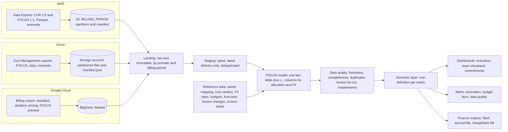

# 47b. Multi-cloud billing data and native cost tools: AWS, Azure and Google Cloud, normalized with FOCUS

> **What you need to be able to say:** how each cloud's billing hierarchy defines your reporting scopes; what each native cost tool is good and bad at, and when to leave the console for the export; which CUR 2.0 and BigQuery export columns matter, and which line item and credit types trip analysts up; how to build a multi-cloud pipeline normalized to FOCUS, with data quality checks and invoice tie-out; the SQL for the monthly questions on each cloud and across clouds; and the pitfalls that produce wrong numbers. 47a defines the cost metrics, 47c uses this data for forecasting and variance, 47d covers allocation and anomaly detection, 47e commitments and optimization.

The consoles answer questions quickly; the exports answer them correctly. Use the console to find where to look and the export to produce the number that goes to finance.

## 47b.1 AWS

### Billing hierarchy and cost scopes

AWS Organizations groups accounts under one **management account** (the payer), with member accounts arranged in organizational units, and consolidated billing produces one bill. The management account activates cost allocation tags, and an export created there covers every member account.

The scopes you report on:

- **Account** (`line_item_usage_account_id`, `line_item_usage_account_name`): the most reliable ownership unit; many companies give each application environment its own account.
- **Organizational unit**: not a CUR column; join through your account mapping.
- **Cost categories**: rule-based groupings (team, product, environment) in the `cost_category` map.
- **Tags**: activated cost allocation tags in the `resource_tags` map.
- **Billing and legal entity**: `bill_billing_entity` separates AWS from AWS Marketplace; `line_item_legal_entity` is the seller of record.
- **Billing views**: custom billing views (December 2024; multi-organization views with up to 20 sources since September 2025) give a team a filtered cost view without access to the management account.

Commitments bought in one account are shared across the consolidated billing family by default. RI and Savings Plans Group Sharing (generally available 19 November 2025) can restrict or prioritize sharing to account groups defined by cost categories, which matters when a business unit wants its own commitments to benefit its own accounts first (47d.6).

### Native tools

| Tool | Good at | Bad at | How the analyst uses it |
|---|---|---|---|
| **Cost Explorer** | Slicing by service, account, tag, cost category, charge type and usage type, with five cost metrics. By default the current month and 13 prior months, daily and monthly; optional (November 2023) 38 months of monthly history (free; switches off after three months unused; not with Billing Conductor), resource-level daily data for 14 days (free) and hourly data for 14 days (\$0.01 per 1,000 usage records a month). Commitment utilization and coverage reports; forecasts (47c.2). **Cost Comparison** (May 2025, free) compares two months and names the drivers: usage changes, credits, refunds, volume discounts. Amazon Q answers questions (April 2026) and explains views (June 2026), free | AWS only; no custom amortization or allocation beyond cost categories; the API costs \$0.01 per paginated request; refreshes at least every 24 hours | First stop for "what moved"; Cost Comparison for month-over-month drivers; a forecast cross-check. Reconcile any screenshot against your model before it reaches leadership |
| **Data Exports** | The line-item source of record. **CUR 2.0** (November 2023): fixed schema, nested map columns (`product`, `resource_tags`, `cost_category`, `discount`), account names, SQL column selection. **FOCUS 1.2 with AWS columns** (generally available 19 November 2025) and FOCUS 1.0 (November 2024; not compatible with 1.2). Recommendations and carbon emissions exports. Parquet or compressed CSV. Options: resource IDs, split cost allocation data, capacity reservation data, manual discount compatibility, IAM principal data (April 2026); cross-account delivery to S3 (April 2026). Legacy CUR is still offered | You own the pipeline; the previous month can change for two weeks; map columns need careful SQL | The warehouse input (47b.6): CUR 2.0 for AWS detail, FOCUS 1.2 for the cross-cloud model |
| **Budgets** | Six types (cost, usage, RI and Savings Plans utilization and coverage); actual or forecasted alerts; up to three updates a day; actions (IAM policy, SCP, stop EC2 or RDS), automatic or approved. Net metrics and exclusion filters (April 2025), budgets on billing views (August 2025), custom periods (September 2025). Monitoring free; two action-enabled budgets free, then \$0.10 a day each | Not real time; budgets multiply and go stale when owners change | One budget per owner scope, set to the forecast, with a forecast alert at 100% |
| **Cost Anomaly Detection** | Monitors by service, linked account, cost category or tag, including an AWS-managed monitor that tracks every value of a dimension; about three runs a day; root cause lists up to 10 contributors; alerts by email, SNS, EventBridge or User Notifications (47d.10) | Works on net unblended, not amortized, cost; a new service needs 10 days of history | Account and service monitors routed into the ticket queue |
| **Allocation features**: Cost Categories, cost allocation tags, tag policies, split cost allocation data | Rule-based business dimensions with split charges (up to 50 categories, rules applied up to 12 months back); tags activated in the management account, with a 12-month backfill; account tags for untaggable charges (December 2025); required-tag validation in IaC (November 2025); container cost split for ECS, Batch and EKS | Split charges show only in Cost Categories views; backfill fills only values the tag had; enforced tag policies ignore untagged resources | Mirror your mapping table so console users see your owners (47d.3, 47d.5, 47d.7) |
| **Optimization tools**: Cost Optimization Hub, Compute Optimizer, Purchase Analyzer | 18 recommendation types de-duplicated to one action per resource; the Cost Efficiency metric (November 2025), (1 − potential savings ÷ optimizable spend) × 100 on net amortized cost; rightsizing and idle detection across compute, databases and more; commitment purchase modeling on lookbacks within the last 60 days | Savings assume full adoption; utilization-based, blind to planned load | The source list for the savings pipeline (47e) |
| **Billing and Cost Management Dashboards; Pricing Calculator** | Free dashboards (August 2025; managed dashboards August 2026); the in-console Pricing Calculator (generally available May 2025), with workload estimates and bill estimates that include your commitments and discounts | Limited modeling; estimates are only as good as the usage assumptions | Self-service views for owners; costing known changes (47c.3) |
| **Assistants and agents** | Amazon Q in Cost Explorer; the open-source Billing and Cost Management MCP server (August 2025); the AWS FinOps Agent (public preview, 9 June 2026, us-east-1), which finds anomaly root causes through CloudTrail and reports to Slack or Jira | Preview features change; answers need checking against the data | A faster first pass, never the final number |
| **Cloud Intelligence Dashboards** | Open-source dashboards (CUDOS, CID, KPI, FOCUS) on Data Exports → S3 → Athena and Glue → Amazon Quick Sight (renamed from QuickSight on 9 October 2025) | AWS only, unless you load other clouds yourself | A ready-made AWS layer while the multi-cloud model matures |

## 47b.2 Azure

### Billing hierarchy and cost scopes

Two agreement types shape the billing hierarchy:

- **Enterprise Agreement (EA):** enrollment → departments → enrollment accounts → subscriptions.
- **Microsoft Customer Agreement (MCA):** billing account → billing profiles (each produces one invoice) → invoice sections → subscriptions.

The resource hierarchy runs management groups → subscriptions → resource groups → resources. Cost Management works at management group, subscription and resource group scope, and at the billing scopes (EA enrollment, department and account; MCA billing account, billing profile and invoice section). Management group scope is not supported for MCA and excludes purchases, so reservation and savings plan purchases never show there. Billing administrators can set a cost center value for internal chargeback; the FOCUS export carries it as `x_CostCenter`, next to `x_InvoiceSectionName` (the MCA invoice section or EA department). The EA Enterprise Reporting APIs are retired; use the Azure Resource Manager Cost Management APIs.

### Native tools

| Tool | Good at | Bad at | How the analyst uses it |
|---|---|---|---|
| **Cost analysis** | Smart views (Resources, Resource groups, Services, Subscriptions, Reservations, Customers) and customizable views (Accumulated costs, Daily costs, Cost by service, Cost by resource, Invoice details); actual and amortized cost; a forecast (47c.2) | Azure only; the scope limits above | Quick slicing; Invoice details for reconciliation |
| **Exports** | Cost and usage details as actual, amortized, usage-only or FOCUS (actual and amortized in one dataset); price sheet; reservation details, recommendations and transactions. CSV (gzip) or Parquet (snappy); reservation datasets CSV only. Partitioned files with a `manifest.json`; overwrite on by default, so a daily export replaces the previous file. FOCUS 1.0 and 1.0r2 generally available, 1.2-preview newest; FOCUS 1.4 support planned for 2026 | No FOCUS export at management group scope | The warehouse input; FOCUS for the cross-cloud model |
| **Budgets** | Evaluated every 24 hours; alerts on actual or forecasted cost; thresholds from 0.01% to 1000%; email usually within an hour | Budgets never stop resources; action groups only at subscription and resource group scope | Owner budgets set to the forecast |
| **Anomaly and scheduled alerts** | Daily anomaly detection (a model trained on 60 days of history, about 36 hours after the day ends; up to five alert rules per subscription; 47d.10); scheduled alerts weekly, monthly, after invoice finalization or custom; reservation utilization alerts | Anomaly detection at subscription scope only, a day and a half late | One rule per important subscription, routed to its owner |
| **Cost allocation rules and tag inheritance** | Rules (EA, MCA) move costs between subscriptions, resource groups and tags, split evenly, by total, compute, storage or network cost, or by percentage; results show in cost analysis, budgets and exports (`costAllocationRuleName`) while the invoice is unchanged. Tag inheritance copies subscription and resource group tags onto usage records for the current month, within 8–24 hours (47d.3, 47d.5) | Both skip commitment purchases | Shared-cost allocation inside Azure, mirrored in your model |
| **Advisor** | Shutdown and resize recommendations with a 7-day default lookback (configurable to 90); shutdown when P95 CPU is under 3% and network under 2%; an Advisor score with a cost category | Savings at retail rates, ignoring existing reservations and savings plans | A candidate list, re-priced at your effective rates (47e.3) |
| **FinOps toolkit** | Version 14 (29 April 2026): FinOps hubs on storage, Azure Data Explorer or Microsoft Fabric (full FOCUS 1.2 since version 12, July 2025); Power BI reports for cost, rate optimization (with a Hybrid Benefit page), workload optimization and governance; the Azure Optimization Engine. Hubs add columns such as `x_SkuLicenseStatus` that the native export lacks | You operate it | A ready-made Azure (and FOCUS) data layer |
| **Retail Prices API** | `https://prices.azure.com/api/retail/prices`: no authentication, 1,000 rows per page | Retail prices only; your negotiated prices are in the price sheet export | Estimating known changes |
| **Azure Copilot and agents** | Copilot (generally available April 2025) summarizes costs, forecasts and savings; an Optimization agent in preview (November 2025); Cost Management tools in the Azure Resource Manager MCP server (August 2026) | Answers need checking against the data | First-pass questions |
| **Consumption commitment (MACC) tracking** | Consumption against the commitment, alerts at 90, 60 and 30 days (47a.3) | Counts only eligible spend | Shortfall projection |

The Azure Cost Management connector for AWS was retired on 31 March 2025, so Azure's tools no longer show AWS costs.

## 47b.3 Google Cloud

### Billing hierarchy and cost scopes

A **Cloud Billing account** pays for projects and is linked to a payments profile. It is self-serve (online, charged to the payments profile on a threshold or monthly cycle) or invoiced (offline, with a monthly invoice). A billing account can pay for projects in other organizations, and resellers use subaccounts. The resource hierarchy runs organization → folders → projects. Reports group by project, service, SKU, location, label, folder or organization, product, originating product and subaccount, on two time bases: **charge period** (formerly "usage date") and **billing period** (formerly "invoice month"). Google's documentation now lives at docs.cloud.google.com.

Two allocation mechanisms coexist (47d.3). **Labels** are not inherited, appear in the export as `labels`, `project.labels` and `system_labels`, and carry cost only from the time they were applied. **Resource Manager tags** are IAM-governed, inherited down the hierarchy, appear in the `tags` field, and are supported on some resource types only. GKE cost allocation, in the detailed export, adds labels such as `k8s-namespace` and `k8s-workload-name`, plus `kube:system-overhead` and `kube:unallocated` (47d.7).

### Native tools

| Tool | Good at | Bad at | How the analyst uses it |
|---|---|---|---|
| **Billing reports** | Grouping and filtering by the dimensions above, by charge or billing period; a Savings filter that decides which credits and discounts are netted; forecasted cost (light gray) when the range ends in the future; a header with the current month's forecasted total, including forecasted savings | Days start at midnight US Pacific Time; the forecast method is not documented | Quick slicing; current-month landing cross-check |
| **Cost table** | Built to match the invoice, with detail by project, service and SKU | Invoice view only | Invoice reconciliation |
| **Cost breakdown** | A waterfall from on-demand cost through negotiated savings, savings programs (CUDs, sustained use discounts) and other savings to taxes, adjustments and the total | Summary only | Explaining discounts to finance |
| **BigQuery export** | Standard usage cost; detailed usage cost (adds `resource.name` and `resource.global_name`; required for GKE cost allocation); pricing (`cloud_pricing_export`); CUD metadata (preview, spend-based CUDs only); FOCUS (preview, 8 June 2026: a Google-managed linked dataset with two-year retention, CUD detail in `x_Credits`); rebilling (resellers). Google also published a FOCUS 1.0 BigQuery view and Looker template in June 2024 | No delivery guarantee; first data usually within hours; a backfill can take up to five days; pricing data up to 48 hours. Multi-region (US or EU) datasets receive data from the start of the previous month; regional datasets and the pricing export start at enablement | The source of record; enable the standard, detailed and pricing exports on day one |
| **Budgets** | Scope: billing account, organization or folders, projects, services, one label, subaccounts; a fixed amount or last period's spend; thresholds on actual or forecasted spend (default 50%, 90%, 100%); include or exclude savings; up to 50,000 per billing account; Pub/Sub messages several times a day for automation. **Spend-cap budgets** (preview, 27 July 2026) for the Gemini API, Agent Platform, Cloud Run and Cloud Run functions | Alerts only, except the spend-cap preview | Owner budgets; Pub/Sub automation for sandbox projects |
| **Anomaly detection** | Generally available 30 October 2025, on for all projects; AI-generated thresholds; root cause by service, region and SKU; early anomalies for AI services (preview, 24 July 2026) at 20–40 minutes of latency (47d.10) | Thresholds are generated for you; tune the routing | Daily review; early anomalies for AI-heavy projects |
| **FinOps hub 2.0 and Recommender** | Usage insights (over- or under-provisioned, poorly configured, idle) for Compute Engine, GKE, Cloud Run and Cloud SQL, and a FinOps score (April 2025); recommenders for idle VMs, disks, IPs and images, machine types, resource- and spend-based CUDs, Cloud SQL and unattended projects, exportable to BigQuery | Google Cloud only; recommendations, not decisions | The savings pipeline, joined to cost in BigQuery (47e) |
| **Gemini Cloud Assist and the FinOps Explainability Agent** | Gemini Cloud Assist in Billing (preview); the Explainability Agent (generally available 22 April 2026) breaks AI cost down by model, API key and token type | Answers need checking against the data | AI cost questions (chapter 31) |

## 47b.4 The three clouds side by side

| | AWS | Azure | Google Cloud |
|---|---|---|---|
| Native forecast (47c.2) | Up to 18 months monthly or 3 months daily; 80% prediction interval in the console | Linear regression on a lookback of up to 90 days | Current-month and date-range forecasts; method not documented |
| Budgets and enforcement | Six types; up to three updates a day; actions can apply policies or stop EC2 and RDS | Daily; budgets never stop resources | Several Pub/Sub updates a day; spend caps in preview for some AI and serverless products |
| Allocation primitives (47d) | Accounts, activated tags with 12-month backfill, account tags, cost categories with split charges | Subscriptions and resource groups, tags, tag inheritance, cost allocation rules | Projects and folders, labels (not inherited), Resource Manager tags (inherited) |
| Line-item export | CUR 2.0, FOCUS 1.2 (and 1.0); Parquet or CSV to S3 | Actual, amortized, usage-only, FOCUS (1.0r2 GA, 1.2-preview); CSV or Parquet to storage | BigQuery tables: standard, detailed, pricing, CUD metadata (preview); FOCUS (preview, linked dataset) |
| Default cost view | Cost Explorer shows fees on the day charged until you switch to amortized; anomaly detection uses net unblended | Actual or amortized, by toggle | Cost with a Savings filter |
| Finality (47a.5) | The previous month can change for two weeks | Closes up to 72 hours after the period ends; changes until about day 5 | Invoice by the fifth business day; late usage moves to the next invoice month |

The pattern to remember: each cloud's tools are good for that cloud, none shows the other two, and each defaults to a different cost view. A multi-cloud analyst needs one normalized model, and FOCUS is the obvious schema for it.

## 47b.5 The columns that matter

### CUR 2.0: the columns you will use every week

CUR 2.0 has 125 possible columns. The SQL table name inside Data Exports is `COST_AND_USAGE_REPORT`; in Athena it is whatever you register (this chapter uses `cur.cur2`).

| Column | Type | What it holds | Watch out for |
|---|---|---|---|
| `bill_billing_period_start_date` | timestamp | The billing period (month) | The invoice basis; credits and refunds can carry other usage dates |
| `bill_bill_type` | string | `Anniversary` (the month's usage and recurring fees), `Purchase` (upfront fees), `Refund` | `Purchase` rows are cash events, not usage |
| `bill_billing_entity` | string | AWS or AWS Marketplace | Marketplace is invoiced separately |
| `bill_invoice_id` | string | The invoice the line belongs to | Blank until the report is final |
| `line_item_usage_account_id`, `line_item_usage_account_name` | string | The account that used the service | The main ownership key |
| `line_item_line_item_type` | string | The kind of charge (next table) | Drives every amortization and filter decision |
| `line_item_product_code`, `line_item_usage_type`, `line_item_operation` | string | Product (`AmazonEC2`), usage detail (`USW2-BoxUsage:m2.2xlarge`: region prefix, then usage), operation | Spot, Box, data transfer and storage all hide in the usage type |
| `line_item_usage_start_date`, `line_item_usage_end_date` | timestamp | Usage window, UTC | |
| `line_item_usage_amount` | double | Quantity | Units vary by usage type (`pricing_unit`) |
| `line_item_unblended_cost`, `line_item_net_unblended_cost` | double | Cost before and after discounts | The `net_` column exists only when the account has a discount in the period |
| `line_item_resource_id` | string | Resource ID | Only when the export includes resource IDs |
| `line_item_legal_entity` | string | Seller of record | Differs from the invoicing entity for some Marketplace and regional resellers |
| `pricing_public_on_demand_cost` | double | Cost at public on-demand rates | For tiered prices, AWS shows the highest-tier equivalent |
| `product_` columns and the `product` map | string, map | Product attributes: top-level columns such as `product_region_code` and `product_instance_type`, the rest in the map | Map keys vary by service; list them with `map_keys`, read them with `element_at` |
| `resource_tags` | map | Activated cost allocation tags, with names normalized (special characters and spaces removed) | A key appears only on lines where the tag has a value. AWS now recommends the newer `tags` column, which is not normalized and also holds account and cost category tags; check its key format before switching |
| `discount`, `discount_total_discount` | map, double | Discounts applied to the line | Both are removed when the export includes manual discount compatibility, which writes discounts as separate line items instead. `discount_bundled_discount` is not removed |
| `savings_plan_*` | | `savings_plan_savings_plan_a_r_n`, `savings_plan_savings_plan_effective_cost`, `savings_plan_used_commitment`, `savings_plan_total_commitment_to_date`, `savings_plan_recurring_commitment_for_billing_period`, `savings_plan_amortized_upfront_commitment_for_billing_period` and their `net_` versions | Each is populated only on certain line item types |
| `reservation_*` | | `reservation_reservation_a_r_n`, `reservation_effective_cost`, `reservation_amortized_upfront_fee_for_billing_period`, `reservation_unused_amortized_upfront_fee_for_billing_period`, `reservation_unused_recurring_fee`, `reservation_unused_quantity` and their `net_` versions | Dedicated Host reservations lack the amortized upfront columns |
| `identity_line_item_id`, `identity_time_interval` | string | Line identifier and its UTC interval | The ID is unique within a partition, not across deliveries or reports |
| `line_item_iam_principal` | string | The IAM principal calling Amazon Bedrock | Only when IAM principal data is enabled (April 2026) |

### CUR line item types and how each is treated

| `line_item_line_item_type` | What it is | In unblended cost | In amortized cost |
|---|---|---|---|
| `Usage` | Usage at on-demand rates | Cost | Cost |
| `DiscountedUsage` | Usage covered by a Reserved Instance | Zero; the reservation's cost is on the `RIFee` and `Fee` rows | `reservation_effective_cost` |
| `RIFee` | The monthly recurring reservation fee; populated even for all-upfront reservations (at \$0) to carry the amortization columns | The recurring fee | Only the unused share: `reservation_unused_amortized_upfront_fee_for_billing_period + reservation_unused_recurring_fee` |
| `Fee` | Upfront fees, such as an all-upfront or partial-upfront reservation | Cost | Zero when it is a reservation's upfront fee (the reservation ARN is set), otherwise cost |
| `SavingsPlanUpfrontFee` | The one-time upfront Savings Plan payment | Cost | Zero |
| `SavingsPlanRecurringFee` | The hourly recurring fee of No Upfront and Partial Upfront plans; for All Upfront plans the row carries the unused portion | The recurring fee (zero for All Upfront) | Only the unused share: `savings_plan_total_commitment_to_date − savings_plan_used_commitment` |
| `SavingsPlanCoveredUsage` | Usage covered by a Savings Plan, shown at on-demand cost | On-demand cost, offset by the negation row | `savings_plan_savings_plan_effective_cost` |
| `SavingsPlanNegation` | Offsets the covered usage's on-demand cost | Negative of the covered cost | Zero |
| `Credit`, `Refund` | Credits and refunds; can be added after the month is final | Negative | Negative |
| `Tax` | Taxes such as VAT or US sales tax | Cost | Cost |
| `BundledDiscount` | A usage-based discount tied to another service's usage | Negative | Negative |
| `Discount` | Negotiated and program discounts as separate rows; the exact name varies (for example `EdpDiscount` or `PrivateRateDiscount`), so check the description column | Negative | Negative |
| `FlatRateSubscription` | Hourly subscription fees for services sold that way | Cost | Cost |

Two filtering habits follow. Filtering on `line_item_line_item_type = 'Usage'` to get "usage" silently drops everything covered by commitments; use `IN ('Usage', 'DiscountedUsage', 'SavingsPlanCoveredUsage')`. And the Cloud Intelligence Dashboards remove discount rows with `line_item_line_item_type NOT LIKE '%Discount'` for undiscounted views; know which view your numbers come from.

### Google Cloud BigQuery export: the columns you will use

Tables: `gcp_billing_export_v1_<BILLING_ACCOUNT_ID>` (standard), `gcp_billing_export_resource_v1_<BILLING_ACCOUNT_ID>` (detailed), `cloud_pricing_export` (pricing) and `cud_subscriptions_export` (CUD metadata, preview). The FOCUS export (preview) arrives as a Google-managed linked dataset rather than a table you name.

| Column | What it holds | Watch out for |
|---|---|---|
| `invoice.month` | Invoice month as `YYYYMM` | Reconcile on this; late usage can carry a later month than its usage date |
| `invoice.publisher_type` | `GOOGLE` (first party) or `PARTNER` (third party) | Invoices can be split between Google and partners |
| `cost_type` | `regular`, `tax`, `adjustment`, `rounding_error` | Include all of them to tie to the invoice; analyze `regular` |
| `service.id`, `service.description`, `sku.id`, `sku.description` | Service and SKU | Group by IDs; descriptions change |
| `usage_start_time`, `usage_end_time` | Hourly usage window | Console days use Pacific Time |
| `project.id`, `project.name`, `project.labels`, `project.ancestors` | Project and its hierarchy | Null on charges not tied to a project |
| `labels`, `system_labels` | Resource labels (key, value pairs) | Not inherited; cost only from when applied |
| `tags` | Resource Manager tags (`key`, `value`, `inherited`, `namespace`) | Only some resource types |
| `cost` | Cost under the applicable consumption model, including negotiated discounts | Never report it without credits |
| `credits` | Repeated (`id`, `full_name`, `type`, `name`, `amount`), negative amounts | Sum inside a scalar subquery, or you multiply `cost` |
| `cost_at_list`, `cost_at_effective_price_default` | Cost at list price, and at your negotiated price, under the default consumption model | The second is the basis for CUD savings in the new spend-based model |
| `consumption_model.id`, `consumption_model.description` | The default model or a specific CUD | New with the spend-based CUD data model, where covered usage gets its own rows |
| `currency`, `currency_conversion_rate` | Billing currency and the rate from US dollars | `cost` ÷ rate gives US dollars |
| `adjustment_info` (`type`, `mode`) | Corrections and goodwill: types such as `USAGE_CORRECTION`, `PRICE_CORRECTION`, `GOODWILL`, `SLA_VIOLATION`; modes such as `PARTIAL_CORRECTION`, `COMPLETE_NEGATION` | Can land in a later month than the usage they fix |
| `transaction_type`, `seller_name` | Google, third-party reseller or third-party agency; the seller for Marketplace items | Marketplace charges |
| `export_time` | Processing time of each append; always increases | The watermark for incremental copies |

### Google credit types

| `credits.type` | Meaning | Analyst note |
|---|---|---|
| `SUSTAINED_USAGE_DISCOUNT` | Automatic discount, up to 30%, for eligible Compute Engine machine series (N1, N2, N2D, C2, M1, M2) that run much of the month | Current documentation limits eligibility to self-serve billing accounts |
| `COMMITTED_USAGE_DISCOUNT` | Resource-based CUDs | Pairs with a commitment fee SKU |
| `COMMITTED_USAGE_DISCOUNT_DOLLAR_BASE` | Spend-based CUDs in the old data model | Disappears for accounts migrated to the new model (47b.8) |
| `FEE_UTILIZATION_OFFSET` | Spend-based CUDs in the new model: offsets the used part of the commitment fee | The discount itself is in the lower usage price |
| `DISCOUNT` | Credits earned after a contractual spending threshold ("spending-based discounts" in the console) | Check timing against the contract |
| `FREE_TIER` | Free usage up to service limits | |
| `PROMOTION` | Free trial, marketing and other credits and grants | They expire; net cost jumps when they run out |
| `RESELLER_MARGIN` | Reseller program discounts | Resellers only |
| `SUBSCRIPTION_BENEFIT` | Discounts earned through long-term subscriptions | |

### Azure cost details and FOCUS: a crosswalk

| Concept | Azure cost details (actual and amortized datasets) | FOCUS export |
|---|---|---|
| Kind of charge | `ChargeType`: `Usage`, `Purchase`, `Refund`, `UnusedReservation`, `UnusedSavingsPlan` | `ChargeCategory`, with unused commitment as `Usage` rows whose `CommitmentDiscountStatus` is `Unused` |
| Commitment | `ReservationId`, `ReservationName`; `BenefitId`, `BenefitName` with `PricingModel` = `SavingsPlan` | `CommitmentDiscountId`, `CommitmentDiscountType`, `CommitmentDiscountCategory`, `CommitmentDiscountStatus` |
| Cost | `Cost`, from the actual or the amortized dataset | `BilledCost` (actual) and `EffectiveCost` (amortized) in one row |
| Prices | `UnitPrice` (price sheet), `PayGPrice` (retail pay-as-you-go), `EffectivePrice` | `ListUnitPrice`, `ContractedUnitPrice` |
| Subscription and resource group | Subscription and resource group fields | `SubAccountId`, `SubAccountName`, `x_ResourceGroupName` |
| Tags | Tags | `Tags` as a JSON object |
| Currency | Billing currency fields | `BillingCurrency`, `x_BillingExchangeRate` (pricing to billing currency), `x_BilledCostInUsd`, `x_EffectiveCostInUsd` |
| Billing structure | Billing profile, invoice section | `x_BillingProfileId`, `x_InvoiceSectionName`, `x_CostCenter` |

## 47b.6 A reference architecture for a multi-cloud cost data pipeline



**Ingestion.** On AWS, two Data Exports from the management account, FOCUS 1.2 for the cross-cloud model and CUR 2.0 for AWS-only detail, both Parquet in overwrite mode. On Azure, the FOCUS export daily at billing account or billing profile scope, plus the price sheet for negotiated prices. On Google Cloud, the standard, detailed and pricing exports to a multi-region dataset on day one, since only multi-region datasets backfill; add the FOCUS export when you are ready to compare it with your own mapping.

**Landing and staging.** Copy raw files as they arrive, keyed by provider, billing period and load time, and never edit them: that is the audit trail when a number changes. Staging keeps one current snapshot per provider and period: on AWS, read the manifest (delivered after all data files) and load only the latest delivery; on Azure, rely on overwrite; on Google, copy incrementally with `export_time` as the watermark. Cast money to decimal types here.

**The FOCUS-normalized model.** One fact table, `focus_all`, with standard FOCUS columns plus your own `x_` columns (FOCUS reserves the prefix for columns outside the specification). Target one FOCUS version and map the others to it: AWS delivers 1.2, Azure 1.0r2 or 1.2-preview, Google's export is in preview, and versions are not column-compatible. FOCUS 1.3 deprecated `ProviderName` and `PublisherName` in favor of `ServiceProviderName` and `HostProviderName`, and 1.4 removed the deprecated pair, so plan the rename.

| Column | Type | Notes |
|---|---|---|
| `ProviderName` | string | As delivered in 1.2; plan the move to `ServiceProviderName` |
| `BillingAccountId`, `SubAccountId`, `SubAccountName` | string | An AWS account, an Azure subscription or a Google Cloud project |
| `BillingPeriodStart` | date | First day of the billing month |
| `ChargePeriodStart` | timestamp | Start of the charge period (hour or day) |
| `InvoiceId` | string | Where the provider fills it (FOCUS 1.2) |
| `ServiceCategory`, `ServiceName` | string | One of FOCUS's 19 service categories, such as Compute, Storage, Databases, Networking, AI and Machine Learning |
| `ChargeCategory`, `ChargeClass`, `ChargeFrequency`, `PricingCategory` | string | |
| `CommitmentDiscountId`, `CommitmentDiscountType`, `CommitmentDiscountStatus` | string | |
| `ListCost`, `ContractedCost`, `BilledCost`, `EffectiveCost` | decimal | Billing currency |
| `BillingCurrency` | string | |
| `x_FxRateToUsd` | decimal | Monthly average rate for the billing currency (1 for US dollars), from the reference data |
| `x_Team`, `x_Application`, `x_Environment`, `x_CostCenter` | string | Filled by the allocation rules below; null means unallocated |
| `x_SourceDataset`, `x_LoadedAt` | string, timestamp | Lineage |

The allocation columns are filled in priority order, the precedence of 47d.5's mapping table: explicit overrides first, then a valid tag, then the account, subscription or project default, which catches everything tags miss and is why 47d.1 builds the account map first.

| Priority | AWS | Azure | Google Cloud |
|---|---|---|---|
| 0 | Explicit overrides in the mapping table, such as a shared network account sent to its pool | Same | Same |
| 1 | Resource tag `team` | Resource tag `team`, including values inherited from the subscription or resource group | Resource label `team`, or the Resource Manager tag `team` |
| 2 | Account mapping; Organizations account tags for untaggable charges | Subscription or resource group mapping | Project label `team`; project or folder mapping |
| 3 | Cost category rules, including split charges | Cost allocation rules | Your own rules |
| 4 | Shared-cost rules (support, shared networking, unused commitments) applied in the model | Same | Same |
| Otherwise | Unallocated, reported as such | Unallocated | Unallocated |

For Kubernetes, use AWS split cost allocation data and GKE cost allocation in the detailed export, so cluster cost reaches namespaces rather than the platform team (47d.7).

**Reference data.** The mapping table from sub-account to owner, cost center, environment and application, with `valid_from` and `valid_to` so reorganizations do not rewrite history; monthly FX rates (budget and actual average); budgets and forecast versions; the known-changes and commitments registers; invoice totals for the tie-out.

**Semantic layer.** One versioned definition per metric, used by every dashboard: `billed_cost` (all charge categories), `effective_spend` (`EffectiveCost` excluding tax), `usage_spend`, `list_cost_ex_purchases`, `contracted_cost_ex_purchases`, unallocated cost %, effective savings rate, utilization and coverage. When finance or the central team asks "which number is this?", the answer is a metric name with a definition. The outputs (dashboards, alerts, and the flash, accrual and chargeback files) all read from it.

### Data quality checks

| Check | How | Threshold (example) | When it fails |
|---|---|---|---|
| Freshness | Latest complete usage date per provider | Within 2 days (AWS, Google, Azure EA and MCA); 3 days (Azure pay-as-you-go) | Mark dashboards "as of" the last complete day; alert the pipeline owner |
| Completeness | Every mapped sub-account appears in the last complete day; daily rows and cost within ±30% of the trailing 7-day median; the AWS manifest exists | Any missing sub-account; any day outside the band without a known reason | Hold the flash; investigate the export |
| Duplicate deliveries | One delivery per billing period; Azure overwrite on; Google watermark on `export_time`; row-hash uniqueness in staging | More than one delivery in a period | Rebuild the period from the latest delivery |
| Invoice tie-out | Data total per invoice or billing period against the invoice | Within the larger of 0.5% of the invoice or \$500 | Look for tax, credits, Marketplace, support, rounding, currency and late items |
| Restatements | Daily snapshot of each period's totals, compared with the lock-day value | Change above 0.1% or \$1,000 after lock | Post a prior-period adjustment; tell finance |
| Mapping coverage | Share of `EffectiveCost` with an owner; new sub-accounts without a mapping | Below target; any new unmapped sub-account older than a day | Assign an owner |
| Schema and value drift | New columns, new `ChargeCategory` or line item type values, renamed services or SKUs | Any change | Review mappings; group by IDs, not descriptions |
| Currency | Every row has a billing currency and every currency-month an FX rate | Any missing rate | Block the US-dollar rollup |

Two of these checks in Athena (engine version 3, CUR 2.0 table `cur.cur2`):

```sql
-- Duplicate deliveries. In create-new mode each refresh writes a new
-- <timestamp>-<execution-id> folder under BILLING_PERIOD=YYYY-MM/; in overwrite mode
-- files sit directly in the partition. Expect 0 (overwrite) or 1; more means double counting.
SELECT
  billing_period,
  COUNT(DISTINCT regexp_extract("$path", 'BILLING_PERIOD=[0-9-]+/([^/]+)/', 1)) AS delivery_folders
FROM cur.cur2
WHERE billing_period IN ('2026-08', '2026-09')
GROUP BY billing_period;

-- Freshness and completeness: rows, cost and the latest usage hour per day.
SELECT
  date(line_item_usage_start_date)        AS usage_date,
  COUNT(*)                                AS line_items,
  ROUND(SUM(line_item_unblended_cost), 2) AS unblended_cost,
  MAX(line_item_usage_start_date)         AS latest_usage_hour
FROM cur.cur2
WHERE billing_period = '2026-09'
GROUP BY 1
ORDER BY 1 DESC;
```

And the invoice tie-out on the Google standard export (BigQuery Standard SQL):

```sql
SELECT
  invoice.month          AS invoice_month,
  invoice.publisher_type AS publisher_type,
  currency,
  SUM(CAST(cost AS NUMERIC))
    + SUM(IFNULL((SELECT SUM(CAST(c.amount AS NUMERIC))
                  FROM UNNEST(credits) AS c), 0)) AS total_in_data   -- all cost_type values
FROM `billing-admin.billing_export.gcp_billing_export_v1_XXXXXX_XXXXXX_XXXXXX`
WHERE invoice.month = '202609'
GROUP BY invoice_month, publisher_type, currency;
```

### Reconciling to invoices

- **AWS.** After the month is final (`bill_invoice_id` populated), sum the line items by `bill_invoice_id`, `bill_billing_entity` and `line_item_legal_entity` over every line item type, including tax, credits and refunds, and compare each with its invoice. Upfront purchases and Marketplace have their own invoices. Establish once whether discounts arrive as separate line items or in the `discount` columns (47b.5), and document it. Before the month is final, expect gaps from credits, refunds and support fees not yet posted.
- **Azure.** Sum actual cost, or FOCUS `BilledCost`, by billing period and billing profile (each MCA billing profile produces one invoice), and compare with the invoice and the Invoice details view. Microsoft states that Cost Management data excludes support charges, taxes and credits, so those are reconciling lines by design, along with Marketplace charges and rounding.
- **Google Cloud.** Sum cost plus credits as `NUMERIC` by `invoice.month` over all `cost_type` values, split by `invoice.publisher_type` where invoices are split, and compare with the invoice (available by the fifth business day) and the console's cost table. Late usage rolled into the next invoice month is not an error.
- **FOCUS in general.** From FOCUS 1.2, `BilledCost` summed by `InvoiceId` must equal the invoice's payable amount, so where a provider fills `InvoiceId` the tie-out is one query (47b.10).

Keep the tie-out results in a table with the tolerance and the explanation of each gap; finance will ask for it the first time your numbers differ from theirs.

## 47b.7 SQL recipes: CUR 2.0 on Amazon Athena

**Assumptions for every query in this section.** Athena engine version 3 (based on Trino). CUR 2.0 in Parquet, registered as `cur.cur2` with the partition column `billing_period` (a string, `'YYYY-MM'`) matching the export's `BILLING_PERIOD=YYYY-MM` folders, in overwrite mode or reading only the latest delivery (47b.6). Costs in US dollars. A user-defined cost allocation tag `team` is activated; its normalized key in `resource_tags` is assumed to be `user_team`, so run the discovery query first and substitute yours (or the key format of the newer `tags` column). In Trino, `map['key']` fails when the key is missing, and a tag key is present only on lines where the tag has a value, so read map keys with `element_at`, which returns null.

```sql
-- 0. Discovery: which tag keys exist in resource_tags this month?
SELECT tag_key, COUNT(*) AS line_items
FROM cur.cur2
CROSS JOIN UNNEST(map_keys(resource_tags)) AS t (tag_key)
WHERE billing_period = '2026-09'
GROUP BY tag_key
ORDER BY line_items DESC;
```

**The amortized-cost view.** Every later query reads this view, so the amortization logic lives in one place. It follows the line item treatment table in 47b.5.

```sql
-- 1. A view that adds amortized cost to every CUR 2.0 line item.
--    Commitment fees are spread over the usage they cover; unused commitment stays visible.
CREATE OR REPLACE VIEW cur.cur2_costs AS
SELECT
  billing_period,
  bill_invoice_id,
  bill_billing_entity,
  line_item_usage_account_id,
  line_item_usage_account_name,
  line_item_product_code,
  line_item_usage_type,
  line_item_line_item_type,
  line_item_usage_start_date,
  resource_tags,
  pricing_public_on_demand_cost,
  line_item_unblended_cost AS unblended_cost,
  CASE line_item_line_item_type
    WHEN 'SavingsPlanCoveredUsage' THEN COALESCE(savings_plan_savings_plan_effective_cost, 0)
    WHEN 'SavingsPlanRecurringFee' THEN COALESCE(savings_plan_total_commitment_to_date, 0)
                                      - COALESCE(savings_plan_used_commitment, 0)   -- unused part only
    WHEN 'SavingsPlanNegation'     THEN 0
    WHEN 'SavingsPlanUpfrontFee'   THEN 0                                          -- spread via covered usage
    WHEN 'DiscountedUsage'         THEN COALESCE(reservation_effective_cost, 0)
    WHEN 'RIFee'                   THEN COALESCE(reservation_unused_amortized_upfront_fee_for_billing_period, 0)
                                      + COALESCE(reservation_unused_recurring_fee, 0) -- unused part only
    WHEN 'Fee' THEN CASE WHEN COALESCE(reservation_reservation_a_r_n, '') <> ''
                         THEN 0                                                    -- reservation upfront fee
                         ELSE line_item_unblended_cost END
    ELSE line_item_unblended_cost                                                  -- usage, tax, credits, refunds, discounts
  END AS amortized_cost
FROM cur.cur2;
```

Discount line items fall through to the `ELSE` branch, so a total over all rows includes them: on 47a.4's example the view returns \$89,975 unblended and \$9,575 amortized, and \$90,100 and \$9,700 without the discount row. For net amortized cost per usage line, build the same expression from the `net_` columns (`savings_plan_net_savings_plan_effective_cost`, `reservation_net_effective_cost`, the two `reservation_net_unused_*` columns, `line_item_net_unblended_cost`), falling back to the gross column where the net one is empty, and check one invoice before deciding how to treat discount rows.

**Monthly cost by account and service, unblended against amortized.**

```sql
-- 2. Monthly unblended and amortized cost by account and service.
SELECT
  billing_period,
  line_item_usage_account_id,
  line_item_usage_account_name,
  line_item_product_code,
  ROUND(SUM(unblended_cost), 2)                       AS unblended_cost,
  ROUND(SUM(amortized_cost), 2)                       AS amortized_cost,
  ROUND(SUM(unblended_cost) - SUM(amortized_cost), 2) AS unblended_minus_amortized
FROM cur.cur2_costs
WHERE billing_period IN ('2026-08', '2026-09')
GROUP BY 1, 2, 3, 4
ORDER BY billing_period, amortized_cost DESC;
```

A large positive difference marks the account that bought a commitment upfront or pays its recurring fee; a negative one marks accounts consuming commitments bought elsewhere. Showback uses the amortized column.

**Savings Plans and Reserved Instance utilization and coverage.**

```sql
-- 3a. Savings Plans utilization per plan. Commitment and used commitment are on the
--     SavingsPlanRecurringFee rows, which exist for every payment option.
SELECT
  savings_plan_savings_plan_a_r_n                                         AS savings_plan_arn,
  ROUND(SUM(savings_plan_total_commitment_to_date), 2)                    AS commitment,
  ROUND(SUM(savings_plan_used_commitment), 2)                             AS used_commitment,
  ROUND(SUM(savings_plan_total_commitment_to_date)
        - SUM(savings_plan_used_commitment), 2)                           AS unused_commitment,
  SUM(savings_plan_used_commitment)
    / NULLIF(SUM(savings_plan_total_commitment_to_date), 0)               AS utilization
FROM cur.cur2
WHERE billing_period = '2026-09'
  AND line_item_line_item_type = 'SavingsPlanRecurringFee'
GROUP BY 1
ORDER BY unused_commitment DESC;

-- 3b. Reserved Instance utilization per reservation, in dollars, from the RIFee rows:
--     period cost = amortized upfront fee + recurring fee; unused = the two unused columns.
--     Dedicated Host reservations lack the amortized upfront columns; treat them separately.
SELECT
  reservation_reservation_a_r_n AS reservation_arn,
  ROUND(SUM(COALESCE(reservation_amortized_upfront_fee_for_billing_period, 0)
            + line_item_unblended_cost), 2)                               AS reservation_cost,
  ROUND(SUM(COALESCE(reservation_unused_amortized_upfront_fee_for_billing_period, 0)
            + COALESCE(reservation_unused_recurring_fee, 0)), 2)          AS unused_cost,
  1 - SUM(COALESCE(reservation_unused_amortized_upfront_fee_for_billing_period, 0)
          + COALESCE(reservation_unused_recurring_fee, 0))
      / NULLIF(SUM(COALESCE(reservation_amortized_upfront_fee_for_billing_period, 0)
                   + line_item_unblended_cost), 0)                        AS utilization
FROM cur.cur2
WHERE billing_period = '2026-09'
  AND line_item_line_item_type = 'RIFee'
GROUP BY 1
ORDER BY unused_cost DESC;

-- 3c. Commitment coverage of EC2 instance usage per account, at public on-demand cost.
--     BoxUsage = shared-tenancy instance hours (on-demand, RI-covered or SP-covered); Spot is excluded.
SELECT
  line_item_usage_account_id,
  ROUND(SUM(CASE WHEN line_item_line_item_type = 'SavingsPlanCoveredUsage'
                 THEN pricing_public_on_demand_cost ELSE 0 END), 2)       AS sp_covered,
  ROUND(SUM(CASE WHEN line_item_line_item_type = 'DiscountedUsage'
                 THEN pricing_public_on_demand_cost ELSE 0 END), 2)       AS ri_covered,
  ROUND(SUM(CASE WHEN line_item_line_item_type = 'Usage'
                 THEN pricing_public_on_demand_cost ELSE 0 END), 2)       AS on_demand,
  SUM(CASE WHEN line_item_line_item_type IN ('SavingsPlanCoveredUsage', 'DiscountedUsage')
           THEN pricing_public_on_demand_cost ELSE 0 END)
    / NULLIF(SUM(pricing_public_on_demand_cost), 0)                       AS coverage
FROM cur.cur2
WHERE billing_period = '2026-09'
  AND line_item_product_code = 'AmazonEC2'
  AND line_item_usage_type LIKE '%BoxUsage%'
  AND line_item_line_item_type IN ('Usage', 'DiscountedUsage', 'SavingsPlanCoveredUsage')
GROUP BY 1
ORDER BY on_demand DESC;
```

Coverage here is limited to EC2 instance hours. Compute Savings Plans also cover Fargate and Lambda, so extend the filter when you report Savings Plans coverage for all eligible usage; Cost Explorer's coverage reports remain the reference for hours-based coverage.

**Untagged spend by account.**

```sql
-- 4. Untagged share of taggable spend, by account (amortized basis).
--    Taggable = usage lines, including commitment-covered usage; fees, tax and credits are excluded.
SELECT
  line_item_usage_account_id,
  line_item_usage_account_name,
  ROUND(SUM(amortized_cost), 2) AS taggable_cost,
  ROUND(SUM(CASE WHEN COALESCE(element_at(resource_tags, 'user_team'), '') = ''
                 THEN amortized_cost ELSE 0 END), 2)                      AS untagged_cost,
  SUM(CASE WHEN COALESCE(element_at(resource_tags, 'user_team'), '') = ''
           THEN amortized_cost ELSE 0 END)
    / NULLIF(SUM(amortized_cost), 0)                                      AS untagged_share
FROM cur.cur2_costs
WHERE billing_period = '2026-09'
  AND line_item_line_item_type IN ('Usage', 'DiscountedUsage', 'SavingsPlanCoveredUsage')
GROUP BY 1, 2
ORDER BY untagged_cost DESC
LIMIT 25;
```

Some usage cannot carry resource tags at all; report it separately rather than blaming the owner, and close the gap with account tags or the account mapping.

**Top month-over-month movers.**

```sql
-- 5. Largest changes from August to September by account and service (amortized),
--    with a per-day comparison because August has 31 days and September 30.
WITH m AS (
  SELECT
    line_item_usage_account_name AS account,
    line_item_product_code       AS service,
    SUM(CASE WHEN billing_period = '2026-09' THEN amortized_cost ELSE 0 END) AS sep_cost,
    SUM(CASE WHEN billing_period = '2026-08' THEN amortized_cost ELSE 0 END) AS aug_cost
  FROM cur.cur2_costs
  WHERE billing_period IN ('2026-08', '2026-09')
    AND line_item_line_item_type NOT IN ('Tax', 'Credit', 'Refund')
  GROUP BY 1, 2
)
SELECT
  account,
  service,
  ROUND(aug_cost, 0)                                          AS aug_cost,
  ROUND(sep_cost, 0)                                          AS sep_cost,
  ROUND(sep_cost - aug_cost, 0)                               AS delta,
  ROUND(sep_cost / 30 - aug_cost / 31, 2)                     AS delta_per_day,
  ROUND(100 * (sep_cost - aug_cost) / NULLIF(aug_cost, 0), 1) AS pct_change
FROM m
WHERE ABS(sep_cost - aug_cost) >= 1000
ORDER BY ABS(sep_cost - aug_cost) DESC
LIMIT 25;
```

A service whose monthly delta is negative but whose per-day delta is near zero did not change; it had one day fewer.

**Daily spend for anomaly review.**

```sql
-- 6. Days in September where a service ran more than 40% and at least $100 above
--    its trailing 14-day average (the shape of AWS's default alert threshold).
--    Excludes charge types that post on fixed days rather than with usage.
WITH daily AS (
  SELECT
    date(line_item_usage_start_date) AS usage_date,
    line_item_product_code           AS service,
    SUM(amortized_cost)              AS cost
  FROM cur.cur2_costs
  WHERE billing_period IN ('2026-08', '2026-09')
    AND line_item_line_item_type NOT IN ('Tax', 'Credit', 'Refund', 'RIFee', 'Fee', 'SavingsPlanUpfrontFee')
  GROUP BY 1, 2
),
scored AS (
  SELECT
    usage_date,
    service,
    cost,
    AVG(cost) OVER (PARTITION BY service ORDER BY usage_date
                    ROWS BETWEEN 14 PRECEDING AND 1 PRECEDING) AS baseline_14d
  FROM daily
)
SELECT
  usage_date,
  service,
  ROUND(cost, 0)                AS cost,
  ROUND(baseline_14d, 0)        AS baseline_14d,
  ROUND(cost - baseline_14d, 0) AS excess
FROM scored
WHERE usage_date BETWEEN DATE '2026-09-01' AND DATE '2026-09-28'  -- drop the last, incomplete days
  AND cost > 1.4 * baseline_14d
  AND cost - baseline_14d >= 100
ORDER BY excess DESC;
```

The window counts rows, not calendar days, so a service with missing days gets a stretched baseline; join to a calendar table if services are intermittent. `RIFee` is excluded because its unused portion is dated on the first of the month and would flag every first day. A trailing mean is the simplest baseline; 47d.11 builds a sturdier one on same-weekday medians.

## 47b.8 SQL recipes: the Google Cloud billing export in BigQuery

**Assumptions.** BigQuery Standard SQL. Tables: the standard export `billing-admin.billing_export.gcp_billing_export_v1_XXXXXX_XXXXXX_XXXXXX` and, for the CUD queries, the detailed export `gcp_billing_export_resource_v1_XXXXXX_XXXXXX_XXXXXX` (replace the project, dataset and billing account ID). Money is cast to `NUMERIC` before summing, as Google's examples do, to avoid floating-point drift. Credits are summed inside a scalar subquery: a `CROSS JOIN UNNEST(credits)` repeats each row once per credit and multiplies any `SUM(cost)` in the same query. Output aliases avoid the export's own column names (`service`, `sku`, `cost`, `credits`), so no name in a `GROUP BY` or `ORDER BY` can mean both a column and an alias.

**Cost plus credits by project and service, per invoice month.**

```sql
-- 1. Gross cost, credits and net cost by invoice month, project and service.
SELECT
  invoice.month                                       AS invoice_month,
  project.id                                          AS project_id,      -- null for account-level charges
  service.description                                 AS service_name,
  SUM(CAST(cost AS NUMERIC))                          AS gross_cost,
  SUM(IFNULL((SELECT SUM(CAST(c.amount AS NUMERIC))
              FROM UNNEST(credits) AS c), 0))         AS total_credits,   -- negative
  SUM(CAST(cost AS NUMERIC))
    + SUM(IFNULL((SELECT SUM(CAST(c.amount AS NUMERIC))
                  FROM UNNEST(credits) AS c), 0))     AS net_cost
FROM `billing-admin.billing_export.gcp_billing_export_v1_XXXXXX_XXXXXX_XXXXXX`
WHERE invoice.month IN ('202608', '202609')
GROUP BY invoice_month, project_id, service_name
ORDER BY invoice_month, net_cost DESC;

-- 1b. Credits by type. Unnesting is safe here because only credit amounts are summed.
SELECT
  invoice.month                  AS invoice_month,
  c.type                         AS credit_type,
  SUM(CAST(c.amount AS NUMERIC)) AS credit_amount
FROM `billing-admin.billing_export.gcp_billing_export_v1_XXXXXX_XXXXXX_XXXXXX`,
  UNNEST(credits) AS c
WHERE invoice.month = '202609'
GROUP BY invoice_month, credit_type
ORDER BY credit_amount;
```

**Label-based allocation with a project-label fallback.**

```sql
-- 2. Net cost by team: the resource label 'team' first, then the project label 'team'.
WITH allocated AS (
  SELECT
    COALESCE(
      (SELECT l.value  FROM UNNEST(labels)         AS l  WHERE l.key  = 'team' LIMIT 1),
      (SELECT pl.value FROM UNNEST(project.labels) AS pl WHERE pl.key = 'team' LIMIT 1),
      'unallocated')                                  AS team,
    CAST(cost AS NUMERIC)
      + IFNULL((SELECT SUM(CAST(c.amount AS NUMERIC))
                FROM UNNEST(credits) AS c), 0)        AS row_net_cost
  FROM `billing-admin.billing_export.gcp_billing_export_v1_XXXXXX_XXXXXX_XXXXXX`
  WHERE invoice.month = '202609'
    AND cost_type = 'regular'                         -- taxes and adjustments allocated separately
)
SELECT
  team,
  SUM(row_net_cost)                                                        AS team_net_cost,
  ROUND(100 * SAFE_DIVIDE(SUM(row_net_cost), SUM(SUM(row_net_cost)) OVER ()), 1) AS pct_of_total
FROM allocated
GROUP BY team
ORDER BY team_net_cost DESC;
```

Scalar subqueries keep one output row per export row, so no cost is duplicated. A label added on 20 September allocates only the last ten days of the month; the project-label fallback catches much of the rest.

**Committed use discount savings under the new spend-based data model.** New billing accounts have used the new model since 15 July 2025, and migration of existing accounts began on 21 January 2026. Covered usage is priced at the discounted rate under a CUD consumption model, the commitment fee has its own fee SKU, and `FEE_UTILIZATION_OFFSET` credits cancel the part of the fee that usage consumed. Savings are therefore `cost_at_effective_price_default − cost` on the covered rows, less the unused fee. First find the identifiers in your own data:

```sql
-- 3a. Consumption models present this month, with cost and cost at the default price.
SELECT
  consumption_model.id                                  AS consumption_model_id,
  consumption_model.description                         AS consumption_model_name,
  SUM(CAST(cost AS NUMERIC))                            AS total_cost,
  SUM(CAST(cost_at_effective_price_default AS NUMERIC)) AS cost_at_default_price
FROM `billing-admin.billing_export.gcp_billing_export_resource_v1_XXXXXX_XXXXXX_XXXXXX`
WHERE invoice.month = '202609'
GROUP BY consumption_model_id, consumption_model_name
ORDER BY total_cost DESC;

-- 3b. SKUs that carry commitment fees (rows offset by FEE_UTILIZATION_OFFSET credits).
SELECT
  sku.id                     AS sku_id,
  sku.description            AS sku_name,
  SUM(CAST(cost AS NUMERIC)) AS fee_cost
FROM `billing-admin.billing_export.gcp_billing_export_resource_v1_XXXXXX_XXXXXX_XXXXXX`
WHERE invoice.month = '202609'
  AND EXISTS (SELECT 1 FROM UNNEST(credits) AS c WHERE c.type = 'FEE_UTILIZATION_OFFSET')
GROUP BY sku_id, sku_name
ORDER BY fee_cost DESC;
```

Google also publishes the migrated SKUs, offers and consumption model IDs, and sample KPI queries for the new model. Then compute savings, unused commitment and utilization:

```sql
-- 3c. CUD savings, unused commitment and utilization per invoice month (new data model).
WITH params AS (
  SELECT
    ['FEE-SKU-ID-1', 'FEE-SKU-ID-2'] AS fee_sku_ids,    -- from 3b or Google's migration list
    ['CUD-CONSUMPTION-MODEL-ID-1']   AS cud_model_ids   -- from 3a
),
fees AS (
  SELECT
    invoice.month                                       AS invoice_month,
    SUM(CAST(cost AS NUMERIC))                          AS commitment_fee,
    SUM(IFNULL((SELECT SUM(CAST(c.amount AS NUMERIC))
                FROM UNNEST(credits) AS c
                WHERE c.type = 'FEE_UTILIZATION_OFFSET'), 0)) AS fee_offset   -- negative
  FROM `billing-admin.billing_export.gcp_billing_export_resource_v1_XXXXXX_XXXXXX_XXXXXX`, params
  WHERE sku.id IN UNNEST(params.fee_sku_ids)
  GROUP BY invoice_month
),
covered AS (
  SELECT
    invoice.month                                         AS invoice_month,
    SUM(CAST(cost_at_effective_price_default AS NUMERIC)) AS on_demand_equivalent,
    SUM(CAST(cost AS NUMERIC))                            AS cost_at_cud_price
  FROM `billing-admin.billing_export.gcp_billing_export_resource_v1_XXXXXX_XXXXXX_XXXXXX`, params
  WHERE consumption_model.id IN UNNEST(params.cud_model_ids)
  GROUP BY invoice_month
)
SELECT
  invoice_month,
  on_demand_equivalent,
  cost_at_cud_price,
  on_demand_equivalent - cost_at_cud_price                          AS gross_savings,
  commitment_fee + fee_offset                                       AS unused_commitment,
  (on_demand_equivalent - cost_at_cud_price)
    - (commitment_fee + fee_offset)                                 AS net_savings,
  SAFE_DIVIDE(-fee_offset, commitment_fee)                          AS utilization,
  SAFE_DIVIDE((on_demand_equivalent - cost_at_cud_price)
                - (commitment_fee + fee_offset), on_demand_equivalent) AS savings_rate_on_covered
FROM covered
JOIN fees USING (invoice_month)
ORDER BY invoice_month;
```

Check it against 47a.4's example: covered usage worth \$9,500 at the default price and \$6,840 at the CUD price, a \$7,200 fee and a −\$6,840 offset give gross savings of \$2,660, unused commitment of \$360, net savings of \$2,300 and 95% utilization. The rate here is on covered usage only (24.2%); an effective savings rate for the estate divides by all eligible on-demand-equivalent spend.

**Why older queries now understate savings.** A typical pre-migration query treated savings as the `COMMITTED_USAGE_DISCOUNT_DOLLAR_BASE` credits minus the commitment fees:

```sql
-- 3d. Old-model savings query. After an account migrates, the DOLLAR_BASE credits stop,
--     the fee rows remain, and this query shows savings falling to zero or below.
SELECT
  invoice.month AS invoice_month,
  -SUM(IFNULL((SELECT SUM(CAST(c.amount AS NUMERIC))
               FROM UNNEST(credits) AS c
               WHERE c.type = 'COMMITTED_USAGE_DISCOUNT_DOLLAR_BASE'), 0)) AS cud_credits,
  SUM(IF(LOWER(sku.description) LIKE 'commitment%',
         CAST(cost AS NUMERIC), 0))                                         AS commitment_fees
FROM `billing-admin.billing_export.gcp_billing_export_v1_XXXXXX_XXXXXX_XXXXXX`
WHERE invoice.month BETWEEN '202510' AND '202609'
GROUP BY invoice_month
ORDER BY invoice_month;
```

After migration the discount is a lower `cost` on the covered usage and the fee is offset by `FEE_UTILIZATION_OFFSET`, which this query ignores, so savings appear to drop to roughly minus the fee although nothing changed economically. Rebase savings history on the new method, mark the migration month on every chart, and remember that resource-based CUDs still use the `COMMITTED_USAGE_DISCOUNT` credit.

**Daily totals that match the console.**

```sql
-- 4. Daily net cost on Pacific Time days, which is how the console's reports define a day.
SELECT
  DATE(usage_start_time, 'America/Los_Angeles')       AS charge_date_pacific,
  SUM(CAST(cost AS NUMERIC))
    + SUM(IFNULL((SELECT SUM(CAST(c.amount AS NUMERIC))
                  FROM UNNEST(credits) AS c), 0))     AS net_cost
FROM `billing-admin.billing_export.gcp_billing_export_v1_XXXXXX_XXXXXX_XXXXXX`
WHERE usage_start_time >= TIMESTAMP('2026-09-01 00:00:00', 'America/Los_Angeles')
  AND usage_start_time <  TIMESTAMP('2026-10-01 00:00:00', 'America/Los_Angeles')
GROUP BY charge_date_pacific
ORDER BY charge_date_pacific;
```

## 47b.9 SQL recipes: the Azure FOCUS export

**Assumptions.** T-SQL (Azure SQL Database or SQL Server 2022). The Cost Management FOCUS export (Microsoft's 1.0r2 or 1.2-preview schema) loaded into `dbo.azure_focus`, one row per charge per day, with `BillingPeriodStart` and `ChargePeriodStart` as `datetime2`, cost columns as `decimal` and `Tags` as a JSON string. Costs are summed in US dollars through Microsoft's `x_EffectiveCostInUsd` and `x_BilledCostInUsd`, so billing profiles in different currencies add up; if your schema version lacks them, multiply `EffectiveCost` and `BilledCost` by a rate from your FX table. Because the export is FOCUS, commitment utilization, top movers and the daily check are the cross-cloud queries of 47b.10 and the patterns of 47b.7 with T-SQL date functions; for the daily check, end the window two days back, since EA and MCA data lags 8–24 hours and Azure's own anomaly model runs about 36 hours after the day ends. Three queries use what is specific to Azure's export:

```sql
-- 1. Monthly billed (actual) and effective (amortized) cost by subscription and service.
SELECT
    CAST(BillingPeriodStart AS date)                                   AS billing_month,
    SubAccountName                                                     AS subscription,
    ServiceName,
    SUM(x_BilledCostInUsd)                                             AS billed_cost_usd,
    SUM(x_EffectiveCostInUsd)                                          AS effective_cost_usd,
    SUM(CASE WHEN ChargeCategory = 'Purchase' THEN x_BilledCostInUsd ELSE 0 END) AS purchases_billed_usd
FROM dbo.azure_focus
WHERE BillingPeriodStart >= '2026-08-01'
  AND BillingPeriodStart <  '2026-10-01'
GROUP BY CAST(BillingPeriodStart AS date), SubAccountName, ServiceName
ORDER BY billing_month, effective_cost_usd DESC;

-- 2. Commitment coverage of compute usage, at contracted (negotiated, pre-commitment) prices.
--    Committed = covered by a commitment; Standard = on-demand; unused commitment rows excluded.
SELECT
    SUM(CASE WHEN PricingCategory = 'Committed' THEN ContractedCost ELSE 0 END) AS covered_contracted,
    SUM(CASE WHEN PricingCategory = 'Standard'  THEN ContractedCost ELSE 0 END) AS on_demand_contracted,
    SUM(CASE WHEN PricingCategory = 'Committed' THEN ContractedCost ELSE 0 END)
      / NULLIF(SUM(CASE WHEN PricingCategory IN ('Committed', 'Standard')
                        THEN ContractedCost ELSE 0 END), 0)            AS coverage
FROM dbo.azure_focus
WHERE BillingPeriodStart = '2026-09-01'
  AND ChargeCategory = 'Usage'
  AND ServiceCategory = 'Compute'
  AND (CommitmentDiscountStatus IS NULL OR CommitmentDiscountStatus = 'Used');

-- 3. Untagged share of taggable spend by subscription. ISJSON guards against empty or
--    malformed Tags values; JSON paths are case-sensitive, so normalize tag keys at load.
WITH t AS (
    SELECT
        SubAccountName,
        x_EffectiveCostInUsd,
        CASE WHEN ISJSON(Tags) = 1 THEN NULLIF(JSON_VALUE(Tags, '$.team'), '') END AS team
    FROM dbo.azure_focus
    WHERE BillingPeriodStart = '2026-09-01'
      AND ChargeCategory = 'Usage'
      AND (CommitmentDiscountStatus IS NULL OR CommitmentDiscountStatus = 'Used')
)
SELECT
    SubAccountName                                                        AS subscription,
    SUM(x_EffectiveCostInUsd)                                             AS taggable_usd,
    SUM(CASE WHEN team IS NULL THEN x_EffectiveCostInUsd ELSE 0 END)      AS untagged_usd,
    SUM(CASE WHEN team IS NULL THEN x_EffectiveCostInUsd ELSE 0 END)
      / NULLIF(SUM(x_EffectiveCostInUsd), 0)                              AS untagged_share
FROM t
GROUP BY SubAccountName
ORDER BY untagged_usd DESC;
```

The FOCUS export already separates billed from effective cost in one row, so Azure needs no amortization logic of its own; that is the main practical gain of FOCUS on Azure. If your Azure data lives in a FinOps hub on Azure Data Explorer or Fabric, the same questions are written in KQL against the hub's FOCUS-aligned tables.

## 47b.10 SQL recipes: cross-cloud FOCUS

**Assumptions.** Generic SQL (ANSI style; it runs on Trino, BigQuery, Snowflake, PostgreSQL and SQL Server with at most a change of date-literal syntax) against the normalized `focus_all` table of 47b.6, which holds FOCUS 1.2 columns from all three providers plus `x_FxRateToUsd` and the allocation columns. Amounts are converted to US dollars with `x_FxRateToUsd`. Provider support for the commitment columns varies (Google's preview export carries CUD detail in `x_Credits`), so check each provider's commitment rows before comparing them.

```sql
-- 1. Effective cost by service category and provider for one month.
SELECT
  ServiceCategory,
  ProviderName,
  SUM(EffectiveCost * x_FxRateToUsd) AS effective_cost_usd
FROM focus_all
WHERE BillingPeriodStart = DATE '2026-09-01'
  AND ChargeCategory IN ('Usage', 'Purchase')
GROUP BY ServiceCategory, ProviderName
ORDER BY ServiceCategory, effective_cost_usd DESC;

-- 2. Commitment utilization by provider and commitment type.
SELECT
  ProviderName,
  CommitmentDiscountType,
  SUM(CASE WHEN CommitmentDiscountStatus = 'Used'   THEN EffectiveCost * x_FxRateToUsd ELSE 0 END) AS used_usd,
  SUM(CASE WHEN CommitmentDiscountStatus = 'Unused' THEN EffectiveCost * x_FxRateToUsd ELSE 0 END) AS unused_usd,
  SUM(CASE WHEN CommitmentDiscountStatus = 'Used'   THEN EffectiveCost * x_FxRateToUsd ELSE 0 END)
    / NULLIF(SUM(EffectiveCost * x_FxRateToUsd), 0)                                               AS utilization
FROM focus_all
WHERE BillingPeriodStart = DATE '2026-09-01'
  AND ChargeCategory = 'Usage'
  AND CommitmentDiscountId IS NOT NULL
GROUP BY ProviderName, CommitmentDiscountType
ORDER BY unused_usd DESC;

-- 3. Effective savings rate by provider, FOCUS definition:
--    (ContractedCost - EffectiveCost) / ContractedCost.
--    Usage rows only: Purchase rows would add the commitment's contracted value a second time.
SELECT
  ProviderName,
  SUM(ContractedCost * x_FxRateToUsd)                                   AS contracted_usd,
  SUM(EffectiveCost  * x_FxRateToUsd)                                   AS effective_usd,
  (SUM(ContractedCost * x_FxRateToUsd) - SUM(EffectiveCost * x_FxRateToUsd))
    / NULLIF(SUM(ContractedCost * x_FxRateToUsd), 0)                    AS effective_savings_rate
FROM focus_all
WHERE BillingPeriodStart = DATE '2026-09-01'
  AND ChargeCategory = 'Usage'
GROUP BY ProviderName
ORDER BY effective_usd DESC;

-- 4. Unallocated cost share by provider (all charges except tax, effective basis).
SELECT
  ProviderName,
  SUM(CASE WHEN x_Team IS NULL THEN EffectiveCost * x_FxRateToUsd ELSE 0 END) AS unallocated_usd,
  SUM(EffectiveCost * x_FxRateToUsd)                                          AS total_usd,
  SUM(CASE WHEN x_Team IS NULL THEN EffectiveCost * x_FxRateToUsd ELSE 0 END)
    / NULLIF(SUM(EffectiveCost * x_FxRateToUsd), 0)                           AS unallocated_share
FROM focus_all
WHERE BillingPeriodStart = DATE '2026-09-01'
  AND ChargeCategory <> 'Tax'
GROUP BY ProviderName
ORDER BY unallocated_usd DESC;

-- 5. Invoice tie-out where providers fill InvoiceId (FOCUS 1.2): billing currency, no FX.
--    invoice_totals is reference data loaded from the providers' invoices.
SELECT
  f.ProviderName,
  f.InvoiceId,
  SUM(f.BilledCost)                          AS billed_in_data,
  MAX(i.invoice_amount)                      AS invoice_amount,
  SUM(f.BilledCost) - MAX(i.invoice_amount)  AS difference
FROM focus_all AS f
JOIN invoice_totals AS i
  ON  i.provider_name = f.ProviderName
  AND i.invoice_id    = f.InvoiceId
WHERE f.BillingPeriodStart = DATE '2026-09-01'
GROUP BY f.ProviderName, f.InvoiceId
HAVING ABS(SUM(f.BilledCost) - MAX(i.invoice_amount))
       > CASE WHEN 0.005 * MAX(i.invoice_amount) > 500
              THEN 0.005 * MAX(i.invoice_amount) ELSE 500 END;
```

On 47a.4's September example, query 3 returns (\$11,875 − \$9,575) ÷ \$11,875 = 19.4%: the purchase row is excluded, and the \$360 unused row (zero contracted cost) lowers savings, as it should. The FOCUS use-case library's own query applies no charge-category filter; on the same month it returns 90.4%, because the purchase row adds \$87,600 of contracted cost and no effective cost. Filter, or check how your providers fill purchase rows. And label the definition: FOCUS measures commitment savings against contracted prices, the FinOps Foundation's rate compares with on-demand-equivalent spend (19.2% here), and vendor benchmarks use their own variants (47e.2).

## 47b.11 Pitfalls

| Pitfall | What goes wrong | How to avoid it |
|---|---|---|
| Duplicate deliveries | AWS create-new mode adds a folder per refresh, so a table over the partition counts the month several times; an Azure export with overwrite off does the same | Overwrite mode or the latest delivery only; the delivery-folder check (47b.6) |
| Fan-out joins | `CROSS JOIN UNNEST(credits)` or `UNNEST(labels)` followed by `SUM(cost)`, or a tag table with several rows per resource, multiplies cost | Scalar subqueries; one row per resource in dimension tables; row counts before and after every join |
| Counting commitments twice | An upfront fee added to amortized usage; `ListCost` or `ContractedCost` summed over `Purchase` rows | One basis per metric; exclude `Purchase` rows from list and contracted sums |
| Negation rows and "usage" filters | Covered usage summed without `SavingsPlanNegation` shows on-demand prices; a filter on `Usage` alone drops covered usage | The treatment table (47b.5) and the amortized view (47b.7) |
| Credits | Google `cost` without credits overstates spend (\$9,500 in 47a.4's example); AWS credits distort a trend in the months they post; promotional credits expire and net cost jumps with flat usage | Google cost plus credits, always; credits in invoice metrics, out of trend metrics; credit balances and expiry dates in the risk register |
| Refunds and corrections | Refunds, `ChargeClass = 'Correction'` rows and Google adjustments land in a later month than the usage they fix | Reconcile on the invoice basis; analyze on the usage basis with corrections tagged |
| What a provider's data leaves out | Azure Cost Management excludes support charges, taxes and credits; AWS support fees post around the 6th–7th and look like an anomaly | Reconciling lines by design; forecast support as a percentage of usage and keep it out of daily anomaly views |
| Taxes | Part of the invoice (AWS `Tax`, Google `cost_type = 'tax'`, FOCUS `ChargeCategory = 'Tax'`) but rarely of showback | Agree the treatment with finance; exclude tax from effective spend by definition |
| Marketplace | Separate AWS billing entity and invoices; Google partner charges; FOCUS `BilledCost` is zero when a third party receives the payment; some purchases draw down consumption commitments | Report Marketplace separately; track drawdown |
| Time bases and late data | Invoice month against usage date; incomplete last days; restated months; UTC against Pacific Time days; currencies added together | The conventions of 47a.3 and 47a.5, footnoted on every chart |
| Amortization and calendar artifacts | Unused reservation fees on the 1st in Cost Explorer's daily amortized view; purchase-day spikes in unblended views; 28- against 31-day months | Amortized cost for trends; exclude `RIFee` from daily views; compare per day, and normalize storage (billed per GB-month) by month length before comparing per-day figures |
| Renamed services, SKUs and FOCUS columns | Descriptions change (Microsoft Marketplace, Google's charge period, Amazon Quick Sight); FOCUS columns change between versions | Group by IDs with a mapping table; pin a FOCUS version |
| Map keys, empty strings, discount columns | `resource_tags['key']` fails when the key is absent; CUR strings can be empty rather than null; discounts can sit in columns or rows | `element_at` and `COALESCE(x, '')`; check the discount representation once per payer |
| Floating-point sums | `FLOAT64` sums over millions of rows drift by cents and break tie-outs | Cast to `NUMERIC` or `DECIMAL` first |

**Interview line:** *"Consoles tell me where to look; exports give me the number: CUR 2.0 and FOCUS from AWS, FOCUS from Azure, the BigQuery export from Google, staged to the latest delivery, normalized into one FOCUS table with my allocation and FX columns, and checked every day for freshness, duplicates and invoice tie-out. Billed cost to reconcile, effective cost to analyze, never Google cost without credits, and every savings rate labeled with its definition."*

## Sources

- AWS Data Exports: [what is Data Exports](https://docs.aws.amazon.com/cur/latest/userguide/what-is-data-exports.html), [CUR 2.0 table dictionary](https://docs.aws.amazon.com/cur/latest/userguide/table-dictionary-cur2.html) and the column pages for [line items](https://docs.aws.amazon.com/cur/latest/userguide/table-dictionary-cur2-line-item.html), [bill](https://docs.aws.amazon.com/cur/latest/userguide/table-dictionary-cur2-bill.html), [pricing](https://docs.aws.amazon.com/cur/latest/userguide/table-dictionary-cur2-pricing.html), [discount](https://docs.aws.amazon.com/cur/latest/userguide/table-dictionary-cur2-discount.html) and [resource tags](https://docs.aws.amazon.com/cur/latest/userguide/table-dictionary-cur2-resource-tags.html); [migrating to CUR 2.0](https://docs.aws.amazon.com/cur/latest/userguide/dataexports-migrate.html) (tag normalization, the `tags` column); [export delivery](https://docs.aws.amazon.com/cur/latest/userguide/dataexports-export-delivery.html) (folder layout in overwrite and create-new modes, manifest, two-week update window) (accessed 2 October 2026)
- AWS Cost and Usage Reports: [line item types](https://docs.aws.amazon.com/cur/latest/userguide/Lineitem-columns.html), [Savings Plans columns](https://docs.aws.amazon.com/cur/latest/userguide/savingsplans-columns.html), [Savings Plans line items](https://docs.aws.amazon.com/cur/latest/userguide/cur-sp.html) and [reservation columns](https://docs.aws.amazon.com/cur/latest/userguide/reservation-columns.html) (accessed 2 October 2026)
- AWS Cost Explorer: [historical and granular data](https://aws.amazon.com/about-aws/whats-new/2023/11/aws-cost-explorer-provides-historical-granular-data) (November 2023), [18-month forecasting](https://aws.amazon.com/about-aws/whats-new/2025/11/cost-explorer-18-month-forecasting-ai-powered-forecasts/) (November 2025), [Cost Comparison](https://aws.amazon.com/about-aws/whats-new/2025/05/aws-cost-explorer-new-cost-comparison-feature) (May 2025), [GetCostForecast API](https://docs.aws.amazon.com/aws-cost-management/latest/APIReference/API_GetCostForecast.html) and [advanced options](https://docs.aws.amazon.com/cost-management/latest/userguide/ce-advanced.html) (accessed 2 October 2026)
- AWS: [Cost Anomaly Detection FAQs](https://aws.amazon.com/aws-cost-management/aws-cost-anomaly-detection/faqs/), [Cost Categories FAQs](https://aws.amazon.com/aws-cost-management/aws-cost-categories/faqs), [cost allocation tags](https://docs.aws.amazon.com/awsaccountbilling/latest/aboutv2/cost-alloc-tags.html) and [the Cost Efficiency metric](https://aws.amazon.com/blogs/aws-cloud-financial-management/measuring-cloud-cost-efficiency-with-the-new-cost-efficiency-metric-by-aws) (November 2025) (accessed 2 October 2026)
- Amazon Athena: [engine version 3](https://docs.aws.amazon.com/athena/latest/ug/engine-versions-reference-0003.html) and [the "\$path" pseudo-column](https://docs.aws.amazon.com/athena/latest/ug/select.html); [Trino map functions](https://trino.io/docs/current/functions/map.html) (subscript versus `element_at`) (accessed 2 October 2026)
- Microsoft Learn: [understand and work with scopes](https://learn.microsoft.com/en-us/azure/cost-management-billing/costs/understand-work-scopes), [exports](https://learn.microsoft.com/en-us/azure/cost-management-billing/costs/tutorial-improved-exports), [FOCUS dataset schema](https://learn.microsoft.com/en-us/azure/cost-management-billing/dataset-schema/cost-usage-details-focus), [cost analysis](https://learn.microsoft.com/en-us/azure/cost-management-billing/costs/quick-acm-cost-analysis), [anomaly detection](https://learn.microsoft.com/en-us/azure/cost-management-billing/understand/analyze-unexpected-charges), [cost allocation rules](https://learn.microsoft.com/en-us/azure/cost-management-billing/costs/allocate-costs), [tag inheritance](https://learn.microsoft.com/en-us/azure/cost-management-billing/costs/enable-tag-inheritance), [Advisor cost recommendations](https://learn.microsoft.com/en-us/azure/advisor/advisor-cost-recommendations) and [understand Cost Management data](https://learn.microsoft.com/en-us/azure/cost-management-billing/costs/understand-cost-mgt-data) (what Cost Management excludes) (accessed 2 October 2026)
- [FinOps toolkit changelog](https://learn.microsoft.com/en-us/cloud-computing/finops/toolkit/changelog) (version 14, 29 April 2026)
- Google Cloud: [export billing data to BigQuery](https://docs.cloud.google.com/billing/docs/how-to/export-data-bigquery), [standard usage cost schema](https://docs.cloud.google.com/billing/docs/how-to/export-data-bigquery-tables/standard-usage), [example queries](https://docs.cloud.google.com/billing/docs/how-to/bq-examples), [spend-based CUD data model](https://docs.cloud.google.com/docs/cuds-multiprice-datamodel), [sample queries for the new model](https://docs.cloud.google.com/docs/cuds-example-queries), [Cloud Billing reports](https://docs.cloud.google.com/billing/docs/how-to/reports) and [billing cycles](https://docs.cloud.google.com/billing/docs/how-to/billing-cycle) (accessed 2 October 2026)
- FOCUS: [specification](https://focus.finops.org/), v1.2 column definitions for [EffectiveCost](https://focus.finops.org/docs/specification/v1-2/columns/cost-and-usage/effective-cost/), [BilledCost](https://focus.finops.org/docs/specification/v1-2/columns/cost-and-usage/billed-cost/), [ContractedCost](https://focus.finops.org/docs/specification/v1-2/columns/cost-and-usage/contracted-cost/) and [Tags](https://focus.finops.org/docs/specification/v1-2/columns/cost-and-usage/tags/); [allowed values in the specification source](https://github.com/FinOps-Open-Cost-and-Usage-Spec/FOCUS_Spec/tree/v1.2/specification/columns); use cases for [effective savings rate](https://focus.finops.org/docs/use-cases/v1-4/determine-effective-savings-rate/), [unused commitments](https://focus.finops.org/docs/use-cases/v1-4/identify-unused-commitments-2/) and [commitment effective cost breakdown](https://focus.finops.org/docs/use-cases/v1-4/commitment-discount-effective-cost-breakdown/) (accessed 2 October 2026)
