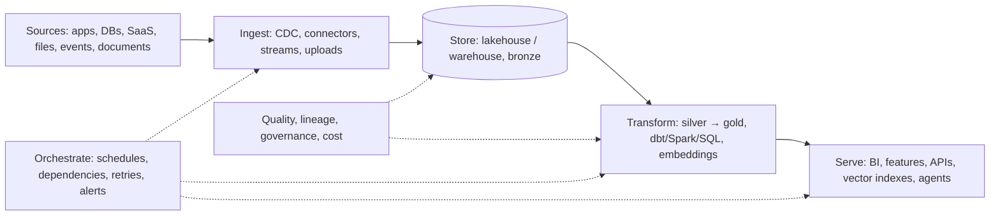

# 48. Data engineering and pipelines

> **What you need to be able to say:** the pipeline vocabulary (ingestion, transformation, orchestration, storage, serving), batch versus streaming, data modeling, quality and lineage, the modern stack on each cloud, and how RAG and agents turn documents into a data-engineering problem. Go deeper: Part 6 → *AWS cloud-native development guide*, the industry studies, *Databricks + AWS agentic AI reference*.

## 48.1 The pipeline in five stages

- **Ingestion**: change data capture from operational databases (Debezium, AWS DMS, Datastream, Fivetran/Airbyte connectors, Lakeflow Connect), SaaS APIs, event streams (Kafka/MSK/Confluent, Kinesis, Pub/Sub, Event Hubs), file drops (Auto Loader), and for AI: document connectors (SharePoint, Confluence, Drive, S3) with permissions.
- **Storage**: object storage with open table formats (Delta, Iceberg, Hudi) — the lakehouse — and/or a warehouse (Snowflake, BigQuery, Redshift, Synapse/Fabric); operational stores (Postgres, DynamoDB) for serving; vector and search indexes as derived stores.
- **Transformation**: SQL-first with dbt or Lakeflow Declarative Pipelines; Spark/PySpark for scale and unstructured data; Flink for streaming transforms; Python for parsing and enrichment (including LLM enrichment via AI functions).
- **Orchestration**: Airflow (and managed MWAA/Cloud Composer), Dagster (asset-based), Prefect, Lakeflow Jobs, Azure Data Factory, Step Functions; dependencies, retries, backfills, SLAs, alerts.
- **Serving**: BI semantic layers, feature stores, reverse ETL to SaaS, APIs, vector indexes and agent tools.

The table-format question follows from the storage choice. Interviewers in 2026 ask "Delta or Iceberg?" to see whether you understand what the choice decides. Apache Iceberg has become the interoperability standard: its REST catalog protocol lets Snowflake, BigQuery (BigLake), Databricks, Trino, Spark and Flink read and write the same tables; Databricks bought Tabular (Iceberg's founders) in 2024 and Unity Catalog serves Iceberg through the REST API while Delta UniForm writes Iceberg metadata alongside Delta; AWS added S3 Tables (managed Iceberg) and Snowflake open-sourced Polaris. Practical rule: inside a Databricks estate use Delta and turn on UniForm so outside engines can read; everywhere else default to Iceberg; Hudi only where its incremental-upsert strengths are already in use. The deeper decision is the *catalog*, because that is where permissions, lineage and the agent's table access live: one catalog per organization (Unity Catalog, Glue/Lake Formation with SageMaker Catalog, Knowledge Catalog on Google Cloud, Snowflake Horizon/Open Catalog, Purview with Fabric OneLake) with engines as clients, rather than each engine keeping its own view of who may read what. Trade-off to state out loud: an open format plus a shared catalog buys engine choice and avoids copies, at the price of table-maintenance jobs (compaction, snapshot expiry, manifest cleanup) that a proprietary warehouse does for you.

## 48.2 Batch versus streaming

Batch processes bounded data on a schedule (hourly/daily); simple, cheap, easy to backfill. Streaming processes unbounded events continuously (Kafka + Flink/Spark Structured Streaming/Amazon Managed Service for Apache Flink (formerly Kinesis Data Analytics)/Dataflow); needed for fraud, personalization, operational dashboards, real-time features. Concepts: event time vs processing time, watermarks and late data, windows (tumbling, sliding, session), exactly-once semantics (idempotent sinks, checkpoints), backpressure, schema registry (Avro/Protobuf). Micro-batch (minutes) is the pragmatic middle for most AI features. Design rule: stream only where the business needs sub-minute freshness; everything else is batch with good scheduling.

The streaming mechanics, with numbers:

- **Latency classes.** Spark Structured Streaming micro-batches land in seconds (a trigger of 10–60 s is typical in production; shorter triggers multiply small files); Flink processes event by event with sub-second latency and is the right engine for sub-second joins and windows. Most "real-time" business requirements are satisfied by a one-minute micro-batch at a fraction of the operational cost.
- **Watermarks.** A watermark says "I will wait N minutes for late events"; choose N from the observed lateness distribution (p99 lateness of 8 minutes means a 10-minute watermark drops under 1% of events) and route the rest to a late-arrivals table that a nightly batch reconciles. State the trade-off: a longer watermark means more completeness and more state and latency.
- **Exactly-once in practice.** Kafka transactions plus checkpointed offsets inside the engine, and an *idempotent sink* (MERGE on the event key, or upsert into Delta/Iceberg) at the end; "exactly-once" without an idempotent sink is a slogan.
- **Backfills.** Replay from Kafka while the retention window lasts (7 days by default; tiered storage extends it) or from the bronze layer; design every streaming job so it can also run over a bounded range, and parameterize the date range so a backfill of three years runs as a batch job with a cost cap instead of a week-long stream.
- **CDC specifics.** Debezium and the cloud CDC services emit before/after images and operation type; deletes must be propagated (and tombstoned), events are ordered per key by log position, the initial snapshot and the stream must be stitched without gaps, and a source schema change (a renamed column) must fail loudly rather than silently nulling a column — this is the single most common silent data-quality failure in agent tools backed by CDC.
- **Cost.** An always-on streaming cluster costs roughly three times a scheduled job doing the same hourly work; the 25% pipeline saving in chapter 47 came from recognizing that only two of nine streams needed sub-minute freshness.

## 48.3 Data modeling

- **Dimensional (Kimball)**: fact tables (events, measures) and dimension tables (who/what/where) in star schemas — still the backbone of analytics and of semantic layers that text-to-SQL depends on.
- **Data vault** for auditable, slowly evolving enterprise warehouses; **One Big Table/wide tables** for analytics at scale in columnar stores; **medallion layers** (bronze/silver/gold) as a lakehouse convention.
- **Slowly changing dimensions** (type 2 history), surrogate keys, conformed dimensions, grain decisions, partitioning and clustering for performance, and **data contracts** with producers (schemas, SLAs, ownership).
- **For AI**: a document table (id, source, ACL, version, text, metadata), a chunk table (chunk id, doc id, text, context, embedding model, vector), an eval table (question, reference, labels), and a trace table (runs, spans, tokens, cost) — all governed in the same catalog.

Contracts, SCD2 and physical layout in practice:

- **What a data contract contains.** Schema with types and nullability; the meaning and unit of each column; the grain ("one row per order line per day"); freshness and completeness SLAs; the owner and the on-call channel; PII classification per column; the change policy (additive changes allowed, breaking changes need a new version and a 30-day deprecation window); and the tests that enforce it, run on the producer's side. A contract that lives only in a wiki is a wish.
- **SCD type 2 mechanics.** Columns `valid_from`, `valid_to`, `is_current` and a row hash of the tracked attributes; the nightly MERGE closes the current row when the hash changes and inserts a new one; point-in-time joins use `event_time BETWEEN valid_from AND valid_to`. State the trade-off: history for every attribute makes the dimension grow and queries slower, so track only attributes whose history matters (price band, segment), not every column.
- **Physical layout.** Target 128 MB–1 GB files; partition by date (or by date and a low-cardinality key) and never by a high-cardinality column; use clustering (liquid clustering, Z-order, Iceberg sort orders) for the second access path; schedule compaction and snapshot expiry. The "small files problem" (millions of kilobyte files from a streaming job) can make a table ten times slower and more expensive to read than the same data in well-sized files.
- **Idempotent writes.** Every batch writes with MERGE on the business key or overwrites a partition atomically; a rerun of yesterday's job must produce yesterday's table, not duplicates — this is what makes backfills and incident recovery routine.

## 48.4 Quality, lineage, governance

Tests at every layer (not null, unique, referential, freshness, distribution; Great Expectations/Soda/dbt tests/Lakeflow expectations), quarantine tables for bad rows, data observability (Monte Carlo, Elementary, Lakehouse Monitoring), lineage (Unity Catalog, Knowledge Catalog on Google Cloud, Purview, OpenLineage/Marquez), ownership and SLAs per dataset, PII classification and masking, retention and deletion (GDPR), and cost per pipeline. A pipeline without tests is a rumor.

The RAG document pipeline is a governed dataset, not a script, and the same discipline applies to it:

- **ACL sync mechanics.** Store the allowed principals (users and groups) on the document row at ingestion, copy them to the chunk rows (or join at query time), and filter *before* vector search. The group-expansion trade-off: expanding groups to users at index time makes queries cheap but goes stale when membership changes; expanding at query time (look up the caller's groups, filter chunks whose ACL intersects) stays correct and costs one identity lookup per query, which is the right default. Nested groups, deny rules and "everyone except" semantics must be mirrored, and the test is a negative one: a user outside the group asks for the restricted document and must get an abstention.
- **Deletion propagation.** A GDPR erasure or a document removal must reach the document table, the chunk table, the vector index, the semantic cache, and the prompt/response logs — within a stated SLA (often 30 days, sometimes 72 hours by contract). Model it as a deletion event that each store consumes idempotently and a nightly audit that proves nothing referencing the id remains.
- **Change detection and cost.** Hash the parsed content; re-chunk and re-embed only when the hash changes. A corpus of 2M documents becomes roughly 40M chunks of about 400 tokens, so a full re-embedding is on the order of 16B tokens — a few hundred to a couple of thousand dollars at 2026 embedding prices, but rate-limited to days unless parallelized or batched — while the daily delta is usually under 1% of that.
- **Quality checks that matter.** Parse-failure rate per source (scanned PDFs fail at 5–15% without an OCR fallback), empty or near-empty chunks, duplicate rate (enterprise corpora routinely contain 20–40% near-duplicates), chunks without a source page for citation, and documents without an ACL from a source that has permissions — each a test with a threshold that fails the run.
- **Lineage to the page.** Every chunk row keeps document id, version, section path and page so a citation resolves to the exact source and an audit can answer "which chunk produced this sentence on 14 March".

## 48.5 The stack on each cloud (quick map)

| Need | AWS | Azure | Google Cloud | Databricks (any cloud) |
|---|---|---|---|---|
| Object storage / lake | S3 (S3 Tables for Iceberg) | ADLS Gen2 / OneLake | GCS | Delta Lake / Unity Catalog volumes |
| Warehouse / SQL | Redshift, Athena, SageMaker Lakehouse | Fabric Warehouse (Synapse still runs, but Microsoft's investment and new features are in Fabric, and Synapse components are being retired piecemeal) | BigQuery | Databricks SQL |
| Spark / ETL | Glue, EMR | Fabric Data Engineering, Synapse Spark, Data Factory | Dataproc, Dataflow | Lakeflow / Jobs |
| Streaming | Kinesis, MSK, Managed Service for Apache Flink | Event Hubs, Stream Analytics, Fabric RTI | Pub/Sub, Dataflow | Structured Streaming, Lakeflow |
| Orchestration | MWAA, Step Functions, Glue workflows | Data Factory, Fabric pipelines | Cloud Composer, Workflows | Lakeflow Jobs |
| Catalog / governance | Glue Catalog, Lake Formation, SageMaker Catalog (built on DataZone) | Purview, Fabric | Knowledge Catalog (renamed from Dataplex Universal Catalog in April 2026; the old Data Catalog was shut down in June 2026) | Unity Catalog |
| CDC / connectors | DMS, AppFlow, Glue connectors | Data Factory connectors | Datastream | Lakeflow Connect |
| Document AI | Textract, Bedrock Data Automation, Comprehend | Document Intelligence | Document AI | ai_parse_document |

## 48.6 Example use cases

- **Unified retail data model (resume use case).** Five sources (marketplace analytics, order management, web analytics, reviews, internal sales) ingested by API connectors and CDC into bronze; silver conforms SKUs, dates and currencies; gold tables feed forecasting features and the Ask-AI copilot's SQL tools; dbt tests on SKU uniqueness and date completeness; daily orchestration with backfill support.
- **Streaming features for ad ranking (resume use case).** Impression/click events through Kafka into Flink for windowed CTR features per entity; features written to an online store with point-in-time logs for training; daily batch for heavier aggregates; schema registry and exactly-once sinks.
- **Document pipeline for RAG.** Connectors pull documents with ACLs → parsing (Docling/Document Intelligence) → structure-aware chunking with contextual summaries → embeddings (recorded model version) → vector index upsert → ACL sync; event-driven on changes, with a nightly reconciliation; quality checks on parse failures and empty chunks; lineage from chunk to source page for citations.
- **Energy forecasting inputs (resume use case).** Plant sensor streams and weather feeds land hourly; expectations catch missing sensors; silver tables align timestamps and units; gold tables per plant feed the forecasting pipeline; freshness SLAs alert operators.
- **Telematics (resume use case).** Smartphone sensor batches ingested, map-matched to road segments, aggregated into driving-behavior features in Spark; late-arriving trips handled with event time; privacy filters applied before features leave the pipeline.
- **CDC from an ERP for agent tools.** Debezium/DMS streams order and inventory tables into the lakehouse; a Lakebase/Postgres replica serves the agent's `get_order` tool with millisecond latency; the agent never queries the ERP directly.
- **Erasure request end to end.** A customer invokes GDPR erasure; a deletion event carries the customer id to the CRM replica, the lakehouse tables (MERGE delete with vacuum so the data leaves the files, not just the current snapshot), the chunk table and vector index for any documents mentioning the customer, the semantic cache, and the trace store; a nightly audit query proves zero references; the evidence is kept for the regulator.
- **The renamed column.** The ERP team renames `cust_ref` to `customer_ref`; the CDC stream keeps flowing with nulls; the agent's `get_order` tool returns "no orders" for everyone for three hours. The fix is a contract test on the bronze schema that fails the pipeline on unexpected nulls above 1%, and an alert the producer team receives too.
- **Backfilling three years of events.** The clickstream model changed and gold tables need a rebuild; the job is parameterized by date, runs partitions in parallel on spot with a \$2,000 cap, writes to a new table version and swaps atomically, and the dashboards never see a half-built table.
- **The semantic layer for text-to-SQL.** The Ask-AI copilot's SQL accuracy jumps from 60% to 90% not from a better model but from a semantic layer: certified metrics with definitions, synonyms ("revenue" means net revenue excluding returns), join paths, and a 200-question gold set; the agent queries views, never raw tables, through a read-only role with a statement timeout and row limit.
- **Deduplicating a billion events.** Events arrive at-least-once; deduplicate within a window on event id using a watermark and a state store, then a nightly batch catches late duplicates beyond the window; state the trade-off between window length, state size and residual duplicate rate (0.01% after a one-hour window in the telematics case).
- **Streaming features with point-in-time logs.** Every online feature write is logged with its timestamp so training sets can be rebuilt as the model would have seen them; without the log the offline AUC is a fiction.

Behind the use cases sit the SQL and Spark mechanics interviewers ask about: window functions for "latest record per key" (`ROW_NUMBER() OVER (PARTITION BY key ORDER BY ts DESC)`) and for sessionization; gaps-and-islands; `MERGE` for upserts and SCD2; handling skew (salting the hot key, adaptive query execution, broadcast joins for small dimensions — know the default broadcast threshold is 10 MB in Spark and why you raise it); partition pruning and why a function on the partition column defeats it; reading an `EXPLAIN` plan for a shuffle you did not expect; the small-files problem and compaction; incremental models in dbt (`is_incremental()` with a lookback window for late data); idempotent backfills; Spark memory errors (executor memory versus too many small partitions versus a Cartesian join); and why `SELECT *` on a columnar store costs money. Answer each with a mechanism and a number and the interview moves on quickly.

**Interview line:** *"Data engineering for AI is still data engineering: ingest with CDC and connectors, land in a governed lakehouse, transform in layers with tests and lineage, orchestrate with retries and backfills, and serve — now including chunk tables, vector indexes and agent tools that inherit the catalog's permissions."*
