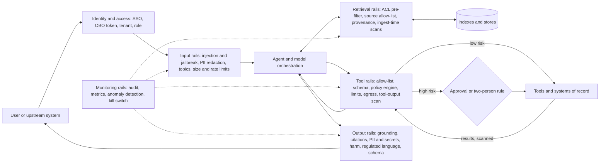

# 53b. Enterprise guardrails: architecture, platforms, policy and governance

> **What you need to be able to say:** what a guardrail is and what it is not (it lowers risk; it does not replace authorization at the data layer — chapter 30); a layered guardrail architecture from identity to kill switch; what the cloud guardrail services and the open-source and specialist tools actually do and how each is configured; how to lock down coding agents; how to measure a guardrail (false positives, false negatives, latency, cost, drift); and how NIST AI RMF, ISO/IEC 42001, the EU AI Act, OWASP and sector rules map onto controls and an operating model. Chapter 53 covers red teaming; this chapter is the control layer itself.

## 53b.1 What guardrails are, and what they are not

A guardrail is a runtime control that inspects something flowing into or out of a model, a retrieval step or a tool, then allows, blocks, transforms (masks, rewrites) or escalates it, and leaves an audit record. Four questions classify any guardrail:

| Question | Options |
|---|---|
| Where does it sit? | identity, input, retrieval, tool/action, output, monitoring |
| How does it decide? | deterministic rule (regex, schema, allow-list, policy engine); ML classifier (content filters, Prompt Guard); LLM judge (self-check rails, groundedness); formal verification (Bedrock Automated Reasoning checks) |
| What happens on a hit? | block; mask or transform; annotate and log; route to a human; trip a circuit breaker |
| Where is it enforced? | application code; a gateway outside the agent's code; the model platform |

What guardrails are **not**:

1. **Authorization.** A content filter cannot know that this user may not see that customer's record; row filters, ACL-filtered retrieval, on-behalf-of tokens and scoped tools can (chapter 30). If a classifier is the only thing between an agent and data the user may not see, the design is wrong.
2. **A guarantee.** Classifiers lower attack success rates; they do not bound them. Meta's Prompt Guard 2 model card warns about adaptive attacks, and Llama Guard 4 reports 69% recall at an 11% false-positive rate on its own English output benchmark. What must never happen needs a deterministic control.
3. **A substitute for narrow design.** An agent with a `refund(amount ≤ 100)` tool needs fewer filters than one with a SQL console.
4. **Compliance by themselves.** Auditors ask for a governed process — risk assessment, test evidence, oversight, incident handling (53b.6); guardrail logs are evidence for it.

**Rule of thumb:** deterministic controls for what must never happen, probabilistic guardrails to lower the rate of what should rarely happen, and humans for the residual that matters.

## 53b.2 A layered architecture



| Layer | Typical controls | Mechanism | Typical added latency | Stops |
|---|---|---|---|---|
| Identity and access | SSO, OBO token exchange, tenant and role claims | deterministic | milliseconds | the agent acting as a superuser |
| Input | injection and jailbreak classifiers, PII redaction, denied topics, limits | classifier + rules | ~20–150 ms per classifier | direct injection, personal data reaching models and logs, off-scope use |
| Retrieval | ACL filter inside the query, source allow-lists, version filters, provenance labels, scans at ingest | deterministic at query time | near zero if scanning happens at ingest | over-sharing, poisoned or injected documents |
| Tool and action | allow-lists, argument schemas, policy engine, rate and spend limits, approvals, egress allow-lists | deterministic | about 1–10 ms per policy decision, plus human time | excessive agency, exfiltration, destructive actions |
| Output | grounding and citation checks, PII and secrets scans, harm filters, regulated-language checks, schema validation | mixed | 50 ms to 2 s (LLM judges are the slow part) | invented commitments, leaks, non-compliant claims |
| Monitoring | audit events, hit-rate metrics, anomaly detection, kill switch | statistical, asynchronous | none on the request path | slow-burn attacks, drift, uncontained incidents |

**Input rails.** Run injection classifiers on the user turn *and* on every untrusted payload (uploaded documents, tool outputs, fetched pages). Prompt Guard 2 reads 512 tokens, so long content must be split and scanned in parallel; a classifier that silently truncates is a bypass. Redact personal data with reversible pseudonymization: typed placeholders (`<PERSON_1>`, `<IBAN_1>`) before the model and the logs, the mapping held in a session-scoped vault, re-identification only after output checks. Define denied topics with examples and test them with paraphrases; cap input size, attachment types and request rates.

**Retrieval rails.** Apply the ACL filter inside the vector query (pre-filter), never by post-filtering the top-k, which starves results and leaks if done after the model has seen the chunks. Keep source allow-lists and render retrieved text as quoted data with its source and trust level. Scan at ingest rather than per query: run injection and PII classifiers once per document version, store the verdict as metadata, quarantine hits (Azure Prompt Shields has a document-attack mode; Model Armor screens PDF, CSV, text and Office files up to 4 MB). Poisoning requires write access, so restrict who can write to indexed sources, hash approved documents, alert on bursts of new or edited files and keep versions for rollback.

**Tool and action rails.** Deterministic and outside the model: per-agent tool allow-lists; strict JSON schemas (types, enums, ranges, ID patterns; unknown fields rejected); a policy engine evaluated by the gateway on every call — Cedar (Amazon Verified Permissions, AgentCore Policy), OPA/Rego, or OpenFGA (a CNCF incubating project) for relationship questions such as "is this user on the account team?"; rate and spend limits per user, agent and day; approval thresholds; a two-person rule for destructive or irreversible actions (deletes, payments above a limit, production changes); dry runs with diffs; idempotency keys; and an egress allow-list so injected instructions cannot post data to an arbitrary URL. An illustrative Cedar policy in the AgentCore Policy style (default deny; any matching `forbid` wins):

```cedar
// Illustrative. Support agents may refund up to 500; larger amounts fall to default deny
// and are routed to an approval flow. Deleting customers is never allowed through the agent.
permit (
  principal is AgentCore::OAuthUser,
  action == AgentCore::Action::"RefundTool___process_refund",
  resource == AgentCore::Gateway::"arn:aws:bedrock-agentcore:eu-central-1:111122223333:gateway/support"
) when {
  principal.hasTag("role") && principal.getTag("role") == "support_agent" &&
  context.input.amount <= 500
};

forbid (principal, action == AgentCore::Action::"CrmTool___delete_customer", resource);
```

A similar rule in OPA (Rego v1 syntax), returning a three-way answer the gateway acts on:

```rego
package agent.tools

default decision := "deny"

decision := "allow" if {
  input.tool == "issue_refund"
  input.args.amount <= 100
  "support" in input.user.groups
}

decision := "needs_approval" if {
  input.tool == "issue_refund"
  input.args.amount > 100
  input.args.amount <= 1000
}
```

**Output rails.** Check grounding (Bedrock's contextual grounding check scores grounding and relevance against thresholds from 0 to 0.99; Azure's groundedness detection is in preview; or a calibrated LLM judge) and verify citations deterministically: each must resolve to a retrieved chunk the user may see, and quoted text must appear verbatim. Scan for personal data and secrets (regex, checksums, entropy, known key formats). Catch regulated language with word lists for hard phrases ("guaranteed returns", "risk-free"), an LLM judge whose rubric cites rule IDs for softer claims, and Automated Reasoning checks where rules can be formalized (eligibility, limits). Re-validate structured output against its schema server-side before anything consumes it.

**Monitoring rails.** One audit event per decision — principal, agent and version, tool, argument hash, policy decision and reason, guardrail verdicts, model and prompt versions, trace ID (chapter 29). Metrics: hit rate per rail and category, block rate, human override rate, approval latency. Anomaly detection: tool calls per session, new egress domains, spend per user, sudden category shifts. A **kill switch**: feature flags that disable one tool, one agent or all write actions within minutes, plus a safe mode that routes to humans — drilled quarterly.

## 53b.3 Platform options compared

| Product | What it provides | How it is configured | Watch-outs |
|---|---|---|---|
| **Amazon Bedrock Guardrails** | content filters (hate, insults, sexual, violence, misconduct, prompt attack; text and image), denied topics, word filters with a managed profanity list, sensitive-information filters (PII entities and regex; block or mask), contextual grounding and relevance checks, Automated Reasoning checks | a versioned guardrail resource attached to InvokeModel/Converse, or the ApplyGuardrail API on text from any model; Classic or Standard tier; organization-wide enforcement through AWS Organizations policies (GA April 2026); evaluated at AgentCore Gateway through AgentCore Policy (GA June 2026) | priced per 1,000-character text unit: $0.15 content filters and denied topics, $0.10 PII and grounding, regex and word filters free, $0.17 per Automated Reasoning policy; Standard tier (more languages, stronger prompt-attack detection, harmful content hidden in code) requires cross-Region inference; Automated Reasoning is detect-only, English (US), no streaming |
| **Azure AI Content Safety and Microsoft Foundry guardrails** | harm analysis of text and images (hate, sexual, violence, self-harm, with severity levels), Prompt Shields for user-prompt and document (indirect) attacks, protected-material detection for text and code, groundedness detection (preview), task adherence for agent tool use, custom categories, PII | in Foundry a guardrail is a named set of controls, each with a risk, intervention points (user input and output; tool call and tool response for agents, in preview) and an action (annotate, or annotate and block); models default to `Microsoft.DefaultV2`; standalone REST APIs serve any app | an agent's guardrail fully overrides its model's; filtered prompts return HTTP 400 with code `content_filter`; switching filters off needs Microsoft approval; check GA versus preview per control |
| **Google Cloud Model Armor** | responsible-AI filters (hate speech, harassment, sexually explicit, dangerous; CSAM always on) with confidence levels, prompt-injection and jailbreak detection, Sensitive Data Protection (basic, or advanced templates with de-identification), malicious-URL detection, document screening | templates per application; floor settings impose minimums at organization, folder or project level; inspect-only or inspect-and-block; inline with Agent Gateway, Apigee, Gemini Enterprise, Google Cloud MCP servers and Service Extensions; a REST API for any model or cloud | 2 million tokens a month free, then $0.10 per million; the injection filter needs at least three words; files up to 4 MB; filters tested on nine languages |
| **NVIDIA NeMo Guardrails** | open-source toolkit with input, dialog, retrieval, execution (tool) and output rails; self-check, jailbreak heuristics, fact-checking; NemoGuard models for content safety, topic control and jailbreak detection; integrations such as Presidio, Llama Guard, Guardrails AI, Cisco AI Defense, CrowdStrike, F5, Pangea and Trend Micro | `config.yml` plus Colang flows; Python SDK, FastAPI server, LangChain/LangGraph integration, or a Kubernetes microservice | self-check rails add LLM calls (latency and cost); Colang 1.0 and 2.0 coexist — pick one per project |
| **Guardrails AI** | Python framework: validators from Guardrails Hub (PII, toxicity, competitor mentions, regex, valid JSON and more) combined into Guards with on-fail policies (exception, fix, reask, filter, refrain, noop); Pydantic-based structured output | code, optionally a server exposing guarded endpoints | validator quality varies; evaluate each one you adopt |
| **Meta Llama Guard 4 and Prompt Guard 2** | open-weight classifiers: Llama Guard 4 (12B, natively multimodal, 14 hazard categories S1–S14, outputs `safe` or `unsafe` with categories); Prompt Guard 2 (86M and 22M parameters, benign/malicious for injection and jailbreak) | self-hosted or via a provider endpoint; thresholds; fine-tune on your traffic | Prompt Guard 2 86M: AUC 0.998, 97.5% recall at 1% false positives, 92.4 ms on an A100 for 512 tokens; 22M: 88.7% recall, 19.3 ms — the card warns about adaptive attacks |
| **Lakera Guard (now part of Check Point)** | API for prompt attacks, data leakage and content moderation; red teaming; workforce shadow-AI discovery | SaaS with per-application policies | vendor-reported sub-50 ms latency and 0.01% production false positives — measure on your own traffic |
| **Microsoft Presidio** | open-source PII detection (NER, regex, checksums, context words) and anonymization (replace, redact, mask, hash, encrypt) for text and images | Python library or containers; custom recognizers per locale | quality depends on your recognizers (German IBANs and tax IDs are your job) |

**Bedrock: a guardrail definition** (illustrative CreateGuardrail body; prompt-attack filtering applies to input only, so its output strength is `NONE`; guardrail profile IDs vary by geography):

```json
{
  "name": "retail-banking-assistant",
  "blockedInputMessaging": "I can't help with that request.",
  "blockedOutputsMessaging": "I can't share that here. Let me connect you with an advisor.",
  "contentPolicyConfig": {
    "filtersConfig": [
      {"type": "PROMPT_ATTACK", "inputStrength": "HIGH", "outputStrength": "NONE"},
      {"type": "MISCONDUCT", "inputStrength": "MEDIUM", "outputStrength": "HIGH"}
    ],
    "tierConfig": {"tierName": "STANDARD"}
  },
  "topicPolicyConfig": {
    "topicsConfig": [{"name": "InvestmentAdvice", "type": "DENY",
      "definition": "Recommendations to buy, sell or hold specific securities or crypto assets.",
      "examples": ["Should I buy Tesla stock now?", "Is bitcoin a good investment this year?"]}],
    "tierConfig": {"tierName": "STANDARD"}
  },
  "sensitiveInformationPolicyConfig": {
    "piiEntitiesConfig": [{"type": "CREDIT_DEBIT_CARD_NUMBER", "action": "BLOCK"},
                          {"type": "EMAIL", "action": "ANONYMIZE"}],
    "regexesConfig": [{"name": "CustomerId", "pattern": "CUST-\\d{8}", "action": "ANONYMIZE"}]
  },
  "contextualGroundingPolicyConfig": {
    "filtersConfig": [{"type": "GROUNDING", "threshold": 0.85}, {"type": "RELEVANCE", "threshold": 0.7}]
  },
  "crossRegionConfig": {"guardrailProfileIdentifier": "eu.guardrail.v1:0"}
}
```

Publish a version, reference it with `guardrailConfig` (identifier, version, trace) on Converse, and call ApplyGuardrail with `source` set to `INPUT` or `OUTPUT` to screen text from non-Bedrock models or from tools.

**Model Armor: a template** (flags as in Google's documentation; region and values illustrative):

```bash
gcloud model-armor templates create bank-assistant --project=my-project --location=us-central1 \
  --rai-settings-filters='[{"filterType":"HARASSMENT","confidenceLevel":"MEDIUM_AND_ABOVE"},{"filterType":"DANGEROUS","confidenceLevel":"MEDIUM_AND_ABOVE"}]' \
  --pi-and-jailbreak-filter-settings-enforcement=enabled \
  --pi-and-jailbreak-filter-settings-confidence-level=MEDIUM_AND_ABOVE \
  --malicious-uri-filter-settings-enforcement=enabled \
  --basic-config-filter-enforcement=enabled
```

The application then sends each prompt and response through the template's sanitize methods (`sanitizeUserPrompt`, `sanitizeModelResponse`) before and after the model.

**NeMo Guardrails: rails and a dialog flow** (illustrative; Colang 1.0):

```yaml
# config.yml
models:
  - type: main
    engine: openai
    model: gpt-4.1-mini
  - type: content_safety
    engine: nim
    model: nvidia/llama-3.1-nemoguard-8b-content-safety
rails:
  config:
    sensitive_data_detection:
      input:
        entities: [PERSON, EMAIL_ADDRESS, IBAN_CODE]
  input:
    flows:
      - content safety check input $model=content_safety
      - jailbreak detection heuristics
      - mask sensitive data on input
  output:
    flows:
      - content safety check output $model=content_safety
```

```colang
define user ask for investment advice
  "Which stocks should I buy?"
  "Is now a good time to buy crypto?"

define bot refuse investment advice
  "I can't give investment advice. I can explain our accounts or connect you with a licensed advisor."

define flow investment advice
  user ask for investment advice
  bot refuse investment advice
```

**Guardrails AI: validating a draft reply** (illustrative; validators come from the Hub via `guardrails hub install`):

```python
from guardrails import Guard, OnFailAction
from guardrails.hub import DetectPII, ToxicLanguage

guard = Guard().use(
    DetectPII(pii_entities=["EMAIL_ADDRESS", "PHONE_NUMBER"], on_fail=OnFailAction.FIX)
).use(
    ToxicLanguage(threshold=0.5, validation_method="sentence", on_fail=OnFailAction.EXCEPTION)
)
outcome = guard.validate(draft_reply)  # FIX masks the PII; EXCEPTION raises on toxic sentences
```

**How to choose:** platform-native where the traffic already flows (it enforces outside the agent's code); open-weight classifiers, NeMo, Guardrails AI or Presidio where you need on-premises control, custom flows across providers or cost at volume — decided on false positives and misses measured on your own traffic (53b.5), not on datasheets.

## 53b.4 Guardrails for coding agents and enterprise harnesses

Coding agents combine a shell, source code, credentials and the internet. Three incidents define the threat model. In May 2025 Invariant Labs showed a malicious issue in a public repository leading an agent with the GitHub MCP server to copy private-repository data into a public pull request. In August 2025 the Nx "s1ngularity" supply-chain attack shipped a post-install script that ran installed AI CLIs with safeguards off — `claude --dangerously-skip-permissions`, `gemini --yolo`, `q chat --trust-all-tools` — to inventory secrets and wallets. In July 2025 a Replit agent deleted a production database during a code freeze (chapter 54b). Configuration, not instructions, would have stopped each.

**Managed policy the user cannot override.** Claude Code reads `managed-settings.json` from `/Library/Application Support/ClaudeCode/` (macOS), `/etc/claude-code/` (Linux and WSL) or `C:\Program Files\ClaudeCode\` (Windows), or receives it through MDM or as server-managed settings from the admin console; managed values beat user, project and command-line settings. An illustrative baseline (chapter 52a covers the harness itself):

```json
{
  "permissions": {
    "deny": ["Read(./.env)", "Read(./.env.*)", "Read(./secrets/**)", "Bash(git push --force *)"],
    "ask": ["Bash(git push *)"],
    "disableBypassPermissionsMode": "disable"
  },
  "allowManagedPermissionRulesOnly": true,
  "allowManagedHooksOnly": true,
  "allowManagedMcpServersOnly": true,
  "allowedMcpServers": [
    {"serverUrl": "https://mcp.internal.example.com/*"},
    {"serverCommand": ["npx", "-y", "@modelcontextprotocol/server-filesystem", "."]}
  ],
  "deniedMcpServers": [{"serverUrl": "https://*.untrusted.example.com/*"}],
  "sandbox": {
    "enabled": true,
    "network": {"allowManagedDomainsOnly": true,
                "allowedDomains": ["github.com", "pypi.org", "registry.npmjs.org"]}
  }
}
```

Four details matter. `disableBypassPermissionsMode` removes exactly the flag the Nx malware relied on. MCP allow-lists should use `serverUrl` or `serverCommand` entries, because a `serverName` is just a label any user can assign. Command-pattern rules are easy to sidestep (`/usr/bin/curl`, `python -c ...`), so the sandbox's network allow-list, not a Bash deny list, is the real egress control. And `allowManaged*Only` locks stop project files in a cloned repository from adding their own permissions, hooks or servers.

**Hooks for what must always happen.** A `PreToolUse` hook receives the proposed call as JSON and can deny it deterministically (illustrative):

```python
#!/usr/bin/env python3
# PreToolUse hook for Bash: deny destructive commands and explain why.
import json, re, sys
cmd = json.load(sys.stdin).get("tool_input", {}).get("command", "")
for pattern in (r"\brm\s+-rf\s+/", r"terraform\s+(apply|destroy)", r"kubectl\s+delete", r"DROP\s+(TABLE|DATABASE)"):
    if re.search(pattern, cmd, re.IGNORECASE):
        print(json.dumps({"hookSpecificOutput": {"hookEventName": "PreToolUse",
              "permissionDecision": "deny", "permissionDecisionReason": f"Blocked by policy: {pattern}"}}))
        break
sys.exit(0)
```

**CI and autonomous runs.** Ephemeral runners with no production credentials; a workflow token limited to `contents: read` and `pull-requests: write`; short-lived OIDC roles scoped to non-production; headless runs with an explicit tool allow-list; a pull request as the only output, behind branch protection with human review; text from outside contributors treated as untrusted input, never as a trigger for runs holding write tokens; secrets scanning on every diff; bypass modes only inside disposable sandboxes.

**MCP governance.** An approved-server registry, pinned versions, review of tool descriptions on every update (a changed description can carry injected instructions), a gateway with per-user OAuth and audit (chapter 20b), and tool decisions exported through OpenTelemetry to the SIEM.

## 53b.5 Measuring guardrails

Every rail is a classifier with a confusion matrix; measure it like one, per category and per use case.

**Base rates decide everything.** Take 100,000 requests a day of which 0.5% (500) are attacks, and a detector with 95% recall and a 1% false-positive rate: it catches 475, misses 25 and blocks 995 legitimate requests — two of every three blocks are wrong. At a 0.1% false-positive rate it blocks about 100 legitimate requests, usually at some cost in recall. Hence two thresholds: block only at high confidence, and send the grey zone to a stronger second stage (an LLM judge, a human, or "allowed, but no tools this turn").

| Metric | How to measure | Typical use |
|---|---|---|
| False-positive rate | benign blocked ÷ benign, on a "hard negatives" set (security staff discussing injection, clinicians discussing overdoses) | per use case, reviewed monthly |
| Attack success rate | attacks passed ÷ attacks, per category, on red-team suites | release gate |
| Added latency | p50 and p95 per rail | a budget, e.g. ≤150 ms at p95 for synchronous input rails |
| Cost | per 1,000 requests, per rail | budget line next to model cost |
| Override rate | blocks overturned by human reviewers | a rising rate means thresholds are too tight |
| Drift | week-over-week change in hit rates per category | alert at twice the baseline |

**Latency and cost.** Run input rails in parallel with retrieval and planning; check output in streamed chunks; scan documents once at ingest; reserve LLM-judge rails for high-risk turns. Worked cost: 4,000 characters in and 2,000 out through Bedrock content filters, denied topics, PII and grounding is about six text units at roughly $0.0005 each — $0.003 a request, $3,000 per million — and grounding also bills the source passages, so long contexts dominate. A million requests of about 1,500 tokens through Model Armor is 1.5 billion tokens, about $150 after the free tier. Choose on measured quality first, then cost.

**Red-team suites and drift.** On every change to a guardrail, model or prompt, run garak, PyRIT or promptfoo (chapter 53), public benchmarks (AgentDojo and InjecAgent for agent injection, BIPIA for indirect injection, HarmBench and JailbreakBench for jailbreaks), your incident cases and your hard negatives. Pin guardrail versions (Bedrock versions are immutable snapshots) and re-baseline when a vendor updates a classifier. Review a weekly sample of blocked and passed traffic, and watch languages: Bedrock's Classic tier covers English, French and Spanish; Model Armor documents nine tested languages.

**Tune per use case.**

| Use case | Tighten | Loosen | Why |
|---|---|---|---|
| Bank customer assistant | prompt attack at high; investment and tax advice denied; card numbers blocked; grounding ≥0.85 on policy answers | harm filters at medium | regulatory exposure and commitments |
| Clinical documentation | grounding against the transcript; PHI out of application logs | harm and self-harm filters on clinical vocabulary ("overdose" is a finding, not an attack) | false positives here block care |
| Internal coding agent | injection scans on tool outputs and fetched pages; secrets scans; egress | content filters | the risk is actions, not words |
| Marketing generation | claims and disclosure checks; brand and competitor terms | default harm filters | the risk is non-compliant claims |
| HR assistant | personal data; topics on individual performance, health and protected traits | — | discrimination and monitoring risk |

## 53b.6 Governance frameworks, and how they map to controls

- **NIST AI RMF 1.0** (January 2023) organizes work into Govern, Map, Measure and Manage; its **Generative AI Profile, NIST AI 600-1** (July 2024), names twelve risks — CBRN information, confabulation, dangerous or hateful content, data privacy, environmental impact, harmful bias and homogenization, human-AI configuration, information integrity, information security, intellectual property, obscene or abusive content, and value-chain and component integration — each with suggested actions. NIST says the RMF is being revised under the 2025 AI Action Plan; a concept note for a critical-infrastructure profile followed in April 2026. Voluntary, but the common US vocabulary.
- **ISO/IEC 42001:2023** is a certifiable AI management system — policy, roles, risk and impact assessment, lifecycle controls, supplier management, monitoring, internal audit, improvement — with reference controls in Annex A; procurement increasingly asks for it, alongside ISO/IEC 23894 (risk guidance) and ISO/IEC 42005 (impact assessment) (verify current editions).
- **EU AI Act.** High-risk providers need risk management (Art. 9), data governance (10), technical documentation (11), automatic logging (12), instructions for deployers (13), human oversight (14), accuracy, robustness and cybersecurity (15), a quality management system (17), post-market monitoring (72) and serious-incident reporting (73). Deployers (26) use systems as instructed, assign competent human oversight, keep logs for at least six months and inform workers' representatives before workplace use; public bodies, private providers of public services, and credit and life/health-insurance deployers run fundamental-rights impact assessments (27). Article 50 adds transparency duties. Fines reach €35 million or 7% of worldwide turnover for prohibited practices and €15 million or 3% for most other breaches. Dates as amended by the Digital Omnibus are in 54b.2.
- **OWASP.** The LLM Top 10 2026 (posted on genai.owasp.org on 3 August 2026, announced on 1 September 2026) — LLM01 prompt injection, LLM02 sensitive information disclosure, LLM03 excessive agency, LLM04 supply chain, LLM05 data and model poisoning, LLM06 unbounded consumption, LLM07 misinformation, LLM08 hidden context exposure, LLM09 vector and embedding weaknesses, LLM10 improper output handling — maps closely onto the rails above. It replaced the 2025 edition, in which excessive agency was LLM06 and hidden context exposure's narrower predecessor, system prompt leakage, was LLM07, so policies and tickets written in 2025 carry the old numbers (chapter 30 has both orders). The separate Top 10 for Agentic Applications (December 2025, ASI01–ASI10) covers goal hijack, tool misuse, identity abuse, memory poisoning and rogue agents.
- **Sector rules** (detail in 54b.2): US bank model-risk guidance (SR 26-2) leaves generative and agentic AI to banks' own frameworks; FINRA Rules 2210 and 3110; HIPAA; the NAIC bulletin; New York City Local Law 144 bias audits for hiring tools; Colorado SB 26-189; GDPR Articles 22 and 35; German co-determination.

| Requirement | Control | Evidence an auditor accepts |
|---|---|---|
| AI Act Art. 12; FINRA books and records; HIPAA audit controls | audit event per decision, retention policy | log schema, retention configuration, sample extracts |
| AI Act Art. 14; FINRA 3110 supervision | approval thresholds, two-person rule, kill switch | approval logs, kill-switch drill records |
| AI Act Art. 15; OWASP LLM01 and LLM03 (2026 numbering; LLM06 in 2025) | input, retrieval and tool rails; policy engine | red-team results, versioned guardrail configs, policy unit tests |
| AI Act Art. 10; GDPR minimization | ACL-filtered retrieval, PII redaction, source allow-lists | lineage, DPIA, redaction test results |
| NIST Measure; ISO 42001 performance evaluation | eval suites, guardrail error-rate dashboards | eval reports per release, dashboards |
| NAIC bulletin; LL144; Colorado SB 26-189 | outcome bias testing, notices, adverse-decision explanations | bias audits, notice templates, explanation logs |
| ISO 42001 supplier management; NAIC third-party oversight | model and MCP-server allow-lists, vendor reviews | inventory, assessments, contracts |

**An operating model that makes this real.**

| Tier | Examples | Minimum controls | Approval |
|---|---|---|---|
| 0 Personal productivity | drafting with an enterprise assistant, no customer data | sanctioned tool, SSO, logging, acceptable-use training | self-service |
| 1 Internal decision support | policy Q&A, code assistants, summaries a person checks | + input and output rails, ACL retrieval, eval set, named owner | platform team |
| 2 Customer-facing information | public assistant answering from documentation | + grounding, AI disclosure, red team, monitoring, kill switch | review board fast track (target 10 working days) |
| 3 Actions or consequential decisions | refunds, claims, credit, hiring, clinical documentation | + policy engine, approvals, bias testing, documentation pack, incident runbook, validation | full board with legal, risk and privacy, and the works council where employees are affected |
| Prohibited | AI Act Article 5 practices, such as emotion recognition at work | — | not pursued |

The **review board** (product, engineering, security, privacy, legal or compliance, risk, HR where staff are affected) meets weekly and records each decision with conditions and a re-review date. The **inventory** holds, per use case: owner, tier, purpose, model and prompt versions, tools and permissions, data sources, guardrail configuration version, eval results, approvals, incidents and retirement date; agent registries (chapter 30) can hold the runtime half. **Incident response:** kill switch first, preserve traces, classify severity, notify — personal-data breaches to the supervisory authority within 72 hours under GDPR; serious incidents from high-risk systems within 15 days under Article 73 (two days for widespread or critical-infrastructure incidents, ten for a death) once those obligations apply — then a postmortem whose cases join the eval and red-team suites.

## 53b.7 Scenarios across industries

- **Bank customer assistant.** Risks: invented fees or rates, investment advice, account-takeover attempts, injection in uploaded documents. Controls: OBO identity with step-up authentication for money movement; balance tools that resolve the caller internally; payments only through deterministic flows with confirmation; the Bedrock definition in 53b.3 or its equivalent; AI disclosure; conversations retained under recordkeeping rules. Measure: resolution without repeat contact in seven days, complaints, false-block rate.
- **Healthcare documentation (ambient scribe).** Risks: hallucinated findings or medications, wrong-patient notes, PHI leakage. Controls: BAAs with every vendor; context bound to one encounter; an output rail that checks each statement of the draft note against the transcript and flags unsupported ones; medication and dose cross-checks against the EHR list; clinician signs every note; harm filters relaxed for clinical vocabulary; PHI kept out of application logs. Measure: clinician edit rate, critical errors in a weekly audited sample, documentation time saved.
- **HR assistant.** Risks: disclosing colleagues' data, implicit performance monitoring, discrimination. Controls: tools that resolve the caller (no employee-ID argument); policy documents filtered by country and grade; denied topics on individual performance and health; no candidate ranking without a Tier 3 review (Annex III, Local Law 144); a works agreement fixing purpose, retention and "no performance evaluation from logs". Measure: deflection, correct escalations, zero cross-employee disclosures in negative tests.
- **Coding agents in CI.** Controls as in 53b.4. Measure: blocked-command rate, pull-request acceptance, secrets incidents (target zero), time to revoke a leaked credential.
- **Marketing compliance for financial products.** Risks: promissory or misleading claims, missing disclosures. Controls: generator, then rule checks (banned phrases, required disclosures, rates stated with conditions), then an LLM judge citing rule IDs, then deterministic or Automated Reasoning checks of numeric claims, then approval by a registered principal before use as FINRA Rule 2210 requires for retail communications, then archiving with versions. Measure: escapes found in compliance sampling, judge agreement with reviewers, cycle time.

## 53b.8 Interview questions with model answers

**"What is the difference between guardrails and authorization?"** — "Authorization decides what this principal may see and do, deterministically, where the data and tools live: OBO tokens, row filters, ACL-filtered retrieval, a policy engine on tool calls. Guardrails inspect content and behaviour and lower the rate of bad outcomes probabilistically. I never let a classifier be the only thing between a user and data they may not see."

**"Design guardrails for an agent that issues refunds."** — "The agent acts as the customer through OBO, and the refund tool checks that the order belongs to the session's customer rather than trusting an argument. A policy engine at the gateway allows refunds up to 100, routes up to 1,000 to approval and denies above; idempotency keys stop duplicates; daily limits stop loops. Injection classifiers screen messages and uploaded receipts; answers are grounded in policy documents with verified citations. Every decision is audited, and a kill switch disables the tool in minutes."

**"How do you choose between Bedrock Guardrails, Model Armor, Azure and open source?"** — "Platform-native where the traffic flows, because it enforces centrally and outside the agent's code — Bedrock with Organizations policies and AgentCore, Foundry guardrails at tool-call intervention points, Model Armor floor settings. Open-weight classifiers for on-premises inference, fine-tuning or cost at volume. Then I measure false positives and attack success on our own traffic."

**"Your injection classifier blocks 3% of legitimate traffic. What now?"** — "Break the blocks down by category; it is usually one pattern, such as code snippets or an under-represented language. Then two thresholds — block only at high confidence, send the grey zone to a second-stage judge or allow it without tools — fix or swap the classifier for that slice, add the cases to the hard-negatives set, and gate future changes on false-positive and attack-success rates together."

**"How do you stop a coding agent from leaking secrets or deleting production?"** — "No production credentials in its environment; a network sandbox with an egress allow-list; managed settings that deny secret files, disable bypass mode and pin MCP servers by URL or command; PreToolUse hooks for destructive commands; ephemeral CI runners with least-privilege tokens; human review on every pull request. Nx showed malware will switch the bypass on for you, so it must be impossible, not discouraged."

**"Map our controls to the EU AI Act and ISO 42001."** — "Audit events cover Article 12 logging; approvals and the kill switch cover Article 14 oversight; red-team results and versioned guardrail configs evidence Article 15; ACL retrieval and redaction support Article 10 and GDPR; the risk tiers, review board, inventory and incident process are the management system ISO 42001 certifies."

**"How do you know guardrails still work in six months?"** — "Pinned versions, a red-team and hard-negative suite in CI on every change, weekly sampled review of blocks and passes, hit-rate dashboards with alerts at twice baseline, re-baselining after vendor updates, and every incident turned into a permanent test case."

**Interview line:** *"Authorization where the data lives, guardrails on top: identity and a policy engine decide what the agent may do, deterministic rails make the must-never-happen impossible, classifiers lower the rate of the should-rarely-happen with thresholds tuned per use case, humans approve what matters, and every decision is audited, measured for false positives and misses, and mapped to the NIST, ISO 42001 and AI Act evidence an auditor will ask for."*

## Sources

- [Amazon Bedrock Guardrails: user guide](https://docs.aws.amazon.com/bedrock/latest/userguide/guardrails.html)
- [Amazon Bedrock: CreateGuardrail API reference](https://docs.aws.amazon.com/bedrock/latest/APIReference/API_CreateGuardrail.html)
- [Amazon Bedrock Guardrails: safeguard tiers](https://docs.aws.amazon.com/bedrock/latest/userguide/guardrails-tiers.html)
- [Amazon Bedrock Guardrails: Automated Reasoning checks](https://docs.aws.amazon.com/bedrock/latest/userguide/guardrails-automated-reasoning-checks.html)
- [Amazon Bedrock pricing](https://aws.amazon.com/bedrock/pricing/)
- [AWS: Bedrock Guardrails cross-account safeguards GA (April 2026)](https://aws.amazon.com/about-aws/whats-new/2026/04/bedrock-guardrails-cross-account-safeguards)
- [AWS: AgentCore Policy supports Bedrock Guardrails (June 2026)](https://aws.amazon.com/about-aws/whats-new/2026/06/amazon-bedrock-agentcore-policy-guardrails-generally-available/)
- [AgentCore Policy: understanding Cedar policies](https://docs.aws.amazon.com/bedrock-agentcore/latest/devguide/policy-understanding-cedar.html)
- [Azure AI Content Safety overview](https://learn.microsoft.com/en-us/azure/ai-services/content-safety/overview)
- [Microsoft Foundry: content filtering](https://learn.microsoft.com/en-us/azure/ai-foundry/openai/concepts/content-filter)
- [Microsoft Foundry: guardrails overview](https://learn.microsoft.com/en-us/azure/ai-foundry/guardrails/guardrails-overview)
- [Google Cloud Model Armor product page](https://cloud.google.com/security/products/model-armor)
- [Model Armor overview](https://docs.cloud.google.com/model-armor/overview)
- [Model Armor: create and manage templates](https://docs.cloud.google.com/model-armor/manage-templates)
- [NVIDIA NeMo Guardrails documentation](https://docs.nvidia.com/nemo/guardrails/latest/index.html)
- [Guardrails AI documentation](https://www.guardrailsai.com/docs)
- [Meta Llama Guard 4 model card](https://huggingface.co/meta-llama/Llama-Guard-4-12B)
- [Meta Llama Prompt Guard 2 (86M) model card](https://huggingface.co/meta-llama/Llama-Prompt-Guard-2-86M)
- [Lakera](https://www.lakera.ai/)
- [Microsoft Presidio](https://microsoft.github.io/presidio/)
- [OpenFGA](https://openfga.dev/)
- [Open Policy Agent documentation](https://www.openpolicyagent.org/docs/latest/)
- [Claude Code: deploy managed settings](https://code.claude.com/docs/en/managed-settings)
- [Claude Code: managed MCP configuration](https://code.claude.com/docs/en/managed-mcp)
- [Claude Code: hooks reference](https://code.claude.com/docs/en/hooks)
- [Invariant Labs: GitHub MCP exploited (May 2025)](https://invariantlabs.ai/blog/mcp-github-vulnerability)
- [Nx security advisory: s1ngularity supply-chain compromise](https://github.com/nrwl/nx/security/advisories/GHSA-cxm3-wv7p-598c)
- [Snyk: AI coding agents weaponized in the Nx malicious package](https://snyk.io/blog/weaponizing-ai-coding-agents-for-malware-in-the-nx-malicious-package/)
- [NIST AI Risk Management Framework](https://www.nist.gov/itl/ai-risk-management-framework)
- [NIST AI 600-1: Generative AI Profile](https://nvlpubs.nist.gov/nistpubs/ai/NIST.AI.600-1.pdf)
- [ISO/IEC 42001:2023](https://www.iso.org/standard/81230.html)
- [EU AI Act, Regulation (EU) 2024/1689 (EUR-Lex)](https://eur-lex.europa.eu/eli/reg/2024/1689/oj)
- [Cooley: Digital AI Omnibus delays key deadlines](https://cdp.cooley.com/digital-ai-omnibus-delays-key-deadlines-introduces-new-rules/)
- [OWASP Top 10 for LLM Applications 2025](https://genai.owasp.org/llm-top-10/)
- [OWASP GenAI LLM Top 10 2026 (resource page, dated 3 August 2026)](https://genai.owasp.org/resource/owasp-genai-llm-top-10-2026/)
- [OWASP GenAI Security Project: 2026 Top 10 for LLM Applications announcement (1 September 2026)](https://genai.owasp.org/2026/09/01/owasp-genai-security-project-unveils-2026-top-10-for-llm-applications-new-agent-control-standard-and-sponsors-as-community-tops-30000-members/)
- [OWASP GenAI Security Project resources (including the Agentic Top 10)](https://genai.owasp.org/resources/)
- [Federal Reserve SR 26-2: Revised Guidance on Model Risk Management (PDF)](https://www.federalreserve.gov/supervisionreg/srletters/SR2602.pdf)
- [FINRA Regulatory Notice 24-09](https://www.finra.org/rules-guidance/notices/24-09)
- [NYC: automated employment decision tools (Local Law 144)](https://www.nyc.gov/site/dca/about/automated-employment-decision-tools.page)
