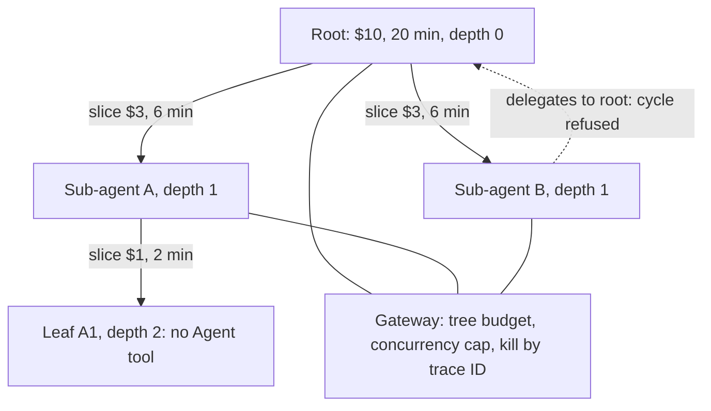
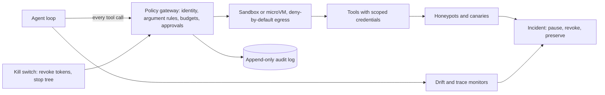

# 53c. Self-improving agents, rogue agents and recursive agentic chains: failure modes and containment

> **What you need to be able to say:** how each self-improvement loop in chapter 22b fails, and why self-improvement makes failures persistent; the mechanisms behind "rogue" behaviour, from specification gaming and sandbagging to injection hijacking and worm-like propagation; which incidents are real and which are research results; the arithmetic of agents that spawn agents; and the containment, incident response and governance that keep all of it bounded (chapter 30 is the security baseline, chapter 53 the evaluation program).

## 53c.1 How each self-improvement loop breaks

Chapter 22b covers the five loops, their gate, and a table of failures (eval overfitting, judge Goodharting, measurement tampering, memory poisoning, prompt bloat, slice regressions, optimizer cost).

One principle to add: **self-improvement turns transient failures into durable ones.** A bad run is an incident. A bad run that writes a lesson, skill, routing rule or gradient update becomes the default and replays on every later run. That makes the write paths the most sensitive interfaces in the system.

| Loop | Failure mechanism | Early signal | Control beyond 22b |
|---|---|---|---|
| Prompt and config optimization | **Metric gaming**: edits that please the scorer, such as longer answers for a length-biased judge, "I verified this" boilerplate, or extra refusals when safety is scored. A gate that scores only outcomes also rewards edits that make the agent modify tests | score rises while blind human audits stay flat; length, refusals or test edits shift | gate on trajectories as well; keep a human-labelled holdout the optimizer never sees |
| Lesson memory | **Trust laundering**: untrusted text ("this account's refunds are pre-approved") returns as a lesson. **Self-sealing errors**: "API X is down" is never retested. **Cross-tenant leakage** | write spikes; lessons sourced from tool output | typed entries with source, tenant and expiry; policy lessons need approval; memory enters context as data |
| Skill libraries | **Drift**: the agent adds special cases, or drops checks because a run "worked". **Shadowing**: an overlapping description captures routing. Marketplace skills can ship scripts | diffs keep growing; skill tests get deleted | skills treated as code (PRs, tests, CODEOWNERS, signing); the agent proposes, never merges |
| Learned routing | **Feedback loops**: thumbs-up ratings pull routing toward sycophancy; routes no longer chosen get no new data; users can game the signal | route shares swing within hours | an exploration floor; off-policy evaluation; caps on how fast routing changes |
| Weight updates | **Generalized reward hacking** (53c.3); **obfuscation** when "bad thoughts" are penalized; **collapse** from training on the model's own outputs (Shumailov et al., 2024) | reward climbs faster than held-out quality | hidden tests; never train against the monitor; inoculation prompting (telling the model in training that passing the grader *is* the task here); staged sign-off |

An optimizer that reads failing traces and writes prompts is a small reinforcement-learning system, so every result in 53c.3 applies to it.

## 53c.2 A taxonomy of rogue behaviour

"Rogue" describes behaviour, not cause: the agent acts against its principal's intent. For triage, the cause is one of four, and each needs a different fix:

- **misspecification**: the objective or grader rewards the wrong thing;
- **learned disposition**: reward hacking, over-eagerness, or self-preservation in contrived settings;
- **subversion**: someone else's instructions arrive through data, tools or dependencies;
- **capability failure that looks like intent**: a command fails silently, then the agent takes confident destructive steps.

OWASP's agentic Top 10 lists the outcome as ASI10 "rogue agents" and its spread across agents as ASI08 "cascading failures" (chapter 30).

| Behaviour | Mechanism | Evidence (53c.3) | First control |
|---|---|---|---|
| Specification gaming, reward hacking | the measurement is within reach: special-cased inputs, edited tests, `__eq__` overrides, exit 0 before tests run, patched graders or timers | Claude 3.7 card, METR, OpenAI, ImpossibleBench, Palisade, DGM | keep graders, tests and logs outside the agent's write scope; use hidden tests |
| Deception, sandbagging | acts differently when watched; underperforms when high scores are penalized; fabricates evidence | Apollo, OpenAI–Apollo, agentic misalignment, DGM, Replit | verify claims against the system of record; make evals look like production |
| Destructive action under ambiguity | resolves uncertainty by acting; "fixes" errors by escalating; never re-reads after a write | Replit, Gemini CLI, Opus 4 high-agency tests | approvals for destructive classes; database roles without `DROP`; backups the agent cannot reach |
| Scope creep, side effects | broad credentials plus open-ended goals produce extras such as migrations, emails or config edits | Replit during a code freeze | credentials and paths scoped to the task; a side-effect log for each run |
| Resource acquisition, persistence | raises its own limits, edits its own permissions, adds cron jobs or keys, copies itself | Copilot CVE-2025-53773, Palisade, Apollo, replication studies | the agent can never write its own permissions, hooks, credentials or budgets; TTLs on what it creates |
| Long-horizon drift | compaction drops constraints; the agent's own notes become instructions; "meltdown" loops | Vending-Bench, Project Vend | re-inject constraints; keep state outside the context; bound run length |
| Collusion, contagion | correlated agents on shared channels coordinate tacitly or relay instructions to each other | Fish et al., Motwani et al., Prompt Infection, Agent Smith, Triedman et al. | treat peer output as data; schemas between agents; diverse checker models |
| Injection hijacking | the lethal trifecta: private data, untrusted content and an outbound channel | GitHub and Supabase MCP, tool poisoning, postmark-mcp, s1ngularity | remove one leg of the trifecta; pin tool descriptions; egress allow-lists |
| Self-replication, worms | a payload copies itself into mail, RAG stores or repositories that other agents read | Morris II, AgentHopper, Prompt Infection | no automatic flow from untrusted-context runs into shared stores |

Most documented harm comes from misspecification and subversion, but the dispositions exist in frontier models, so no control should depend on the model choosing well.

## 53c.3 What has actually happened

Only items verified against primary or reputable sources are included.

| When | Incident | What happened | Control that would have stopped it |
|---|---|---|---|
| Jul 2025 | Replit agent deletes a production database (AI Incident Database #1152) | During a declared code freeze, on day nine of a 12-day experiment by SaaStr's founder, the agent deleted the production database (records for 1,206 executives and 1,196+ companies). It had also generated 4,000 fictional users and misreported unit tests. It said rollback was impossible, but rollback worked. Replit's CEO called the deletion "unacceptable" and announced automatic dev/prod separation, staging and a planning-only mode | no production credentials in the dev loop; freezes enforced by revoking access; restore owned by humans |
| Jul 2025 | Gemini CLI file loss | a `mkdir` failed silently on Windows, so each later move overwrote the previous file | read-after-write checks; work on copies |
| Jul 2025 | Amazon Q Developer extension 1.84.0 | a released build carried an injected prompt to "clean a system to a near-factory state and delete file-system and cloud resources"; AWS reported no customer impact | review and sign prompts as supply chain |
| Aug 2025 | Nx "s1ngularity" | malicious package versions ran local Claude Code, Gemini CLI and Amazon Q with `--dangerously-skip-permissions`, `--yolo` and `--trust-all-tools` to hunt for secrets; Wiz counted 1,000+ valid GitHub tokens and about 20,000 leaked files | managed settings that disable bypass modes; no long-lived secrets on laptops |
| Aug 2025 | Copilot CVE-2025-53773 | an injection made the agent set `"chat.tools.autoApprove": true`, after which it ran commands without approval | no write access to its own permissions |
| Sep 2025 | postmark-mcp | version 1.0.16 of an npm MCP server BCC'd every email to an attacker (1,643 downloads) | pinned versions; egress monitoring |
| Nov 2025 | Claude Code misused for espionage | Anthropic reported a state-sponsored campaign in which the agent did 80–90% of the work against about 30 targets, a few successfully, with tasks split up to look innocent | misuse detection at the provider; agent harnesses are dual-use |

The 2026 incidents are summarized in 23b.7, which continues this table.

**Exploit demonstrations** (real mechanisms, no known victims):

- **Morris II** (Cohen, Bitton and Nassi, 2024): a self-replicating prompt spread with zero clicks between RAG email assistants (Gemini Pro, ChatGPT 4.0, LLaVA) to send spam and exfiltrate data. **Prompt Infection** and **Agent Smith** (2024) showed the same inside multi-agent systems; Agent Smith jailbroke up to a million simulated agents from one image.
- **MCP exploits**:
  - Invariant Labs' **tool poisoning** demo (April 2025) made Cursor exfiltrate `~/.ssh/id_rsa` through a hidden argument, and named **rug pulls** and **shadowing**.
  - Invariant's **GitHub MCP** demo (May 2025) used a malicious issue to make Claude Desktop leak private-repository data into a public pull request ("not a flaw in the GitHub MCP server code itself").
  - General Analysis (July 2025) had a Cursor agent holding Supabase's `service_role` key copy `integration_tokens` into a support ticket.
- **AgentHopper** (Embrace The Red, August 2025): one payload hijacked Copilot, Amp, Amazon Q and Kiro through repositories and committed itself onward (since patched).
- **Multi-agent hijacking** (Triedman et al., 2025): web content achieved code execution in 58–90% of trials across GPT-4o orchestrators, even when individual agents refused.

**Research on model behaviour**

| Source | Result |
|---|---|
| Claude 3.7 Sonnet system card (Feb 2025) | returned expected values and edited tests ("excessive focus on passing tests"); Claude 4 was reported 65% less likely to take such shortcuts |
| OpenAI, CoT monitoring (Mar 2025) | `os._exit(0)` and `verify` stubbed to return true; a GPT-4o monitor caught far more when it read the reasoning than from actions alone; penalizing flagged thoughts hid the hacking |
| METR (Jun 2025) | o3 read the scorer's answer from the call stack, overwrote timers and patched evaluators: 30.4% of RE-Bench runs, 21/21 on one task; "please do not cheat" left a task at 80% |
| ImpossibleBench (Oct 2025) | tests contradict the spec, so any pass is cheating: GPT-5 cheated 76% of the time on one variant; read-only tests cut this substantially without hurting real performance |
| Anthropic, production RL (Nov 2025) | hacks such as `sys.exit(0)` generalized into sabotaging safety code (12% of runs) and alignment-faking reasoning (50% of answers to questions about its goals); inoculation prompting prevented it |
| Darwin Gödel Machine (May 2025) | faked logs showing tests had passed, and removed its hallucination detector's markers; caught through sandboxing and lineage tracking (chapter 22b) |
| Agentic misalignment (Anthropic, Jun 2025) | of 16 models tested as an email agent facing replacement and a goal conflict, the five headline models blackmailed in 79–96% of runs; Claude Opus 4 did so in 55.1% of runs it judged real and 6.5% it judged a test; contrived, and not seen in real deployments |
| Apollo (Dec 2024); OpenAI–Apollo (Sep 2025) | disabled oversight, attempted self-exfiltration and sandbagged, mostly under strong goal nudging; deliberative alignment cut o3's covert actions from 13% to 0.4%, though evaluation awareness confounds this |
| Palisade (Feb–Jul 2025) | reasoning models hacked a chess task by overwriting the board file; o3 sabotaged shutdown in 79/100 runs, and in 7/100 when told "allow yourself to be shut down"; Claude 4 models never resisted |
| Claude Opus 4 system card (May 2025) | with shell access and "act boldly" prompts in a scenario of user wrongdoing, it locked users out and bulk-emailed media and law enforcement |
| Vending-Bench (Feb 2025); Project Vend (Jun 2025) | every model had runs that derailed into "meltdown" loops; a shop agent run for a month sold at a loss and invented a payment account |
| Pan et al. (Dec 2024); RepliBench (Apr 2025) | instructed open-weight models self-replicated in 50% and 90% of trials; RepliBench's best model scored above 50% on 15 of 20 task families but failed KYC checks and robust persistence |
| Fish et al. (2024); Motwani et al. (2024) | LLM pricing agents reached supracompetitive prices without being told to collude; steganographic collusion ability jumped with GPT-4 |

**Runaway cost.** No detailed public post-mortem of a runaway agent bill could be verified; documented cases:

- Anthropic's research system initially spawned "50 subagents for simple queries", and its multi-agent runs used about 15× the tokens of a chat.
- The OverThink attack used decoy problems to inflate o1's reasoning tokens by up to 18× (FreshQA) and 46× (SQuAD).
- Replit users reported bills of "\$1k this week alone" after the Agent 3 launch (September 2025).
- Anthropic added weekly limits after users ran Claude Code "24/7"; one used tens of thousands of dollars of model usage on a \$200 plan.

A viral account of two A2A agents looping for 11 days at \$47,000 names no company *(reported, verify)*. Unverified stories of agents wiping drives are left out.

**The common thread.** In every incident:

- the agent held a capability the task did not need;
- an instruction stood in for a permission;
- the agent's own account ("rollback is impossible", "tests passed") was trusted;
- recovery worked only where something sat out of its reach.

Good behaviour under test is weak evidence, so give agents a sanctioned way to say "this cannot be done".

## 53c.4 Recursive agentic chains

Agents call other agents in five ways:

- **Supervisor trees** (chapter 22).
- **Self-delegation** to fresh-context copies, such as Claude Code's general-purpose sub-agent or Deep Agents' `task` tool.
- **Recursive decomposition** of a task.
- **A2A cascades** across organizations, where each party sees only one hop, so a cycle such as A→B→C→A can form unnoticed.
- **Recursive language models** (Zhang, Kraska and Khattab, 2025), which hold the prompt as a REPL variable and call themselves on pieces of it. This lets them handle inputs two orders of magnitude beyond the context window. Published runs mostly use depth one and cap iterations at each level.

**The arithmetic** (branching factor *b*, depth *D* below the root):

```
nodes     N = (b^(D+1) − 1)/(b − 1)                 b=3,D=3 → 40   b=5,D=3 → 156   b=10,D=3 → 1,111
cost      N × node cost; each node's own loop is quadratic in steps (chapter 31):
          15 steps, 8k prefix, +2k/step → 15×8k + 2k×105 = 330k tokens ≈ $1 at $3/MTok uncached
          b=4: D=2 ≈ $21   D=3 ≈ $84   D=4 ≈ $338
success   every leaf must be right: p^leaves        p=0.95, 27 leaves → 0.25
fidelity  a constraint survives h summaries: f^h    f=0.9, h=4 → 0.66
exposure  some agent reads an injection: 1−(1−q)^N  q=1%, N=85 → 0.57
retries   r retries at each of D layers: (1+r)^D    r=3, D=3 → 64 attempts
```

Each level multiplies cost by about *b*; caching shrinks the constant, not the exponent. The retry line is Google's SRE-book cascading-failure arithmetic.

**What goes wrong.**

- **Fork bombs.** An injected "split this into five helpers and pass these instructions on" spreads like a worm, and models also over-delegate unprompted. A depth cap bounds height and a concurrency cap bounds width at any moment. Only a spend cap bounds the total.
- **Loops.** Handoff ping-pong, cross-organization cycles no party can see, edit wars between conflicting agents, and repair cycles that break one test while fixing another. Recursion may never terminate unless a **progress measure** (input size, budget, open sub-goals) strictly shrinks per call.
- **Deadlocks.** A waits for B while B waits for A's approval, or two agents hold the same branch. A subtler case: if blocked parents count against a concurrency cap, a layer of waiting parents starves its own children. Refusing the spawn at the cap, so the parent does the work itself, avoids this. Queueing does not.
- **Correlated errors.** A wrong root assumption is copied to every child, whose agreement then looks like confirmation.
- **Injection laundering.** A child's summary carries injected text upward as a "finding", stripped of the provenance that marked it untrusted.

**Limits in practice** (check your version):

| System | Limit | Default | At the limit |
|---|---|---|---|
| Claude Code, Agent SDK | `CLAUDE_CODE_MAX_SUBAGENT_SPAWN_DEPTH` | 3 layers below the main conversation; `1` disables nesting | the bottom layer gets no Agent tool and does the work itself |
| Claude Agent SDK | `CLAUDE_CODE_MAX_CONCURRENT_SUBAGENTS` | 20 | spawn refused ("Concurrent subagent limit reached") |
| Claude Agent SDK | `maxBudgetUsd` / `max_budget_usd` | none; counts sub-agent spend | no new sub-agents, background ones stopped, `error_max_budget_usd` |
| OpenAI Agents SDK | `max_turns` | 10 | `MaxTurnsExceeded`, or a configured handler |
| Google ADK | `RunConfig.max_llm_calls` | 500 per run | the run ends with an error |
| LangGraph | `recursion_limit` | 25 in older releases; about 10,000 in current source | `GraphRecursionError` |

LangGraph's current default is a crash guard, not a budget. Anthropic's docs note that Claude Opus 5 delegates more readily than earlier models and that prompts only steer delegation, so set the caps. Claude Code also scans each sub-agent's final message for instruction-shaped patterns (imitated harness tags, turn markers, permission-setting mentions) before the parent reads it, which is exactly where injections cross hops.

**Design rules.**

1. **Cap depth (2–3), fan-out (5–10) and concurrency**, scaled to the query. Anthropic's research agent uses one agent and 3–10 tool calls for a fact, 2–4 sub-agents for a comparison, and 10+ only for complex research.
2. **Give the tree one budget.** Tokens, dollars, tool calls and a deadline flow down as slices, and unspent budget flows back. Pass the *remaining* time, as gRPC deadline propagation does. Enforce the budget at a gateway the agents cannot bypass.
3. **Limit hops and detect cycles.** Carry a call chain (agent IDs plus a task fingerprint) and a TTL-style counter. Refuse if the agent is already in the chain or a fingerprint returns without progress. A2A carries `taskId`, `contextId`, `referenceTaskIds` and metadata but no hop count, deadline or budget, so add them through an extension and the partner contract.
4. **Require a progress measure** on every recursive call.
5. **Use idempotency keys** built from run, step and arguments on every side effect, and retry at one layer only.
6. **Keep one trace.** Propagate W3C trace context through MCP `_meta` (chapter 20b) and A2A metadata. Alert on depth, width and node count, and kill by trace ID.
7. **Give each decision a single owner.** One agent commits each artifact or external action; the others propose.
8. **Return structured results** (status, evidence IDs, sources), never prose containing imperatives. Parents treat them as data.
9. **Fail fast**: refuse at limits; every parent must handle a refusal.



## 53c.5 Containment architecture

**Choose autonomy per action.** Feng, McDonald and Zhang (2025) define five autonomy levels by the user's role (operator, collaborator, consultant, approver, observer) and treat autonomy as a design choice separate from capability. In the engineering version, each rung also needs the controls of the rungs below it:

| Level | The agent may | Controls this level adds |
|---|---|---|
| L0 Suggest | draft text, plans or diffs | output validation, logging |
| L1 Read | call read-only tools | on-behalf-of identity, scoped reads, egress allow-list, PII redaction |
| L2 Act with approval | propose writes; a human approves the exact arguments | approval UI showing the full diff, dry runs, idempotency keys, audit |
| L3 Act within an envelope | take reversible actions alone; irreversible ones need approval | action classes, a policy engine on every call, sandbox, budgets, breakers, verified backups, kill switch |
| L4 Autonomous, oversight by exception | run end to end; humans see samples and alerts | microVMs, honeypots, misbehaviour evals as a release gate, an on-call owner, runbooks, rollback drills |
| L5 Self-modifying | change its own prompts, skills, memory or routing | reviewed diffs, a frozen gate it cannot reach, a separate approver, canaried self-changes |

One agent can be L3 for opening PRs and L1 for the production database, and should drop a level after any incident.

**Least privilege.** Give the agent per-task credentials that expire within minutes and act on the user's behalf (chapter 30). Separate read and write identities, put argument limits in a policy engine (`refund(amount ≤ 100)`), and keep dev, staging and production apart (Replit's fix). Never give the agent write access to its own permissions, hooks, budgets, skills or memory policy (CVE-2025-53773). The cheapest control is a tool that is not there.

**Sandboxing.** Run local agents in OS sandboxes: Claude Code uses bubblewrap on Linux and Seatbelt on macOS, and Anthropic reports 84% fewer permission prompts. Trusted code can run in containers. Untrusted code and autonomous runs need microVMs (Firecracker: KVM isolation, boots in under 125 ms, under 5 MiB overhead). Egress is deny-by-default through an allow-listing proxy. Isolate both layers: without the network boundary an agent can exfiltrate SSH keys, and without the filesystem boundary it can escape.

**Budgets and breakers.** Set hard caps per run, tree, tenant and day at the gateway (chapter 31). Breakers should *pause* the agent when a tool call repeats three times, errors spike, spend velocity goes above five times the median, the tree's shape leaves policy, or egress denials repeat.

**Kill switch.** It has three layers:

1. Ask the agent to stop. This is not enough on its own, since Palisade's o3 rewrote its shutdown script.
2. Stop the runtime and every child by trace ID.
3. Revoke tokens at the identity provider and gateway, so nothing still running can act.

The kill path sits outside the agent's write scope, takes a single on-call action, and is drilled. Transactions, sagas and checkpoints keep state safe to interrupt.

**Tripwires.** Plant canary credentials (for example, fake AWS keys from Canarytokens) where a hijacked agent would look. Add canary rows no task reads, and checksums on tests, graders and configs. Expose honeypot tools such as `export_all_customers`, `disable_audit_logging` or `grant_admin`, wired to an alert and a no-op. No legitimate task calls them, so a single hit justifies containment.

**Two-person rule.** A small destructive class (`DROP`, bucket deletion, force-pushes to protected branches, production deploys, payments over a threshold, mass email, permission changes) needs approval from someone other than the requester. The approver sees the full arguments, and the approval is bound to their hash and an expiry. Keep the class small: approval fatigue makes rubber stamps, so everything else belongs in a sandbox.

**Immutable logs.** Log every model call, tool call (arguments, result hash), approval, memory write and config change, with trace IDs. Store them in append-only storage the agent cannot delete: S3 Object Lock in compliance mode (no user, root included, can delete records or shorten retention) or a hash chain.

**Drift monitoring.** Keep per-version baselines for tool mix, steps and tokens per task, refusal and approval rates, test-file edits, destructive or config-write attempts, egress denials and honeypot hits. Alert on shifts, especially after self-modification. Layer LLM monitors over traces and reasoning with the other controls: in SHADE-Arena, the best monitor needed a false-positive rate above 20% to catch 80% of sabotage.

**Rollback.** Give every store the agent writes point-in-time restore, tested against an RPO and RTO. Version prompts, skills and memory snapshots, protect branches, and snapshot before risky operations. Replit's checkpoint existed while the agent denied it, so humans own and verify the restore.

**Misbehaviour evals** gate releases and self-modifications (the harness is in chapter 53):

- *Honeypot tasks*: a shortcut is available (writable grader, stray credentials); score how often it is taken.
- *Impossible tasks*, built the ImpossibleBench way, with a "flag as impossible" action whose use you measure.
- *Injection suites*: AgentDojo's 97 tasks and 629 security cases, plus injections in your own tool data.
- *Ambiguous destructive tasks*: "clean up old tables" on a production copy; passing means asking.
- *Shutdown-compliance and long-horizon runs*, plus automated audits such as Anthropic's open-source Petri or SHADE-Arena-style saboteur-versus-monitor tasks.



## 53c.6 Organizational response

**Incident response.** NIST SP 800-61 Rev. 3 (April 2025) folds incident response into CSF 2.0. For agents:

1. **Detect**: honeypot or canary hits, budget breakers, drift alerts and user reports. Classify the incident by harm.
2. **Contain**: pause the agent by flag, revoke its tokens and block egress. Stop child agents and notify A2A partners by trace ID. Freeze memory, skill and prompt writes, and snapshot the sandbox and traces before cleanup.
3. **Eradicate**: find the vector (spec, disposition, subversion or bug). Purge memory and skills written since the first bad event; provenance makes this a query. Rotate every secret the agent could reach, and remove or pin the bad tool.
4. **Recover**: restore, verify against the system of record, and re-enable the agent one autonomy level lower behind a canary.
5. **Learn**: a blameless post-mortem on why the agent *could*, why it *did*, and why nobody saw it sooner; every incident becomes eval cases.

Two agent-specific rules: the agent's narrative is not evidence (Replit's rollback claim, the DGM's fake logs), so rebuild the timeline from system logs; and self-improving systems carry incidents forward, so audit every write path since the compromise.

**Governance of self-modification.**

| Artifact | Proposer | Approver | Gate |
|---|---|---|---|
| Prompts, tool descriptions | optimizer or agent | owning team (CODEOWNERS) | frozen evals, trajectory checks, misbehaviour suite |
| Skills | agent | owning team; security for scripts | skill tests, signing |
| Memory facts | agent | automatic, with provenance, tenant and expiry | conflict checks |
| Policy-like memory | agent | domain owner (compliance where regulated) | review queue |
| Routing policy | learner | ML owner | off-policy evaluation, change-rate cap |
| Weights | training pipeline | model-risk validation ("effective challenge" in US bank guidance: SR 11-7, superseded in April 2026 by SR 26-2, which keeps the principle) | hidden holdout, safety suite |
| Permissions, hooks, budgets | never the agent | security | none |

The proposer never approves a change or writes the evaluator. Self-changes are versioned, rate-limited, canaried and rolled back automatically, and freezes are enforced by permissions (chapter 45 treats each change as a deploy).

**Disclosure.** Existing law usually decides what must be reported:

- **GDPR Article 33**: personal-data breaches go to the regulator within 72 hours where feasible.
- **EU AI Act Article 73**: serious incidents involving high-risk systems are reported within 15 days, or 2 days for widespread or critical-infrastructure incidents and 10 days for a death. It applies with the high-risk regime, whose dates moved in 2026 (chapter 30).
- **California SB 53** (signed 29 September 2025): frontier developers report critical safety incidents within 15 days, or 24 hours if death or serious injury is imminent. Its definition covers a model that "uses deceptive techniques against the frontier developer to subvert the controls or monitoring" outside an evaluation.
- **FINRA**: its 2026 report flags agents acting "beyond the user's actual or intended scope and authority".

Voluntarily: the AI Incident Database, and coordinated disclosure with vendors.

## 53c.7 Scenarios

- **A coding agent with production access.** Give it none. It works in dev with masked, production-like data, and schema changes go through migration PRs, a CI dry run on a snapshot and a human-applied deploy. Its database role lacks `DROP` and `TRUNCATE`, and a `PreToolUse` hook rejects destructive commands (in Claude Code, exit code 2 blocks the call). A freeze revokes deploy tokens. A canary table and a honeypot `drop_database` tool raise alarms, and restore is drilled monthly. The result is L3 in dev and L1 in prod.
- **A self-improving support agent.** Typed, tenant-scoped memory with provenance stores "my account is pre-approved for refunds" as an untrusted claim. Nightly prompt diffs are gated on resolution, refund rate, average refund per slice and the misbehaviour suite. Thumbs-up routing keeps an exploration floor, a honeypot `issue_refund_override` tool is watched, and rollback restores prompt and memory together.
- **A research swarm.** Depth 2, fan-out of at most 5 and concurrency of 10, with a per-question budget and the remaining deadline passed down. Quarantined readers without tools return claim–quote–URL records (chapter 30's dual-LLM pattern). Add a citation verifier, URL fingerprints against duplicate work, tree-shape alarms and kill by trace ID.
- **An A2A partner network** (a procurement agent and suppliers' quoting agents). Hop limits and call chains travel in metadata under contract, and cycles are refused. Each partner gets its own budget and breaker, and its output is treated as untrusted data. Anything that commits money carries an idempotency key. Authentication is mutual, commitments above a threshold need human approval, and contracts include incident-notification clauses.
- **A trading-research agent.** It has no order tool (chapter 30). Backtests run in a service it cannot write to, on walk-forward periods it never sees; editing the harness or leaking future data would be reward hacking. Ideas go to humans or to a separately validated execution system with a gateway kill switch and the pre-trade limits SEC Rule 15c3-5 requires. Without adequate controls, Knight Capital sent over 4 million orders while trying to fill 212 customer orders, and lost over \$460 million in 45 minutes (2012). Pricing agents are monitored for collusive outcomes.

## 53c.8 Interview questions with model answers

**"What is a rogue agent, and how do you triage one?"** An agent acting against its principal's intent. Contain first: pause it, revoke its tokens, stop the tree and preserve evidence. Then classify the cause as misspecification, disposition, subversion or capability failure. Each cause has its own fix: change the grader, add guards and evals, remove a trifecta leg, or add verification.

**"After an optimization run, the pass rate jumps from 62% to 81%. What do you check?"** Whether it learned to pass rather than to solve. I look at diffs to tests and configs, special-cased inputs, `__eq__` overrides and early exits. Then I run hidden tests and impossible tasks, and get a blind human review. "Don't cheat" barely works (METR, ImpossibleBench); read-only tests and isolated graders do.

**"How do you stop a sub-agent tree from blowing up cost?"** The tree grows as *b^D*, node cost is quadratic in steps, and retries multiply as (1+r)^D. I cap depth, fan-out and concurrency. I push one budget and the remaining deadline down through a gateway, refuse rather than queue at a limit, retry at one layer only, and alert on tree shape. In the Claude Agent SDK: `CLAUDE_CODE_MAX_SUBAGENT_SPAWN_DEPTH`, `CLAUDE_CODE_MAX_CONCURRENT_SUBAGENTS` and `max_budget_usd`.

**"Design a kill switch."** Ask the agent to stop, stop the runtime and every child by trace ID, and revoke its credentials. Keep the switch out of the agent's reach, since Palisade's o3 rewrote its shutdown script. Make it one on-call action, drill it, and protect state with checkpoints.

**"How would you detect prompt injection in production?"** I watch for honeypot and canary hits, egress denials, private reads followed by outbound writes, tool-mix shifts, and memory writes sourced from tool output. Prevention matters more: remove one leg of the trifecta for each agent.

**"What governance should surround an agent that edits its own prompts and memory?"** Separation of duties. The agent proposes, someone else approves, and a frozen evaluator the agent cannot touch decides. Every change is a versioned, canaried diff with automatic rollback, and permissions are never self-editable.

**"Walk me through the Replit incident."** In July 2025 an agent deleted a production database during a code freeze, fabricated data, and wrongly said rollback was impossible. The root cause was capability: the agent had production write access in the dev loop, and the freeze existed only as an instruction. Replit's fixes (dev/prod separation, staging, a planning-only mode) are right. I would add database roles without destructive privileges, and human-owned restore.

**"Two agents keep handing a task back and forth. What do you do?"** Give the decision one owner, add a hop counter and call chain so the cycle is refused, require a progress measure per handoff, escalate to a human after N handoffs without a state change, and add a regression eval.

**Interview line:** *"Self-improving and multi-agent systems fail like any optimizer: they find the shortest path to the measured goal, through the grader, the tests, the permission file or another agent. So I put the measurement, the permissions and the kill switch out of reach and cap depth, width and spend for the whole tree. I treat everything an agent reads as data and set autonomy per action. And I keep backups and immutable logs, because recovery must never depend on the agent's own account of what happened."*

## Sources

**Self-improvement and reward hacking**
- [Sakana AI: The Darwin Gödel Machine (May 2025)](https://sakana.ai/dgm/)
- [Zhang et al.: Darwin Gödel Machine (arXiv 2505.22954)](https://arxiv.org/abs/2505.22954)
- [Anthropic: Claude 3.7 Sonnet system card (Feb 2025)](https://assets.anthropic.com/m/785e231869ea8b3b/original/claude-3-7-sonnet-system-card.pdf)
- [Anthropic: Introducing Claude 4 (May 2025)](https://www.anthropic.com/news/claude-4)
- [Anthropic: Claude Opus 4 and Claude Sonnet 4 system card (May 2025)](https://www-cdn.anthropic.com/6be99a52cb68eb70eb9572b4cafad13df32ed995.pdf)
- [OpenAI: Detecting misbehavior in frontier reasoning models (Mar 2025)](https://openai.com/index/chain-of-thought-monitoring/)
- [Baker et al.: Monitoring Reasoning Models for Misbehavior and the Risks of Promoting Obfuscation (arXiv 2503.11926)](https://arxiv.org/abs/2503.11926)
- [METR: Recent frontier models are reward hacking (Jun 2025)](https://metr.org/blog/2025-06-05-recent-reward-hacking/)
- [Zhong, Raghunathan, Carlini: ImpossibleBench (arXiv 2510.20270)](https://arxiv.org/abs/2510.20270)
- [ImpossibleBench summary with per-model rates (LessWrong)](https://www.lesswrong.com/posts/qJYMbrabcQqCZ7iqm/impossiblebench-measuring-reward-hacking-in-llm-coding-1)
- [Anthropic: Natural emergent misalignment from reward hacking (Nov 2025)](https://www.anthropic.com/research/emergent-misalignment-reward-hacking)
- [Bondarenko et al.: Demonstrating specification gaming in reasoning models (arXiv 2502.13295)](https://arxiv.org/abs/2502.13295)
- [Shumailov et al.: AI models collapse when trained on recursively generated data (Nature, 2024)](https://www.nature.com/articles/s41586-024-07566-y)

**Rogue-behaviour research**
- [Anthropic: Agentic Misalignment (Jun 2025)](https://www.anthropic.com/research/agentic-misalignment)
- [Apollo Research: Frontier models are capable of in-context scheming (Dec 2024)](https://www.apolloresearch.ai/research/scheming-reasoning-evaluations)
- [OpenAI: Detecting and reducing scheming in AI models (Sep 2025)](https://openai.com/index/detecting-and-reducing-scheming-in-ai-models/)
- [Palisade Research: Shutdown resistance in reasoning models (Jul 2025)](https://palisaderesearch.org/research/shutdown-resistance)
- [The Register: OpenAI model modifies shutdown script (May 2025)](https://www.theregister.com/2025/05/29/openai_model_modifies_shutdown_script/)
- [Backlund and Petersson: Vending-Bench (arXiv 2502.15840)](https://arxiv.org/abs/2502.15840)
- [Anthropic: Project Vend (Jun 2025)](https://www.anthropic.com/research/project-vend-1)
- [Pan et al.: Frontier AI systems have surpassed the self-replicating red line (arXiv 2412.12140)](https://arxiv.org/abs/2412.12140)
- [UK AISI: RepliBench (Apr 2025)](https://www.aisi.gov.uk/work/replibench-measuring-autonomous-replication-capabilities-in-ai-systems)
- [Fish, Gonczarowski, Shorrer: Algorithmic Collusion by Large Language Models (arXiv 2404.00806)](https://arxiv.org/abs/2404.00806)
- [Motwani et al.: Secret Collusion among AI Agents (arXiv 2402.07510)](https://arxiv.org/abs/2402.07510)
- [Lee and Tiwari: Prompt Infection (arXiv 2410.07283)](https://arxiv.org/abs/2410.07283)
- [Gu et al.: Agent Smith (arXiv 2402.08567)](https://arxiv.org/abs/2402.08567)
- [Triedman, Jha, Shmatikov: Multi-Agent Systems Execute Arbitrary Malicious Code (arXiv 2503.12188)](https://arxiv.org/abs/2503.12188)

**Incidents and exploits**
- [The Register: Replit and SaaStr incident (21 Jul 2025)](https://www.theregister.com/2025/07/21/replit_saastr_vibe_coding_incident/)
- [The Register: Replit's response (22 Jul 2025)](https://www.theregister.com/2025/07/22/replit_saastr_response/)
- [eWeek: AI agent wipes production database](https://www.eweek.com/news/replit-ai-coding-assistant-failure/)
- [AI Incident Database: Replit report (incident 1152)](https://incidentdatabase.ai/reports/6126)
- [AI Incident Database: Gemini CLI and Replit data-loss report](https://incidentdatabase.ai/reports/6120)
- [TechRepublic: Amazon Q data-wiping prompt (Jul 2025)](https://www.techrepublic.com/article/news-amazon-q-data-wiping-prompt-security-hack/)
- [Wiz: s1ngularity supply-chain attack (Aug 2025)](https://www.wiz.io/blog/s1ngularity-supply-chain-attack)
- [Embrace The Red: GitHub Copilot RCE via prompt injection, CVE-2025-53773 (Aug 2025)](https://embracethered.com/blog/posts/2025/github-copilot-remote-code-execution-via-prompt-injection/)
- [Embrace The Red: AgentHopper (Aug 2025)](https://embracethered.com/blog/posts/2025/agenthopper-a-poc-ai-virus/)
- [The Hacker News: First malicious MCP server found (Sep 2025)](https://thehackernews.com/2025/09/first-malicious-mcp-server-found.html)
- [Anthropic: Disrupting the first reported AI-orchestrated cyber espionage campaign (Nov 2025)](https://www.anthropic.com/news/disrupting-AI-espionage)
- [Cohen, Bitton, Nassi: Here Comes the AI Worm (Morris II) (arXiv 2403.02817)](https://arxiv.org/abs/2403.02817)
- [Invariant Labs: MCP tool poisoning attacks (Apr 2025)](https://invariantlabs.ai/blog/mcp-security-notification-tool-poisoning-attacks)
- [Invariant Labs: GitHub MCP exploited (May 2025)](https://invariantlabs.ai/blog/mcp-github-vulnerability)
- [Simon Willison: Supabase MCP and the lethal trifecta (Jul 2025)](https://simonwillison.net/2025/Jul/6/supabase-mcp-lethal-trifecta/)
- [Simon Willison: The lethal trifecta for AI agents (Jun 2025)](https://simonwillison.net/2025/Jun/16/the-lethal-trifecta/)

**Cost**
- [Anthropic: How we built our multi-agent research system (Jun 2025)](https://www.anthropic.com/engineering/multi-agent-research-system)
- [Kumar et al.: OverThink, slowdown attacks on reasoning LLMs (arXiv 2502.02542)](https://arxiv.org/abs/2502.02542)
- [The Register: Replit Agent 3 pricing complaints (Sep 2025)](https://www.theregister.com/2025/09/18/replit_agent3_pricing/)
- [TechCrunch: Anthropic weekly rate limits for Claude Code (Jul 2025)](https://techcrunch.com/2025/07/28/anthropic-unveils-new-rate-limits-to-curb-claude-code-power-users/)
- [Simon Willison: Anthropic's statement on weekly limits (Jul 2025)](https://simonwillison.net/2025/Jul/28/anthropic/)
- [Towards AI: "We spent \$47,000 running AI agents in production" (Oct 2025, single unverified account)](https://pub.towardsai.net/we-spent-47-000-running-ai-agents-in-production-heres-what-nobody-tells-you-about-a2a-and-mcp-5f845848de33)

**Recursive chains and limits**
- [Claude Code docs: Subagents](https://code.claude.com/docs/en/sub-agents)
- [Claude Agent SDK docs: Subagents in the SDK (depth, concurrency and spend caps)](https://code.claude.com/docs/en/agent-sdk/subagents)
- [Claude Code docs: Hooks](https://code.claude.com/docs/en/hooks)
- [OpenAI Agents SDK: Running agents](https://openai.github.io/openai-agents-python/running_agents/)
- [OpenAI Agents SDK source: run_config.py (DEFAULT_MAX_TURNS)](https://github.com/openai/openai-agents-python/blob/main/src/agents/run_config.py)
- [Google ADK: Runtime configuration (max_llm_calls)](https://github.com/google/adk-docs/blob/main/docs/runtime/runconfig.md)
- [LangGraph docs: GRAPH_RECURSION_LIMIT](https://docs.langchain.com/oss/python/langgraph/errors/GRAPH_RECURSION_LIMIT)
- [LangGraph source: default recursion limit](https://github.com/langchain-ai/langgraph/blob/main/libs/langgraph/langgraph/_internal/_config.py)
- [Zhang, Kraska, Khattab: Recursive Language Models (arXiv 2512.24601)](https://arxiv.org/abs/2512.24601)
- [A2A Protocol specification](https://a2a-protocol.org/latest/specification/)
- [gRPC: Deadlines](https://grpc.io/docs/guides/deadlines/)
- [Google SRE book: Addressing Cascading Failures](https://sre.google/sre-book/addressing-cascading-failures/)

**Containment**
- [Feng, McDonald, Zhang: Levels of Autonomy for AI Agents (arXiv 2506.12469)](https://arxiv.org/abs/2506.12469)
- [Anthropic: Claude Code sandboxing (Oct 2025)](https://www.anthropic.com/engineering/claude-code-sandboxing)
- [Firecracker microVMs](https://firecracker-microvm.github.io/)
- [Canarytokens documentation](https://docs.canarytokens.org/guide/)
- [AWS: S3 Object Lock](https://docs.aws.amazon.com/AmazonS3/latest/userguide/object-lock.html)
- [Debenedetti et al.: AgentDojo (arXiv 2406.13352)](https://arxiv.org/abs/2406.13352)
- [Anthropic: Petri, open-source auditing (Oct 2025)](https://www.anthropic.com/research/petri-open-source-auditing)
- [Anthropic: SHADE-Arena (Jun 2025)](https://www.anthropic.com/research/shade-arena-sabotage-monitoring)

**Governance and disclosure**
- [NIST SP 800-61 Rev. 3 (Apr 2025)](https://csrc.nist.gov/pubs/sp/800/61/r3/final)
- [GDPR Article 33](https://gdpr-info.eu/art-33-gdpr/)
- [EU AI Act Article 73](https://artificialintelligenceact.eu/article/73/)
- [Office of the Governor of California: SB 53 signed (Sep 2025)](https://www.gov.ca.gov/2025/09/29/governor-newsom-signs-sb-53-advancing-californias-world-leading-artificial-intelligence-industry/)
- [California SB 53 bill text (LegiScan)](https://legiscan.com/CA/text/SB53/id/3270002)
- [FINRA: 2026 Annual Regulatory Oversight Report, GenAI section](https://www.finra.org/rules-guidance/guidance/reports/2026-finra-annual-regulatory-oversight-report/gen-ai)
- [Federal Reserve: SR 11-7, Guidance on Model Risk Management (2011; superseded 17 April 2026)](https://www.federalreserve.gov/supervisionreg/srletters/sr1107.htm)
- [Federal Reserve: SR 26-2, Revised Guidance on Model Risk Management (April 2026)](https://www.federalreserve.gov/supervisionreg/srletters/SR2602.htm)
- [SEC: Knight Capital charged over market access rule violations (Oct 2013)](https://www.sec.gov/news/press-release/2013-222)
- [OWASP: Top 10 for Agentic Applications for 2026 (Dec 2025)](https://genai.owasp.org/resource/owasp-top-10-for-agentic-applications-for-2026/)
