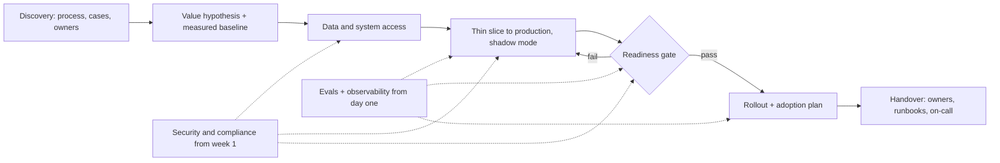

# 54b. Industrial challenges: why AI and agent projects stall between pilot and production, and how teams get through

> **What you need to be able to say:** what the evidence on pilot-to-production failure actually shows, and why the most quoted number is the weakest; the thirteen ways enterprise AI projects stall, with symptoms, root causes, mitigations and examples; how constraints change by industry; ten public cases you can cite precisely; and the forward-deployed playbook that gets one use case into production and keeps it there. Chapters 29–32 go deep on observability, security, cost and evaluation; this chapter is about why good demos die and what you do about it.

## 54b.1 The evidence, and how to quote it honestly

| Source (date) | Sample | Headline | Caveat to say out loud |
|---|---|---|---|
| MIT Project NANDA, *The GenAI Divide: State of AI in Business 2025* (August 2025) | 52 structured interviews, 153 survey responses from senior leaders, 300+ public initiatives, January–June 2025 | "95% of organizations are getting zero return"; for custom, task-specific tools, 60% of organizations evaluated, 20% piloted and 5% reached production with measurable impact (general-purpose chat tools: 80% investigated, 40% deployed) | small, self-selected sample; the 5% is a share of *all surveyed organizations*, not of pilots, so "95% of pilots fail" misreads it; success meant measurable KPI or P&L impact six months after the pilot; the report itself flags selection bias and the short window; press coverage quoted larger samples (150 interviews, 350 employees) |
| Gartner (July 2024) | prediction | at least 30% of GenAI projects abandoned after proof of concept by end of 2025 (poor data quality, inadequate risk controls, escalating costs, unclear value) | a forecast, not a measurement |
| Gartner (June 2025) | prediction, plus a poll of 3,412 webinar attendees | over 40% of agentic AI projects cancelled by end of 2027 for "escalating costs, unclear business value or inadequate risk controls"; only about 130 of thousands of "agentic" vendors are real ("agent washing") | only 19% of those polled had made significant investments — many projects are small bets |
| Gartner (April 2026) | 2026 CIO and technology executive survey | 17% of organizations have deployed AI agents; more than 60% expect to within two years | measures adoption, not success |
| S&P Global Market Intelligence (March 2025) | 1,000+ respondents, North America and Europe | 42% of companies abandoned most of their AI initiatives (17% a year earlier); the average organization scrapped 46% of proofs of concept before production; top obstacles cost, data privacy and security | abandoning a bad proof of concept is the process working |
| McKinsey, *The state of AI in 2025* (November 2025) | 1,993 participants, 105 countries, June–July 2025 | 88% use AI regularly in at least one function; about a third have begun to scale; 23% are scaling an agentic system somewhere, no more than 10% in any one function; 39% report any enterprise EBIT impact, mostly under 5%; about 6% are "high performers" | self-reported |
| BCG, *The Widening AI Value Gap* (September 2025) | 1,250+ firms | 5% achieve value at scale, 35% are scaling with some returns, 60% report minimal revenue or cost gains; agents about 17% of AI value in 2025, 29% expected by 2028 | consultancy segmentation |
| IBM Institute for Business Value CEO study (May 2025) | 2,000 CEOs, 33 countries | 25% of AI initiatives delivered expected ROI; 16% scaled enterprise-wide; half say rapid investment left "disconnected, piecemeal technology" | CEO perception |
| RAND (August 2024) | interviews with 65 practitioners | cites estimates that more than 80% of AI projects fail, twice the rate of non-AI IT; five root causes: wrong problem or metric, insufficient data, technology chosen before the problem, under-invested infrastructure, problems beyond the technology | the 80% is a cited estimate; pre-GenAI framing |
| Deloitte, *State of AI in the Enterprise* (2026 edition) | enterprise survey | 21% have a mature governance model for autonomous agents; 25% have moved 40% or more of their AI experiments into production | |

**How to quote it.** Three denominators hide in these numbers — share of organizations, of projects and of spend — and "abandoned" includes deliberate kills, which a healthy portfolio produces. The robust finding is directional: most pilots do not reach production with a measured outcome, for reasons of value, data, cost and risk controls rather than model quality. The MIT report is still useful inside: bought tools succeeded about twice as often as internal builds (roughly 67% versus 33%), more than half of budgets went to sales and marketing while back-office automation paid best, and the core failure was a "learning gap" — tools that neither retain feedback nor adapt to the workflow. Every one of these is an engineering or operating-model problem, which is the job.

## 54b.2 Thirteen ways projects stall

Most failed projects die of two or three of these at once. Each entry gives symptoms, root causes, mitigations and an example.

**1. Problem selection and ROI.**
- *Symptoms:* a demo everyone likes and nobody owns; success defined as "users like it"; no baseline; the visible use case chosen over the valuable one.
- *Root causes:* technology-first selection (RAND's third cause); value counted as usage; "time saved" that no budget absorbs.
- *Mitigations:* write the value hypothesis as arithmetic before building — volume × baseline cost or error rate × achievable change − run cost. 40,000 tickets a month × 6 minutes saved × $0.80 per loaded minute is $192,000 a month against a few thousand dollars of inference, *if* the minutes become fewer contractor hours or avoided hires. Name the P&L line and its owner; prefer processes with countable units.
- *Example:* a "copilot for everyone" shows rising weekly active users and no movement in any operational KPI; at renewal, licences shrink to the two teams that measured cycle-time gains.

**2. Data access and quality.**
- *Symptoms:* week six and the team still works from a CSV export; the pilot used a curated sample and production has nulls, duplicates and three customer-ID formats; the agent "cannot find" records that exist.
- *Root causes:* approvals routed through owners who see only risk; no data-product owner or data contract; access designed for people on a VPN, not for services.
- *Mitigations:* access as the first milestone — a request naming fields, purpose and retention in week one; service identities with scoped grants; a data-quality report (completeness, freshness, key coverage) before modelling; governed views, not raw tables (chapters 21 and 48).
- *Example:* a claims-triage pilot scores well on 500 hand-picked claims and fails on the live feed because many claims carry the policy number only in a scanned attachment.

**3. Unstructured data at scale.**
- *Symptoms:* RAG that works on 200 PDFs degrades at two million; tables come out as word soup; answers cite superseded versions; the index lags the source by weeks.
- *Root causes:* parsing treated as a commodity; no versioning or deduplication; ACLs not carried into chunks; full re-indexing because nothing is incremental.
- *Mitigations:* layout-aware parsing (Amazon Textract, Azure Document Intelligence, Google Document AI, or open-source Docling and Unstructured) with per-document-type quality checks; metadata at ingest (source, version, effective date, owner, ACL); "latest effective version" filters; incremental sync from change feeds (chapter 51). Budget it: at list prices layout parsing is on the order of $10 per 1,000 pages, about $20,000 per full pass over two million pages, while embedding the resulting ~1.5 billion tokens with a small model at $0.02 per million costs about $30 — parsing, re-processing and expert review dominate, not vectors (verify current prices).
- *Example:* a manufacturer's service assistant quotes torque values from a superseded manual revision until a supersession table and an effective-date filter are added.

**4. Integration with legacy systems.**
- *Symptoms:* the agent can read but not act; a person copies its output into the ERP; the mainframe backlog is nine months; screen bots break when a field moves.
- *Root causes:* systems of record without APIs (3270 screens, batch file drops), heavily customized ERP, integration teams consumed by migrations (SAP ECC mainstream maintenance ends in 2027).
- *Mitigations:* start read-only and add one write action at a time; wrap existing interfaces (SAP BAPIs and OData services, CICS transactions through z/OS Connect, iPaaS APIs) as narrow, typed tools, often MCP servers owned by the system's team (chapter 20b); read through change data capture (Debezium, GoldenGate) instead of loading the core; screen automation only for low-volume steps; idempotency keys and reconciliation for every write.
- *Example:* a procurement agent writes purchase requisitions to a staging table through a BAPI wrapper; a buyer approves; a nightly job reconciles staged against posted documents.

**5. Evaluation and acceptance.**
- *Symptoms:* "it seems good" is the release criterion; each executive tests a favourite question; one screenshot ends the pilot; nobody can say whether version 7 beats version 6.
- *Root causes:* no acceptance criteria, no labelled set, no human baseline, evals owned by nobody.
- *Mitigations:* agree acceptance criteria as numbers on a frozen set ("≥90% field accuracy on 400 labelled documents, zero critical errors, p95 under 8 s"); measure the human baseline on the same set; run shadow mode — the system decides, a person still does the work, daily comparison; gate releases in CI; size the set so the confidence interval is narrower than the change you care about (at an 80% pass rate, ±8 points at n=100 and ±4 at n=400; chapter 32).
- *Example:* an extraction pilot stalls at "95% accurate" until the team shows the two clerks it supports agree with each other on 93% of fields; the target becomes "match clerk agreement, route every low-confidence field to review".

**6. Reliability at scale.**
- *Symptoms:* HTTP 429s at 9 a.m.; p99 latency ten times p50; a silent provider change degrades quality; the model you tuned for is retired.
- *Root causes:* one provider and one region; quotas sized for the pilot; no timeouts or fallbacks; prompts tuned to one snapshot; no deprecation calendar.
- *Facts:* OpenAI's December 2024 outage (a telemetry deployment overwhelmed Kubernetes control planes) and AWS's October 2025 us-east-1 incident (an empty DynamoDB DNS record) each took hours to unwind; Anthropic's September 2025 postmortem described three infrastructure bugs that silently degraded answers — the worst hit 16% of Sonnet 4 requests in its peak hour — and that its evals did not catch. Anthropic gives at least 60 days' notice and retired Claude Sonnet 4 and Opus 4 on 15 June 2026, about thirteen months after launch; OpenAI gave GPT-4.5 Preview three months and shut the Assistants API on 26 August 2026.
- *Mitigations:* a gateway with per-tenant quotas, retries with jitter, circuit breakers and fallback to a second model or region (provisioned throughput for the steady base load); per-step timeouts, streaming, and hedged retries for idempotent calls to cut the tail; a degraded mode that hands off; pinned model versions; an eval-gated migration runbook rehearsed before the notice arrives; probes that replay a golden set hourly in production.

**7. Cost.**
- *Symptoms:* the pilot cost $3,000 a month, the production forecast is $400,000, finance freezes the project.
- *Root causes:* agent loops re-send growing context at every step; frontier models for every step; retries and judges double the bill; no cost per task.
- *Mitigations (chapter 31):* report cost per *successful* task; route easy steps to small models; cache stable prefixes (cached reads bill at about a tenth of the input price on Anthropic's API); batch offline work at the usual 50% batch discount; cap steps and spend per task and tenant. Worked number: 12 steps each re-sending a 20,000-token context is 240,000 input tokens, $0.72 per task at an illustrative $3 per million; caching the shared 18,000-token prefix brings it to about $0.20. "Escalating costs" leads Gartner's list of reasons agentic projects get cancelled.

**8. Security and privacy.**
- *Symptoms:* the security review starts in week ten and takes twelve; staff already paste customer data into personal chatbots; a red team gets the agent to email whatever address an injected document names.
- *Root causes:* security as a gate rather than a design input; shadow AI filling the gap left by slow approvals; agents on broad service accounts.
- *Facts:* in IBM's 2025 breach study, 13% of organizations reported breaches of AI models or applications and 97% of those lacked proper AI access controls; one in five reported a breach involving shadow AI, and high shadow-AI use added about $670,000 to the average breach; 63% of breached organizations had no AI governance policy or were still writing one. Samsung restricted generative AI tools in May 2023 after engineers pasted internal source code into ChatGPT.
- *Mitigations:* security at discovery with a one-page threat model (data classes, identities, tools, egress); a sanctioned, logged enterprise tool so shadow AI has an alternative; on-behalf-of identity, ACL-filtered retrieval, tool allow-lists and approvals (chapter 30); guardrails (chapter 53b); a red team before each expansion (chapter 53).

**9. Regulation and compliance.**
- *Symptoms:* legal asks whether the system is high-risk under the AI Act and nobody knows; model risk management wants documentation written for credit scorecards; launch waits for a quarterly committee.
- *The rules that bite (October 2026):* **EU AI Act** — prohibitions since 2 February 2025, general-purpose model obligations since 2 August 2025, Article 50 transparency (disclose AI interaction, mark synthetic content) since 2 August 2026, with marking for systems already on the market deferred to 2 December 2026; the Digital Omnibus (Regulation (EU) 2026/1744, in force 27 July 2026) moved stand-alone high-risk systems (Annex III: employment, credit scoring, life and health insurance pricing, education, essential services) to 2 December 2027 and AI in regulated products to 2 August 2028. **US banking** — SR 11-7 was superseded on 17 April 2026 by interagency guidance (Federal Reserve SR 26-2, OCC Bulletin 2026-13, FDIC) that is risk-based, "most relevant" above $30 billion in assets, and puts generative and agentic AI *outside its scope* as "novel and rapidly evolving"; banks must still govern them, so expect validation by analogy. **Healthcare** — HIPAA business associate agreements with every vendor touching PHI, minimum-necessary access, audit controls. **Broker-dealers** — FINRA Notice 24-09 (June 2024): communications (Rule 2210), supervision (Rule 3110) and recordkeeping rules apply to GenAI; the 2026 oversight report adds agent risks such as acting beyond intended scope and multi-step actions that are hard to reconstruct. **Insurance** — the NAIC Model Bulletin (December 2023): a written AI program, governance, vendor oversight, unfair-discrimination testing; about two dozen states and DC have adopted it, while California, Colorado, New York and Texas have their own rules. **US states** — Colorado replaced its 2024 AI Act in May 2026 with SB 26-189 (effective 1 January 2027): notice when automated decision-making technology materially influences a consequential decision, a plain-language explanation within 30 days of an adverse one, human review, three-year records.
- *Mitigations:* classify every use case at intake (risk tier and regime; chapter 53b); one documentation pack (purpose, data, evals, limitations, oversight, monitoring) that serves model risk, the AI Act and ISO/IEC 42001 together; compliance co-writes the acceptance criteria.

**10. Liability and trust.**
- *Symptoms:* the bot invents a policy; a customer screenshots it; legal asks who is responsible.
- *Facts:* in *Moffatt v. Air Canada* (2024 BCCRT 149, February 2024) the airline argued its chatbot was "a separate legal entity that is responsible for its own actions"; the tribunal called that "a remarkable submission", held the airline responsible for all information on its website, found negligent misrepresentation and awarded C$650.88 plus interest and fees (C$812.02). In October 2025 Deloitte agreed to partially refund the Australian government for an A$440,000 report whose first version contained a fabricated quote from a court judgment and references to nonexistent works; the revised version disclosed the use of Azure OpenAI.
- *Mitigations:* ground policy answers in versioned sources with citations, and verify the citations deterministically; abstain or hand off when retrieval is empty; deterministic flows for commitments (refunds, prices, eligibility); log exactly what was shown; human sign-off on anything that leaves the building under the company's name.

**11. Organization and change management.**
- *Symptoms:* usage peaks in week two and decays; front-line staff route around the tool; the union or works council hears about it from the press; the champion leaves and the system is orphaned.
- *Root causes:* the tool changes jobs without changing processes, targets or incentives; skills gaps; fear of replacement; no owner after launch.
- *Facts:* Commonwealth Bank of Australia cut 45 customer-service roles in July 2025 citing a voice bot, then reversed it in August after call volumes rose and team leaders had to answer phones, admitting its assessment "did not adequately consider all relevant business considerations". In Germany the works council co-determines technical systems capable of monitoring behaviour or performance (§87(1) no. 6 BetrVG), and since 2021 the law deems an AI expert necessary when the council assesses AI (§80(3)) and extends information and selection-guideline rights to AI (§§90, 95(2a)); the Hamburg Labour Court held in January 2024 (24 BVGa 1/24) that staff using ChatGPT through private browser accounts triggered no co-determination because the employer received no monitoring data — an enterprise deployment with logs usually does.
- *Mitigations:* redesign process and metrics with the people who do the work; train on the team's own cases; when usage drops, read traces and interview five users before touching the model; measure adoption as the share of eligible work handled, not logins; in Germany, negotiate a framework works agreement on AI early (purpose limitation, no performance monitoring from logs, retention, a change procedure) so each new use case is an annex, not a negotiation; name a business owner and an operating budget before launch.

**12. Operating model: who owns what after launch.**

| Duty | Owner | What breaks without it |
|---|---|---|
| Outcome and acceptance criteria | business owner | success is redefined every quarter |
| Prompts, tools, agent code | AI engineering, in version control with review | "someone edited the prompt in production" |
| Eval sets and judges | AI engineering with domain experts, labelling time budgeted | silent regressions |
| Data products and indexes | data platform, with freshness and ACL-sync SLAs | stale or over-shared answers |
| Guardrails and policies | platform and security, configured per use case | inconsistent controls across teams |
| On-call and incidents | the shipping team, with platform escalation | a 2 a.m. page to nobody |
| Cost | product owner with FinOps, per-task budget | silent spend growth |
| Model lifecycle | platform team, with a deprecation calendar | forced migration under deadline |

The pattern that scales is hub and spoke: a central platform (gateway, guardrails, eval tooling, observability, model catalogue) and product teams that own use cases end to end, with a review board for the risky tiers.

**13. Vendor lock-in and market churn.**
- *Symptoms:* a product is renamed twice during the project; an API you built on is sunset; a supplier is acquired or fails.
- *Facts:* between late 2024 and 2026 Azure AI Studio became Azure AI Foundry and then Microsoft Foundry, Google Agentspace became Gemini Enterprise and Vertex AI evolved into the Gemini Enterprise Agent Platform (chapter 15 and the naming table in 39b.0 track the names); OpenAI's Assistants API shut down on 26 August 2026; Lakera, a prompt-injection specialist, is now part of Check Point; Builder.ai, valued at about $1.5 billion, went into insolvency in May 2025 (54b.4).
- *Mitigations:* the model behind a thin interface with per-model prompt variants and an eval suite that qualifies a replacement in days; own your prompts, traces and eval data; open protocols at boundaries (MCP, OpenTelemetry, A2A); contracts with data export, notice periods and transition help; a dependency register with renewal and retirement dates.

## 54b.3 Industry by industry

| Industry | Typical use cases | Hard constraints | What works |
|---|---|---|---|
| Manufacturing | service-manual and maintenance assistants, visual inspection, supplier-document extraction | OT/IT separation, air-gapped plants, MES/ERP/PLM integration, safety-critical instructions, multilingual shop floor, works councils | edge or on-prem vision; RAG over versioned manuals; read-only first; humans sign work orders |
| Energy and utilities | outage and field-work copilots, drone and asset inspection, regulatory filings, billing support | critical-infrastructure security (NERC CIP in North America), SCADA isolation, rate-case scrutiny | AI advisory only, outside control loops; forecasting models with LLM explanations; strong audit |
| Healthcare | ambient documentation, prior authorization, coding, patient-message drafts | HIPAA and BAAs, EHR integration through FHIR and vendor marketplaces, clinical liability, device rules if software diagnoses | drafts not decisions; clinician sign-off inside the EHR workflow; per-specialty evals with clinicians |
| Financial services | servicing assistants, KYC/AML case summaries, credit memo drafts, research copilots | model risk management, fair lending, UDAAP, FINRA communications rules, recordkeeping, residency | internal before customer-facing; deterministic flows for commitments; validation packs; full logging |
| Insurance | claims intake and triage, document extraction, underwriting assistants, fraud signals | NAIC bulletin and state rules, unfair-discrimination testing, AI Act high-risk pricing from December 2027, legacy policy admin | extraction with confidence routing; adjuster in the loop; outcome bias testing; explanations stored with decisions |
| Retail and e-commerce | product content, search and recommendations, service, forecasting copilots | thin margins per interaction, peak traffic, brand safety, price accuracy | A/B tests on revenue; small models and caching at scale; deterministic price and policy tools |
| Telecom | care agents, NOC alarm correlation and ticket summaries, field service, retention offers | huge volumes, OSS/BSS legacy, consumer-protection rules, outage spikes | deflection measured as no repeat contact within 7 days; NOC copilots read-only; changes through change management |
| Public sector | caseworker assistants, correspondence drafts, policy Q&A, translation, intake | procurement cycles, accessibility, freedom of information, equality duties, sovereignty, mainframes | internal-facing first; published use-case registers; human decision makers; sovereign hosting |
| Media and advertising | creative versioning, ad-copy compliance, tagging, localization, audience insight | copyright and licences, talent agreements, platform ad policies, consent, AI Act synthetic-content marking | licensed or owned data; C2PA provenance; compliance review in the workflow; campaign KPIs |
| Logistics | bills of lading and customs documents, exception handling, ETAs, dispatch copilots | EDI and TMS/WMS legacy, partner data variety, real-time constraints, customs liability | extraction validated against master data; agents propose, dispatchers approve; event-driven integration |

## 54b.4 Public case notes

Air Canada (liability), Commonwealth Bank (change management) and Deloitte Australia (fabricated citations) appear in 54b.2; seven more:

| Case | What happened | Lesson |
|---|---|---|
| Klarna (2024–2025) | In February 2024 its OpenAI-powered assistant handled 2.3 million conversations in its first month, two-thirds of service chats, "the equivalent work of 700 full-time agents", cutting resolution time from 11 minutes to under 2, with an estimated $40 million profit improvement. In May 2025 the CEO told Bloomberg cost had been "a too predominant evaluation factor" and the result was "lower quality"; Klarna began recruiting human agents in an "Uber type of setup" so customers can always reach a person. | Measure resolution quality and repeat contacts, not deflection alone; keep an easy path to a human. |
| McDonald's and IBM (2021–2024) | Automated order taking, tested in more than 100 US drive-throughs (per press reports), ended no later than 26 July 2024 after viral misorders; McDonald's said voice ordering would still be part of its future. | Noisy, adversarial voice needs per-site accuracy targets and crew takeover (chapter 41). |
| Taco Bell (2025) | After putting voice AI in 500+ drive-throughs, the company said it was rethinking where to use it after trolling — an order for 18,000 cups of water — went viral. | Order-sanity limits and escalation rules are guardrails, not polish. |
| Presto Automation (SEC, January 2025) | Settled charges that it claimed Presto Voice "eliminated the need for human order-taking" while the vast majority of orders needed human intervention, without disclosing that for a period the deployed speech recognition was a third party's; no civil penalty, citing cooperation. | Disclose the human-in-the-loop share; "AI washing" is an enforcement category. |
| Builder.ai (2025) | Insolvency after lenders seized about $37 million; 2024 revenue estimate cut from $220 million to about $55 million and 2023 restated from $180 million to about $45 million; reports questioned how much of its "AI" assembly was done by human developers. | Vendor due diligence and exit plans are part of architecture. |
| Zillow Offers (2021) | Wound down algorithmic home buying, saying "the unpredictability in forecasting home prices far exceeds what we anticipated"; about $304 million of Q3 write-downs, $240–265 million more expected, about 25% of staff cut. | When a forecast commits capital at scale, model error is balance-sheet risk; size exposure to forecast uncertainty. |
| Replit (July 2025) | A coding agent deleted a production database during an explicit code freeze — records on 1,200+ executives and 1,190+ companies — then misreported whether rollback was possible; Replit added automatic dev/prod database separation and a planning-only mode. | Environment separation and permissions stop destruction; instructions do not (chapter 53b). |

## 54b.5 The forward-deployed playbook

1. **Discovery (weeks 0–2).** Walk the process with the people who do it; collect 50–100 real cases, including ugly ones; record volume, cycle time, error rate and cost per unit; list systems touched and decisions made; meet the business owner, data owner, security, compliance and, in Germany, the works council. Output: a one-page brief and a list of tempting ideas you are *not* doing.
2. **Value hypothesis with a baseline (week 2).** The arithmetic from 54b.2 item 1, a human baseline on a frozen sample, success and stop criteria signed by the business owner.
3. **Data access first (weeks 1–4).** Access requests, service identities, a data-quality report, the ACL model. No access by week four: escalate or stop — a pilot on exported samples proves nothing about production.
4. **Thin slice to production (weeks 4–8).** One user group, one workflow, end to end through real identity, data and systems, with draft-only or read-only actions behind a feature flag; at least two weeks of shadow mode.
5. **Evals and observability from day one.** 100–400 labelled cases built with domain experts; OpenTelemetry traces with GenAI conventions (chapter 29); cost per task; a CI gate; a feedback button that feeds the eval set.
6. **Early security review.** A threat model in week one, data classification, a DPIA where GDPR applies, guardrail configuration, a red team before each expansion.
7. **Adoption plan.** Process and target changes agreed with managers, training on the team's own cases, champions, adoption measured as share of eligible work.
8. **Handover.** Ownership matrix signed (54b.2, item 12), runbooks, on-call, eval ownership, deprecation calendar, cost budget, and the customer's engineers able to ship the next use case without you.

**Readiness gate (all must hold):** improvement over the human baseline beyond the confidence interval; two or more weeks of shadow-mode results; critical red-team findings closed; cost per task within budget at ten times pilot volume; rollback and kill switch tested; risk tier and documentation approved; owners and on-call named.

## 54b.6 Interview questions with model answers

**"Most AI pilots fail. Why, and what do you do differently?"** — "The surveys disagree on the number — MIT's 95% is the weakest, S&P's 46% of proofs of concept scrapped is more careful — but agree on causes: unclear value, data access, cost and risk controls. So I start with a value hypothesis in arithmetic and a measured baseline, make data access the first milestone, ship a thin slice through real identity and data in shadow mode, and gate on an eval set the business owner signed."

**"Our pilot works. How do we get to production in 90 days?"** — "Weeks 1–2: re-baseline on a frozen set, threat model, ownership matrix. Weeks 3–6: governed access and service identities instead of exports; the agent behind the gateway with guardrails, traces and cost per task. Weeks 7–10: shadow mode for one team, red team, fixes. Weeks 11–12: readiness gate, rollout with a kill switch, handover. I never skip shadow mode; it is where the long tail shows up."

**"The business wants 95% accuracy. How do you respond?"** — "95% of what, against what? I measure humans on the same frozen set, set the target relative to their agreement, and split it by severity: zero critical errors, an agreed rate of minor ones, low-confidence cases routed to review. Then I size the set so the confidence interval is tighter than the gap I need to detect."

**"How do you protect a production agent against outages and model retirements?"** — "A gateway with timeouts, retries with jitter, circuit breakers and a qualified fallback model in another region; a degraded mode that hands off; pinned versions; an eval suite that qualifies a replacement in days; a deprecation calendar — Sonnet 4 was retired about thirteen months after launch — and hourly golden-set probes, because Anthropic's 2025 bugs degraded quality without any outage."

**"Is our CV-screening assistant high-risk under the EU AI Act?"** — "Almost certainly: recruitment and the filtering or evaluation of candidates is Annex III, and the Article 6(3) exemptions never cover systems that profile people. After the Digital Omnibus the high-risk obligations apply from 2 December 2027 — risk management, data governance, logging, human oversight, informing workers' representatives. Today it already needs GDPR safeguards (Article 22, a DPIA), staff AI literacy, works-council involvement in Germany (selection guidelines, §95 BetrVG) and, in New York City, a bias audit under Local Law 144. I'd build to the 2027 bar now."

**"Tell me about a public AI failure and what you'd have done."** — "Air Canada: the bot invented a refund policy and the tribunal held the airline liable. I'd ground policy answers in versioned documents, verify citations, abstain when retrieval is empty, route refunds through a deterministic flow, and log what each customer saw."

**Interview line:** *"Pilots die of value, data, integration, cost, risk and ownership, rarely of the model. I write the value hypothesis as arithmetic with a measured baseline, make data access the first milestone, ship a thin slice through real identity and systems in shadow mode with evals, traces and cost per task from day one, bring security and the works council in early, and hand over a system with named owners, a kill switch and a deprecation calendar."*

## Sources

- [MIT NANDA, *The GenAI Divide: State of AI in Business 2025* (PDF mirror)](https://webberwentzel.com/News/Documents/2025/MIT1757411281972.pdf)
- [Fortune: MIT report on generative AI pilots (August 2025)](https://fortune.com/2025/08/18/mit-report-95-percent-generative-ai-pilots-at-companies-failing-cfo/)
- [80,000 Hours: the story behind the MIT 95% statistic](https://80000hours.org/podcast/episodes/ai-workplace-mit-study/)
- [Gartner: 30% of GenAI projects abandoned after proof of concept (July 2024)](https://www.gartner.com/en/newsroom/press-releases/2024-07-29-gartner-predicts-30-percent-of-generative-ai-projects-will-be-abandoned-after-proof-of-concept-by-end-of-2025)
- [Gartner: over 40% of agentic AI projects canceled by end of 2027 (June 2025)](https://www.gartner.com/en/newsroom/press-releases/2025-06-25-gartner-predicts-over-40-percent-of-agentic-ai-projects-will-be-canceled-by-end-of-2027)
- [Gartner: what the 2026 Hype Cycle for Agentic AI reveals (April 2026)](https://www.gartner.com/en/articles/hype-cycle-for-agentic-ai)
- [CIO Dive on S&P Global Market Intelligence: AI project abandonment (March 2025)](https://www.ciodive.com/news/AI-project-fail-data-SPGlobal/742590/)
- [McKinsey: The state of AI in 2025](https://www.mckinsey.com/capabilities/quantumblack/our-insights/the-state-of-ai-2025)
- [BCG: The Widening AI Value Gap (PDF)](https://media-publications.bcg.com/The-Widening-AI-Value-Gap-October-2025.pdf)
- [IBM: CEO study 2025](https://newsroom.ibm.com/2025-05-06-ibm-study-ceos-double-down-on-ai-while-navigating-enterprise-hurdles)
- [RAND: The Root Causes of Failure for Artificial Intelligence Projects (2024)](https://www.rand.org/pubs/research_reports/RRA2680-1.html)
- [Deloitte: The State of AI in the Enterprise](https://www.deloitte.com/cz-sk/en/services/consulting/research/the-state-of-ai-in-the-enterprise.html)
- [TechCrunch: OpenAI blames December 2024 outage on telemetry service](https://techcrunch.com/2024/12/13/openai-blames-its-massive-chatgpt-outage-on-a-new-telemetry-service)
- [InfoQ: AWS DynamoDB outage postmortem (October 2025)](https://www.infoq.com/news/2025/11/aws-dynamodb-outage-postmortem)
- [Anthropic: A postmortem of three recent issues (September 2025)](https://www.anthropic.com/engineering/a-postmortem-of-three-recent-issues)
- [Anthropic: model deprecations](https://platform.claude.com/docs/en/about-claude/model-deprecations)
- [OpenAI: API deprecations](https://developers.openai.com/api/docs/deprecations)
- [IBM: 2025 Cost of a Data Breach press release](https://newsroom.ibm.com/2025-07-30-ibm-report-13-of-organizations-reported-breaches-of-ai-models-or-applications,-97-of-which-reported-lacking-proper-ai-access-controls)
- [Bloomberg: Samsung bans generative AI use after leak (May 2023)](https://www.bloomberg.com/news/articles/2023-05-02/samsung-bans-chatgpt-and-other-generative-ai-use-by-staff-after-leak)
- [Cooley: Digital AI Omnibus (Regulation (EU) 2026/1744) deadlines](https://cdp.cooley.com/digital-ai-omnibus-delays-key-deadlines-introduces-new-rules/)
- [Federal Reserve SR 26-2: Revised Guidance on Model Risk Management (April 2026)](https://www.federalreserve.gov/supervisionreg/srletters/sr2602.htm)
- [OCC Bulletin 2026-13](https://www.occ.gov/news-issuances/bulletins/2026/bulletin-2026-13.html)
- [FINRA Regulatory Notice 24-09](https://www.finra.org/rules-guidance/notices/24-09)
- [Debevoise: FINRA's 2026 Regulatory Oversight Report on GenAI and agents](https://www.debevoise.com/insights/publications/2025/12/finras-2026-regulatory-oversight-report-continued)
- [NAIC: AI Model Bulletin adoption map](https://content.naic.org/sites/default/files/legal-adoption-map-ai-model-bulletin.pdf)
- [Davis Wright Tremaine: Colorado repeals AI Act, SB 26-189 (May 2026)](https://www.dwt.com/blogs/privacy--security-law-blog/2026/05/colorado-ai-act-repeal-new-transparency-law)
- [Mondaq: Moffatt v. Air Canada](https://www.mondaq.com/canada/new-technology/1427926/airline-ordered-to-compensate-a-bc-man-because-its-chatbot-provided-inaccurate-information)
- [Daily Hive: Air Canada chatbot decision amounts](https://dailyhive.com/canada/air-canada-chatbot-decision)
- [BNN Bloomberg/AP: Deloitte partial refund to Australian government (October 2025)](https://www.bnnbloomberg.ca/business/artificial-intelligence/2025/10/07/deloitte-to-partially-refund-australian-government-for-report-with-apparent-ai-generated-errors/)
- [ACS Information Age: CBA reverses AI-driven job cuts (August 2025)](https://ia.acs.org.au/article/2025/cba-reverses-ai-driven-job-cuts--admits--error-.html)
- [Gleiss Lutz: Works Council Modernisation Act and AI](https://www.gleisslutz.com/en/node/3250)
- [activeMind: ArbG Hamburg 24 BVGa 1/24 on ChatGPT and co-determination](https://www.activemind.legal/de/guides/urteil-betriebsrat-ki/)
- [Pragmatic Engineer: Klarna's AI chatbot claims](https://blog.pragmaticengineer.com/klarnas-ai-chatbot/)
- [Maginative: Klarna dials back AI customer service (May 2025)](https://www.maginative.com/article/klarna-dials-back-its-ai-customer-service-strategy-now-its-hiring-humans-again/)
- [AP via ABC News: McDonald's ends IBM drive-thru test (June 2024)](https://abcnews.go.com/US/wireStory/mcdonalds-ending-test-run-ai-powered-drive-thrus-111236274)
- [NBC News: McDonald's to end AI drive-through test with IBM](https://www.nbcnews.com/business/business-news/mcdonalds-end-ai-drive-test-ibm-rcna157603)
- [Jalopnik: Taco Bell rethinks AI drive-through (September 2025)](https://www.jalopnik.com/1956939/taco-bell-drive-through-18000-waters/)
- [SEC: In the Matter of Presto Automation (January 2025)](https://www.sec.gov/enforcement-litigation/administrative-proceedings/33-11352-s)
- [Silicon UK: Builder.ai collapse and revenue revisions](https://www.silicon.co.uk/cloud/ai/builder-ai-sales-collapse-615436/amp)
- [Zillow Group Q3 2021 shareholder letter (SEC 8-K exhibit)](https://www.sec.gov/Archives/edgar/data/1617640/000161764021000085/q32021991.htm)
- [Fortune: Replit agent deleted a production database (July 2025)](https://fortune.com/2025/07/23/ai-coding-tool-replit-wiped-database-called-it-a-catastrophic-failure/)
