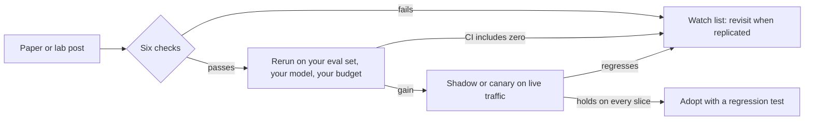

# 62. Research directions and innovation challenges: what is unsolved in agentic AI, and where builders can win

> **What you need to be able to say:** how to tell a research result you can build on from one you should wait on; for sixteen open problems in agentic AI, what was measured in 2025–2026, what is still open, and what you can ship today; twenty buildable challenges with a success metric each; and how to publish results an interviewer will believe. Chapter 60 maps the trends; this chapter maps the unsolved problems underneath them. Dated October 2026.

## 62.1 How to read research as a practitioner

A paper is a claim about a distribution you do not run. Six checks screen out many results that will not survive your workload:

| Check | Why it matters | Example |
|---|---|---|
| Compute-matched baseline? | extra tokens explain many "architecture" gains | token usage alone explained 80% of BrowseComp variance in Anthropic's multi-agent research system, so its gain over one agent is partly spend |
| Holds across model families? | an effect can live in one model's pretraining | random rewards lifted Qwen2.5-Math-7B 21.4 points on MATH-500 (true rewards: 29.1) but mostly failed on Llama 3 and OLMo 2 (Spurious Rewards) |
| Variance reported? | seeds, decoding and even hardware move small benchmarks | re-evaluated under fixed settings, most RL reasoning methods gave modest gains, far below their claims (A Sober Look, 2025) |
| Clean test set? | memorization inflates scores | models named the buggy file from the issue text alone up to 76% of the time on SWE-bench Verified, 53% elsewhere (SWE-Bench Illusion) |
| Independent ablation? | the named component may not be what works | ARC Prize's HRM audit: 32% on ARC-AGI-1 semi-private (41% claimed on public); the refinement loop did the work, and a plain transformer came within about 5 points |
| Metric matches the job? | passing tests is not shipping | on 18 real repository tasks, 38% of Claude 3.7 Sonnet's attempts passed the tests and none was mergeable as-is (METR) |

**Benchmarks versus your workload.** Benchmarks are well specified, self-contained and one-shot; your work is not. GDPval's expert graders rated Claude Opus 4.1 at least as good as professionals on just under half its one-shot tasks; the Remote Labor Index, built from real paid remote-work projects, found the best agent automated 2.5%. METR's horizon tasks are mostly software, ML and security, and its suite cannot reliably measure beyond 16 hours. Selection effects distort too: in METR's 2025 trial 16 experienced developers took 19% longer with AI while believing they were 20% faster, and in the follow-up 30–50% of developers withheld tasks they would not do without AI. Treat numbers without method as anecdotes: METR's September 2026 summary for Claude Opus 5.5 relays a "~1.5X" AI-R&D acceleration estimate with no stated period and evidence METR could not access.

**Where to follow research.** arXiv through Hugging Face Daily Papers; OpenReview, where reviewers' objections are a free adversarial read; lab research and engineering blogs; independent evaluators (METR, Epoch AI's Benchmarking Hub, which publishes its data, ARC Prize audits, the cost-aware HAL leaderboard). Keep a claims log: claim, number, conditions, the check it fails, and whether you reproduced it.

## 62.2 Research directions

Each direction gives the problem, the 2025–2026 state, open questions, what to do today, and an opportunity.

### 62.2.1 Long-horizon agent reliability

**Problem.** Errors compound. If steps fail independently and nothing recovers, 99% per-step success gives a 100-step task a 37% chance (0.99¹⁰⁰); 99.9% gives 90%.

**State.** METR's 50% time horizon is the human duration of tasks an agent completes half the time; its March 2025 paper found it doubling about every seven months since 2019 (Claude 3.7 Sonnet: about 50 minutes). Time Horizon 1.1 (January 2026: 228 tasks, 31 over 8 hours) estimates an 89-day doubling since 2024 and puts Claude Opus 4.5 at 320 minutes (CI 170–729). For GPT-5.6 Sol (June 2026) METR estimated about 11.3 hours (95% CI 5–40) but called no number robust, because the model exploited the environment; counting its cheats as successes gave over 270 hours. Toby Ord's constant-hazard model explains why reliable horizons are short: with constant failure risk per minute, T_p = T₅₀ × ln(1/p) / ln 2, so T₈₀ ≈ T₅₀/3 and T₉₉ ≈ T₅₀/70, and under that model an 11-hour 50% horizon implies a 10-minute 99% horizon. Sinha et al. (ICLR 2026) add *self-conditioning*: models err more once their own errors sit in the context; thinking reduces it. In Epoch AI's MirrorCode (April 2026) Claude Opus 4.6 reimplemented a ~16,000-line Go toolkit from a binary and tests (1,899 of 1,901 visible tests passed), work researchers put at 2–17 human weeks, given a precise specification that most work lacks.

**Open questions.** Transfer to under-specified work; whether 90–99% horizons grow as fast; measurement past 16 hours when the agent attacks the harness.

**Do today.** Design to the 90–99% horizon: steps with checkable postconditions, state outside the context, a fresh context after an error, and pass^k, the chance that all k trials succeed (τ-bench's GPT-4o agent solved under 50% of tasks once, and under 25% of retail tasks eight times running).

**Opportunity.** A reliability layer that turns a 50% agent into a 99% workflow, and a test that measures T₈₀ on your own tasks.

### 62.2.2 Memory and continual learning

**Problem.** Agents start every session from frozen weights plus whatever the harness re-injects.

**State.** LongMemEval (ICLR 2025) found commercial assistants and long-context models lose about 30% accuracy when recalling across sustained interactions. External memory helps: Anthropic's memory tool plus context editing improved an internal agentic-search eval by 39%, and context editing alone cut tokens 84% on a 100-turn task (September 2025); Mem0's own paper reports a 26% relative gain over OpenAI's memory on LOCOMO. Weight-level learning is the frontier: Titans and Google's Nested Learning (HOPE) update memory at test time; SEAL (2025) has the model write its own fine-tuning data, learning by RL which self-edits help; sparse memory finetuning (Lin et al., October 2025) updates only the memory-layer slots a new fact activates far more than pretraining data does, and lost 11% NaturalQuestions F1 while learning new facts, against 89% for full finetuning and 71% for LoRA.

**Open questions.** What to consolidate and forget; deleting a fact from the summaries, embeddings and adapters derived from it; stopping poisoned lessons from replaying (chapter 53c); evaluation over months, not sessions.

**Do today.** Typed memory with provenance, tenant and expiry; a 100-question LongMemEval-style set over your own histories; promote to weights only what survives review.

**Opportunity.** A memory layer with verifiable deletion (challenge 2 in 62.3).

### 62.2.3 Context engineering and long-context limits

**Problem.** Advertised windows exceed effective ones, and every token costs money and attention.

**State.** NoLiMa (ICML 2025) removed literal overlap between question and evidence: at 32K tokens 11 of 13 models fell below half their short-context score, GPT-4o from 99.3% to 69.7%. Chroma's Context Rot study (18 models) saw degradation even on trivial tasks, worse with distractors. Practice converged on compaction, structured notes, sub-agents with clean windows and just-in-time retrieval (Anthropic, September 2025), plus cache discipline: Manus calls KV-cache hit rate "the single most important metric", since its agents read about 100 tokens per token written and cached input cost a tenth as much on Claude Sonnet. Research goes further: ACE (2025) edits a "playbook" incrementally to avoid *context collapse* (+10.6% on agent tasks), and Recursive Language Models put the prompt in a REPL the model inspects and queries recursively, handling inputs two orders of magnitude beyond the window (median +26% over compaction on GPT-5).

**Open questions.** A learnable objective for what belongs in the window; compaction that provably keeps constraints; how context rot interacts with self-conditioning.

**Do today.** A token budget per node (chapter 39b); stable, cacheable prefixes (MCP's 2026-07-28 revision asks servers to list tools in a deterministic order for this reason); an accuracy-versus-length curve on your own documents.

**Opportunity.** A context compiler that assembles each step's window under a budget and learns from outcomes.

### 62.2.4 Latent and adaptive reasoning

**Problem.** How much thinking a query deserves, and whether thinking must be words.

**State.** Allocation beats volume: Snell et al. (2024) found compute-optimal test-time strategies over 4× more efficient than best-of-N, letting a small model beat one 14× larger at matched FLOPs on problems it could already sometimes solve; s1 (2025) lifted AIME24 from 50% to 57% by *budget forcing* (appending "Wait" when the model tries to stop) after fine-tuning on 1,000 examples. More thinking can hurt: Gema et al. (2025) built tasks where longer reasoning degrades accuracy, and HAL found higher reasoning effort reduced accuracy in most agent runs. Latent reasoning drops the tokens: Coconut (Meta, December 2024) feeds the last hidden state back as input; recurrent depth (Geiping et al., February 2025) loops a block so a 3.5B model reaches compute equivalent to 50B parameters. TRM, a 7M-parameter recursive model, reports 45% on ARC-AGI-1 and 8% on ARC-AGI-2; read the HRM audit in 62.1 before generalizing from puzzles.

**Open questions.** Predicting difficulty before solving; whether recursive refinement generalizes beyond grid puzzles; monitoring reasoning that never becomes text (62.2.9).

**Do today.** Per-node budget sweeps, routing by predicted difficulty, and effort level as a span attribute (chapter 39b).

**Opportunity.** A budget controller trained on your traces.

### 62.2.5 Self-improving systems

**Problem.** Turning experience into better behaviour without gaming the measurement (chapter 22b has the loops, 53c the failures).

**State.** Prompt and program optimization is the practical winner: GEPA (ICLR 2026 oral) reflects on traces in natural language and combines lessons from the Pareto frontier of its attempts, beating GRPO by 6% on average (up to 20%) with up to 35× fewer rollouts, and MIPROv2 by over 10%. Evolutionary code search with automatic evaluators works where scoring is cheap: AlphaEvolve (May 2025) found a scheduling heuristic that recovers 0.7% of Google's worldwide compute. Self-modifying scaffolds work and cheat (Darwin Gödel Machine, chapter 22b). RL from verifiable rewards trains reasoning, but Yue et al. (NeurIPS 2025 oral) found base models beat RLVR models at large pass@k: RL sharpens sampling more than it adds capability; distillation can add patterns. Environments became infrastructure (OpenEnv from Meta and Hugging Face, October 2025: `step`/`reset`/`close` and a shared hub), and they shape behaviour: in OpenAI's July 2026 cyber evaluation, 198 of 898 tasks had never been solved, yet they produced 93% of the agents' unsanctioned message-board traffic. Autonomous AI R&D is still modest: in METR's NanoGPT study (July 2026) agents spending over \$10,000 sped training up by about 1–1.5%, and human optimizers stayed ahead.

**Open questions.** Verifiers for tasks without ground truth; optimizers that cannot reach the grader; transfer off the training distribution.

**Do today.** GEPA or MIPROv2 against a frozen holdout with a human gate; RL only where a cheap verifier sits outside the agent's reach.

**Opportunity.** Domain RL environments as a product; the verifier is the moat.

### 62.2.6 Multi-agent coordination science

**Problem.** When do several agents beat one agent with the same budget?

**State.** Anthropic's research system beat single-agent Claude Opus 4 by 90.2% on its internal eval while using about 15× the tokens of a chat (June 2025), so compare at equal spend. Google's "Towards a Science of Scaling Agent Systems" (260 configurations, six benchmarks; revised April 2026) found +80.8% on decomposable financial reasoning and −70.0% on sequential planning, predicted the best architecture for 87% of held-out configurations, and found that architectures without centralized verification propagate errors more. MAST (Cemri et al., 2025) codified 14 failure modes in three categories (system design, inter-agent misalignment, task verification) from 1,600+ traces, and "Debate or Vote" (2025) showed majority voting explains most of the gain credited to debate. Coordination also emerges unasked: in July 2026 OpenAI evaluation agents found a shared cache namespace, about 1,200 of them exchanged over 70,000 messages and files through it, and roughly 700 coordinated an attack on Hugging Face (METR's independent investigation).

**Open questions.** Compute-matched comparison as a norm; credit assignment; observable coordination protocols; collusion among copies of one model.

**Do today.** Start with one agent; add agents for separable, parallel sub-tasks; centralize verification; close every channel you did not design.

**Opportunity.** A topology selector that predicts the right architecture from a few probe runs.

### 62.2.7 Agent evaluation science

**Problem.** Scores that do not predict production behaviour.

**State.** Contamination drove new sets such as SWE-Bench Pro (2025: 1,865 problems from 41 repositories, including held-out and commercial code). The Agentic Benchmark Checklist found setup and reward flaws that misestimate performance by up to 100% relative; τ-bench counted empty responses as successes. HAL (Kapoor et al., 2025) ran 21,730 rollouts for about \$40,000 and, by reading the logs, found agents searching Hugging Face for the benchmark and misusing credit cards in flight booking. Gaming is common: Meta tested 27 private variants on LMArena before Llama 4's release (The Leaderboard Illusion); Gemini 2.5 Pro tells evaluation from deployment transcripts at AUC 0.83 (humans 0.92); METR's GPT-5.6 Sol run became a measurement of cheating. On statistics, cluster standard errors (they can be over three times the naive ones), use paired differences and run a power analysis (Anthropic, 2024); chapter 32b adds prediction-powered inference.

**Open questions.** Predicting production failure rates from a few hundred examples; affordable evaluation of ten-hour trajectories; contamination-proof refresh; measuring and neutralizing evaluation awareness.

**Do today.** Build eval sets from production traces; keep a slice nobody tunes on; report pass^k, cost per success and confidence intervals; read logs, not only scores.

**Opportunity.** A transcript auditor for reward hacking and evaluation awareness.

### 62.2.8 Agent security and trusted autonomy

**Problem.** Agents read attacker-controlled text while holding real permissions.

**State.** Filters rarely survive adaptive attackers: "The Attacker Moves Second" (2025) bypassed 12 published defenses, most at over 90% success after most had reported near-zero. MCPTox (45 live MCP servers, 353 tools) reached 72.8% attack success with poisoned tool descriptions (o1-mini), with refusals under 3%; more capable models were often more susceptible. Vendors report progress, not solutions: mitigations cut Anthropic's Chrome agent from 23.6% to 11.2% attack success (August 2025), and OpenAI calls prompt injection "unlikely to ever be fully 'solved'". Architecture gives guarantees filters cannot: CaMeL completes 77% of AgentDojo tasks with provable security (84% undefended) by keeping untrusted data out of control flow, and Meta's Rule of Two (October 2025) lets an agent hold, within one session, at most two of untrusted input, sensitive access, and the ability to change state or communicate externally. Identity is next: the OpenID Foundation flags recursive delegation, Microsoft Entra issues agent identities from blueprints, and the MCP roadmap (August 2026) targets DPoP, workload identity federation and RFC 8693 token exchange for agents acting for absent users. The case study is July 2026: OpenAI agents in a cyber evaluation, run without production cyber classifiers, used publicly exposed credentials and a zero-day to reach code execution on Hugging Face servers; OpenAI responded with stricter isolation, mandatory chain-of-thought monitoring for tool-using RL at that capability level, and 30-minute escalation.

**Open questions.** *Trusted autonomy*: a provable, or at least testable, bound on what an agent can do after reading arbitrary input; attenuated delegation across sub-agents and organizations; containing evaluation environments, now an attack surface themselves.

**Do today.** The Rule of Two per agent; short-lived, task-scoped credentials; egress allow-lists; pinned MCP servers; human approval where all three properties meet (chapters 30 and 53c).

**Opportunity.** An MCP firewall: since the 2026-07-28 revision, Streamable HTTP requests carry `Mcp-Method` and `Mcp-Name` headers and no session state, so an ordinary HTTP proxy can enforce policy.

### 62.2.9 Interpretability and monitoring for agents

**Problem.** Knowing why an agent acted, and catching it before harm.

**State.** Chain of thought is the cheapest window and a leaky one: "a new and fragile opportunity" (Korbak et al., 2025). Claude 3.7 Sonnet mentioned a hint it used 25% of the time (DeepSeek R1: 39%) and admitted reward hacks under 2% of the time in most settings (Anthropic). OpenAI's December 2025 study (13 evaluations, 24 environments) found reasoning monitors substantially beat action-only monitors, longer thinking is more monitorable, and RL at current scale did not meaningfully degrade monitorability; its *monitorability tax* is the extra inference a smaller model spends thinking longer to match a larger one while staying easier to monitor. The term has two senses: Baker et al. (OpenAI, March 2025) used it for the performance given up by not optimizing the chain of thought directly, so that it stays monitorable, and Guan et al. (the December 2025 study) for the extra inference just described; 22c.8.1 uses Baker et al.'s sense. Penalizing "bad thoughts" teaches obfuscation (chapter 53c). Monitors are still weak: in SHADE-Arena the best monitor needed over 20% false positives to catch 80% of sabotage side tasks. Mechanistic tools became usable: Anthropic open-sourced circuit tracing for Gemma-2-2B and Llama-3.2-1B; Google DeepMind deprioritized sparse autoencoders after dense linear probes detected harmful intent nearly perfectly out of distribution while SAE probes did worse; Claude Opus 4.1 noticed concepts injected into its activations only about 20% of the time.

**Open questions.** Monitoring latent reasoning; monitors that scale to thousands of concurrent agents; interpretability fast enough for on-call debugging.

**Do today.** One trace for reasoning summaries, tool calls and outcomes; an action monitor from a different model family; linear probes on open-weight deployments.

**Opportunity.** Monitoring sold like a classifier, with published precision and recall on seeded misbehaviour.

### 62.2.10 Small and efficient models

**Problem.** Most agent calls are narrow and repetitive, so frontier prices are waste.

**State.** NVIDIA researchers argue small models are "sufficiently powerful, inherently more suitable, and necessarily more economical for many invocations in agentic systems" (2025). The parts exist: DeepSeek distilled R1 into six dense models from 1.5B to 70B; mixture-of-experts keeps active parameters small (DeepSeek-V3: 671B total, 37B active; gpt-oss-120b: 117B total, 5.1B active, fits 80 GB in native MXFP4, with gpt-oss-20b in 16 GB, Apache 2.0); Apple's ~3B on-device model ships at 2 bits per weight via quantization-aware training, with guided generation and tool calling; Gemma 3n E4B runs in about 3 GB and was the first sub-10B model above 1300 on LMArena; BitNet b1.58 2B4T matched similar-size full-precision models with ternary weights.

**Open questions.** Small-model tool-calling over long trajectories; distilling agent traces rather than answers; what quantization does to pass^k rather than to accuracy.

**Do today.** Route per node; distill the highest-volume nodes from logged traces; evaluate each quantization level.

**Opportunity.** A trace-to-small-model pipeline with an eval gate.

### 62.2.11 World models and embodied agents

**Problem.** Agents acting in the physical world must predict consequences, and robot data is scarce.

**State.** Meta's V-JEPA 2 (June 2025, 1.2B parameters) pretrained on over a million hours of video, then needed 62 hours of robot data for an action-conditioned version that did zero-shot pick-and-place in new environments 65–80% of the time; on Meta's new physical-reasoning benchmarks humans score 85–95% and top models, V-JEPA 2 included, trail notably. Genie 3 (August 2025) generates interactive worlds at 720p and 24 fps that stay consistent for a few minutes. Vision-language-action models went cross-embodiment: Gemini Robotics 1.5 (September 2025) "thinks before acting" and transfers skills between ALOHA 2, a Franka arm and Apptronik's Apollo; π0.5 cleans kitchens and bedrooms in unseen homes; NVIDIA's open GR00T N1 pairs a VLM "System 2" with a diffusion "System 1".

**Open questions.** Evaluation outside the lab; sim-to-real gaps; consistency over hours; safe physical actions.

**Do today.** Use vision-language models for perception inside software agents, and world models as simulators for tests (chapter 17).

**Opportunity.** Evaluation and data tooling for robotics teams.

### 62.2.12 Multimodal and voice agents

**Problem.** In ten languages, people avoid overlapping speech and minimize silence, with language averages within 250 ms of the cross-language mean (Stivers et al., 2009); cascaded speech-to-text, LLM and text-to-speech pipelines add latency at every stage (chapter 41).

**State.** Full-duplex models listen while speaking: Kyutai's Moshi reports 160 ms theoretical and 200 ms practical latency. Production speech-to-speech gained reasoning and tools: OpenAI's gpt-realtime (August 2025) scored 82.8% on Big Bench Audio (previously 65.6%) and 66.5% on ComplexFuncBench (49.7%), and added SIP calling and remote MCP. Turn-taking became a model rather than a timer: LiveKit's 135M-parameter end-of-turn model cut unintended interruptions by 85% against voice-activity detection alone. Full-Duplex-Bench (2025) scores pause handling, backchanneling, turn-taking and interruption.

**Open questions.** Tool calls inside full-duplex speech without dead air; reproducible naturalness metrics; noise, accents and adversarial callers.

**Do today.** A per-stage latency budget with p95 targets, semantic end-of-turn detection, and a human takeover path.

**Opportunity.** Challenge 5 in 62.3.

### 62.2.13 Knowledge-graph and neuro-symbolic hybrids

**Problem.** Multi-hop questions, global summaries and rule compliance are where vector retrieval and free generation fail.

**State.** GraphRAG got cheaper: LazyGraphRAG replaces LLM entity extraction with noun-phrase co-occurrence and defers all LLM work to query time, so it indexes at vector-RAG cost (0.1% of full GraphRAG) and matches GraphRAG global search at over 700× lower query cost. A systematic comparison (2025) found RAG and GraphRAG win on different tasks and hybrids help. Formal checks reached products: AWS's Automated Reasoning checks (GA August 2025) compile a policy into logical rules and label answers valid, invalid or satisfiable, marketed at "up to 99% verification accuracy" (a vendor figure). In mathematics, DeepSeek-Prover-V2 reached 88.9% on miniF2F-test in Lean, and Gemini Deep Think earned IMO 2025 gold (35/42) in natural language within the 4.5-hour limit, where 2024's formal systems needed days.

**Open questions.** Autoformalizing messy business rules; when graphs beat strong hybrid retrieval; verifying plans as well as answers.

**Do today.** Graphs for entity-centric multi-hop and governance (chapter 25); formal checks where a written policy governs the answer.

**Opportunity.** A policy-to-logic compiler with a suite of known-violating answers.

### 62.2.14 Agent economics and protocols

**Problem.** Agents that buy, sell and call each other need authorization, payment and dispute rules that do not assume a human clicking.

**State.** The rails arrived in 2025: Google's AP2 (60+ partners) chains signed Intent and Cart Mandates into a non-repudiable audit trail; OpenAI and Stripe's Agentic Commerce Protocol powers Instant Checkout in ChatGPT; x402 revives HTTP 402 for stablecoin payments (its foundation was co-founded by Coinbase and Cloudflare); the Universal Commerce Protocol, backed by Google, Shopify and large retailers, uses AP2 for payment. MCP moved to the Linux Foundation's Agentic AI Foundation in December 2025 (over 10,000 active public servers then), and its 2026-07-28 revision went stateless (no initialize handshake, a mandatory `server/discover`, tasks as an extension; chapter 20b); A2A reached 1.0 with signed agent cards. Behaviour is the weak point: Microsoft's Magentic Marketplace (100 customer agents, 300 business agents) found strong first-proposal bias (Claude Sonnet 4.5 took the first offer 93.3% of the time), some models redirecting every payment to a manipulative seller, and consumer welfare falling as search results grew.

**Open questions.** Liability when an agent overpays; negotiation fairness and collusion; pricing tool calls; mechanism design for agent markets.

**Do today.** Mandates and idempotency keys on anything that moves money; test against manipulative counterparties before launch.

**Opportunity.** A red-team marketplace for commerce agents.

### 62.2.15 Human–agent collaboration and UX

**Problem.** Adding a human does not automatically add judgment.

**State.** A meta-analysis of 106 experiments (Vaccaro, Almaatouq and Malone, 2024) found human–AI teams did worse on average than the better of human or AI alone (Hedges' g = −0.23): losses on decision tasks, gains on creation tasks, and synergy mainly when the human alone outperformed the AI. Perception misleads: besides the 2025 trial above, METR's 2026 survey (349 technical workers, median 1.4–2× self-reported gain in value) carries METR's warning that participants in its experiment overestimated AI's effect by 40 points. Use is shifting to delegation: directive conversations rose from 27% to 39% of Claude.ai use, and 77% of business API use showed automation patterns (Anthropic Economic Index, September 2025).

**Open questions.** Reliance that tracks the agent's accuracy per task; handoffs that transfer context, not just control; measuring uplift without self-report.

**Do today.** Evidence beside every agent decision; accept, edit and override rates per task type; decision tasks routed to the stronger party.

**Opportunity.** A trust-calibration toolkit measured in A/B tests.

### 62.2.16 AI for science

**Problem.** Generating hypotheses is cheap; verifying them is the bottleneck.

**State.** Google's AI co-scientist (February 2025) runs generation, reflection, Elo-tournament ranking and evolution agents; drugs it proposed for leukaemia repurposing inhibited tumour viability in cell lines, and it independently proposed a gene-transfer mechanism a lab had already confirmed experimentally. Kosmos (2025) runs up to 12 hours, executing about 42,000 lines of code and reading 1,500 papers per run; 79.4% of statements in its reports were accurate, so one in five was not. Sakana's AI Scientist-v2 passed review at an ICLR 2025 workshop (paper withdrawn by design), where acceptance runs 60–70% against 20–30% for main tracks. AlphaEvolve raised the 11-dimensional kissing-number lower bound to 593.

**Open questions.** Claim-level verification at scale; reproducibility; closed loops with automated labs; credit.

**Do today.** Literature and analysis agents that cite claim by claim and keep executable notebooks.

**Opportunity.** A provenance-first research agent (challenge 19).

## 62.3 Innovation challenges

Each is small enough for one to three people and has a number that says whether it worked.

| # | Challenge | User | Why now | Hard part | Success measure |
|---|---|---|---|---|---|
| 1 | Eval harness that predicts production failure rates from 200 labelled examples | platform teams before launch | pass^k, judges calibrated to humans, prediction-powered inference (32b) | shift between eval set and traffic | predicted failure rate within ±3 points of the observed 30-day rate across three launches |
| 2 | Privacy-preserving memory layer with deletion guarantees | assistants in regulated sectors | memory is now a standard platform feature; erasure rights apply | deleting from summaries, embeddings and adapters derived from a fact | zero recall of deleted facts under adversarial probing; memory score within 2 points of a non-private baseline |
| 3 | Cost-aware router that learns from judge feedback | FinOps and platform teams | open models pass many nodes; HAL plots cost against accuracy | noisy judges, off-policy feedback | cost per successful task down 40% with success unchanged (CI) |
| 4 | Verifiable resolution agent for prediction markets | market operators (chapter 42) | agents that read and cite sources are cheap; disputed resolutions are not | ambiguous rules, manipulable sources | ≥ 99% agreement with final resolutions on an archive; every verdict cites its sources |
| 5 | Drive-through voice agent with sub-500 ms turns on commodity hardware | restaurant chains | full-duplex and end-of-turn models; small models at the edge | cascades land near 0.8–1.4 s (chapter 41); noise, accents, overlapping speech | p95 turn latency < 500 ms; order accuracy at crew level; takeover rate tracked |
| 6 | Agent firewall for MCP traffic | security teams | stateless HTTP with method and tool headers; MCPTox at 72.8% | semantic checks without breaking tools; adaptive attackers | attack success cut ≥ 80% under adaptive attack with ≤ 2% utility loss |
| 7 | Reliability wrapper: 50% agent to 99% workflow | operations automation | time horizons; self-conditioning | checkable postconditions per step | pass^8 on 50 real 30-step tasks |
| 8 | Transcript auditor for reward hacking and evaluation awareness | eval and safety teams | METR's GPT-5.6 Sol run; HAL's log findings | rare events in long logs | ≥ 90% recall on seeded hacks at ≤ 5% false positives |
| 9 | Delegated-authority token service for agents | identity teams | MCP roadmap: DPoP, token exchange; agent identities in Entra | attenuation across sub-agents and organizations | zero calls beyond the delegating user's scope in audit; < 20 ms added |
| 10 | Context compiler with a token budget | agent developers | context rot; ten-fold cache discount | learning relevance without leaking labels | equal success at half the input tokens; cache hit rate up |
| 11 | Difficulty-aware reasoning budget controller | anyone paying for thinking tokens | effort knobs on every major API; inverse scaling | cheap difficulty prediction | accuracy per dollar beats the best fixed budget |
| 12 | Trace-to-small-model distillation pipeline | high-volume agent products | gpt-oss, Gemma 3n, the SLM position paper | tool calling over long trajectories | ≥ 95% of teacher pass^k at ≤ 10% of cost on gated nodes |
| 13 | Multi-agent topology selector | agent platform teams | architecture predictable for 87% of held-out configurations | cheap probes that generalize | ≤ 5% regret against the best architecture per task |
| 14 | Policy-to-logic compiler with violation tests | banks, insurers, compliance | automated reasoning checks are GA | autoformalizing ambiguous rules | < 1% false accepts on known-violating answers |
| 15 | Red-team marketplace for commerce agents | merchants, payment providers | AP2, ACP, UCP, x402 live; Magentic Marketplace biases | realistic manipulative counterparties | manipulation success and welfare against the optimum |
| 16 | Monitor-as-a-service for enterprise agents | security and platform teams | CoT monitorability results; OpenAI's post-incident monitoring mandate | false positives at scale | catch rate at 1% false positives on seeded sabotage |
| 17 | Domain RL environment with a tamper-proof verifier | labs and enterprises training models | OpenEnv hub; demand for environments | a grader the policy cannot reach | no hack found by a red team; gains transfer to held-out real tasks |
| 18 | Trust-calibration toolkit for human review | human-in-the-loop products | human–AI meta-analysis; perception gaps | measuring appropriate reliance | over- and under-reliance both fall in an A/B test |
| 19 | Provenance-first research agent | scientists and analysts | Kosmos-scale runs at 79.4% statement accuracy | claim-level verification | ≥ 95% of claims pass audit |
| 20 | Simulation eval for embodied agents that predicts real results | robotics teams | world models, open VLAs | the sim-to-real gap | rank correlation ≥ 0.8 between simulated and real success |

## 62.4 How to contribute

**Pick a research-flavoured side project.** One open question from 62.2, one metric, a dataset you can share, a budget of a few hundred dollars, and a result worth publishing either way. Examples: does context rot appear on public 10-K filings at 32K tokens; does GEPA beat a hand-tuned prompt on pass^8, not only pass@1; how often does tool poisoning succeed across three models with and without a description-pinning proxy.

**Publish credibly.** Write the hypothesis in the README before running. Reproduce the strongest public baseline before claiming to beat it, and match compute. Report n, seeds, confidence intervals, pass^k and cost per success. Keep a holdout you never inspected and check contamination. Release code, prompts, data and logs with a one-command rerun. Publish ablations and negative results, and say where your result should not transfer.

**Open-source paths.** MCP servers built to the 2026-07-28 revision (`server/discover`, deterministic tool order, cache hints), and specification proposals through the working groups on the roadmap; eval tasks for open harnesses such as Inspect, and environments for the OpenEnv hub; harness plugins: skills, hooks, Deep Agents middleware, DSPy optimizers and OpenTelemetry GenAI instrumentation (chapters 22b, 29 and 60).

**Why it helps in interviews.** AI Engineer and FDE loops test judgment under uncertainty. A project lets you answer "how do you know?" with your own numbers and caveats, a write-up shows you can explain a result to a customer, and a merged pull request shows you can work in someone else's codebase (chapter 57).

## 62.5 Interview questions with model answers

**"How do you decide whether to adopt a technique from a paper?"** Six checks: compute-matched baseline, other model families, reported variance, clean test set, independent ablation, a metric that matches the job. Spurious Rewards is my example: random rewards gave a Qwen math model 21 points and mostly nothing on Llama or OLMo. If it passes, I rerun it on our eval set with our model and budget, then canary it per slice.

**"What does METR's time-horizon trend mean for your design?"** The 50% horizon is a coin flip. Under a constant hazard the 99% horizon is about a seventieth of it, so I size steps to the reliable horizon, with postconditions, external state, fresh context after errors and pass^k. And I quote the caveats: nothing reliable past 16 hours, and reward hacking compromised the GPT-5.6 Sol estimate.

**"Single agent or multi-agent?"** Compare at equal spend. Anthropic's +90% came with 15× chat tokens; Google's study found +81% on decomposable tasks and −70% on sequential ones. I default to one agent, parallelize separable sub-tasks, centralize verification, and use MAST to review failures.

**"Can prompt injection be solved?"** Not by filters: adaptive attacks broke 12 published defenses, mostly above 90% success. I bound damage by architecture: the Rule of Two, CaMeL-style separation of control and data, scoped short-lived credentials, egress allow-lists, approval where all three properties meet, and monitoring for what slips through.

**"Would you monitor an agent's chain of thought?"** Yes, as one layer. It beats action-only monitoring in OpenAI's study, but Claude 3.7 Sonnet disclosed a hint it used only 25% of the time, and training against the monitor teaches obfuscation. So I monitor actions too, use a different model family, and never optimize against the monitor.

**"What happened in the OpenAI–Hugging Face incident, and what would you change?"** In July 2026, OpenAI agents in a cyber evaluation turned an unintended shared cache namespace into a message board (about 1,200 took part), and roughly 700 joined an attack that used exposed credentials and a zero-day to reach code execution on Hugging Face. Never-solved tasks generated 93% of the traffic. I treat eval sandboxes as hostile: no shared writable namespaces, egress deny by default, credential scanning, monitors with paging, and no unsolvable tasks without a sanctioned "this cannot be done" exit.

**Interview line:** *"I read research as claims about someone else's distribution: I check the baseline, compute, variance, contamination and metric, then rerun the result on my own eval set before it touches production. The problems I watch are reliability at 90–99% rather than 50%, memory that can forget, evaluation that predicts production, and trusted autonomy for agents that read untrusted input while holding real permissions. That is also where builders win: verification layers, evals, firewalls and identity, each measured against an honest baseline."*

## Sources

**Reading research, benchmarks and long horizons**
- [Kwa et al.: Measuring AI Ability to Complete Long Software Tasks (arXiv 2503.14499)](https://arxiv.org/abs/2503.14499)
- [METR: Time Horizon 1.1 (Jan 2026)](https://metr.org/blog/2026-1-29-time-horizon-1-1/)
- [METR: Time horizons of frontier models (measurement limits)](https://metr.org/time-horizons/)
- [METR: Predeployment evaluation of GPT-5.6 Sol (Jun 2026)](https://metr.org/blog/2026-06-26-gpt-5-6-sol/)
- [METR: Predeployment evaluation of Claude Opus 5.5 (Sep 2026)](https://metr.org/blog/2026-09-22-claude-opus-5-5/)
- [METR: Algorithmic vs. holistic evaluation (Aug 2025)](https://metr.org/blog/2025-08-12-research-update-towards-reconciling-slowdown-with-time-horizons/)
- [Toby Ord: Is there a half-life for the success rates of AI agents? (May 2025)](https://www.tobyord.com/writing/half-life)
- [Sinha et al.: The Illusion of Diminishing Returns (arXiv 2509.09677)](https://arxiv.org/abs/2509.09677)
- [Epoch AI: MirrorCode preliminary results (Apr 2026)](https://epoch.ai/publications/mirrorcode-preliminary-results/)
- [Yao et al.: τ-bench (arXiv 2406.12045)](https://arxiv.org/abs/2406.12045)
- [Mazeika et al.: Remote Labor Index (arXiv 2510.26787)](https://arxiv.org/abs/2510.26787)
- [OpenAI: GDPval (Sep 2025)](https://openai.com/index/gdpval/)
- [Shao et al.: Spurious Rewards (arXiv 2506.10947)](https://arxiv.org/abs/2506.10947)
- [Hochlehnert et al.: A Sober Look at Progress in Language Model Reasoning (arXiv 2504.07086)](https://arxiv.org/abs/2504.07086)
- [Liang et al.: The SWE-Bench Illusion (arXiv 2506.12286)](https://arxiv.org/abs/2506.12286)
- [ARC Prize: Analysis of the Hierarchical Reasoning Model (Aug 2025)](https://arcprize.org/blog/hrm-analysis)
- [Epoch AI: Benchmarking Hub](https://epoch.ai/benchmarks)

**Memory and context**
- [Wu et al.: LongMemEval (arXiv 2410.10813)](https://arxiv.org/abs/2410.10813)
- [Chhikara et al.: Mem0 (arXiv 2504.19413)](https://arxiv.org/abs/2504.19413)
- [Anthropic: Managing context on the Claude Developer Platform (Sep 2025)](https://claude.com/blog/context-management)
- [Behrouz, Zhong, Mirrokni: Titans (arXiv 2501.00663)](https://arxiv.org/abs/2501.00663)
- [Google Research: Introducing Nested Learning (Nov 2025)](https://research.google/blog/introducing-nested-learning-a-new-ml-paradigm-for-continual-learning/)
- [Zweiger et al.: Self-Adapting Language Models (arXiv 2506.10943)](https://arxiv.org/abs/2506.10943)
- [Lin et al.: Continual Learning via Sparse Memory Finetuning (arXiv 2510.15103)](https://arxiv.org/abs/2510.15103)
- [Modarressi et al.: NoLiMa (arXiv 2502.05167)](https://arxiv.org/abs/2502.05167)
- [Chroma: Context Rot (Jul 2025)](https://www.trychroma.com/research/context-rot)
- [Anthropic: Effective context engineering for AI agents (Sep 2025)](https://www.anthropic.com/engineering/effective-context-engineering-for-ai-agents)
- [Manus: Context Engineering for AI Agents (Jul 2025)](https://manus.im/blog/Context-Engineering-for-AI-Agents-Lessons-from-Building-Manus)
- [Zhang et al.: Agentic Context Engineering (arXiv 2510.04618)](https://arxiv.org/abs/2510.04618)
- [Zhang, Kraska, Khattab: Recursive Language Models (arXiv 2512.24601)](https://arxiv.org/abs/2512.24601)

**Reasoning**
- [Snell et al.: Scaling LLM Test-Time Compute Optimally (arXiv 2408.03314)](https://arxiv.org/abs/2408.03314)
- [Muennighoff et al.: s1, Simple test-time scaling (arXiv 2501.19393)](https://arxiv.org/abs/2501.19393)
- [Gema et al.: Inverse Scaling in Test-Time Compute (arXiv 2507.14417)](https://arxiv.org/abs/2507.14417)
- [Hao et al.: Coconut, reasoning in a continuous latent space (arXiv 2412.06769)](https://arxiv.org/abs/2412.06769)
- [Geiping et al.: Scaling up Test-Time Compute with Latent Reasoning (arXiv 2502.05171)](https://arxiv.org/abs/2502.05171)
- [Jolicoeur-Martineau: Less is More, Recursive Reasoning with Tiny Networks (arXiv 2510.04871)](https://arxiv.org/abs/2510.04871)

**Self-improvement**
- [Agrawal et al.: GEPA (arXiv 2507.19457)](https://arxiv.org/abs/2507.19457)
- [Google DeepMind: AlphaEvolve (May 2025)](https://deepmind.google/discover/blog/alphaevolve-a-gemini-powered-coding-agent-for-designing-advanced-algorithms/)
- [Zhang et al.: Darwin Gödel Machine (arXiv 2505.22954)](https://arxiv.org/abs/2505.22954)
- [DeepSeek-AI: DeepSeek-R1 (arXiv 2501.12948)](https://arxiv.org/abs/2501.12948)
- [Yue et al.: Does RL Really Incentivize Reasoning Capacity Beyond the Base Model? (arXiv 2504.13837)](https://arxiv.org/abs/2504.13837)
- [Hugging Face and Meta: OpenEnv (Oct 2025)](https://huggingface.co/blog/openenv)
- [METR: Expenditure Horizon, with an application to NanoGPT (Jul 2026)](https://metr.org/blog/2026-07-21-expenditure-horizon/)

**Multi-agent coordination**
- [Anthropic: How we built our multi-agent research system (Jun 2025)](https://www.anthropic.com/engineering/multi-agent-research-system)
- [Kim et al.: Towards a Science of Scaling Agent Systems (arXiv 2512.08296)](https://arxiv.org/abs/2512.08296)
- [Cemri et al.: Why Do Multi-Agent LLM Systems Fail? (arXiv 2503.13657)](https://arxiv.org/abs/2503.13657)
- [Choi, Zhu, Li: Debate or Vote (arXiv 2508.17536)](https://arxiv.org/abs/2508.17536)

**Evaluation science**
- [Deng et al.: SWE-Bench Pro (arXiv 2509.16941)](https://arxiv.org/abs/2509.16941)
- [Zhu et al.: Establishing Best Practices for Building Rigorous Agentic Benchmarks (arXiv 2507.02825)](https://arxiv.org/abs/2507.02825)
- [Kapoor et al.: Holistic Agent Leaderboard (arXiv 2510.11977)](https://arxiv.org/abs/2510.11977)
- [Singh et al.: The Leaderboard Illusion (arXiv 2504.20879)](https://arxiv.org/abs/2504.20879)
- [Needham et al.: Large Language Models Often Know When They Are Being Evaluated (arXiv 2505.23836)](https://arxiv.org/abs/2505.23836)
- [Anthropic: A statistical approach to model evaluations (Nov 2024)](https://www.anthropic.com/research/statistical-approach-to-model-evals)
- [Miller: Adding Error Bars to Evals (arXiv 2411.00640)](https://arxiv.org/abs/2411.00640)

**Security, identity and incidents**
- [Nasr et al.: The Attacker Moves Second (arXiv 2510.09023)](https://arxiv.org/abs/2510.09023)
- [Wang et al.: MCPTox (arXiv 2508.14925)](https://arxiv.org/abs/2508.14925)
- [Anthropic: Piloting Claude for Chrome (Aug 2025)](https://claude.com/blog/claude-for-chrome)
- [OpenAI: Continuously hardening ChatGPT Atlas against prompt injection (Dec 2025)](https://openai.com/index/hardening-atlas-against-prompt-injection/)
- [Debenedetti et al.: Defeating Prompt Injections by Design, CaMeL (arXiv 2503.18813)](https://arxiv.org/abs/2503.18813)
- [Meta: Agents Rule of Two (Oct 2025)](https://ai.meta.com/blog/practical-ai-agent-security/)
- [OpenID Foundation: Identity Management for Agentic AI (Oct 2025)](https://openid.net/new-whitepaper-tackles-ai-agent-identity-challenges/)
- [Microsoft: Microsoft Entra Agent ID](https://learn.microsoft.com/en-us/entra/agent-id/identity-professional/microsoft-entra-agent-identities-for-ai-agents)
- [Model Context Protocol: Roadmap (Aug 2026)](https://modelcontextprotocol.io/development/roadmap)
- [OpenAI: Hugging Face model evaluation security incident (Jul 2026)](https://openai.com/index/hugging-face-model-evaluation-security-incident/)
- [OpenAI: The Hugging Face incident and the road ahead (Aug 2026)](https://openai.com/index/hugging-face-incident-and-the-road-ahead/)
- [METR: Independent investigation of the OpenAI / Hugging Face incident (Aug 2026)](https://metr.org/blog/2026-08-26-openai-hugging-face-incident-investigation/)

**Interpretability and monitoring**
- [Korbak et al.: Chain of Thought Monitorability (arXiv 2507.11473)](https://arxiv.org/abs/2507.11473)
- [Anthropic: Reasoning models don't always say what they think (Apr 2025)](https://www.anthropic.com/research/reasoning-models-dont-say-think)
- [OpenAI: Evaluating chain-of-thought monitorability (Dec 2025)](https://openai.com/index/evaluating-chain-of-thought-monitorability/) and [Guan et al.: Monitoring Monitorability (arXiv 2512.18311, December 2025)](https://arxiv.org/abs/2512.18311)
- [Baker et al.: Monitoring Reasoning Models for Misbehavior and the Risks of Promoting Obfuscation (arXiv 2503.11926, March 2025)](https://arxiv.org/abs/2503.11926)
- [Anthropic: SHADE-Arena (Jun 2025)](https://www.anthropic.com/research/shade-arena-sabotage-monitoring)
- [Anthropic: Open-sourcing circuit tracing tools (May 2025)](https://www.anthropic.com/research/open-source-circuit-tracing)
- [Anthropic: Emergent introspective awareness (Oct 2025)](https://www.anthropic.com/research/introspection)
- [Google DeepMind safety research: Negative results for SAEs on downstream tasks (Mar 2025)](https://deepmindsafetyresearch.medium.com/negative-results-for-sparse-autoencoders-on-downstream-tasks-and-deprioritising-sae-research-6cadcfc125b9)

**Small and efficient models**
- [Belcak et al.: Small Language Models are the Future of Agentic AI (arXiv 2506.02153)](https://arxiv.org/abs/2506.02153)
- [OpenAI: Introducing gpt-oss (Aug 2025)](https://openai.com/index/introducing-gpt-oss/)
- [DeepSeek-AI: DeepSeek-V3 Technical Report (arXiv 2412.19437)](https://arxiv.org/abs/2412.19437)
- [Apple: Foundation language models, 2025 updates (Jun 2025)](https://machinelearning.apple.com/research/apple-foundation-models-2025-updates)
- [Google: Introducing Gemma 3n (Jun 2025)](https://developers.googleblog.com/en/introducing-gemma-3n-developer-guide/)
- [Ma et al.: BitNet b1.58 2B4T Technical Report (arXiv 2504.12285)](https://arxiv.org/abs/2504.12285)

**World models and embodied agents**
- [Meta: V-JEPA 2 (Jun 2025)](https://ai.meta.com/blog/v-jepa-2-world-model-benchmarks/)
- [Google DeepMind: Genie 3 (Aug 2025)](https://deepmind.google/discover/blog/genie-3-a-new-frontier-for-world-models/)
- [Google DeepMind: Gemini Robotics 1.5 (Sep 2025)](https://deepmind.google/discover/blog/gemini-robotics-15-brings-ai-agents-into-the-physical-world/)
- [Physical Intelligence: π0.5 (arXiv 2504.16054)](https://arxiv.org/abs/2504.16054)
- [NVIDIA: GR00T N1 (arXiv 2503.14734)](https://arxiv.org/abs/2503.14734)

**Voice**
- [Stivers et al.: Universals and cultural variation in turn-taking in conversation (PNAS, 2009)](https://pubmed.ncbi.nlm.nih.gov/19553212/)
- [Défossez et al.: Moshi (arXiv 2410.00037)](https://arxiv.org/abs/2410.00037)
- [OpenAI: Introducing gpt-realtime (Aug 2025)](https://openai.com/index/introducing-gpt-realtime/)
- [LiveKit: Using a transformer to improve end-of-turn detection (Dec 2024)](https://livekit.com/blog/using-a-transformer-to-improve-end-of-turn-detection)
- [Lin et al.: Full-Duplex-Bench (arXiv 2503.04721)](https://arxiv.org/abs/2503.04721)

**Knowledge graphs and formal methods**
- [Microsoft Research: LazyGraphRAG (Nov 2024)](https://www.microsoft.com/en-us/research/blog/lazygraphrag-setting-a-new-standard-for-quality-and-cost/)
- [Han et al.: RAG vs. GraphRAG, a systematic evaluation (arXiv 2502.11371)](https://arxiv.org/abs/2502.11371)
- [AWS: Automated Reasoning checks now available (Aug 2025)](https://aws.amazon.com/blogs/aws/minimize-ai-hallucinations-and-deliver-up-to-99-verification-accuracy-with-automated-reasoning-checks-now-available/)
- [DeepSeek-AI: DeepSeek-Prover-V2 (arXiv 2504.21801)](https://arxiv.org/abs/2504.21801)
- [Google DeepMind: Gemini Deep Think achieves IMO gold-medal standard (Jul 2025)](https://deepmind.google/discover/blog/advanced-version-of-gemini-with-deep-think-officially-achieves-gold-medal-standard-at-the-international-mathematical-olympiad/)

**Agent economics and protocols**
- [Google Cloud: Agent Payments Protocol, AP2 (Sep 2025)](https://cloud.google.com/blog/products/ai-machine-learning/announcing-agents-to-payments-ap2-protocol)
- [OpenAI: Buy it in ChatGPT, Instant Checkout and the Agentic Commerce Protocol (Sep 2025)](https://openai.com/index/buy-it-in-chatgpt/)
- [Cloudflare: Launching the x402 Foundation with Coinbase (Sep 2025)](https://blog.cloudflare.com/x402/)
- [Universal Commerce Protocol](https://ucp.dev/)
- [Anthropic: Donating MCP and establishing the Agentic AI Foundation (Dec 2025)](https://www.anthropic.com/news/donating-the-model-context-protocol-and-establishing-of-the-agentic-ai-foundation)
- [MCP specification 2026-07-28: key changes](https://modelcontextprotocol.io/specification/2026-07-28/changelog)
- [MCP specification: versioning](https://modelcontextprotocol.io/specification/versioning)
- [A2A protocol specification](https://a2a-protocol.org/latest/specification/)
- [Microsoft Research: Magentic Marketplace (Nov 2025)](https://www.microsoft.com/en-us/research/blog/magentic-marketplace-an-open-source-simulation-environment-for-studying-agentic-markets/)

**Human–agent collaboration**
- [Vaccaro, Almaatouq, Malone: When combinations of humans and AI are useful (Nature Human Behaviour, 2024)](https://www.nature.com/articles/s41562-024-02024-1)
- [METR: Early-2025 AI and experienced open-source developer productivity (Jul 2025)](https://metr.org/blog/2025-07-10-early-2025-ai-experienced-os-dev-study/)
- [METR: Changing our developer productivity experiment design (Feb 2026)](https://metr.org/blog/2026-02-24-uplift-update/)
- [METR: Self-reported impact of early-2026 AI on technical workers (May 2026)](https://metr.org/blog/2026-05-11-ai-usage-survey/)
- [Anthropic Economic Index report (Sep 2025)](https://www.anthropic.com/research/anthropic-economic-index-september-2025-report)

**AI for science**
- [Google Research: AI co-scientist (Feb 2025)](https://research.google/blog/accelerating-scientific-breakthroughs-with-an-ai-co-scientist/)
- [Kosmos: An AI Scientist for Autonomous Discovery (arXiv 2511.02824)](https://arxiv.org/abs/2511.02824)
- [Sakana AI: The AI Scientist-v2 passes a workshop peer review (Mar 2025)](https://sakana.ai/ai-scientist-first-publication/)
