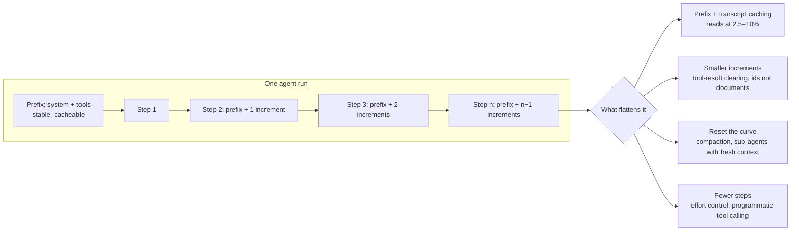

# 63. FinOps: token costs, and how you optimise them in a production agent

> **What you need to be able to say:** where the tokens in an agent go (input, context, retrieval, output and hidden reasoning), why input and reasoning dominate, and why agent cost grows with the square of the step count; how to measure cost per successful task before touching anything; the levers in order of payoff — prefix caching, routing, context engineering, reasoning budgets, output control, batch and semantic caches, distillation, commitments, self-hosting — each with the mechanics, the 2026 vendor numbers and one industrial case that proves it; how to govern spend with gateway budgets, unit-cost anomalies and cost deltas in CI; and how to price the product so the token bill does not eat the margin. Chapter 31 has the ten-lever summary and chapter 39 the two-minute answer; this chapter is the long form a senior interviewer expects. Dated October 2026.

## 63.1 What the interviewer is testing

"How do you optimise token costs?" is a question about method, not about a trick. The strong answer has four parts and a shape:

1. **Anatomy.** You can say where the tokens go in *this* workload and which price applies to each kind.
2. **Measurement.** You instrument before you optimise, and your unit is cost per *successful* task, not cost per call.
3. **Levers, in order.** You pull the big, cheap, reversible levers first (caching, routing, context) and the expensive, slow ones last (distillation, commitments, self-hosting), and you can quote what each one typically saves and why.
4. **Quality gate and governance.** Every change is gated on the eval set; budgets are enforced at the gateway, not in a dashboard; the business sees a unit metric it recognises.

The weak answer lists "use a smaller model and cache" and stops. The difference between the two is a napkin calculation with the right price ratios, and one story from a real system.

## 63.2 Tokenomics: the anatomy of a token bill

**Five kinds of tokens.** A June 2026 paper on *AI tokenomics* (Zhu, NYU) writes the footprint of a request as the sum of input, context, retrieval, output and hidden-reasoning tokens, and its cost as input-priced tokens plus output-priced tokens plus hidden tokens, which every vendor bills at the output rate. Its case studies are worth remembering: in a legal-contract workflow hidden reasoning was 33–60% of the token footprint; in a RAG workflow the marginal value of a reasoning token was about six times that of a retrieval token; in a multi-agent planning cycle of 210k tokens the split was roughly 5% planning, 24% retrieval, 48% execution, 10% monitoring and 14% replanning. The paper's thesis is that per-token pricing "often fails to reflect true computational expenditure", which is why the market is moving toward per-outcome pricing (section 63.7).

**Price asymmetry.** Output costs three to five times input on every 2026 price list (Claude Opus 5.5 \$4 in, \$20 out; GPT-5.6 Terra \$2/\$12; Gemini 3.1 Pro \$2/\$12). Reasoning tokens are output. A cache read costs 2.5–10% of input depending on the tier. So one input token read from cache can be two hundred times cheaper than one reasoning token. That ratio decides the order of the levers.

**Input dominates anyway.** Chapter 31's rule that 60–80% of tokens are input is conservative for agents. Manus reported an input-to-output ratio near 100:1 in its production agent, and the FinOps Foundation's May 2026 paper on token pricing names "context window creep" the primary hidden cost: "input tokens will almost always dominate your total spend."

**The quadratic term.** An agent re-sends its whole transcript every step. With a prefix of P tokens and an increment of d tokens per step, a run of n steps sends about nP + d·n(n−1)/2 input tokens. Twenty steps with a 12k prefix and 2.5k per step is 240k + 475k = 715k input tokens for one run. Chapter 31's critic's addition derives the same curve; the point here is that three of the levers below (caching, context engineering, sub-agents) exist to flatten it.



## 63.3 Measure first: the instrumentation that makes optimisation possible

Nothing below can be defended without numbers, and the numbers come from three sources that must reconcile (chapter 47 gives the monthly reconciliation rule: a gap of more than a few percent means untagged traffic or a wrong price table).

| Source | What it gives | How teams wire it |
|---|---|---|
| The gateway | spend per key, team, feature, model; hard budgets | Portkey virtual keys with dollar or token limits; LiteLLM spend per key, team and organisation; Cloudflare AI Gateway spend limits in dollars per model or custom attribute; Kong's AI rate-limiting plugin computing cost from provider token counts; Azure API Management's `llm-emit-token-metric` policy, which since September 2026 emits prompt, completion and (in preview) cached, reasoning and thinking tokens with up to five custom dimensions |
| The traces | cost per span, per step, per run; cache-hit ratio; tokens per step | OpenTelemetry `gen_ai.usage.input_tokens`, `gen_ai.usage.output_tokens` and `gen_ai.usage.cache_read.input_tokens` joined to a versioned price table; chapter 29b's per-span formula and its six pitfalls (Anthropic's `input_tokens` excludes cached tokens; compaction iterations are billed outside top-level usage; batch, fast and regional multipliers are not on the span) |
| The provider bill | the truth | Bedrock application inference profiles with cost-allocation tags, and since April 2026 allocation by IAM principal; Microsoft Foundry deployments per cost centre; Google Cloud projects and labels, plus the FinOps Explainability Agent (GA April 2026) that breaks AI cost by model, API key and token type |

**The metrics that matter**, in the order you would put them on a dashboard:

- **Cost per successful task** by feature, route, model and prompt version. A task that fails 30% of the time and is retried once costs 1.4× its per-run price (chapter 31). Judges, guardrails and retries belong in the numerator.
- **Cache-hit ratio**: cached-read tokens divided by total input tokens. Manus calls KV-cache hit rate "the single most important metric for a production-stage AI agent". A healthy Claude Code session reports around 90% of input tokens from cache; an agent at 7% has a bug, not a cost problem (section 63.4.1).
- **Tokens per step and steps per run**, with their distributions. The quadratic term lives here.
- **Reasoning share**: thinking tokens as a share of output. Invisible in some dashboards and often a third to a half of the footprint.
- **Unit cost the business recognises**: cost per resolved ticket, per merged pull request, per processed document, per conversation. Chapter 47's example moves cost per resolved ticket from \$0.42 to \$0.13; that is the sentence a finance partner remembers.

Two warnings from the FinOps side. Native cloud anomaly detectors watch total spend, so a prompt change that doubles cost per conversation while traffic halves stays inside every threshold (chapter 47d); alert on unit cost. And a dashboard is not a control: budgets have to be enforced at the gateway or in the application with per-key caps and per-run limits, or the first runaway loop finds out for you ("denial of wallet", chapter 47).

## 63.4 The levers, in order of payoff

| # | Lever | Typical payoff | Evidence (2025–2026) | Cost to pull |
|---|---|---|---|---|
| 1 | Prefix and transcript caching | 50–90% of input cost on agents | ProjectDiscovery: hit rate 7%→84%, total cost −59%; Claude Code sessions ~90% cached | hours; one ordering rule |
| 2 | Routing and effort by difficulty | 30–80% | Bedrock Intelligent Prompt Routing "up to 30%"; RouteLLM "over 2×"; FinOps Foundation right-sizing "60–90%" | days plus an eval set |
| 3 | Context engineering for agents | 40–98% on tool-heavy flows | Tool Search Tool −85% context; code execution with MCP −98.7% on a data flow; programmatic tool calling −37% | days |
| 4 | Reasoning budgets | 20–45% of output cost | overthinking mitigation −43% compute, +~30% success on SWE tasks; ALAR −43.6% (search) to −84.6% (tool use) of generated tokens | hours |
| 5 | Output control and prompt compression | 10–30%; up to 20× on uncached prompts | LLMLingua 2,366→117 tokens on its showcase | hours |
| 6 | Batch, flex and semantic caches | 50% on offline work; 20–70% hit rates on repetitive traffic | all three vendors price batch at half; Redis LangCache customer at 70% hit rate | hours to days |
| 7 | Distillation and fine-tuning | up to 75% on a narrow task | Bedrock model distillation vendor claim, "<2% accuracy loss" on RAG-style tasks | weeks; needs volume |
| 8 | Commitments and self-hosting | 0–60% at proven utilisation; negative below it | PTU break-even above ~60–70% sustained utilisation (chapter 47e); one H100 breaks even at tens of millions of tokens a day | months; ops cost |

### 63.4.1 Prefix and transcript caching

**Mechanics by vendor, October 2026.** On the Claude API you mark up to four `cache_control` breakpoints; writes cost 1.25× input for a five-minute lifetime or 2× for one hour; reads cost 0.1× on most tiers and 0.025–0.05× on the frontier tiers (\$0.25 on Fable 5.1's \$10 input, \$0.20 on Opus 5.5's \$4); a read refreshes the lifetime for free; the prefix is matched in the order tools → system → messages; the cache is per model. OpenAI used to cache automatically and for free above 1,024 tokens; on GPT-5.6 and later it moved to the same model as Anthropic: explicit retention, reads at 0.1× (0.05× on GPT-6.1 Sol), writes at 1.25×, so "writing once and reusing once costs 1.35×", with a 30-minute retention after last use and `prompt_cache_key` for routing. Gemini caches implicitly above 4,096 tokens on the 3.x models (2,048 on 2.5), bills cached reads at 10% and charges storage per million tokens per hour for explicit caches. Batch, fast-mode and regional multipliers stack on top.

**The rule that produces the 84%.** Everything that changes must come after everything that does not. ProjectDiscovery's security agent (Neo) ran tasks of 57–67 million input tokens over 1,200–1,600 steps on Claude Opus 4.5 with a 7% cache-hit rate. The cause was a block of dynamic working memory placed between the system prompt and the tool definitions, so every step rewrote the whole prefix. Moving it to a user message at the tail took the hit rate to 84% and total cost down 59% (70% in the last ten days of their post, April 2026), with 9.8 billion tokens served from cache. Manus's rules are the same ones: no timestamps in the prefix, append-only context, deterministic JSON serialisation (key order), mask tools with logit constraints rather than removing them from the list.

**What invalidates a cache** (the Claude documentation keeps a table): changing tool definitions invalidates everything; toggling web search or citations, changing `tool_choice`, images, or the thinking and effort settings invalidates from the tools or system level; the top-level `effort` parameter is in the prefix, so changing effort between requests busts the cache unless you use the per-message effort beta (`mid-conversation-output-config-2026-07-01`), which was introduced for exactly this reason. Compaction and tool-result clearing rewrite the transcript at the clearing point; Anthropic's `clear_at_least` parameter exists "to justify prompt cache invalidation", and the documentation tells you to put a breakpoint at the end of the system prompt so only the summary is re-written.

**Caching and routing fight.** The cache is per model. A router that sends step 7 to a cheaper model pays a full cache write there and loses the warm cache on the expensive one; Microsoft's Model Router documentation says caching only helps when consecutive turns hit the same model and offers session affinity in preview for that reason. Route at the level of a run or a sub-agent, not a step.

### 63.4.2 Routing, cascades and effort

Three mechanisms, from cheap to rich:

- **Static routing by feature.** Classification, extraction and summarisation on the small tier (Haiku 4.5 \$1/\$5, GPT-5.6 Luna \$0.20/\$1.20, Gemini 3.8 Flash \$0.75/\$3.75); synthesis and planning on the mid tier; final patches, legal reasoning and anything customer-visible on the frontier. Chapter 16's "frontier costs 5–25× the cheap tier" and "80/20 routing typically cuts 60–75%" come from here.
- **Learned routers.** RouteLLM (ICLR 2025) trains a router on preference data and reports cost reductions "over 2× in certain cases" without quality loss; FrugalGPT's cascade (call the cheap model, score the answer, escalate only on low confidence) reports "up to 98%" on its benchmarks. Commercial equivalents: Bedrock Intelligent Prompt Routing, which routes within one model family and claims "up to 30%"; Microsoft Foundry's Model Router (version 2025-11-18), which routes across OpenAI, Anthropic, xAI, DeepSeek and Llama with Balanced, Cost and Quality modes and charges the router's own input rate on top of the chosen model; OpenRouter's Auto Router with a cost-quality dial and no surcharge.
- **Effort per step.** Within one model, `output_config.effort` on Claude (low to max; Opus 5.5 defaults to medium) and `reasoning.effort` on OpenAI (none to max) change how many reasoning tokens and how many tool calls the model spends. Anthropic's guidance on `max`: it "adds significant cost for relatively small quality gains" on most workloads; OpenAI's on `xhigh`: use it "only when your evals show a clear benefit". Sub-agents that explore run at low effort; the agent that writes the final answer runs high.

The gate is non-negotiable: a router without per-route quality measurement is a quality regression waiting for a quiet week. Chapter 32b's judge cascade (70–90% of items stay on the cheap tier) is the same pattern applied to evaluation itself.

### 63.4.3 Context engineering for agents

This is where the 2025–2026 gains were largest, because it attacks the quadratic term directly.

- **Tool definitions out of the window.** Anthropic measured 58 tool definitions at about 55k tokens before the conversation starts. The Tool Search Tool (November 2025) loads definitions on demand and preserved 85% of context in the published example while raising accuracy (Opus 4 49%→74%, Opus 4.5 79.5%→88.1%). Claude Code defers MCP tool definitions by default for the same reason. LangChain reported that retrieving tool descriptions with RAG improved tool selection three-fold.
- **Data out of the window.** "Code execution with MCP" (November 2025) moves intermediate data into a sandbox: in the Google Drive to Salesforce example the agent writes code that filters ten thousand rows to five, and token usage falls from 150,000 to 2,000, a 98.7% saving. Programmatic tool calling cut an average research task from 43,588 to 27,297 tokens (−37%). The principle: return ids and summaries, not documents; let code do the joins.
- **Clearing and compaction.** Anthropic's context editing clears old tool results at a threshold (default trigger 100,000 input tokens, keep the last three) and can clear thinking; server-side compaction summarises at a threshold (default 150,000, minimum 50,000), with the compaction turn billed and reported in `usage.iterations`, not in top-level usage, which is a cost-attribution trap. OpenAI's Responses API added server-side compaction in March 2026 with a `compact_threshold` and a standalone endpoint. Claude Code auto-compacts near the window limit. Anthropic's "Effective context engineering" post (September 2025) ranks tool-result clearing as the "safest, lightest touch".
- **Sub-agents with fresh windows.** A sub-agent that reads twenty files and returns a paragraph resets the curve for the parent. The price is coordination tokens: Anthropic's research system reported agents at about 4× chat tokens and multi-agent systems at about 15×, with a 90.2% quality gain on research tasks and the honest line that "token usage by itself explains 80% of the variance". Claude Code reports agent teams at about 7× a standard session. Use multi-agent only where the task's value pays for it.
- **Filesystem and notes as memory.** Manus and Anthropic both describe writing state to files and reading it back on demand instead of carrying it in the window: restorable compression.

### 63.4.4 Reasoning budgets

Reasoning tokens are billed at output price and are often a third to a half of the footprint. Three findings make the case that they are over-spent by default:

- *The Danger of Overthinking* (Cuadron et al., February 2025) analysed 4,018 software-engineering trajectories and found analysis paralysis, rogue actions and premature disengagement; simple mitigations "improve model performance by almost 30% while reducing computational costs by 43%".
- *Do NOT Think That Much for 2+3=?* (December 2024) showed reasoning models over-allocating compute to trivial problems, and ThoughtTerminator (April 2025) that they are "poorly calibrated, particularly on easy problems".
- Adaptive Latent Agentic Reasoning (ALAR, June 2026; chapter 22c and chapter 65) keeps routine agent turns in latent space and writes an explicit chain only on turns its policy judges hard, cutting generated tokens by up to 43.6% in search and 84.6% in tool use at comparable accuracy.

In practice: set effort per role (low for workers, high for the planner and the verifier); on fixed-budget models set `budget_tokens`; treat `max_tokens` as the only hard cap (thinking counts toward it on Claude) and task budgets as advisory; and watch the reasoning share on the dashboard after every model upgrade, because defaults differ (Opus 5.5 medium, Sonnet 5.5 high).

### 63.4.5 Output control and prompt compression

Shorter answers are cheaper at the most expensive rate. Ask for the format (JSON schema, bullet limits, "no preamble"), cap `max_tokens` per route, and prompt for length rather than relying on effort, which Anthropic says does not reliably shorten responses on Opus 5. For fetched content, bound it before it enters the window: a 500 kB PDF is about 125,000 tokens, and `max_content_tokens` on web fetch exists for that reason. Prompt compression (LLMLingua, up to 20× on its showcase "with almost unchanged performance") pays only on prompts that are *not* reused; compressing a cached prefix saves little and invalidates the cache. Tokenizer changes matter too: Claude 4.7 and later tokenise about 30% more tokens for the same text, so a cost model built on an older tokenizer under-forecasts.

### 63.4.6 Batch, flex, fast, and semantic caches

Anthropic, OpenAI and Google all price batch at 50% with a 24-hour window; OpenAI's Flex tier gives the same 50% for latency-tolerant online calls; fast or priority tiers cost about 2× (OpenAI renamed "Priority" to "Fast" in July 2026; Gemini priority is 1.8×). Everything offline (evaluation runs, nightly enrichment, embedding, judge sweeps, distillation labels) goes to batch; chapter 24c's contextual-retrieval example (48 million document tokens for about \$50) shows batch and caching together.

Semantic caches return a stored answer for a semantically similar query. Redis LangCache (public preview September 2025) quotes a customer at a 70% hit rate, which is 70% of LLM spend avoided and four times faster; Portkey's documentation puts typical hit rates around 20%, higher for RAG-style traffic; Bifrost reports a case where live provider calls fell 58%. The honest range is 20–70% depending on repetitiveness. The risks are staleness, personalisation leakage (a cached answer from another tenant) and deletion propagation (chapter 48: a GDPR delete must reach the cache). Exact-match response caches and embedding caches are the safe first step.

### 63.4.7 Distillation, commitments and self-hosting

**Distillation** pays when teacher-label cost (prompts × samples × tokens × price, halved on batch) plus training and evaluation is below the monthly saving (volume × price difference per request), which restricts it to narrow, high-volume, stable tasks: ticket triage, entity extraction, one classifier per route. Bedrock's model distillation claims up to 500% faster and up to 75% cheaper with under 2% accuracy loss on RAG-style tasks; OpenAI's stored completions feed its distillation flow for free. Chapter 26c has the method.

**Commitments.** Azure provisioned throughput units are billed hourly whether used or not, reservations do not guarantee capacity ("first create deployments, then purchase"), spillover to standard deployments handles bursts, and cached tokens do not consume PTU capacity, so a high cache rate lowers the units you need. Chapter 47e's rule: buy only above roughly 60–70% sustained utilisation, measured, not forecast.

**Self-hosting.** 2026 blog estimates put one on-demand H100 serving a 70B-class model at FP8 at a floor near \$0.76 per million tokens at full utilisation and a break-even of roughly 12–50 million tokens a day against mid-tier APIs; against the cheapest open-weight APIs at \$0.15 per million a single GPU never wins, and typical real utilisation around 23% multiplies the per-token cost four-fold. Chapter 16's "a few hundred million tokens a day" is the fleet-with-operations-cost version of the same curve; state your assumptions when you quote either. Levers that move it: prefix caching in vLLM and SGLang, speculative decoding, FP8 and INT4, continuous batching.

## 63.5 How industrial use cases actually do it

| Use case | What dominates the bill | What the teams did | Reported result |
|---|---|---|---|
| Security agent on long tasks (ProjectDiscovery Neo) | 20–40+ steps, up to 67M input tokens per task | stable prefix, dynamic memory at the tail | hit rate 7%→84%; cost −59% to −70% |
| Agentic coding (Claude Code fleets) | re-sent transcripts, verbose tool output, MCP schemas | deferred tool definitions, sub-agents for noisy output, hooks that pre-filter logs "from tens of thousands of tokens to hundreds", CLAUDE.md under 200 lines, auto-compaction | about \$13 per developer per active day, 90% of users under \$30 a day |
| Research and multi-agent synthesis (Anthropic) | parallel sub-agents | lead on Opus, workers on Sonnet; only for high-value tasks | ~15× chat tokens for +90.2% quality |
| Data-heavy tool flows (MCP) | tool definitions and intermediate rows in context | code execution with MCP; programmatic tool calling | 150,000→2,000 tokens; −37% on research tasks |
| Customer support at scale (Intercom Fin, Klarna) | conversations with repeated knowledge | retrieval over a curated base, small models for routing, frontier for hard turns; priced per outcome | Fin \$0.99 per resolution; Klarna 2.3M conversations a month (chapter 54b) |
| Voice and FAQ traffic (Mangoes.ai on LangCache) | repeated questions | semantic cache in front of the model | 70% hit rate, 4× faster |
| Document extraction (chapter 31 scenario) | volume of pages | batch API plus a distilled small model for the easy 90%; frontier only on low-confidence pages | cost per document tracked by layout type |
| General agent platform (Manus) | 100:1 input to output | KV-cache hit rate as the top KPI; append-only context; filesystem as memory | 10× price gap between cached and uncached input |

The pattern across the table: the win is almost never "a cheaper model". It is a stable prefix, less in the window, fewer and shorter reasoning passes, and the cheap tier for the parts of the work that do not need the expensive one.

## 63.6 A worked answer: a data-analyst agent

Scenario: an internal agent answers questions over a warehouse. Two thousand runs a day; an average run is 20 steps; the prefix (system prompt, tool schemas, schema hints) is 12k tokens; each step adds 2.5k tokens of tool call, tool result and reasoning; output is about 16k tokens per run including thinking. Model: Claude Sonnet 5.5 at \$2 input, \$10 output, \$0.20 cache read, \$2.50 cache write.

```
input per run (uncached): 20 × 12k + 2.5k × (20 × 19 / 2) = 240k + 475k = 715k tokens
uncached cost:   715k × $2/1M + 16k × $10/1M = $1.43 + $0.16 = $1.59 per run
daily:           2,000 × $1.59 = $3,180  → ~$95k/month
```

**Lever 1, caching (append-only transcript, breakpoint after the prefix and at the last turn).** Each step writes only its new tokens and reads the rest.

```
written:  12k + 2.5k × 19 ≈ 60k  × $2.50/1M = $0.15
read:     715k − 60k = 655k      × $0.20/1M = $0.13
output:   16k × $10/1M                      = $0.16
per run:  $0.44  (−72%)
```

**Lever 3, context engineering.** Tool results return row counts and ids instead of rows, and old tool results are cleared past a threshold; the increment falls to 1.5k. **Lever 4, effort medium for exploration steps**: output falls to 10k.

```
input:    240k + 1.5k × 190 = 525k; written ≈ 40k ($0.10), read ≈ 485k ($0.10)
output:   10k × $10/1M = $0.10
per run:  $0.30  (−81%)
```

**Lever 2, routing at run level.** A first cheap step classifies the question; half the runs are simple lookups and go entirely to Haiku 4.5 (\$1/\$5, \$0.10 read, \$1.25 write), which keeps its own warm cache.

```
Haiku run:  40k × $1.25/1M + 485k × $0.10/1M + 10k × $5/1M ≈ $0.05 + $0.05 + $0.05 = $0.15
blended:    0.5 × $0.30 + 0.5 × $0.15 = $0.225 per run → $450/day → ~$13.5k/month  (−86%)
```

**Quality gate and unit economics.** The eval set shows the Haiku route holding its answer-correctness within the confidence interval on simple questions and a 3-point drop on complex ones, so the classifier's threshold is tuned toward the frontier for anything with a join. First-attempt success is 88%; failures get one automatic retry that succeeds three times in four, so overall success is 97% at 1.12 attempts per task, and cost per *successful* task is \$0.225 × 1.12 ÷ 0.97 ≈ \$0.26. That is the number reported: about \$0.26 per answered question, down from about \$1.84 on the same arithmetic. The retry share is on the dashboard beside the cache-hit ratio, and a per-run cap of 40 steps and a per-key daily budget at the gateway stop a loop from spending the month in an afternoon.

That is the shape: anatomy, measurement, levers in order with their own price ratios, the gate, and a unit the business understands.

## 63.7 Governance and pricing: keeping it down, and making it pay

**FinOps for AI.** The FinOps Foundation's February 2026 overview says allocation is harder because "the consumer of the model output" is hard to identify in multi-agent systems, that AI anomalies "carry more risks", that forecasting is less predictable, and that policy needs "much more wide implementation of multiple limits such as quotas, reserved capacity, throttles". Its recommended tag keys for AI workloads are Project, Environment, Workload, Team, CostCenter, UsageType, Criticality and ShutdownEligible. Its June 2026 tokenomics paper for SaaS gives the magnitudes used in section 63.4 (right-sizing 60–90%, caching 80–90% on cached tokens, context management 20–60%, routing 60–80%) and the line to repeat: "the token is the billing unit, not the value unit."

**Controls, in order of hardness.** Per-key dollar caps at the gateway (hard stop); per-run step and token caps in the harness; per-tenant quotas; unit-cost anomaly alerts (cost per task up 2× over a seven-day baseline for an hour); cost deltas on every prompt, model or retrieval change in CI, beside the quality delta; a monthly review where each feature's owner sees cost per successful task and its trend. Chapter 47's Inform, Optimize, Operate cycle applies unchanged.

**Pricing the product.** The token bill is a cost of goods sold. Intercom Fin charges \$0.99 per resolved conversation with a 50-outcome monthly minimum; Salesforce Agentforce charges \$2 per conversation or \$0.10 per action through Flex Credits, so a buyer at 10,000 conversations a month and 60% resolution pays roughly \$5,900 on one and \$20,000 on the other. Per-outcome pricing aligns the vendor's incentive with resolution and makes the unit metric above the one you price on. The margin rule from the pricing guides is to target 50–70% gross margin and never pass tokens through one-to-one; a16z's "LLMflation" observation that constant-capability inference cost falls about tenfold a year is the reason to price on value and let the cost curve work for you. Chapter 0's winners pattern ("pricing that survives the token bill") and chapter 31's arithmetic are the shorter versions.

## 63.8 Follow-ups and pitfalls

**Follow-ups you should expect.**

- *"Caching reads are 10%, so why is your saving only 59%?"* Because writes cost 1.25–2×, the increment is never cached, output is unchanged, and the prefix changes once per deploy. Compute at the tier's own ratio: Fable 5.1 reads at 2.5%, Gemini at 10% plus hourly storage, OpenAI GPT-5.6 at 10% with a new 1.25× write.
- *"Why not route every step to the cheapest model that can do it?"* The cache is per model; step-level routing pays a write on every switch. Route runs or sub-agents.
- *"Where do reasoning tokens show up?"* As output, billed at output price, in `usage` on every vendor, but compaction iterations and some gateway dashboards hide them. Put reasoning share on the dashboard.
- *"When would you self-host?"* At tens of millions of tokens a day per GPU with measured utilisation above two-thirds, a stable model, and an operations team; otherwise never.
- *"How do you stop a runaway agent?"* Hard caps at the gateway and in the harness, not an alert.

**Pitfalls** (the ones that lose the question): quoting one cache ratio for every tier; forgetting writes, lifetimes and invalidation; treating output price as the problem when input is 100:1; ignoring reasoning tokens; reporting cost per call instead of per successful task; proposing a small model without a gate or an escalation path; semantic caching on personalised answers without staleness and tenancy controls; buying commitments or GPUs before utilisation is measured; missing the non-token lines (web search at \$10 per thousand, container hours, fast mode at 2×, regional surcharges, the +30% tokenizer change); multi-agent by default; and answering "it depends" without a napkin calculation.

**Interview line:** *"I start with cost per successful task by feature and the cache-hit ratio, because in an agent input is a hundred to one against output and the transcript grows quadratically. Then I pull the levers in order: a stable cached prefix, routing at run level with an eval gate, tool definitions and data out of the window, effort set per role, output capped, batch for everything offline, and only then distillation or commitments once volume and utilisation are proven. Budgets are enforced at the gateway, unit cost is alerted, and the business sees cost per resolved outcome, which is also what we price on."*

## Sources

Links checked in October 2026. Vendor blogs and customer stories are primary sources for what a company claims, not independent verification.

**Tokenomics and FinOps framing**
- Zhu, [*AI Tokenomics: The Economics of Tokens, Computation, and Pricing in Foundation Models*](https://arxiv.org/abs/2606.24616), arXiv 2606.24616, June 2026.
- FinOps Foundation, [*FinOps for AI Overview*](https://www.finops.org/wg/finops-for-ai-overview/), 17 February 2026.
- FinOps Foundation, [*GenAI FinOps: How Token Pricing Really Works*](https://www.finops.org/wg/genai-finops-how-token-pricing-really-works/), 29 May 2026.
- FinOps Foundation, [*Tokenomics: Managing AI Value in SaaS*](https://www.finops.org/wg/token-economics-saas/), 3 June 2026.
- a16z, [*LLMflation: LLM inference cost is going down fast*](https://a16z.com/llmflation-llm-inference-cost/), November 2024.

**Prices and caching mechanics**
- Anthropic, [*Pricing*](https://platform.claude.com/docs/en/about-claude/pricing) and [*Prompt caching*](https://platform.claude.com/docs/en/build-with-claude/prompt-caching), October 2026.
- Anthropic, [*Effort*](https://platform.claude.com/docs/en/build-with-claude/effort), [*Context editing*](https://platform.claude.com/docs/en/build-with-claude/context-editing) and [*Compaction*](https://platform.claude.com/docs/en/build-with-claude/compaction-threshold), 2026.
- OpenAI, [*Pricing*](https://developers.openai.com/api/docs/pricing), [*Prompt caching*](https://developers.openai.com/api/docs/guides/prompt-caching), [*Reasoning*](https://developers.openai.com/api/docs/guides/reasoning) and [*Compaction*](https://developers.openai.com/api/docs/guides/compaction), 2026; [*Advancing the price-performance frontier with GPT-5.6*](https://openai.com/blog/advancing-the-price-performance-frontier-with-gpt-5-6), July 2026.
- Google, [*Gemini API pricing*](https://ai.google.dev/gemini-api/docs/pricing) and [*Context caching*](https://ai.google.dev/gemini-api/docs/caching), 2026.
- Microsoft, [*Model router in Microsoft Foundry*](https://learn.microsoft.com/azure/ai-foundry/openai/concepts/model-router), updated 1 September 2026; [*Provisioned throughput*](https://learn.microsoft.com/azure/ai-foundry/openai/concepts/provisioned-throughput), 15 July 2026; [*llm-emit-token-metric policy*](https://learn.microsoft.com/azure/api-management/llm-emit-token-metric-policy), 15 September 2026.
- AWS, [*Intelligent Prompt Routing*](https://aws.amazon.com/bedrock/intelligent-prompt-routing/), [*Model Distillation*](https://aws.amazon.com/bedrock/model-distillation/) and [*Application inference profiles*](https://docs.aws.amazon.com/bedrock/latest/userguide/inference-profiles-create.html), 2025–2026.

**Context engineering and agent token economics**
- Anthropic, [*How we built our multi-agent research system*](https://www.anthropic.com/engineering/multi-agent-research-system), June 2025.
- Anthropic, [*Effective context engineering for AI agents*](https://www.anthropic.com/engineering/effective-context-engineering-for-ai-agents), 29 September 2025.
- Anthropic, [*Code execution with MCP*](https://www.anthropic.com/engineering/code-execution-with-mcp), 4 November 2025; [*Advanced tool use*](https://www.anthropic.com/engineering/advanced-tool-use), 24 November 2025.
- Anthropic, [*Claude Code: manage costs effectively*](https://code.claude.com/docs/en/costs), 2026.
- Manus, [*Context Engineering for AI Agents: Lessons from Building Manus*](https://manus.im/blog/Context-Engineering-for-AI-Agents-Lessons-from-Building-Manus), 18 July 2025.
- LangChain, [*Context engineering for agents*](https://blog.langchain.com/context-engineering-for-agents/), 2 July 2025.
- ProjectDiscovery, [*How we cut LLM cost with prompt caching*](https://projectdiscovery.io/blog/how-we-cut-llm-cost-with-prompt-caching), 10 April 2026.

**Routing, reasoning budgets and compression**
- Ong et al., [*RouteLLM: Learning to Route LLMs with Preference Data*](https://arxiv.org/abs/2406.18665), ICLR 2025.
- Chen, Zaharia and Zou, [*FrugalGPT*](https://arxiv.org/abs/2305.05176), TMLR 2024.
- Cuadron et al., [*The Danger of Overthinking: Examining the Reasoning-Action Dilemma in Agentic Tasks*](https://arxiv.org/abs/2502.08235), February 2025.
- Chen et al., [*Do NOT Think That Much for 2+3=?*](https://arxiv.org/abs/2412.21187), December 2024; Pu et al., [*ThoughtTerminator*](https://arxiv.org/abs/2504.13367), April 2025.
- Jung, Shi, Zhang, Zhang and Chen, [*Adaptive Latent Agentic Reasoning*](https://arxiv.org/abs/2606.02871), June 2026.
- Jiang et al., [*LLMLingua*](https://arxiv.org/abs/2310.05736), 2023.

**Semantic caches, gateways and pricing models**
- Redis, [*LangCache public preview*](https://redis.io/blog/langcache-public-preview/), September 2025, updated August 2026.
- Portkey, [*Budget limits on virtual keys*](https://portkey.ai/docs/product/ai-gateway/virtual-keys/budget-limits); LiteLLM, [*Virtual keys and spend tracking*](https://docs.litellm.ai/docs/proxy/virtual_keys); Cloudflare, [*AI Gateway spend limits*](https://developers.cloudflare.com/ai-gateway/features/spend-limits/), June 2026; Kong, [*AI Rate Limiting Advanced*](https://developer.konghq.com/plugins/ai-rate-limiting-advanced/).
- Intercom, [*Fin pricing*](https://fin.ai/pricing); Salesforce, [*Agentforce pricing*](https://www.salesforce.com/agentforce/pricing/), 2026.
- Menlo Ventures, [*2025: The State of Generative AI in the Enterprise*](https://menlovc.com/perspective/2025-the-state-of-generative-ai-in-the-enterprise/), 2025.

**Self-hosting break-even (blog estimates; assumptions vary)**
- bex.co, [*Self-hosting LLMs: the real break-even*](https://bex.co), 8 July 2026; Spheron, [*H100 inference economics*](https://www.spheron.network), 2026.
