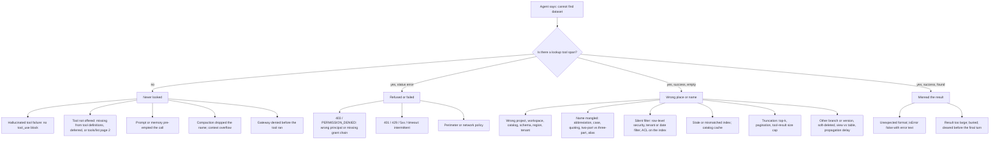

# 64. Observability: the agent says it cannot find a dataset that exists. How do you troubleshoot it?

> **What you need to be able to say:** that "cannot find" is four different failures (the agent never looked, it looked and was refused, it looked in the wrong place or by the wrong name, it found it and misread the result), and that the trace tells you which one in minutes; what the trace has to contain for that to be true (the executing principal, the tool's exact arguments, its status and raw error, the client span underneath it, the tool list the model was offered); the root-cause tree for this symptom with the "tell" for each branch; how to reproduce deterministically, fix the layer rather than the symptom, and make the failure permanent in a test and an alert; which vendor error messages deliberately merge "does not exist" with "not authorised"; and where the 2025–2026 failure taxonomies and attribution benchmarks say human trace-reading still beats automated blame. Chapter 29 has the seven-step method, chapter 39 the two-minute answer and chapter 39b a worked case; this chapter is the long form. Dated October 2026.

## 64.1 Why this question is asked

It is the observability question that sounds like a data question. The interviewer already knows the dataset exists. What they want to see is whether you treat the agent's sentence as evidence ("it cannot find it") or as a symptom ("it *says* it cannot find it"), whether you reach for the trace before the prompt, and whether you know the handful of root causes that account for nearly all such tickets in production: identity, scope, naming, the tool layer, and the model's own reading of what came back.

The strong answer is a method with a branching point, not a list. It starts with one question that the trace answers: *is there a tool call for the lookup at all?*

## 64.2 Four failures that share one sentence

| The agent said "I cannot find the dataset" because… | Layer | What the trace shows |
|---|---|---|
| it never looked | model, context, memory, gateway | no `execute_tool` or `retrieval` span for a lookup; the `chat` span's output has no `tool_use` block |
| it looked and was refused | identity, infrastructure | a lookup span with `error.type` set, or a client span under it carrying a 403, 401, 429 or timeout |
| it looked in the wrong place or by the wrong name | scope, naming, filters, index, data | a lookup span that returned success with an empty result; arguments that differ from the user's words or from the canonical name |
| it found it and misread the answer | model | a lookup span whose result contains the dataset; the next `chat` span ignores it |

Two taxonomies from the research literature map onto these rows and are worth naming. MAST ("Why Do Multi-Agent LLM Systems Fail?", NeurIPS 2025, 1,600+ annotated traces) has *reasoning-action mismatch* (the agent reports an action it did not take), *loss of conversation history* (a name mentioned earlier is gone by the time it is needed), *premature termination* and *fail to ask for clarification*. TRAIL (Patronus AI, 2025; 148 traces, 1,987 OpenTelemetry spans, 841 errors) separates *tool-related hallucinations* (inventing tool outputs or claiming capabilities) and *tool output misinterpretation* on the reasoning side from *401/403 authentication*, *404 resource not found*, *incorrect tool definition* and *environment setup errors including missing permissions* on the execution side. A survey of agent hallucinations (September 2025) calls the first row an *execution hallucination*: the agent claims a sub-step was performed when it was not. Practitioners call the same thing a "phantom tool call" or "tool bypass".

## 64.3 What the trace must contain before you can answer

You cannot troubleshoot what you did not record. The chapter 29 conventions, restated as the minimum for this symptom (the OpenTelemetry GenAI semantic conventions are still at Development stability in October 2026, with no tagged release, so pin the version you emit):

- **Root `invoke_agent` span** with `gen_ai.conversation.id`, the agent version, the prompt version, the hashed user and tenant, and, as a custom attribute, the **executing principal**: the identity the tool layer actually used (the user via on-behalf-of, or a service principal). Most "cannot find" tickets are solved by this attribute alone.
- **`chat` spans** with token counts, finish reason and, for sampled traffic, the opt-in `gen_ai.tool.definitions` and `gen_ai.input.messages`: which tools the model was *offered* and what memory or instruction sat in its context.
- **`execute_tool` spans** with `gen_ai.tool.name`, `gen_ai.tool.call.id`, redacted `gen_ai.tool.call.arguments`, the result status and size, and `error.type` on failure. The convention defines `gen_ai.tool.call.result` as the result "if execution was successful", so a failed call has no result attribute, only an error type and a span status.
- **The client span underneath the tool**: the HTTP, SQL or SDK call the tool made (`CLIENT` kind), with its status code. This is where a 403 lives when the tool wrapper swallowed it and returned an empty list.
- **`retrieval` spans** with `gen_ai.data_source.id`, top-k and scores, when the lookup is a search rather than a catalog call.
- **Trace propagation to remote tools**: the MCP revision of July 2026 carries `traceparent` in `_meta`, so a remote server's spans join the same trace.
- **Tail sampling that keeps every error and every empty-result trace**, so the one you need is there.

Platform names for the same thing: Datadog LLM Observability records `tool` spans with `input`, `output` and `error {message, stack, type}`; MLflow 3 tracing has `TOOL` and `RETRIEVER` span types with inputs, outputs, status and exception events; Langfuse added `tool`, `retriever`, `agent` and `guardrail` observation types in August 2025; Arize Phoenix uses OpenInference `TOOL` spans with `tool.name`, `input.value` and `output.value`; the OpenAI Agents SDK emits `function_span` and `handoff_span`; Google ADK emits `invoke_agent`, `execute_tool` and model spans to Cloud Trace; AWS AgentCore Observability writes GenAI-convention spans to CloudWatch, unified with prompts and logs in one log group for agents created after July 2026; Microsoft Foundry's tracer writes `tool.call.arguments` and `tool.call.results` into Application Insights. Chapter 28b's Rosetta table maps the vocabularies.

## 64.4 The root-cause tree



**Branch C: the agent never looked.**

- *C1, hallucinated tool failure.* The `chat` span output has no `tool_use` block and a finish reason of `end_turn`, yet the text claims a search happened. Common after long sessions and with weak models. Fix in the harness: a registry check before dispatch and a rule in the prompt that catalog questions always go to the tool; re-send tool definitions in long conversations; an eval case that asserts a tool call for any "find X" request.
- *C2, tool not offered.* Check `gen_ai.tool.definitions` on the `chat` span. The dataset tool may be absent because of an allow-list, because tool definitions are deferred and the search tool did not surface it, or because the MCP client ignored pagination: in 2026 Claude Code, Claude Desktop and Cursor each had reports of registering only the first page of `tools/list` (a fourteen-tool server showing eight). The tell: the server has the tool, the model's tool list does not.
- *C3, prompt or memory pre-empted it.* A retrieved memory ("the sales dataset was decommissioned") or an instruction ("if unsure, say you cannot find it") in the input messages. Chapter 39b's Memory Bank case has the tell: no `execute_tool` span, and the memory text visible in the `chat` input.
- *C4, compaction.* A compaction event or a drop in input tokens between turns, and the dataset name absent from the current window (MAST's loss of conversation history).
- *C5, gateway denial.* A policy-decision log entry at the agent gateway and no span on the tool server (chapter 39b's Agent Gateway case).

**Branch D: refused or failed.**

- *D1, the wrong principal or a missing grant.* The single most common path. An agent deployed on a serving endpoint runs as that endpoint's service principal, not as the user who can see the dataset in the UI. A Databricks community thread from March 2026 is the canonical example: a Genie space called over MCP from a Model Serving endpoint returned `PERMISSION_DENIED: Unable to retrieve tables for the space … No access to the table` although the user owned the catalog, schema and space; the fix was CAN RUN on the space plus USE CATALOG, USE SCHEMA and SELECT for the endpoint's principal. The three-level grant chain (catalog → schema → table; or `bigquery.jobUser` plus `dataViewer`; or `bedrock:Retrieve` on the knowledge base) has to be complete for *the identity that ran the tool*. The tell: the failure starts at a deploy timestamp or affects one tenant, and the audit log (CloudTrail `AccessDenied`, the BigQuery or Unity Catalog audit log, Snowflake's `AI_OBSERVABILITY_EVENTS`) names the principal and the action.
- *The swallowed exception.* The wrapper caught the 403 and returned `[]`. The tool span's status is Unset and its result is empty; the client span under it has the 403. If you only look at the tool span you will file this under branch E and waste a day.
- *D2, intermittent.* 401 on an expired token, 429 on quota, 5xx, timeouts; correlated with time of day or with traffic. Chapter 39's note that a 429 can present as an intermittent "cannot find".
- *D3, perimeter.* A VPC Service Controls or private-endpoint denial, with the policy's identifier in the 403 body.

**Branch E: looked in the wrong place or by the wrong name.**

- *E1, wrong environment.* The tool filled in a default project, workspace, catalog, schema, region or tenant. BigQuery's "Dataset was not found in location US" when the job runs in `us-central1`, which is not the `US` multi-region; a Snowflake session whose search path differs from the notebook the user tested in; `gen_ai.data_source.id` pointing at production while the dataset is in development.
- *E2, name resolution.* Diff `gen_ai.tool.call.arguments` against the user's words and the canonical name. Models abbreviate, drop suffixes, change case, add quotes, pass a two-part name where three parts are required, or use an alias from an earlier turn.
- *E3, silent filtering.* Row-level security returns an empty set, never an error, by design; a tenant or date filter excluded the rows; the search index applies an ACL filter the user passes but the agent principal does not. "No rows" and "no access" are indistinguishable unless the tool probes.
- *E4, stale index or cache.* Last import time older than the dataset; the embedding model changed; the catalog listing is cached.
- *E5, truncation.* A search tool returns top-k only and the dataset was eleventh; a catalog listing of thousands of tables exceeded the client's tool-result cap. Claude Code warns above 10,000 tokens and caps MCP output at 25,000 by default, now spilling oversized results to a file and handing the model a path; a listing that never reached the model cannot be found.
- *E6, data layer.* The object exists on another branch or version (lakeFS, Delta time travel), is soft-deleted, is a view whose owner lacks grants on the upstream table, or the permission grant has not propagated yet.

**Branch F: found and misread.** The tool returned the dataset, and the next `chat` span ignored it: the result was prose when the model expected structure, the result had `isError: false` but error text in the body, `structuredContent` did not match the declared output schema, the answer was buried in a huge payload, or tool-result clearing removed it before the final turn. The tell is the name present in the tool span and absent from the model's reasoning.

## 64.5 Vendor messages that merge "does not exist" with "not authorised"

A detail that separates people who have run these systems from people who have read about them: several platforms deliberately do not tell you which it is.

| Platform | Message | What it hides |
|---|---|---|
| Snowflake SQL | error 002003 (42S02) "does not exist or not authorized" | absence vs privilege, by design |
| Snowflake Cortex Agents | `TOOL_NOT_ACCESSIBLE: <name> … does not exist or access is not authorized for the current role`; the documentation states the text does not distinguish the two; default handling continues with a warning event, `reject` fails the run | only some tool types are pre-checked; custom and SQL tools fail at runtime |
| Databricks Unity Catalog | without USE CATALOG or USE SCHEMA the object resolves as `TABLE_OR_VIEW_NOT_FOUND`; with them but without SELECT you get an insufficient-privileges error | a missing *parent* grant looks like a missing table |
| BigQuery | `404 notFound` vs `403 accessDenied` are distinct, but a location mismatch returns "not found in location" | region, not existence |
| Row-level security (Postgres, Fabric, Kusto) | an empty result set | no error at all |
| AWS Bedrock | "Access denied when calling Bedrock"; the first step in AWS's own guidance is to find the `AccessDenied` event in CloudTrail | which principal and which action |

Consequence for tool design: a lookup tool must probe to disambiguate (`SHOW GRANTS`, `INFORMATION_SCHEMA`, a listing of the parent) and return a status the model can act on. The repo's vocabulary from chapter 40: `found | not_found | forbidden | error`, with the nearest matches on `not_found` and the principal and missing grant on `forbidden`. The MCP specification separates protocol errors (unknown tool, a JSON-RPC error) from tool execution errors (`isError: true` in the result "so the LLM can see and self-correct"); Anthropic's guidance on writing tools asks you to "prompt-engineer your error responses" with what went wrong and what to try next, and Google ADK's guidance is to return a dict with a `status` and never raise from a tool. An empty list is the worst possible error message.

## 64.6 The runbook

1. **Locate and freeze.** Find the trace by conversation id. Record agent version, model, prompt version, executing principal, exact user input, timestamp. Check the dashboard: is the empty-result rate up for one user, one tenant, or everyone since a deploy?
2. **Branch on the tool span** (section 64.4). None → C. Error → D. Success and empty → E. Success and found → F.
3. **Read the arguments literally.** Compare the tool's arguments with the user's words and with the canonical name from the catalog. Note every default the tool filled in.
4. **Look under the tool span.** The client span's status code. A 403 under an empty tool result is the swallowed-exception case.
5. **Reproduce deterministically.** Call the tool directly with the captured arguments as the same principal; then as the user via on-behalf-of; then as an administrator. If the administrator finds it and the agent's principal does not, it is permissions. If nobody finds it with those arguments but the user finds it in the UI, it is scope or naming. Then replay the whole turn with recorded tool fixtures (LangSmith and Langfuse build datasets from traces; MLflow and Phoenix run experiments over them) at the lowest sampling setting the model supports.
6. **Check the identity chain** in the audit logs: which principal, which action, which object; compare with the grant chain and with the deploy history.
7. **Check listing, pagination and size.** Does `tools/list` have a second page? Is the catalog listing above the result cap? Is top-k too small?
8. **Fix the layer, not the symptom.** Grant, or switch the endpoint to on-behalf-of identity (chapter 67). Canonicalise names in the tool with fuzzy matching and "did you mean". Return `forbidden` with the principal and the missing grant rather than `[]`. Paginate. Refresh the index. Tighten the prompt only when the cause was in the prompt. Re-send tool definitions in long sessions.
9. **Make it permanent.** A replay test built from the trace; a post-deploy smoke test that calls the lookup tool on a known dataset *as the deployed principal*; alerts on empty-result rate (more than twice the seven-day baseline for ten minutes) and on any tool's 403 rate (above 1% over five minutes; chapter 43); an LLM judge on sampled traffic for "failure to answer", "tool selection" and "tool argument correctness" (Datadog ships these as managed agent evaluations); the case added to the eval suite's recovery row (chapter 53); a blameless postmortem whose five whys end at the systemic gap, usually "no identity smoke test after deploy".

**Methods to name.** RED (rate, errors, duration) per tool; USE for the tool's backend; bisecting the pipeline (administrator vs agent principal; tool direct vs via agent; today's version vs yesterday's); failure attribution to the *earliest* wrong step rather than the last.

## 64.7 A worked trace

A finance analyst asks an internal data agent for "the Q3 revenue by region from the gold sales table". The agent answers that it cannot find a sales dataset. The trace:

```
invoke_agent data-agent v41  conversation=c-7f3  principal=sp-serving-endpoint-prod  user=h(a.kahn)
├── chat claude-sonnet-5.5     input=14,212  output=312   finish=tool_use
│     tool_use: find_table {"name": "gold.sales", "catalog": "main"}
├── execute_tool find_table    status=UNSET   result="[]"   duration=412ms
│   └── CLIENT POST /api/2.1/unity-catalog/tables   http.status=403
│         body: PERMISSION_DENIED  USE SCHEMA on main.gold not granted to sp-serving-endpoint-prod
└── chat claude-sonnet-5.5     input=14,690  output=96    finish=end_turn
      text: "I could not find a sales dataset in the catalog."
```

Reading it: a lookup span exists (not branch C). Its status is Unset with an empty result, which looks like branch E, but the client span underneath carries a 403 naming the principal and the missing grant: branch D1, the swallowed exception. The arguments show a second problem: the model passed a two-part name, `gold.sales`, with the catalog as a separate field, while the canonical name is `main.gold.sales_daily`; even with the grant fixed this would have returned `not_found`. The principal is the serving endpoint's service principal, and the user has SELECT themselves, so the identity model is wrong for a user-facing data agent.

Fix, in layers: switch the endpoint to on-behalf-of user authorisation so Unity Catalog's row filters and grants apply to the asking user (chapter 21); make `find_table` return `forbidden` with the principal and grant on a 403 and `not_found` with three nearest matches on a miss; canonicalise names with a fuzzy match over the catalog listing; add the trace as a replay test and a post-deploy smoke test that looks up `main.gold.sales_daily` as the deployed identity; alert on the tool's 403 rate. The customer-facing note is five sentences and names no one.

What the agent should have said, had the tool been honest: "I found `main.gold.sales_daily` but my current identity is not allowed to read schema `main.gold`; ask the owner to grant the data agent's principal USE SCHEMA, or run this as yourself." That sentence is the product of the tool contract, not of a better model.

## 64.8 How far automation goes, and how far it does not

Interviewers at observability-minded companies will ask whether an LLM can do this triage. The honest 2026 answer: partly, and not yet for the hard step.

- **Classification works.** Online judges that label traces as "failure to answer", "wrong tool", "wrong arguments" run at scale in Datadog, Langfuse, LangSmith, Braintrust and MLflow, and are good enough to drive alerts and sampling.
- **Localisation does not, yet.** On TRAIL, the best model (Gemini 2.5 Pro) reached about 11% joint accuracy at locating and categorising errors in traces, and human annotation took 30–40 minutes per trace. On Who&When (184 failure logs from 127 multi-agent systems), the best method named the responsible agent 53.5% of the time and the decisive step 14.2%. AgenTracer (ICLR 2026) and AgentDebug (ICML 2026) improve on both with counterfactual replay and earliest-critical-error search (AgentDebug reports 24.3% all-correct detection against a 0.3% baseline and up to 26% relative task-success gain from replaying with corrective feedback), which is real progress and still far from a tool you hand a ticket to.
- **So the runbook is a human discipline with machine help.** Use judges to find the traces; read them yourself; use replay to prove the cause; and remember that latent and hidden reasoning (chapters 22c and 65) remove the readable chain, which makes the tool spans carry more of the diagnostic weight, not less.

## 64.9 Follow-ups and pitfalls

**Follow-ups.** *"It works for me but not for users."* You run as yourself; the agent runs as a service principal; check the executing principal and the grant chain. *"It worked yesterday."* Diff the deploy: principal, tool list, prompt, index refresh, model version. *"It works for most datasets."* Naming (one has a suffix), region (one is in another location), or RLS (one is filtered). *"The tool returns the dataset in the trace and the agent still says no."* Branch F: result format or size, or clearing. *"How would you prevent it at scale?"* Tool contract with four statuses, identity smoke test on deploy, empty-result and 403 alerts per tool, judges on sampled traffic, tail sampling that keeps every error, and tenant slicing on the dashboard.

**Pitfalls.** Starting with the prompt ("tell it to search harder"). Treating "not found" as one failure. Assuming the agent runs as the user. Not knowing that RLS returns empty rather than 403, or that Snowflake and Unity Catalog merge absence and authorisation. Forgetting the tool-listing side (pagination, deferred tools, output caps). Claiming the GenAI conventions are stable or quoting attribute names that were renamed (`gen_ai.system` is now `gen_ai.provider.name`). Over-trusting automated attribution. Fixing without a replay test, an alert and a "what the agent should have said".

**Interview line:** *"The agent's sentence is a symptom. I open the trace and ask one question: is there a lookup tool call? None means the model, its context, or the gateway stopped it. An error means identity, and I check which principal ran the tool and whether the grant chain is complete, including the client span under the tool, because wrappers swallow 403s into empty lists. Success with nothing means scope, name, a silent filter, a stale index or truncation. Success with the dataset means the model misread it. I reproduce by calling the tool directly as the agent's identity, then as the user, then as an admin; fix the layer, usually by moving to on-behalf-of identity and a tool that returns found, not found, forbidden or error with the reason; and leave behind a replay test, a post-deploy identity smoke test and alerts on empty-result and 403 rates per tool."*

## Sources

Links checked in October 2026.

**Conventions and tool contracts**
- OpenTelemetry, [*Semantic conventions for generative AI*](https://github.com/open-telemetry/semantic-conventions-genai) (Development stability; execute-tool and agent spans), 2026.
- Model Context Protocol, [*Tools: error handling and pagination*](https://modelcontextprotocol.io/specification/2025-06-18/server/tools), 2025.
- Anthropic, [*Handle tool calls*](https://platform.claude.com/docs/en/agents-and-tools/tool-use/handle-tool-calls); [*Writing tools for agents*](https://www.anthropic.com/engineering/writing-tools-for-agents), 11 September 2025; [*Claude Code MCP: output limits*](https://code.claude.com/docs/en/mcp), 2026.
- Google, [*ADK traces*](https://adk.dev/observability/traces/) and [*Reflect-and-retry plugin*](https://adk.dev/integrations/reflect-and-retry/), 2026.

**Platforms**
- Datadog, [*LLM Observability API*](https://docs.datadoghq.com/llm_observability/instrumentation/api/) and [*Agent evaluations*](https://docs.datadoghq.com/llm_observability/evaluations/managed_evaluations/agent_evaluations), 2026.
- MLflow, [*Spans*](https://mlflow.org/docs/latest/genai/concepts/span/); Databricks, [*MLflow 3 tracing*](https://docs.databricks.com/aws/mlflow3/genai/tracing/), 2026.
- Langfuse, [*Enhanced observation types*](https://langfuse.com/changelog/2025-08-27-enhanced-observation-types), 27 August 2025; [*Online evaluation*](https://langfuse.com/docs/evaluation/get-started/online).
- Arize, [*OpenInference span kinds*](https://arize.com/docs/phoenix/tracing/concepts-tracing/otel-openinference/span-kinds); OpenAI, [*Agents SDK tracing*](https://openai.github.io/openai-agents-python/tracing/); LangChain, [*Annotation queues*](https://docs.langchain.com/langsmith/annotation-queues).
- AWS, [*Monitor on-premises and multi-cloud AI agents with AgentCore Observability*](https://aws.amazon.com/blogs/), August 2026; [*Resolve access denied errors in Bedrock*](https://repost.aws/knowledge-center/bedrock-resolve-access-denied).
- Microsoft, [*Trace LangChain agents in Foundry*](https://learn.microsoft.com/azure/foundry/how-to/develop/langchain-traces), 2026.
- Honeycomb, [*Honeycomb launches Agent Observability*](https://www.honeycomb.io/blog/honeycomb-launches-agent-observability-full-visibility-agentic-workflows), May 2026.
- Snowflake, [*Cortex Agents: inaccessible tool handling*](https://docs.snowflake.com/en/user-guide/snowflake-cortex/cortex-agents-inaccessible-tool-handling), 2026.
- Databricks Community, [*Failed to fetch tables for the space when using Genie MCP via Model Serving*](https://community.databricks.com/t5/generative-ai/failed-to-fetch-tables-for-the-space-when-using-genie-mcp-via/td-p/149904), March 2026.

**Failure taxonomies and attribution**
- Cemri et al., [*Why Do Multi-Agent LLM Systems Fail?*](https://arxiv.org/abs/2503.13657), NeurIPS 2025.
- Deshpande et al. (Patronus AI), [*TRAIL: Trace Reasoning and Agentic Issue Localization*](https://arxiv.org/abs/2505.08638), 2025.
- Zhu et al., [*Where LLM Agents Fail and How They Can Learn From Failures*](https://arxiv.org/abs/2509.25370), ICML 2026.
- Zhang et al., [*Which Agent Causes Task Failures and When? (Who&When)*](https://arxiv.org/abs/2505.00212), ICML 2025; [*AgenTracer*](https://arxiv.org/abs/2509.03312), ICLR 2026.
- [*LLM-based Agents Suffer from Hallucinations: A Survey*](https://arxiv.org/abs/2509.18970), September 2025.
