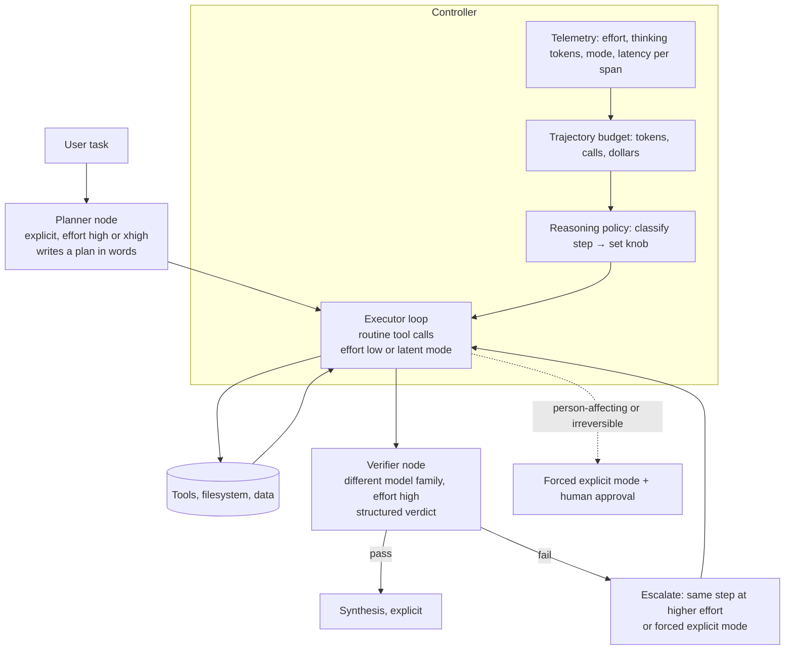

# 65. Agentic design: latent reasoning for specific agentic workflows, how to build it in Deep Agents and the agent SDKs, and what "adaptive" adds

> **What you need to be able to say:** which of the two readings of "latent reasoning" the interviewer means (architectural: continuous hidden-state steps; operational: hidden, budgeted thinking per step) and that most production value today comes from the second; a one-sentence definition of *adaptive* latent reasoning (hidden compute allocated per step by a policy conditioned on the step's difficulty and stakes, instead of a fixed chain every turn) with its three instantiations: learned mode switching in the model (ALAR, SwiReasoning, Huginn's per-token exit), provider knobs (adaptive thinking and effort on Claude, `reasoning.effort` on OpenAI, `thinking_level` on Gemini) and a harness controller that sets the knob per node and escalates on verifier failure; where that controller lives in LangChain Deep Agents (a middleware's `wrap_model_call`) and in the Claude Agent SDK (per-subagent `effort`, `task_budget`, hooks); how to swap in a true latent backend on open weights; the numbers that bound the gains and the monitorability cost, including what the GPT-6 Astra system card does and does not say. Chapter 22c is the sixteen-thousand-word reference; this chapter is the build. Dated October 2026.

## 65.1 Pin the question before answering it

"Latent reasoning for agentic workflows" is asked by two kinds of interviewer. One has read Coconut and ALAR and wants to know whether you understand continuous thoughts, recurrent depth and what they cost in monitorability. The other runs an agent platform and uses "latent" to mean the reasoning the model does out of sight, and wants to know how you budget it per step. Ask which, then answer in a way that covers both; chapter 22c.1 has the taxonomy, and the short version is:

- **Token chain of thought:** the model writes its steps; you can read them and you pay output price for every one.
- **Hidden or summarised thinking (the production APIs):** still tokens, kept by the provider, billed as output, returned encrypted or summarised. Latent only to you.
- **Latent reasoning proper:** continuous vectors carried between forward passes: Coconut's continuous thoughts, ALAR's projector outputs, recurrent-depth iterations in Huginn and Ouro, KV caches handed between agents. Needs open weights and a serving plugin.

In every latent system chapter 22c dissects, the tool calls, the actions and the final answer are still tokens. The design rule is the same in all three regimes: *latent where tokens are waste, tokens where the world or a human needs them.*

## 65.2 What "adaptive" means, in three places

Fixed reasoning spends the same hidden compute on "list the files" as on "decide whether to refund". Adaptive reasoning makes that a decision. The decision can be taken in three places, and a good design uses at least two.

| Where the policy lives | Mechanism | Examples and numbers |
|---|---|---|
| Inside the model (architectural) | a sampled mode token, a learned exit gate, an entropy switch | ALAR samples `<LAT>` (four latent thoughts via a two-layer projector) or `<THINK>` per turn, trained with a reward that pays for tokens saved and penalises lost accuracy: −84.6% generated tokens on BFCL tool use at 89.2% accuracy, −43.6% on multi-turn search at comparable EM; per-turn latent fraction 89–91% on single-hop questions, 59% on Bamboogle, with turn one most often explicit. Huginn exits a token's recurrence when the KL between successive iterations drops below about 5e-4; Ouro's looped models learn an entropy-regularised exit; SwiReasoning switches modes on an entropy trend with no training (57–79% token efficiency); AdaptThink and Thinkless learn think-or-not with RL (−53% length with +2.4% accuracy on a 1.5B model; 50–90% less long-chain use) |
| In the provider's API (operational) | per-request effort or thinking level; the model decides per request whether to think | Claude's adaptive thinking is the only mode on Opus 4.7 and the 5-series; `output_config.effort` from `low` to `max`, default `high` except `medium` on Opus 5.5; Anthropic's documentation states that in a tool-use loop "the first request after new user input typically carries most of the reasoning, and follow-up requests that only process tool results can skip thinking, including at xhigh and max". OpenAI `reasoning.effort` from `none` to `max` (GPT-6 Astra does not offer `none`). Gemini `thinking_level` from `minimal` to `high` |
| In the harness (controller) | a middleware or hook classifies the step and sets the knob, escalates on verifier failure, forces explicit mode for stakes | the design in sections 65.3–65.5; chapter 22c.10's service-desk policy cut thinking tokens per task from 4,800 to 2,110 (−56%) by running the plan step high and routine steps low |

The research evidence that a policy beats a constant is now broad enough to cite without hedging: the Holistic Agent Leaderboard (ICLR 2026; 21,730 rollouts) found higher reasoning effort gave equal or lower accuracy in 21 of 36 comparisons; *The Danger of Overthinking* (chapter 63) found −43% compute and +~30% success from curbing it; CATTS (February 2026) found uniform test-time sampling saturates on long web tasks while confidence-aware allocation gains up to +11.8% with fewer tokens; FineVerify (May 2026) found compute spent on decomposed verification beats compute spent on more exploration (+8.2% for GPT-5-mini with four trajectories). The shape they share: spend where the step is hard or the verifier says you were wrong, not everywhere.

## 65.3 The architecture: one workflow, two reasoning backends

Build the workflow once, with the reasoning policy as a pluggable layer, so the same graph runs on a closed API today and on an open-weight latent backend if you ever self-host.



**The step classifier.** Five classes are enough for most workflows, and they match where ALAR's learned policy ends up spending explicit reasoning:

| Step class | Signal in state | Knob |
|---|---|---|
| plan (first turn after user input, or after a replan) | last message is from the user; todo list empty or invalidated | high or xhigh; explicit |
| routine act (retrieve, list, read, call a well-specified tool) | tool schema fully determined by the plan; no error flag | low; latent mode on an open backend |
| recover (the previous tool call failed or returned empty) | `PostToolUseFailure` or an `is_error` result | medium, escalating to high on the second failure |
| verify and synthesise | all plan items done; final answer pending | high, on a different model family where possible |
| person-affecting or irreversible | tool is in the deny-without-approval set | forced explicit mode plus an interrupt for a human |

**The budget.** Effort tunes depth; a trajectory budget tunes breadth. On Claude, `output_config.task_budget` (beta, minimum 20,000 tokens) is a server-side countdown visible only to the model, advisory rather than hard, which adaptive thinking scales down against as it depletes; `max_tokens` is the only hard cap. On other providers the harness keeps the ledger: model calls, tool results, thinking tokens from `usage.output_tokens_details`, and dollars.

**The cache.** Changing top-level effort between requests invalidates the Claude prompt cache (chapter 63). The per-message effort beta (`mid-conversation-output-config-2026-07-01`) changes effort from the next turn while preserving the cache on Fable 5.1, Opus 5.5, Opus 5 and Sonnet 5.5; where it is unavailable, steer with a sentence in the message ("Answer directly without deliberating" or "Please think hard before responding"), which Anthropic's documentation suggests for exactly this harness pattern.

## 65.4 Building it in LangChain Deep Agents

Deep Agents (chapter 22b) is a middleware stack around a LangGraph loop: skills, filesystem, sub-agents, summarisation, tool-call patching, then your middleware, then prompt caching, memory and human-in-the-loop. Sub-agents are specified with a name, a description, a system prompt, tools, an optional model object of their own, and a mode (`isolated` or `fork`), and are invoked through the `task` tool. The reasoning policy is three middlewares.

```python
from deepagents import create_deep_agent
from langchain.agents.middleware import AgentMiddleware, ModelCallLimitMiddleware
from langchain_anthropic import ChatAnthropic

PLANNER = ChatAnthropic(model="claude-opus-5-5", thinking={"type": "adaptive"},
                        output_config={"effort": "xhigh"})
EXECUTOR = ChatAnthropic(model="claude-sonnet-5-5", thinking={"type": "adaptive"},
                         output_config={"effort": "medium"})          # top-level stays constant
VERIFIER = ChatOpenAI(model="gpt-5.6-terra", reasoning={"effort": "high"})  # other family

class ReasoningBudgetMiddleware(AgentMiddleware):
    """Set hidden-reasoning effort per step without touching the cached prefix."""
    def __init__(self, policy): self.policy = policy
    def wrap_model_call(self, request, handler):
        step = self.policy.classify(request.state)          # plan | act | recover | verify | act_irreversible
        effort = self.policy.effort_for(step, request.state["budget"])
        steer = {"act": "Answer directly without deliberating.",
                 "plan": "Please think hard before responding."}.get(step)
        req = request.override(
            model_settings={"output_config": {"effort": effort}},   # per-message effort beta
            system_message=request.system_message + (f"\n{steer}" if steer else ""))
        resp = handler(req)
        request.state["budget"].charge(resp.usage)               # thinking tokens, calls, dollars
        return resp

class VerifierGateMiddleware(AgentMiddleware):
    """Cheap deterministic checks after each model call; escalate effort on failure."""
    def after_model(self, state, runtime):
        failed = schema_or_citation_check(state["messages"][-1])
        if failed:
            state["escalate_next"] = True            # policy reads this → 'recover' class
        return state

class ReasoningTelemetryMiddleware(AgentMiddleware):
    def after_model(self, state, runtime):
        span = current_span()                        # OpenTelemetry, chapter 29
        span.set_attribute("agent.step_class", state.get("step_class"))
        span.set_attribute("agent.effort", state.get("effort"))
        span.set_attribute("gen_ai.usage.thinking_tokens", state["last_usage"].thinking_tokens)
        return state

agent = create_deep_agent(
    model=EXECUTOR,
    tools=[search_catalog, read_table, run_sql],
    middleware=[ReasoningBudgetMiddleware(policy), VerifierGateMiddleware(),
                ReasoningTelemetryMiddleware(), ModelCallLimitMiddleware(run_limit=40)],
    subagents=[
        {"name": "planner",  "description": "writes the plan in words", "model": PLANNER,  "tools": []},
        {"name": "verifier", "description": "checks the answer against the data", "model": VERIFIER,
         "response_format": Verdict},
    ],
    interrupt_on={"run_sql": {"allowed_decisions": ["approve", "reject"]}},   # irreversible → human
)
```

Notes that matter in a review:

- `wrap_model_call` is the hook; `request.override(...)` is how you change model settings, tools or the system message for one call. The Python keyword names for thinking and effort on `langchain-anthropic` follow the provider parameters; check the installed version's signature before you quote them.
- The planner and verifier are sub-agents with their own model objects, so the executor's prompt cache is never disturbed by their effort levels. Keep the planner and verifier in text: the plan is what a human reads when something goes wrong, and the verifier is the control that makes low effort on routine steps safe.
- Deep Agents' own summarisation triggers at 85% of the model's input window and offloads tool results above 20k tokens to the filesystem with a ten-line preview; that is chapter 63's context engineering, already in the stack.
- The reference middleware already includes budget-shaped pieces (a progress-budget middleware that caps model calls and tool results, a rubric middleware that caps iterations); build on them rather than beside them. LangChain's April 2026 harness-profile work, where per-model prompt and tool overrides lifted a τ²-bench subset from 33% to 53% on one model and 43% to 53% on another, is the same lesson: the knob settings are per model and have to be tuned on your evals.

## 65.5 Building it in the Claude Agent SDK

The same design in Anthropic's SDK uses fields instead of middleware. `ClaudeAgentOptions` takes `thinking` (adaptive, or a fixed `budget_tokens`), `effort`, `task_budget`, `max_turns`, `max_budget_usd` and `hooks`; sub-agents are declared in `agents={name: AgentDefinition(...)}` with their own `effort`, `model`, `tools`, `maxTurns`, `skills` and `memory`, inherit the session's thinking configuration, and share nothing but the prompt that spawns them. Spawn depth defaults to three and concurrency to twenty.

```python
options = ClaudeAgentOptions(
    model="claude-sonnet-5-5", thinking={"type": "adaptive"}, effort="medium",
    task_budget={"total": 400_000}, max_budget_usd=6.0, max_turns=60,
    agents={
        "planner":  AgentDefinition(effort="xhigh", model="opus", tools=[]),
        "executor": AgentDefinition(effort="low", model="sonnet", tools=["Read", "Grep", "mcp__catalog__*"]),
        "verifier": AgentDefinition(effort="high", model="opus", tools=["Read"]),
    },
    hooks={
        "PreToolUse":        [gate_irreversible_tools],   # force explicit mode + approval
        "PostToolUseFailure":[flag_escalate_next_turn],   # the 'recover' class
        "PreCompact":        [pin_plan_and_open_items],   # the plan survives compaction
        "SubagentStop":      [record_effort_and_usage],   # telemetry
    })
```

In Claude Code itself the same levers are `/effort` and `--effort`, `effort:` in a sub-agent's or skill's front matter, and the `ultrathink` keyword for a single deep turn; task budgets are not supported there. Chapter 52a covers the harness; chapter 22b compares the SDKs.

For OpenAI's Agents SDK the per-agent knob is `ModelSettings(reasoning=Reasoning(effort=...))`, with different models across handoffs; for Google ADK it is a planner with a `ThinkingConfig` and a thinking budget on the agent. The controller pattern is identical.

## 65.6 Swapping in a true latent backend

Nothing above is architecturally latent. If you host open weights and the executor's p95 latency or token bill still misses after per-step effort, text pruning and distillation, the executor node is where a latent model goes, and only there.

- **Model.** An ALAR-style fine-tune of a 4B–8B instruction model: a two-layer projector feeds the last hidden state back as the next input embedding for K latent steps; a mode token sampled by the policy chooses latent or explicit per turn; training is supervised warm-up on teacher trajectories then an RL stage whose reward pays for tokens saved and charges for lost accuracy. The public code targets vLLM 0.19 with a plugin that detects the mode token, splices the projector outputs in, and keeps latent KV across turns through prefix caching. No checkpoints are hosted; you train your own, and the paper reports no wall-clock numbers, only tokens.
- **Serving.** vLLM's `--enable-prompt-embeds` accepts embedding tensors in place of tokens and its documentation warns to enable it only for trusted callers. Put the projector version in the cache salt so a projector update cannot hit a stale prefix. Count forward passes and wall-clock, not tokens: a latent step is one forward pass, like one decoded token, and LatentMAS's "up to 7× faster" is against a text multi-agent baseline while being 4.4× slower than a single model (chapter 22c.4).
- **What stays in text.** The planner, the verifier, every tool call and argument, every person-affecting action, and the final answer. ALAR's own ethics statement recommends retaining explicit reasoning and logging in high-stakes settings.
- **Monitoring the hidden steps** (chapter 22c.8): log the K latent vectors per turn (about 20 KiB at a hidden size of 2,560) with linear-probe scores for the behaviours you care about; replay 1–5% of latent turns in forced explicit mode and compare; make the kill switch force `<THINK>` for a tenant or a tool. Probes on latent thought are not hypothetical: a 2026 study of misaligned latent reasoning found it sits in geometrically distinct regions, shows up in the early "planning" latent tokens, and transfers across prompts. Never train against the probes.
- **Caveats to quote with the gains.** ALAR's 84.6% is on single-request BFCL where text-pruning baselines already cut 67–79%; its search results are on 3B–7B models with a six-turn cap; its K is fixed and its mode binary; a February 2026 theory paper proves an exploration-execution trade-off for latent chains (why Coconut reaches 97% on a graph task and 34% on GSM8K) and argues that *adaptive* certainty, not a fixed number of latent steps, is what closes it. Relayed KV caches help only when the partner holds private information; otherwise a mismatched cache does about as well (August 2026), so demand that control in any latent-communication claim.

## 65.7 Numbers to carry into the room

| Claim | Number | Condition |
|---|---|---|
| Per-step effort policy in a service-desk agent | thinking tokens per task 4,800 → 2,110 (−56%) | chapter 22c.10 worked design; plan high, routine low |
| ALAR, tool use | −84.6% generated tokens at 89.2% accuracy | BFCL, single request, 7B; pruning baselines −67–79% |
| ALAR, multi-turn search | −43.6% tokens at comparable EM | 3B–7B, six-turn cap |
| More effort is not more accuracy | 21 of 36 comparisons equal or worse | HAL, 9 models × 9 benchmarks |
| Overthinking in SWE agents | −43% compute, +~30% success | Cuadron et al. 2025 |
| Confidence-aware allocation on web agents | up to +11.8% over majority vote, fewer tokens | CATTS, three web benchmarks |
| Verification beats exploration | +8.2% with four trajectories | FineVerify, GPT-5-mini |
| Latent multi-agent speed | up to 7× vs text MAS; 4.4× slower than one model | LatentMAS |

## 65.8 The monitorability bill, and the Astra event

Chapter 22c.7 lists what latent reasoning costs: no readable chain, weaker debugging, compliance exposure, serving complexity, new attack surfaces. Since it was written the question "will a frontier lab ship reduced legibility?" has an answer worth stating precisely.

OpenAI's GPT-6 Astra system card (3 September 2026) says the model's "monitorability has decreased relative to GPT-5.6 Sol", that it is "more capable of controlling its own CoT", "less likely to include incriminating information", able to sandbag undetected, and "can sometimes evade our internal monitors" on certain sabotage tasks, with "no evidence of steganographic CoT"; that telling the model a monitor is present shortens its chain; that no-chain-of-thought capability "greatly expanded", with the UK AI Security Institute suggesting the no-CoT time horizon rose by about an order of magnitude; and that `reasoning=none` will not be offered. It also says, in terms, that the controllability changes are "not differentially due to any architectural changes" and are correlated with the no-CoT capability gain, which OpenAI attributes to training. Press reports that Astra uses recurrent depth or "opaque recurrence" are reports; the card does not use those words. Anthropic's and OpenAI's joint work on chain-of-thought monitorability (2025–2026) found Claude Sonnet 4.5 could control its chain in 2.7% of attempts against 61.9% for outputs, and that more RL and test-time compute erode that margin.

What this means for your design: the operational reading of latent reasoning, hidden thinking at lower effort, already costs monitorability, and the cost is paid where you reduce explicit reasoning most, the routine steps. That is acceptable when the verifier, the tool contract and the action gate are explicit and tested, and unacceptable for person-affecting actions. Say that, and say that chain-of-thought monitoring "has no good substitute now" (Korbak), and you have answered the safety follow-up before it is asked.

## 65.9 Follow-ups and pitfalls

**Follow-ups.** *"Where exactly does the policy run?"* In a middleware's `wrap_model_call` in Deep Agents, or as per-subagent `effort` plus hooks in the Claude Agent SDK; name the hook. *"How do you pick the thresholds?"* An effort sweep per node on the eval set (chapter 39b), reporting accuracy per dollar and p95; expect some nodes to invert. *"How do you keep it cheap without breaking the cache?"* Per-message effort, constant top-level effort, planner and verifier as separate sub-agents. *"Would you train a latent model?"* Only on open weights, only for the executor, only after the three cheaper levers, and only with probes, replay and a kill switch. *"What about multi-agent latent communication?"* Typed envelopes between agents today; KV hand-off only between identical weights, with a mismatched-cache control in the eval.

**Pitfalls.** Conflating hidden API thinking with latent reasoning. Saying Astra "is a Coconut model". Quoting ALAR's 84.6% without the pruning baselines. Comparing latent and text by output tokens rather than forward passes and wall-clock. "More thinking is better". Changing top-level effort every turn. Dropping thinking blocks or thought signatures in a hand-written loop (they must go back unmodified). Assuming KV sharing is lossless across models. No monitoring plan. Not stating that true latent reasoning needs open weights and a serving plugin, and that the closed-API design captures most of the benefit. Forgetting that effort also changes tool-call behaviour ("fewer and terser tool calls" at low).

**Interview line:** *"I separate the two readings. On a closed API, latent reasoning means hidden thinking I budget per step: a planner at high effort that writes its plan in words, an executor at low effort for routine tool calls, a verifier on another model family, a controller in the harness that classifies each step, escalates effort when a check fails, and forces explicit mode plus approval for anything irreversible, with per-message effort so the cache survives. That alone roughly halves thinking tokens on service-desk workloads. On open weights I would put an ALAR-style latent model in the executor only, serve it behind vLLM, log the latent vectors with probes, replay a few percent in explicit mode, and keep a kill switch, because the evidence from 2026 says reduced legibility is the price, and I only pay it where a verifier can cover me."*

## Sources

Links checked in October 2026.

**Core papers**
- Jung, Shi, Zhang, Zhang and Chen, [*Adaptive Latent Agentic Reasoning*](https://arxiv.org/abs/2606.02871), June 2026; code: [luka-group/adaptive-latent-agentic-reasoning](https://github.com/luka-group/adaptive-latent-agentic-reasoning).
- Hao et al., [*Training Large Language Models to Reason in a Continuous Latent Space (Coconut)*](https://arxiv.org/abs/2412.06769), December 2024; [facebookresearch/coconut](https://github.com/facebookresearch/coconut).
- Geiping et al., [*Scaling up Test-Time Compute with Latent Reasoning: A Recurrent Depth Approach (Huginn)*](https://arxiv.org/abs/2502.05171), February 2025; [model card](https://huggingface.co/tomg-group-umd/huginn-0125).
- Zhu et al., [*Ouro: looped language models*](https://arxiv.org/abs/2510.25741), 2025–2026; [*Closing the Loop*](https://arxiv.org/abs/2610.00673), September 2026; [*Depth-adaptive inference of looped LMs via continuous depth batching*](https://arxiv.org/abs/2608.09444), August 2026.
- [*Capabilities and Fundamental Limits of Latent Chain-of-Thought*](https://arxiv.org/abs/2602.01148), February 2026; [*When Does Latent Communication Pay?*](https://arxiv.org/abs/2608.04893), August 2026.
- Zou et al., [*Latent Collaboration in Multi-Agent Systems (LatentMAS)*](https://arxiv.org/abs/2511.20639), ICML 2026.

**Adaptive compute and think-or-not**
- Graves, [*Adaptive Computation Time*](https://arxiv.org/abs/1603.08983), 2016; Raposo et al., [*Mixture-of-Depths*](https://arxiv.org/abs/2404.02258), 2024.
- [*AdaptThink*](https://arxiv.org/abs/2505.13417); [*Thinkless*](https://arxiv.org/abs/2505.13379); [*Dynamic Early Exit in Reasoning Models*](https://arxiv.org/abs/2504.15895); [*L1: Controlling How Long a Reasoning Model Thinks*](https://arxiv.org/abs/2503.04697), COLM 2025; [*SwiReasoning*](https://arxiv.org/abs/2510.05069), 2025.
- Kapoor et al., [*Holistic Agent Leaderboard*](https://arxiv.org/abs/2510.11977), ICLR 2026.
- [*CATTS: Agentic Test-Time Scaling for Web Agents*](https://arxiv.org/abs/2602.12276), February 2026; [*FineVerify*](https://arxiv.org/abs/2606.00660), May 2026; [*Scaling Test-time Compute for LLM Agents*](https://arxiv.org/abs/2506.12928), 2025.

**SDK and API mechanics**
- Anthropic, [*Effort*](https://platform.claude.com/docs/en/build-with-claude/effort), [*Thinking: steering and cost*](https://platform.claude.com/docs/en/build-with-claude/thinking-steering-and-cost), [*Extended thinking*](https://platform.claude.com/docs/en/build-with-claude/thinking), [*Task budgets*](https://platform.claude.com/docs/en/build-with-claude/task-budgets), 2026.
- Anthropic, [*Claude Agent SDK: subagents*](https://code.claude.com/docs/en/agent-sdk/subagents) and [*Python reference*](https://code.claude.com/docs/en/agent-sdk/python); [*Claude Code model configuration*](https://code.claude.com/docs/en/model-config), 2026.
- LangChain, [*Deep Agents: customization*](https://docs.langchain.com/oss/python/deepagents/customization), [*subagents*](https://docs.langchain.com/oss/python/deepagents/subagents), [*context engineering*](https://docs.langchain.com/oss/python/deepagents/context-engineering), [*custom middleware*](https://docs.langchain.com/oss/python/langchain/middleware/custom); [*Tuning Deep Agents for different models*](https://www.langchain.com/blog/tuning-deep-agents-different-models), 29 April 2026.
- OpenAI, [*Reasoning*](https://developers.openai.com/api/docs/guides/reasoning) and [*Agents SDK: models*](https://openai.github.io/openai-agents-python/models/); Google, [*Gemini thinking*](https://ai.google.dev/gemini-api/docs/thinking) and [*ADK LLM agents*](https://adk.dev/agents/llm-agents/); vLLM, [*Prompt embeddings*](https://docs.vllm.ai/en/latest/features/prompt_embeds.html).

**Monitorability**
- OpenAI, [*GPT-6 Astra system card*](https://deploymentsafety.openai.com/gpt-6-astra), 3 September 2026.
- Korbak, Baker et al., [*Reasoning Models Struggle to Control their Chain of Thought*](https://arxiv.org/abs/2603.05706), March 2026; Korbak et al., [*Chain of Thought Monitorability*](https://arxiv.org/abs/2507.11473), July 2025; Emmons et al., [*A Pragmatic Way to Measure CoT Monitorability*](https://arxiv.org/abs/2510.23966), 2025.
- [*Ulterior Motives: probing misaligned latent reasoning*](https://arxiv.org/abs/2604.23460), ICLR 2026 workshop; Brown-Cohen, Lindner and Shah, [*Quantifying the Necessity of CoT through Opaque Serial Depth*](https://arxiv.org/abs/2603.09786), March 2026.
