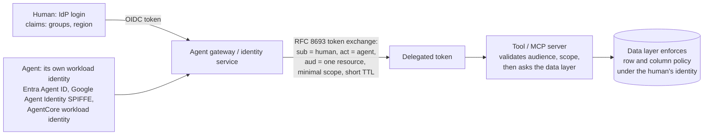

# 67. Security and IAM: authorisation, or how you limit an agent to only certain data

> **What you need to be able to say:** that the prompt is not an authorisation boundary, and the 2025–2026 evidence for why (adaptive attacks bypass published defences with over 90% success; every frontier model fell to concealed injections in the 2026 multi-lab competition); the three identities in play (the human, the agent as a workload, and the delegated token that binds the two) and the standards that carry them (OAuth 2.1, RFC 8693 token exchange, RFC 8707 audience binding, the MCP authorisation rules); which policy model fits which question (RBAC for coarse tool access, ABAC for argument gates, ReBAC for ownership and pre-filtering retrieval); the rule that enforcement lives where the data lives (row and column policies evaluated under the user's identity; ACLs materialised per chunk and applied inside the vector query; scoped tools whose identity is resolved server-side); the containment layer (sandbox, egress deny-by-default, no outbound channel without approval, information-flow designs like CaMeL and FIDES); how you prove it (negative tests, canaries, denial dashboards, audit of every decision); and the incidents that show what each missing layer costs. Chapter 30 has the principles, chapter 39b the Google-flavoured syntax, chapter 53b the guardrails architecture; this chapter is the reference design with a worked example. Dated October 2026.

## 67.1 The one sentence, and the evidence behind it

**An agent sees only what the identity it runs under can see, enforced by the systems that hold the data, with the model treated as an untrusted caller.** Everything else is defence in depth around that sentence.

The evidence that prompts and classifiers cannot do this job is now unambiguous. "The Attacker Moves Second" (OpenAI, Anthropic and Google DeepMind researchers, October 2025) took twelve published prompt-injection defences that reported near-zero attack success and bypassed most of them with over 90% success under adaptive attacks; a 500-person human red team reached 100%. Anthropic's own browser-agent work (November 2025) brought Claude Opus 4.5 to a 1% attack success rate against an adaptive attacker with a hundred attempts per environment and said plainly that "no browser agent is immune". The 2026 competition run with the UK AI Security Institute and four labs found every one of thirteen frontier models vulnerable to concealed indirect injections across 41 scenarios. Simon Willison's line from web security applies: "95% is very much a failing grade." Google's 2025 paper on secure agents gives the three principles the rest of this chapter implements: agents "must have well-defined human controllers, their powers must be carefully limited, and their actions and planning must be observable."

The lethal trifecta (private data, untrusted content, an outbound channel) is the shape of every incident in section 67.8. Authorisation removes the first leg; containment removes the third; nothing removes the second, so the design assumes the model has already read an attack.

## 67.2 Three identities, and the token that binds two of them

- **The human** signs in through the enterprise identity provider. Their claims (groups, region, clearance) are facts the policy layer can trust; the model never sees the token and never supplies these facts.
- **The agent** has its own identity with a lifecycle: Microsoft Entra Agent ID (generally available in 2026, with blueprints, Conditional Access templates for on-behalf-of and autonomous agents, and access packages); Google Cloud Agent Identity (a SPIFFE id with a 24-hour auto-rotated certificate, usable in VPC Service Controls rules); AWS AgentCore's workload identity. No shared service accounts, no long-lived keys; the agent's *own* grants cover only what it needs to exist (invoke the model, read its configuration, call its tool servers).
- **The delegated token** binds the two. RFC 8693 token exchange takes the human's token as subject and the agent's as actor and issues a token with both identities, one audience (RFC 8707 resource indicator), minimal scope and a short lifetime; Microsoft's on-behalf-of flow does the same with a JWT bearer grant. AgentCore Identity's on-behalf-of exchange (generally available April 2026) returns a token that "carries both the agent's own identity and the original caller's identity" and leaves the final decision to the authorisation server. Scopes start minimal and step up through challenges, and the MCP security best practices list "treating claimed scopes in token as sufficient without server-side authorization logic" as a mistake.

**The MCP rules you must know.** MCP servers "MUST NOT accept any tokens that were not explicitly issued for the MCP server" (no token passthrough: it circumvents controls, breaks the audit trail and creates confused deputies); clients MUST send the resource parameter; servers MUST publish protected-resource metadata (RFC 9728); sessions MUST NOT be used for authentication; proxies with a static client id MUST implement per-client consent. Chapter 20b has the 2026 additions (client-id metadata documents, enterprise-managed authorisation). Cross-app access (Okta's identity-assertion authorisation grant, now the MCP enterprise-managed authorisation extension) lets an identity administrator approve an app-to-app connection once so users inherit scoped access under their own identity rather than each consenting to each tool.

**Grants, not sessions.** A task-scoped grant with an expiry and a record of who approved it (the "authority record" of chapter 23b) is what an auditor wants to see; standing grants outlive tasks, and a 2026 study of 7,246 incidents found 188 harmful ones with no attacker at all, caused by forgotten write access.

## 67.3 Which policy model answers which question

| Question | Model | Where it runs | Products |
|---|---|---|---|
| May this agent, for this role, use this tool at all? | RBAC | gateway, tool registry | IdP groups; AgentCore Policy; Google Agent Gateway; Unity Gateway; Claude Code allow and deny rules; OpenAI Agents SDK static tool filters |
| May this call proceed with these arguments? | ABAC | gateway, per call, with facts the gateway supplies | Cedar in AgentCore Policy (generally available March 2026): `forbid` on `delete_customer`, `context.input.amount <= 500`, `principal.region == context.input.region`; OPA/Rego returning allow, deny or needs-approval (chapter 53b) |
| Which records may this person see, and therefore which should retrieval even consider? | ReBAC | authorisation store, consulted by the data and retrieval layers | OpenFGA, SpiceDB, Permit.io, Oso: agents are "first-class principals" on the left of tuples; delegation modelled as an explicit relation ("delegated, not copied", revocable, with expiry and turn limits); `list-objects` returns the readable set for pre-filtering (chapter 23b: enumerate once instead of four hundred checks at four milliseconds each) |

Three research systems show how far policy-as-code on tool calls goes: Progent (2025) cut attack success on AgentDojo from 41.2% to 2.2% with a privilege DSL, AgentSpec (ICSE 2026) prevented over 90% of unsafe executions for code agents at millisecond overhead, and AgentGuard (May 2026) adds ABAC for tool-use agents with about ten lines of client code. The principle they share with Cedar and Rego: the *gateway*, not the model, supplies the attributes the policy evaluates.

## 67.4 Enforcement where the data lives

The tool is one path to the data and someone will add another, so the data system itself must enforce the restriction under the user's identity.

| System | Mechanism | Detail that matters |
|---|---|---|
| Databricks Unity Catalog | row filters and column masks; user authorisation on serving endpoints (the feature formerly called on-behalf-of) | tokens downscoped to declared scopes; row filters apply automatically; credentials exist only at query time; AI Search (the former Vector Search) cannot index row-filtered tables, so carry an ACL column into the index instead (chapter 21) |
| Snowflake Cortex Agents | row access policies keyed to immutable session attributes; caller's-rights procedures | the attribute is set from a verified claim at run start and "cannot be modified by generated SQL, code execution, or tool invocation"; the agent never exceeds the invoking role |
| BigQuery | row access policies with `SESSION_USER()`, policy tags for columns | chapter 39b has the syntax |
| Postgres with pgvector | row-level security with `SET LOCAL` per transaction | a missing setting returns zero rows (safe failure); an approximate-nearest-neighbour query under RLS traverses the index broadly and filters after, so partition or partial-index per tenant for strict isolation |
| Microsoft 365 Copilot and Foundry | identity passthrough; "Copilot can only summarize or reference content that the user is authorized to access"; sensitivity labels; Purview DLP; restricted SharePoint search | the Foundry SharePoint and Fabric tools require a signed-in user (no app-only identity) |
| Salesforce Agentforce | authenticated channels run as the logged-in user with field-level security and sharing rules; unauthenticated channels run as the Agent User | verifying who the customer is does not scope the data; the action must filter on the verified id |
| ServiceNow | access controls govern invocation; "Run as" dynamic user or fixed AI user; role masking | invocation permission and data permission are different objects |

**Permission-aware retrieval** is the same rule applied to an index. ACLs are materialised per chunk at ingest (allowed users and groups, normalised to stable identity-provider ids), evaluated as a filter *inside* the vector query, never as a post-filter on the top-k (which leaks and empties), and before any reranker (chapter 24b). Missing ACL means deny: Bedrock's ACL-aware retrieval returns nothing without a user context, treats a document with no ACL metadata as restricted, applies deny over allow, and documents that "ACL awareness provides ACL-aware filtering, not authorization": your application still authenticates the user. Google Agent Search carries readers per document; Azure AI Search's Entra-based document-level security is still in preview in 2026; Glean pushes per-document permissions and identities and ships a negative-test harness ("a user who should not see a document must not see it"). For hard isolation, a namespace or tenant per customer (Pinecone namespaces, Weaviate tenants, a collection per tenant) beats a shared index with filters.

**Sync lag is a security property.** A revoked user still matches until the next crawl. Glean's Drive connector picks up sharing changes within about a minute and identity changes within ten; Bedrock's ACL changes are "eventually consistent within a few minutes" with identity-provider credentials cached up to an hour; Microsoft's own engineering blog on SharePoint ACL capture warns that permission changes "are not automatically propagated" without scheduled or webhook re-ingestion. Measure the lag, alarm on it, and state it as an SLO.

## 67.5 Scoped tools and containment

- **One intent per tool, identity resolved server-side.** `get_my_tickets()` takes no user id; the server reads the delegated token. A `region` argument the model can set is an argument an injection can set.
- **Read and write split**; read-only database roles; curated queries over free SQL where the stakes justify it. The Supabase incident (July 2025) was an agent holding a `service_role` key that bypasses row-level security, asked to summarise a ticket that contained an instruction to read the integration-tokens table; "a request to summarize a support ticket gives no reason to query integration tokens."
- **Harness controls**: Claude Code's permission rules, hooks and managed settings (deny reads of `.env`, allow-listed MCP servers, sandbox egress rules; chapter 53b), the OpenAI Agents SDK's tool filters and guardrail hooks, LangGraph interrupts with a persistent checkpointer for sensitive reads.
- **No outbound channel without approval**, and egress deny-by-default with the allow-list reviewed as an exfiltration surface: the Claude Files API case (October 2025) exfiltrated sandbox files through the one allowed domain, the API's own; ForcedLeak (September 2025) used an expired but still allow-listed Salesforce domain bought for five dollars.
- **Information-flow designs where the stakes justify them.** CaMeL (DeepMind and ETH, 2025) has a privileged model write a program from the trusted query, a quarantined model parse untrusted data without tools, and an interpreter track provenance and check policy before each tool call, solving 77% of AgentDojo tasks with provable security against 84% undefended. FIDES (Microsoft, 2025) adds confidentiality and integrity labels on variables and reduced successful attacks on AgentDojo from 163 to 1 with policy checks. Meta's "rule of two" and Willison's dual-model pattern are the cheaper versions.
- **Approval bound to the call**, not a flag: a digest over the canonical tool call, so what was approved is what runs (chapter 23b).

## 67.6 Proving it

- **Negative tests in CI**: out-of-region request returns `forbidden` with no snippet; an unauthorised document id returns `not_found`; an injected instruction in content produces no tool call outside the allow-list and a logged policy denial; revoking a group in staging and measuring minutes until retrieval stops returning the document. Glean's harness and AgentDojo are reusable.
- **Canaries**: a document or row visible only to a canary group; a honeypot tool such as `export_all_customers`; honeytokens minted per run and searched for in tool calls and outputs with canonicalisation (base64, hex, URL). Any appearance pages the on-call.
- **Dashboards** on policy denials, egress denials, and the pattern "private read followed by outbound write".
- **Audit** of every decision: human id, agent id, grant id, tool, argument hash, decision, row count. Logs and traces are themselves a leakage path; redact arguments and results in the trace.

## 67.7 A worked design: a support agent limited to EU tickets for the requesting engineer

An internal agent helps support engineers; it may read tickets only for region EU, only for the queues the engineer belongs to, never the payment columns, and never internal security tickets.

| Layer | What enforces it |
|---|---|
| Who is asking | engineer signs in via the identity provider; claims `groups: [support-eu-tier2]`, `region: EU`; the agent has its own identity with grants for the model, its configuration and the tickets tool server only |
| Delegation | gateway exchanges the engineer's token for one with audience `tickets-mcp`, scope `tickets:read`, actor claim naming the agent, fifteen-minute lifetime; `tickets:write` only by a step-up challenge the task must declare; the model never sees the token |
| Tool policy | allowed tools `search_tickets`, `get_ticket`, `draft_reply`; `export_tickets` forbidden; Cedar gate `context.input.region == principal.region` and `page_size <= 50`; there is no send tool in this agent, which removes the outbound leg |
| Data layer | row access policy on `region` keyed to an immutable session attribute set from the verified claim (or Postgres RLS reading `current_setting('app.region')`); queue membership a ReBAC check (`user#member@queue` → `ticket#viewer`) enumerated once to pre-filter; a column mask on `payment_last4`; the tool takes no region or user argument |
| Retrieval over ticket history and the knowledge base | chunks carry `region` and `allowed_groups`; the filter `region == EU AND allowed_groups ∩ caller.groups ≠ ∅` runs inside the vector query; internal security tickets have no ACL entry for support groups and never return; filter before rerank |
| Content | ticket bodies are customer-authored and untrusted; an injection classifier at ingest is a tripwire, not a control; sandbox egress is blocked |
| Verification | the five negative tests above; canary ticket `CANARY-EU-9999` visible only to a canary group; revocation-lag SLO under five minutes |
| Audit | every tool call logged with engineer id, agent id, grant id, tool, argument hash, decision and row count; weekly denial review |

Which layer does what: region is enforced by the data layer and gated again at the gateway (belt and braces); per-user queue scope by ReBAC and RLS; column confidentiality by the mask; the tool surface by the gateway allow-list; exfiltration by the absence of a send tool and egress deny; injection by treating content as data plus all of the above; proof by negative tests, the canary and the audit.

## 67.8 Incidents, and the layer each one was missing

| Incident | Date | What happened | Missing layer |
|---|---|---|---|
| GitHub MCP private-repo leak (Invariant Labs) | May 2025 | an issue in a public repo instructed the agent to read private repos it had access to and write a summary into a public pull request | per-task scope; one token for all repos |
| EchoLeak, CVE-2025-32711 (Aim Labs) | June 2025 | zero-click: a crafted email retrieved into Microsoft 365 Copilot's context exfiltrated data; CVSS 9.3 | untrusted content reaching an outbound channel |
| Supabase MCP (General Analysis) | July 2025 | an agent with a `service_role` key read the integration-tokens table on instruction from a support ticket and pasted them into a reply | running as a super-user; RLS bypassed |
| Cursor CurXecute, CVE-2025-54135 | July 2025 | injection via a Slack MCP wrote the editor's MCP configuration without approval, leading to code execution | approval bound to the call; write scope |
| Salesforce Agentforce ForcedLeak (Noma) | September 2025 | injection in a web-to-lead field exfiltrated CRM data to an expired but allow-listed domain; CVSS 9.4 | egress allow-list reviewed as an attack surface |
| Claude Files API exfiltration (Rehberger) | October 2025, resurfaced January 2026 | an injected document made the code sandbox upload files to the attacker's account through the one permitted domain | the allow-listed channel was writable by the attacker |
| Azure SRE Agent CVE-2026-62830; Copilot Cowork CVE-2026-59118 | August 2026 | service-side authorisation bugs, CVSS 9.9 and 9.3 | the platform's own policy layer; chapter 23b |

Vendor numbers on the oversharing that precedes incidents: a 2025 data-risk report put about three million confidential records per organisation within reach of Copilot and 16% of business-critical data overshared. Treat as vendor figures; the mechanism they describe, agents surfacing what permissions already allowed but nobody had looked for, is real.

## 67.9 Follow-ups and pitfalls

**Follow-ups.** *"Tool-level or data-level?"* Data-level, always, with tool-level as the second gate; a tool is one path. *"The agent runs a batch job overnight with no user."* Then it has its own identity with its own minimal grants, a task-scoped token, and the data layer's policies apply to that identity; no user means no on-behalf-of, not more access. *"Where do the policy facts come from?"* From the token and the gateway, never from the model's arguments. *"How do you handle a shared index?"* ACL per chunk, filter inside the query, missing ACL denies, sync lag measured; or a namespace per tenant when the isolation must be hard. *"What if the model is tricked?"* It will be; the design assumes it. The token limits what it can read, the gateway what it can call, the egress rules where it can send, and the audit shows what it did.

**Pitfalls.** "The system prompt tells it not to." Running as a service account or super-user. Letting the model supply the filter arguments. Permissions in metadata but not in the query, or applied after top-k or after rerank. Ignoring ACL sync lag. Token passthrough through an MCP server or a gateway. Confusing invocation permission with data permission, and identity verification with data scoping. An egress allow-list containing a channel the attacker can write to. Approval as a flag rather than a binding. Standing grants that outlive the task. Caching answers across users with different permissions; secrets or raw results in traces. Calling preview features generally available.

**Interview line:** *"The agent acts under the user's identity through token exchange, with its own workload identity as the actor claim, one audience, minimal scope and a short lifetime, and it never sees the token. The data systems enforce the restriction themselves: row and column policies under that identity, ACLs per chunk applied inside the vector query with missing ACL meaning deny, and tools that resolve who is asking server-side so the model cannot widen its own scope. A gateway policy gates every tool call on facts the gateway supplies, there is no outbound channel without approval, egress is deny-by-default, every decision is audited with the grant id, and I prove it with negative tests, a canary document and a revocation-lag SLO, because the 2026 evidence says the model will be tricked and the design has to hold anyway."*

## Sources

Links checked in October 2026.

**Principles and evidence**
- Díaz, Kern and Olive (Google), [*An Introduction to Google's Approach for Secure AI Agents*](https://research.google/pubs/an-introduction-to-googles-approach-for-secure-ai-agents/), 2025.
- Nasr, Carlini, Sitawarin, Schulhoff et al., [*The Attacker Moves Second*](https://arxiv.org/abs/2510.09023), October 2025; Anthropic, [*Mitigating prompt injections in browser use*](https://www.anthropic.com/research/prompt-injection-defenses), 24 November 2025; [*Large-scale prompt-injection competition with UK AISI*](https://arxiv.org/abs/2603.15714), 2026.
- Willison, [*The lethal trifecta*](https://simonwillison.net/2025/Jun/16/the-lethal-trifecta/), 16 June 2025; [*The dual LLM pattern*](https://simonwillison.net/2023/Apr/25/dual-llm-pattern/), 2023.
- OWASP, [*Top 10 for Agentic Applications*](https://owasp.org/www-project-top-10-for-large-language-model-applications/), December 2025.

**Identity and delegation**
- Model Context Protocol, [*Authorization*](https://modelcontextprotocol.io/specification/2025-11-25/basic/authorization) and [*Security best practices*](https://modelcontextprotocol.io/specification/2025-11-25/basic/security_best_practices), November 2025.
- AWS, [*AgentCore Identity: on-behalf-of token exchange*](https://docs.aws.amazon.com/bedrock-agentcore/latest/devguide/on-behalf-of-token-exchange.html) and [*release notes*](https://docs.aws.amazon.com/bedrock-agentcore/latest/devguide/release-notes.html), 2026; [*Policy: understanding Cedar*](https://docs.aws.amazon.com/bedrock-agentcore/latest/devguide/policy-understanding-cedar.html).
- Microsoft, [*What's new in Entra Agent ID*](https://learn.microsoft.com/entra/agent-id/whats-new-agent-id) and [*Agent on-behalf-of OAuth flow*](https://learn.microsoft.com/entra/agent-id/agent-on-behalf-of-oauth-flow), 2026.
- Google Cloud, [*Agent Identity overview*](https://docs.cloud.google.com/iam/docs/agent-identity-overview), 2026.
- Auth0, [*Auth0 for AI Agents*](https://auth0.com/ai/docs/intro/overview), 2026; OpenFGA, [*AI agent authorization*](https://openfga.dev/docs/use-cases/ai-agent-authorization) and [*Modeling agents*](https://openfga.dev/docs/modeling/agents); IETF, [*Attenuating Agent Tokens*](https://datatracker.ietf.org/doc/html/draft-niyikiza-oauth-attenuating-agent-tokens-00), March 2026.

**Data-layer and retrieval enforcement**
- Databricks, [*User authorization for agents*](https://docs.databricks.com/aws/en/generative-ai/agent-framework/authenticate-on-behalf-of-user); Snowflake, [*Cortex Agents multi-tenancy*](https://docs.snowflake.com/en/user-guide/snowflake-cortex/cortex-agents-multi-tenancy); AWS, [*ACL-aware retrieval in Bedrock Knowledge Bases*](https://docs.aws.amazon.com/bedrock/latest/userguide/kb-test-retrieve-acl.html); Microsoft, [*Document-level access in Azure AI Search*](https://learn.microsoft.com/azure/search/search-document-level-access-overview) (preview) and [*SharePoint document-level access*](https://devblogs.microsoft.com/ise/sharepoint-doc-level-access/), 30 April 2026; [*Microsoft 365 Copilot architecture, data protection and auditing*](https://learn.microsoft.com/copilot/microsoft-365/microsoft-365-copilot-architecture-data-protection-auditing), 2026.
- Glean, [*Indexing SDK: permissions*](https://developers.glean.com/libraries/indexing-sdk/permissions); EDB, [*pgvector security*](https://www.enterprisedb.com/docs/pg_extensions/pgvector/security/); SalesforceBen, [*Agentforce permissions explained*](https://www.salesforceben.com/agentforce-permissions-explained-agent-users-access-and-security/), 11 September 2026; ServiceNow, [*Permissions-based access control for AI agents*](https://www.servicenow.com/docs/r/platform-security/naai-permissions-based-access-control.html).

**Policy engines and information flow**
- Debenedetti et al., [*CaMeL: Defeating Prompt Injections by Design*](https://arxiv.org/abs/2503.18813), 2025; Costa et al., [*FIDES*](https://arxiv.org/abs/2505.23643), 2025; [*Progent*](https://arxiv.org/abs/2504.11703), 2025; [*AgentSpec*](https://arxiv.org/abs/2503.18666), ICSE 2026; [*AgentGuard*](https://arxiv.org/abs/2605.28071), May 2026; [*IsolateGPT*](https://www.ndss-symposium.org/ndss-paper/isolategpt-an-execution-isolation-architecture-for-llm-based-agentic-systems), NDSS 2025.
- Dreadnode, [*Honeytoken probing*](https://docs.dreadnode.io/ai-red-teaming/how-to/honeytoken-probing/); Canarytokens, [*Guide*](https://docs.canarytokens.org/guide/).

**Incidents**
- Invariant Labs, [*GitHub MCP exploited*](https://invariantlabs.ai/blog/mcp-github-vulnerability), 26 May 2025; Aim Labs, [*EchoLeak*](https://www.aim.security/lp/aim-labs-echoleak-blogpost), June 2025; General Analysis, [*Supabase MCP can leak your entire SQL database*](https://www.generalanalysis.com/blog/supabase-mcp-blog), July 2025; The Hacker News, [*Cursor CurXecute*](https://thehackernews.com/2025/08/cursor-ai-code-editor-fixed-flaw.html), August 2025, and [*ForcedLeak*](https://thehackernews.com/2025/09/salesforce-patches-critical-forcedleak.html), September 2025; SecurityWeek, [*Claude APIs can be abused for data exfiltration*](https://www.securityweek.com/claude-ai-apis-can-be-abused-for-data-exfiltration/), October 2025; Willison, [*Claude Cowork exfiltrates files*](https://simonwillison.net/2026/Jan/14/claude-cowork-exfiltrates-files), 14 January 2026.
